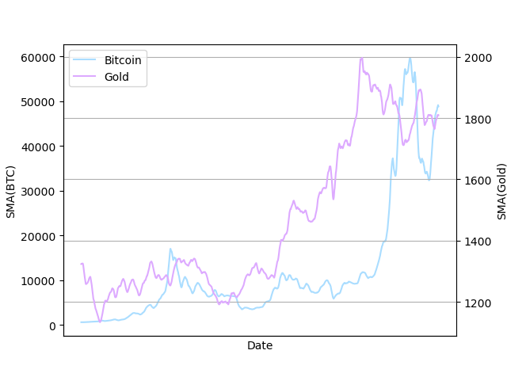

# 数据处理

对`BCHAIN-MKPRU.csv`、`LBMA-GOLD.csv`两个文件进行数据处理，统计得到比特币交易价格数据有1826项，黄金交易价格数据有1255项。

由于黄金只在交易日进行交易，周末和其他节假日数据为空，为了简化处理过程，我们使用前向填充（Forward Fill）的方法填补黄金交易价格在非交易日的空白。

讲黄金和比特币的交易数据进行对齐后，我们得到以下图表。可以看到五年间黄金和比特币整体呈上升趋势，然而比特币的涨幅远高于黄金。

|  |  |
| -------------------------- | -------------------------- |

进一步处理数据，我们选用SMA、MACD、KD线、RSI、R线随机振荡器五项指标来挖掘数据特征。

经过计算，各个指标的汇总数据如下表所示

|  |  |  |  |  |
| ------------------------------------------------------------ | ------------------------------------------------------------ | ------------------------------------------------------------ | ------------------------------------------------------------ | ------------------------------------------------------------ |

SMA 窗口移动平均数：我们将窗口的大小设置为15，得到的曲线与源数据曲线有一致的趋势

|  |  |
| ----------------------- | ----------------------- |

MACD 参数，我们通过计算快速移动平均值 EMA12 与 EMA26，并得到二者的差离值 DIF，最后得到差离平均值。从图中可以看出比特币的 MACD 曲线的波动远大于 黄金的 MACD 曲线，反映出比特币具有极大的不稳定性，意味着在进行投资决策时，对黄金和比特币的操作不能一概而论。 

|  |  |
| ------------------------------ | ------------------------------ |

KD线：有K线和D线组成，范围在0到1之间，用于衡量价格的变动速度，K线衡量的是当前收盘价在一定时间范围内的相对位置，反映了黄金和比特币价格在短时间内的波动情况？从图中我们可以找到很多小段较为平稳的时间段，(能够反应出一个时间段内比特币/黄金价格稳定上涨、下跌或保持平稳的状态)

RSI线：动量指标，时间间隔

R线：和K线和D线同理？

