<h1><center>3D游戏编程与设计 第一次作业</center></h1>

<center>郑有为 19335286</center>

[toc]

# 作业要求

编程实践，小游戏

- 游戏内容： **井字棋** 或 贷款计算器 或 简单计算器 等等
- 技术限制： 仅允许使用 **[IMGUI](https://docs.unity3d.com/Manual/GUIScriptingGuide.html)** 构建 UI
- 作业目的：
  - 了解 OnGUI() 事件，提升 debug 能力
  - 提升阅读 API 文档能力

> 井字棋，有ESC的概念，展示逻辑与业务逻辑要分开
>
> 3D作业评分指标：ECS的基本理念要在实验报告中体现。一个具体指标就是OnGUI代码少


# 项目文档

## 游戏说明 

这是一个在Unity3D上，使用IMGUI做的一个井字棋小游戏，界面上参照网站 https://playtictactoe.org/。

游戏具备双人模式和人机模式，通过点击右下角的小人图标即可转换模式，通过点击右下角的刷新图标可以重新开启一盘棋，先后手会随着游戏的进行而来回转变，战绩显示在右中间一栏，为"O胜局：平局：X胜局"。

## ECS

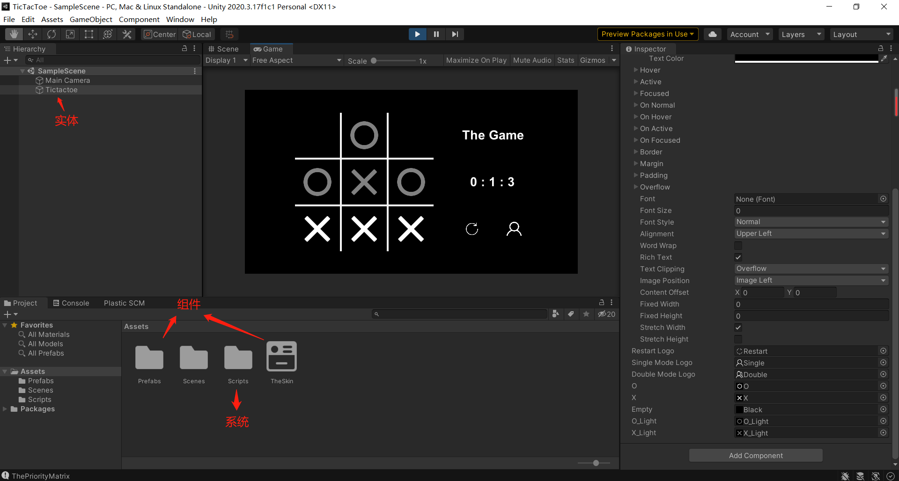

* 实体: 唯一的游戏对象Tictactoe。

* 组件: Prefabs文件夹里的图标文件和声明样式的GUISkin文件。

* 系统: Scripts文件夹里的四个C#文件 TheGame、ChessBoard、Player、Robot，负责处理游戏逻辑。

## 游戏效果

* 双人模式（可以看到连成一线的一方棋子会被高亮）

  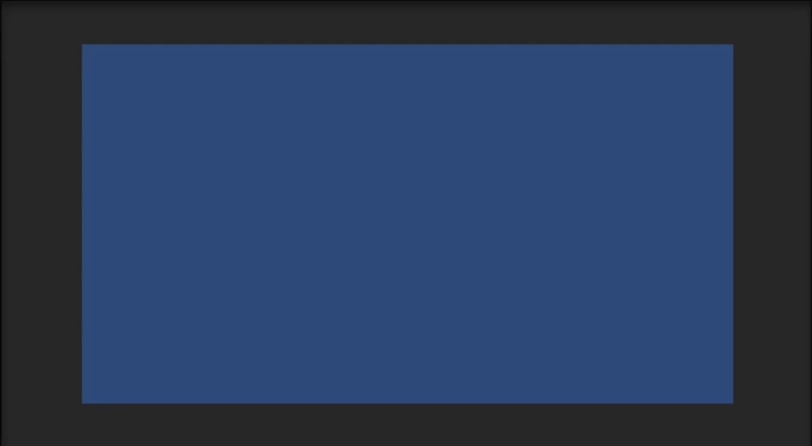

* 单人模式

  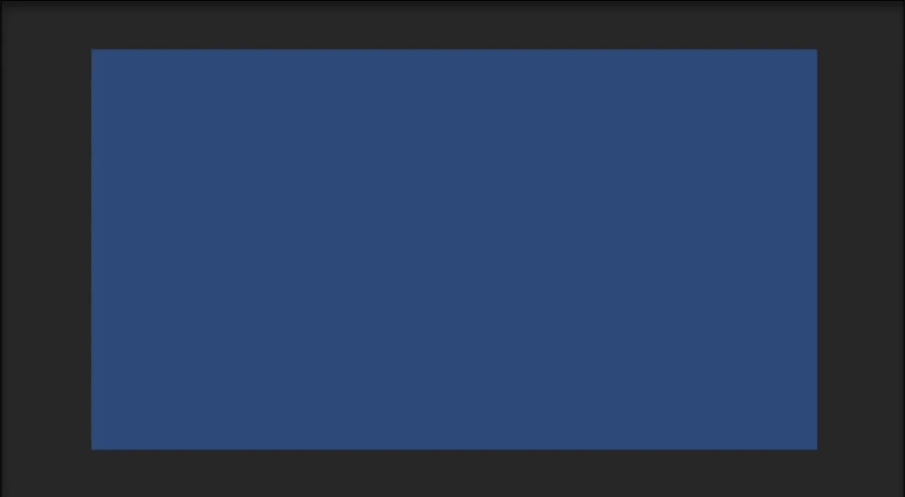

## UML类图

UML类图如下所示，游戏有四个类组成，其中`TheGame`是主类。

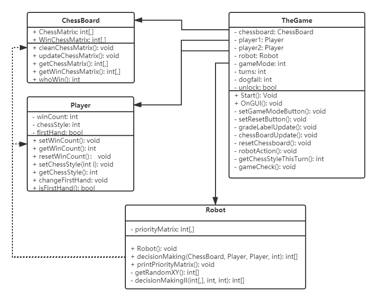

## 项目配置

**游戏搭建过程：**

1. 创建一个Unity 2D项目 Tictactoe

2. 右键创建一个空的游戏对象 Tictactoe

3. 在资源区（Assets）创建一个文件夹 Prefabs，并将所有图片资源拖进去（备注：所有资源已打包到Gitee仓库）

   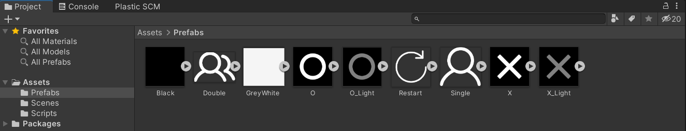

4. 在资源区创建一个文件夹 Scripts，将所有C#文件拖进去（TheGame，Player，Robot，ChessBoard类）

   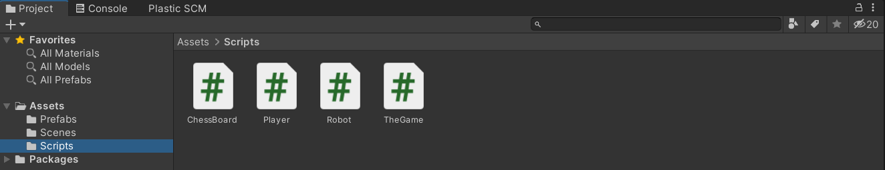

5. 创建一个GUISkin，配置TheSkin，配置内容如下：（背景：资源文件Black，文字颜色：白， 字体大小：20+）

   | Box                                                      | Button                                                      | Label                                                      |
   | -------------------------------------------------------- | ----------------------------------------------------------- | ---------------------------------------------------------- |
   | 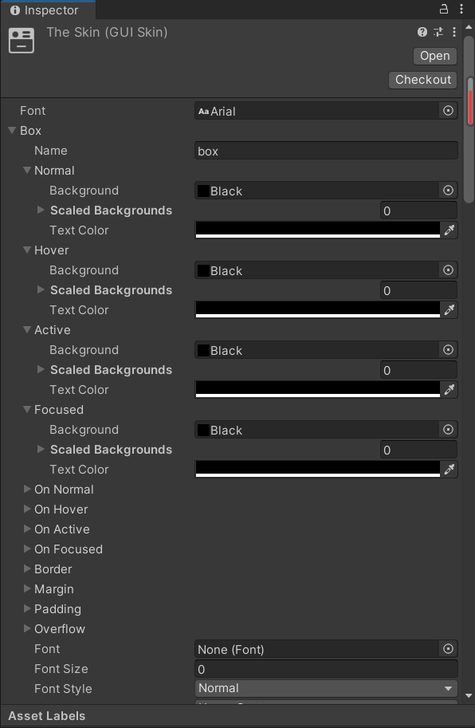 | 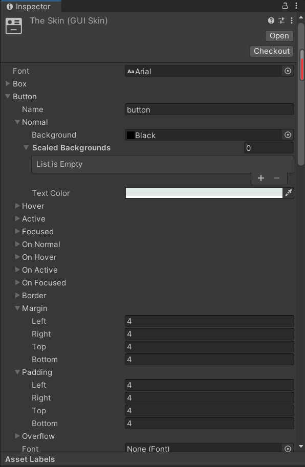 | 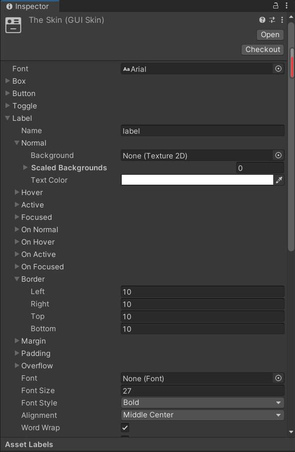 |

6. 点击游戏对象Tictactoe，将The Game类拖给该对象，然后按照如下方式配置The Game脚本里的所有GUISkin和Texture2D

   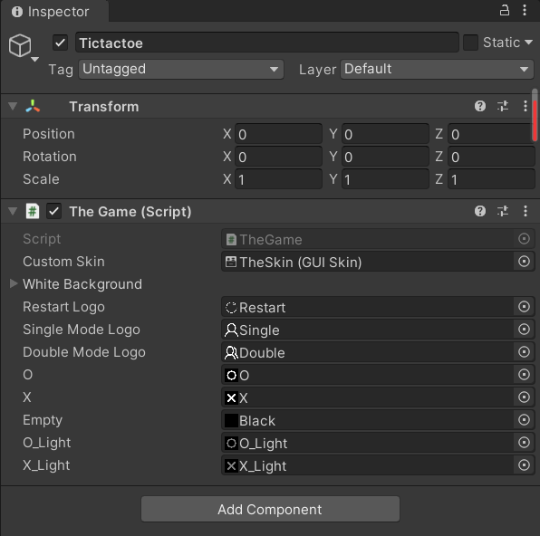

   注意不要忘记配置GUIStyle White Background，展开White Background并将GreyWhite拖入即可，如下所示

   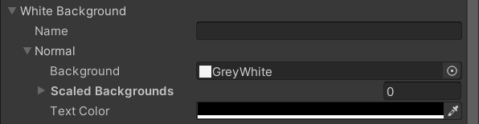

7. 配置完成后的资源文件如下，点击运行即可开始游戏

   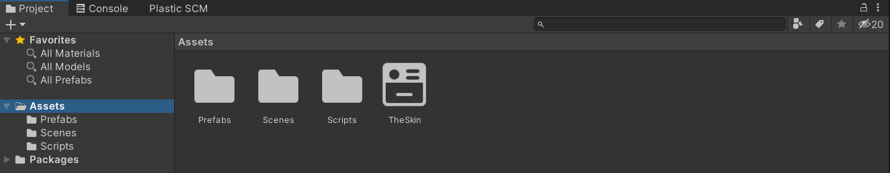

## OnGUI逻辑说明

* OnGUI()函数在每一帧都会调用，用于刷新游戏界面。在下面代码中，该函数负责整个游戏界面的布局，和游戏主要逻辑函数的调用。
  * 界面布局包括：背景板、棋盘、标题、更新按钮、变换模式按钮
  * 游戏逻辑大体是：**下棋 - 判定**，相关函数如下：
    * robotAction()：如果是在人机模式下机器人的回合，机器人会决定下一步要走的棋子并推进游戏过程，在其他状态下不进行操作
    * chessBoradUpdate()：生成棋子，并接受玩家的点击事件
    * gameCheck(): 进行胜负判定，如果有一方获胜或平局则锁定棋盘
  * 在IMGUI设计上，使用成组（BeginGroup/EndGroup）来生成相对位置简化各个组件的定位

``` c#
void OnGUI(){
    GUI.skin = customSkin;

    // Generate GamePad
    GUI.Box(new Rect(0, 0, Screen.width, Screen.height), ""); // Full Screen Game Pad

    GUI.BeginGroup(new Rect(Screen.width * 0.5f - 300, Screen.height * 0.5f - 200, gamePadWidth, gamePadHeight));

        GUI.Box(new Rect(padding + 2, padding + 2, 3 * chessSideLength - 4, 3 * chessSideLength - 4), "", whiteBackground); // 棋盘

        robotAction(); // 机器人回合：机器人下棋

        chessBoardUpdate(); // 显示棋子 + 玩家回合：玩家下棋

        gameCheck(); // 判定胜负

        GUI.Label(new Rect (2 * padding + 3 * chessSideLength, padding, 150, 100), "The Game"); // 游戏Title

        gradeLabelUpdate(); // 更新比分表

        GUI.BeginGroup(new Rect(2 * padding + 3 * chessSideLength, padding + 200, 150, 100));

            setResetButton(); // Reset Button: 重新开启一盘棋

            setGameModeButton(); // Game Mode Button: 更改游戏模式 - 人机/双人

        GUI.EndGroup ();

    GUI.EndGroup ();
}
```

## Robot的算法说明

众所周知，井字棋是一个**先手必不输，后手必不赢**的游戏，下面算法纯属是我脑洞，机器人也有可能会输（不然谁还愿意玩呢）。

1. 敌方棋子赋予权值-50，右方棋子赋予权值60，空位置权值为0。
2. 井字棋的赢法共有8种：横横横竖竖竖撇捺，每次在下棋前计算每一种赢法对应的位置棋子的权值之和的绝对值
3. 每一个空位置的优先级等于与它相关的赢法的权值的最大值。（例如最左上的位置，与他相关的赢法由最上一横和最左一竖）
4. 找到一个最大优先级的空位置，作为Robot下棋的位置。

> 举例：
>
> 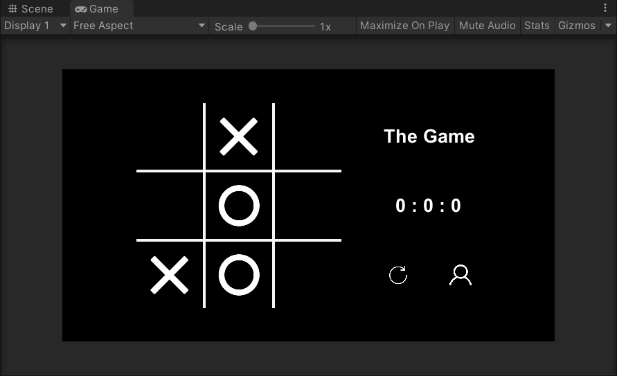
>
> O是玩家，X是机器人，下棋顺序是 O[1,1] -> X[2,0] -> O[2,1]，现在第四回合，轮到机器人下棋：
>
> 权值矩阵是：[[0,0,0],[0,-50,0],[60,-50,0]]
>
> 赢法矩阵是：[0,50,10,60,100,0,50,10] （横，横，横，（从左到右）竖，竖，竖，（从上到下）捺，撇）
>
> 优先级矩阵是：[[60,100,10],[60,0,50],[0,0,60]]
>
> 故选择位置[0,1]作为下一步棋。 

# 视频演示

视频地址：https://www.bilibili.com/video/BV1ob4y127vh/

