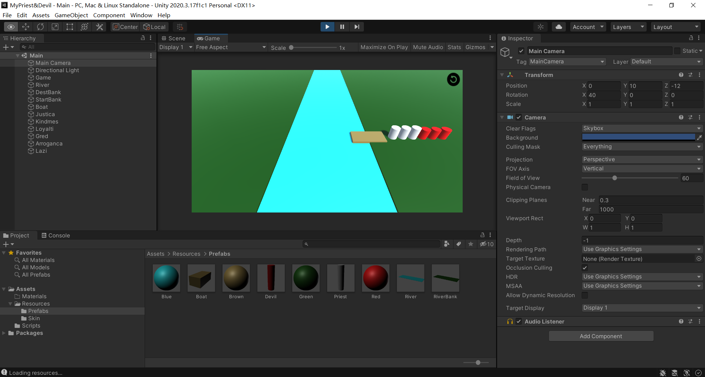
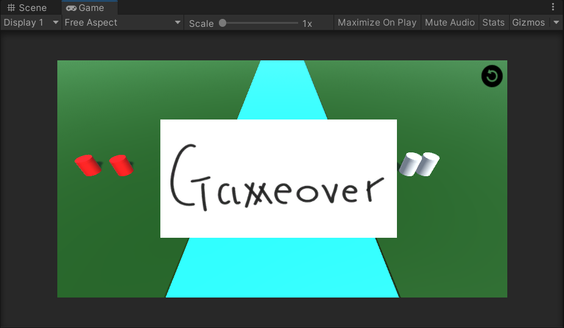
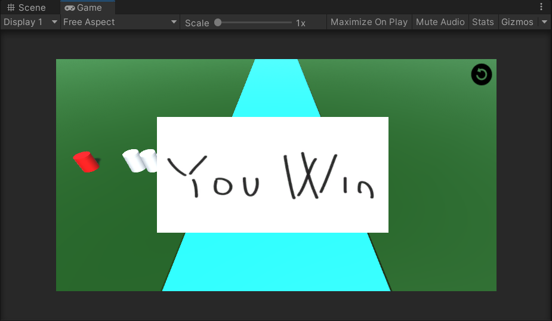
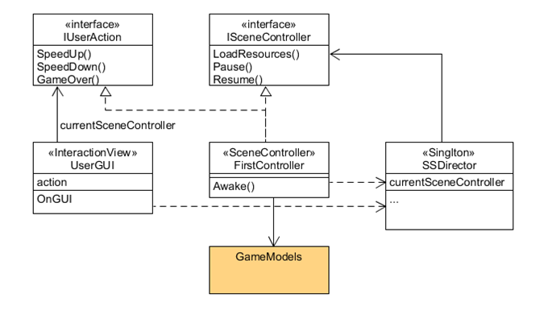

# 用Unity3D实现【牧师与魔鬼过河】

---

## 相关链接

项目仓库：https://gitee.com/WondrousWisdomcard/unity3d-homework

项目文档：https://gitee.com/WondrousWisdomcard/unity3d-homework/blob/master/Homework02/%E9%A1%B9%E7%9B%AE%E6%96%87%E6%A1%A3.md

演示视频：https://www.bilibili.com/video/BV1Nf4y177wF?spm_id_from=333.999.0.0

---
## 游戏规则

* 有三个牧师和三个魔鬼在河的一岸边等待过河
* 船一次最多搭载两人，最少搭载一人
* 一旦有一岸边有牧师，且牧师的数量少于魔鬼的数量，魔鬼就会把牧师吃掉，游戏失败
* 玩家需要使用策略让所有牧师和魔鬼成功到达河的对岸



|游戏失败|游戏成功|
| --- | --- |
|||

## MVC架构

MVC架构中的M、V、C分别指Model模型、View视图、Controller控制器，模型负责管理的就是游戏中个对象，View负责管理与玩家的交互，如点击游戏对象、点击重启按钮等，而控制器如其名，控制模型和视图，例如接收模型层的计算结果，再将其作为输入传入视图层以显示给玩家。

## 设计细节

### 第一步：分析游戏对象

在设计之初，我们首先需要分析游戏中有哪些对象：“牧师、魔鬼、船、河岸”还不够清晰，我们可以加入量词：“三个牧师、三个魔鬼、一艘船、两边河岸”，但还不够，还需要向三个牧师之间有没有区别，以此类推，例如河岸就有起点河岸和重点河岸，它们显然不同，而牧师之间和魔鬼之间，暂时还没有区别，所以最后的我们分析出的对象是：

**三个牧师、三个魔鬼、一艘船、起点河岸和终点河岸。**

> Tip: 分析游戏对象是在游戏设计前必须做的一件事，因为我们后续设计的模型类、控制器类和它们密切相关，如果没有好好去分析对象、分析对象数目、分析同类对象之间有没有差别，在之后的设计中可能会导致混乱。因此，分析对象可以用一个简单的三步走方法：“有什么对象” - “对象各有几个” - “同类对象之间有没有差别”。

### 第二步：分析玩家游戏行为

游戏行为与游戏规则密切相关，但往往一个游戏中游戏行为不会很多，我们可以使用一个表列出来。在我们分析好游戏行为后，将使用Fasade门面模式来实现交互行为的设计。

我们可以发现，牧师与魔鬼过河中的游戏行为有四个：点击牧师、点击魔鬼、点击船、重新开始游戏，我们发现点击牧师和点击魔鬼可以用点击角色来替换，因为二者的游戏行为本质上没有差别，再加上游戏行为少往往能让代码更加简短清晰，随意我们最终总结出三个游戏行为，如下表格所示：

| 动作 | 参数 | 结果 |
| --- | --- | --- |
| 重启游戏 gameRestart | | 所有游戏对象回到初始状态 |
| 点击牧师/魔鬼 clickCharacter | 指定角色 | 若在岸上则上船，若在船上则上岸 |
| 点击船 clickBoat | | 在有人在船上的前提下，移动到对岸 |

### 第三步：实现

我们使用MVC架构实现游戏。以下是MVC架构的UML类图模板，以GUI为后缀的类属于视图层、以Controller为后缀属于控制器层，以Model为后缀的类属于模型层，在接下来的类的设计中我们也遵循这样的命名规则。



我们从导演类开始，一步一步向下设计。

#### Director类

Director类负责“指挥”整个游戏，一个游戏中当然不应该出现多个导演，因此我们使用单例模式来保证导演全局唯一。

导演“手握”某个场景的控制器，但是由于游戏可能有多个场景，不同场景往往使用不同的控制器。我们不能指定某个具体的控制器类给导演，但是我们可以定义一个所有所有控制器都继承的类或者接口，所有控制器类都需要继承该类/接口，这样导演手中的控制器就可以“自由切换”，无论它们的实现类是代码如下。

``` c#
public class Director : System.Object
{
    // Singlton
    private static Director _instance;
    public ISceneController currentSceneController{ get; set; }

    public static Director getInstance(){
        if(_instance == null){
            _instance = new Director();
        }
        return _instance;
    }
}
```

#### ISceneController接口

ISceneController就是Direstor所持有的类型，作为借口，它所有的方法是所有控制器类待具体实现的，在这个牧师与魔鬼过河中，我们的场景只需要“加载资源”，因此该接口只规定了一个方法。

``` c#
public interface ISceneController{
    void loadResources();
}
```

#### IUserAction

直接上代码，定义了我们第二步时分析的三个用户行为动作，这里的参数是我们接下要定义的角色模型和船模型。同样的，控制器需要继承这个接口并实现三个方法。

``` c#
    public interface IUserAction{
    void gameRestart();
    void clickCharacter(CharacterModel characterModel);
    void clickBoat(BoatModel boatModel);
}
```

**接下来很容易想到，我们的去下一个目标是是实现控制器，但在这里我们先把控制器放在一边。因为它需要操纵所有的视图类和模型类，且视图类需要模型类。因此我们的实现顺序应该是先实现模型类，再实现视图类，最后实现控制器。**

#### Moveable类

Moveable类是一个组件类，为模型提供移动的方法。在创建游戏对象是，我们会将Moveable作为组件通过AddComponment函数加入到游戏对象中，这样我们就可以通过调用Moveable类的函数使得游戏对象进行移动。

我们定义了若干个状态，每种状态在之后处理各个动作的交互时有奇效。例如：我们可以通过规定角色运动在SHIPING状态时角色不处理用户点击时间。

在接下来的及各类中我们回频繁使用这样的静态参数，这样可以在类的外部直接调用，并易于理解。

* WAITING：等待
* EMBARK：上船
* SHIPING：乘船移动
* DISEMBARK：下船

``` c#
using System.Collections;
using System.Collections.Generic;
using UnityEngine;

public class Moveable: MonoBehaviour{

    public static int WAITING = 0;
    public static int EMBARK = 1;
    public static int SHIPING = 2;
    public static int DISEMBARK = 3;

    private const float SPEED = 0.1F;
    private Vector3 destPosition;
    private int currentState;

    public void Update(){
        if(currentState != WAITING && transform.position != destPosition){
            transform.position = Vector3.MoveTowards(transform.position, destPosition, SPEED);
        }
        else{
            currentState = WAITING;
        }
    }


    public void setDestPosition(Vector3 destPosition){
        this.destPosition = destPosition;
    }

    public void setCurrentState(int currentState){
        this.currentState = currentState;
    }

    public int getCurrentState(){
        return this.currentState;
    }
    
    public void resetMoveable(){
        currentState = WAITING;
    }
}
```

#### CharacterModel

Character通过它的类别CharacterType区分是牧师（CharacterModel.PRIEST）还是魔鬼（CharacterModel.DEVIL），通过它的状态CharacterState来区分是在起点岸上（CharacterModel.ASHORE_START），还是在终点岸上（CharacterModel.ASHROE_DESTINATION），还是在船上（CharacterModel.ONBOARD）。

一个CharacterModel包含GameObject对象，起始位置和Moveable对象，我们将给每一个牧师、恶魔都分配一个CharacterModel。

``` c#
using System.Collections;
using System.Collections.Generic;
using UnityEngine;

public class CharacterModel{
    private GameObject character;
    private CharacterGUI characterGUI;
    private Moveable moveable; 
    private Vector3 initialPosition;

    private int characterType;
    private int characterState;

    public static int PRIEST = 0;
    public static int DEVIL = 1; 
    public static int ASHORE_START = 0;
    public static int ASHORE_DESTINATION = 1;
    public static int ONBOARD = 2;

    public CharacterModel(int characterType, string characterName, Vector3 position){
        this.characterType = characterType;
        this.characterState = ASHORE_START;
        this.initialPosition = position;

        if(characterType == PRIEST){
            character = Object.Instantiate (Resources.Load ("Prefabs/Priest", typeof(GameObject)), Vector3.zero, Quaternion.identity, null) as GameObject;
        }
        else if(characterType == DEVIL){
            character = Object.Instantiate (Resources.Load ("Prefabs/Devil", typeof(GameObject)), Vector3.zero, Quaternion.identity, null) as GameObject;
        }

        character.name = characterName;  
        character.transform.position = position;
        moveable = character.AddComponent (typeof(Moveable)) as Moveable;
        characterGUI = character.AddComponent (typeof(CharacterGUI)) as CharacterGUI;
        characterGUI.SetCharacterGUI(UserGUI.CHARACTER, this);
    }

    public int getCharacterType(){
        return characterType;
    }

    public int getCharacterState(){
        return characterState;
    }

    public Vector3 getInitialPosition(){
        return initialPosition;
    }

    public GameObject getGameObject(){
        return character;
    }

    public void setCharacterState(int characterState){
        this.characterState = characterState;
    }

    public void setCharacterPosition(Vector3 position){
        character.transform.position = position;
    }

    public void moveCharacterPosition(Vector3 position, int state){
        moveable.setDestPosition(position);
        moveable.setCurrentState(state);
    }

    public void resetCharacter(){
        moveable.resetMoveable();
        characterState = ASHORE_START;
        setCharacterPosition(initialPosition);
    }
}
```

#### BoatModel

BoatModel比CharacterModel稍微复杂一些，因为它需要载人。

除了游戏对象，位置信息和Moveable对象，BoatModel对象中还包含座位数组sits和Character对象数组，用与记录当前上船的人。

SHIPING、PARKING_DESTINATION、PARKING_START分别代表船的三种状态：行驶中、停泊在终点河岸、停泊在起点河岸。

BoatModel对象提供函数`getEmptySitsCount()`来获取有当前船上空位置个数，提供函数`getOccupiedSitsCount()`来获取船上的人数；提供`getASits()`和`leaveASit()`来模拟角色上船和下船。

``` c#
public class BoatModel
{
    private GameObject boat;
    private BoatGUI boatGUI;
    private Moveable moveable; 
    private Vector3 startPosition, destinationPosition;

    private int boatState;
    
    private int[] sits = new int[2];
    private CharacterModel[] characterModels = new CharacterModel[2];
    private static int EMPTY_SIT = 0;
    private static int OCCUPIED_SIT = 1;

    public static int SHIPING = 0;
    public static int PARKING_DESTINATION = 1;
    public static int PARKING_START = 2;

    public BoatModel(Vector3 startPosition, Vector3 destinationPosition){
        this.boatState = PARKING_START;

        boat = Object.Instantiate <GameObject> (Resources.Load <GameObject> ("Prefabs/Boat"), Vector3.zero, Quaternion.identity);
        boat.name = "Boat";

        boat.transform.position = startPosition;
        this.startPosition = startPosition;
        this.destinationPosition = destinationPosition;
        moveable = boat.AddComponent (typeof(Moveable)) as Moveable;
        boatGUI = boat.AddComponent (typeof(BoatGUI)) as BoatGUI;
        boatGUI.SetBoatGUI(UserGUI.BOAT, this);

        sits[0] = sits[1] = EMPTY_SIT;
    }

    public int getOccupiedSitsCount(){
        int num = 0;
        for(int i = 0; i < 2; i++){
            if(sits[i] == OCCUPIED_SIT){
                num++;
            }
        }
        return num;
    }
    public int getEmptySitsCount(){
        return 2 - getOccupiedSitsCount();
    }

    public Vector3 getASit(CharacterModel characterModel){
        for(int i = 0; i < 2; i++){
            if(sits[i] == EMPTY_SIT){
                characterModel.getGameObject().transform.parent = boat.transform;
                sits[i] = OCCUPIED_SIT;
                characterModels[i] = characterModel;
                if(characterModel.getCharacterState() == CharacterModel.ASHORE_START){
                    return getStartPosition() - Vector3.right * 0.6F + Vector3.right * 1.2F * i;
                }
                else if(characterModel.getCharacterState() == CharacterModel.ASHORE_DESTINATION){
                    return getDestinationPosition() - Vector3.right * 0.6F + Vector3.right * 1.2F * i;
                }
               
            }
        }
        return characterModel.getInitialPosition();
    }

    public void leaveASit(CharacterModel characterModel){
        for(int i = 0; i < 2; i++){
            if(characterModels[i] == characterModel){
                sits[i] = EMPTY_SIT;
                characterModel.getGameObject().transform.parent = null;
                characterModels[i] = null;
            }
        }
    }

    public void setBoatState(int boatState){
        this.boatState = boatState;
    }

    public int getBoatState(){
        return boatState;
    }

    public void setBoatPosition(Vector3 position){
        boat.transform.position = position;
    }

    public Vector3 getStartPosition(){
        return startPosition;
    }
    public Vector3 getDestinationPosition(){
        return destinationPosition;
    }

    public int getMoveableCurrentState(){
        return moveable.getCurrentState();
    }

    public GameObject getGameObject(){
        return boat;
    }

    public void moveBoatPosition(Vector3 position, int state){
        moveable.setDestPosition(position);
        moveable.setCurrentState(state);
    }

    public void resetBoat(){
        moveable.resetMoveable();
        boatState = PARKING_START;
        setBoatPosition(startPosition);
        for( int i = 0; i < 2; i++){
            sits[i] = EMPTY_SIT;
            if(characterModels[i] != null){
                characterModels[i].getGameObject().transform.parent = null;
                characterModels[i] = null;
            }
        }
    }
    
}
```

**以上是三个业务模型类，接下来分析视图层**

#### UserGUI

UserGUI是一个抽象类，可以被BoatGUI和CharacterGUI继承，分别实现不同的OnMouseDown点击事件。

``` c#
public abstract class UserGUI: MonoBehaviour{
    protected IUserAction userAction;
    protected int clickedObjectType;
    public static int CHARACTER = 0;
    public static int BOAT = 1;

    void Start(){
        userAction = Director.getInstance().currentSceneController as IUserAction;
    }

}
```

#### BoatGUI

直接看代码：

``` c#
public class BoatGUI : UserGUI
{
    private BoatModel boatModel;

    public void SetBoatGUI(int clickedObjectType, BoatModel boatModel){
        this.clickedObjectType = clickedObjectType;
        if(clickedObjectType == BOAT){
            this.boatModel = boatModel;
        }
    }

    void OnMouseDown(){
        userAction.clickBoat(boatModel);    
    }
}
```

#### CharacterGUI

和BoatGUI类似。

``` c#
public class CharacterGUI : UserGUI
{
    private CharacterModel characterModel;

    public void SetCharacterGUI(int clickedObjectType, CharacterModel characterModel){
        this.clickedObjectType = clickedObjectType;
        if(clickedObjectType == CHARACTER){
            this.characterModel = characterModel;
        }
    }

    void OnMouseDown(){
        userAction.clickCharacter(characterModel);
    }
}
```

#### SceneGUI

SceneGUI不处理游戏对象的点击事件，而是处理游戏之外的逻辑，包括定义GUISkin、显示Gamover、You win和重新开始按钮。

SceneGUI需要获得游戏输赢(gameState)，并以静态变量表示：UNKONWN、WIN、LOSE，而unlock用于锁定游戏状态。

``` c#
public class SceneGUI : MonoBehaviour
{
    private IUserAction userAction;
    private bool unlock;
    private int gameState;

    public static int UNKNOWN = 0;
    public static int WIN = 1;
    public static int LOSE = 2;

    void Start(){
        unlock = true;
        gameState = 0;
        userAction = Director.getInstance().currentSceneController as IUserAction;
    }

    public void setGameState(int state){
        gameState = state;
    }

    public bool getUnlock(){
        return unlock;
    }

    void OnGUI(){
        GUI.skin = Resources.Load <GUISkin> ("Skin/MySkin");

        // Restart Button
        if(GUI.Button(new Rect(Screen.width - 50, 0, 50, 50), " ")) {
            setGameState(UNKNOWN);
            userAction.gameRestart();
            unlock = true;
        }

        if(gameState == WIN){
            unlock = false;
            GUI.Label(new Rect(Screen.width / 2 - 200, Screen.height / 2 - 100, 400, 200), Resources.Load <Texture2D> ("Skin/Win"));
        }
        else if(gameState == LOSE){
            unlock = false;
            GUI.Label(new Rect(Screen.width / 2 - 200, Screen.height / 2 - 100, 400, 200), Resources.Load <Texture2D> ("Skin/Gameover"));
            
        }
    }
}

```

#### MainSceneController

最后是控制器，控制器实现ISceneController和IUserAction，操控所有的游戏对象、模型和GUI。

控制器中不仅实现了游戏行为，还实现了游戏胜负判定（gameJudge()）,和简单游戏对象的生成（generateGameObject()）。

虽然代码量比其它类长，但是它各个函数的功能清晰明了。

``` c#
using System.Collections;
using System.Collections.Generic;
using UnityEngine;

public class MainSceneController : MonoBehaviour, ISceneController, IUserAction
{
    
    Vector3 riverPosition = new Vector3(0,0,0); // 10 X 10 X 1
    Vector3 leftBankPosition = new Vector3(-35,0,0); // 10 X 10 X 1.2
    Vector3 rightBankPosition = new Vector3(35,0,0); // 10 X 10 X 1.2
    Vector3 boatStartPosition = new Vector3(5,0,0); // 2 X 4 X 0.5
    Vector3 boatDestinationPosition = new Vector3(-5,0,0); 
    Vector3[] characterInitPosition = new Vector3[6];

    GameObject river, leftBank, rightBank;
    BoatModel boatModel;
    CharacterModel[] priests = new CharacterModel[3];
    CharacterModel[] devils = new CharacterModel[3];

    SceneGUI sceneGUI;

    void Awake(){
        Debug.Log("Preparing...");
        Director director = Director.getInstance();
        director.currentSceneController = this;
        director.currentSceneController.loadResources();
        sceneGUI = gameObject.AddComponent (typeof(SceneGUI)) as SceneGUI;
    }

    void generateGameObjects(){
        // River
        river = Instantiate <GameObject> (Resources.Load <GameObject> ("Prefabs/River"), riverPosition, Quaternion.identity);
        river.name = "River";

        // The Bank
        leftBank = Instantiate <GameObject> (Resources.Load <GameObject> ("Prefabs/RiverBank"), leftBankPosition, Quaternion.identity);
		leftBank.name = "DestBank";
        rightBank = Instantiate <GameObject> (Resources.Load <GameObject> ("Prefabs/RiverBank"), rightBankPosition, Quaternion.identity);
		rightBank.name = "StartBank";
        
        // Boat
        boatModel = new BoatModel(boatStartPosition, boatDestinationPosition);

        // Priests & Devils
        for(int i = 0; i < 6; i++){
            characterInitPosition[i] = rightBankPosition + Vector3.right * (i * 1.2F - 2 - 25);
        }

        priests[0] = new CharacterModel(CharacterModel.PRIEST, "Justica", characterInitPosition[0]);
        priests[1] = new CharacterModel(CharacterModel.PRIEST, "Kindmes", characterInitPosition[1]);
        priests[2] = new CharacterModel(CharacterModel.PRIEST, "Loyalti", characterInitPosition[2]);

        devils[0] = new CharacterModel(CharacterModel.DEVIL, "Gred", characterInitPosition[3]);
        devils[1] = new CharacterModel(CharacterModel.DEVIL, "Arroganca", characterInitPosition[4]);
        devils[2] = new CharacterModel(CharacterModel.DEVIL, "Lazi", characterInitPosition[5]);
    }

    public void loadResources(){
        Debug.Log("Loading resources...");
        generateGameObjects();
    }

    public void gameRestart(){
        Debug.Log("Restart game...");
        boatModel.resetBoat();
        for(int i = 0; i < 3; i++){
            priests[i].resetCharacter();
            devils[i].resetCharacter();
        }
    }

    public void clickCharacter(CharacterModel characterModel){
        if(characterModel.getCharacterType() == CharacterModel.PRIEST){
            Debug.Log("Priest clicked");
        }
        else if(characterModel.getCharacterType() == CharacterModel.DEVIL){
            Debug.Log("Devil clicked");
        }

        if(characterModel.getCharacterState() == CharacterModel.ASHORE_START && boatModel.getBoatState() == BoatModel.PARKING_START){
            // StartBank 上船
            if(boatModel.getEmptySitsCount() != 0){
                characterModel.moveCharacterPosition(boatModel.getASit(characterModel), Moveable.EMBARK);
                characterModel.setCharacterState(CharacterModel.ONBOARD);
            } 
        }
        else if(characterModel.getCharacterState() == CharacterModel.ASHORE_DESTINATION && boatModel.getBoatState() == BoatModel.PARKING_DESTINATION){
            // DestinationBank 上船
            if(boatModel.getEmptySitsCount() != 0){
                characterModel.moveCharacterPosition(boatModel.getASit(characterModel), Moveable.EMBARK);
                characterModel.setCharacterState(CharacterModel.ONBOARD);
            }
        }
        else if(characterModel.getCharacterState() == CharacterModel.ONBOARD){
            if(boatModel.getBoatState() == BoatModel.PARKING_START){ 
                // StartBank 下船
                boatModel.leaveASit(characterModel);
                characterModel.moveCharacterPosition(characterModel.getInitialPosition(), Moveable.DISEMBARK);
                characterModel.setCharacterState(CharacterModel.ASHORE_START);

            }
            else if(boatModel.getBoatState() == BoatModel.PARKING_DESTINATION){
                // DestinationBank 下船
                boatModel.leaveASit(characterModel);
                characterModel.moveCharacterPosition(characterModel.getInitialPosition() - Vector3.right * 2 * characterModel.getInitialPosition().x, Moveable.DISEMBARK);
                characterModel.setCharacterState(CharacterModel.ASHORE_DESTINATION);
            }
        }

    }

    public void clickBoat(BoatModel boatModel){
        Debug.Log("Boat clicked");
        if(boatModel.getOccupiedSitsCount() != 0){
            if(boatModel.getBoatState() == BoatModel.PARKING_START){
                // StartBank -> DestinationBank
                boatModel.moveBoatPosition(boatModel.getDestinationPosition(), Moveable.SHIPING);
                boatModel.setBoatState(BoatModel.PARKING_DESTINATION);
            }
            else if(boatModel.getBoatState() == BoatModel.PARKING_DESTINATION){
                // DestinationBank -> StartBank
                boatModel.moveBoatPosition(boatModel.getStartPosition(), Moveable.SHIPING);
                boatModel.setBoatState(BoatModel.PARKING_START);
            }
        }
    }

    void Update(){
        if(sceneGUI.getUnlock() ==  true){
            gameJudge();
        }
    }

    public void gameJudge(){
        int startDevilNum = 0, destinationDevilNum = 0;
        int startPriestNum = 0, destinationPriestNum = 0;

        if(boatModel.getMoveableCurrentState() == Moveable.SHIPING){
            return;
        }

        for(int i = 0; i < 3; i++){
            if(priests[i].getCharacterState() == CharacterModel.ASHORE_START){
                startPriestNum++;
            }
            else if(priests[i].getCharacterState() == CharacterModel.ASHORE_DESTINATION){
                destinationPriestNum++;
            }

            if(devils[i].getCharacterState() == CharacterModel.ASHORE_START){
                startDevilNum++;
            }
            else if(devils[i].getCharacterState() == CharacterModel.ASHORE_DESTINATION){
                destinationDevilNum++;
            }
        }

        if(boatModel.getOccupiedSitsCount() != 0){
            if(boatModel.getBoatState() == BoatModel.PARKING_START){
                startPriestNum = 3 - destinationPriestNum;
                startDevilNum = 3 - destinationDevilNum;
            }
            else if(boatModel.getBoatState() == BoatModel.PARKING_DESTINATION){
                destinationPriestNum = 3 - startPriestNum;
                destinationDevilNum = 3 - startDevilNum;
            }
        }

        if((startPriestNum != 0 && startPriestNum < startDevilNum) || (destinationPriestNum != 0 && destinationPriestNum < destinationDevilNum)){
            Debug.Log("Game Over");
            sceneGUI.setGameState(SceneGUI.LOSE);
        }

        if(destinationPriestNum == 3 && destinationDevilNum == 3){
            Debug.Log("You Win");
            sceneGUI.setGameState(SceneGUI.WIN);
        }

    }
}

```

---

### UML

以下是这个小游戏最终的类图，经过了多次改动，蓝色部分是View视图层，紫色部分是Model层，红色部分是控制器层。

最终的设计仍然存在不足，在接下来分析代码中可以看到控制器的职责分配不够合理。


