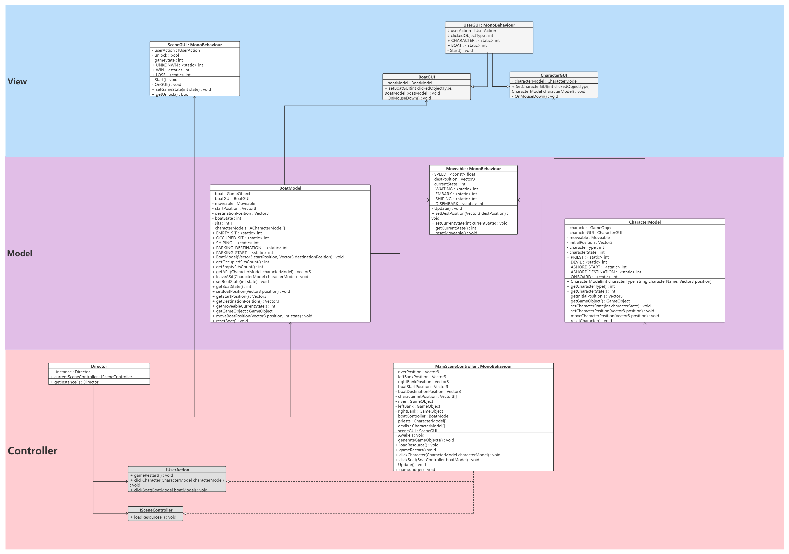

<h1>
3D游戏编程与设计 第二次作业
</h1>

郑有为 19335286

[toc]

# 作业要求

编程实践，3D小游戏：牧师与魔鬼

- 列出游戏中提及的事物（Objects）
- 用表格列出玩家动作表（规则表），注意，动作越少越好
- 请将游戏中对象做成预制，并在 GenGameObjects 中创建长方形、正方形、球 及其色彩代表游戏中的对象。
- 使用 C# 集合类型 有效组织对象
- 整个游戏仅 主摄像机 和 一个 Empty 对象， **其他对象必须代码动态生成！！！**整个游戏不许出现 Find 游戏对象， SendMessage 这类突破程序结构的通讯耦合语句。
- 请使用课件架构图编程，**不接受非 MVC 结构程序**
- 注意细节，例如：船未靠岸，牧师与魔鬼上下船运动中，均不能接受用户事件！

# 项目文档

## 游戏说明 

这是一个在Unity3D上，基于MVC结构编写的一个小游戏：牧师与魔鬼过河。玩家需要控制三个牧师（白色圆柱）和三个魔鬼（红色圆柱）全部到达河对岸，但船一次最多乘坐两人，并且一旦有一岸魔鬼数目大于牧师，魔鬼就会杀死牧师，游戏失败。

* **游戏中提及的事物**：两河岸、一条河、一艘船、三个牧师、三个魔鬼

* **玩家动作规则表**：

  | 动作                         | 参数     | 结果                             |
  | ---------------------------- | -------- | -------------------------------- |
  | 重启游戏 gameRestart         |          | 所有游戏对象回到初始状态         |
  | 点击牧师/魔鬼 clickCharacter | 指定角色 | 若在岸上则上船，若在船上则上岸   |
  | 点击船 clickBoat             |          | 在有人在船上的前提下，移动到对岸 |

## 游戏效果

Gameover：

You Win：

## 游戏搭建

1. 新建一个3D项目
2. 下载[Assets](https://gitee.com/WondrousWisdomcard/unity3d-homework/tree/master/Homework02/%E9%A1%B9%E7%9B%AE%E4%BB%A3%E7%A0%81/Assets)文件夹，替换项目的空Assets文件夹
3. Assets窗口中双击 Main 场景
4. 手动调整摄像头视角：Position：0 10 -12；Rotation：40 0 0

## 实现思路和模块介绍

### MVC架构

MVC架构由 Model 业务模型 View 视图 Controller 控制器组成。

> MVC架构是一种软件设计典范，用一种业务逻辑和数据显式分离的方法组织代码，将业务逻辑聚集到一个部件里面，在界面和用户围绕数据的交互能被改进和个性化定制的同时而不需要重新编写业务逻辑。MVC被独特的发展起来用于映射传统的输入、处理和输出功能在一个逻辑的图形化用户界面的结构中。
>
> **Model（模型）**是应用程序中用于处理应用程序数据逻辑的部分。通常模型对象负责在数据库中存取数据。模型表示企业数据和业务规则。在MVC的三个部件中，模型拥有最多的处理任务。例如它可能用像EJBs和ColdFusion Components这样的构件对象来处理数据库，被模型返回的数据是中立的，就是说模型与数据格式无关，这样一个模型能为多个视图提供数据，由于应用于模型的代码只需写一次就可以被多个视图重用，所以减少了代码的重复性。
>
> **View（视图）**是应用程序中处理数据显示的部分。通常视图是依据模型数据创建的。视图是用户看到并与之交互的界面。MVC好处是它能为应用程序处理很多不同的视图。在视图中其实没有真正的处理发生，不管这些数据是联机存储的还是一个雇员列表，作为视图来讲，它只是作为一种输出数据并允许用户操纵的方式。
>
> **Controller（控制器）**是应用程序中处理用户交互的部分。通常控制器负责从视图读取数据，控制用户输入，并向模型发送数据。控制器接受用户的输入并调用模型和视图去完成用户的需求，所以当单击Web页面中的超链接和发送HTML表单时，控制器本身不输出任何东西和做任何处理。它只是接收请求并决定调用哪个模型构件去处理请求，然后再确定用哪个视图来显示返回的数据。

MVC模型的UML类图框架：

### UML类图

具体游戏的UML类图如下：其中蓝色一层为视图层、紫色一层为业务模型层、红色一层为控制器层。

* **视图层：由SceneGUI、UserGUI、BoatGUI、CharacterGUI组成**。BoatGUI和CharacterGUI继承UserGUI，分别用于处理玩家对船模型和角色模型（牧师与魔鬼）的点击动作，而SceneGUI用于处理游戏之外的操作，包括”重新开始“、显示游戏结束等。
* **业务模型层：由组件类Moveable和模型类BoatModel和CharacterModel组成，负责管理和处理这两种类型对象的数据，并向其他两层提供访问数据和操作的方法。**例如BoatModel向控制器层提供”玩家点击角色使其上下船“的方法：`getASit(...)`和`leaveSit(...)`；Moveable用于处理各个对象的移动，目前的移动方式为简单的匀速平移，只需扩展该类就可以实现不同形式的移动。
* **控制器层：由导演类、接口和MainSceneController类组成**。单例模式的Director负责管理一个控制当前游戏过程的控制器MainSceneController，MainSceneController实现IUserAction接口和ISceneController接口，两个接口分别定义用户操作和控制器任务。

出现的问题：其实应该在从MainSceneController中分离出一个GameModel，这样的话职责分配更加清晰，之后才能更好地对游戏进行扩展。

> **每一个类的具体实现思路写在了博客中**

## 核心算法

* MainSceneController.gameJudge() **游戏判断胜输赢的算法**：
  * 根据每一个Character的状态（characterState）统计每一侧的牧师数目和魔鬼数目；
  * 一旦有一侧的牧师数目不为零且魔鬼数目大于牧师数目，则游戏直接判输，结束；
  * 若重点河岸的牧师数目和魔鬼数目都为3，则说明所有人都以到达对岸，游戏判赢，结束。

# 视频演示

视频地址：https://www.bilibili.com/video/BV1Nf4y177wF?spm_id_from=333.999.0.0

