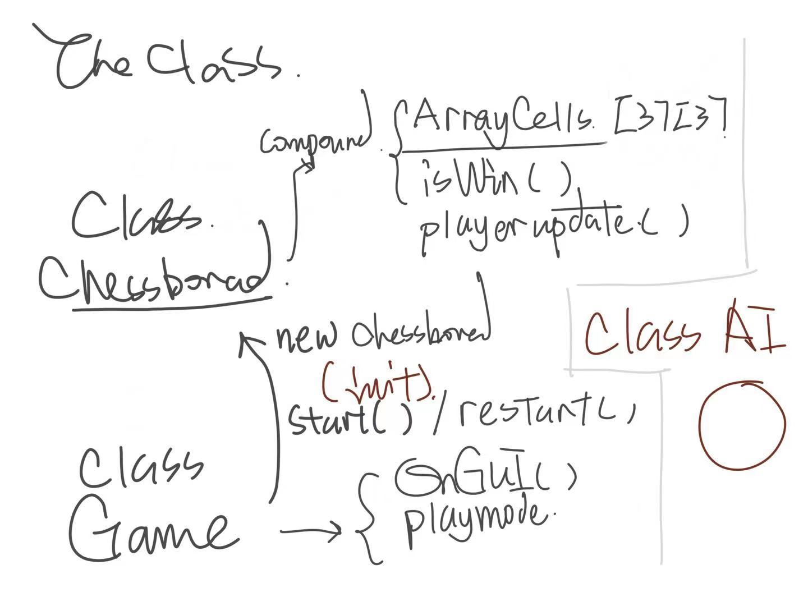
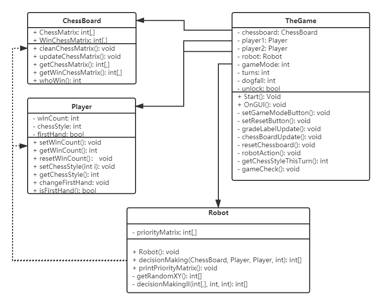
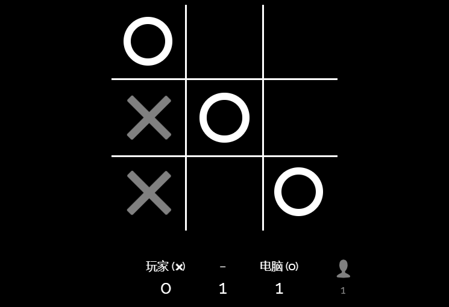
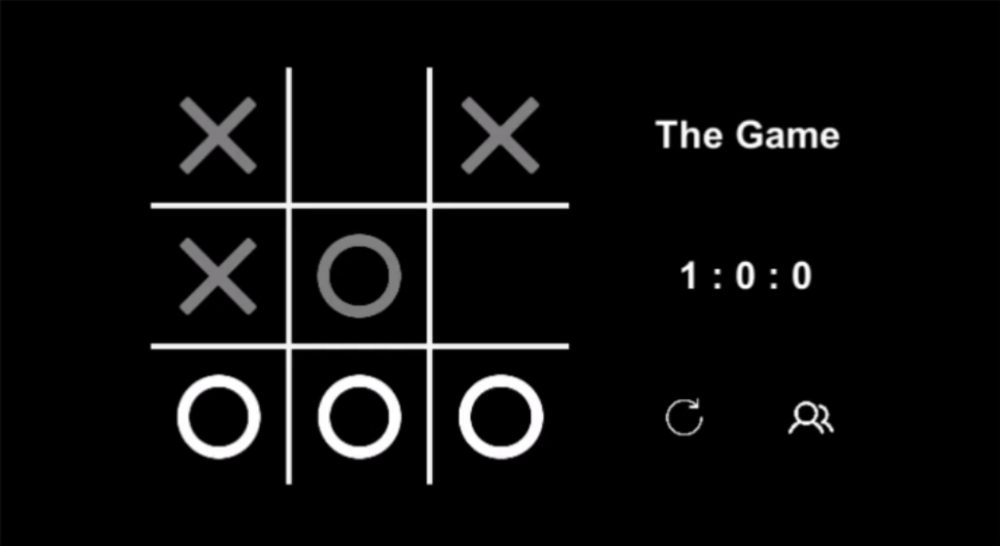

# 用Unity3D实现一个井字棋

> 想哭，博客都快写完了，垃圾电脑突然死机，之前Typora又没设置自动保存。我恨，特别想锤爆它

---

## 相关链接

项目仓库：https://gitee.com/WondrousWisdomcard/unity3d-homework

项目文档：https://gitee.com/WondrousWisdomcard/unity3d-homework/blob/master/Homework01/%E9%A1%B9%E7%9B%AE%E6%96%87%E6%A1%A3.md

演示视频：https://www.bilibili.com/video/BV1ob4y127vh/

---

## T H E  C L A S S E S

这是在某个课间，对井字棋的构想：



这是代码完成后，对应的UML类图：



其实，井字棋的实现很简单，一个类就能把所有功能搞定，但是由于这段时间我比较闲，准备在代码里体现一些C++、系统设计与分析里学到的OO思想，就整了几个类——分别对应参与组成游戏的不同元素：棋盘、玩家、决策机器人（人机模式）。

我的思路是棋盘的设计一定要与UI的设计分开，因而我将棋盘单独作为一个类，这样再单独实现棋盘类时不会去考虑他应该和游戏类如何交互，棋盘类只需要提供合适的接口函数，游戏类根据需要调用就可以了。（机器人类、玩家类也是如此）

可以看到，在具体实现的过程中，原来的构想被细化，这并不困难，但是从一点粗暴的设想到程序的实现这一过程十分有趣。设计完成后，虽然划分了类，但代码可读性也没有很高。

在实现过程中，我尽可能保持低耦合和高内聚，但是由于IMGUI的机制和我之前学的网页前端和Java的有些不同，后者是通过加入监听器（如OnClickListener）的方法来实现显示逻辑与交互逻辑的分离，但IMGUI不一样——OnGUI函数是一个每一帧都被调用的函数，我们使用IMGUI在每一帧刷新页面和页面内的各种组件，例如Button，Label等等，然后这就导致了Button这些需要和用户交互的组件，它的监听逻辑是通过一个条件判断来实现的：

``` c#
if(GUI.Button(...)){
    print("OnClick")
}
```

而在 TheGame 类的`chessBoardUpdate()`函数中，我需要一边生成棋子，一边判断用户点击。由于“用户点击棋盘”只有在未定胜负（棋盘未被锁定）、双人模式火或者人机模式的玩家回合下才能相应，棋盘中该点还是空位置的情况下才能执行，导致代码有一层又一层的条件判断，看起来很不美观。(然后我在这段代码中还需处理获胜方棋子高亮显示，导致代码很混乱)

下面是每一个棋子的显示代码（意味着外头还有两层循环嵌套）

``` c#
if(unlock == false && winMatrix[i,j] == false){
    // Light Chesses for highlighting the winner
    GUI.Button(new Rect(padding + j * chessSideLength + 2, padding + i * chessSideLength + 2, chessSideLength - 4, chessSideLength - 4), texture_Light);
}
else{ 
    // OnClick
    if(GUI.Button(new Rect(padding + j * chessSideLength + 2, padding + i * chessSideLength + 2, chessSideLength - 4, chessSideLength - 4), texture) && unlock){
        if(gameMode == DOUBLE || gameMode == SINGLE && chessStyleThisTurn == player1.getChessStyle()){
            if(chessboard.updateChessMatrix(chessStyleThisTurn, i, j)){
                turns++;
            }
        }   
    }
}
```

但其他部分都有很好地体现功能的分离，比如TheGame类中 一个专门更新记分牌的函数`gradeLabelUpdate()`、设置重新开始按钮的函数`setRestartButton()`、设置游戏模式的函数`setGameModeButton()`等等。

## T H E  L O O K

在做3D作业的时候，因为暑假在自学网页前端知识，也接触了安卓开发（主要是界面设计上），发现了很多设计UI的共性——比如Unity3D的GUISkin对应的是网页开发的CSS、安卓开发的XML文件，而且他们的属性大同小异，包括盒子模型、背景、字体等等。这使得我简单修改这些属性的值来达到自己想要的界面效果——而不是屈服于难看的默认样式（狗头）。

此外，在学习过程中我发现，往往都是设计师设计一个界面，程序员再根据设计稿来完成软件界面的设计，设计和UI实现两个过程应分离的，如果同时进行往往会出现设计效果受限于自己的代码实现思路——导致UI呈现的效果不够美观。于是我直接参照老师演示的井字棋网站 https://playtictactoe.org/ 的风格，实现了个长得类似（实际上动画效果一个也没有）的界面。

对于初学者而言，根据设计稿来实现有一个好处，就是自己会想尽办法实现图片的效果，这样往往需要查阅更多API和资料——使得收获也越多。

人家的效果：



我的效果：（虽然没有点击动画、胜利闪烁动画、也没有一致的字体和布局）



## E C S

我看半天知乎(https://zhuanlan.zhihu.com/p/71216954)觉得他写的好难懂——各种Unity3D提供的类、函数什么，然后自己就根据定义和自己的胡乱操作强行理解了一番ECS：

* E 实体：游戏对象
* C 组件：Assets里的各种东西，比如GUISkin、各种图片资源，各种需要在Unity3D中拖到游戏对象上的东西
* S 系统：实现游戏逻辑的C#代码

## T H E  T O O L S

1. 阿里的图标库 https://www.iconfont.cn/，在做小游戏时需要的一些图标可以从中找并下载下来，对于Unity3D可以直接下载为图片并拉到Assets就可以了，它们将作为Texture2D保存。
2. MP4转GIF网页 https://www.aconvert.com/cn/video/mp4-to-gif/# 无水印+免费+可下载
3. UML绘制 https://www.processon.com/ 是那种要自己打的（如果有自动根据代码生成的就好了）

