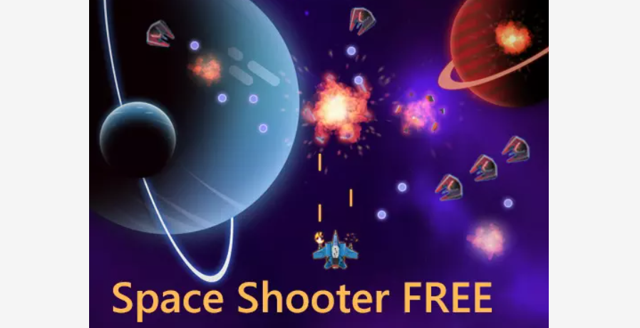
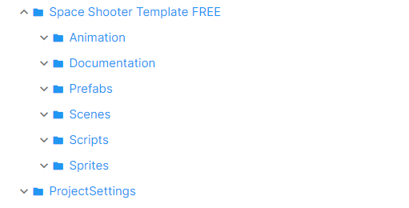
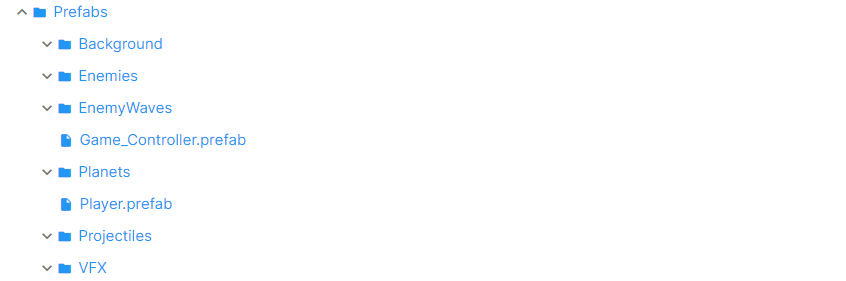
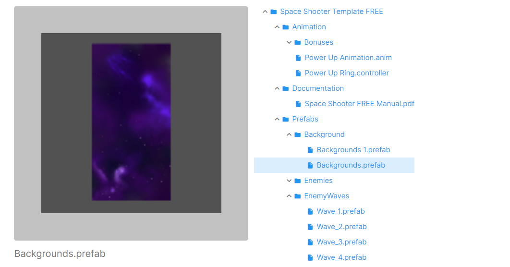
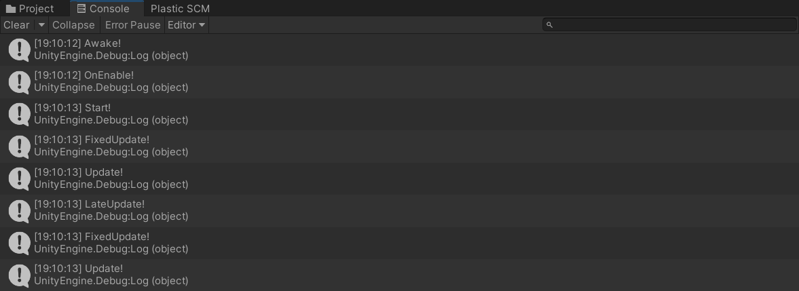

## 一、简答题

1. **解释 游戏对象（GameObjects） 和 资源（Assets）的区别与联系**

   以下是Unity Manual中对游戏对象和资源的定义

   > GameObjects: Every object in your game is a GameObject, from characters and collectible items to lights, cameras and special effects. However, a GameObject can’t do anything on its own; you need to give it properties before it can become a character, an environment, or a special effect.

   > Assets: An asset is any item that you use in your Unity project to create your game or app. Assets can represent visual or audio elements in your project, such as 3D models, textures, **sprites**, sound effects, or music. Assets can also represent more abstract items such as color gradients, animation masks, or arbitrary text or numeric data for any use.

   二者区别：

   * 游戏对象的实质是组织为类的代码，而资源的实质可以是代码，如动画控制器，渲染文件等，也可以是数据，如3D模型、音频、图像

   二者联系：

   * 游戏对象由各类资源整合而成，资源可以用来作为游戏对象的组件
   * 同一资源可以提供给不同的游戏对象 
   * 游戏对象和资源一同组成游戏

2. **下载几个游戏案例，分别总结资源、对象组织的结构（指资源的目录组织结构与游戏对象树的层次结构）**

   以Unity Asset Store中的免费游戏 [Space shooter](https://assetstore.unity.com/packages/templates/packs/space-shooter-free-107260#content)为例：

   

   其资源文件结构如下：

   

   从上到下依次是动画、游戏说明文档、预载资源、场景文件、脚本文件、游戏主体（精灵）的相关文件，一一展开，以Prefabs为例，可以看到该文件夹内有若干子文件夹：背景、敌人、敌人的攻击波、行星、玩家等等。在点集一个子文件夹，可以看到里面的资源文件，如图片

   

   

---

- 编写一个代码，使用 debug 语句来验证MonoBehaviour基本行为或事件触发的条件

  - 基本行为包括 Awake() Start() Update() FixedUpdate() LateUpdate()，它们的基本功能/触发时刻分别是唤醒、开始、更新、固定更新、晚于更新

  - 常用事件包括 OnGUI() OnDisable() OnEnable()，他们的触发事件分别是“当界面”、“当该对象不可用”、“当该对象可用”

  - 测试代码如下

    ``` c#
    using System.Collections;
    using System.Collections.Generic;
    using UnityEngine;
    
    public class TestMonoBhv : MonoBehaviour
    {
        void Start()
        {
            Debug.Log("Start!");
        }
    
        void Update()
        {
            Debug.Log("Update!");
        }
    
        void Awake()
        {
            Debug.Log("Awake!");
        }
    
        void FixedUpdate()
        {
            Debug.Log("FixedUpdate!");
        }
    
        void LateUpdate()
        {
            Debug.Log("LateUpdate!");
        }
    
        void OnGUI()
        {
            Debug.Log("OnGUI!");
        }
    
        void OnDisable()
        {
            Debug.Log("OnDisable!");
        }
    
        void OnEnable()
        {
            Debug.Log("OnEnable!");
        }
    }
    ```

  - 测试结果：选取最开头一段输出和种植游戏后的一段输出，可以看到在游戏启动时首先依次执行`Awake()`、`OnEnable()`、`Start()`，此后每帧执行`FixedUpdate()`、`Update()`、`LateUpdate()`、`OnGUI()`，在终止游戏时执行`OnDisable()`

    

    

---


- 查找脚本手册，了解GameObject，Transform，Component 对象
  - 分别翻译官方对三个对象的描述（Description）
  - 描述下图中 table 对象（实体）的属性、table 的 Transform 的属性、 table 的部件
    - 本题目要求是把可视化图形编程界面与 Unity API 对应起来，当你在 Inspector 面板上每一个内容，应该知道对应 API。
    - 例如：table 的对象是 GameObject，第一个选择框是 activeSelf 属性。
  - 用 UML 图描述 三者的关系（请使用 UMLet 14.1.1 stand-alone版本出图）
- 资源预设（Prefabs）与 对象克隆 (clone)
  - 预设（Prefabs）有什么好处？
  - 预设与对象克隆 (clone or copy or Instantiate of Unity Object) 关系？
  - 制作 table 预制，写一段代码将 table 预制资源实例化成游戏对象