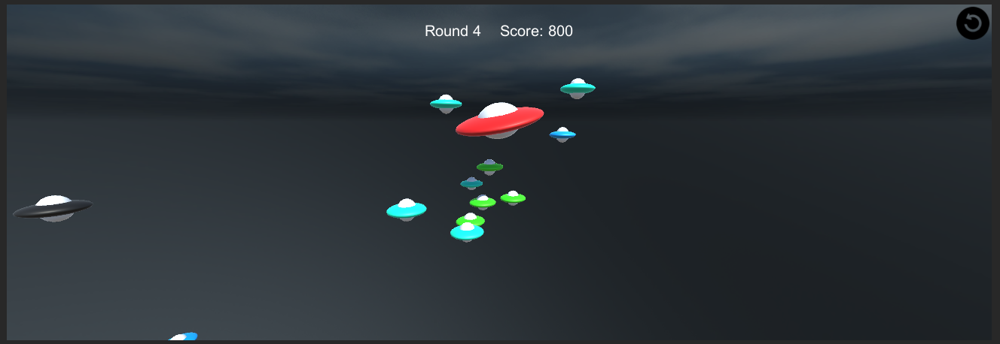
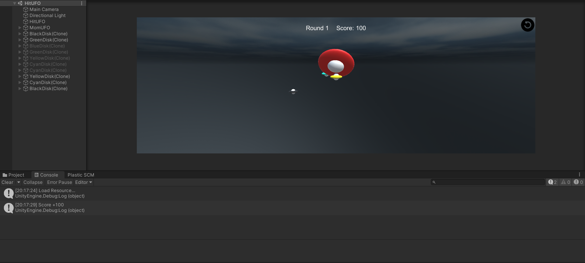
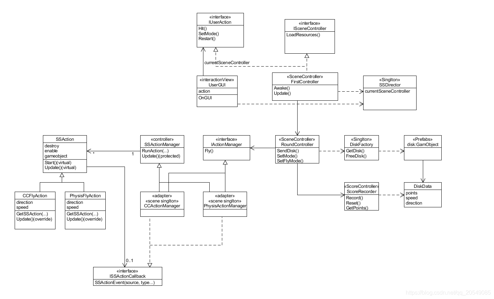

<h1><center>3D游戏编程与设计 第四次作业</center></h1>

<center>郑有为 19335286</center>

[toc]

# 作业要求

**1、编写一个简单的鼠标打飞碟（Hit UFO）游戏**

- 游戏内容要求：
  1. 游戏有 n 个 round，每个 round 都包括10 次 trial；
  2. 每个 trial 的飞碟的色彩、大小、发射位置、速度、角度、同时出现的个数都可能不同。它们由该 round 的 ruler 控制；
  3. 每个 trial 的飞碟有随机性，总体难度随 round 上升；
  4. 鼠标点中得分，得分规则按色彩、大小、速度不同计算，规则可自由设定。
- 游戏的要求：
  - 使用带缓存的工厂模式管理不同飞碟的生产与回收，该工厂必须是场景单实例的！具体实现见参考资源 Singleton 模板类
  - 近可能使用前面 MVC 结构实现人机交互与游戏模型分离

**2、改进飞碟（Hit UFO）游戏：**

- 游戏内容要求：
  1. 按 *adapter模式* 设计图修改飞碟游戏
  2. 使它同时支持物理运动与运动学（变换）运动

# 项目文档

## 游戏说明 

* 这是一个用Unity3D实现的HitUFO游戏，玩家通过鼠标点击飞出的飞碟来获取分数。

* 游戏规则：

  * 中间的红色飞碟回发射出若干小飞碟，玩家通过鼠标点击，击中飞碟则获得对应的分数。

  * 一局游戏有5个回合，每个回合的难度不同，每个回合有10波，一波会发射出若干个飞碟，飞碟按照不同的方向和速度从红色的母飞碟中飞出。

  * 一共有五种飞碟，它们通过颜色区分，不同的飞碟的分数、速度范围和方向范围都不一样

  * 以下是回合的设置和飞碟的设置：

    | 回合                  | 1    | 2    | 3    | 4    | 5    |
    | --------------------- | ---- | ---- | ---- | ---- | ---- |
    | Trial的数量           | 10   | 10   | 10   | 10   | 10   |
    | Trial的时间间隔（秒） | 1.8  | 1.6  | 1.4  | 1.2  | 1.0  |
    | 飞碟的等级范围        | 1-5  | 1-5  | 1-5  | 1-5  | 1-5  |
    | 一个Trial的飞碟个数   | 5    | 7    | 10   | 14   | 19   |

    * 在回合的设定中：一轮飞碟数目固定，但飞碟的等级是随机的，则将了游戏的不确定性。

    | 飞碟等级     | 1        | 2       | 3       | 4       | 5      |
    | ------------ | -------- | ------- | ------- | ------- | ------ |
    | 颜色         | 黄色     | 绿色    | 青色    | 蓝色    | 黑色   |
    | 重量（千克） | 0.6-1.4  | 1.2-2.8 | 1.4-4.6 | 1.6-6.4 | 1-9    |
    | 分值         | 50       | 100     | 500     | 1000    | 5000   |
    | 速度方向     | -0.1~0.1 | -2~2    | -5~5    | -10~10  | -20~20 |
    | 力的方向     | -1~1     | -2~2    | -5~5    | -10~10  | -20~20 |

    * 在飞碟的设定中：速度的方向的范围大小对应于发射范围的大小，越小范围越集中，越容易点击，力的方向和大小对发射后的轨迹有影响，值越大说明越难击中

  * 计分遵循五轮叠加，显然黑色的飞碟更值得点击。

## 游戏效果





### 视频演示

【**非物理引擎版本**】视频演示地址：https://www.bilibili.com/video/BV1zT4y1R7TY?spm_id_from=333.999.0.0

【**物理引擎版本**】视频演示地址：https://www.bilibili.com/video/BV1Rb4y1h72z?spm_id_from=333.999.0.0

## 项目配置过程

1. 新建一个3D项目
2. 下载 Assets 文件夹，替换项目的空 Assets 文件夹
3. 进入 Scenes 文件夹中双击 HitUFO 场景

## 实现思路 & 模块介绍

* 文件布局：

  > * /Assets
  >   * /Resources
  >     * /Icon 			// 游戏图标
  >     * /Material     // 颜色材料
  >     * /Prefabs      // 五种不同颜色的飞碟预制
  >     * /SkyBox       // 天空盒
  >   * /Scenes // 游戏场景
  >   * /Scripts
  >     * /Controller
  >       * /Action // **动作模块**
  >         * CCActionManager.cs		// 平移运动管理器
  >         * CCFlyAction.cs                   // 平移运动实现
  >         * *IActionManager.cs*            // 动作管理器接口
  >         * *ISSActionCallback.cs*         // 回调接口
  >         * PhysisActionManager.cs  // 物理运动管理器
  >         * PhysisFlyAction.cs             // 物理运动实现
  >         * SSAction.cs                         // 抽象动作
  >         * SSActionManager.cs         // 动作管理器模板
  >       * /Round // **回合模块**
  >         * RoundController.cs        
  >       * /Score   // **计分模块**
  >         * ScoreRecorder.cs 
  >       * FirstController.cs
  >       * *ISceneController.cs*
  >       * Singleton.cs
  >       * SSDirector.cs
  >     * /Model
  >       * /Disk  //**飞碟模型** 
  >         * DiskData.cs                        // 飞碟基本数据
  >         * DiskFactory.cs                   // 工厂模式产生飞碟
  >     * /View        //**交互模型**
  >       * *IUserAction.cs*
  >       * UserGUI.cs

* 在这个项目的组织上，和前两个作业基本一致，有很多代码都可以直接复用，如导演类、各种接口以及运动管理器模板等等。

* UML类图：

  

  > 图源博客：https://blog.csdn.net/qq_20549085/article/details/102540163

以下是整个项目关键模块的说明：

* **单实例模板**

  通过设计这样的一个模板类，可以让所有继承了MonoBehaviour的类可以简单使用单例模式，在获取单例模式对象时，只需`Singleton<ClassName>.Instance`，例如获取单例飞碟工厂对象：

  ``` c#
  diskFactory = Singleton<DiskFactory>.Instance;
  ```

  单例模式的代码：

  ``` c#
  // @file: Assets/Controller/Singleton.cs
  public class Singleton<T> : MonoBehaviour where T : MonoBehaviour
  {
  	protected static T instance;
  
  	public static T Instance {  
  		get {  
  			if (instance == null) { 
  				instance = (T)FindObjectOfType (typeof(T));  
  				if (instance == null) {  
  					Debug.LogError ("An instance of " + typeof(T) + " is needed in the scene, but there is none.");  
  				}  
  			}  
  			return instance;  
  		}  
  	}
  }
  ```

* **飞碟数据模板**：一个飞碟有级别、质量、颜色、分数、速度和外力这些属性，我们提供使用ScriptableObject文件定制属性配置的功能，这样就能直接从 Asset 中将配置好的数据拖入。

  ``` c#
  // @file: Assets/Model/DiskData.cs
  [System.Serializable]
  public class DiskData : MonoBehaviour
  {
      [Tooltip("飞碟级别")]
      public int level;
      [Tooltip("飞碟质量")]
      public float mass;
      [Tooltip("飞碟颜色")]
      public Color color;
      [Tooltip("击中分数")]
      public int score;
      [Tooltip("初始速度")]
      public Vector3 speed;
      [Tooltip("恒定外力")]
      public Vector3 force;    
  }
  
  [CreateAssetMenu(fileName = "DiskItem", menuName = "(ScriptableObject)DiskItem")]
  public class DiskItem : ScriptableObject
  {
      public string Name;
      [Tooltip("飞碟属性")]
      public DiskData diskData;
  }
  ```

* **道具工厂和对象池**

  * 在游戏中我们会频繁需要多个Disk对象，频繁地系统生成和销毁对象会对游戏造成不必要的负担，因此我们引入对象池。
  * 顾名思义，对象池是一个存放了多个对象的池子，它维护两个队列，一个包含空闲的对象，另一个包含正在工作的对象。当我们需要生成一个游戏对象时，我们首先考虑空闲队列是否有空闲对象给我们直接使用，如果没有空闲对象在考虑系统生成新的游戏对象。
  * 在程序运行的过程中我们动态维护对象池，一个对象完成其工作时将其加入到空闲对象池中，一个对象正在忙碌则将其放进忙碌队列中。

  * 在代码中，我们通过维护两个DiskData的链表来维护创建的所有飞碟对象，通过`GetDisk`来从对象池中获取对象，通过`FreeDisk()`来返还游戏对象。具体的代码分析我们在下一节中给出。

* **飞碟运动模块**：通过`GetComponent()`为游戏对象添加这些属性：

  ``` c#
  // @file: Assets/Controller/Action/PhysisFlyActon.cs
  // @line: 24-27
  this.gameObject.GetComponent<Rigidbody>().isKinematic = false;
  this.gameObject.GetComponent<Rigidbody>().velocity = speed;
  this.gameObject.GetComponent<ConstantForce>().force = force;
  this.gameObject.GetComponent<ConstantForce>().torque = new Vector3(0.2F, 0, -0.2F);
  ```

  飞碟默认受重力影响，我们设置了初速度的方向、力的方向和力矩的方向，前二者给游戏对象提供初速度和加速度，而力矩能够让飞碟产生一个轻轻摆动的效果，让飞碟飞出后能有姿态的变化。

  > 而对于实现动作分离的其他部分，和上一次作业的内容基本一致，在此不再赘述。

* **回合控制器 RoundController 的设计**：

  * 五个属性分别表示

    ```c#
    // @file: Assets/Controller/Round/RoundController.cs
    // @line: 12-17
    float time; // 计时，当time满足一个trial的时间间隔时清零
    int round;  // 当前的回合数
    int trial;  // 当前轮数
    int diskNum;// 当前回合一轮飞出的飞碟数目
    bool start; // 回合开始的标记
    ```

  * `Start()`函数：初始化，为属性赋值并获取单例对象

  * `SetMode(bool isPhysis)`函数：选择是否使用物理学运动模型，根据结果分选不同的运动管理器`CCActionManager` or `PhysisActionManager `

    ``` c#
    // @file: Assets/Controller/Round/RoundController.cs
    // @line: 34-39
    if(isPhysis){
        actionManager = Singleton<PhysisActionManager>.Instance as IActionManager;
    }
    else{
        actionManager = Singleton<CCActionManager>.Instance as IActionManager;
    }
    ```

  * `GenerateDisk(int level)`：通过飞碟工厂产生飞碟对象，并为他赋予动作

    ``` c#
    // @file: Assets/Controller/Round/RoundController.cs
    // @line: 43-46
    GameObject disk = diskFactory.GetDisk(level);
    disk.transform.position = new Vector3(0, 0, 0); // 飞碟的发射点
    disk.SetActive(true);
    actionManager.Fly(disk);
    ```

  * `Update()`函数：时间敏感，相隔指定时间（Trial）发射一波飞碟，处理Round、Trial次数的切换

    ``` c#
    if(start){
        time += Time.deltaTime;
    
        if(round > 5){ // 一共5轮
            start = false;
            return;
        }
    
        if(trial == 10){ // 每轮10波
            // NEXT ROUND
            trial = 0;
            round++;
            diskNum += round;
        }
    
        if(time >= 2.0F - round * 0.2F){ // 每波生成 diskNum 个飞碟
            // NEXT TRIAL
            time = 0.0F;
            for(int i = 0; i < diskNum; i++){
                GenerateDisk(Random.Range(1,6));
            }            
            trial++;
        }
    }
    ```

## 核心算法

1. **游戏对象的回收算法**

   * 因为在飞碟的设定中，不同的飞碟有着不同的颜色，对此我们创建了五个颜色不同的飞碟预制。
   * 这使得，在创建一个飞碟时，它已经被制定了对应的预制（即飞碟颜色不能更改）
   * 导致我们在对象池的会后利用时，一个蓝色飞碟只能使用对象池中空闲的蓝色飞碟，而不能使用其他颜色的飞碟。（也即只能重用同等级的飞碟）

   * 因此有`GetDisk()`的代码如下：

     ``` c#
     // @file: Assets/Model/Disk/DiskFactory.cs
     // @line: 22-47
     GameObject disk = null;
     
     // 在空闲队列中寻找级别相同的对象,如果有则直接使用
     bool find = false;
     for(int i = 0; i < freeDisks.Count; i++){
         if(freeDisks[i].level == level){
             disk = freeDisks[i].gameObject;
             freeDisks.RemoveAt(i);
             find = true;
             break;
         }
     }
     
     //如果找不到级别相同的飞碟对象，需要调用 Instantiate 新建一个
     if(find == false){
         disk = GameObject.Instantiate<GameObject>(Resources.Load<GameObject>(Prefabs[level - 1]), Vector3.zero, Quaternion.identity);
         disk.AddComponent<DiskData>();
         disk.AddComponent<Rigidbody>();
         disk.AddComponent<ConstantForce>();
     }
     
     //最后更新飞碟的速度、力的数据，让飞碟轨迹每次不同
     if(disk != null){
         DiskData diskData = disk.GetComponent<DiskData>();
         setDiskData(diskData, level);
         busyDisks.Add(diskData);
     }
     
     return disk;
     ```

2. **不同等级的飞碟生成算法**：粗暴的数学拼凑来获得游戏说明那一节飞碟属性表的效果，通过Random每次生成不同的轨迹。

   ``` c#
   // @file: Assets/Model/Disk/DiskFactory.cs
   // @line: 62-98
   if(level <= 1){
       diskData.level = 1;
       diskData.mass = 1.0F + Random.Range(-1F, 1F) * 0.4F;
       diskData.score = 50;
       diskData.speed = new Vector3(Random.Range(-0.1F, 0.1F), Random.Range(-0.1F, 0.1F), Random.Range(-0.1F, 0.1F));
       diskData.force = new Vector3(Random.Range(-1F, 1F), Random.Range(-1F, 1F), Random.Range(-1F, 1F));
   }
   else if(level == 2){
       diskData.level = 2;
       diskData.mass = 2.0F + Random.Range(-1F, 1F) * 0.8F;
       diskData.score = 100;
       diskData.speed = new Vector3(Random.Range(-2F, 2F), Random.Range(-2F, 2F), Random.Range(-2F, 2F));
       diskData.force = new Vector3(Random.Range(-2F, 2F), Random.Range(-2F, 2F), Random.Range(-2F, 2F));
   }
   else if(level == 3){
       diskData.level = 3;
       diskData.mass = 3.0F + Random.Range(-1F, 1F) * 1.6F;
       diskData.score = 500;
       diskData.speed = new Vector3(Random.Range(-5F, 5F), Random.Range(-5F, 5F), Random.Range(-5F, 5F));
       diskData.force = new Vector3(Random.Range(-5F, 5F), Random.Range(-5F, 5F), Random.Range(-5F, 5F));
   
   }
   else if(level == 4){
       diskData.level = 4;
       diskData.mass = 4.0F + Random.Range(-1F, 1F) * 2.4F;
       diskData.score = 1000;
       diskData.speed = new Vector3(Random.Range(-10F, 10F), Random.Range(-10F, 10F), Random.Range(-10F, 10F));
       diskData.force = new Vector3(Random.Range(-10F, 10F), Random.Range(-10F, 10F), Random.Range(-10F, 10F));
   
   } 
   else if(level >= 5){
       diskData.level = 5;
       diskData.mass = 5.0F + Random.Range(-1F, 1F) * 4.0F;
       diskData.score = 5000;
       diskData.speed = new Vector3(Random.Range(-20F, 20F), Random.Range(-20F, 20F), Random.Range(-20F, 20F));
       diskData.force = new Vector3(Random.Range(-20F, 20F), Random.Range(-20F, 20F), Random.Range(-20F, 20F));
   }
   ```

   
## 博客

* 博客地址：https://wondrouswisdomcard.gitee.io/posts/unity3d3/