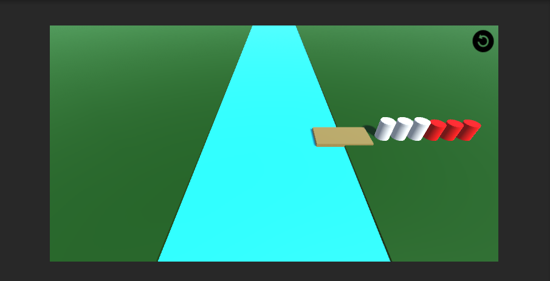
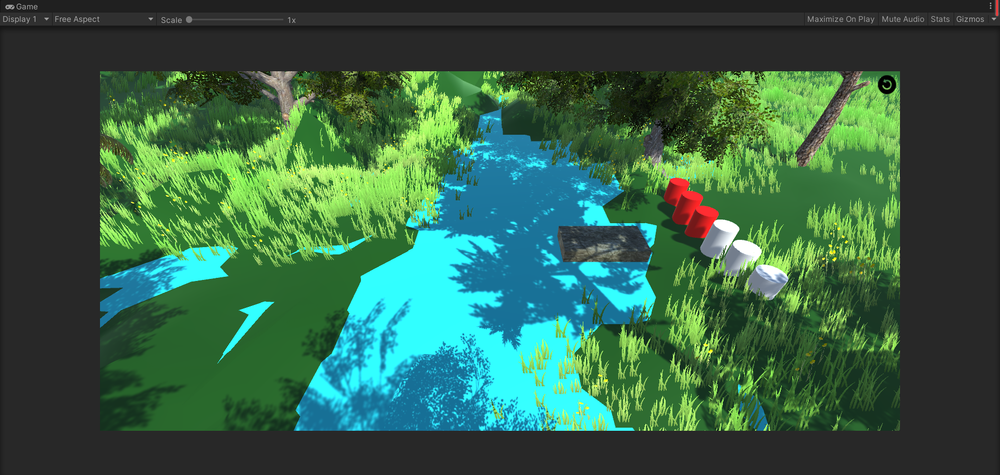
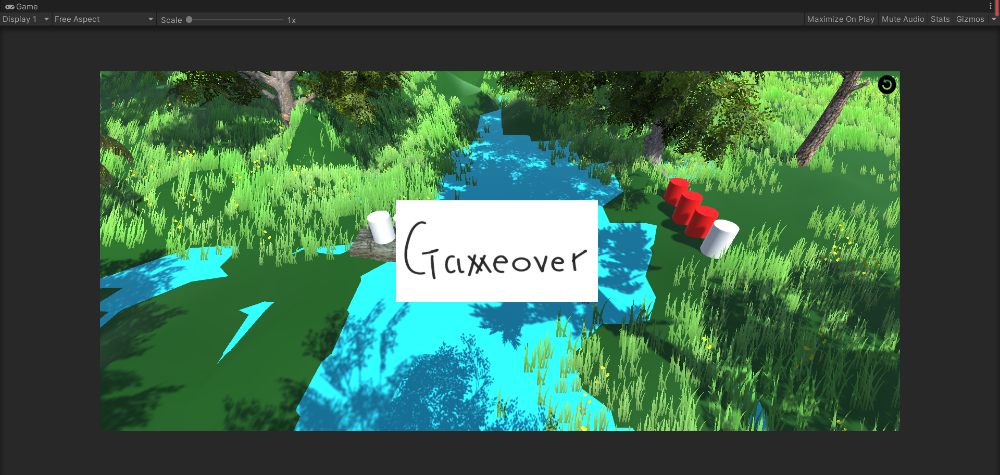
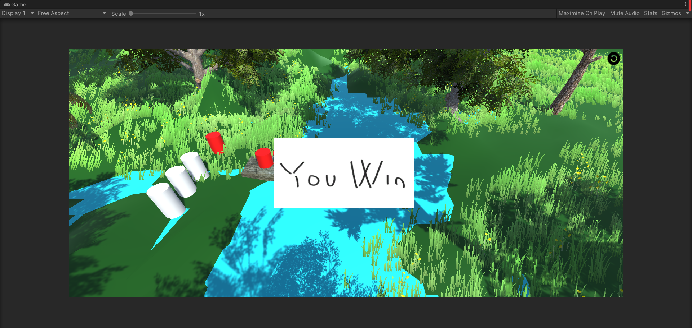

<h1><center>3D游戏编程与设计 第三次作业</center></h1>

<center>郑有为 19335286</center>

[toc]

# 作业要求

- 完善【牧师与魔鬼】
  - 动作分离
  - 设计一个裁判类：当游戏达到结束条件时，通知场景控制器游戏结束

# 项目文档

## 游戏说明 

这是一个在Unity3D上，基于MVC结构编写的一个小游戏：牧师与魔鬼过河。玩家需要控制三个牧师（白色圆柱）和三个魔鬼（红色圆柱）全部到达河对岸，但船一次最多乘坐两人，并且一旦有一岸魔鬼数目大于牧师，魔鬼就会杀死牧师，游戏失败。

本次作业在上一次的基础上，将游戏对象的动作进行了分离，**使用ActionManager对所有对象的运动进行统一管理**，在去耦合的基础上，我们可以实现序列动作。（即有多段动作组合依时序而成的动作）除此之外，我们分离出了一个**裁判类 Referee**，负责判定游戏的结果，并将结果通知给控制器。最后，基于在课堂学习的Unity地形知识，对原本的版图进行了改进，增加了地形，树，草等效果。

## 游戏效果

前后对比：



  

| Game Over                                      | You Win                                        |
| ---------------------------------------------- | ---------------------------------------------- |
|  |  |

视频演示地址：https://www.bilibili.com/video/BV1XL41137oT?spm_id_from=333.999.0.0

## 项目配置过程

1. 新建一个3D项目
2. 下载[Assets](https://gitee.com/WondrousWisdomcard/unity3d-homework/tree/master/Homework02/%E9%A1%B9%E7%9B%AE%E4%BB%A3%E7%A0%81/Assets)文件夹，替换项目的空Assets文件夹
3. **到官方[资源商店](https://assetstore.unity.com/packages/essentials/asset-packs/standard-assets-for-unity-2018-4-32351)下载 Standard Assets (for Unity 2018.4) 资源包**
4. **将下载好的资源包加入到项目中**
5. Assets窗口中双击 Main 场景
6. 手动调整摄像头视角：Position: (0,10,-12) Rotation: (40,0,0)

> 注：因为资源包比较大，我只使用了Standard Asset的一小部分，但也有100+MB，所以没有上传到仓库中。（但其实这部分不是重要内容）

## 实现思路 & 模块介绍

所有脚本文件位于Scripts文件夹中，打开文件夹可以看到Model子文件夹，Controller子文件夹和View子文件夹，分别存储MVC模式三个部分的代码。

### 分离游戏对象的运动

* 要实现动作分离，首先需要做的事剥夺游戏对象控制运动的权力，我们删去原本支持运动的`Moveable`脚本，将`CharacterModel`、`BoatModel`、`MainSceneController`中操作动作的代码删除。新加入的动作管理相关类被放入到**Model/Action**中。

* 我们在以下设计图的基础上对实现动作管理与游戏场景的分离。

* **复合动作**：使用该思路，我们可以实现复合动作（Sequence Action），并且将所有的动作，包括符合动作变成动作模块内部的事务，并由动作管理器（Action Manager）管理。
* **模板方法**：我们使用模板的方法创建了基类`SSActionManager`和子类`CCActionManager`，一是让使用者减少对动作管理过程细节的要求，二是增加程序的复用性，如果我们需要新增一个动作管理器类型，直接继承基类即可。

* **门面模式**：我们使用了门面模式（控制器模式），使用`CCActionManager`类（继承于`SSActionManager`类）来管理并输出组合好的动作或基本动作，提供给调用方。
* **组合模式**：我们使用组合模式来实现动作组合，其中`SSAction`类作为一个抽象类来表示动作这个抽象概念，并设计`CCSequenceAction`类和`CCMoveToAction`类来分别表示复合动作和基本动作，在具体实现时我们还可以看到，符合动作是由一系列基本动作依照时序关系组合而成的。
* **接口回调**：在动作分离的设计中我们引入了接口回调函数的设计，它可以实现管理者与被管理者的解耦。在接下来的实际中，我们会用到回调函数：在船抵达岸边时，我们将会队牧师和魔鬼的两岸数目进行统计，判断玩家是否已经胜利或游戏结束。如果不在回调函数中调用而是随Update每帧循环判断进行Game Judge，可能会导致船一驶离岸边就游戏结束，使得游戏体验不好。


* 我们的设计与上图基本一致，对于`SSAction`类、`CCSequenceAction`类、`CCMoveToAction`类、`SSActionEvent`接口和老师给的基本一致，不再赘述。

* 在`SSActionManager`类的设计中，我们加入了一个布尔值`unlock`，他在运动发生时会上锁，运动结束时解锁，用于作为一个提供给外部的信号，调用者可通过`getUnlock()`函数来获取该信号。

* **创建动作**：而在`CCActionManager`类中，我们创建了几种动作，包括`Shipping`（基本动作）、角色上船、下船（两个分别由三个基本动作组成的复合动作）

* `CCActionManager`中三种动作的创建代码如下：

  ``` c#
  /* Direction: RightToLeft = 1 / LeftToRight = -1 用于区分角色、船的往返 */
  
  public void goOnShipAction(GameObject gameobject, Vector3 destination, int direction){
      unlock = false; // 移动前先上锁
      CCMoveToAction move1 = CCMoveToAction.GetSSAction(gameobject.transform.position + new Vector3(2,0,0) * direction, 0.05F); // 通过移动（X轴）到队伍外
      CCMoveToAction move2 = CCMoveToAction.GetSSAction(new Vector3(gameobject.transform.position.x + 2 * direction, 0, 0), 0.05F); // 通过移动（Z轴）到上船的位置
      CCMoveToAction move3 = CCMoveToAction.GetSSAction(destination, 0.05F); // 通过移动（X轴）到船上
      goOnShip = CCSequenceAction.GetSSAction(0, 0, new List<SSAction> {move1, move2, move3}); // 创建复合动作
      RunAction(gameobject, goOnShip, this); // 开始执行动作
  }
  
  public void goOffShipAction(GameObject gameobject, Vector3 destination, int direction){
      unlock = false; // 移动前先上锁
      CCMoveToAction move1 = CCMoveToAction.GetSSAction(new Vector3(destination.x + 2 * direction, 0, 0), 0.05F); // 通过移动（X轴）下船，移动到岸上
      CCMoveToAction move2 = CCMoveToAction.GetSSAction(new Vector3(destination.x + 2 * direction, 0, destination.z), 0.05F); // 通过移动（Z轴）移动到与该角色队伍中所在的位置对齐
      CCMoveToAction move3 = CCMoveToAction.GetSSAction(destination, 0.05F); // 通过移动（X轴）进入队伍
      goOffShip = CCSequenceAction.GetSSAction(0, 0, new List<SSAction> {move1, move2, move3}); // 创建复合动作
      RunAction(gameobject, goOffShip, this); // 开始执行动作
  }
  
  public void shipingAction(GameObject gameobject, Vector3 destination){
      unlock = false; // 移动前先上锁
      shiping = CCMoveToAction.GetSSAction(destination, 0.05F); // 创建简单动作：X轴平移
      RunAction(gameobject, shiping, this);  // 开始执行动作
  }
  ```

* 控制器调用：控制器控制一个`ActionManager`实体，在创建动作时只需指定调用动作管理器创建指定的对象即可，例如：

  ``` c#
  // 角色在起点岸上船
  actionManager.goOffShipAction(character.getGameObject(), character.getInitialPosition(), LeftToRight);
  
  // 船从起点岸移动到终点岸
  actionManager.shipingAction(boat.getGameObject(), boat.getDestinationPosition());
  ```

### 2. 裁判类

* 由于裁判类的职责比较单一，再加上暂时没有扩展裁判的必要，我们使用一个简单的类`Referee`来管理游戏胜负的判定。

* 裁判类从导演Director那获取当前的场景控制器，直接访问场景内游戏模型来同级数据。提供`gameJudge()`函数判断胜负，供控制器调用。

* `Referee`类的代码如下：

  ```
  public class Referee{
      MainSceneController controller;
      
      public Referee(){
          controller = (MainSceneController)Director.getInstance().currentSceneController;
      } 
  
      public int gameJudge(){
          int startDevilNum = 0, destinationDevilNum = 0;
          int startPriestNum = 0, destinationPriestNum = 0;
  
          for(int i = 0; i < 3; i++){
              if(controller.priests[i].getCharacterState() == CharacterModel.ASHORE_START){
                  startPriestNum++;
              }
              else if(controller.priests[i].getCharacterState() == CharacterModel.ASHORE_DESTINATION){
                  destinationPriestNum++;
              }
  
              if(controller.devils[i].getCharacterState() == CharacterModel.ASHORE_START){
                  startDevilNum++;
              }
              else if(controller.devils[i].getCharacterState() == CharacterModel.ASHORE_DESTINATION){
                  destinationDevilNum++;
              }
          }
  
          if(controller.boat.getOccupiedSitsCount() != 0){
              if(controller.boat.getBoatState() == BoatModel.PARKING_START){
                  startPriestNum = 3 - destinationPriestNum;
                  startDevilNum = 3 - destinationDevilNum;
              }
              else if(controller.boat.getBoatState() == BoatModel.PARKING_DESTINATION){
                  destinationPriestNum = 3 - startPriestNum;
                  destinationDevilNum = 3 - startDevilNum;
              }
          }
  
          if((startPriestNum != 0 && startPriestNum < startDevilNum) || (destinationPriestNum != 0 && destinationPriestNum < destinationDevilNum)){
              Debug.Log("Game Over");
              return -1;
          }
  
          if(destinationPriestNum == 3 && destinationDevilNum == 3){
              Debug.Log("You Win");
              return 1;
          }
          return 0;
      }
  }
  ```

* 在控制器中，我们在场景未上锁（也就是游戏界面没有锁定在Gameover或You Win时），并且控制器未上锁（也就是船已经靠岸）的情况下调用裁判类判定游戏结果，再根据判定结果调整`SceneGUI`的状态（`SceneGUI`会根据此弹出Gameover或You Win），代码如下：

  ``` c#
  void Update(){
      if(sceneGUI.getUnlock() == true && actionManager.getUnlock() == true){
          if(referee.gameJudge() == -1){
              sceneGUI.setGameState(SceneGUI.LOSE);
          }
          else if(referee.gameJudge() == 1){
              sceneGUI.setGameState(SceneGUI.WIN);
          }
      }
  }
  ```

## 核心算法

本次作业主要是在上一版本的基础上进一步整理代码，无关键算法代码。

