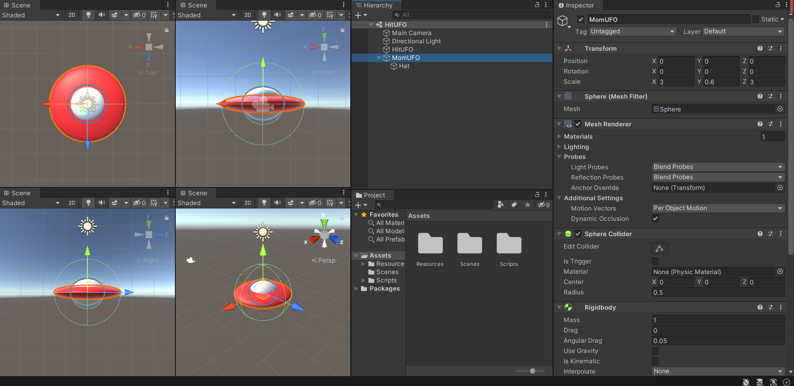
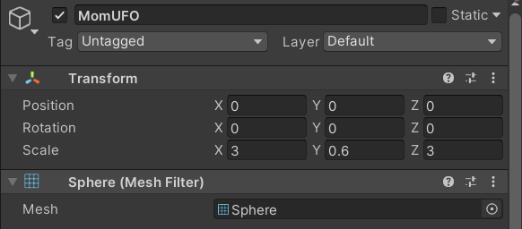
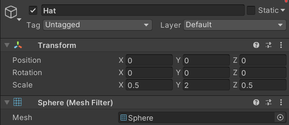
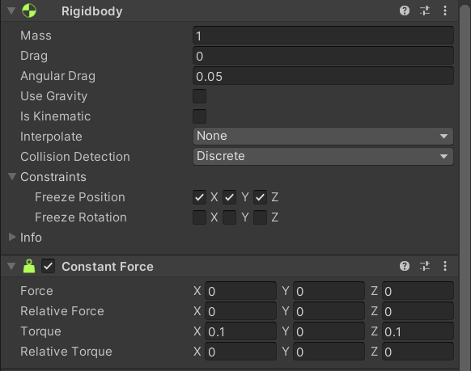
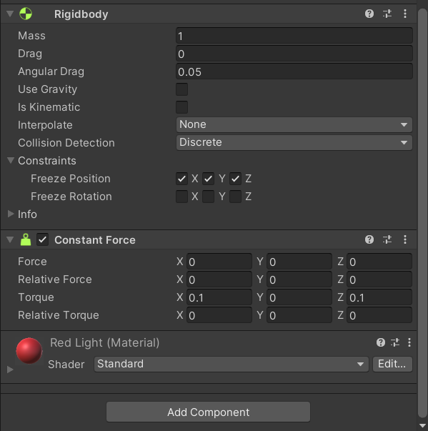

# 用Unity3D实现【打飞碟小游戏】

---

## 相关链接

项目仓库：https://gitee.com/WondrousWisdomcard/unity3d-homework

项目文档：https://gitee.com/WondrousWisdomcard/unity3d-homework/blob/master/Homework04/%E9%A1%B9%E7%9B%AE%E6%96%87%E6%A1%A3.md

演示视频：

* 非物理引擎版本：https://www.bilibili.com/video/BV1zT4y1R7TY?spm_id_from=333.999.0.0

* **物理引擎版本**：https://www.bilibili.com/video/BV1Rb4y1h72z?spm_id_from=333.999.0.0

---

## 游戏规则

简单地说：这是一个打飞碟小游戏（鼠标打），这是一样非常考验反应和手速的小游戏，不同的小飞碟会从大飞碟中飞出，我们点击小飞碟即可将其轰炸。不同等级的小飞碟的分数不同（黑色飞碟高达5000分！），五回合下来，累计最终得分。


这次作业的亮点在于引入了工厂模式、对象池和物理引擎，我们将一一介绍，但首先介绍how to make a simple飞碟。

### How to make a simple 飞碟



飞碟由一个Y轴压扁的球和一个小球组成，里面包含一个小球，它们的Transform数据如下，内部小球是外部环的子对象，所以它的大小对于外部环的相对大小。

| 外部小环                                | 内部小球                                | 物理属性（外部小环）                    |
| --------------------------------------- | --------------------------------------- | --------------------------------------- |
|  |  |  |

我们给它增加一个 RigidBody 组件和 ConstantForce 组件，并为它添加力矩（Torque），这样它就可以轻轻摇摆了。

接下来，我们为它配色，可以用图片（Texture2D），也可以直接创建Material，把设置了颜色的 Material 拖到飞碟上就可以了。

最后把他拖到 Assets 栏形成预制，会轻轻摆动的飞碟就做好了。

> 我做的游戏中间有个大飞碟，它使用同样的预制，只不过体型稍大，并设置他不受重力的影响，位置固定（不然它会被小飞碟撞飞）

### 工厂模式、对象池和对象复用

**工厂模式**（Factory Pattern）是 Java 中最常用的设计模式之一。这种类型的设计模式属于创建型模式，它提供了一种创建对象的最佳方式。在工厂模式中，我们在创建对象时不会对客户端暴露创建逻辑，并且是通过使用一个共同的接口来指向新创建的对象。

在游戏中，因为要创建大量飞碟，我们为飞碟创建了一个飞碟工厂类，控制器通过调用飞碟工厂提供的方法来产生飞碟和释放飞碟。

飞碟工厂对控制器和其他模块隐蔽了飞碟的产生和释放细节。在飞碟工厂内部，我们通过维护两个队列来实现一个飞碟对象池，避免频繁地系统调用来生成对象。

在实际游戏过程中，由于飞碟的需求随着回合数的增加而变大，对象池还是经常处于“不够用”状态，再加上我设计时，每种等级飞碟使用不同的预制，使得对象的复用不是在空闲队列里随便取一个就行的，而是要去的相同等级的飞碟对象（这样它们的预制才是一样的，游戏对象也才符合）。因此每次都需要遍历对象池，寻找合适的空闲飞碟对象。

使用不同预制创建对象出现一个很尴尬的情况，因为每次创建飞碟的等级都是随机选取的，导致可能会出现：空闲池有很多不同等级飞碟，但都无一满足当前所需的飞碟等级。但是，随着飞碟需求数目的增加，这种供不应需的状况就越不会出现，对象池各种等级的空闲飞碟都会存在。

以下是 DiskFactory 类的代码：

``` c#
using System.Collections;
using System.Collections.Generic;
using UnityEngine;

public class DiskFactory : MonoBehaviour
{
    private List<DiskData> busyDisks;
    private List<DiskData> freeDisks;

    string[] Prefabs = new string[5] {"Prefabs/YellowDisk", 
        "Prefabs/GreenDisk", "Prefabs/CyanDisk", 
        "Prefabs/BlueDisk", "Prefabs/BlackDisk"};

    void Start(){
        busyDisks = new List<DiskData>();
        freeDisks = new List<DiskData>();
    }

    public GameObject GetDisk(int level){
        GameObject disk = null;

        bool find = false;
        for(int i = 0; i < freeDisks.Count; i++){
            if(freeDisks[i].level == level){
                disk = freeDisks[i].gameObject;
                freeDisks.RemoveAt(i);
                find = true;
                break;
            }
        }
        
        if(find == false){
            disk = GameObject.Instantiate<GameObject>(Resources.Load<GameObject>(Prefabs[level - 1]), Vector3.zero, Quaternion.identity);
            disk.AddComponent<DiskData>();
            disk.AddComponent<Rigidbody>();
            disk.AddComponent<ConstantForce>();
        }

        if(disk != null){
            DiskData diskData = disk.GetComponent<DiskData>();
            setDiskData(diskData, level);
            busyDisks.Add(diskData);
        }

        return disk;
    }

    public void FreeDisk(GameObject disk){
        foreach(DiskData diskData in busyDisks){
            if(diskData.gameObject.GetInstanceID() == disk.GetInstanceID()){
                disk.SetActive(false);
                busyDisks.Remove(diskData);
                freeDisks.Add(diskData);
                break;
            }
        }
    }

    public void setDiskData(DiskData diskData, int level){
        if(level <= 1){
            diskData.level = 1;
            diskData.mass = 1.0F + Random.Range(-1F, 1F) * 0.4F;
            diskData.score = 50;
            diskData.speed = new Vector3(Random.Range(-0.1F, 0.1F), Random.Range(-0.1F, 0.1F), Random.Range(-0.1F, 0.1F));
            diskData.force = new Vector3(Random.Range(-1F, 1F), Random.Range(-1F, 1F), Random.Range(-1F, 1F));
        }
        else if(level == 2){
            diskData.level = 2;
            diskData.mass = 2.0F + Random.Range(-1F, 1F) * 0.8F;
            diskData.score = 100;
            diskData.speed = new Vector3(Random.Range(-2F, 2F), Random.Range(-2F, 2F), Random.Range(-2F, 2F));
            diskData.force = new Vector3(Random.Range(-2F, 2F), Random.Range(-2F, 2F), Random.Range(-2F, 2F));
        }
        else if(level == 3){
            diskData.level = 3;
            diskData.mass = 3.0F + Random.Range(-1F, 1F) * 1.6F;
            diskData.score = 500;
            diskData.speed = new Vector3(Random.Range(-5F, 5F), Random.Range(-5F, 5F), Random.Range(-5F, 5F));
            diskData.force = new Vector3(Random.Range(-5F, 5F), Random.Range(-5F, 5F), Random.Range(-5F, 5F));

        }
        else if(level == 4){
            diskData.level = 4;
            diskData.mass = 4.0F + Random.Range(-1F, 1F) * 2.4F;
            diskData.score = 1000;
            diskData.speed = new Vector3(Random.Range(-10F, 10F), Random.Range(-10F, 10F), Random.Range(-10F, 10F));
            diskData.force = new Vector3(Random.Range(-10F, 10F), Random.Range(-10F, 10F), Random.Range(-10F, 10F));

        } 
        else if(level >= 5){
            diskData.level = 5;
            diskData.mass = 5.0F + Random.Range(-1F, 1F) * 4.0F;
            diskData.score = 5000;
            diskData.speed = new Vector3(Random.Range(-20F, 20F), Random.Range(-20F, 20F), Random.Range(-20F, 20F));
            diskData.force = new Vector3(Random.Range(-20F, 20F), Random.Range(-20F, 20F), Random.Range(-20F, 20F));
        }
    }
}
```

### 物理引擎

使用物理引擎，我们可以模拟现实世界中物理运动，碰撞的效果。

**物理引擎（Physics Engine）**是一个软件组件，它将游戏世界对象赋予现实世界物理属性（重量、形状等），并抽象为刚体（Rigid）模型（也包括滑轮、绳索等），使得游戏物体在力的作用下，仿真现实世界的运动及其之间的碰撞过程。即在牛顿经典力学模型基础之上，通过简单的 API 计算游戏物体的运动、旋转和碰撞，现实的运动与碰撞的效果。

在游戏中，我们使用了 Uniy3D 提供的刚体组件 RigidBody 和 恒力组件 ConstantFroce，前者可以用来设置物体的重量，速度，是否受重力影响等等属性，后者可以为对象提供一个方向的恒力（Force），力矩（Torque）。

我们可以直接在游戏对象上添加这些组件，并可视化编辑：



也可以通过代码实现：（针对游戏过程中动态创建的对象）

例如以下几行，分别是设置速度、力、力矩，获取方法都是通过游戏对象的`GetComponent<>()`函数。

``` c#
this.gameObject.GetComponent<Rigidbody>().velocity = speed;
this.gameObject.GetComponent<ConstantForce>().force = force;
this.gameObject.GetComponent<ConstantForce>().torque = new Vector3(0.2F, 0, -0.2F);
```

