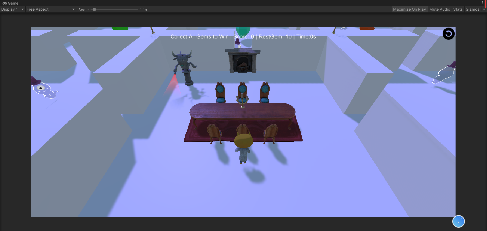
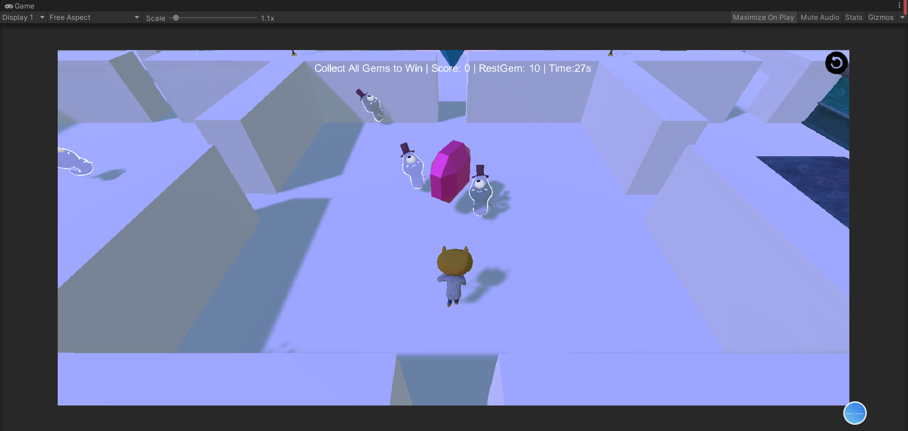
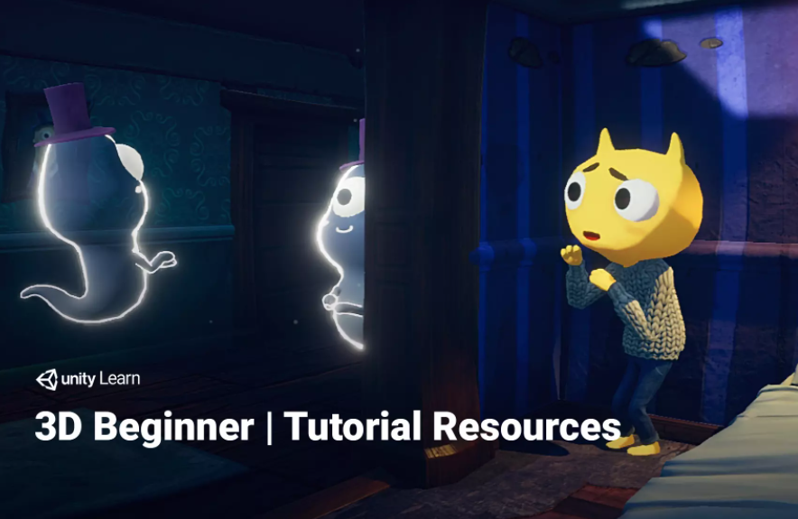
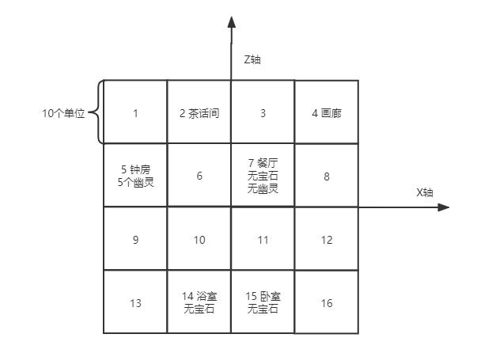
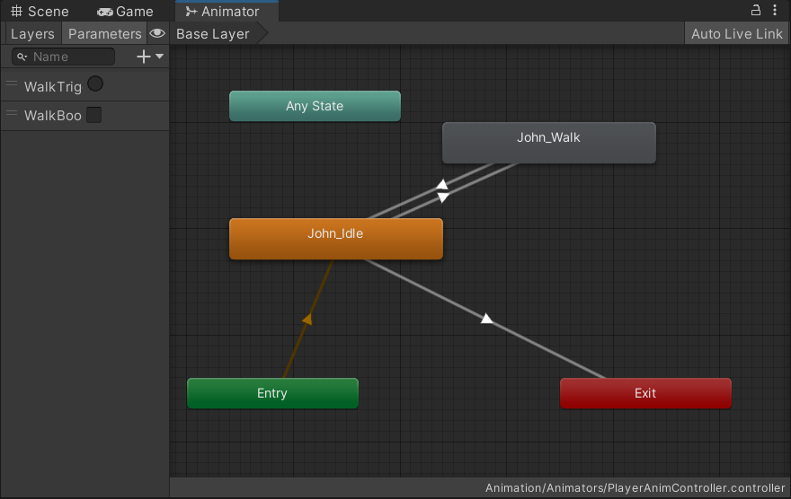

<h1><center>3D游戏编程与设计 第五次作业</center></h1>

<center>郑有为 19335286</center>

[toc]

# 作业要求

- 游戏设计要求：**智能巡逻兵**
  - 创建一个地图和若干巡逻兵(使用动画)；
  - 每个巡逻兵走一个3~5个边的凸多边型，位置数据是相对地址。即每次确定下一个目标位置，用自己当前位置为原点计算；
  - 巡逻兵碰撞到障碍物，则会自动选下一个点为目标；
  - 巡逻兵在设定范围内感知到玩家，会自动追击玩家；
  - 失去玩家目标后，继续巡逻；
  - 计分：玩家每次甩掉一个巡逻兵计一分，与巡逻兵碰撞游戏结束；
- 程序设计要求：
  - 必须使用订阅与发布模式传消息
    - Subject（：OnLostGoal）、Publisher、Subscriber
  - 工厂模式生产巡逻兵

# 项目文档 - 智能巡逻兵

## 一、游戏规则

开始游戏后，玩家进入有16个房间的密室，除了玩家开始所在的餐厅之外，每个房间有若干宝石和幽灵，玩家需要集齐所有水晶来打开驱除幽灵，但要小心，不要被幽灵抓到。

游戏开始自动计时，没有时间限制，每摆脱一个幽灵可以获得一分，16个房间中随机散布着10个不同的宝石，除了邪恶的钟表房间有5个幽灵和餐厅没有幽灵之外，其余的房间只有3个幽灵，注意，每个房间东西南北的四个缝隙可能会被柜子或者壁橱堵住。

## 二、游戏效果

### 2.1 游戏效果

|  |  |
| ---------------- | ---------------- |

### 2.2 视频演示

**视频地址**：https://www.bilibili.com/video/BV1QQ4y1v7Ag?spm_id_from=333.999.0.0 （不知怎么紫的发亮）

**博客地址**：https://wondrouswisdomcard.gitee.io/posts/unity3d3/ （内容和项目文档基本一致）

## 三、项目配置过程

1. **到 AssetStore 下载：**

   1. [游戏素材](https://assetstore.unity.com/packages/templates/tutorials/3d-beginner-tutorial-resources-143848)：**3D Beginner: Tutorial Resources**

   2. [宝石素材](https://assetstore.unity.com/packages/3d/props/simple-gems-ultimate-animated-customizable-pack-73764)：**Simple Gems Ultimate Animated Customizable Pack**

      |  |  |
      | --------------------------------------- | --------------------------------------- |

2. **直接复制以下代码到项目中：[代码](https://gitee.com/WondrousWisdomcard/unity3d-homework/tree/master/Homework05/%E9%A1%B9%E7%9B%AE%E4%BB%A3%E7%A0%81/Assets)**

## 四、实现思路

### 4.1 房间的划分与实现

* 我们划分了 4X4 个房间，每个房间为正方形，边长为10，不同的房间可能会有一些装饰（也是游戏过程中的障碍物），玩家初始位于的房间是7号，也就是餐厅，各个房间的编号如下：

  

### 4.2 Animator的实现

**位于：Animation/Animator 中，受限于素材动画有限，Animator比较简单**

#### 4.2.1 PlayerAnimator



#### 4.2.2 GhostAnimator


## 五、模块介绍 & 核心算法

### 5.1. Model模块

**位于：MyScripts/Model，定义游戏对象的数据和工厂类。**

#### 5.1.1 Gem 宝石

* **GemData**：宝石数据

  ``` c#
  public class GemData : MonoBehaviour{
      public int gemID;           // 宝石编号
      public int gemRoomID;       // 宝石所在房间
      public bool isValid;        // 是否还存在于地图中
      public bool isCatch;        // 玩家是否碰到宝石
  }
  ```

* **GemFactory**：工厂类，生成宝石

  ```c#
  public class GemFactory : MonoBehaviour
  {
      private List<GemData> gems = new List<GemData>();
  
      string gemsPath = "MyPrefabs/Gem/Gem";
      string[] gemsID = new string[11] {"00", "01", "02", "03", "04", "05", "06", "07", "08", "09", "10"};
  
      int[] gemX = new int[4] {-15, -5, 5, 15};
      int[] gemZ = new int[4] {15, 5, -5, -15};
  
      // 返回指定房间内的宝石
      public GameObject GetGem(int roomID){
          if(gems.Count != 0){
              foreach(GemData existGem in gems){
                  if(existGem.gemRoomID == roomID){
                      return existGem.gameObject;
                  }
              }
          }
          return null;
      }
  
      // 创建指定ID和房间的宝石
      public GameObject GenGem(int gemID, int roomID){
  
          GameObject gem = null;
          
          // 给出宝石的预制路径、根据房间ID算出位置和Quaternion
          string gemPath = gemsPath + gemsID[gemID];
          int x = gemX[(roomID - 1) % 4];
          int z = gemZ[(roomID - 1) / 4];
          Vector3 pos = new Vector3(x, 1, z);
          Quaternion rot = new Quaternion(-0.707106829F, 0, 0, 0.707106829F);
  
          // 创建宝石对象
          gem = GameObject.Instantiate<GameObject>(Resources.Load<GameObject>(gemPath), pos, rot);
          
          // 创建碰撞检测器
          gem.AddComponent<GemCollideSensor>();
  
          // 为创建的宝石对象赋予数据
          gem.AddComponent<GemData>();
          if(gem != null){
              GemData gemData = gem.GetComponent<GemData>();
              gemData.gemID = gemID;
              gemData.gemRoomID = roomID;
              gemData.isValid = true;
              gemData.isCatch = false;
              gems.Add(gemData);
          }
          gem.SetActive(true);
          return gem;
      }
  
      // 删除宝石
      public void FreeGem(GameObject gem){
          foreach(GemData gemData in gems){
              if(gemData.gameObject.GetInstanceID() == gem.GetInstanceID()){
                  gem.SetActive(false);
                  gems.Remove(gemData);
                  break;
              }
          }
      }
  }
  ```

* **宝石预制**：

  

#### 5.1.2 Ghost 幽灵

* **GhostData**：幽灵数据

  ``` c#
  public class GhostData : MonoBehaviour{
      public int ghostRoomID;         // 幽灵所在房间
      public int eyeshot;             // 幽灵感知半径
      public bool isInRange;          // 是否发现玩家
      public bool isFollow;           // 是否正在追击
      public bool isCollided;         // 是否抓到玩家
  }
  ```

* **GhostFactory**：工厂类，生成幽灵

  ``` c#
  public class GhostFactory : MonoBehaviour
  {
      private List<GhostData> ghostDatas = new List<GhostData>(); 
      int[] ghostX = new int[4] {-15, -5, 5, 15};
      int[] ghostZ = new int[4] {15, 5, -5, -15};
  
      // 创建一个幽灵，i（行）j（列）组成房间号， dx dz 是相对于房间中心的位置
      public GameObject GenGhost(int i, int j, int dx, int dz){
          GameObject ghost = Instantiate(Resources.Load<GameObject>("MyPrefabs/Ghost"));
                 
          ghost.transform.position = new Vector3(ghostX[i] + dx, 0, ghostZ[j] + dz);
          
          ghost.AddComponent<GhostData>();
          
          ghost.AddComponent<GhostCollideSensor>();
  
          ghost.transform.GetChild(0).gameObject.AddComponent<InRangeSensor>();
          ghost.transform.GetChild(0).gameObject.GetComponent<InRangeSensor>().ghost = ghost;
      
          GhostData ghostData = ghost.GetComponent<GhostData>();
          ghostData.ghostRoomID = i + j * 4 + 1;
          ghostData.eyeshot = 5;
          ghostData.isInRange = false;
          ghostData.isFollow = false;
          ghostData.isCollided = false;
  
          ghostDatas.Add(ghostData);
  
          return ghost;
      }
      
  }
  ```

#### 5.1.3 Player 玩家

* **PlayerData**：玩家数据

  ``` c#
  public class PlayerData : MonoBehaviour{
      public int playerRoomID;     // 玩家所在房间
      public bool alive;           // 玩家是否存活
  }
  ```

* **PlayerFactory**：玩家工厂

  ``` c#
  public class PlayerFactory : MonoBehaviour
  {
      private PlayerData playerData;
      public GameObject GenPlayer(){
  
          GameObject player = Instantiate(Resources.Load<GameObject>("MyPrefabs/JohnLemon"));
          
          player.AddComponent<PlayerController>();
          player.AddComponent<PlayerData>();
          playerData = player.GetComponent<PlayerData>();
          
          // 开始房间：7
          playerData.playerRoomID = 7;
          playerData.alive = true;
  
          return player;
      }
  }
  ```

  

### 5.2 Controller模块

**位于：MyScripts/Controller，各类控制器。**

#### 5.2.1 CameraController 摄像头控制器

* 摄像头控制器需要手动挂载到主摄像机上，摄像头跟随玩家而移动，为了让镜头不猛烈晃动，我们对移动过程做平滑变换，让镜头的移动更加自然。

```c#
using System.Collections;
using System.Collections.Generic;
using UnityEngine;

// 摄像头控制器：需要手动挂载到主摄像机上
public class CameraController : MonoBehaviour
{
	public GameObject player;
    public float distanceAway = 3F;		 	// 摄像头离玩家的水平距离	
	public float distanceUp = 3F;			// 摄像头离地面的垂直距离		
	public float smooth = 2F;				// 平滑变换参数
		
	private Vector3 m_TargetPosition;		// 摄像头的位置
	
	Transform follow;        				// 摄像头望向的位置
	
	void Start(){
		
	}
	
	void LateUpdate ()
	{
		follow = player.transform.GetChild(2);
		
		// 设置摄像头的目标位置
		m_TargetPosition = follow.position + Vector3.up * distanceUp - follow.forward * distanceAway;
		
		// 对移动过程进行平滑变换
		transform.position = Vector3.Lerp(transform.position, m_TargetPosition, Time.deltaTime * smooth);
		
		// 望向指定位置
		transform.LookAt(follow);
	}
}
```

#### 5.2.2 FirstController 主控制器

```c#
public class FirstController : MonoBehaviour, IUserAction, ISceneController
{
    public GemFactory gemFactory;
    public GhostFactory ghostFactory;
    public PlayerFactory playerFactory;
    public GhostActionManager ghostActionManager;
    public GameEventManager gameEventManager;
    public RoomSensor roomSensor;
    public ScoreRecorder scoreRecorder;
    public UserGUI userGUI; 

    public List<GameObject> gems; 
    public List<GameObject> ghosts;
    public GameObject player;

    int restGemNum;
    int gameState;
    int countTime;
    int second;

    void Start(){
        
        // 设置FPS，用于确保秒数计时准确
        Application.targetFrameRate = 60;
        countTime = 0;
        second = 0;

        SSDirector.GetInstance().CurrentSceneController = this;

        gameObject.AddComponent<GemFactory>();
        gemFactory = Singleton<GemFactory>.Instance;

        gameObject.AddComponent<GhostFactory>();
        ghostFactory = Singleton<GhostFactory>.Instance;

        gameObject.AddComponent<PlayerFactory>();
        playerFactory = Singleton<PlayerFactory>.Instance;

        LoadResources();

        gameObject.AddComponent<GhostActionManager>();
        ghostActionManager = Singleton<GhostActionManager>.Instance;

        for(int i = 0; i < ghosts.Count; i++) {
            ghostActionManager.Walk(player, ghosts[i]);
        }

        gameObject.AddComponent<GameEventManager>();
        gameEventManager = Singleton<GameEventManager>.Instance;

        gameObject.AddComponent<RoomSensor>();
        roomSensor = Singleton<RoomSensor>.Instance;

        gameObject.AddComponent<ScoreRecorder>();
        scoreRecorder = Singleton<ScoreRecorder>.Instance;

        gameObject.AddComponent<UserGUI>();
        userGUI = Singleton<UserGUI>.Instance;

        Camera.main.GetComponent<CameraController>().player = player;

        restGemNum = gems.Count;
    }

    void Update() {
        // 计时
        if(userGUI.start == true && userGUI.gameover != true && userGUI.win != true){
            countTime += 1;
            if(countTime == 60){
                countTime = 0;
                second++;   
            }
        } 
        
        // UI更新
        userGUI.UpdateScoreText(scoreRecorder.score, restGemNum, second);
    }

    void OnEnable() {
        GameEventManager.OnGoalLost += OnGoalLost;
        GameEventManager.OnFollowing += OnFollowing;
        GameEventManager.GameOver += GameOver;
        GameEventManager.Win += Win;
        GameEventManager.OnGettingGem += OnGettingGem;
    }

    void OnDisable() {
        GameEventManager.OnGoalLost -= OnGoalLost;
        GameEventManager.OnFollowing -= OnFollowing;
        GameEventManager.GameOver -= GameOver;
        GameEventManager.Win -= Win;
        GameEventManager.OnGettingGem -= OnGettingGem;
    }

    // 在地图中随机生成十个宝石，随机分布在16个房间中
    public List<GameObject> generateRandomGems(){
        List<GameObject> gems = new List<GameObject>();

        int[] validRoom = new int[13] {1,2,3,4,5,6,8,9,10,11,12,13,16};
        int[] gemRoom = new int[10];
        int[] notChoose = new int[3];

        // 一共要生成10个宝石，设定上有13个房间（validRoom）可以放宝石
        // 随机选取其中3个房间（notChoose）不放宝石，剩下的10个房间（gemRoom）放宝石
        notChoose[0] = Random.Range(0, validRoom.Length);
        do{
            notChoose[1] = Random.Range(0, validRoom.Length);
        }while (notChoose[0] == notChoose[1]);
        do{
            notChoose[2] = Random.Range(0, validRoom.Length);
        }while (notChoose[0] == notChoose[2] || notChoose[1] == notChoose[2]);

        int j = 0;
        for(int i = 0; i < validRoom.Length; i++){
            if(i != notChoose[0] && i != notChoose[1] && i != notChoose[2]){
                int t = validRoom[i];
                gemRoom[j] = t;
                j++;
            }
        }

        // 调用宝石工厂创建10个宝石
        for(int i = 0; i < 10; i++){
            GameObject gem = gemFactory.GenGem(i + 1, gemRoom[i]);
            gems.Add(gem);
        }

        return gems;
    }

    // 在地图中生成若干幽灵，幽灵的个数和位置可以在此函数调整
    public List<GameObject> generateRandomGhosts(){
        
        List<GameObject> ghosts = new List<GameObject>();
    
        for (int i = 0; i < 4; i++) {
            for (int j = 0; j < 4; j++) {
                if(i == 2 && j == 1){
                    // 起始房间：不生成灵魂
                }
                else if(i == 0 && j == 1){
                    // 邪恶房间：5只幽灵
                    GameObject ghost = ghostFactory.GenGhost(i, j, 2, 2);
                    ghosts.Add(ghost);

                    GameObject ghost2 = ghostFactory.GenGhost(i, j, -3, -2);
                    ghosts.Add(ghost2);

                    GameObject ghost3 = ghostFactory.GenGhost(i, j, 1, -3);
                    ghosts.Add(ghost3);

                    GameObject ghost4 = ghostFactory.GenGhost(i, j, -1, 2);
                    ghosts.Add(ghost4);

                    GameObject ghost5 = ghostFactory.GenGhost(i, j, -2, 1);
                    ghosts.Add(ghost5);
                }
                else{
                    // 普通房间：3只幽灵
                    GameObject ghost = ghostFactory.GenGhost(i, j, 2, 2);
                    ghosts.Add(ghost);

                    GameObject ghost2 = ghostFactory.GenGhost(i, j, -3, -2);
                    ghosts.Add(ghost2);

                    GameObject ghost3 = ghostFactory.GenGhost(i, j, 1, -3);
                    ghosts.Add(ghost3);
                }
            }
        }
        return ghosts;
    }
    
    // 载入资源：生成玩家、幽灵和宝石
    public void LoadResources(){
        Debug.Log("Load Resource...");

        gems = generateRandomGems();
        ghosts = generateRandomGhosts();
        player = playerFactory.GenPlayer();
    }

    // 使用 Scene Manager 重新载入游戏场景
    // 参考博客：https://www.cnblogs.com/caicaicaicai/p/6475600.html 来解决不渲染光线的问题
    public void Restart(){
        SceneManager.LoadScene("Scenes/Play");
    }

    // 每甩开一个幽灵，玩家得 1 分
    public void OnGoalLost(GameObject ghost) {
        ghostActionManager.Walk(player, ghost);
        if(player.GetComponent<PlayerData>().alive){
            scoreRecorder.Record(1);
        }
    }

    // 玩家进入幽灵的视野，幽灵开始追击
    public void OnFollowing(GameObject ghost) {
        if(player.GetComponent<PlayerData>().alive) {
            ghostActionManager.Follow(player, ghost);
            Debug.Log("I See U!");
        }
    }

    // 玩家获取水晶，当获得全部水晶，游戏获胜
    public void OnGettingGem(GameObject gem) {
        gem.SetActive(false);
        restGemNum--;
        if(restGemNum == 0) {
            Win();
        }
    }

    // 失败
    public void GameOver() {
        Debug.Log("GameOver");
        player.GetComponent<PlayerData>().alive = false;
        player.SetActive(false);
        userGUI.gameover = true;
    }

    // 胜利，幽灵消失，你可以在房间里闲逛
    public void Win() {
        Debug.Log("YouWin");
        for(int i = 0; i < ghosts.Count; i++){
            ghosts[i].SetActive(false);
        }
        userGUI.win = true;
    }
}
```

#### 5.2.3 GameEventManager 事件管理器

``` c#
using System.Collections;
using System.Collections.Generic;
using UnityEngine;

// 管理游戏时间，参考：https://gitee.com/Enrique518/unity3d_hw/tree/master/Intelligent%20Patrol/Assets/Scripts
public class GameEventManager : MonoBehaviour
{
    // 玩家逃脱事件
    public delegate void EscapeEvent(GameObject ghost);
    public static event EscapeEvent OnGoalLost;
    // 巡逻兵追击事件
    public delegate void FollowEvent(GameObject ghost);
    public static event FollowEvent OnFollowing;
    // 游戏失败事件
    public delegate void GameOverEvent();
    public static event GameOverEvent GameOver;
    // 游戏胜利事件
    public delegate void WinEvent();
    public static event WinEvent Win;

    // 获取宝石事件
    public delegate void GemEvent(GameObject gem);
    public static event GemEvent OnGettingGem;

    // 玩家逃脱
    public void PlayerEscape(GameObject ghost) {
        if (OnGoalLost != null) {
            OnGoalLost(ghost);
        }
    }

    // 获得水晶
    public void GettingGem(GameObject gem) {
        if(OnGettingGem != null){
            OnGettingGem(gem);
        }
    }

    // 幽灵追击
    public void FollowPlayer(GameObject ghost) {
        if (OnFollowing != null) {
            OnFollowing(ghost);
        }
    }

    // 玩家被抓
    public void OnPlayerCatched() {
        if (GameOver != null) {
            GameOver();
        }
    }
}
```

#### 5.2.4 PlayerController 玩家运动控制器

* `WalkBool`是一个用于控制玩家进入前进还是滞留的Bool型变量，它在玩家的Animator中给出。

```c#
using System.Collections;
using System.Collections.Generic;
using UnityEngine;

// 玩家控制器：指定玩家操作
public class PlayerController : MonoBehaviour
{
    private Animator ani;

    void Start()
    {
        ani = GetComponent<Animator>();
    }

    // W键前进，Q E A D S 转向，空格键停下
    void Update()
    {
        if(Input.GetKeyDown("w")){
            ani.SetBool("WalkBool", true);
        }
        else if(Input.GetKeyDown("q")){
            transform.Rotate(0, -45F, 0);
        }
        else if(Input.GetKeyDown("e")){
            transform.Rotate(0, 45F, 0);
        }
        else if(Input.GetKeyDown("a")){
            transform.Rotate(0, -90F, 0);
        }
        else if(Input.GetKeyDown("s")){
            transform.Rotate(0, 180F, 0);
        }
        else if(Input.GetKeyDown("d")){
            transform.Rotate(0, 90F, 0);
        }

        if(Input.GetKey(KeyCode.Space)){
            ani.SetBool("WalkBool", false);
        }
    }
}
```

#### 5.2.5 ScoreRecorder 计分板

``` c#
// 计分器：每幽摆脱一个幽灵的追击，获得 1 分
public class ScoreRecorder : MonoBehaviour
{
    public int score;

    void Start() {
        score = 0;
    }

    public void Record(int i) {
        score += i;
    }

    public void Reset() {
        score = 0;
    }
}
```


### 5.3 Sensor模块

**位于：MyScripts/Sensor，用于处理不同对象的碰撞 / 接触。**

#### 5.3.1 GemCollideSensor 宝石碰撞检测器

``` c#
// 宝石碰撞检测器：被挂载在宝石上，用于检测玩家是否接触到宝石
public class GemCollideSensor : MonoBehaviour
{
    FirstController sceneController;      // 当前的场记
    void OnTriggerEnter(Collider collider) {
        sceneController = SSDirector.GetInstance().CurrentSceneController as FirstController;
        if (collider.gameObject.Equals(sceneController.player)) {
            // 玩家获取宝石
            Singleton<GameEventManager>.Instance.GettingGem(this.gameObject);
        }
    }
}
```

#### 5.3.2 GhostCollideSensor 幽灵碰撞检测器

``` C#
// 幽灵碰撞检测器：用于检测玩家是否与幽灵发生了接触
public class GhostCollideSensor : MonoBehaviour
{
    FirstController sceneController;
    void OnTriggerEnter(Collider collider) {
        sceneController = SSDirector.GetInstance().CurrentSceneController as FirstController;
        if (collider.gameObject.Equals(sceneController.player)) {
            // 幽灵抓到玩家
            Debug.Log("Ghost: Catch U!");
            Singleton<GameEventManager>.Instance.OnPlayerCatched();
        }
        else {
            // 幽灵碰到障碍物
            Debug.Log("Ghost: Oops!");
            this.GetComponent<GhostData>().isCollided = true;
        }
    }
}
```

#### 5.3.3 InRangeSensor 幽灵范围感知器

* 幽灵的范围感知空间不是幽灵对象本身而是幽灵的一个半径为5的不可见的球形子对象，这样做的原因是幽灵本身还要作为与玩家碰撞的触发器，将二者区分开能够简化编程。

* 可以通过 `transform.GetChild(index)` 来获得子对象，`index`表示第几个子对象（从 0 开始）

``` c#
// 幽灵范围感知器：挂载在幽灵的第一个子对象上（一个可穿透的半径为 5 的不可见球）
// 用于检测玩家是否位于幽灵的感知范围内
public class InRangeSensor : MonoBehaviour
{
    FirstController sceneController;
    public GameObject ghost;

    void OnTriggerEnter(Collider collider) {
        sceneController = SSDirector.GetInstance().CurrentSceneController as FirstController;
        if (collider.gameObject.Equals(sceneController.player)) {
            ghost.GetComponent<GhostData>().isInRange = true;
        }
    }
    void OnTriggerExit(Collider collider) {
        sceneController = SSDirector.GetInstance().CurrentSceneController as FirstController;
        if (collider.gameObject.Equals(sceneController.player)) {
            // 玩家离开幽灵视线
            ghost.GetComponent<GhostData>().isInRange = false;
        }
    }
}
```

#### 5.3.4 RoomSensor 房间检测器

* 由于房间是我们假想的而并非一个游戏对象，故在检测玩家/幽灵所在房间时，需要通过其位置计算出房间号，而非通过控制器。

* 在检测幽灵碰撞时，我降低了幽灵检测的频率，通过这种方法来避免幽灵卡死。出现卡死的原因是幽灵跨越边界时检测到，但还没等幽灵移回合法区域，再次检测到幽灵跨越边界，导致幽灵卡死在一个位置并不断转向。

``` C#
// 房间检测器：更新玩家所在的房间，约束幽灵不能离开自己所属房间
public class RoomSensor : MonoBehaviour
{
    FirstController sceneController;

    float[] ghostX = new float[4] {-15F, -5F, 5F, 15F};
    float[] ghostZ = new float[4] {15F, 5F, -5F, -15F};
    float range = 4F;                   // 幽灵移动范围（正方形）的边长

    int tri = 0;
    void Update() {
        sceneController = SSDirector.GetInstance().CurrentSceneController as FirstController;
        
        // 更新玩家所在的房间号
        PlayerUpdate();

        tri++;
        // 降低幽灵的检查频率，避免反复转弯
        if(tri == 20){
            GhostCheck();
            tri = 0;
        }  
    }

    void PlayerUpdate() {
        GameObject player = sceneController.player;
        Vector3 position = player.transform.position;
        float x = position.x;
        float z = position.z;
        int row = (int) ((x + 20) / 10 + 1);
        int col = (int) (4 - (z + 20) / 10);
        player.GetComponent<PlayerData>().playerRoomID = row + col * 4;
    }

    void GhostCheck() {
        for(int i = 0 ; i < sceneController.ghosts.Count ; i++) {
            GameObject ghost = sceneController.ghosts[i];
            Vector3 gPosition = ghost.transform.position;
            
            // 幽灵的位置
            float gX = gPosition.x;
            float gZ = gPosition.z;

            // 房间对应的行数和列数
            int gRoomID = ghost.GetComponent<GhostData>().ghostRoomID;
            int gRow = (gRoomID - 1) / 4;
            int gCol = (gRoomID - 1) % 4;
            
            // 房间中心的位置
            float cX = ghostX[gCol];
            float cZ = ghostZ[gRow];
            
            if(gX < cX - range || gX > cX + range || gZ < cZ - range || gZ > cZ + range){
                // 如果幽灵尝试离开房间，则视为发生碰撞
                ghost.GetComponent<GhostData>().isCollided = true;
            }
        }
    }
}
```


### 5.4 Action模块

**位于：MyScripts/Action/GhostAction，用于处理幽灵的运动和状态切换。**

#### 5.4.1 GhostWalkAction 幽灵动作 - 闲逛

* 在幽灵闲逛的过程中，要随时检测是否进入追击状态，然后切换为追击模式。

``` c#
public class GhostWalkAction : SSAction
{
    private float speed = 0.5F;     // 闲逛速度
    private float GhostX, GhostZ;   // 幽灵位置                 
    private bool turn = true;       // 转向信号

    public GameObject player;       // 玩家对象
    public GameObject ghost;        // 幽灵对象
    private GhostData gData;        // 幽灵数据
    private PlayerData pData;       // 玩家数据

    public static GhostWalkAction GetAction(GameObject player, GameObject ghost) {
        GhostWalkAction action = CreateInstance<GhostWalkAction>();
        action.GhostX = ghost.transform.position.x;
        action.GhostZ = ghost.transform.position.z;
        action.player = player;
        action.ghost = ghost;
        return action;
    }

    public override void Start() {
        gData = ghost.GetComponent<GhostData>();
        pData = player.GetComponent<PlayerData>();
    }

    public override void Update() {

        if (!gData.isFollow && gData.isInRange && gData.ghostRoomID == pData.playerRoomID && !gData.isCollided && pData.alive == true) {
            // 尾随
            this.destroy = true;
            this.enable = false;
            this.callback.SSActionEvent(this);
            this.gameObject.GetComponent<GhostData>().isFollow = true;
            Singleton<GameEventManager>.Instance.FollowPlayer(this.gameObject);
        }
        else {
            // 闲逛
            Walking();
        }
    }

    void Walking() {

        // 随机转向
        if (turn) {
            GhostX = this.transform.position.x + Random.Range(-3F, 3F);
            GhostZ = this.transform.position.z + Random.Range(-3F, 3F);
            this.transform.LookAt(new Vector3(GhostX, 0, GhostZ));
            this.gameObject.GetComponent<GhostData>().isCollided = false;
            turn = false;
        }

        float distance = Vector3.Distance(transform.position, new Vector3(GhostX, 0, GhostZ));

        if (this.gameObject.GetComponent<GhostData>().isCollided) {

            // 碰墙时逆时针旋转120~180度
            this.transform.Rotate(Vector3.up, Random.Range(120, 180));
            GameObject temp = new GameObject();
            temp.transform.position = this.transform.position;
            temp.transform.rotation = this.transform.rotation;
            temp.transform.Translate(0, 0, Random.Range(0.5F, 2F));
            GhostX = temp.transform.position.x;
            GhostZ = temp.transform.position.z;
            this.transform.LookAt(new Vector3(GhostX, 0, GhostZ));
            Destroy(temp);
            this.gameObject.GetComponent<GhostData>().isCollided = false;
            
        } else if (distance <= 0.1F) {
            turn = true;
        } else {
            // 直行
            this.transform.Translate(0, 0, speed * Time.deltaTime);
        }
    }
}
```

#### 5.4.2 GhostFollowAction 幽灵动作 - 追击

* 在幽灵追击的过程中，要随时检测是否满足退出条件，然后切换为闲逛模式。

``` c#
using System.Collections;
using System.Collections.Generic;
using UnityEngine;

public class GhostFollowAction : SSAction
{
    private float speed = 0.8F;     // 追击速度（玩家的速度是 1F）
    public GameObject player;       // 玩家对象
    public GameObject ghost;        // 幽灵对象
    private GhostData gData;        // 幽灵数据
    private PlayerData pData;       // 玩家数据

    public static GhostFollowAction GetAction(GameObject player, GameObject ghost) {
        GhostFollowAction action = CreateInstance<GhostFollowAction>();
        action.player = player;
        action.ghost = ghost;
        return action;
    }

    public override void Start() {
        gData = ghost.GetComponent<GhostData>();
        pData = player.GetComponent<PlayerData>();
    }

    public override void Update() {
        
        if (gData.isFollow && (!gData.isInRange || gData.ghostRoomID != pData.playerRoomID || gData.isCollided || pData.alive == false)) {
            // 放弃跟随
            this.destroy = true;
            this.enable = false;
            this.callback.SSActionEvent(this);
            this.gameObject.GetComponent<GhostData>().isFollow = false;
            Singleton<GameEventManager>.Instance.PlayerEscape(this.gameObject);
        }
        else {
            // 尾随
            Following();
        }
    }

    void Following() {
        // 面向玩家
        transform.LookAt(player.transform.position);
        // 跟随玩家
        transform.position = Vector3.MoveTowards(this.transform.position, player.transform.position, speed * Time.deltaTime);
    }
}
```

#### 5.4.3 GhostActionManager 幽灵动作管理器

``` c#
public class GhostActionManager : SSActionManager, ISSActionCallback
{
    public GhostWalkAction walk;
    public GhostFollowAction follow;

    // 闲逛
    public void Walk(GameObject player, GameObject ghost) {
        this.walk = GhostWalkAction.GetAction(player, ghost);
        this.RunSSAction(ghost, walk, this);
    }

    // 追击
    public void Follow(GameObject player, GameObject ghost) {
        this.follow = GhostFollowAction.GetAction(player, ghost);
        this.RunSSAction(ghost, follow, this);
    }

    // 停止
    public void DestroyAllActions() {
        DestroyAll();
    }

    public void SSActionEvent(SSAction source, SSActionEventType events = SSActionEventType.Completed, int intParam = 0, string strParam = null, Object objectParam = null) {

    }
}
```


### 5.5 GUI模块

**位于：MyScripts/View，简单界面交互。**

#### 5.5.1 UserGUI 界面交互

* 主要组件：
  * 右上角刷新按钮：随时重新开始局一新的游戏，
  * 正上方文本框：显示分数和计时。


## 六、实现过程中问题

### 6.1 SceneManager与光线渲染 

> 参考：[SceneManager.LoadScene调用后新场景会变暗的问题](https://www.cnblogs.com/caicaicaicai/p/6475600.html)

* 问题发生在我们调用 SceneManager.LoadScene 获得新场景后，场景的亮度会变暗。

* 对此，我怀疑是Unity3D自动渲染的问题，一种可行的解决步骤如下：

  * 首先，按照如下步骤进入 Lighting：菜单栏 - Window - Rendering - Lighting

  * 然后，创建一个新的 Lighting Setting，创建后会进行编译，编译结束后，会在当前文件夹生成该配置，问题解决。

    
