<h1><center>3D游戏编程与设计 第六次作业</center></h1>

<center>郑有为 19335286</center>

[toc]

# 作业要求

血条（Health Bar）的预制设计。具体要求如下

- 分别使用 IMGUI 和 UGUI 实现
- 使用 UGUI，血条是游戏对象的一个子元素，任何时候需要面对主摄像机
- 分析两种实现的优缺点
- 给出预制的使用方法

# 项目文档 - Health Bar

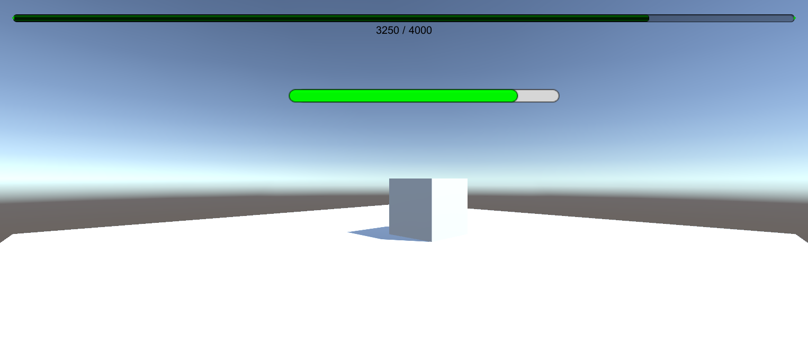

## 一、IMGUI实现

### 1.1 IMGUI血条效果

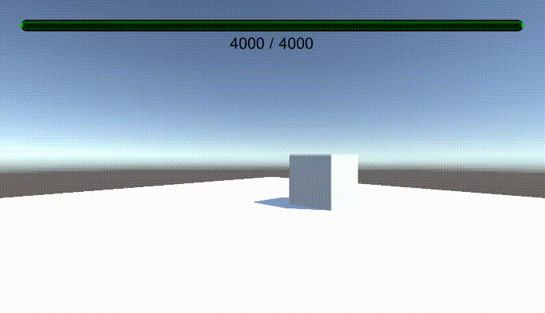

### 1.2 IMGUI代码实现

``` c#
using System.Collections;
using System.Collections.Generic;
using UnityEngine;

public class HealthBar : MonoBehaviour
{

    public float healthUpperLimit;  // 生命值上限
    private float healthValue;		// 当前的生命值

    public bool restart;			// 按R键让血量恢复原状

    void Start() {
        healthUpperLimit = 4000.0F;
        healthValue = healthUpperLimit;
        restart = false;
    }

    void Update() {
        if(restart){	// 恢复原状
            healthUpperLimit = 4000.0F;
            healthValue = healthUpperLimit;
            restart = false;
        }
    }

    public void Hurt(float h) { // 造成 h 点伤害
        healthValue -= h;
        if(healthValue <= 0){
            healthValue = 0;
        }
    }

    public void Heal(float h) { // 治疗 h 点
        if(healthValue > 0){
            healthValue += h;
            if(healthValue >= healthUpperLimit) {
                healthValue = healthUpperLimit;
            }
        }
    }

    void OnGUI() {

        GUIStyle healthTextStyle = new GUIStyle();
        healthTextStyle.fontSize = 20;
        healthTextStyle.alignment = TextAnchor.MiddleCenter;
        
        if(healthValue < healthUpperLimit * 0.3) {
            GUI.color = Color.red;		// 当血量少于上限的30%时，血条为红色
        }
        else if(healthValue < healthUpperLimit * 0.6) {
            GUI.color = Color.yellow;	// 当血量少于上限的60%时，血条为黄色
        }
        else {
            GUI.color = Color.green;	// “健康状况下”，血条为绿色
        }
        
        // 用横向滚动条实现血条
        GUI.HorizontalScrollbar(new Rect(30, 30, Screen.width - 60, 30), 0.0F, healthValue, 0.0F, healthUpperLimit);
        // 显示当前血量
        GUI.Label(new Rect(30, 50, Screen.width - 60, 20), healthValue.ToString() + " / " + healthUpperLimit.ToString(), healthTextStyle);
        
    }
}
```

### 1.3 IMGUI配置方法

* 配置方法非常简单，只需将代码脚本挂载到一个空的游戏对象上即可。

  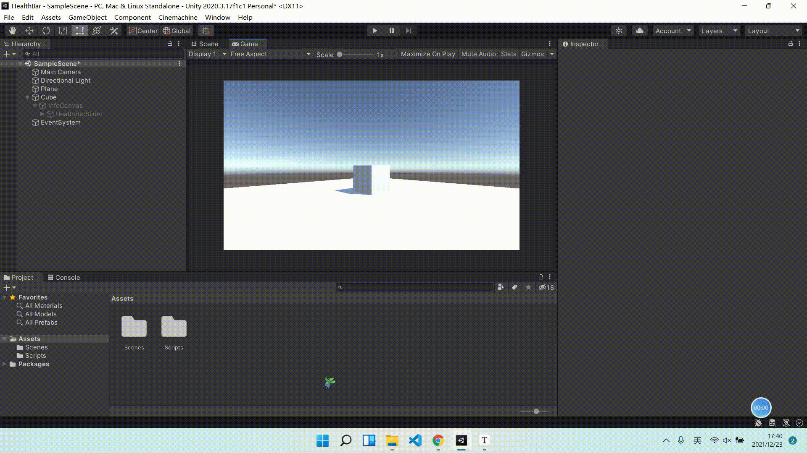

## 二、UGUI实现

### 2.1 UGUI血条效果

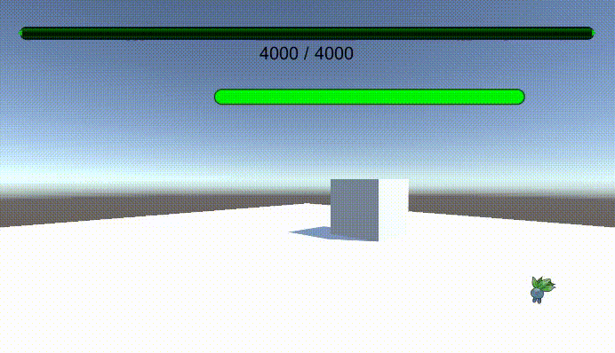

### 2.2 UGUI代码实现

UGUI代码：

``` c#
using System.Collections;
using System.Collections.Generic;
using UnityEngine;
using UnityEngine.UI;

public class HealthBar2 : MonoBehaviour
{
    public Slider slider; // 血条UGUI对象

    public bool restart;

    void Start() {
        slider.maxValue = 4000.0F; 		// 血条对象血量上限
        slider.minValue = 0F;			// 血条对象血量下限
        slider.value = slider.maxValue; // 当前血量
        restart = false;
    }

    void Update() {

        // 面向摄像机，此时血条会发生抖动
        // slider.direction = Slider.Direction.RightToLeft;
        // slider.transform.LookAt(Camera.main.transform.position);

        // 不是面向摄像机，而是面向游戏屏幕
        slider.direction = Slider.Direction.LeftToRight;
        slider.transform.rotation = Camera.main.transform.rotation;
        

        if(restart){ // 重启
            slider.maxValue = 4000.0F;
            slider.value = slider.maxValue;
            restart = false;
        }

        if(slider.value <= 0.3 * slider.maxValue) // 当血量少于上限的30%时，血条为红色
            slider.fillRect.transform.GetComponent<Image>().color = Color.red;
        else if(slider.value <= 0.6 * slider.maxValue) // 当血量少于上限的60%时，血条为黄色
            slider.fillRect.transform.GetComponent<Image>().color = Color.yellow;        
        else // “健康情况”下，血条为绿色
            slider.fillRect.transform.GetComponent<Image>().color = Color.green;
    }

    public void Hurt(float h) { //造成h点伤害
        slider.value -= h;
        if(slider.value <= 0)
            slider.value = 0;
    }
    public void Heal(float h) { // 给予h点治疗
        if(slider.value > 0){
            slider.value += h;
            if(slider.value >= slider.maxValue)
                slider.value = slider.maxValue;            
        }
    }
}
```

**其他控制代码**：

``` c#
using System.Collections;
using System.Collections.Generic;
using UnityEngine;

public interface IUserAction {
    void Restart();
    void Hurt();
    void Heal();
}
```

```c#
using System.Collections;
using System.Collections.Generic;
using UnityEngine;

public class FirstController : MonoBehaviour, IUserAction
{
    public HealthBar healthBar;
    public HealthBar2 healthBar2; // UGUI血条对象

    public float hurt = 250F;
    public float heal = 1000F;

    void Start() {
        gameObject.AddComponent<HealthBar>();
        healthBar = Singleton<HealthBar>.Instance;
    }

    void Update() {
        if(Input.GetKeyDown("f"))
            Hurt();
        if(Input.GetKeyDown("h"))
            Heal();
        if(Input.GetKeyDown("r"))
            Restart();
    }

    public void Hurt() {
        healthBar.Hurt(hurt);
        healthBar2.Hurt(hurt);
    }

    public void Heal() {
        healthBar.Heal(heal);
        healthBar2.Heal(heal);
    }

    public void Restart() {
        healthBar.restart = true;
        healthBar2.restart = true;
    }
}

```

```
using System.Collections;
using System.Collections.Generic;
using UnityEngine;

public class Singleton<T> : MonoBehaviour where T : MonoBehaviour
{
	protected static T instance;

	public static T Instance {  
		get {  
			if (instance == null) { 
				instance = (T)FindObjectOfType (typeof(T));  
				if (instance == null) {  
					Debug.LogError ("An instance of " + typeof(T) + " is needed in the scene, but there is none.");  
				}  
			}  
			return instance;  
		}  
	}
}
```

### 2.3 镜头跟随的设计

在设计中，如果血条对象始终面向摄像机，此时血条会发生抖动，代码如下：

```c#
slider.direction = Slider.Direction.RightToLeft;
slider.transform.LookAt(Camera.main.transform.position);
```

 实际上，血条对象不应该面向摄像机，而是面向游戏屏幕，这样才不会发生抖动。在下面代码中，如果下面设置血条 rotaion 与摄像机 rotation 一致，血条回翻转，我们看到的是血条的背面，所以血条变化应该自左向右。

    slider.direction = Slider.Direction.LeftToRight; 
    slider.transform.rotation = Camera.main.transform.rotation;

不同的效果如下图所示：

| 面向摄像头       | 面向屏幕         |
| ---------------- | ---------------- |
| 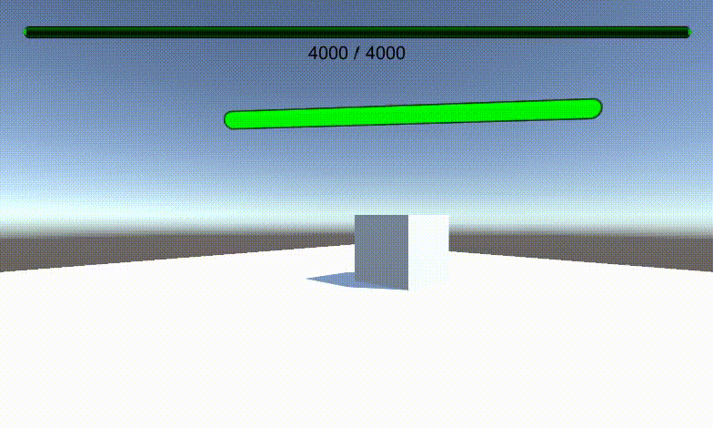 | 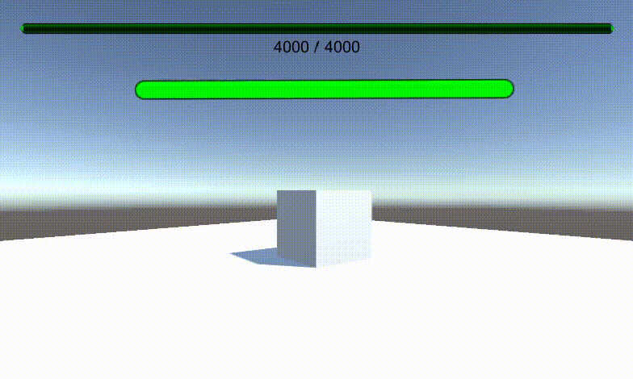 |

### 2.3 UGUI配置方法

* **创建空对象并挂在脚本 `FirstController`** 

* **创建一个Cube作为Boss**（目的是让UGUI血条成为它的子对象），可以为Cube加上一个动画（CubeMove）模拟Boss的移动，同时设置一下摄像头的位置。

  | Cube                                     | Main Camera                             |
  | ---------------------------------------- | --------------------------------------- |
  | 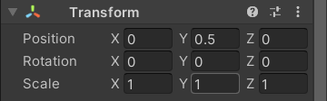 | 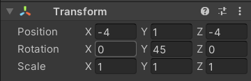 |

  

* **为Cube对象上添加一个UI对象 - Slider**，改名为 HealthBarSlider。

* **设置 Canvas 的属性**：包括Render Mode、Event Camera、Rect Transform（不设置 RenderMode 为 World Space 模式则 Rect Transform 无法修改）

  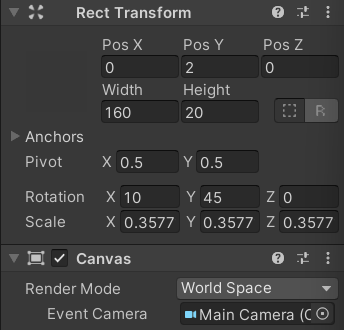

* **修改 HealthBarSlider 的子对象 Background** 和 **FillArea**，这样可以让 Slider 充满整个 Background。而子对象 Handle Slider Area 用不到，取消勾选它。

  | Background       | FillArea         |
  | ---------------- | ---------------- |
  | 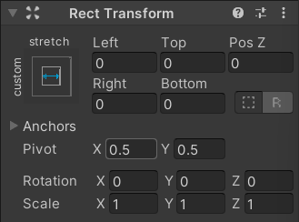 | 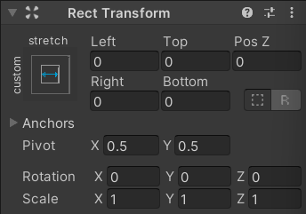 |

* **将脚本 HearthBar2 挂载到 Canvas**，设置Slider对象。同时，去**设置空对象的 FirstController 脚本的 Health Bar 属性为 Canvas**。

  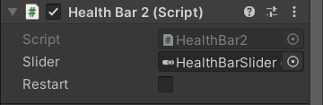

* 运行程序。

## 三、优缺点分析

**IMGUI**

* 优点：
  * 只需要简短的代码就可以实现简单的血条，容易上手。

* 缺点：

  * 样式比较单调，不能通过交互界面设计血条，布局比较麻烦。

  * 每一帧都需要重算布局重新渲染UI组件，性能较低。

**UGUI**

* 优点：
  * 有交互界面可以设计血条，可以设计风格各异的组件。

* 缺点：
  * 上手比较困难，学习成本比较高。

## 四、配置方法

视频链接：https://www.bilibili.com/video/BV1cS4y1M7JL?spm_id_from=333.999.0.0
