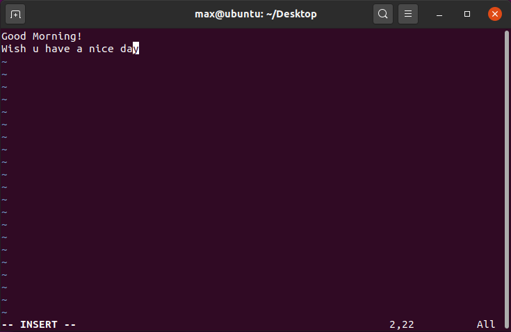
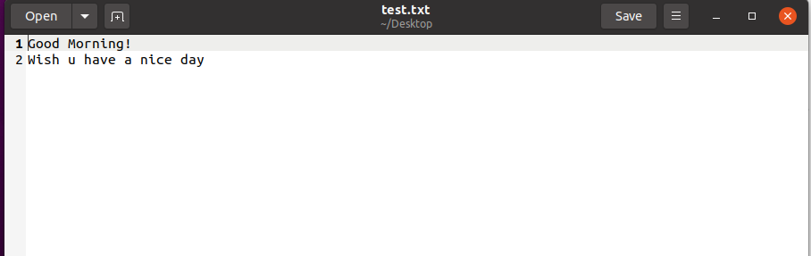
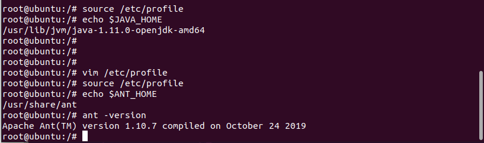
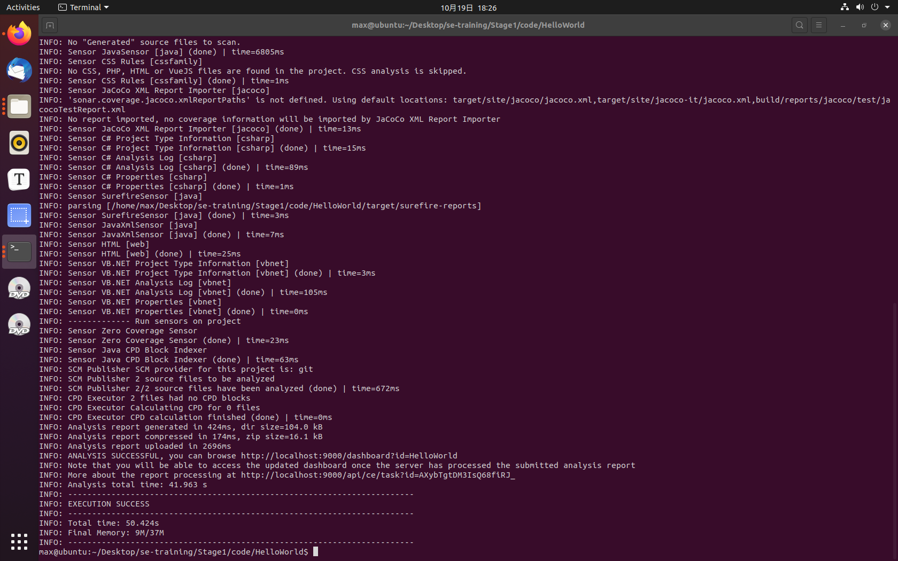

# Stage1 - StudyReport

**19335286 郑有为**

[toc]

## Stage1 - Vi/Vim Learning

### 认识 Vi / Vim

* Vi 是老式的文书编辑器，作为Linux中内建的字处理器。
* Vim 是从 vi 发展出来的一个文本编辑器，具有程序编辑的能力，可以主动的以字体颜色辨别语法的正确性，并在代码补完、编译及错误跳转等方便编程的功能特别丰富。

### Vi / Vim 的工作模式

* Vi / Vim有三种工作模式，分别是**命令模式（Command mode）**，**输入模式（Insert mode）**和**底线命令模式（Last line mode）**

* **命令模式**：启动时默认进入命令模式，顾名思义，在该模式下编辑器接收用户的键盘输入并视为指令，例如用户输入`i`，就会跳转到输入模式。但命令模式下只提供一些最基本的命令，而底线命令模式下提供更多命令。

* **输入模式**：供用户输入文本内容。

* **底线命令模式**：在命令模式下输入`:`进入底线命令模式，提供更多命令，如保存文件（`w`）。

* 工作模式的装换关系图如下：

  

### Vi / Vim 的常用按键


> 图片来源：菜鸟教程

* **移动光标、屏幕**

  * `h j k l`：分别表示光标左移、下移、上移、右移一个字符，可用四个方向箭头代替
  * `ctrl f / b / d `：分别表示屏幕向下、向上移动一页、半页
  * `0` / `$`：移动到当前行行首/行尾
  * `H M L `：光标移动到屏幕左上，左中，左下行第一个字符处
  * `G nG gg`：移动到当前档案的最后一行、第n行、第一行（`gg = 1G`）
  * `n<Space> n<Enter>`：例如`10<Space>`表示光标向后移动10个字符的距离，`10<Enter>`表示光标向下移动10行。
* **搜索、替换**

  * `/word ?word`：反斜杠，向光标之下寻找一个为 word 的字符串；问好，向光标之上寻找一个为 word 的字符串。
  * `n`：表示重复前一个搜索动作
  * `N`：反向进行一个搜索动作。例如 `/word` 后，按下 N 则表示向上搜寻 `word`
  * `:n1,n2s/word1/word2/g`：在第 n1 与 n2 行之间寻找 `word1` 这个字符串，并将该字符串取代为 `word2`。
  * `:1,$s/word1/word2/g` 或 `:%s/word1/word2/g`：从第一行到最后一行寻找 word1 字符串，并将该字符串取代为 word2
  * `:1,$s/word1/word2/gc` 或 `:%s/word1/word2/gc`：从第一行到最后一行寻找 word1 字符串，并将该字符串取代为 word2，取代前显示提示字符向用户确认
* **复制、粘贴、删除**

  * `x X`：x 为向后删除一个字符，X 为向前删除一个字符，前面可加数字如`10x`
  * `dd`：删除游标所在的那一整行，前面可加数字，表示删除光标所在的向下 n 行
  * `d1G dG`：删除光标所在到第一行、到最后一行的所有数据
  * `d$ d0`：游标所在处到该行的最后一个字符、该行第一个字符的所有数据
  * 复制：把上述的d全部改为y可以得到复制的相关操作，例如`yy`：复制游标所在的那一行
  * 黏贴：`p`为将已复制的数据在光标下一行贴上，`P`则为贴在游标上一行
  * `J`：将光标所在行与下一行的数据结合成同一行
  * `u`：复原前一个动作（撤销）
  * `[Ctrl]+r`：重做前一个的动作
  * `.`：重复前一个动作
* **进入输入模式、取代模式**

  * 进入输入模式 **--INSERT--**
    * `i I`：i 为从目前光标所在处输入， I 为在目前所在行的第一个非空格符处开始输入
    * `a A`：a 为从目前光标所在的下一个字符处开始输入；A 为从光标所在行的最后一个字符处开始输入
    * `o O`：o 为在目前光标所在的下一行处输入新的一行； O 为在目前光标所在的上一行处输入新的一行
  * 进入取代模式 **--REPLACE--**
    * `r R`：r 只会取代光标所在的那一个字符一次；R会一直取代光标所在的文字，直到按下 [Esc] 为止
* **存储、离开**

  * `:w :w!`：将编辑的数据写入硬盘档案中，! 为强制写入
  * `:q :q!`：离开，使用 ! 为强制离开不储存
  * `:wq :wq!`：储存后离开，使用 ! 为强制储存后离开
  * `ZZ ZQ`：保存并退出；不保存，强制退出
  * `:w [filename]`：另存新档，前面可以加数字串：`n1,n2`表示选n1到n2行的内容储存新档
  * `:r [filename]`：读入另一个档案的数据，将`filename`的内容加到游标所在行后面
  * `:! command`：暂时离开 vi 到指令行模式下执行 command 的显示结果，例如：`:! ls /home` 在 vi 当中查看 /home 底下以 ls 的输出
* Vim 快捷键补充

  * `ctrl + n`：自动补全
  * `\p<` 插入一个include，并把光标置于<>中间
  * `\im` 插入主函数
  * `\ip` 插入printf，并自动添加 \n，且把光标置于双引号中间
  * `\rr` 运行程序
  * `\rc` 保存并编译程序
* 使用块选择模式：批量注释/取消注释

  * 批量注释：**Ctrl + v** 进入块选择模式，然后移动光标选中你要注释的行，再按大写的 **I** 进入行首插入模式输入注释符号如 **//** 或 **#**，输入完毕之后，按两下 **ESC**，**Vim** 会自动将你选中的所有行首都加上注释，保存退出完成注释。
  * 取消注释：**Ctrl + v** 进入块选择模式，选中你要删除的行首的注释符号，注意 **//** 要选中两个，选好之后按 **d** 即可删除注释，**ESC** 保存退出。

### Vi / Vim 操作截图

1. 用 Vim 打开文件（若文件不存在则默认创建文件）：`vim test.txt`

   

   * 游标在最上面，波浪号表示此行为空，最下一行（状态栏）显示文件名

2. 进入输入模式（编辑模式）：`i`

   

   * 可以看到最下一行出现`-- INSERT --`，提示可以输入任意字符

3. 返回一般模式：`[Esc]`

   

4. 进入底线命令模式并保存文件：`:wq`

   

> 学习地址：[Linux vi/vim](https://www.runoob.com/linux/linux-vim.html)

## Stage1 - Java Learning

> 因为我们在大二上学期学过 java，故本报告不再详细记录 Java 的语法和面向对象特性。

### Java 语法总结

* **文件和编译运行**

  * Java文件的后缀名是 .java。
  * 在命令行下，可以使用 javac 编译文件，使用 java 运行文件。
  * 在声明源文件时需要注意：一个源文件中只能有一个public类，但可以有多个非public类。创建的文件名和类名需要保持一致。

* **对象和类**

  * 一个 Java 程序可以认为是一系列对象的集合，而这些对象通过调用彼此的方法来协同工作。
  * Java支持多态、继承、封装、抽象、类，对象和实例、重载等面向对象技术

* **数据类型**

  * 基本数据类型有八种：六种数字类型（四个整数型，两个浮点型），一种字符类型，还有一种布尔型。关键字分别是：`byte, short, int, long, float, double, char, boolean `
  * 常用数据类型还有：`String`字符串类型
  * 引用类型：在Java中，引用类型的变量非常类似于C/C++的指针，其中对象、数组都是引用数据类型

* **运算符**

  * 大部分运算符于C语言一致

  * `instanceof`运算符：用于操作对象实例，检查该对象是否是一个特定类型，例如以下代码：

    ```java
    String name = "Max";
    boolean result = name instanceof String; // 返回 true
    ```

* **数组**

  * 声明方法有两种：

    ```java
    int[] arr; // 首选
    int arr2[];
    ```

  * 创建方法：

    ```java
    int[] arr = new int[3];
    int[] arr2 = {1,2,3};
    ```

  * 简化的遍历方法：

    ```java
    int[] arr = {4,6,3};
    for(int num in arr){
        //...
    }
    ```

* **循环和条件语句**：和C语言一致

* **常用的类**

  * 包装类**（Integer、Long、Byte、Double、Float、Short）**

  * Math类：其方法都被定义为 static 形式，通过 Math 类可以在主函数中直接调用。

  * String类 / StringBuffer 和 StringBuilder 类：差别在于String不能对字符串进行修改。

  * Date类：封装当前的日期和时间

  * ArrayList类：常用，是一个可以动态修改的数组，与普通数组的区别就是它是没有固定大小的限制

    ```java
    import java.util.ArrayList;
    
    public class RunoobTest {
        public static void main(String[] args) {
            ArrayList<String> sites = new ArrayList<String>();
            sites.add("Google");
            System.out.println(sites);
            sites.set(0, "Wiki");
            System.out.println(sites.get(0));
            sites.remove(0);
        }
    }
    ```

  * HashMap类：一个散列表，它存储的内容是键值对(key-value)映射。

    ```java
    import java.util.HashMap;
    
    public class RunoobTest {
        public static void main(String[] args) {
            HashMap<Integer, String> Sites = new HashMap<Integer, String>();
            Sites.put(1, "Google");
            Sites.put(2, "Runoob");
            System.out.println(Sites);
            System.out.println(Sites.get(0));
        }
    }
    ```

* **输入输出**

  * 通过BufferReader读取控制台输入：对不同的输入类型有不同的读入函数，以字符串为例：

    ```java
    BufferedReader br = new BufferedReader(new InputStreamReader(System.in));
    String str;
    str = br.readLine();
    ```

  * 控制台输出：`System.out.write('Hi!');`

  * 通过FileInputStream 和 FileOutputStream 控制文件输入输出流

  * 通过Scanner获取控制台输入：

    ```java
    Scanner scan = new Scanner(System.in);
    String str = scan.nextLine();
    ```

### Java HelloWorld的编译的运行

1. 安装Java JDK，配置环境变量

   在下图中可以看到我们还查不到 JAVA_HOME 环境变量，但是我们依然可以成功编译运行程序。

   保守起见，我们先不对该环境变量进行配置，若后续使用Ant需要该环境变量我们再补上。（注：环境变量PATH应该设定为指向Java二进制文件安装的位置）

   

2. 使用 Vim 编写 HelloWorld

   

3. 使用 Javac、Java 编译运行程序

   

## Stage1 - Ant Learning

### 认识 Ant

Apache Ant是一个Java库和命令行工具，其任务是驱动构建文件中描述的进程，将其作为相互依赖的目标和扩展点。Ant的主要用途是构建Java应用程序，它提供了许多内置任务，允许编译、组装、测试和运行Java应用程序。

有点类似于C语言的make，Ant的build.xml类似于C语言的Makefile。

### Ant 的安装和配置

* 我们通过snap下载 Ant，并查询得到Ant文件夹位于`/usr/share/ant`，Java JDK文件夹位于 `/usr/lib/jvm/java-1.11.0-openjdk-amd64`

* 首先是添加环境变量，添加环境变量的步骤如下：

  * 进入root权限，命令为：`sudo su`（如果不进入root权限，无法修改第二步的文件）

  * 然后使用 vim 修改 `/etc/profile`文件，该文件负责全局记录环境变量

  * 进入 vim 后，在文件末尾添加：

    ```bash
    export JAVA_HOME=/usr/lib/jvm/java-1.11.0-openjdk-amd64
    export ANT_HOME=/usr/share/ant
    ```

  * 保存并退出，环境变量还没有生效，需要输入命令：`source /etc/profile`来更新环境变量。

  * 输入 echo 命令查看环境变量：

    ```bash
    echo $JAVA_HOME
    echo $ANT_HOME
    ```

  * 输入 ant 或 ant - version检查是否配置成功，整个配置过程截图如下：

    

### Ant 基础

* **文件格式**：XML，默认名称：`build.xml`，运行 ant 命令就可以执行当前文件夹下的 build.xml

* **关键元素**：

  * **project** 元素：Ant 构件文件的根元素 ，可包含多个 target 元素。

    * 属性：
      * **name**（指定名称）
      * **default**（指定默认执行的 target）
      * **basedir**（指定基路径位置，缺省时使用 Ant 的构件文件的父目录作为基准目录。）

  * **target** 元素：Ant 的基本执行单元，它可以包含一个或多个具体的任务。

    * 属性：
      * **name**（指定名称，在一个 project 内唯一）
      * **depends**（用于描述 target 之间的依赖关系，Ant 会依照 depends 属性中 target 出现的顺序依次执行每个 target。被依赖的 target 会先执行）
      * **if**（验证指定的属性是否存在，若不存在，所在 target 将不会被执行）
      * **unless**（验证指定的属性是否存在，若不存在，所在 target 将会被执行）
      * **description**（简短描述）

  * **property** 元素：该元素可看作参量或者参数的定义

    * 属性：名字 name 和值 value

    * property元素可用作task的属性值。在task中是通过将属性名放在“${”和“}”之间，并放在 task 属性值的位置来实现的

    * Ant内置属性：

      * ant.file : build文件的绝对路径
      * ant.version、ant.project.name、ant.java.version

    * 举例：

      ```xml
      <?xml version="1.0"?>
      <project name="propertyStudy" default="example">
      <property name="name" value="amigo"/>
      <property name="age" value="25"/>
      <target name="example">
      <echo message="name: ${name}, age: ${age}"/>
      </target>
      </project>
      ```

* **常用任务**：

  * copy 任务：

    ```xml
    <copy file="file.txt" tofile="copy.txt"/>
    <copy todir="../newdir/dest_dir">
    	<fileset dir="src_dir"/>
    </copy>
    <copy file="file.txt" todir="../other/dir"/>
    ```

  * delete 任务：

    ```xml
    <delete file="photo/amigo.jpg"/>
    <delete dir="photo"/>
    ```

  * mkdir 任务：`<mkdir dir="build"/>  `

  * move 任务：和copy任务的格式是一样的

  * echo 任务：

    ```xml
    <echo message="Hello,Amigo" file="logs/system.log" append="true">
    <echo message="The base dir is: ${basedir}"/>
    ```

* 构建和部署Java工程：下面以HelloWorld为例

  * 编译：工程的根目录下建立 build.xml 文件，在该文件中编译src 目录下的 java 文件，并将编译后的 class 文件放入 build/classes 目录中，在编译前，需清除 classes 目录。
  * 运行：使用 java 任务实现运行 Java 程序的功能。
  * 打包：生成 jar 包

  ```xml
  <?xml version="1.0"?>
  <project name="javaTest" default="run" basedir=".">  <!-- 默认任务为运行 -->
  
  	<target name="clean">  <!-- 编译前清理 -->
  		<delete dir="build"/>
  	</target>
  
  	<target name="compile" depends="clean">  <!-- 编译 -->
  		<mkdir dir="build/classes"/>
      	<javac srcdir="src" destdir="build/classes"/>
  	</target>
  
  	<target name="run" depends="compile">  <!-- 运行 -->
  		<java classname="HelloWorld">
              <classpath>
                  <pathelement path="build/classes"/>
              </classpath>
  		</java>
  	</target>
  
     	<target name="jar" depends="run">  <!-- 打包 -->
  		<jar destfile="helloworld.jar" basedir="build/classes">
              <manifest>
                  <attribute name="Main-class" value="HelloWorld"/>
              </manifest>
     	 	</jar>
  	</target>
  
  </project>
  ```

### Ant 测试

以HelloWorld程序和上述build.xml为例：


## Stage1 - JUnit Learning

### 认识 JUnit

* JUnit是一个 Java 编程语言的单元测试框架，用于编写和运行测试。它提供注释来识别测试方，提供断言来测试预期结果，提供测试运行来运行测试。
* JUnit 测试可以自动运行并且检查自身结果并提供即时反馈，它在一个条中显示进度：如果运行良好则是绿色；如果运行失败，则变成红色。
* 所谓单元测试是测试应用程序的功能是否能够按需要正常运行，它是一个对单一实体（类或方法）的测试。

  * 一个正式的编写好的单元测试用例的特点是：已知输入和预期输出，即在测试执行前就已知。
  * 每一项需求至少需要两个单元测试用例：一个正检验，一个负检验。

### Junit 基础知识

* 测试方法要点：

  * 一般使用单元测试会新建一个 test 目录存放测试代码，在生产部署的时候只需要将 test 目录下代码删除即可，同时测试代码的包和被测试代码的包结果需要保持一致。
  * 一般，测试类类名后缀为Test，测试方法使用test作为前缀。
  * 测试方法必须用 @Test 修饰 ，必须使用 public void 进行修饰。

* 常用注释：

  * **@Test**：将一个普通方法修饰成一个测试方法
  * **@BeforeClass**： 会在所有的方法执行前被执行，static 方法 （全局只会执行一次，而且是第一个运行）
  * **@AfterClass**：会在所有的方法执行之后进行执行，static 方法 （全局只会执行一次，而且是最后一个运行）
  * **@Before**：会在每一个测试方法被运行前执行一次
  * **@After**：会在每一个测试方法运行后被执行一次
  * **@Ignore**：所修饰的测试方法会被测试运行器忽略

* JUnit中常用的类和方法：

  * **org.junit.Assert**类：

    * `void assertEquals(boolean expected, boolean actual)`检查两个变量或者等式是否平衡
    * `void assertTrue(boolean condition)`检查条件为真
    * `void assertFalse(boolean condition)`检查条件为假
    * `void assertNotNull(Object object)`检查对象非空
    * `void assertNull(Object object)`检查对象为空
    * `void fail()`在没有报告的情况下使测试不通过

  * **org.junit.TestCaset**类：定义了运行多重测试

    * `TestResult createResult()`创建一个默认的 TestResult 对象
    * `int countTestCases()`为被run(TestResult result) 执行的测试案例计数
    * `void run(TestResult result)`在 TestResult 中运行测试案例并收集结果
    * `void setUp()` 创建固定装置
    * `void tearDown()`拆除固定装置

  * **org.junit.TestResult**类：收集所有执行测试案例的结果

    * `void addFailure(Test test, AssertionFailedError t)`在失败列表中加入一个失败
    * `void addError(Test test, Throwable t)`在错误列表中加入一个错误

  * **` org.junit.TestSuite`**类：测试的集合

    * **`void addTest(Test test) `** 在套中加入测试

    * **`void addTestSuite(Class<? extends TestCase> testClass)`** 将已经给定的类中的测试加到套中。

    * **`void run(TestResult result)`**
      在 TestResult 中运行测试并收集结果。

    * 演示代码：

      ```java
      TestSuite suite = new TestSuite(TestJunit1.class, TestJunit2.class, TestJunit3.class );
            TestResult result = new TestResult();
            suite.run(result);
            System.out.println("Number of test cases = " + result.runCount());
      ```

* JUnit - **时间测试**：单位为毫秒，以下为Demo。如果一个测试用例比起指定的毫秒数花费了更多的时间，那么 Junit 将自动将它标记为失败。

  ```java
  @Test(timeout=1000)
     public void testPrintMessage() { 
        System.out.println("Inside testPrintMessage()");     
        messageUtil.printMessage();     
     }
  ```

* JUnit - **异常测试**：Demo如下：

  ```java
  @Test(expected = ArithmeticException.class)
     public void testPrintMessage() { 
        System.out.println("Inside testPrintMessage()");     
        messageUtil.printMessage();     
     }
  ```

* JUni - **参数化测试**：允许开发人员使用不同的值反复运行同一个测试

* **ANT插件**：

  ```xml
  <target name="test" depends="compile">	<junit>         <classpath refid="classpath.test" />         <formatter type="brief" usefile="false" />         <test name="TestMessageUtil" />    </junit></target>
  ```

### JUnit - 在 Eclipse 上进行单元测试

* 测试过程参照：gridWorld项目教程/Junit教程第4到第14页。

  * 在通过编译之前，我们编译Junit框架的文件CalculatorTest时抛出异常，出错的愿意不是缺少包含哪个库，而是在配置Eclipse的Build Path时，**应将JUnit4放在了ClassPath而不是ModulePath下**，正确的库添加如下图所示：

    > 博客地址：[Junit4测试报错：java.lang.NoClassDefFoundError: org/junit/runner/manipulation/Filter](https://blog.csdn.net/JAck_chen0309/article/details/88659869)

  

* 测试结果如下：被测试的类为Calculator，使用Junit框架的CalaulatorTest类用于测试Calculator类的四个函数。左侧栏为测试结果，高亮标红的一块表示那个函数没有通过测试。

  

> 学习网站：[jUnit教程](https://www.w3cschool.cn/junit/)

## 综合测试

### 环境变量


### Ant + JUnit - HelloWorld测试

* **XML文件**：

  ```xml
  <project name="JunitTest" default="test" basedir=".">
  	<property name="testdir" location="test" />
  	<property name="srcdir" location="src" />
  	<property name="full-compile" value="true" />
  
  	<path id="classpath.base"/>
  
  	<path id="classpath.test">
  		<pathelement location="/lib/junit-4.13.2.jar" />
  		<pathelement location="${testdir}" />
  		<pathelement location="${srcdir}" />
  		<path refid="classpath.base" />
  	</path>
  
  	<target name="clean" >
  		<delete verbose="${full-compile}">
  			<fileset dir="${testdir}" includes="**/*.class" />
  		</delete>
  	</target>
  
  	<target name="compile" depends="clean">
  	  	<javac srcdir="${srcdir}" destdir="${testdir}" 
  		 	verbose="${full-compile}">
  			<classpath refid="classpath.test"/>
  	  	</javac>
  	</target>
  
  	<target name="run" depends="compile">  <!-- 运行 -->
  		<java classname="HelloWorld">
  		<classpath>
  			<pathelement path="${testdir}"/>
  		</classpath>
  		</java>
  	</target>
  
  	<target name="test" depends="compile">
  	  	<junit>
  		 	<classpath refid="classpath.test" />
  		 	<formatter type="brief" usefile="false" />
  		 	<test name="TestHelloWorld" />
  	  	</junit>
  	</target>
  </project>
  ```

  > ANT + JUnit 的build文件的编写参考：https://www.w3cschool.cn/junit/x6o71hv6.html

* **编译运行**：在Terminal运行**ant run**，可以看到编译成功。

  

  

* **单元测试**：在Terminal运行**ant**，此时默认任务为: **test**，可以看到编译成功。

  

  

### Ant + JUnit - Calaulator测试

* XML文件：和HelloWorld的基本一致，只需要修改类名

* 编译运行：

  

  > 可以看到程序成功执行并输出“Running Calculator...”，但是不知道是Linux还是啥的问题GUI没有弹出来，下面一张图是相同的代码在Eclipse下跑出来的

  

* 单元测试：四个测试，分别测试每一个运算符的计算结果是否正确，下图也可以看到：错误为 0，失败为 0，全部通过测试。

  

## Stage1 - SonarQube Learning

### 认识 SonarQube

* Sonar（SonarQube）是一个开源平台，用于管理源代码的质量。它不只是一个质量数据报告工具，更是代码质量管理平台，支持 Java 。
* Sonar 可以有效检测以上在程序开发过程中的七大问题：糟糕的复杂度分布、重复代码、缺乏单元测试、缺少代码标准、注释不足、潜在Bug、Spaghetti设计。

### 安装 SonarQube + SonarScanner

* 安装版本：

  * SonarQube: 9.1.0
  * SonarScanner: 4.6.2

* 安装后配置环境变量和conf文件的账号和密码，进入对应文件夹即可启动SonarQube：

  

* 检查SonarScanner是否安装成功：

  

### 使用 Sonar 测试 Calculator 和 SonarScanner

* 在项目中配置sonar-project.properties，然后执行sonar-scanner，即可将项目上传到sonarqube服务器检查。

* sonar-project.properties文件（以Calculator项目为例）

  ```properties
  #sonarqube 服务器地址
  sonar.host.url=http://localhost:9000
  #Login and Password
  sonar.login=admin
  sonar.password=max12345678
  #项目唯一标识（不能出现重复）
  sonar.projectKey=Calculator
  #项目名称
  sonar.projectName=Calculator
  #源代码目录
  sonar.sources=src
  #编译生成的class文件的所在目录
  sonar.java.binaries=test
  #版本号
  sonar.projectVersion=0.0.1-SNAPSHOT
  #语言
  sonar.language=java
  #源代码文件编码
  sonar.sourceEncoding=UTF-8
  ```

* 测试结果：

  * Calculator项目：

    

  * HelloWorld项目：

    

  * 查看Sonarqube结果：全部通过![file]

## 学习过程出现的问题和解决

### 1. OpenJDK11缺少xxx_xawt.so

* **JUnit在OpenJDK11.0的版本下编译错误，原因是缺少xawt相关模块**(报错提示找不到`libawt_xawt.so`)

  * **解决方法：卸载Java重装一个更高版本的OpenJDK**，然后一个大问题来了，怎么把原来下载的Java删除。

  * Java是我通过apt的快捷提示安装的，虽然我通过硬找找到了他所在的位置，但直接Move to trash会不会带来其他影响，于是乎我去了解了apt命令的相关参数，希望从apt中卸载OpenJDK，以下是我自己摸索的结果：

  * 首先`sudo apt search openjdk`来确定OpenJDK的全称，我们使用`apt search`找到的实际是全网的查询结果（包括我们没安装的版本和其他相关的软件），因此搜索结果会非常多，因此建议让关键字更清晰一点，例如我的JDK版本是11，我就查`sudo apt search openjdk-11`，此后，找出被标记为`[installed]`的，拷贝它的全名。

  * 接下来删除这个东西。使用命令`sudo apt uninstall <JDK全名>`来将其删除（同样用这样的步骤来删除Java的JRE）。

  * 删除完成后，你会发现在命令行输入`java`或者`javac`都会显示不存在并提示安装，这时候你选择比较新的版本进行安装就行（我一把子选了OpenJDK-17）

  * 安装完后还需要修改环境变量`JAVA_HOME`，阐述完后执行`source etc/profile`，我发现了一个新的问题，就是刷新环境变量只在当前终端中生效，对其他终端不生效。

  * 解决上述的问题的方法是执行`vim ~/.bashrc`，然后在文件最后一行添加`source /etc/profile`。

  * 经过这一系列的修改后，重新测试一下Eclipse、终端能不能编译运行Java程序，Ant可能会随之删除，重新下载即可，现在我不仅可以在Eclipse上使用Junit，通过终端也可以启动JUnit了。

    

### 2. 找不到`org.junit`

* **在命令行运行使用JUnit框架的文件总是报错：找不到`org.junit`**
  * 不管是用javac直接编译，还是使用ant都报错。
  * 死都找不到org.junit，仔细检查发现可能是安装的JUnit版本不对（好像之前安装了JUnit3.8.2，现在更新成4.12，就能成功运行了）
  * 除此之外，我将JUnit.jar放在了项目内部的`lib`文件夹，这样不管系统是否配置JUnit都可以运行了。

### 3. 误修改PATH

* **误修改PATH环境变量导致vim、cd、ls、sudo种种命令无法使用**（实惨）

  * 修改方法：执行`export PATH=/usr/bin:/bin`，暂时恢复后进入root模式修改PATH环境变量。

    

### 4. SonarQube无法开启端口

* **因为异常关闭导致SonarQube无法开启端口**

  * 试了非常多的方法，查看了log文件发现是无法共享内存，于是以为进入root下可以，结果root下无法执行elasticsearch。

    

    

  * 最后选择重装SonarQube。

### 5. SonarScanner扫描项目失败

* **SonarScanner执行失败：报错找不到xxx类**
  * 最后发现是因为没有找到项目的sonar-project文件，发现把配置文件后缀名`properties`写成了`properities`
