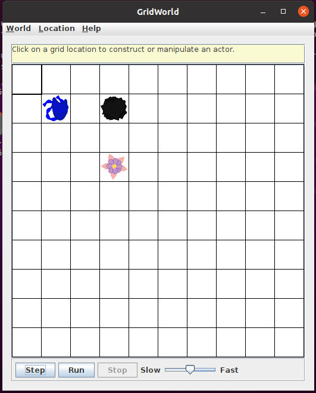
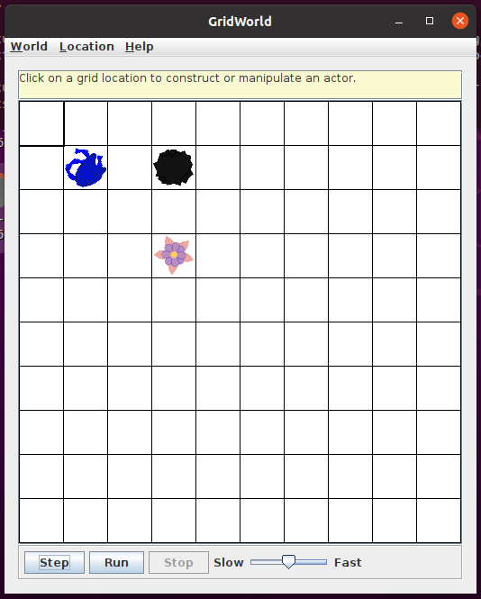
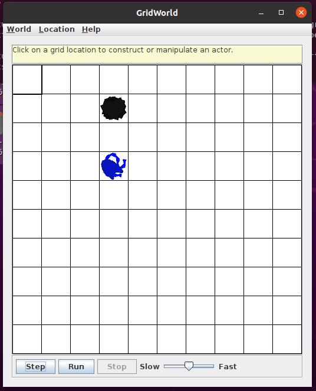
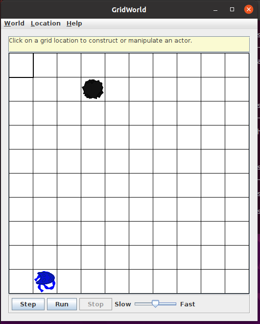
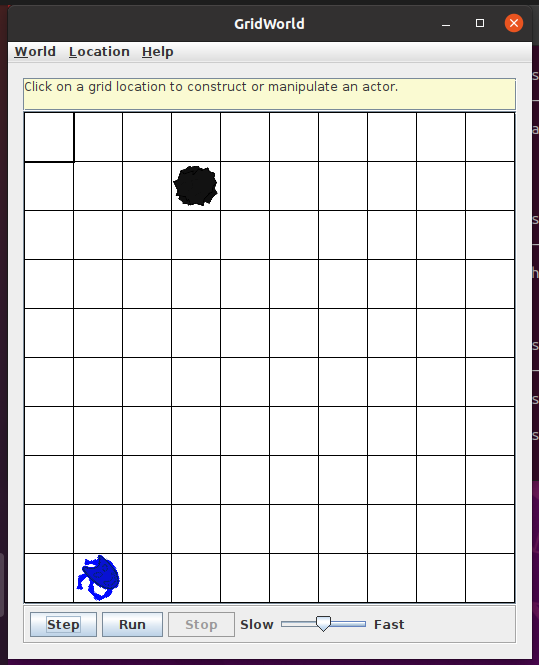
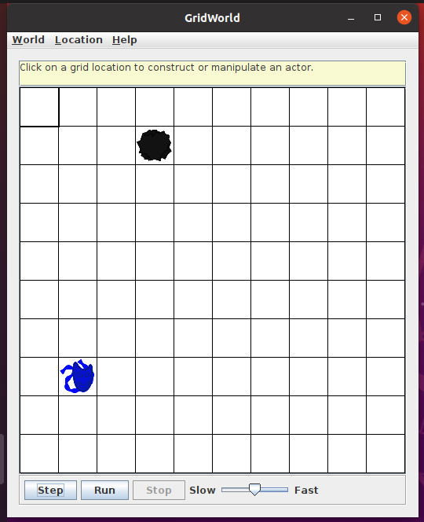
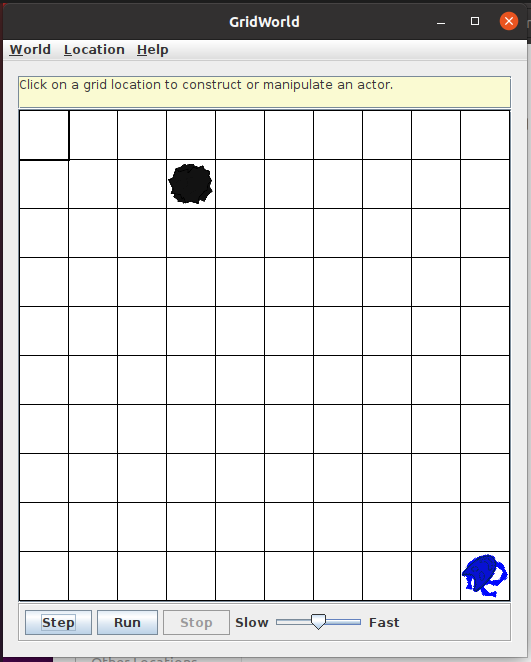
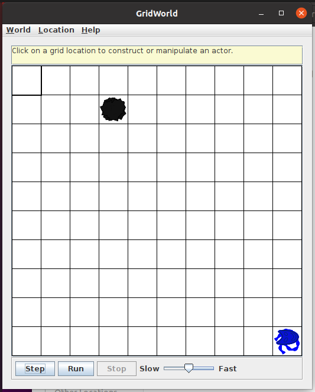
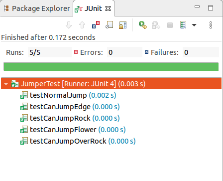

# Stage 2 - Part 3 Jumper Test Report

**郑有为 19335286**

### 1. 运行 Runner 查看效果

首先在本地运行 JumperRunner 检查结果是否与预期相符，下面三个测试考虑了 Jumper 跳转的三种不同的情况

1. Jumper（图中蓝色对象）的下一跳的位置上有石头，Jumper 于是进行转向，Jumper 转向后，此时下一跳的位置有花朵， Jumper 于是跳到该格子并移除 Flower 对象。

|  |  |  |
| ------------------------------------------------------------ | ------------------------------------------------------------ | ------------------------------------------------------------ |

2. 在下一跳位置不再表格中（越界）时，Jumper 转向，对于下图这个 Jumper 位于角落的情况，Jumper 转向两次最后跳走。

|  |  |  |  |
| ------------------------------------------------------------ | ------------------------------------------------------------ | ------------------------------------------------------------ | ------------------------------------------------------------ |

3. 在 Jumper 紧贴 Grid 边界时，Jumper 转向。

|  |  |
| ------------------------------------------------------------ | ------------------------------------------------------------ |

### 2. JUnit 单元测试

对 Jumper 编写单元测试文件 JumperTest.java，测试内容包括：

* `testNormalJump`：测试在没有障碍的情况下 Jumper 是否能跳到指定位置
* `testCanJumpEdge`：测试 Jumper 的下一跳越界的情况下，canJump 是否返回 false
* `testCanJumpRock`：测试 Jumper 的下一跳位置里有 Rock 的情况下，canJump 是否返回 false
* `testCanJumpFlower`：测试 Jumper 的下一跳位置里有 Flower 的情况下，canJump 是否返回 true
* `testCanJumpOverRock`：测试 Jumper 的下一跳位置和当前位置中间隔着 Rock 的情况下，canJump 是否返回 true

在 Eclipse 上使用 JUnit 对 Jumper 类运行单元测试，测试结果为：Passed

### 3. Sonar 代码评估

将项目上传至Sonar进行代码评估，结果为 Passed。

