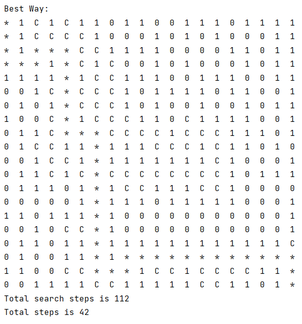
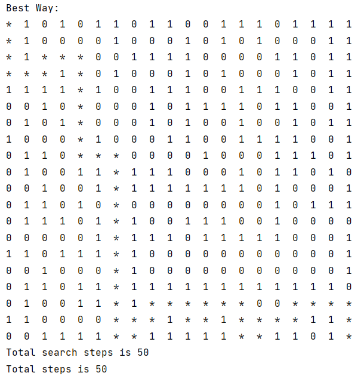

<center><h1>
    人工智能第二次实验报告
    </h1></center>

<center><h2>AStar求解迷宫寻路问题</h2></center>

| 课程：人工智能原理 | 年级专业：19级软件工程 |
| ------------------ | ---------------------- |
| 姓名：郑有为       | 学号：19335286         |

## 目录

[toc]

## 一、迷宫寻路问题

* 在一个布满障碍的有限空间中，玩家需要绕开阻碍寻找一条从起点到终点的最短路径。

* 迷宫问题有两种类型：有回路迷宫和无回路迷宫。

  * 对于无回路迷宫：无回路迷宫可以与一棵树对应，其中每个迷宫每一个分叉的路口对应到树中就是一个分叉节点，无回路迷宫可以使用深度搜索，广度搜索，启发式搜索的方法解决。

    对于无回路迷宫，只要不重复经过某个节点，就一定是最短路径。

  * 对于有回路迷宫：迷宫可能存在多条到达终点的最短路径，在启发式搜索中，由于算法维护一个 openList 和 closeList，可以避免搜索进入死循环。但如果启发函数设计的不好，搜索结果的最终路径不一定是最短的。

    **在下面的测试（5.1）中，我们可以看到源代码在有回路迷宫中，不一定能得到最短路径。**

## 二、A*搜索算法

### 2.1 基本思想

A\*搜索算法利用启发性信息来引导搜索，动态地确定搜索节点的排序，每次选择最优的节点往下搜索，可以高效地减少搜索范围，减少求解的问题的时间。

A\*算法用估价函数来衡量一个节点的优先度，优先度越小的节点越应该被优先访问。估价函数用如下公式表示：$f(n) = h(n) + d(n)$，$h(n)$是对于当前状态的估计值，例如曼哈顿距离，$d(h)$是已经付出的搜索代价，例如节点的深度。

A\*算法和A搜索算法的不同之处在于，A\*保证对于所有节点都有：$h(n) \le h^*(n)$，其中$h^*(n)$为当前状态到目的状态的最优路径的代价。

### 2.2 算法步骤

1. 将起始节点放入 openTable 中
2. 如果 openTable 为空，则搜索失败，问题无解，否则循环求解
   1. 取出 openTable 的估价函数最小的节点，置为当前节点 currentPoint，若 currentPoint 为目标节点，则搜索成功，计算解路径，退出
   2. 寻找所有与 currentPoint 邻接且未曾被发现的节点，插入到 openTable 中，并加入 closeTable 中，表示已发现

## 三、原程序说明

* 主要类：使用 Point 类来表示一个格子的位置和它的评估函数值，使用 State 类来表示当前迷宫的状态。
* 主要函数：
  * `nextStep(map, openTable, closeTable, wrongTable)`：用于确定下一步的路径，更新 openTable， closeTable 和 wrongTable。
  * `solve(map, openTable, closeTable, wrongTable)`：求解问题，循环调用 nextStep

* 思路说明：
  * 原程序除了使用 openTable 和 closeTable 存储待搜索的记录和已经访问过的的记录，还用一个 wrongTable 记录了下一步不能选择的位置。
  * 程序会每次在当前可行的几个方向里选取一个评估函数最小的作为下一步的路径，而不是从 openList 中选择最小的作下一步的路径，因此它无法获得全局最优性，也就无法求得最优解。
* 评估函数：曼哈顿距离 + 1，不考虑过去的路径长度，即不考虑已经付出的代价。
* 其他的问题：没有处理起点和终点·之间不连通的情况

## 四、程序修改

### 4.1 程序修改

* 保留 Point 类，增加以下内容：

  | 新增内容      | 注释                                                 |
  | ------------- | ---------------------------------------------------- |
  | `self.d`      | 深度，即起点到该点的路径的长度，用于表示已付出的代价 |
  | `self.parent` | 上一步的位置，用于记录路径，可以回溯到开始结点       |
  | `__le__`      | 比较两个点的评估函数值大小                           |
  | `__hash__`    | 将 Point 类定义为可哈希结构                          |

* Solution 类：和上一篇报告类似，使用一个类来处理搜索问题。以下是属性和方法：

  | 属性名       | 类型           | 注释                                           |
  | ------------ | -------------- | ---------------------------------------------- |
  | map          | 二维字符矩阵   | 记录迷宫地图（每一个元素1表示障碍，0表示可通） |
  | openTable    | Point 优先队列 | 记录全局的下一步可以走的点                     |
  | closeTable   | Point 字典     | 哈希结构，保存已访问的点                       |
  | bestPath     | Point 数组     | 保存最优路径                                   |
  | beginPoint   | Point类型      | 保存出发点位置                                 |
  | currentPoint | Point类型      | 保存当前点位置                                 |
  | destPoint    | Point类型      | 保存终点位置                                   |
  | serachCount  | int 类型       | 记录查询的总结点数                             |

  | 方法名                   | 注释                                                         |
  | ------------------------ | ------------------------------------------------------------ |
  | \__init__                | 初始化                                                       |
  | getBestPointInOpenList() | 获取 openTable 中估值函数最小的节点                          |
  | isVisited()              | 判断一个点是否被访问过，即是否位于 closeTable                |
  | getPath()                | 生成从起点到当前节点的位置                                   |
  | nextStep()               | 搜寻当前节点的下一步可行解点，加入到 openTable 和 closeTable 当中 |
  | AStarSolve()             | 求解迷宫问题                                                 |
  | showInfo()               | 生成迷宫最优解，最短路径用 `*` 表示，访问过但不是最短路径的点用 `C` 表示 |

### 4.2 复杂度分析

* 优先队列来实现 `openTable`，用一个哈希表（字典）来实现 `closeTable`，可以将每次获取估价函数最小的点和每次判断一个点是否已经被搜索过的复杂度都降为$O(1)$
* 而`openTable`插入节点并维护优先队列结构的复杂度为$O(\log(n))$

* 算法复杂度为$O(M\log(M))$，设$M$为迷宫非障碍的位置总数，但在启发式策略的基础上，实际搜索的节点远没有这么多。

## 五、测试结果

### 5.1 源程序测试

* **无回路情况**：原程序在无回路下的运行情况，对于输入：

  ```
  state = np.array([[0, 0, 0, 0, 0], 
                    [1, 0, 1, 0, 1], 
                    [0, 0, 0, 0, 1], 
                    [0, 1, 0, 0, 0], 
                    [0, 0, 0, 1, 0]])
  ```

  程序输出：搜索节点次数和最短路径长度都为 8。

  ```
  Best Way:
  *  *  *  *  0  
  1  1  1  *  1  
  0  0  0  *  1  
  0  1  0  *  *  
  0  0  0  1  *  
  
  Total search steps is 8
  Total steps is 8
  ```

* **有回路情况**：原程序不能保证最优解，例如以下输入：

  ```
  state = np.array([[0, 0, 0, 0, 0],
                    [1, 0, 0, 0, 0],
                    [0, 0, 1, 1, 0],
                    [0, 1, 1, 0, 0],
                    [0, 0, 0, 0, 0]])
  ```

  程序输出是：**搜索节点次数和最短路径长度都为 10，但一条最优路径应该是：沿着最右的一条边向上走，再沿着最上面一条边往左走，共 8 步。**

  ```
  Best Way:
  *  *  0  0  0  
  1  *  0  0  0  
  *  *  1  1  0  
  *  1  1  0  0  
  *  *  *  *  *  
  
  Total search steps is 10
  Total steps is 10
  ```

### 5.2 修改程序测试

* 对于**无回路迷宫**：输入：

  ```python
  state = np.array([[0, 0, 0, 0, 0],
  			   	  [1, 0, 1, 0, 1],
  				  [0, 0, 1, 1, 1],
  				  [0, 1, 0, 0, 0],
  				  [0, 0, 0, 1, 0]])
  ```

  输出：共搜索了16个点，路径为12。矩阵中 C 表示搜索了但未被加入最短路径的点。

  ```
  Best Way:
  *  *  C  C  C  
  1  *  1  C  1  
  *  *  1  1  1  
  *  1  *  *  *  
  *  *  *  1  *  
  
  Total search steps is 16
  Total steps is 12
  ```

* 对于**有回路迷宫**：输入：

  ```python
  state = np.array([[0, 0, 0, 0, 0],
                    [1, 0, 0, 0, 0],
                    [0, 0, 1, 1, 0],
                    [0, 1, 1, 0, 0],
                    [0, 0, 0, 0, 0]])
  ```

  输出：一共搜索了14个点，最短路径为 8，**可以找到最优解**。矩阵中 C 表示搜索了但未被加入最短路径的点。

  ```
  Best Way:
  *  *  C  C  C  
  1  *  *  *  *  
  C  C  1  1  *  
  0  1  1  C  *  
  0  0  0  0  *  
  
  Total search steps is 14
  Total steps is 8
  ```

### 5.3 20*20迷宫测试

* 输入：

  ```python
  state=np.array([
      [0, 1, 0, 1, 0, 1, 1, 0, 1, 1, 0, 0, 1, 1, 1, 0, 1, 1, 1, 1],
      [0, 1, 0, 0, 0, 0, 1, 0, 0, 0, 1, 0, 1, 0, 1, 0, 0, 0, 1, 1],
      [0, 1, 0, 0, 0, 0, 0, 1, 1, 1, 1, 0, 0, 0, 0, 1, 1, 0, 1, 1],
      [0, 0, 0, 1, 0, 0, 1, 0, 0, 0, 1, 0, 1, 0, 0, 0, 1, 0, 1, 1],
      [1, 1, 1, 1, 0, 1, 0, 0, 1, 1, 1, 0, 0, 1, 1, 1, 0, 0, 1, 1],
      [0, 0, 1, 0, 0, 0, 0, 0, 1, 0, 1, 1, 1, 1, 0, 1, 1, 0, 0, 1],
      [0, 1, 0, 1, 0, 0, 0, 0, 1, 0, 1, 0, 0, 1, 0, 0, 1, 0, 1, 1],
      [1, 0, 0, 0, 0, 1, 0, 0, 0, 1, 1, 0, 0, 1, 1, 1, 1, 0, 0, 1],
      [0, 1, 1, 0, 0, 0, 0, 0, 0, 0, 0, 1, 0, 0, 0, 1, 1, 1, 0, 1],
      [0, 1, 0, 0, 1, 1, 0, 1, 1, 1, 0, 0, 0, 1, 0, 1, 1, 0, 1, 0],
      [0, 0, 1, 0, 0, 1, 0, 1, 1, 1, 1, 1, 1, 1, 0, 1, 0, 0, 0, 1],
      [0, 1, 1, 0, 1, 0, 0, 0, 0, 0, 0, 0, 0, 0, 0, 1, 0, 1, 1, 1],
      [0, 1, 1, 1, 0, 1, 0, 1, 0, 0, 1, 1, 1, 0, 0, 1, 0, 0, 0, 0],
      [0, 0, 0, 0, 0, 1, 0, 1, 1, 1, 0, 1, 1, 1, 1, 1, 0, 0, 0, 1],
      [1, 1, 0, 1, 1, 1, 0, 1, 0, 0, 0, 0, 0, 0, 0, 0, 0, 0, 0, 1],
      [0, 0, 1, 0, 0, 0, 0, 1, 0, 0, 0, 0, 0, 0, 0, 0, 0, 0, 0, 1],
      [0, 1, 1, 0, 1, 1, 0, 1, 1, 1, 1, 1, 1, 1, 1, 1, 1, 1, 1, 0],
      [0, 1, 0, 0, 1, 1, 0, 1, 0, 0, 0, 0, 0, 0, 0, 0, 0, 0, 0, 0],
      [1, 1, 0, 0, 0, 0, 0, 0, 0, 1, 0, 0, 1, 0, 0, 0, 0, 1, 1, 0],
      [0, 0, 1, 1, 1, 1, 0, 0, 1, 1, 1, 1, 1, 0, 0, 1, 1, 0, 1, 0]])
  ```

* 输出：

| 修改程序求解结果：最短路径（42步）          | 原程序求解结果：非最短路径（50步）          |
| ------------------------------------------- | ------------------------------------------- |
|  |  |

## 附录

### 附录 1 - 修改程序 AStarMaze.py 

``` python
import numpy as np
from queue import PriorityQueue

class Point:

    def __init__(self, x, y, parent=None, d=0):
        self.x = x
        self.y = y
        self.f = 0
        self.d = d
        self.parent = parent

    def setF(self, f):
        self.f = f

    def __eq__(self, other):
        return self.x == other.x and self.y == other.y

    def __lt__(self, other):
        return self.f < other.f

    def __hash__(self):
        return self.x * 1000 + self.y

    # 计算估价函数值： f = g + h, g = depth, h 为距离终点的曼哈顿距离
    def getFunctionValue(self, end):
        dist = abs(self.x - end.x) + abs(self.y - end.y)
        return dist + self.d

class Solution:

    # 初始化A*搜索
    def __init__(self, map, start_point, end_point):
        self.map = map
        self.openTable = PriorityQueue()
        self.closeTable = {}
        self.bestPath = []
        self.beginPoint = start_point
        self.destPoint = end_point
        self.currentPoint = None
        self.searchCount = 0

    # 获取 openTable 中估值函数最小的节点
    def getBestPointInOpenList(self):
        return self.openTable.get() # 返回并删除

    # 判断一个点是否被访问过，即是否位于 closeTable
    def isVisited(self, nextPoint):
        if self.closeTable.get(nextPoint) == None:
            return False
        else:
            return True

    # 生成从起点到当前节点的位置
    def getPath(self):
        tempPoint = self.currentPoint
        self.bestPath.append(self.destPoint)

        while tempPoint.parent and tempPoint.parent != self.beginPoint:
            self.bestPath.append(tempPoint.parent)
            tempPoint = tempPoint.parent

        self.bestPath.append(self.beginPoint)
        self.bestPath.reverse()

    # 搜寻当前节点的下一步可行解点，加入到 openTable 和 closeTable 当中
    def nextStep(self):

        nextPoints = []
        boarder = len(self.map) - 1
        x = self.currentPoint.x
        y = self.currentPoint.y
        d = self.currentPoint.d

        # 往左走
        if y > 0 and self.map[x][y - 1] == 0:
            nextPoints.append(Point(x, y - 1, self.currentPoint, d + 1))
        # 往上走
        if x > 0 and self.map[x - 1][y] == 0:
            nextPoints.append(Point(x - 1, y, self.currentPoint, d + 1))
        # 往下走
        if x < boarder and self.map[x + 1][y] == 0:
            nextPoints.append(Point(x + 1, y, self.currentPoint, d + 1))
        # 往右走
        if y < boarder and self.map[x][y + 1] == 0:
            nextPoints.append(Point(x, y + 1, self.currentPoint, d + 1))

        for nextPoint in nextPoints:
            if nextPoint not in self.closeTable:

                self.searchCount += 1
                if self.searchCount % 10 == 0:
                    print("Search point is up to " + str(self.searchCount))

                nextPoint.setF(nextPoint.getFunctionValue(self.destPoint))
                self.openTable.put(nextPoint)
                self.closeTable[nextPoint] = nextPoint

    # 求解迷宫问题
    def AStarSolve(self):

        self.openTable.put(self.beginPoint)
        self.closeTable[self.beginPoint] = self.beginPoint

        while not self.openTable.empty():

            self.currentPoint = self.getBestPointInOpenList()

            if(self.currentPoint == self.destPoint):
                self.getPath()
                break

            self.nextStep()

    # 展示最后结果，最短路径用 `*` 表示，访问过但不是最短路径的点用 `C` 表示
    def showInfo(self):
        for i in range(len(self.map)):
            for j in range(len(self.map)):
                if Point(i, j) in self.bestPath:
                    # 正确路径用‘*’表示
                    print('*', end='  ')
                elif Point(i,j) in self.closeTable:
                    # 搜寻过的结点用‘C’表示
                    print('C', end='  ')
                else:
                    print(self.map[i, j], end='  ')
            print("")
        return


if __name__ == '__main__':

    # state = np.array([[0, 0, 0, 0, 0],
    #                   [1, 0, 0, 0, 0],
    #                   [0, 0, 1, 1, 0],
    #                   [0, 1, 1, 0, 0],
    #                   [0, 0, 0, 0, 0]])

    # state = np.array([[0, 0, 0, 0, 0],
    #                   [1, 0, 1, 0, 1],
    #                   [0, 0, 1, 1, 1],
    #                   [0, 1, 0, 0, 0],
    #                   [0, 0, 0, 1, 0]])

    state=np.array([
        [0, 1, 0, 1, 0, 1, 1, 0, 1, 1, 0, 0, 1, 1, 1, 0, 1, 1, 1, 1],
        [0, 1, 0, 0, 0, 0, 1, 0, 0, 0, 1, 0, 1, 0, 1, 0, 0, 0, 1, 1],
        [0, 1, 0, 0, 0, 0, 0, 1, 1, 1, 1, 0, 0, 0, 0, 1, 1, 0, 1, 1],
        [0, 0, 0, 1, 0, 0, 1, 0, 0, 0, 1, 0, 1, 0, 0, 0, 1, 0, 1, 1],
        [1, 1, 1, 1, 0, 1, 0, 0, 1, 1, 1, 0, 0, 1, 1, 1, 0, 0, 1, 1],
        [0, 0, 1, 0, 0, 0, 0, 0, 1, 0, 1, 1, 1, 1, 0, 1, 1, 0, 0, 1],
        [0, 1, 0, 1, 0, 0, 0, 0, 1, 0, 1, 0, 0, 1, 0, 0, 1, 0, 1, 1],
        [1, 0, 0, 0, 0, 1, 0, 0, 0, 1, 1, 0, 0, 1, 1, 1, 1, 0, 0, 1],
        [0, 1, 1, 0, 0, 0, 0, 0, 0, 0, 0, 1, 0, 0, 0, 1, 1, 1, 0, 1],
        [0, 1, 0, 0, 1, 1, 0, 1, 1, 1, 0, 0, 0, 1, 0, 1, 1, 0, 1, 0],
        [0, 0, 1, 0, 0, 1, 0, 1, 1, 1, 1, 1, 1, 1, 0, 1, 0, 0, 0, 1],
        [0, 1, 1, 0, 1, 0, 0, 0, 0, 0, 0, 0, 0, 0, 0, 1, 0, 1, 1, 1],
        [0, 1, 1, 1, 0, 1, 0, 1, 0, 0, 1, 1, 1, 0, 0, 1, 0, 0, 0, 0],
        [0, 0, 0, 0, 0, 1, 0, 1, 1, 1, 0, 1, 1, 1, 1, 1, 0, 0, 0, 1],
        [1, 1, 0, 1, 1, 1, 0, 1, 0, 0, 0, 0, 0, 0, 0, 0, 0, 0, 0, 1],
        [0, 0, 1, 0, 0, 0, 0, 1, 0, 0, 0, 0, 0, 0, 0, 0, 0, 0, 0, 1],
        [0, 1, 1, 0, 1, 1, 0, 1, 1, 1, 1, 1, 1, 1, 1, 1, 1, 1, 1, 0],
        [0, 1, 0, 0, 1, 1, 0, 1, 0, 0, 0, 0, 0, 0, 0, 0, 0, 0, 0, 0],
        [1, 1, 0, 0, 0, 0, 0, 0, 0, 1, 0, 0, 1, 0, 0, 0, 0, 1, 1, 0],
        [0, 0, 1, 1, 1, 1, 0, 0, 1, 1, 1, 1, 1, 0, 0, 1, 1, 0, 1, 0]])

    # 起点终点
    start_point = Point(0, 0)
    end_point = Point(len(state) - 1, len(state) - 1)

    # 最终路径
    solution = Solution(state, start_point, end_point)
    solution.AStarSolve()
    print('Best Way:')
    solution.showInfo()

    print("Total search steps is %d" % solution.searchCount)
    print("Total steps is %d" % (len(solution.bestPath) - 1))
```