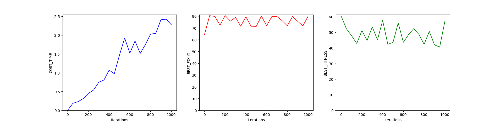

<center><h1>
    人工智能第三次实验报告
    </h1></center>

<center><h2>遗传算法求最值问题</h2></center>

| 课程：人工智能原理 | 年级专业：19级软件工程 |
| ------------------ | ---------------------- |
| 姓名：郑有为       | 学号：19335286         |

## 目录

[toc]

## 一、遗传算法

### 1.1 遗传算法简介

​		遗传算法是一种进化算法，基于自然选择和生物遗传等生物进化机制的一种搜索算法，其通过选择、重组和变异三种操作实现优化问题的求解。它的本质是从原问题的一组解出发改进到另一组较好的解，再从这组改进的解出发进一步改进。在搜索过程中，它利用结构和随机的信息，是满足目标的决策获得最大的生存可能，是一种概率型算法。

​		遗传算法主要借用生物中“适者生存”的原则，在遗传算法中，染色体对应的是数据或数组，通常由一维的串结构数据来表示。串上的各个位置对应一个基因座，而各个位置上所取的值对等位基因。遗传算法处理的是基因型个体，一定数量的个体组成了群体。群体的规模就是个体的数目。不同个体对环境的适应度不同，适应度打的个体被选择进行遗传操作产生新个体。每次选择两个染色体进行产生一组新染色体，染色体也可能发生变异，得到下一代群体。

### 1.2 遗传算法基本要素

1. **参数编码**：可以采用位串编码、实数编码、多参数级联编码等
2. **设定初始群体**：
   1. 启发 / 非启发给定一组解作为初始群体
   2. 确定初始群体的规模
3. **设定适应度函数**：将目标函数映射为适应度函数，可以进行尺度变换来保证非负、归一等特性
4. **设定遗传操作**：
   1. 选择：从当前群体选出一系列优良个体，让他们产生后代个体，一般采用蒙特卡洛法，即按适应度占比分配概率
   2. 交叉：两个个体的基因进行交叉重组来获得新个体
   3. 变异：随机变动个体串基因座上的某些基因
5. **设定控制参数**：例如变异概率、交叉程度、迭代上限等

### 1.3 遗传算法一般步骤


## 二、程序说明

### 2.1 控制参数

以 ***ga_max.py*** 为例，默认参数如下：

| 变量           | 默认值 | 含义     |
| -------------- | ------ | -------- |
| **DNA_SIZE**   | 24     | 编码长度 |
| **POP_SIZE**   | 100    | 种群大小 |
| **CROSS_RATE** | 0.8    | 交叉率   |
| **MUTA_RATE**  | 0.15   | 编译率   |
| **Iterations** | 1000   | 迭代次数 |

### 2.2 编码规则

 ***ga_max.py*** 和  ***ga_min.py*** 采用一样的编码规则，由于一个解是一个二元组 ***(x,y)*** ，编码采用多参数级联编码，编码步骤如下：

1. 设一个 DNA 是一个长度为 ***l*** 的二进制码串，因为解是二元组，一个染色体长为 ***2l***；
2. 使用奇偶级联的方式级联两条 DNA，即染色体二进制串的奇数位是 ***x*** 的 DNA，偶数位是 ***y*** 的 DNA；
3. 解码时需要将 ***x*** 和 ***y*** 分别从染色体中取出，然后映射到解空间，解空间是 [0,10] X [0,10]，用 $2^l$ 均匀划分解空间来获得实际的 ***x*** 和 ***y***。

代码如下：

``` python
# 编码
# pop（二维矩阵） = 种群数 * (DNA长度 * 2) 个 0,1 随机数
pop = np.random.randint(2, size=(POP_SIZE, DNA_SIZE * 2))   

# 解码
# 奇数列表示 X：取 pop 的奇数位
# 偶数列表示 Y：取 pop 的偶数位
x_pop = pop[:,1::2]		                                                                       
y_pop = pop[:,::2] 		
# 二进制转十进制，在归一化塞入区间[0,10]中
x = x_pop.dot(2**np.arange(DNA_SIZE)[::-1])/float(2**DNA_SIZE-1)*(X_BOUND[1]-X_BOUND[0])+X_BOUND[0] 
y = y_pop.dot(2**np.arange(DNA_SIZE)[::-1])/float(2**DNA_SIZE-1)*(Y_BOUND[1]-Y_BOUND[0])+Y_BOUND[0]
```

### 2.3 选择初始群体

对于一个函数求最大值/最小值问题，一般启发式信息比较少，故程序采用完全随机生成来产生初始群体。

``` python
# 产生初始群体 pop
# pop（二维矩阵） = 种群数 * (DNA长度 * 2) 个 0,1 随机数
pop = np.random.randint(2, size=(POP_SIZE, DNA_SIZE * 2))
```

### 2.4 适应度函数

​		适应度函数给予待求解的问题函数，为了方便后续的选择操作，一般保证适应度函数为正， ***ga_max.py*** 和  ***ga_min.py*** 的适应度函数分别如下。

​		虽然实验分别给出了最大值和最小值的算法，但实际上没什么必要，因为在求一个问题的最小值，只需将问题表达式乘以 -1，再用最大值算法求解即可。

```python
# 最大值问题的适应度函数
def getfitness(pop): # 计算适应度函数                                    
	x,y = decodeDNA(pop)                                          
	temp = F(x, y)                                                
	return (temp - np.min(temp)) + 0.0001   # 减去最小的适应度是为了防止适应度出现负数 
```

```python
# 最小值问题的适应度函数
def getfitness(pop):
    x,y = decodeDNA(pop)
    temp = F(x, y)
    return -(temp - np.max(temp)) + 0.0001  # 减去最大的适应度是为了防止适应度出现负数
```

### 2.5 遗传操作

* **选择**：使用蒙特卡洛法，即个体被选择的概率为其适应度占群体总适应度的比例`(fitness)/(fitness.sum())`

  ``` python
  def select(pop, fitness):    # 根据适应度选择
  	temp = np.random.choice(np.arange(POP_SIZE), size=POP_SIZE, replace=True,p=(fitness)/(fitness.sum()))
  	return pop[temp]
  ```

* **交换**：以概率 CROSS_RATE 进行两点交叉（交换两个染色体两点间的片段）

  ```python
  temp = i  # 子代先得到父亲的全部基因
  if np.random.rand() < CROSS_RATE:  # 以交叉概率发生交叉
      j = pop[np.random.randint(POP_SIZE)]  # 从种群中随机选择另一个个体，并将该个体作为母代
      cpoints1 = np.random.randint(0, DNA_SIZE*2-1)  # 随机产生交叉的点
      cpoints2 = np.random.randint(cpoints1,DNA_SIZE*2)
      temp[cpoints1:cpoints2] = j[cpoints1:cpoints2]  # 子代得到位于交叉点后的母代的基因
  ```

* **变异**：以概率 MUTA_RATE 进行变异，变异行为具体为随机选取一个二进制位进行反转

  ```python
  def mutation(temp, MUTA_RATE):
  	if np.random.rand() < MUTA_RATE: 					# 以MUTA_RATE的概率进行变异
  		mutate_point = np.random.randint(0, DNA_SIZE)	# 随机产生一个实数，代表要变异基因的位置
  		temp[mutate_point] = temp[mutate_point]^1 		# 将变异点的二进制为反转
  ```

### 2.6 迭代过程

```python
for _ in range(Iterations):  		# 迭代 Iterations 代
    pop = np.array(crossmuta(pop, CROSS_RATE))	# 交换变异
    fitness = getfitness(pop)		# 计算适应度函数
    pop = select(pop, fitness)  # 选择生成新的种群
```


## 三、参数测试

​		下面以 ***ga_max.py*** 为例，通过调整参数，研究单一参数的变化对求解结果和求解耗时的影响，相关代码在附录 - 2，测试图表分别为修改不同参数下耗时、最优值、最右适应度的变化。

### 3.1 编码长度

* 编码长度测试范围：[6,30]，每一个长度重复测试 10 次来减小随机误差。
* 测试显示随着编码长度的增加，算法耗时和适应度有降低趋势，最优值变化较小。


### 3.2 种群大小

* 种群大小测试范围：[20,800]，每一个长度重复测试 3 次来减小随机误差。
* 测试显示随着编码长度的增加，算法耗时呈线性增加，在种群数目大于100时最优值和最右适应度比较稳定。


### 3.3 交叉率

* 交叉率测试范围：[0,1]，每一个长度重复测试 10 次来减小随机误差。
* 测试显示随着编码长度的增加，算法耗时有上升趋势，而最优值和最有适应度变化不大。


### 3.4 变异率

* 变异率测试范围：[0,1]，每一个长度重复测试 10 次来减小随机误差。
* 测试显示随着编码长度的增加，算法耗时和最优值变化不大，而变异率越高最有适应度越高，在适应度大于0.4后趋于平缓。


### 3.5 迭代次数

* 迭代次数测试范围：[1,1000]，每一个长度重复测试 5 次来减小随机误差。
* 测试显示随着编码长度的增加，算法耗时有线性上升，而最优值和最右适应度有波动但总体平稳。



## 四、算法改进

### 4.1 最佳个体保存

​		把群体中适应度最高的一个或多个个体不进行交叉和变异而直接复制到下一代，保证历代最优能够延续到下一代。只需对迭代部分做简单的修改即可以实现。（**附录 - 1：最佳个体保存优化**）

​		经过多次测试，我们发现使用最佳个体保存的选择策略一般能够得到更好的结果。分别对最佳个体保存和非优化进行 100 次测试，对比其求得的最优值。如下图，橙色三角为优化结果，蓝色圆圈为未优化结果。

​		**优化前后最优值主要分布在 78 到 81之间**，但优化后的效果更好。


### 4.2 双倍体遗传

* **基本思路**：双倍体遗传下，编码由显性基因和隐性基因组成，因此DNA长度翻倍。每次产生子代继承了两个个体的显性基因（显性遗传），为了避免收敛过快陷入局部最优解，提高了变异率（0.8），代码在源码的基础上修改，详见**附录 - 2：双倍体遗传**

* **测试结果**：可以看到 **100** 次测试**最优值全部都在 80.4 到 81.0 之间**，相比于非优化和最佳个体保存要更加稳定且准确。同时，双倍体遗传策略收敛速度更快。


---

## 附录

**代码地址：https://gitee.com/WondrousWisdomcard/ai-homework**

### 附录 1 - 最佳个体保存代码

```python
# 最佳个体保存优化
def Opt_1():
	start_t = datetime.datetime.now()
	pop = np.random.randint(2, size=(POP_SIZE, DNA_SIZE * 2))
	for _ in range(Iterations):
		pop = np.array(crossmuta(pop, CROSS_RATE))
		fitness = getfitness(pop)					
		best = pop[np.argmax(fitness)]
		pop = select(pop, fitness)  
		pop[0] = best
	end_t = datetime.datetime.now()
	print("\n最佳个体保存\n耗时: ",(end_t - start_t))
	print_info(pop)
	fitness = getfitness(pop)
	maxfitness = np.argmax(fitness)
	x, y = decodeDNA(pop)
	return F(x[maxfitness],y[maxfitness])

def OPT1_TEST():
	i_list = range(0, 100)
	f = []
	f_opt = []
	for i in i_list:
		f.append(NonOpt())
		f_opt.append(Opt_1())

	f.sort()
	f_opt.sort()

	plt.plot(i_list, f, marker='o', label="Non Optimized")
	plt.plot(i_list, f_opt, marker='^', label="Best Preserve")
	plt.gca().xaxis.set_major_locator(MultipleLocator(10))
	plt.legend()
	plt.show()
```

### 附录 2 - 双倍体遗传代码 `opt_2.py`

``` python
import numpy as np
from matplotlib.ticker import MultipleLocator
from numpy.ma import cos
import matplotlib.pyplot as plt

DNA_SIZE = 12  		# 编码长度
POP_SIZE = 100  	# 种群大小
CROSS_RATE = 0.8  	# 交叉率
MUTA_RATE = 0.8 	# 变异率
Iterations = 100  	# 代次数
X_BOUND = [0, 10]  	# X区间
Y_BOUND = [0, 10]  	# Y区间

def F(x, y):  # 问题函数
    return (6.452 * (x + 0.125 * y) * (cos(x) - cos(2 * y)) ** 2) / (
                0.8 + (x - 4.2) ** 2 + 2 * (y - 7) ** 2) + 3.226 * y

def decodeDNA(pop):  # 基因解码
    x1_pop = pop[:, 0::4]
    y1_pop = pop[:, 1::4]
    x2_pop = pop[:, 2::4]
    y2_pop = pop[:, 3::4]

    x1 = x1_pop.dot(2 ** np.arange(DNA_SIZE)[::-1]) / float(2 ** DNA_SIZE - 1) * (X_BOUND[1] - X_BOUND[0]) + X_BOUND[0]
    y1 = y1_pop.dot(2 ** np.arange(DNA_SIZE)[::-1]) / float(2 ** DNA_SIZE - 1) * (Y_BOUND[1] - Y_BOUND[0]) + Y_BOUND[0]
    x2 = x2_pop.dot(2 ** np.arange(DNA_SIZE)[::-1]) / float(2 ** DNA_SIZE - 1) * (X_BOUND[1] - X_BOUND[0]) + X_BOUND[0]
    y2 = y2_pop.dot(2 ** np.arange(DNA_SIZE)[::-1]) / float(2 ** DNA_SIZE - 1) * (Y_BOUND[1] - Y_BOUND[0]) + Y_BOUND[0]

    x = []
    y = []
    for i in range(POP_SIZE):
        if F(x1[i],y1[i]) > F(x2[i],y2[i]):
            x.append(x1[i])
            y.append(y1[i])
        else:
            x.append(x2[i])
            y.append(y2[i])
    return x, y

def getfitness(pop):  # 计算适应度函数
    x, y = decodeDNA(pop)
    temp = []
    for i in range(POP_SIZE):
        temp.append(F(x[i], y[i]))
    return (temp - np.min(temp)) + 0.0001  # 减去最小的适应度是为了防止适应度出现负数

def select(pop, fitness):  # 根据适应度选择（蒙特卡罗）
    temp = np.random.choice(np.arange(POP_SIZE), size=POP_SIZE, replace=True, p=(fitness) / (fitness.sum()))
    return pop[temp]

def merge(i, j):
    temp = []

    i_x1_pop, i_y1_pop = i[0::4], i[1::4]
    i_x2_pop, i_y2_pop = i[2::4], i[3::4]
    j_x1_pop, j_y1_pop = j[0::4], j[1::4]
    j_x2_pop, j_y2_pop = j[2::4], j[3::4]

    i_x1 = i_x1_pop.dot(2 ** np.arange(DNA_SIZE)[::-1]) / float(2 ** DNA_SIZE - 1) * (X_BOUND[1] - X_BOUND[0]) + X_BOUND[0]
    i_y1 = i_y1_pop.dot(2 ** np.arange(DNA_SIZE)[::-1]) / float(2 ** DNA_SIZE - 1) * (Y_BOUND[1] - Y_BOUND[0]) + Y_BOUND[0]
    i_x2 = i_x2_pop.dot(2 ** np.arange(DNA_SIZE)[::-1]) / float(2 ** DNA_SIZE - 1) * (X_BOUND[1] - X_BOUND[0]) + X_BOUND[0]
    i_y2 = i_y2_pop.dot(2 ** np.arange(DNA_SIZE)[::-1]) / float(2 ** DNA_SIZE - 1) * (Y_BOUND[1] - Y_BOUND[0]) + Y_BOUND[0]

    j_x1 = j_x1_pop.dot(2 ** np.arange(DNA_SIZE)[::-1]) / float(2 ** DNA_SIZE - 1) * (X_BOUND[1] - X_BOUND[0]) + X_BOUND[0]
    j_y1 = j_y1_pop.dot(2 ** np.arange(DNA_SIZE)[::-1]) / float(2 ** DNA_SIZE - 1) * (Y_BOUND[1] - Y_BOUND[0]) + Y_BOUND[0]
    j_x2 = j_x2_pop.dot(2 ** np.arange(DNA_SIZE)[::-1]) / float(2 ** DNA_SIZE - 1) * (X_BOUND[1] - X_BOUND[0]) + X_BOUND[0]
    j_y2 = j_y2_pop.dot(2 ** np.arange(DNA_SIZE)[::-1]) / float(2 ** DNA_SIZE - 1) * (Y_BOUND[1] - Y_BOUND[0]) + Y_BOUND[0]

    if F(i_x1, i_y1) > F(i_x2, i_y2):
        i_x_pop = i_x1_pop
        i_y_pop = i_y1_pop
    else:
        i_x_pop = i_x2_pop
        i_y_pop = i_y2_pop

    if F(j_x1, j_y1) > F(j_x2, j_y2):
        j_x_pop = j_x1_pop
        j_y_pop = j_y1_pop
    else:
        j_x_pop = j_x2_pop
        j_y_pop = j_y2_pop

    for i in range(DNA_SIZE):
        temp.append(i_x_pop[i])
        temp.append(i_y_pop[i])
        temp.append(j_x_pop[i])
        temp.append(j_y_pop[i])

    return temp

def crossmuta(pop, CROSS_RATE):  # 种群的交叉变异操作
    new_pop = []
    for i in pop:  # 遍历种群中的每一个个体，将该个体作为父代
        j = pop[np.random.randint(POP_SIZE)]  # 从种群中随机选择另一个个体，并将该个体作为母代
        temp = merge(i, j)                    # 两个个体的显性基因相结合成新个体
        if np.random.rand() < CROSS_RATE:  # 以交叉概率发生交叉
            cpoints1 = np.random.randint(0, DNA_SIZE * 4 - 1)  # 随机产生交叉的两个点（区间：[cpoints1, cpoints2]）
            cpoints2 = np.random.randint(cpoints1, DNA_SIZE * 4)
            temp[cpoints1:cpoints2] = j[cpoints1:cpoints2]  # 子代得到位于交叉点后的母代的基因

        mutation(temp, MUTA_RATE)  # 每一个后代以变异率发生变异
        new_pop.append(temp)
    return new_pop

def mutation(temp, MUTA_RATE):
    if np.random.rand() < MUTA_RATE:  # 以MUTA_RATE的概率进行变异
        mutate_point = np.random.randint(0, DNA_SIZE * 4)  # 随机产生一个实数，代表要变异基因的位置
        temp[mutate_point] = temp[mutate_point] ^ 1  # 将变异点的二进制为反转

def OPT2_TEST():
    i_list = range(100)
    best_fitness = []
    best_f = []
    for i in i_list:
        print(i)
        pop = np.random.randint(2, size=(POP_SIZE, DNA_SIZE * 4))  # pop（二维矩阵） = (种群数) * (DNA长度 * 4) 个 0,1 随机数
        for _ in range(Iterations):  # 迭代 N 代
            pop = np.array(crossmuta(pop, CROSS_RATE))  # 对种群进行交叉（cross）和变异（muta）
            fitness = getfitness(pop)  # 计算种群每一个基因的适应度函数
            pop = select(pop, fitness)  # 选择生成新的种群

        fitness = getfitness(pop)
        maxfitness = np.argmax(fitness)
        x, y = decodeDNA(pop)
        best_fitness.append(fitness[maxfitness])
        best_f.append(F(x[maxfitness], y[maxfitness]))

    best_f.sort()
    plt.plot(i_list, best_f, marker='o', label="F_max(x,y)")
    plt.gca().xaxis.set_major_locator(MultipleLocator(10))
    plt.legend()
    plt.show()

if __name__ == "__main__":

    OPT2_TEST()
```

