<center><h1>
    人工智能第四次实验报告
    </h1></center>

<center><h2>遗传算法求TSP问题</h2></center>

| 课程：人工智能原理 | 年级专业：19级软件工程 |
| ------------------ | ---------------------- |
| 姓名：郑有为       | 学号：19335286         |

## 目录

[toc]

## 一、问题背景

### 1.1 遗传算法简介

​		遗传算法是一种进化算法，基于自然选择和生物遗传等生物进化机制的一种搜索算法，其通过选择、重组和变异三种操作实现优化问题的求解。它的本质是从原问题的一组解出发改进到另一组较好的解，再从这组改进的解出发进一步改进。在搜索过程中，它利用结构和随机的信息，是满足目标的决策获得最大的生存可能，是一种概率型算法。

​		遗传算法主要借用生物中“适者生存”的原则，在遗传算法中，染色体对应的是数据或数组，通常由一维的串结构数据来表示。串上的各个位置对应一个基因座，而各个位置上所取的值对等位基因。遗传算法处理的是基因型个体，一定数量的个体组成了群体。群体的规模就是个体的数目。不同个体对环境的适应度不同，适应度打的个体被选择进行遗传操作产生新个体。每次选择两个染色体进行产生一组新染色体，染色体也可能发生变异，得到下一代群体。

### 1.2 遗传算法基本要素

1. **参数编码**：可以采用位串编码、实数编码、多参数级联编码等
2. **设定初始群体**：
   1. 启发 / 非启发给定一组解作为初始群体
   2. 确定初始群体的规模
3. **设定适应度函数**：将目标函数映射为适应度函数，可以进行尺度变换来保证非负、归一等特性
4. **设定遗传操作**：
   1. 选择：从当前群体选出一系列优良个体，让他们产生后代个体
   2. 交叉：两个个体的基因进行交叉重组来获得新个体
   3. 变异：随机变动个体串基因座上的某些基因
5. **设定控制参数**：例如变异概率、交叉程度、迭代上限等

### 1.3 遗传算法一般步骤

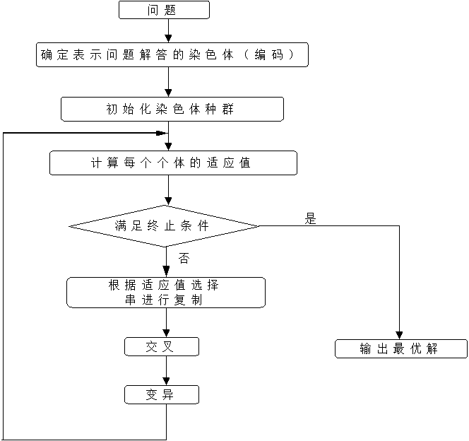

### 1.4 TSP问题简介

​		TSP问题（Traveling Salesman Problem）：假设有一个商人要拜访 n 个城市，他必须选择所要走的路径，路径的限制是每个城市只能拜访一次，而且最后要回到原来出发的城市。路径的选择目标是要求得的路径路程为所有路径之中的最小值。

​		一般可以用一个无向加权图来对TSP问题建模，为了简化编程，我们将若干个城市表示为平面上的若干个点，两个城市的距离即两个点的欧氏距离。

​		TSP问题是一个组合优化问题，暴力求解的时间复杂度为$2^nn^2$。该问题是NP完全问题，这类问题的大型实例不能用精确算法求解，必须寻求这类问题的有效的近似算法。本实验所采用遗传算法就是一种近似算法。

### 1.5 **遗传算法求解TSP问题流程图**

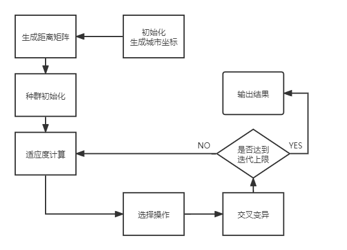

## 二、程序说明

### 2.1 控制参数

| 变量           | 默认值 | 含义               |
| -------------- | ------ | ------------------ |
| **DNA_SIZE**   | 20     | 编码长度，城市个数 |
| **POP_SIZE**   | 200    | 种群大小           |
| **CROSS_RATE** | 0.6    | 交叉率             |
| **MUTA_RATE**  | 0.2    | 变异率             |
| **Iterations** | 1000   | 迭代次数           |

### 2.2 编码规则

对TSP问题，遗传算法首先对每一个城市编号，编码为一个长度为城市数目的一维数组 A ，每个元素为一个城市编号，数组决定了城市的顺序，即从第 A[i] 个城市走到第 A[i+1] 个城市。

在实现中，使用 shuffle 函数来打乱一个数组：

``` python
list = list(range(DNA_SIZE))
random.shuffle(list)
```

### 2.3 选择初始群体

不依靠任何经验，直接随机生成 POP_SIZE 个随机 DNA。

``` python
pop = []
list = list(range(DNA_SIZE))
for i in range(POP_SIZE):
    random.shuffle(list)
    l = list.copy()
    pop.append(l)
```

### 2.4 适应度函数

适应度与该 DNA 对应的旅行距离有关，TSP问题又是一个最小值问题，故旅行距离越小的 DNA 适应度越大，故采用旅行距离的倒数来作为适应度函数。

```python
fitness = 1/(distance(DNA))
```

程序中`getfitness`函数返回的是种群旅行距离的倒数减去旅行距离最小值 + 0.000001，加上一个很小的数是为了避免为 0 时取不了概率。

```python
fitness = 1/(distance(DNA)) - min_fitness + 0.000001
```

### 2.5 遗传操作

* **选择**：根据适应度选择，以赌轮盘的形式，适应度越大的个体被选中的概率越大，每个DNA的选择概率为：

  ```python
  p = (fitness/fitness.sum())
  ```

* **交叉变异**：对于每一个DNA

  * 有 ***(1 - CROSS_RATE)*** 的概率不发生交叉变异，直接进入下一代

  * 有 ***CROSS_RATE*** 的概率发生交叉和变异：

    * **交叉**具体指：选取种群中另一个个体进行交叉，产生2个不相等的节点，中间部分作为交叉段，采用部分匹配交叉，在这个过程中，需要排除不合法的个体，将不合法的个体转换为合法个体。
      * **不合法**指：一个DNA中有两个相同的城市编号。
      * **非法个体转换为合法个体**的方法：遍历原DNA除去交叉片段后剩下的DNA片段，如果其中有与待插入的新片段相同的城市编号，则找出这个相同的城市编号在在原DNA同位置编号的位置的城市编号，循环查找，直至找到的城市编号不再在插入的片段中，最后修改原DNA片段中该位置的城市编号为这个新城市编号。
    
    * **变异**：以 ***MUTA_RATE*** 的概率发生变异，变异行为为随机选取两个不同的位置，将DNA 上这两个位置的城市编号交换。


### 2.6 迭代过程

```python
for i in range(Iterations):  	# 迭代 N 代
    pop = crossmuta(pop, CROSS_RATE) 	# 交叉变异
    fitness = getfitness(pop)			# 计算适应度
    maxfitness = np.argmax(fitness)		# 选取最佳适应度DNA
    best_dis.append(distance(pop[maxfitness])) 	# 保存结果
    pop = select(pop, fitness)  # 选择生成新的种群
```

## 三、程序测试

### 3.1 **求解不同规模的TSP问题的算法性能**

用遗传算法求解不同规模（如10个城市，20个城市，100个城市）的TSP问题

| 城市规模     | 10个城市                 | 20个城市                 | 100个城市                 |
| ------------ | ------------------------ | ------------------------ | ------------------------- |
| **迭代效果** | 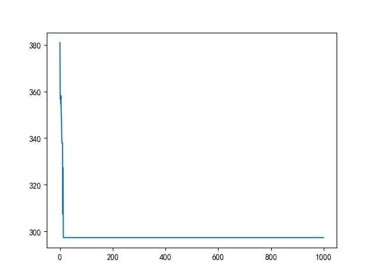     | 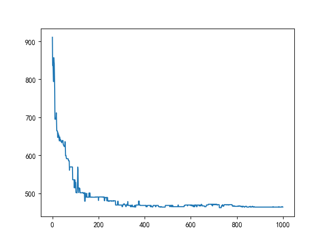     | 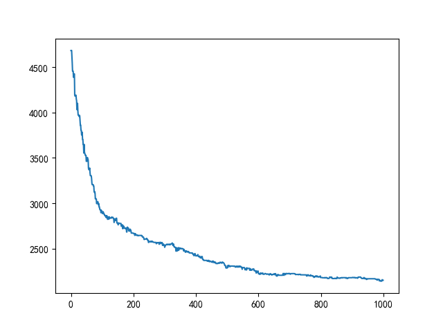     |
| **最佳路线** | 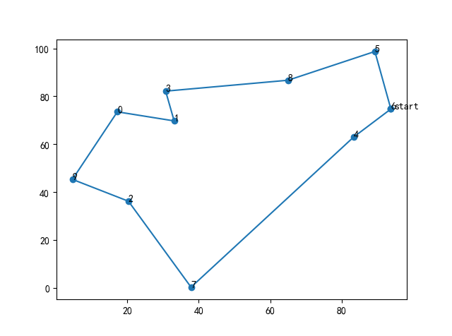 | 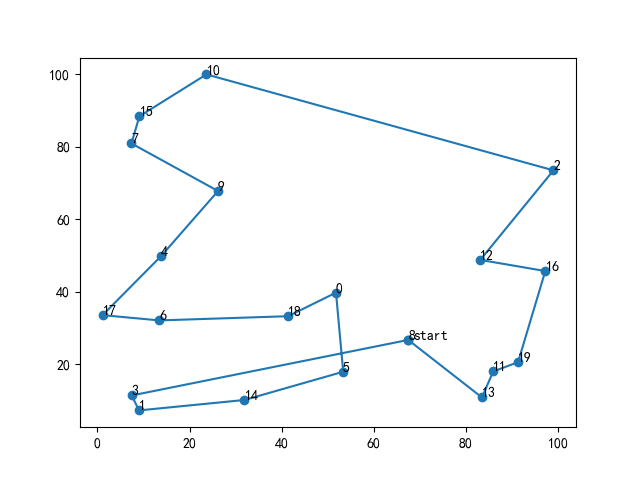 | 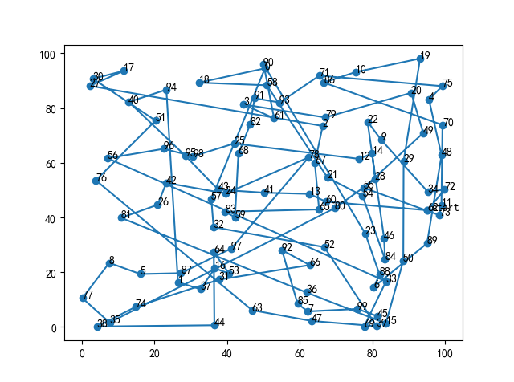 |
| **运行时间** | 8.5秒                    | 14.5秒                   | 65.5秒                    |
| 最短距离     | 297.35091447158914       | 463.9137406306509        | 2150.158898442909         |

**实验分析**：对于迭代效果，可以看到随着城市数目的增加，收敛速度放缓。粗略统计：规模为10时，第10次迭代就开始收敛，而规模为20时到第300次迭代才开始收敛，而规模为1000时，第800次才开始有收敛的迹象；运行时间和最短距离随城市规模的增加而呈线性增长。

### 3.2 **种群规模对算法结果的影响**

**测试参数**：对于每一次测试，City_Map都是相同的，DNA_SIZE = 20, Iterations = 1000, CROSS_RATE = 0.6, MUTA_RATE = 0.2。

| 变量         | 值                                                          | 备注                                |
| ------------ | ----------------------------------------------------------- | ----------------------------------- |
| **POP_SIZE** | [10, 50, 100, 200, 300, 400, 500, 600, 700, 800, 900, 1000] | 每个值测试3次求平均数以降低随机误差 |

**测试结果**：如图所示。

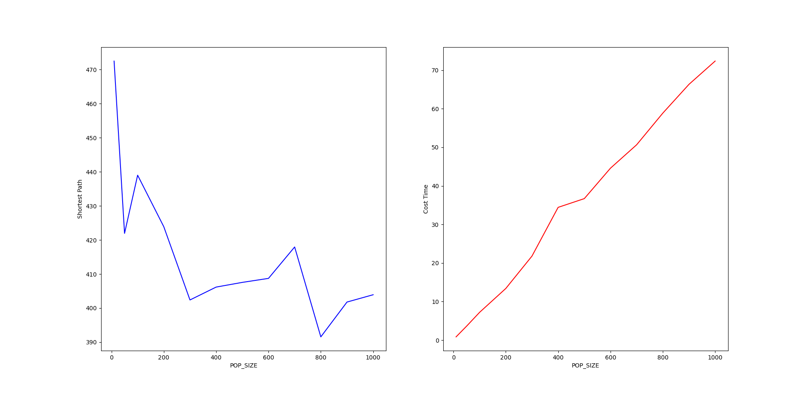

**测试分析**：随着种群数目的增加，算法求解效果越好，在种群数目大于500后，求出的最短路径变化不大；同时，程序耗时随种群规模的增加呈线性增长。

### 3.3 **交叉概率对算法结果的影响**

**测试参数**：对于每一次测试，City_Map都是相同的，DNA_SIZE = 20, POP_SIZE = 100, Iterations = 1000, MUTA_RATE = 0.2。

| 变量           | 值              | 备注                                |
| -------------- | --------------- | ----------------------------------- |
| **CROSS_RATE** | [0,1]，间隔0.05 | 每个值测试3次求平均数以降低随机误差 |

**测试结果**：如图所示。

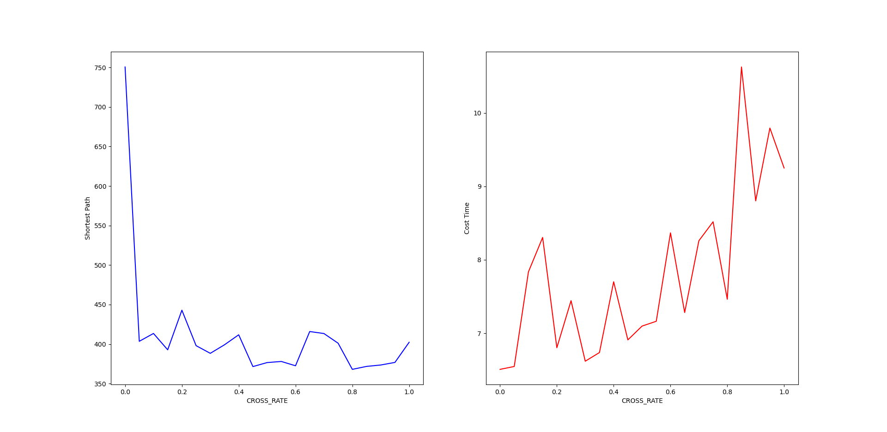

**测试分析**：由于种群数目大，当交叉率大于0.05后，算法都能得到比较好的结果；在耗时上，受随机性影响，耗时不稳定，但总体随交叉率的增大而增多。

### 3.4 **变异概率对算法结果的影响**

**测试参数**：对于每一次测试，City_Map都是相同的，DNA_SIZE = 20, POP_SIZE = 100, Iterations = 1000, CROSS_RATE = 0.6 或 0。

| 变量          | 值              | 备注                                |
| ------------- | --------------- | ----------------------------------- |
| **MUTA_RATE** | [0,1]，间隔0.05 | 每个值测试3次求平均数以降低随机误差 |

**测试结果**：如图所示。

| 交换律  | 最短路径和程序耗时随变异率的变化（下面两张图标对应的地图不同） |
| ------- | ------------------------------------------------------------ |
| **0.6** | 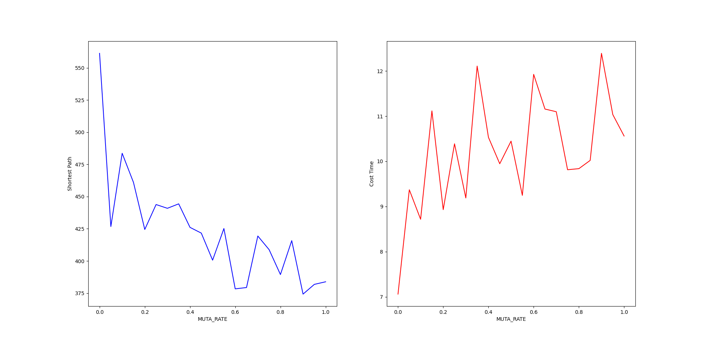                                     |

**测试分析**：从上图可以看出，变异率越大，求出来的最短路径越短，因此高变异率对与本问题是有有利的；在时间损耗上，耗时随变异率的升高有上升趋势。

### 3.5 **交叉概率和变异概率对算法结果的影响**

测试参数：下面尝试同时考虑交叉率和变异率对算法结果的影响。对于每一次测试，City_Map都是相同的，DNA_SIZE = 20, POP_SIZE = 100, Iterations = 1000。

| 变量           | 值             |
| -------------- | -------------- |
| **CROSS_RATE** | [0,1]，间隔0.1 |
| **MUTA_RATE**  | [0,1]，间隔0.1 |

**测试结果**：如下图所示，红色代表最短路径长，即效果不佳，蓝色代表却出来的最短路径越优。


| 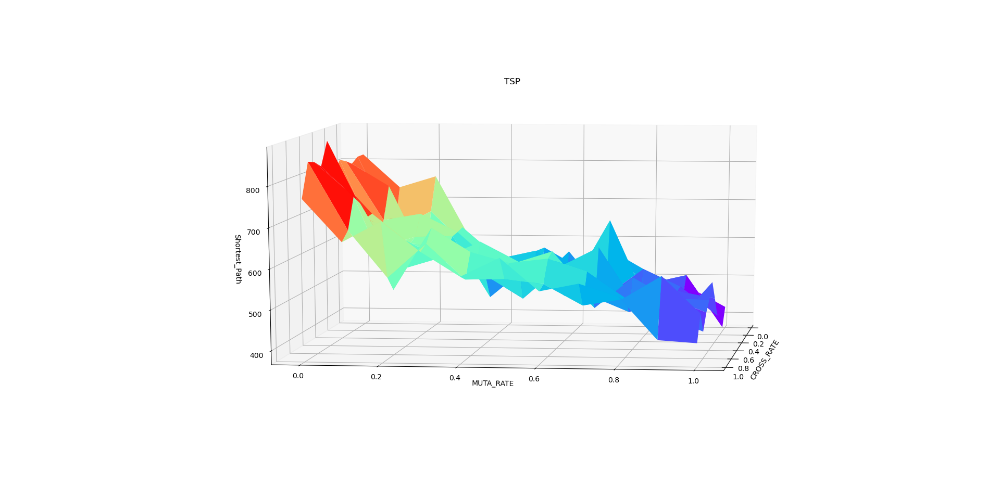 | 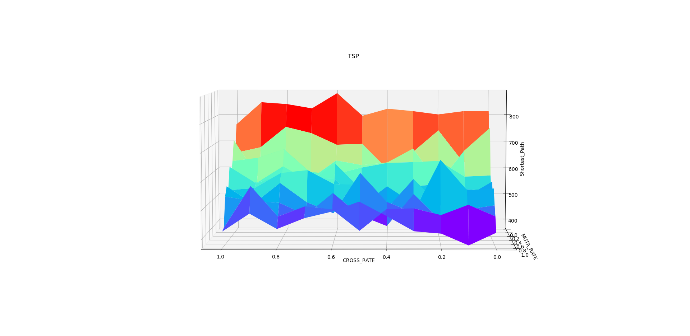 |
| -------------------------- | -------------------------- |
| 变异率截面                 | 交叉率截面                 |

**测试分析**：我们可以看到总体而言，高变异率的效果优于低变异率，而交换律的带来的效果在本图中并不明显，与3.3和3.4的测试结果一致。

## 四、算法改进

**要求**：增加一种变异策略和一种个体选择概率分配策略，比较求解同一TSP问题时不同变异策略及不同个体选择分配策略对算法结果的影响。

### 4.1 块逆转变异策略

采用块逆转变异 Block-reversal 作为TSP的变异策略：在父代中随机选择两个点，然后反转之间的部分，这种变异方法特别适合像TSP这样的问题，即邻接关系。

使用这种方法的一个好处是，这种方法只会破坏与两个点直接相连的边，而不会破坏两点之间和两点之外的部分，可以保留中间部分和外部部分的特征，确保优秀的基因不会被严重破坏。

实现非常简单，只需在源代码上添加一行代码即可实现：

```python
DNA[mutate_point1:mutate_point2].reverse()
```

**测试结果**：（曲线上升是做了排序处理，为了更好比较不同策略的结果）

测试结果如图所示。其中，红色曲线是采用块逆转变异的结果，而蓝色是采用原程序的变异策略的结果，可以看到原程序的变异策略明显在性能上更优；值得注意的是绿色曲线，这是同时使用原程序变异策略和块逆转变异策略的结果。从结果上看，同时使用两种变异策略所达到的效果优于单独使用其中一种。

| 问题规模      | 运行结果              |
| ------------- | --------------------- |
| **20个城市**  | 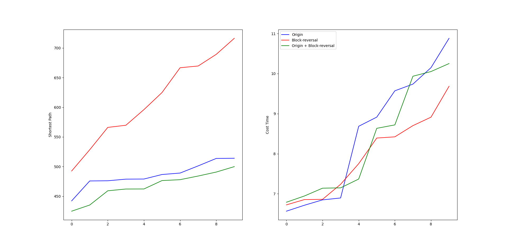   |
| **100个城市** | 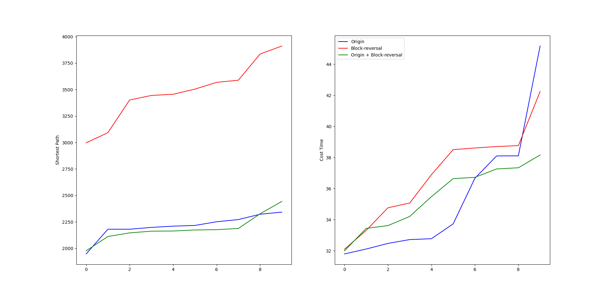 |

### 4.2 锦标赛选择法

**锦标赛选择法**（tournament selection）：每次从种群中取出一定数量个体（成为竞赛规模），然后选择其中最好的一个进入子代种群。重复该操作，直到新的种群规模达到原来的种群规模。

**测试结果**：20次测试结果如图所示，（曲线上升是做了排序处理，为了更好比较不同策略的结果）其中，红色曲线为使用锦标赛选择法的运行结果，绿色曲线为使用锦标赛选择法和块逆转变异策略的运行结果，蓝色曲线为原程序运行结果。观察左图，可以看到锦标赛选择法的性能要优于原程序所采用的赌轮盘选择法；观察右图，可以看到锦标赛选择法的耗时要高于原程序所采用的赌轮盘选择法。

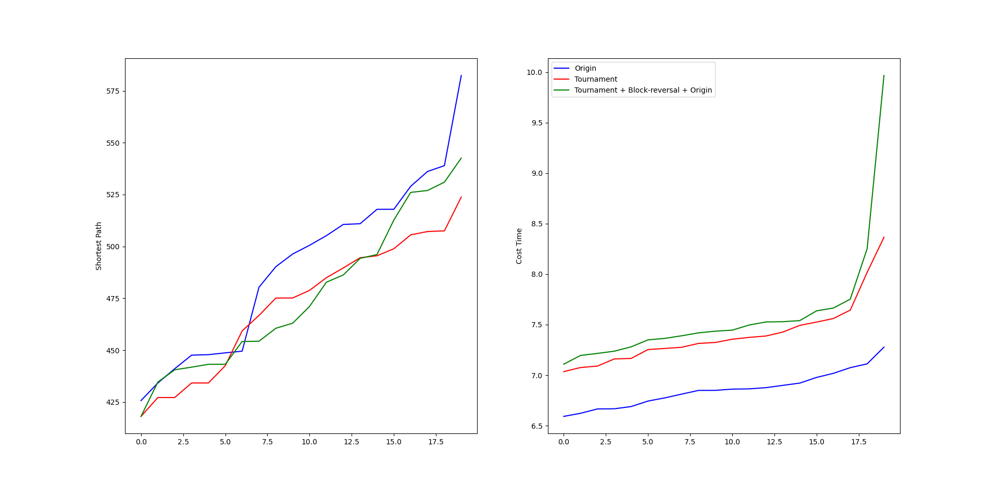

## 五、实验总结

通过本次实验，我们进一步掌握遗传算法的原理、流程和编码策略，重点理解求解TSP问题的流程并测试主要参数对结果的影响，掌握遗传算法的基本实现方法，在原程序的基础上添加了块逆转变异的变异策略和锦标赛选择法。

## 附录

**电子版报告和代码地址：https://gitee.com/WondrousWisdomcard/ai-homework**

### 附录 1 - 改进和测试代码

``` python
import numpy as np
import random
import matplotlib.pyplot as plt
import copy
import time

from matplotlib.ticker import MultipleLocator
from scipy.interpolate import interpolate

CITY_NUM = 20
City_Map = 100 * np.random.rand(CITY_NUM, 2)

DNA_SIZE = CITY_NUM     #编码长度
POP_SIZE = 100          #种群大小
CROSS_RATE = 0.6        #交叉率
MUTA_RATE = 0.2         #变异率
Iterations = 1000       #迭代次数

# 根据DNA的路线计算距离
def distance(DNA):
    dis = 0
    temp = City_Map[DNA[0]]
    for i in DNA[1:]:
        dis = dis + ((City_Map[i][0]-temp[0])**2+(City_Map[i][1]-temp[1])**2)**0.5
        temp = City_Map[i]
    return dis+((temp[0]-City_Map[DNA[0]][0])**2+(temp[1]-City_Map[DNA[0]][1])**2)**0.5

# 计算种群适应度，这里适应度用距离的倒数表示
def getfitness(pop):
    temp = []
    for i in range(len(pop)):
        temp.append(1/(distance(pop[i])))
    return temp-np.min(temp) + 0.000001

# 选择：根据适应度选择，以赌轮盘的形式，适应度越大的个体被选中的概率越大
def select(pop, fitness):
    s = fitness.sum()
    temp = np.random.choice(np.arange(len(pop)), size=POP_SIZE, replace=True,p=(fitness/s))
    p = []
    for i in temp:
        p.append(pop[i])
    return p

# 4.2 选择：锦标赛选择法
def selectII(pop, fitness):
    p = []
    for i in range(POP_SIZE):
        temp1 = np.random.randint(POP_SIZE)
        temp2 = np.random.randint(POP_SIZE)
        DNA1 = pop[temp1]
        DNA2 = pop[temp2]
        if fitness[temp1] > fitness[temp2]:
            p.append(DNA1)
        else:
            p.append(DNA2)
    return p

# 变异：选择两个位置互换其中的城市编号
def mutation(DNA, MUTA_RATE):
    if np.random.rand() < MUTA_RATE: # 以MUTA_RATE的概率进行变异
        # 随机产生两个实数，代表要变异基因的位置，确保两个位置不同，将2个所选位置进行互换
        mutate_point1 = np.random.randint(0, DNA_SIZE)
        mutate_point2 = np.random.randint(0,DNA_SIZE)
        while(mutate_point1 == mutate_point2):
            mutate_point2 = np.random.randint(0,DNA_SIZE)
        DNA[mutate_point1],DNA[mutate_point2] = DNA[mutate_point2],DNA[mutate_point1]

# 4.1 变异：在父代中随机选择两个点，然后反转之间的部分
def mutationII(DNA, MUTA_RATE):
    if np.random.rand() < MUTA_RATE:
        mutate_point1 = np.random.randint(0, DNA_SIZE)
        mutate_point2 = np.random.randint(0, DNA_SIZE)
        while (mutate_point1 == mutate_point2):
            mutate_point2 = np.random.randint(0, DNA_SIZE)
        if(mutate_point1 > mutate_point2):
            mutate_point1, mutate_point2 = mutate_point2, mutate_point1
        DNA[mutate_point1:mutate_point2].reverse()

# 4.1 变异：调用 I 和 II
def mutationIII(DNA, MUTA_RATE):
    mutationII(DNA, MUTA_RATE)
    mutation(DNA, MUTA_RATE)

# 交叉变异
# muta = 1时变异调用 mutation；
# muta = 2时变异调用 mutationII；
# muta = 3时变异调用 mutationIII
def crossmuta(pop, CROSS_RATE, muta=1):
    new_pop = []
    for i in range(len(pop)):   # 遍历种群中的每一个个体，将该个体作为父代
        n = np.random.rand()
        if n >= CROSS_RATE:     # 大于交叉概率时不发生变异，该子代直接进入下一代
            temp = pop[i].copy()
            new_pop.append(temp)
        # 小于交叉概率时发生变异
        if n < CROSS_RATE:
            # 选取种群中另一个个体进行交叉
            list1 = pop[i].copy()
            list2 = pop[np.random.randint(POP_SIZE)].copy()
            status = True
            # 产生2个不相等的节点，中间部分作为交叉段，采用部分匹配交叉
            while status:
                k1 = random.randint(0, len(list1) - 1)
                k2 = random.randint(0, len(list2) - 1)
                if k1 < k2:
                    status = False

            k11 = k1

            # 两个DNA中待交叉的片段
            fragment1 = list1[k1: k2]
            fragment2 = list2[k1: k2]

            # 交换片段后的DNA
            list1[k1: k2] = fragment2
            list2[k1: k2] = fragment1

            # left1就是 list1除去交叉片段后剩下的DNA片段
            del list1[k1: k2]
            left1 = list1

            offspring1 = []
            for pos in left1:
                # 如果 left1 中有与待插入的新片段相同的城市编号
                if pos in fragment2:
                    # 找出这个相同的城市编号在在原DNA同位置编号的位置的城市编号
                    # 循环查找，直至这个城市编号不再待插入的片段中
                    pos = fragment1[fragment2.index(pos)]
                    while pos in fragment2:
                        pos = fragment1[fragment2.index(pos)]
                    # 修改原DNA片段中该位置的城市编号为这个新城市编号
                    offspring1.append(pos)
                    continue
                offspring1.append(pos)
            for i in range(0, len(fragment2)):
                offspring1.insert(k11, fragment2[i])
                k11 += 1
            temp = offspring1.copy()
            # 根据 type 的值选择一种变异策略
            if muta == 1:
                mutation(temp, MUTA_RATE)
            elif muta == 2:
                mutationII(temp, MUTA_RATE)
            elif muta == 3:
                mutationIII(temp, MUTA_RATE)
            # 把部分匹配交叉后形成的合法个体加入到下一代种群
            new_pop.append(temp)

    return new_pop

def print_info(pop):
    fitness = getfitness(pop)
    maxfitness = np.argmax(fitness)     # 得到种群中最大适应度个体的索引
    print("最优的基因型：", pop[maxfitness])
    print("最短距离：",distance(pop[maxfitness]))
    # 按最优结果顺序把地图上的点加入到best_map列表中
    best_map = []
    for i in pop[maxfitness]:
        best_map.append(City_Map[i])
    best_map.append(City_Map[pop[maxfitness][0]])
    X = np.array((best_map))[:,0]
    Y = np.array((best_map))[:,1]
    # 绘制地图以及路线
    plt.figure()
    plt.rcParams['font.sans-serif'] = ['SimHei']
    plt.scatter(X,Y)
    for dot in range(len(X)-1):
        plt.annotate(pop[maxfitness][dot],xy=(X[dot],Y[dot]),xytext = (X[dot],Y[dot]))
    plt.annotate('start',xy=(X[0],Y[0]),xytext = (X[0]+1,Y[0]))
    plt.plot(X,Y)

# 3.2 种群规模对算法结果的影响
def pop_size_test():
    global POP_SIZE
    ITE = 3 # 每个值测试多次求平均数以降低随机误差
    i_list = [10, 50, 100, 200, 300, 400, 500, 600, 700, 800, 900, 1000]
    b_list = []
    t_list = []
    for i in i_list:
        print(i)
        POP_SIZE = i
        time_cost = 0
        min_path = 0
        for j in range(ITE):
            time_start = time.time()
            ans = tsp_solve()
            min_path += min(ans)
            time_end = time.time()
            time_cost += time_end - time_start

        b_list.append(min_path / ITE)
        t_list.append(time_cost / ITE)
    show_test_result(i_list, b_list, t_list, "POP_SIZE")

# 3.3 交叉概率对算法结果的影响
def cross_rate_test():
    global CROSS_RATE
    ITE = 3 # 每个值测试多次求平均数以降低随机误差
    i_list = range(0, 21)
    b_list = []
    t_list = []
    ii_list = [] # [0, 0.05, 0.1, ... 0.95, 1]
    for i in i_list:
        print(i)
        CROSS_RATE = 0.05 * i
        ii_list.append(CROSS_RATE)
        time_cost = 0
        min_path = 0
        for j in range(ITE):
            time_start = time.time()
            ans = tsp_solve()
            min_path += min(ans)
            time_end = time.time()
            time_cost += time_end - time_start

        b_list.append(min_path / ITE)
        t_list.append(time_cost / ITE)
    show_test_result(ii_list, b_list, t_list, "CROSS_RATE")

# 3.4 变异概率对算法结果的影响
def muta_rate_test():
    global MUTA_RATE
    ITE = 3 # 每个值测试多次求平均数以降低随机误差
    i_list = range(0, 21)
    b_list = []
    t_list = []
    ii_list = [] # [0, 0.05, 0.1, ... 0.95, 1]
    for i in i_list:
        print(i)
        MUTA_RATE = 0.05 * i
        ii_list.append(MUTA_RATE)
        time_cost = 0
        min_path = 0
        for j in range(ITE):
            time_start = time.time()
            ans = tsp_solve()
            min_path += min(ans)
            time_end = time.time()
            time_cost += time_end - time_start

        b_list.append(min_path / ITE)
        t_list.append(time_cost / ITE)
    show_test_result(ii_list, b_list, t_list, "MUTA_RATE")

# 3.5 交叉概率和变异概率对算法结果的影响
def cross_muta_test():
    s = np.array([0, 0.1, 0.2, 0.3, 0.4, 0.5, 0.6, 0.7, 0.8, 0.9, 1.0])
    X, Y = np.meshgrid(s,s)
    Z = np.zeros(shape=(11, 11))

    global MUTA_RATE
    global CROSS_RATE
    for i in range(11):
        for j in range(11):
            print(str(i) + ":" + str(j))
            CROSS_RATE = X[0,i]
            MUTA_RATE = Y[0,j]
            ans = tsp_solve()
            Z[i, j] = min(ans)

    ax = plt.axes(projection='3d')
    ax.plot_surface(X, Y, Z, rstride=1, cstride=1,cmap='rainbow', edgecolor='none')
    ax.set_xlabel("CROSS_RATE")
    ax.set_ylabel("MUTA_RATE")
    ax.set_zlabel("Shortest_Path")
    ax.set_title('TSP')
    plt.show()

# 3.2-3.4 生成参数测试结果的可视化图表
def show_test_result(i_list, b_list, t_list, msg):
    ax1 = plt.subplot(121)
    ax1.plot(i_list, b_list, 'b')
    ax1.set_xlabel(msg)
    ax1.set_ylabel("Shortest Path")

    ax2 = plt.subplot(122)
    ax2.plot(i_list, t_list, 'r')
    ax2.set_xlabel(msg)
    ax2.set_ylabel("Cost Time")
    plt.show()

# 求解TSP问题并返回最大值
# muta 指定变异方式，sel 指定选择方式
def tsp_solve(muta=1, sel=1):
    pop = []
    li = list(range(DNA_SIZE))
    for i in range(POP_SIZE):
        random.shuffle(li)
        l = li.copy()
        pop.append(l)
    best_dis = []
    # 进行选择，交叉，变异，并把每代的最优个体保存在best_dis中
    for i in range(Iterations):  # 迭代N代
        pop = crossmuta(pop, CROSS_RATE, muta=muta)
        fitness = getfitness(pop)
        maxfitness = np.argmax(fitness)
        best_dis.append(distance(pop[maxfitness]))
        if sel == 1:
            pop = select(pop, fitness)  # 选择生成新的种群
        elif sel == 2:
            pop = selectII(pop, fitness)  # 选择生成新的种群

    return best_dis

# 4.1 块逆转变异策略对比测试
def opt1_test():
    ITE = 20    # 测试次数
    i_list = range(ITE)
    b_list = []     # 每次求出的最短路径
    t_list = []     # 每次求解的耗时
    b_listII = []
    t_listII = []
    b_listIII = []
    t_listIII = []

    for i in i_list:
        print(i)
        # I. 原两点互换异策略
        time_start = time.time()
        b_list.append(min(tsp_solve(muta=1)))
        time_end = time.time()
        t_list.append(time_end - time_start)
        # II. 块逆转变异策略
        time_startII = time.time()
        b_listII.append(min(tsp_solve(muta=2)))
        time_endII = time.time()
        t_listII.append(time_endII - time_startII)
        # III. 同时使用上述两种变异策略
        time_startIII = time.time()
        b_listIII.append(min(tsp_solve(muta=3)))
        time_endIII = time.time()
        t_listIII.append(time_endIII - time_startIII)

    # 做排序处理，方便比较
    b_list.sort()
    t_list.sort()
    b_listII.sort()
    t_listII.sort()
    b_listIII.sort()
    t_listIII.sort()

    ax1 = plt.subplot(121)
    ax1.plot(i_list, b_list, 'b', label="Origin")
    ax1.plot(i_list, b_listII, 'r', label="Block-reversal")
    ax1.plot(i_list, b_listIII, 'g', label="Origin + Block-reversal")
    ax1.set_ylabel("Shortest Path")
    ax2 = plt.subplot(122)
    ax2.plot(i_list, t_list, 'b', label="Origin")
    ax2.plot(i_list, t_listII, 'r', label="Block-reversal")
    ax2.plot(i_list, t_listIII, 'g', label="Origin + Block-reversal")
    ax2.set_ylabel("Cost Time")
    plt.legend()
    plt.show()

# 4.2 锦标赛选择策略对比测试
def opt2_test():
    ITE = 20  # 测试次数
    i_list = range(ITE)
    b_list = []  # 每次求出的最短路径
    t_list = []  # 每次求解的耗时
    b_listII = []
    t_listII = []
    b_listIII = []
    t_listIII = []

    for i in i_list:
        print(i)
        # I. 原赌轮盘选择策略
        time_start = time.time()
        b_list.append(min(tsp_solve(sel=1)))
        time_end = time.time()
        t_list.append(time_end - time_start)
        # II. 锦标赛选择策略
        time_startII = time.time()
        b_listII.append(min(tsp_solve(sel=2)))
        time_endII = time.time()
        t_listII.append(time_endII - time_startII)
        # III. 锦标赛选择策略 + 两点互换变异 + 块逆转变异策略
        time_startIII = time.time()
        b_listIII.append(min(tsp_solve(sel=2,muta=3)))
        time_endIII = time.time()
        t_listIII.append(time_endIII - time_startIII)

    # 做排序处理，方便比较
    b_list.sort()
    t_list.sort()
    b_listII.sort()
    t_listII.sort()
    b_listIII.sort()
    t_listIII.sort()

    ax1 = plt.subplot(121)
    ax1.plot(i_list, b_list, 'b', label="Origin")
    ax1.plot(i_list, b_listII, 'r', label="Tournament")
    ax1.plot(i_list, b_listIII, 'g', label="Tournament + Block-reversal + Origin")
    ax1.set_ylabel("Shortest Path")
    ax2 = plt.subplot(122)
    ax2.plot(i_list, t_list, 'b', label="Origin")
    ax2.plot(i_list, t_listII, 'r', label="Tournament")
    ax2.plot(i_list, t_listIII, 'g', label="Tournament + Block-reversal + Origin")
    ax2.set_ylabel("Cost Time")
    plt.legend()
    plt.show()

# 3.1 原程序的主函数 - 求解不同规模的TSP问题的算法性能
def ori_main():
    time_start = time.time()
    pop = [] # 生成初代种群pop
    li = list(range(DNA_SIZE))
    for i in range(POP_SIZE):
        random.shuffle(li)
        l = li.copy()
        pop.append(l)
    best_dis= []
    # 进行选择，交叉，变异，并把每代的最优个体保存在best_dis中
    for i in range(Iterations):  # 迭代N代
        pop = crossmuta(pop, CROSS_RATE)
        fitness = getfitness(pop)
        maxfitness = np.argmax(fitness)
        best_dis.append(distance(pop[maxfitness]))
        pop = select(pop, fitness)  # 选择生成新的种群

    time_end = time.time()
    print_info(pop)
    print('逐代的最小距离：',best_dis)
    print('Totally cost is', time_end - time_start, "s")
    plt.figure()
    plt.plot(range(Iterations),best_dis)

# 4.1 块逆转变异策略运行效果展示
def opt1_main():
    time_start = time.time()
    pop = []    # 生成初代种群pop
    li = list(range(DNA_SIZE))
    for i in range(POP_SIZE):
        random.shuffle(li)
        l = li.copy()
        pop.append(l)
    best_dis= []
    # 进行选择，交叉，变异，并把每代的最优个体保存在best_dis中
    for i in range(Iterations):  # 迭代N代
        pop = crossmuta(pop, CROSS_RATE, muta=3)
        fitness = getfitness(pop)
        maxfitness = np.argmax(fitness)
        best_dis.append(distance(pop[maxfitness]))
        pop = select(pop, fitness)  # 选择生成新的种群

    time_end = time.time()
    print_info(pop)
    print('逐代的最小距离：',best_dis)
    print('Totally cost is', time_end - time_start, "s")
    plt.figure()
    plt.plot(range(Iterations),best_dis)

if __name__ == "__main__":

    ori_main()    # 原程序的主函数
    opt1_main()   # 块逆转变异策略运行效果展示
    plt.show()
    plt.close()

    # opt1_test()   # 块逆转变异策略对比测试
    # opt2_test()   # 锦标赛选择策略对比测试

    # pop_size_test()       # POP_SIZE 种群规模参数测试
    # cross_rate_test()     # CROSS_RATE 交叉率参数测试
    # muta_rate_test()      # MUTA_RATE 变异率参数测试
    # cross_muta_test()     # 交叉率和变异率双参数测试
```

