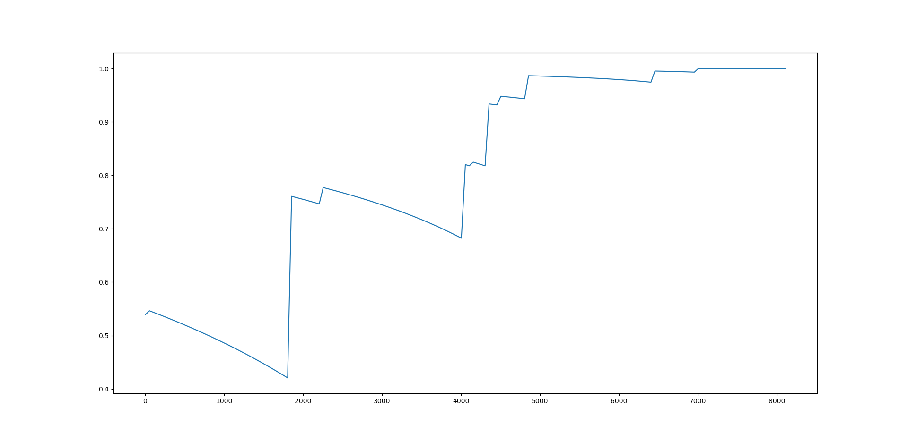

<center><h1>
    人工智能第五次实验报告
    </h1></center>
<center><h2>决策树模型</h2></center>

| 课程：人工智能原理 | 年级专业：19级软件工程 |
| ------------------ | ---------------------- |
| 姓名：郑有为       | 学号：19335286         |

## 目录

[toc]

## 一、问题背景

### 1.1 监督学习简介

​		机器学习的形式包括无监督学习，强化学习，监督学习和半监督学习；学习任务有分类、聚类和回归等。

​		监督学习通过观察“输入—输出”对，学习从输入到输出的映射函数。分类监督学习的训练集为标记数据，每一条数据有对应的”标签“，根据标签可以将数据集分为若干个类别。分类监督学习经训练集生成一个学习模型，可以用来预测一条新数据的标签。

​		常见的监督学习模型有决策树、KNN算法、朴素贝叶斯和随机森林等。

### 1.2 决策树简介

决策树归纳是一类简单的机器学习形式，它表示为一个函数，以属性值向量作为输入，返回一个决策。

* **决策树的组成**

  * 决策树由内节点上的属性值测试、分支上的属性值和叶子节点上的输出值组成。

    

* **决策树的学习算法**

  ```
  函数: dt(dataset, par_dataset, attrs)
  输入: 子数据集 dataset, 父数据集 par_dataset, 属性列表 attrs
  输出: 决策树
  
  if dataset 为空
  	return 父数据集 par_dataset 概率最大的标签
  else if atrs 为空
  	return 子数据集 dataset 概率最大的标签
  else if 子数据集 dataset 的标签全部相同
  	return 子数据集一致的标签
  else
  	best_attr <- attrs 在 dataset 中信息收益最高的属性
  	tree <- 值为 best_attr 的节点
  	for best_attr 的所有可选取值 best_attr_value
  		sub_dataset <- dataset中所有属性best_arr的值为best_attr_value的数据构成的子数据集
  		sub_tree <- dt(sub_dataset, dataset, attrs - best_attr)
  		添加一条从 tree 指向 sub_tree 的边，边的值为 best_attr_value
  	return tree
  ```

* **属性的优先程度判准 - 信息收益**

  使用信息熵来量化当前状态信息的不确定程度，对我们来说，信息熵越小，信息量就越大，也就越重要。熵的的定义如下：
  $$
  H(V) = - \sum_{k} P(v_k) \log_2 P(v_k)
  $$
  设有 $d$ 个不同值的属性 $A$ 将训练集划分为 $d$ 个子集 $E_k$，使用属性 $A$ 对数据集进行划分所得到的信息收益为：

  $$
  G(A) = H(E) - \sum_{k=1}^{d} \frac{|E_k|}{|E|}H(E_k)
  $$
  这里的信息收益也就是使用属性A划分带来熵的期望减少值。

* **决策树算法的改进**
  * **增加信息增益的最小阈值**：如果通过属性 $A$ 划分带来的信息增益小于阈值 $\epsilon$，则不再继续划分，而是生成叶子节点，节点的标签为当前数据集概率最大的标签，这种改进可以减小决策树的规模，避免过度拟合，缩短决策时间。
  *  **$\chi^2$剪枝**：早期终止可能会组织我们发现更好的属性组合，在生成决策树后进行剪枝，即自底向上移除决策树中划分效果不好的节点，替换为叶子节点。$\chi^2$剪枝通过量化数据的偏离程度（带$v-1$个自由度的卡方分布，$v$为样例总数），来判断是否剪枝。剪枝也能减小决策树的规模，避免过度拟合，缩短决策时间。

* **(类ID3) 决策树的适用范围**

  上述给出的决策树基于信息熵的度量，根据属性值来划分节点，当属性值不是离散的选项，如布尔值，而是浮点类型时，需要对数值进行划分，否则会生成非常多的分支节点，不能达到很好的效果。故上述算法要求属性值离散或经过预先分组，构建出的决策树也称为离散决策树。

  * **常见的决策树算法**

    常见的决策树算法除了有基于信息收益的ID3算法，还有基于信息增益比的C4.5算法和基于基尼指数的CART算法。

    **C4.5算法**与ID3算法基本一致，只是将ID3算法的信息收益换成了信息增益比：
    $$
    GR(D,A) = \frac{G(A)}{H(D)}
    $$
    其中 A 为属性， D 为训练集。

    **CART算法**可以处理非离散的属性值，每次划分将训练集根据某个特征 $A$ 的一个可能值 $a_m$ 分割为两个部分（$a < a_m$和$a >= a_m$），在所有可能的特征 $A$ 以及他们所有可能的切分点 $a_m$ 中，选择基尼指数最小的特征及其对应可能的切分点作为最有特征与最优切分点，以此来构建出一棵二叉决策树。

* **决策树的优缺点**：

  * 优点：分类快，具有可读性，易于理解。
  * 缺点：可能会出现过度拟合的问题，并非适用于所有分类场景。

## 二、程序说明

### 2.1 数据载入

数据集被统一格式化为一个类，它包含四个属性： 

* `feature_names`：属性名列表
* `target_names`：标签(分类)名
* `data`：属性数据矩阵, 每行是一个数据, 每个数据是每个属性的对应值的列表
* `target`：目标分类值列表

类`load_car`和`loca_mushroom`分别从文件中导入汽车数据集和蘑菇数据集，类`new_dataset`用于快速生成一个满足格式的数据集，使用方法如下：

### 2.2 功能函数

* **`get_h(target)`** 计算并返回信息熵

  * 参数：`target` 给定目标分类值列表

* **`get_subset(dataset, feature_name, feature_value)`** 筛选并返回子数据集

  * 参数：`dataset` 待分析数据集；`feature_name` 属性名字符串；`feature_value`属性值
  * 选择条件：原数据集中的属性 `feature_name` 值是否等于 `feature_value`

  * 备注：选择后会从数据子集中删去 `feature_name` 属性对应的一列

* **`best_spilt(dataset)`** 寻找并返回信息收益最大的属性划分，返回最佳属性
  * 参数：`dataset` 待分析数据集
* **`vote_most(dataset)`** 返回数据集中一个数据概率上最可能的标签
  * 参数：`dataset` 待分析数据集
* **`accuracy_rate(predict_result, target_result)`** 返回测试的正确率
  * 参数：`predict_result`：预测标签列表，`target_result`：实际标签列表

### 2.3 决策树模型

* **决策树节点 `dt_node`** 一个节点有以下属性：

  | 属性名           | 注释                                                 |
  | ---------------- | ---------------------------------------------------- |
  | **id**           | 为节点赋予一个全局ID, 目的是方便画图                 |
  | **feature_name** | 非叶子节点的属性名，若节点为叶子结点，则为 None      |
  | **target_value** | 叶子节点的标签，若节点为非叶子节点，则为 None        |
  | **vote_most**    | 非叶子节点最可能的标签，若节点为叶子结点，则为 None  |
  | **parent**       | 父亲节点                                             |
  | **child**        | 儿子节点，以当前节点的属性对应的属性值作为键值的字典 |

  **初始化：`dt_node(self, content, is_leaf=False, parent=None)`**

  | 参数名      | 注释                                                     |
  | ----------- | -------------------------------------------------------- |
  | **content** | 节点的内容，对于叶子节点为标签值，对于非叶子节点为属性名 |
  | **is_leaf** | 节点是否为叶子节点，默认为 False                         |
  | **parent**  | 指定节点的父节点，默认为 None                            |

* **决策树模型 `dt_tree`**

  | 属性名        | 注释                                   |
  | ------------- | -------------------------------------- |
  | **tree**      | 决策树的根节点                         |
  | **map_str**   | pydotplus 格式的代码串，用于做图       |
  | **color_dir** | 叶子节点可选颜色, 以标签值为键值的字典 |

  | 方法名                                 | 注释                                                        |
  | -------------------------------------- | ----------------------------------------------------------- |
  | **`fit(self, train_set)`**             | **训练**：根据提供的训练集生成决策树                        |
  | **`predict(self, test_set)`**          | **预测**：对测试集的数据进行预测，返回预测结果数组          |
  | **`show_tree(self, path="demo.png")`** | **可视化**：基于绘图工具 pydotplus 生成图片，保存在 path 中 |

### 2.4 决策树可视化

基于绘图工具 pydotplus ，生成绘图代码

* **初始化代码串**：

  ```python
  self.map_str = """
  digraph demo{
  node [shape=box, style="rounded", color="black", fontname="Microsoft YaHei"];
  edge [fontname="Microsoft YaHei"];
  """
  ```

* **创建叶子节点**：

  ```python
  node_content = "标签：" + str(node.target_value)
  self.map_str += "id" + str(node.id) + "[label=\"" + node_content + "\", fillcolor=\"" + self.color_dir[node.target_value] + "\", style=filled]\n"
  ```

* **创建非叶子节点**：

  ``` python
  node_content = "属性：" + node.feature_name
  self.map_str += "id" + str(node.id) + "[label=\"" + node_content + "\", fillcolor=\"#AADDFF\", style=filled]\n"
  ```

* **创建边**：从节点 `node` 指向一个 子节点 `node.child[feature_value]`

  ``` python
  self.map_str += "id" + str(node.id) + " -> " + "id" + str(node.child[feature_value].id) + "[label=\"" + str(feature_value) + "\"]\n"
  ```

* 生成的代码举例（部分代码）：

  ```
  digraph demo{
  node [shape=box, style="rounded", color="black", fontname="Microsoft YaHei"];
  edge [fontname="Microsoft YaHei"];
  id0[label="属性：safety", fillcolor="#AADDFF", style=filled]
  id1[label="标签：0", fillcolor="#AAFFDD", style=filled]
  id0 -> id1[label="low"]
  id2[label="属性：persons", fillcolor="#AADDFF", style=filled]
  id3[label="标签：0", fillcolor="#AAFFDD", style=filled]
  id2 -> id3[label="2"]}

## 三、程序测试

### 3.1 数据集说明

* **汽车数据 `load_car()`** ：汽车评价数据库是由一个简单的层次决策模型派生而来，该模型最初是为DEX （M. Bohanec, V. Rajkovic: Expert system for decision making. Sistemica 1(1), pp. 145-157, 1990.）模型根据以下概念结构评估汽车的可接受性。

  **属性**：如下表所示

  | 属性         | 属性值                 | 注释         |
  | ------------ | ---------------------- | ------------ |
  | **buying**   | v-high, high, med, low | 购买价格     |
  | **maint**    | v-high, high, med, low | 维护花销     |
  | **doors**    | 2, 3, 4, 5-more        | 门的数量     |
  | **persons**  | 2, 4, more             | 承载人数     |
  | **lug_boot** | small, med, big        | 后备箱的大小 |
  | **safety**   | low, med, high         | 安全性       |

  **标签**：0 - 不可接受， 1 - 可接受

  **数据总数**：1728条

* **蘑菇数据 `load_mushroom()`** ：这个数据集包括了蘑菇样本的描述，每一种都被确定为绝对可食用；绝对有毒；或未知可食用，不推荐。后一类是与有毒的一类结合起来的。

  **属性**：共有22项，依次是 "cap-shape", "cap-surface", "cap-color", "bruises", "odor", "gill-attachment", "gill-spacing", "gill-size", "gill-color", "stalk-shape", "stalk-root", "stalk-surface-above-ring", "stalk-surface-below-ring", "stalk-color-above-ring", "stalk-color-below-ring", "veil-type", "veil-color", "ring-number", "ring-type", "spore-print-color", "population", "habitat"。

  **标签**：e - 可食用（4208项）， p - 有毒（3916项）

  **数据总数**： 8124条

  **数据来源**： https://archive.ics.uci.edu/ml/datasets/Mushroom

### 3.2 决策树生成和测试

* **汽车模型**

​		当**训练规模为500时所生成的决策树**如下图所示。由于每一个属性都有3-5个可选值，故决策树看起来比较扁。

​		在图中，蓝色的节点为属性节点，绿色和紫色的节点为叶子节点，绿色的节点标签值为0，也就是不购买该汽车，蓝色节点标签值为1，表示购买该汽车，每条从一个节点指向其子节点的边上都有一个值，也就是该节点对应的属性的属性值。

​		对于该决策树，用剩下的数据集作为测试集进行测试，**准确度为：0.9307253463732681**。


​		当**训练规模为1000时所生成的决策树**如下图所示，比较上下两图可以看到随着测试规模的增大，决策树的规模也变得更大，但决策树的高度没有变化，只是叶子结点的数目有所增加。

​		对于该决策树，用剩下的数据集作为测试集进行测试，**准确度为：0.9559834938101788**。


* **蘑菇模型**

​		虽然蘑菇模型的属性非常多，数据规模也远大于汽车，但其训练得到的决策树模型就很简单。

​		下图是**训练数据规模为5000时的决策树**，该树的高度只有5，也就意味着最多考虑4个属性（odor, spore-print-color, habitat, population）就可以很好的推断出一中蘑菇是否有毒。绿色和紫色的节点表示叶子节点，标签为 e 代表此种蘑菇可食用，标签为 p 代表此种蘑菇有毒。

​		对于该决策树，用剩下的数据集作为测试集进行测试，**准确度为：0.9859109830291386**


​		下图是当**训练规模增加到8000时的决策树**，只比上图稍微复杂了一些，但高度和考虑的属性都没有改变。

​		对于该决策树，用剩下的数据集作为测试集进行测试，**准确度为：1.0**


### 3.3 学习曲线评估算法精度

将所有的数据划分为训练集和测试集，用训练集学习生成决策树，再对测试集进行预测，分析预测的准确率。

调用方法 `incremental_train_scale_test(dataset, label, interval=1)` 来生成学习曲线，其中：dataset 为数据练集, label 为数据名称, interval 为测试规模递增的间隔。

* **汽车模型**

​		首先从规模为5的训练集开始学习，按照1的频率逐步提高训练规模，直到1729。如下图，可以看到随着训练集规模的逐步递增，精度也在不断升高。


* **蘑菇模型**

​		首先从规模为5的训练集开始学习，按照25的频率逐步提高训练规模，直到8124。如下图，可以看到随着训练集规模的逐步递增，精度也在不断升高，在训练集规模大于7000时，测试的准确率已经达到了100%。



## 四、实验总结

通过本次实验，我们进一步监督学习的基本知识，重点理解决策树的常见算法和改进策略，掌握决策树的基本实现方法，考虑决策树的实现细节，实现了基本的决策树模型并使用汽车模型和蘑菇模型对模型进行测试和可视化，测试效果较好。

## 附录 - 程序代码

**电子版报告和代码地址：https://gitee.com/WondrousWisdomcard/ai-homework**

``` python
import numpy as np
from matplotlib import pyplot as plt
from math import log
import pandas as pd
import pydotplus as pdp

"""
19335286 郑有为
人工智能作业 - 实现ID3决策树
"""

nonce = 0  # 用来给节点一个全局ID
color_i = 0
# 绘图时节点可选的颜色, 非叶子节点是蓝色的, 叶子节点根据分类被赋予不同的颜色
color_set = ["#AAFFDD", "#DDAAFF", "#DDFFAA", "#FFAADD", "#FFDDAA"]

# 载入汽车数据, 判断顾客要不要买
class load_car:
    # 在表格中,最后一列是分类结果
    # feature_names: 属性名列表
    # target_names: 标签(分类)名
    # data: 属性数据矩阵, 每行是一个数据, 每个数据是每个属性的对应值的列表
    # target: 目标分类值列表
    def __init__(self):
        df = pd.read_csv('../dataset/car/car_train.csv')
        labels = df.columns.values
        data_array = np.array(df[1:])
        self.feature_names = labels[0:-1]
        self.target_names = labels[-1]
        self.data = data_array[0:,0:-1]
        self.target = data_array[0:,-1]

# 载入蘑菇数据, 鉴别蘑菇是否有毒
class load_mushroom:
    # 在表格中, 第一列是分类结果: e 可食用; p 有毒.
    # feature_names: 属性名列表
    # target_names: 标签(分类)名
    # data: 属性数据矩阵, 每行是一个数据, 每个数据是每个属性的对应值的列表
    # target: 目标分类值列表
    def __init__(self):
        df = pd.read_csv('../dataset/mushroom/agaricus-lepiota.data')
        data_array = np.array(df)
        labels = ["edible/poisonous", "cap-shape", "cap-surface", "cap-color", "bruises", "odor", "gill-attachment",
                  "gill-spacing", "gill-size", "gill-color", "stalk-shape", "stalk-root", "stalk-surface-above-ring",
                  "stalk-surface-below-ring", "stalk-color-above-ring", "stalk-color-below-ring",
                  "veil-type", "veil-color", "ring-number", "ring-type", "spore-print-color", "population", "habitat"]
        self.feature_names = labels[1:]
        self.target_names = labels[0]
        self.data = data_array[0:,1:]
        self.target = data_array[0:,0]

# 创建一个临时的子数据集, 在划分测试集和训练集时使用
class new_dataset:
    # feature_names: 属性名列表
    # target_names: 标签(分类)名
    # data: 属性数据矩阵, 每行是一个数据, 每个数据是每个属性的对应值的列表
    # target: 目标分类值列表
    def __init__(self, f_n, t_n, d, t):
        self.feature_names = f_n
        self.target_names = t_n
        self.data = d
        self.target = t

# 计算熵, 熵的数学公式为: $H(V) = - \sum_{k} P(v_k) \log_2 P(v_k)$
#        其中 P(v_k) 是随机变量 V 具有值 V_k 的概率
# target: 分类结果的列表, return: 信息熵
def get_h(target):
    target_count = {}
    for i in range(len(target)):
        label = target[i]
        if label not in target_count.keys():
            target_count[label] = 1.0
        else:
            target_count[label] += 1.0
    h = 0.0
    for k in target_count:
        p = target_count[k] / len(target)
        h -= p * log(p, 2)
    return h

# 取数据子集, 选择条件是原数据集中的属性 feature_name 值是否等于 feature_value
# 注: 选择后会从数据子集中删去 feature_name 属性对应的一列
def get_subset(dataset, feature_name, feature_value):
    sub_data = []
    sub_target = []
    f_index = -1
    for i in range(len(dataset.feature_names)):
        if dataset.feature_names[i] == feature_name:
            f_index = i
            break

    for i in range(len(dataset.data)):
        if dataset.data[i][f_index] == feature_value:
            l = list(dataset.data[i][:f_index])
            l.extend(dataset.data[i][f_index+1:])
            sub_data.append(l)
            sub_target.append(dataset.target[i])

    sub_feature_names = list(dataset.feature_names[:f_index])
    sub_feature_names.extend(dataset.feature_names[f_index+1:])
    return new_dataset(sub_feature_names, dataset.target_names, sub_data, sub_target)

# 寻找并返回信息收益最大的属性划分
# 信息收益值划分该数据集前后的熵减
# 计算公式为: Gain(A) = get_h(ori_target) - sum(|sub_target| / |ori_target| * get_h(sub_target))$
def best_spilt(dataset):

    base_h = get_h(dataset.target)
    best_gain = 0.0
    best_feature = None
    for i in range(len(dataset.feature_names)):
        feature_range = []
        for j in range(len(dataset.data)):
            if dataset.data[j][i] not in feature_range:
                feature_range.append(dataset.data[j][i])

        spilt_h = 0.0
        for feature_value in feature_range:
            subset = get_subset(dataset, dataset.feature_names[i], feature_value)
            spilt_h += len(subset.target) / len(dataset.target) * get_h(subset.target)

        if best_gain <= base_h - spilt_h:
            best_gain = base_h - spilt_h
            best_feature = dataset.feature_names[i]

    return best_feature

# 返回数据集中一个数据最可能的标签
def vote_most(dataset):
    target_range = {}
    best_target = None
    best_vote = 0

    for t in dataset.target:
        if t not in target_range.keys():
            target_range[t] = 1
        else:
            target_range[t] += 1

    for t in target_range.keys():
        if target_range[t] > best_vote:
            best_vote = target_range[t]
            best_target = t

    return best_target

# 返回测试的正确率
# predict_result: 预测标签列表, target_result: 实际标签列表
def accuracy_rate(predict_result, target_result):
    # print("Predict Result: ", predict_result)
    # print("Target Result:  ", target_result)
    accuracy_score = 0
    for i in range(len(predict_result)):
        if predict_result[i] == target_result[i]:
            accuracy_score += 1
    return accuracy_score / len(predict_result)

# 决策树的节点结构
class dt_node:

    def __init__(self, content, is_leaf=False, parent=None):
        global nonce
        self.id = nonce # 为节点赋予一个全局ID, 目的是方便画图
        nonce += 1
        self.feature_name = None
        self.target_value = None
        self.vote_most = None # 记录当前节点最可能的标签
        if not is_leaf:
            self.feature_name = content # 非叶子节点的属性名
        else:
            self.target_value = content # 叶子节点的标签

        self.parent = parent
        self.child = {} # 以当前节点的属性对应的属性值作为键值

# 决策树模型
class dt_tree:

    def __init__(self):
        self.tree = None # 决策树的根节点
        self.map_str = """
            digraph demo{
            node [shape=box, style="rounded", color="black", fontname="Microsoft YaHei"];
            edge [fontname="Microsoft YaHei"];
            """ # 用于作图: pydotplus 格式的树图生成代码结构
        self.color_dir = {} # 用于作图: 叶子节点可选颜色, 以标签值为键值

    # 训练模型, train_set: 训练集
    def fit(self, train_set):

        if len(train_set.target) <= 0:  # 如果测试集数据为空, 则返回空节点, 结束递归
            return None

        target_all_same = True
        for i in train_set.target:
            if i != train_set.target[0]:
                target_all_same = False
                break

        if target_all_same:  # 如果测试集数据中所有数据的标签相同, 则构造叶子节点, 结束递归
            node = dt_node(train_set.target[0], is_leaf=True)
            if self.tree == None:  # 如果根节点为空,则让该节点成为根节点
                self.tree = node

            # 用于作图, 更新 map_str 内容, 为树图增加一个内容为标签值的叶子节点
            node_content = "标签：" + str(node.target_value)
            self.map_str += "id" + str(node.id) + "[label=\"" + node_content + "\", fillcolor=\"" + self.color_dir[node.target_value] + "\", style=filled]\n"

            return node
        elif len(train_set.feature_names) == 0:  # 如果测试集待考虑属性为空, 则构造叶子节点, 结束递归
            node = dt_node(vote_most(train_set), is_leaf=True)  # 这里让叶子结点的标签为概率上最可能的标签
            if self.tree == None:  # 如果根节点为空,则让该节点成为根节点
                self.color_dir[vote_most(train_set)] = color_set[0]
                self.tree = node

            # 用于作图, 更新 map_str 内容, 为树图增加一个内容为标签值的叶子节点
            node_content = "标签：" + str(node.target_value)
            self.map_str += "id" + str(node.id) + "[label=\"" + node_content + "\", fillcolor=\"" + self.color_dir[node.target_value] + "\", style=filled]\n"

            return node
        else: # 普通情况, 构建一个内容为属性的非叶子节点
            best_feature = best_spilt(train_set) # 寻找最优划分属性, 作为该结点的值
            best_feature_index = -1
            for i in range(len(train_set.feature_names)):
                if train_set.feature_names[i] == best_feature:
                    best_feature_index = i
                    break

            node = dt_node(best_feature)
            node.vote_most = vote_most(train_set)
            if self.tree == None: # 如果根节点为空,则让该节点成为根节点
                self.tree = node
                # 用于作图, 初始化叶子节点可选颜色
                for i in range(len(train_set.target)):
                    if train_set.target[i] not in self.color_dir:
                        global color_i
                        self.color_dir[train_set.target[i]] = color_set[color_i]
                        color_i += 1
                        color_i %= len(color_set)

            feature_range = [] # 获取该属性出现在数据集中的可选属性值
            for t in train_set.data:
                if t[best_feature_index] not in feature_range:
                    feature_range.append(t[best_feature_index])

            # 用于做图, 创建一个内容为属性的非叶子节点
            node_content = "属性：" + node.feature_name
            self.map_str += "id" + str(node.id) + "[label=\"" + node_content + "\", fillcolor=\"#AADDFF\", style=filled]\n"

            for feature_value in feature_range:
                subset = get_subset(train_set, best_feature, feature_value)  # 获取每一个子集
                node.child[feature_value] = self.fit(subset)  # 递归调用 fit 函数生成子节点
                if node.child[feature_value] == None:
                    # 如果创建的子节点为空, 则创建一个叶子节点作为其子节点, 其中标签值为概率上最可能的标签
                    node.child[feature_value] = dt_node(vote_most(train_set), is_leaf=True)
                node.child[feature_value].parent = node

                # 用于做图, 创建当前节点到所有子节点的连线
                self.map_str += "id" + str(node.id) + " -> " + "id" + str(node.child[feature_value].id) + "[label=\"" + str(feature_value) + "\"]\n"

            # print("Rest Festure: ", train_set.feature_names)
            # print("Best Feature: ", best_feature_index, best_feature, "Feature Range: ", feature_range)
            # for feature_value in feature_range:
            #     print("Child[", feature_value, "]: ", node.child[feature_value].feature_name, node.child[feature_value].target_value)
            return node

    # 测试模型, 对测试集 test_set 进行预测
    def predict(self, test_set):
        test_result = []
        for test in test_set.data:
            node = self.tree # 从根节点一只往下找, 知道到达叶子节点
            while node.target_value == None:
                feature_name_index = -1
                for i in range(len(test_set.feature_names)):
                    if test_set.feature_names[i] == node.feature_name:
                        feature_name_index = i
                        break
                if test[feature_name_index] not in node.child.keys():
                    break
                else:
                    node = node.child[test[feature_name_index]]

            if node.target_value == None:
                test_result.append(node.vote_most)
            else: # 如果没有到达叶子节点, 则取最后到达节点概率上最可能的标签为目标值
                test_result.append(node.target_value)

        return test_result

    # 输出树, 生成图片, path: 图片的位置
    def show_tree(self, path="demo.png"):
        map = self.map_str + "}"
        # print(map)
        graph = pdp.graph_from_dot_data(map)
        graph.write_png(path)

# 学习曲线评估算法精度 dataset: 数据练集, label: 纵轴的标签, interval: 测试规模递增的间隔
def incremental_train_scale_test(dataset, label, interval=1):
    c = dataset
    r = range(5, len(c.data) - 1, interval)
    rates = []
    for train_num in r:
        print(train_num)
        train_set = new_dataset(c.feature_names, c.target_names, c.data[:train_num], c.target[:train_num])
        test_set = new_dataset(c.feature_names, c.target_names, c.data[train_num:], c.target[train_num:])
        dt = dt_tree()
        dt.fit(train_set)
        rates.append(accuracy_rate(dt.predict(test_set), list(test_set.target)))

    print(rates)
    plt.plot(r, rates)
    plt.ylabel(label)
    plt.show()

if __name__ == '__main__':

    c = load_car()  # 载入汽车数据集
    # c = load_mushroom()  # 载入蘑菇数据集
    train_num = 1000 # 训练集规模(剩下的数据就放到测试集)
    train_set = new_dataset(c.feature_names, c.target_names, c.data[:train_num], c.target[:train_num])
    test_set = new_dataset(c.feature_names, c.target_names, c.data[train_num:], c.target[train_num:])

    dt = dt_tree()  # 初始化决策树模型
    dt.fit(train_set)  # 训练
    dt.show_tree("../image/demo.png") # 输出决策树图片
    print(accuracy_rate(dt.predict(test_set), list(test_set.target))) # 进行测试, 并计算准确率吧

    # incremental_train_scale_test(load_car(), "car")
    # incremental_train_scale_test(load_mushroom(), "mushroom", interval=20)
```

