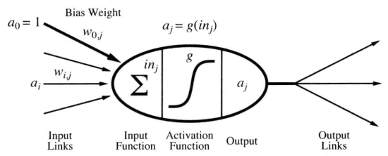
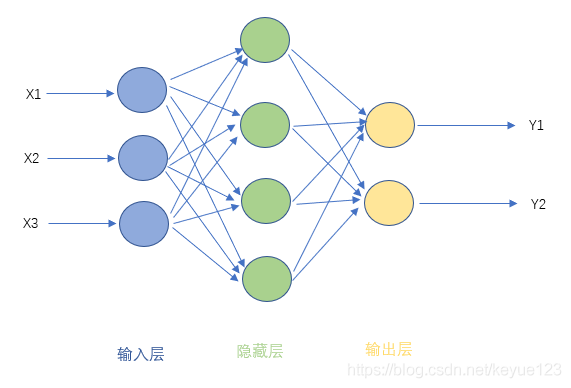
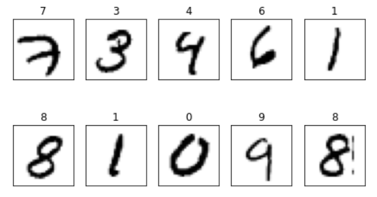
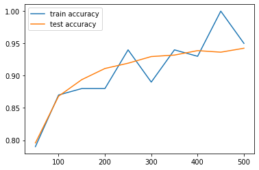
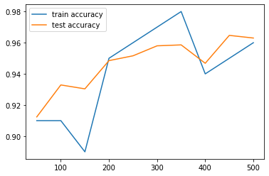

<center><h1>
    人工智能第六次实验报告
    </h1></center>
<center><h2>神经网络分类MNIST数据集</h2></center>

| 课程：人工智能原理 | 年级专业：19级软件工程 |
| ------------------ | ---------------------- |
| 姓名：郑有为       | 学号：19335286         |

## 目录

[toc]

## 一、问题背景

### 1.1 神经网络简介

**神经网络基本概念**：神经网络由许多单元组成，单元之间通过有向的链进行连接。单元的结构非常简单，如下图所示，若干结点的输出作为一个节点的输入，通过神经元输出。每一个边有一个权值，神经单元的激活函数相同。



**前馈神经网络模型**：

前馈神经网络模型如图所示，神经网络被分为若干层次，相邻两层的结点全连接，即一层的输出作为下一层的输入；不相邻的层不存在直接相邻，网络中也不会出现环。最底层为输入层，最顶层为输出层，剩下的层为隐藏层。



**训练神经网络过程**：反向传播算法

​		一个神经网络的好坏由各个结点的权重$w$和偏置$b$决定，神经网络引入损失函数来评估模型训练的结果，模型优化的过程就是最小化损失函数的过程。

​		反向传播的过程可以总结为：先利用观察到的误差计算输出单元的修正误差值$\Delta$，然后从输出层开始，重复以下两步：将$\Delta$值传播回前一层；更新这两层之间的权重；直到到达最早的隐藏层。

**常用的优化算法：**

* **梯度下降**：

  * 一维梯度下降：通过$x \leftarrow \eta f'(x)$来迭代$x$来逼近最优解，其中$\eta$为学习率。
  * 多维梯度下降：通过$x \leftarrow x - \eta\bigtriangledown f(x)$，来逼近最优解，其中$x$是输入向量，$\bigtriangledown f(x)$为目标函数$f(x)$有关$x$的梯度（偏导向量）
  * 随机梯度下降：每次随机均匀采样一个样本索引$i$，并计算梯度$\bigtriangledown f_i(x)$来迭代$x$。
  * 批量梯度下降：每次迭随机均匀采样多个样本来组成一个小批量，然后使用整个小批量来计算梯度。

  梯度下降算法每次迭代的方向仅取决于自变量的当前位置，可能会导致收敛变慢，甚至越过最优解并发散的问题。

* **动量法**：引入动量超参数$\gamma$，保存上一步迭代的影响，所以自变量在各个方向上的移动幅度不仅取决于当前的梯度，还取决于过去的各个梯度在各个方向上是否一致。每次迭代的步骤：
  $$
  v_t \leftarrow \gamma v_{t-1} + \eta_t \bigtriangledown f(x) \\
  x_t \leftarrow x_{t-1} - v_t
  $$

* **AdaGrad算法**：根据自变量在每个纬度的梯度值的大小来调整各个纬度上的学习率，从而避免统一的学习率难以适应所有纬度的问题。使用AdaGrad算法时，自变量中每个元素的学习率在迭代过程中会随着迭代次数而下降。
  $$
  s_t \leftarrow s_{t-1} + \bigtriangledown f(x) \odot \bigtriangledown f(x)\\
  x_t \leftarrow x_t - \frac{\eta}{\sqrt(s_t + \epsilon)} \odot \bigtriangledown f(x)
  $$
  注：这里的$\odot$是指每个元素单独相乘。

* **Adam算法**（自适应矩估计）：示例代码所使用的最优化算法就是Adam算法，算法使用了梯度按元素平方做指数加权移动平均$s_t$和动量法中的动量变量$v_t$，同样目标函数自变量中每个元素都分别拥有各自的学习率。
  $$
  v_t \leftarrow \beta_1 v_{t-1} + (1-\beta_1) \bigtriangledown f(x) \\
  s_t \leftarrow \beta_2s_{t-1} + (1-\beta_2) \bigtriangledown f(x) \odot \bigtriangledown f(x)
  $$
  当$t$较小时，过去各时间步小批量随机梯度权值之和会较小，故引入偏差修正：
  $$
  \hat{v_t} \leftarrow \frac{v_t}{1-\beta_1^t} \\
  \hat{s_t} \leftarrow \frac{s_t}{1-\beta_2^t}
  $$
  最终将模型参数中每个元素的学习率通过按元素运算重新调整，得到：
  $$
  g_t' \leftarrow \frac{\eta \hat{v}_t}{\sqrt{\hat{s}_t}+\epsilon} \\
  x_t \leftarrow x_t-1 - g_t'
  $$

### 1.2 MINST 数据说明

MNIST 数据集由手写数字 ( 0-9 ) 图片组成，每张图片由 28 x 28（784）个像素点构成，每个像素点用一个灰度值表示。

通过 import ***tensorflow1.4*** 的 `tensorflow.examples.tutorials.mnist`，调用 `read_data_sets` 方法即可获取 MNIST 数据集，数据集的组成如下：（IDX文件，是一种用来存储向量与多维度矩阵的文件格式）

* 训练集图片: train-images-idx3-ubyte.gz (含60000个样本)
* 训练集标签: train-labels-idx1-ubyte.gz (含60000个标签)
* 测试集图片: t10k-images-idx3-ubyte.gz(含10000个样本)
* 测试集标签: t10k-labels-idx1-ubyte.gz (含10000个标签)

可以执行以下代码查看部分训练集图像和标签：

```python
mnist = input_data.read_data_sets('MNIST_data', one_hot=False)
x_train, y_train = mnist.train.images, mnist.train.labels # 返回的 X_train 是 numpy 下的 多维数组，(55000, 784)

fig, ax = plt.subplots(nrows = 2, ncols = 5, sharex = True, sharey = True)
fig.tight_layout()
ax = ax.flatten()
for i in range(10):
  img = x_train[i].reshape(28,28)
  ax[i].set_title(str(y_train[i]))
  ax[i].imshow(img,cmap='Greys')
  
ax[0].set_xticks([])
ax[0].set_yticks([])
plt.show()
```




### 1.3 TensorFlow基本概念

​		TensorFlow为张量从流图的一端流动到另一端计算过程。TensorFlow是将复杂的数据结构传输至人工智能神经网中进行分析和处理过程的系统。

​		Tensorflow的设计理念称之为计算流图，在编写程序时，首先构筑整个系统的计算流图（Graph），代码并不会直接生效，这一点和 python 的其他数值计算库（如Numpy等）不同，结构为静态的。在实际的运行时，启动一个 session（`tf.Session()`），程序才会真正的运行。Tensorflow通过计算流图的方式，来优化整个 session 所执行的代码。

* ***Tensor***：张量是 Tensorflow 中主要的数据结构，用于在计算图中进行数据传递，创建了张量后，需要将其赋值给一个变量或占位符，之后才会将该张量添加到计算图中。
* ***Session***：会话是 Tensorflow 中计算流图的具体执行者，与流图进行实际的交互。会话的主要目的是将训练数据添加到流图中进行计算，也可以修改流图的结构。一般使用 with 语句创建会话。
* ***Variable***：变量表示图中的各个计算参数，创建变量应使用 `tf.Variable()`，通过输入一个张量，返回一个变量，变量声明后需进行初始化才能使用。
* ***Placeholder***：占位符用于表示输入输出数据的格式，声明了数据位置，允许传入指定类型和形状的数据，通过会话中的 `feed_dict` 参数获取数据，在计算流图运行时使用获取的数据进行计算，计算完毕后获取的数据就会消失。

## 二、实现说明

### 2.1 构建神经网络模型

1. **为输入输出分配占位符**

   首先，为训练数据集的输入 x 和输出标签 y 创建占位符，即根据神经网络模型中的占位分配必要的内存。

   ``` python
   x = tf.placeholder(tf.float32, [None,784]) # 若干图片，大小为28*28的像素
   y = tf.placeholder(tf.float32, [None,10])  # 若干标签，大小为10的独热编码串
   ```

   同时，为了防止过度拟合，为神经网络设置 Dropout 层，以下为其分配一个占位符。

   ``` python
   keep_prob = tf.placeholder(tf.float32) # 范围：0 ~ 1
   ```

   在一些神经网络模型中，如果模型的参数太多，而训练样本又太少的话，这样训练出来的模型很容易产生过拟合现象。Dropout 层在神经网络每一批训练当中随机减掉一些神经元，上述的 `keep_drop` 就是去除神经元数目的比例。

2. **搭建分层的神经网络**

   实验程序中，包括输入输出层共有五层，每一层的节点数目分别是：768，500，1000，300，10，隐层的节点数目是可以进行调整的。在激活函数的选择上，除了最后一层采用 softmax 之外，其余采用 relu。

   *  ReLU 线性整流函数（Rectified Linear Unit）：在输入小于0的值幅值为0，输入大于0的值不变。
     $$
     ReLU(x) = \left\{  
                  \begin{array}{**lr**}  
                  0, &  x \le 0\\  
                  x, & x > 0
                  \end{array}  
     \right.
     $$

   * Softmax 归一化函数：将输入序列转化成每个数字都在[0,1)之间，且数字的和加起来都等于1的概率序列。
     $$
     Softmax(x)_i = \frac{\exp(x_i)}{\sum_j\exp(x_j)}
     $$

   在搭建网络前，引入两个初始化函数 `weight_variable` 和 `bias_variable` ，分别用来初始化权重 $w$ 和偏置 $b$（节点计算 $y = w x + b$），其中权重初始化采取截断正态分布随机数，生成均值为 $0$ ，标准差为 $0.1$ 且范围位于 $[-0.2,0.2]$ 的随机数，而偏置量取 $0.1$。

   ```python
   def weight_variable(shape):
       initial = tf.truncated_normal(shape, stddev = 0.1) 
       return tf.Variable(initial)
   
   def bias_variable(shape):
       initial = tf.constant(0.1, shape = shape)
       return tf.Variable(initial)
   ```

   接下来搭建分层网络：

   ```python
   # Level 1
   W_layer1 = weight_variable([784, 500])  
   b_layer1 = bias_variable([500]) 
   h1 = tf.add(tf.matmul(x, W_layer1), b_layer1)
   h1 = tf.nn.relu(h1)
   
   # Level 2
   W_layer2 = weight_variable([500, 1000])  
   b_layer2 = bias_variable([1000])   
   h2 = tf.add(tf.matmul(h1, W_layer2), b_layer2)
   h2 = tf.nn.relu(h2)
   
   # Level 3
   W_layer3 = weight_variable([1000, 300])  
   b_layer3 = bias_variable([300])    
   h3 = tf.add(tf.matmul(h2, W_layer3), b_layer3)
   h3 = tf.nn.relu(h3)
   
   # Level 4
   W_layer4 = weight_variable([300, 10])  
   b_layer4 = bias_variable([10])    
   predict = tf.add(tf.matmul(h3, W_layer4), b_layer4)
   y_conv = tf.nn.softmax(tf.matmul(h3, W_layer4) + b_layer4)
   ```

   搭建完神经网络框架之后，需要考虑如何进行训练并修改参数。

   

3. 引入**交叉熵代价函数（Cross-entropy cost function）**，其定义如下：其中$x$为样本，$n$为样本的总数
   $$
   C = -\frac{1}{n}\sum_x[y\ln a + (1-y) \ln (1-a)]
   $$
   可以计算参数$w$和参数$b$的梯度：
   $$
   \frac{\partial C}{\partial w_j} = -\frac{1}{n}\sum_x[y\ln a + (1-y) \ln (1-a)] \frac{\partial \sigma}{\partial w_j} = \frac{1}{n}\sum_x x_j(\sigma(z) - y)
   $$

   $$
   \frac{\partial C}{\partial b} = \frac{1}{n}\sum_x(\sigma(z) - y)
   $$

   其中，Sigmoid函数
   $$
   \sigma(z) = \frac{1}{a+e^{-z}}
   $$
   根据神经网络得到输出后，计算预测结果的交叉熵代价函数。该函数用于衡量预测值与实际值的差距。在训练时，如果预测值与实际值的误差越大，那么在反向传播训练的过程中，各种参数调整的幅度就要更大，从而使训练更快收敛。实现上，可以使用`tf.nn.softmax_cross_entropy_with_logits`来实现。

   ``` python
   cross_entropy = tf.reduce_mean(tf.nn.softmax_cross_entropy_with_logits(logits = predict, labels = y))
   ```

4.	获得交叉熵代价后，通过Adam下降算法修正模型中的参数来缩小损失。

   **Adam下降算法**：Adam下降算法是一种自适应动量的随机优化方法，思路在1.1中简述，效果优于一般的梯度下降算法。TensorFlow提供Adam优化器`AdamOptimizer`，其默认参数如下：

   ```python
   __init__(
       learning_rate=0.001,    # 学习率
       beta1=0.9,				# 一阶矩估计的指数衰减率 \beta_1
       beta2=0.999,			# 二阶矩估计的指数衰减率 \beta_2
       epsilon=1e-08,			# 防止除以零的树 \epsilon
       use_locking=False,		
       name='Adam'
   )
   ```

   `minimize`函数最大限度地最小化 损失值。

   ```python
   train_step = tf.train.AdamOptimizer(1e-4).minimize(cross_entropy)
   ```


5. **处理预测结果**

   ``` python
   # 预测是否准确的结果存放在一个布尔型的列表中
   # argmax返回的矩阵行中的最大值的索引号
   correct_prediction = tf.equal(tf.argmax(y_conv, 1), tf.argmax(y, 1))
   
   # 求预测准确率
   # cast将布尔型的数据转换成float型的数据；reduce_mean求平均值
   accuracy = tf.reduce_mean(tf.cast(correct_prediction, 'float'))
   ```

### 2.2 运行模型

首先调用`tf.global_variables_initializer()`初始化模型的参数，Session提供了Operation执行和Tensor求值的环境

```python
# 初始化
init_op = tf.global_variables_initializer()

with tf.Session() as sess:
    sess.run(init_op)
    
    # 训练样本为55000，分成550批，每批为100个样本
    for i in range(550): 
        # 获取一批含100个样本的数据
        batch = mnist.train.next_batch(100)
        
        # 每过50批，显示其在训练集上的准确率和在测试集上的准确率
        if i % 50 == 0: 
            train_accuracy = accuracy.eval(feed_dict={x: batch[0], y: batch[1], keep_prob: 1.0})
            test_accuracy = accuracy.eval(feed_dict={x: mnist.test.images, y: mnist.test.labels})
            print( 'step %d, training accuracy %g, test accuracy %g' %(i, train_accuracy, test_accuracy))
            
            # 每一步迭代，都会加载100个训练样本，然后执行一次train_step，并通过feed_dict，用训练数据替代x和y张量占位符。 
            sess.run(train_step, feed_dict = {x: batch[0], y: batch[1], keep_prob: 0.5})
            # 显示最终在测试集上的准确率 
            print ('test accuracy %g' % accuracy.eval(feed_dict={x: mnist.test.images, y: mnist.test.labels, keep_prob: 1.0}))
```

其中：

* 模型训练分批次，每一批用100个样本训练神经网络模型，每一批都在上一批的基础上对网络模型的参数进行调整。

* `mnist.train.next_batch`：返回的是一组元组，元组的第一个元素图片像素阵列，第二个元素为 one-hot 格式的预测标签。

* `eval()` ：在一个Session 里面计算张量的值，执行定义的所有必要的操作来产生这个计算这个张量需要的输入，然后通过这些输入产生这个张量。
* `feed_dict`作用是给使用 `placeholder `创建出来的张量赋值，上述我们使用 `placeholder` 定义的占位符包括输入`x`、输出`y`和Dropout 层保留比例`keep_prob`。

## 三、程序测试

### 3.1 运行说明

因为实验代码所需要的TensorFlow版本为1.4.0，而现在TensorFlow的版本已经上升到了2.x，一些以前提供的数据集、函数已经被删除，故直接运行会报错，报错内容为找不到 `tensorflow.examples` 包。

我们可以使用一些Online运行环境，如 Google Colab （https://colab.research.google.com/）。使用云计算来运行我们的程序，将TensorFlow降级至1.4.0，而不修改本地 Python 的配置。

将TensorFlow降级的方法如下：在文件首行加入以下代码，然后再 `import tensorflow`。

```python
%tensorflow_version 1.4.0
```

执行程序后会首先出现以下输出，程序其他部分无需修改即可以正常运行，运行结果与预期一致。

```
`%tensorflow_version` only switches the major version: 1.x or 2.x.
You set: `1.4.0`. This will be interpreted as: `1.x`.

TensorFlow 1.x selected.
```

### 3.2 运行输出

运行输出如下：可以看到随着测试规模的增加，训练和测试的准确率也不断地在上升。

```
step 0, training accuracy 0.07, test accuracy 0.1024
step 50, training accuracy 0.91, test accuracy 0.8892
step 100, training accuracy 0.95, test accuracy 0.9325
step 150, training accuracy 0.94, test accuracy 0.9405
step 200, training accuracy 0.95, test accuracy 0.9468
step 250, training accuracy 0.96, test accuracy 0.9518
step 300, training accuracy 0.94, test accuracy 0.9543
step 350, training accuracy 0.97, test accuracy 0.9645
step 400, training accuracy 0.94, test accuracy 0.9588
step 450, training accuracy 0.95, test accuracy 0.9655
step 500, training accuracy 1, test accuracy 0.9608
test accuracy 0.9586
```

尝试修改部分参数，观察输出变化情况。

* **提高Adam下降算法的学习率**：将学习率从$10^{-4}$提高到$10^{-3}$、$10^-2$

  ``` python
  train_step = tf.train.AdamOptimizer(1e-3).minimize(cross_entropy)
  ```

  可以看到随着学习率的提高，测试正确率有明显的提高，但耗时随之上升。

  ```
  step 0, training accuracy 0.08, test accuracy 0.1123
  step 50, training accuracy 0.94, test accuracy 0.913
  step 100, training accuracy 0.9, test accuracy 0.9283
  step 150, training accuracy 0.95, test accuracy 0.9442
  step 200, training accuracy 0.91, test accuracy 0.9413
  step 250, training accuracy 0.94, test accuracy 0.954
  step 300, training accuracy 0.93, test accuracy 0.9513
  step 350, training accuracy 0.99, test accuracy 0.9598
  step 400, training accuracy 0.97, test accuracy 0.9609
  step 450, training accuracy 0.94, test accuracy 0.9584
  step 500, training accuracy 0.96, test accuracy 0.9609
  test accuracy 0.9651
  ```

  当学习率提高到$10^-2$时，过高的学习率容易跳过最优值，预测效果反而下降。

  ```
  step 0, training accuracy 0.07, test accuracy 0.0877
  step 50, training accuracy 0.89, test accuracy 0.9095
  step 100, training accuracy 0.94, test accuracy 0.9233
  step 150, training accuracy 0.91, test accuracy 0.9267
  step 200, training accuracy 0.89, test accuracy 0.882
  step 250, training accuracy 0.96, test accuracy 0.9383
  step 300, training accuracy 0.92, test accuracy 0.9426
  step 350, training accuracy 0.96, test accuracy 0.9384
  step 400, training accuracy 0.95, test accuracy 0.9524
  step 450, training accuracy 0.93, test accuracy 0.9504
  step 500, training accuracy 0.95, test accuracy 0.9563
  test accuracy 0.9469
  ```

  | 学习率   | $10^-4$          | $10^-3$（效果最好） | $10^-2$          |
  | -------- | ---------------- | ------------------- | ---------------- |
  | 输出图像 |  |     |  |

* **增加/减少神经网络隐层**

  经测试，网络层数（3，4，5）对模型效果的影响不明显。而层次相同的神经网络中节点数目多的表现出性能更优。

## 四、实验总结

​		通过本次实验，我们深入理解了前馈神经网络模型，通过示例代码，研究MINST数据集训练神经网络的过程。第一次了解 TensorFlow，学习了TensorFlow的基本概念和用法，掌握了如何运用TensorFlow来构建一个神经网络模型。
