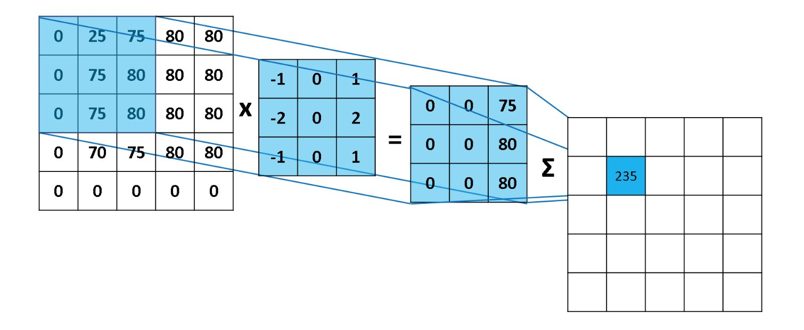
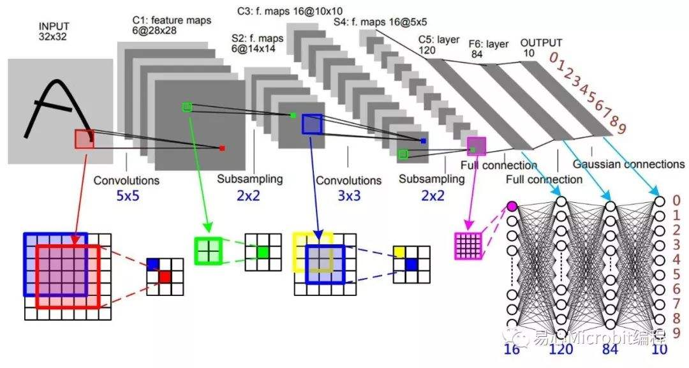
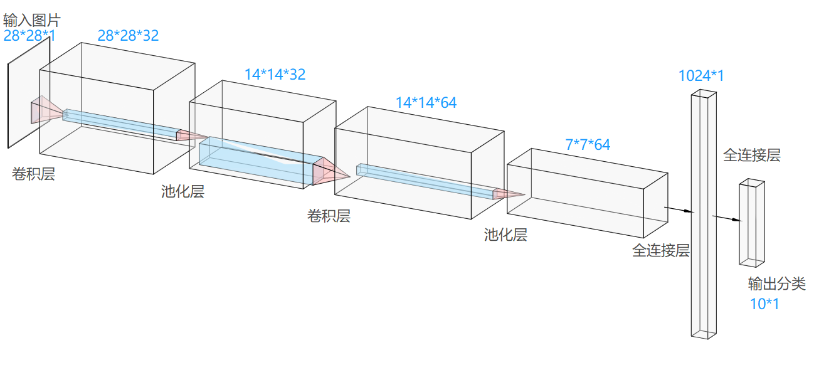
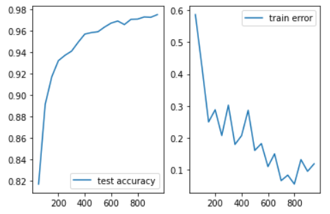

<center><h1>
    人工智能第七次实验报告
    </h1></center>
<center><h2>卷积神经网络分类MNIST数据集</h2></center>

| 课程：人工智能原理 | 年级专业：19级软件工程 |
| ------------------ | ---------------------- |
| 姓名：郑有为       | 学号：19335286         |

## 目录

[toc]

## 一、问题背景

### 1.1 卷积和卷积核

​		在泛函分析中，卷积（Convolution）是通过两个函数生成新函数一种数学算子的卷积的数学公式如下，表征两个函数经过翻转和平移后重叠部分函数值乘积对重叠长度的积分。它的数学公式如下：
$$
\int^{+\infty}_{-\infty}f(\tau)g(x - \tau)d\tau
$$


​		在图像处理中，卷积运算是一种用邻域像素点以一定的权重去重新定义该点的值的一种运算，卷积核实际上提供了一个权重模板，对图像使用一个卷积核进行卷积运算，实际上是一个滤波的过程，每一个卷积核都可以作为一个特征提取工具，提取出图像的一些特征。

​		函数 $f$ 可以理解为原图像， $g$ 为卷积核，卷积核上所有作用点依次作用于原始像素点阵后，线性叠加的输出结果（内积），即是最终卷积的输出。卷积运算如下图所示：



​		用卷积核矩阵在输入矩阵上从左到右、从上到下滑动，每次滑动 $s$个像素，滑动的距离 $s$ 称为步幅。

​		通过卷积，可以实现图像的锐化和边缘检测，这些识别到的特征可以作为有用的信息，用于分类、识别上。

### 1.2 卷积神经网络简介

​		卷积神经网络（CNN，Convolutional Neural Network）是一个多层的神经网络，每层由多个二维平面组成，每个平面由多个独立神经元组成。卷积神经网络中C层和S层，C层为特征提取层，也称为卷积层，是卷积神经网络的核心，S层位特征映射层，也称为下采样层。



​		在卷积层，卷积神经网络利用卷积核对图像进行滤波，可以得到显著的边缘特性。在卷积神经网络中，每一个就卷积层都紧跟着一个下采样层，卷积层负责探测上一层特征的局部连接，下采样层负责把相似的特征合并起来。下采样层合并相似特征的过程降低了特征图的空间分辨率，达到了数据降维的效果。

​		在卷积神经网络中，输入矩阵通过卷积过程形成卷积层，卷积结果在通过下采样过程形成规模减小的特征映射矩阵。卷积过程用一个可训练的滤波器去卷积一个输入特征矩阵，加上一个偏置后得到卷积层。下采样过程将邻域内若干的像素通过池化操作变为一个像素，经过加权和增加偏置后，通过一个激活函数，产生一个缩小的特征映射图。

​		一般卷积神经网络除了卷积层和下采样层之外，还会在输出段加入全连接层，全连接层的输入就是每一个深度最终特征提取的结果，全连接神经网络最后再对这些结果进行分类。

### 1.3 卷积神经网络的细节讨论

* 神经元的空间排列：

  ​		与常规神经网络不同，卷积神经网络的各层中的神经元是三维排列的：宽度、高度和深度。宽度和高度与特征图的宽高一一对应。

  ​		而深度本身是卷积神经网络的一个超参数，在数值上等于使用的滤波器的数量，而每个滤波器是不一样的，在输入数据中寻找的特征。从上一张卷积神经网络图上可以看到，卷积神经网络结构的最后部分将会把全尺寸的图像压缩为包含分类评分的一个向量，向量是在深度方向排列的。

* 局部连接：

  ​		与局部连接相反的是全局连接，对应到一个全连接的神经网络。对于图像数据，因为像素的数量过多，全连接神经网络需要非常多的的参数，这对于算法效率是难以接受的，故使用局部连接的思路：每个神经元只对局部进行感知，即层中的神经元将只与前一层中的一小块区域连接，然后再更高层汇总来得到全局信息。

  ​		局部连接的空间大小叫做神经元的感受野，感受野的大小与滤波器的空间尺寸相等。

* 权值共享：

  ​		每个神经元参数设为相同，即权值共享，也即在同一深度上，每个神经元用同一个卷积核去卷积图像。

* 池化：

  ​		计算图像一个区域上的某个特定特征的平均值（或最大值），这种聚合操作就叫做池化 （平均池化/最大池化）。使用池化可以很好的实现数据降维并防止过度拟合。

  ​		通常在连续的卷积层之间会周期性地插入一个池化层。它的作用是逐渐降低数据体的空间尺寸，这样的话就能减少网络中参数的数量。汇聚层使用最大池化操作，对输入数据体的每一个深度切片独立进行操作，改变它的空间尺寸。最常见的形式是汇聚层使用尺寸2x2的滤波器，以步长为2来对每个深度切片进行降采样，将其中75%的激活信息都丢掉。

## 二、实现说明

### 2.1 构建神经网络模型

所构建的网络模型：卷积层 + 池化层 + 卷积层 + 池化层 + 全连接层 + 全连接层



1. **为输入输出分配占位符**

   首先，为训练数据集的输入 x 和输出标签 y 创建占位符，即根据神经网络模型中的占位分配必要的内存。

   ``` python
   x = tf.placeholder(tf.float32, [None,784]) # 若干图片，大小为28*28的像素
   y = tf.placeholder(tf.float32, [None,10])  # 若干标签，大小为10的独热编码串
   ```

   同时，为了防止过度拟合，为神经网络设置 Dropout 层，以下为其分配一个占位符。

   ``` python
   keep_prob = tf.placeholder(tf.float32) # 范围：0 ~ 1
   ```

   将输入数据变换到四维，一张图片的大小为 28*28=784，1 表示颜色通道数目。这里的 -1 指不用亲自去指定这一维的大小，而是让函数自动计算，应该对应的是图片数目。

   `x_image`是一个 Tensor，具有 `[batch, in_height, in_width, in_channels]` 这样的形状，具体含义是`[训练时一个batch的图片数量, 图片高度, 图片宽度, 图像通道数]`。

   ```python
   x_image = tf.reshape(x, [-1,28,28,1])
   ```

2. **构建卷积层和池化层**

   首先引入函数定义**卷积操作**：

   ``` python
   def conv2d(x,W):
       return tf.nn.conv2d(x, W, strides=[1,1,1,1], padding='SAME')
   ```

   * `tf.nn.conv2d`是 TensorFlow 提供的二维卷积函数：

     ```python
     tf.nn.conv2d(
         input, 
         filter, 
         strides, 
         padding, 
         use_cudnn_on_gpu=None, 
         name=None)
     ```

     * `input`：指需要做卷积的输入图像，要求图像为一个四维`[batch, in_height, in_width, in_channels]` 的 Tensor 对象。
     * `filter`：相当于CNN中的卷积核，它要求也是一个Tensor 对象，具有`[filter_height, filter_width, in_channels, out_channels]` 这样的形状。
     * `strides`：卷积时在图像每一维的步长。要求格式长度为4的一维向量，第二个和第三个参数分别指在`x`维度和`y`维度上的步长。

     * `padding`：边距处理，“SAME” 表示输出图层和输入图层大小保持不变。

   再引入函数定义**池化操作**：

   ``` python
   def max_pool(x):
       return tf.nn.max_pool(x, ksize=[1,2,2,1], strides=[1,2,2,1], padding='SAME')
   ```

   * `tf.nn.max_pool` 是 TensorFlow 提供的最大池化函数：

     ``` python
     tf.nn.max_pool(   
         h,   
         ksize=[1, height, width, 1],  
         strides,  
         padding='VALID',
         name="pool")
     ```

     * `h`：指需要做池化的输入，要求图像为一个四维`[batch, in_height, in_width, in_channels]` 的 Tensor 对象。
     * `k_size`：池化窗口的大小，取一个四维向量，一般是[1, height, width, 1]，因为我们不在 batch 和 channels 上做池化，所以这两个维度设为了1。
     * `strides`：池化时在图像每一维的步长。要求格式长度为4的一维向量，第二个和第三个参数分别指在`x`维度和`y`维度上的步长。
     * `padding`：边距处理，设置为 “VALID” 时表示舍弃多余边距。

   * 函数的池化窗口为2\*2，步长也为2\*2，输出的规模将是输入的1/4。

   **接下来搭建第一个卷积+池化层：**

   先定义一组5*5的卷积核和一组偏置：他们的参数先由`weight_variable`和`bias_variable`生成，权重按正态分布初始化，偏置按常量初始化。

   ```
   W_conv1 = weight_variable([5, 5, 1, 32])
   b_conv1 = bias_variable([32]) 
   ```

   进行卷积操作，输出结果维度不变（还是28*28，深度为32），保存在`h_conv_1`中：

   ``` python
   h_conv1 = tf.nn.relu(conv2d(x_image, W_conv1) + b_conv1)
   ```

   将`h_conv_1`进行池化操作：长宽由28\*28缩小为14\*14

   ```python
   h_pool1 = max_pool(h_conv1)
   ```

   **接下来搭建第二个卷积+池化层：**

   先定义一组5*5的卷积核和一组偏置，深度从32增加到64。

   ```
   W_conv2 = weight_variable([5, 5, 32, 64]) 
   b_conv2 = bias_variable([64])
   ```

   对`h_pool1`进行卷积操作，输出结果维度不变（还是14*14，深度为64），保存在`h_conv_2`中：

   ``` python
   h_conv2 = tf.nn.relu(conv2d(h_pool1, W_conv2) + b_conv2)
   ```

   将`h_conv_2`进行池化操作：长宽由14\*14缩小为7\*7

   ```python
   h_pool2 = max_pool(h_conv2)
   ```

3. **构建全连接层**

   **第一层：从输入规模：7\*7\*64，输出规模：1024**。

   创建参数：

   ```python
   W_fc1 = weight_variable([7*7*64, 1024])
   b_fc1 = bias_variable([1024])
   ```

   将立体的输入转化成一维向量：

   ```python
   h_pool2_flat = tf.reshape(h_pool2, [-1, 7*7*64])
   ```

   计算并通过激活函数（ReLU）：

   ```python
   h_fc1 = tf.nn.relu(tf.matmul(h_pool2_flat, W_fc1) + b_fc1)
   ```

   Dropout 缩减神经网络规模：

   ```
   h_fc1_drop = tf.nn.dropout(h_fc1, keep_prob) 
   ```

   **第二层：从输入规模：1024，输出规模：10（输出分类）**。

   创建参数：

   ```python
   W_fc2 = weight_variable([1024, 10])
   b_fc2 = bias_variable([10])
   ```

   计算并通过归一化函数（Softmax），得到分类输出：

   ``` python
   predict=tf.add(tf.matmul(h_fc1_drop, W_fc2) , b_fc2)
   y_conv = tf.nn.softmax(tf.matmul(h_fc1_drop, W_fc2) + b_fc2)
   ```

4.	**动态调整网络参数**

   与实际标签比较计算此时的损失函数（交叉熵代价函数）：

   ```python
   cross_entropy=tf.reduce_mean(tf.nn.softmax_cross_entropy_with_logits(logits=predict, labels=y))
   ```

   Adam优化算法调整权值：

   ```
   train_step = tf.train.AdamOptimizer(1e-4).minimize(cross_entropy)
   ```

   与实际标签笔记计算预测的准确率：

   ``` python
   correct_prediction = tf.equal(tf.argmax(y_conv, 1), tf.argmax(y, 1))
   accuracy = tf.reduce_mean(tf.cast(correct_prediction, 'float'))
   ```

### 2.2 运行模型

``` python
with tf.Session() as sess:
    sess.run(tf.global_variables_initializer()) # 初始化变量
    starttime = datetime.datetime.now()
    mnist = input_data.read_data_sets('MNIST_data/', one_hot=True) # 读入训练数据
    for i in range(1000):
        batch = mnist.train.next_batch(100)	# 每批选取 100 个样例进行训练
        if i % 50 == 0:
            cross_entropy_now = sess.run(cross_entropy,feed_dict={x: batch[0], y: batch[1], keep_prob: 1})
            print('step %d, training error %g' %(i, cross_entropy_now)) # 输出此时的损失函数
            
        sess.run(train_step, feed_dict = {x: batch[0], y: batch[1], keep_prob: 0.8})
        print('test accuracy %g' % accuracy.eval(session = sess, feed_dict={x: mnist.test.images, y: mnist.test.labels, keep_prob: 1.0})) # 输出此时的模型准确率

	endtime = datetime.datetime.now()
    print('Cost: ' + str(endtime - starttime))
```

## 三、程序测试

### 3.1 运行说明

因为实验代码所需要的TensorFlow版本为1.4.0，而现在TensorFlow的版本已经上升到了2.x，一些以前提供的数据集、函数已经被删除，故直接运行会报错，报错内容为找不到 `tensorflow.examples` 包。

我们可以使用一些Online运行环境，如 Google Colab （https://colab.research.google.com/）。使用云计算来运行我们的程序，将TensorFlow降级至1.4.0，而不修改本地 Python 的配置。

将TensorFlow降级的方法如下：在文件首行加入以下代码，然后再 `import tensorflow`。

```python
%tensorflow_version 1.4.0
```

执行程序后会首先出现以下输出，程序其他部分无需修改即可以正常运行，运行结果与预期一致。

### 3.2 运行输出

对运行代码稍作修改，可以得到训练过程中的损失函数曲线和准确率曲线。

运行结果如下图所示：最终预测正确率为0.9753，耗时06:09。



### 3.3 对比BP神经网络

执行同一段测试代码，可以得到以下结果：

|        | BP神经网络 | 卷积神经网络 |
| ------ | ---------- | ------------ |
| 耗时   | 00:24      | 06:38        |
| 准确率 | 95.6%      | 97.19%       |


综合比较，训练出的卷积神经网络的准确率更高，但训练花费的时间比BP神经网络高得多。

## 四、实验总结

​		通过本次实验，我们学习了卷积神经网络的原理，理解卷积神经网络的层次和各个层次的操作，理解局部链接、全局共享、池化等概念，学会使用 TensorFlow 搭建卷积神经网络模型。
