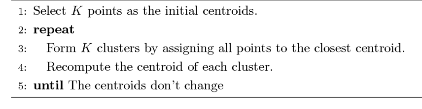
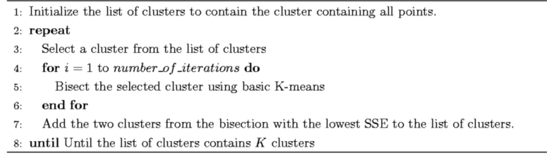

# 人工智能复习笔记

zyw zyw zyw

授课老师：任江涛

> **2017**年考点: 6道大题，好自为之，自求多福
>
> * A*算法
> * 对抗搜索
> * 一阶逻辑及证明
> * 概率，贝叶斯网络，3
> * 决策树，**学第一个根节点，算熵**
> * 打伞 - 马尔克夫过程，和书上完全一样，参数改了


> **2021考了啥：没带计算器还借不到呜呜呜呜呜，谢谢任老师最后借我手机来计算**
>
> * **（20分）谓词逻辑描述，三小题**
> * **（10分）一阶逻辑推导（甚至无需归结反演）**
> * **（20分）A* 模拟 8 数码求解，计算代价函数和画树**
> * **（20分）遗传算法求解TSP，给出编码形式和算法伪码**
> * **（10分）画BP神经网络结构图（输入6个节点、中间层4，3个节点，输出1个节点）**
> * **（20分）决策树，计算选出根节点属性（计算器 needed）**

[toc]

## 第一本书 中国书

### 第 2 章 知识表示与知识图谱

* 知识和知识表示的概念、特性、分类

* **一阶谓词逻辑表示法**

  * 命题: 非真即假的陈述句
  * 谓词: 谓词，个体 $P(x_1, x_2, ...)$ 
  * 谓词公式: 
    * 连接词: 取非、合取、析取、蕴含、等价
      * 真值表
    * 量词: 全称量词、存在量词
      * 量词的辖域 自由变元和约束变元
    * 永真、永假、不可满足
    * 谓词公式等价性 **P33** : 德摩根率、蕴含等值式、量词转化率
    * 推理规则: 假言推理、拒取式推理、假言三段论、反证法
      * **P规则**: 在推理的任何步骤上都可引入前提。
      * **T规则**: 在推理过程中，如果前面步骤中有一个或多个公式永真蕴含公式**S**，则可把**S**引入推理过程中。
      * **CP规则**: 如果能从任意引入的命题**R**和前提集合中推出**S**来，则可从前提集合推出**R** → **S**来
  * 优缺点

* 产生式表示法

  * 产生式: 除逻辑蕴含外，产生式还包括各种操作、规则、变换、算子、函数等
    * 确定性规则知识: $P \to Q$
    * 不确定性规则知识: $P \to Q (0.6)$，括号内为置信度
  * 产生式系统: 由控制系统、规则库、推理机、综合数据库组成
    * 控制系统的工作: 推理、冲突、执行规则、检查推理终止条件
      * 推理: 从规则库中取出一条规则，检查其前提是否可与综合数据库中的已知事实匹配。匹配失败则不能被用于推理。然后取下一条规则进行同样的工作，匹配成功则执行规则。

* 框架表示法: 类似于结构体

  * 框架 槽

* 语义网络表示法

  * 语义网络: 带标识的有向图

  * 语义联系: 

    * 以个体为中心: 实例联系 Is a，泛化联系 A Kind of，聚集联系 Part of，属性联系

      

    * 以谓词为中心: 谓词通过边连接实体

      

* 知识图谱: 用各种不同的图形等可视化技术描述知识资源及其载体，挖掘、分析、构建、绘制和显示知识及它们之间的相互联系。

  * 三元组是知识图谱的一种通用表示方式

    

  * 逻辑结构: 数据层、模式层

  * 知识抽取: 提取知识存入知识图谱

### 第 3 章 确定性推理方法（归结反演）

* 推理: 

  * 演绎推理、归纳推理、默认推理
  * 确定性推理、不确定性推理
  * 正向推理、逆向推理、混合推理

* 自然演绎推理: P、T、假言推理、拒取式推理

  * 例题: PPT 33页，给定事实，证明结论
    1. 根据事实和结论定义谓词
    2. 用谓词公式表示事实和结论
    3. 应用推理规则进行推理

* **归结演绎推理**: 

  * 反证法: $Q$为$P_1, P_2 ...$的逻辑结论，当且仅当$(P_1 \wedge P_2 ...) \wedge \neg Q$是不可满足的。

    * 证明一个子句集是不可满足的，可以通过海伯伦定理 OR 鲁滨逊归结原理。

  * 原子谓词公式、文字、子句（文字的析取）

  * **将谓词公式化为子句集**

    1. 消去蕴含和等值符号

    2. 把否定符号移到仅靠谓词的位置

    3. 变量标准化（重名变量改名）

    4. 消去存在量词: 

       1. 不在全称量词辖域内: 用个体常量替换

       2. 在全称量词辖域内: Skolem化

          

    5. 化为前束式: 把全称量词移动到最外层

    6. 化为 Skolem 标准型: 整个句子变形为子句的合取

    7. 略去全称量词

    8. 取消合取式，句子分割成若干子句

    9. 子句变量标准化: 使每个子句符号不同

  * **谓词公式不可满足的充要条件是其子句集不可满足**

  * 海伯伦定理: 

    * 根据子句集求 H 域

      

    * 基子句: 用 H 域中的元素代换子句中的变元后所得的子句，其中的谓词称为基原子

    * 海伯伦定理: 子句集不可满足的充要条件是存在一个有限的不可满足的基子句集 。

  * 鲁滨逊归结原理: 

    * 归结: **对于两个子句，消去互补的文字，其他的通过析取拼接在一起，得到归结后式。**

    * 检查子句集 S 中是否包含空子句，若包含，则 S 不可满足。

      若不包含，在 S 中选择合适的子句进行归结，一旦归结出空子句，就说明 S 是不可满足的。

  * **归结反演**

    * 用归结反演证明的步骤是: 

      1. 将已知前提表示为谓词公式$F$
      2. 将待证明的结论表示为谓词公式$Q$，并否定得到$\neg Q$ 
      3. 把谓词公式集$\{F, \neg Q\}$ 化为子句集 $S$。
      4. 应用归结原理对子句集$S$中的子句进行归结，并把每次归结得到的归结式都并入到$S$中。如此反复进行，若出现了空子句，则停止归结，此时就证明了$Q$为真。

    * 例题: （直接证明 OR 归结反演）

      

      

      

### 第 5 章 搜索求解策略（A*算法）

* **状态空间表示法**: 状态空间是一个四元组 $(S, O, S_0, G)$，分别表示**状态集合、操作算子集合、问题的初始状态、若干具体状态或满足某些性质的路径信息描述**

  * 求解路径就是从状态节点$S_0$到目标状态节点的路径，路径边上的操作算子序列构成了状态空间的一个解。

  * 八数码例子: 状态集: 棋盘的所有摆法;操作算子: 空格上移、下移、左移、右移

  * 求解过程的状态空间可以用有向图来描述

    

* 回溯搜索: 

  * PS 路径状态表: 保存当前搜索路径上的状态
  * NPS 新路径状态表: 包含了等待搜索的状态，其后裔状态还未被搜索
  * NSS 不可解状态表: 列出了找不到解题路径的状态

* 盲目搜索: 在不具有对特定问题的任何有关信息的条件下，按固定的步骤（依次或随机调用操作算子）进行的搜索。

  * BFS、DFS

* **启发式搜索**: 考虑特定问题领域可应用的知识，动态地确定调用操作算子的步骤，优先选择较适合的操作算子，尽量减少不必要的搜索，以求尽快地到达结束状态。

  * 启发信息和估价函数

    * 估价函数 $f(n)$ 指从初始节点经过n节点到达目的节点的路径的最小代价估计值，一般形式为$f(n) = g(n) + h(n)$
      * 以八数码为例：$g(n)$可以为状态的深度，$h(n)$可以为某种启发式信息的度量，例如曼哈顿距离
      * 以井字棋为例：启发策略为：当前的棋盘我方有多少赢线 - 对方还有多少条赢线
    * 估价函数的任务就是估计待搜索结点的“有希望”程度，并依次给它们排定次序（在open表中），具体体现在每次从Open表中选择$f(n)$值最小的处理。
  
  * **一般启发式图搜索算法伪码**
  
    ```c
    procedure heuristic_search
    open = [start]; closed = [ ]; f(s) = g(s) + h(s);
    while open != [ ] do
    begin
    	从 open 表中删除第一个状态，称之为n;
    	if n == 目的状态 then return SUCCESS;
    	生成 n 的所有子状态;
    	if n 没有任何子状态 then continue;
    	for n 的每个子状态 do
            if 子状态 不在 open 表或 closed 表: 
                    计算该子状态的估价函数值;
                    将该子状态加到 open 表中;
    		if 子状态 在 open 表中: 
    			if 该子状态是沿着一条比在 open 表已有的更短路径而到达
                    记录更短路径走向及其估价函数值;
    		if 子状态 在 closed 表中: 
    			if 该子状态是沿着一条比在 closed 表已有的更短路径而到达 
                    将该子状态从 closed 表移到 open 表中;
                    记录更短路径走向及其估价函数值;
    		将 n 放入 closed 表中;
    		根据估价函数值，从小到大重新排列 open 表;
    	end;
    return failure;
    end.
    ```
  
  * **A*算法**：算法流程和A算法是一样的，区别在于：
  
    * A\*算法的 $h(n) \le h*(n)$，其中$h*(n)$为状态 $n$ 到目标状态最优路径的代价。
    * A*算法一定能找到最优解
  
    ```
    // 我写的，简简单单A*（八数码）
    将起始节点放入 open 中
    如果 open 为空，则搜索失败，问题无解，否则循环求解
       取出 open 的估价函数最小的节点，置为当前节点 current_state，若 current_state 为目标节点，则搜索成功，计算解路径，退出
       寻找所有与 current_state 邻接且不在 closed 中的节点，插入到 open 中，并加入 closed 中，表示已发现
    ```

### 第 6 章 进化算法

* 进化算法：是基于自然选择和自然遗传等生物进化机制的一种搜索算法，算法主要通过选择、重组和变异这三种操作实现优化问题的求解。算法的基本思想：在求解问题时从多个解开始，然后通过一定的法则进行逐步迭代以产生新的解。

* 遗传算法的基本要素

  1. **参数编码**：可以采用位串编码、实数编码、多参数级联编码等
  2. **设定初始群体**：
     1. 启发 / 非启发给定一组解作为初始群体
     2. 确定初始群体的规模
  3. **设定适应度函数**：将目标函数映射为适应度函数
     * 尺度变换（线性变换、幂函数变换法、指数变换法）来保证非负、归一等特性
  4. **设定遗传操作**：
     1. 选择：从当前群体选出一系列优良个体，让他们产生后代个体，
        * 个体选择概率分配方法：适应度比例方法（蒙特卡罗）、排序方法
        * 选择个体方法：锦标赛选择、最佳个体保存、$(\mu + \lambda)$选择
     2. 交叉：两个个体的基因进行交叉重组来获得新个体
        * 一点交叉、两点交叉、均匀交叉
     3. 变异：随机变动个体串基因座上的某些基因
        * 位点变异、逆转变异、移动变异等
  5. **设定控制参数**：例如变异概率、交叉程度、迭代上限等

* 遗传算法的步骤

  

* 双倍体遗传算法：采用显性和隐性两个染色体同时进行进化，提供了一种记忆以前有用的基因块的功能，显性遗传。

* 双种群遗传算法：在遗传算法中使用多种群同时进化，并交换种群之间优秀个体所携带的遗传信息（杂交）。

* 自适应遗传算法：当种群各个体适应度趋于一致或者趋于局部最优时，使变异率和交叉率增加，以跳出局部最优；而当群体适应度比较分散时，使变异率和交叉率减少，以利于优良个体的生存。对于适应度高于群体平均适应值的个体，选择较低的变异率和交叉率，使得该解得以保护进入下一代；对低于平均适应值的个体，选择较高的变异率和交叉率，使该解被淘汰。 

### 第 7 章 群智能算法

* 群智能算法：受动物群体智能启发的算法。
* 粒子群优化算法（PSO）：
  * 位置，速度，方向：将每个个体看作*n*维搜索空间中一个没有体积质量的粒子，在搜索空间中以一定的速度飞行，该速度决定粒子飞行的方向和距离。所有粒子还有一个由被优化的函数决定的适应值。
  * 个体极值与全局极值：在每一次迭代中，粒子通过跟踪两个“极值”来更新自己。第一个就是粒子本身所找到的最优解，这个解称为个体极值。另个一是整个种群目前找到的最优解，这个解称为全局极值。
* 蚁群算法（ACO）：
  * 信息素：越靠近食物播撒的信息素越多，越离开食物播撒的信息素越少
    * 信息素跟踪：蚂蚁按照一定的概率沿着信息素较强的路径觅食。
    * 信息素遗留：蚂蚁会在走过的路上会释放信息素，使得在一定的范围内的其他蚂蚁能够觉察到并由此影响它们的行为
    * 信息素消散：蚁群每完成一次循环，信息素浓度以某种规则（信息素挥发度）减少。
  * 信息素（全局启发信息）和局部启发信息共同决定蚂蚁移动的行为
  * 蚁群模型：不同模型有不同的信息素浓度更新规则，蚂蚁圈系统、蚂蚁数量系统、蚂蚁密度系统

### 第 8 章 人工神经网络

* 神经网络基本概念：神经网络由许多单元组成，单元之间通过有向的链进行连接。单元的结构非常简单，如下图所示，若干结点的输出作为一个节点的输入，通过神经元输出。每一个边有一个权值，神经单元的激活函数相同。

* BP神经网络（反向传播神经网络）：

  

* **神经元的数学模型**

  
  $$
  a_i \leftarrow g(in_i) = g(\sum_jW_{j,i}a_j)
  $$

  * 注意$a_0 = -1$和$W_{0,1}$，对应神经元的偏置 Bias

  * 激活函数$g(in)$

    * 阶跃函数或阈值函数
    * Sigmoid S形函数 $1/(1+e^{-x})$

    

  * 上述模型可以用来实现简单的逻辑函数

    

* 神经网络的结构和工作方式

  * 前馈网络 Feed-forward：前馈网络实现功能，没有内部状态
    * 单层感知器 / 多层感知器


  * 复发性网络 Recurrent network
    * Hopfield network / Boltzmann machines

* **前馈神经网络的例子：前馈神经网络是一组非线性函数的参数化族**

  
  $$
  a_5 = g(W_{3,5}\cdot a_3 + W_{4,5} \cdot a_4) \\
  a_3 = g(W_{1,3}\cdot a_1 + W_{2,3} \cdot a_2) \\
  a_4 = g(W_{1,4}\cdot a_1 + W_{2,4} \cdot a_2)
  $$

* **预测学习过程：通过调整权值来学习，减少在训练集上的误差**


  * 下面结合这个神经网络结构来分析

    

  * 实际输出与与其输出的平方误差（Squared Error）
    $$
    E = \frac12Err^2 = \frac12(y-h_W(x))^2
    $$

  * 采用梯度下降法进行优化搜索（对误差求权重的偏导）
    $$
    \frac{\partial E}{\partial W_j} = Err \times \frac{\partial Err}{\partial W_j} = Err \times \frac{\partial}{\partial W_j}(y - g(\sum_{j = 0}^{n}W_jx_j)) \\
    = -Err \times g'(in) \times x_j
    $$

  * 得到权重更新规则：对于任何线性可分，感知器学习规则收敛到一个一致的函数
    $$
    W_j \leftarrow W_j + \alpha \times Err \times g'(in) \times x_j
    $$

* **反向传播学习 Back-propagation**

  * **每一层都有一样的权重更新规则**
    $$
    W_{j,i} \leftarrow W_{j,i} + \alpha \times Err \times g'(in_i) \times x_j
    $$
    **令**$\Delta_i = Err_i \times g'(in_i)$，它是修正误差值，也是反向传播的因子

  * **对于隐藏层，方向传播输出层的误差**
    $$
    \Delta_j = g'(in_j)\sum_iW_{j,i}\Delta_i
    $$

  * **从而得到隐藏层的更新规则**
    $$
    W_{k,j} \leftarrow W_{k,j} + \alpha \times a_k \times \Delta_j
    $$
    

* **训练神经网络过程**：反向传播算法
  * 一个神经网络的好坏由各个结点的权重$w$和偏置$b$决定，神经网络引入损失函数来评估模型训练的结果，模型优化的过程就是最小化损失函数的过程。
  * 反向传播的过程可以总结为：**先利用观察到的误差计算输出单元的修正误差值$\Delta$，然后从输出层开始，重复以下两步：将$\Delta$值传播回前一层；更新这两层之间的权重；直到到达最早的隐藏层。**


* 梯度下降：

  * 一维梯度下降：通过$x \leftarrow \eta f'(x)$来迭代$x$来逼近最优解，其中$\eta$为学习率。
  * 多维梯度下降：通过$x \leftarrow x - \eta\bigtriangledown f(x)$，来逼近最优解，其中$x$是输入向量，$\bigtriangledown f(x)$为目标函数$f(x)$有关$x$的梯度（偏导向量）
  * 随机梯度下降：每次随机均匀采样一个样本索引$i$，并计算梯度$\bigtriangledown f_i(x)$来迭代$x$。
  * 批量梯度下降：每次迭随机均匀采样多个样本来组成一个小批量，然后使用整个小批量来计算梯度。

  梯度下降算法每次迭代的方向仅取决于自变量的当前位置，可能会导致收敛变慢，甚至越过最优解并发散的问题。


* **BP算法流程**

  

  * **初始化：对所有连接权和阈值赋随机值**
  * **从 N 组输入中取一组样本，把输入信息输入到 BP 网络中**
  * **正向传播：以此计算各层结点的输出值**
  * **计算误差：计算实际输出与期望输出的误差**
  * **反向传播：从输出层方向计算到第一个隐层，按连接权值修正公式减小误差方向调整整个网络的各个连接权值**
  * **取出另一组样本重复第二步到第五步，直到 N 组输入输出误差样本达到要求时为止。**


* BP神经网络的特点：


  * 多层前向网络（输入层、隐层、输出层）
  * 连接权值通过$\Delta$学习算法进行修正
  * 优点：很好的逼近特性，具有较强的泛化能力，具有较好的容错性。
  * 缺点：收敛速度慢，局部极值，难以确定隐层和隐层结点的数目。

* Hopfield神经网络

* 卷积神经网络

* 生成对抗神经网络：由生成网络（generative network）和判别网络（discriminative network）两部分构成


  * GAN的两个相互交替的训练阶段：


    * 固定生成网络，训练判别网络
    * 固定判别网络，训练生成网络

    两个网络相互对抗的过程，就是各自网络参数不断调整的过程，即学习过程。

## 第二本书 美国书

### 第 13 章 不确定性量化

* **条件独立性**：如果$P(X,Y|Z)=P(X|Z)P(Y|Z)$，或等价地$P(X|Y,Z) = P(X|Z)$，则称事件X,Y对于给定事件Z是条件独立的，也就是说，**当Z发生时，X发生与否与Y发生与否是无关的**。

* **完全联合分布**：对于 $n$ 个布尔变量，完全联合分布含 $2^n$ 项。

  

* **贝叶斯规则**

  

* **朴素贝叶斯模型**：单一原因影响多个结果，结果相对独立。

  $P(X,A,B,C) = P(A|X) P(B|X) P(C|X) P(X)$，其中$A,B,C$相互独立。

  


### 第 14 章 概率推理（贝叶斯网络）

* **贝叶斯网络定义**

  

  * 节点：随机变量
  * 有向边：父节点随机变量是该节点随机变量的条件
  * 节点的条件概率分布表：$P(X_i|Parents(X_i))$

* **贝叶斯网络举例：拓扑结构 + 条件概率表**

  

* **贝叶斯网络表示完全联合概率分布**
  $$
  P(x_1,...x_n) = \prod_{i = 1}^n\theta(x_i|Parents(X_i))
  $$

* **计算题举例**

  

* 贝叶斯网络构造方法：一个好的排序很重要

  

* **条件独立关系的一些分析**

  * 给定父节点，结点条件独立于其他祖先结点

  * 给定马尔科夫覆盖，结点条件独立与网络中所有其他节点
    * 马尔科夫覆盖：一个节点的父节点、子节点以及子节点的父节点

* 处理贝叶斯网络中的连续变量

  * 离散化，划分范围

  * 定义一族标准的概率密度函数，再用有限个参数进行指定

* 混合贝叶斯网络举例：需要考虑一些连续分布的概率模型，考虑节点、父节点是连续变量的情况

  

  比如线性高斯模型：

  

  父节点连续而该节点离散的情况：可以采用软阈值

  

* **贝叶斯网络的精确推理**

  * **枚举计算**

    

    ​																																																																	

    

    **还要注意查表别查错了**

    

  * 变量消元：一层一层的向量运算？

* 贝叶斯网络中的近似推理

### 第 15 章 时间上的概率推理（马尔可夫模型)

* **马尔科夫假设**：**当前状态只依赖于有限的固定数量的过去状态**

* **马尔可夫过程（马尔可夫链）：当前状态只依赖于前一个状态，与更早的状态无关（转移模型）**
  $$
  一阶马尔可夫模型\quad P(X_t|X_{0:t-1}) = P(X_t|X_{t-1})
  $$
  

* **传感器马尔可夫假设**：（传感器模型、观察模型）

  > **其中 $E$ 是可观察的证据变量集， $X$ 是不可观察的状态变量集**

  $$
  传感器模型 \quad P(E_t | X_{0:t},E_{0:t-1}) = P(E_t | X_t)
  $$

  **雨伞世界的例子**：在这个一阶马尔可夫过程例子中，Rain 是不可观察的状态变量集 X，Umbrella 是可观察的证据变量集 E

  

  可以通过提高阶数（考虑多天）或扩大状态变量（温度、潮湿度等)及和来提高精确程度。

* **完整的模型**：所有变量上完整的联合概率分布（状态从 0 开始，现象从 1 开始，$P(X_0)$为先验概率），对于任何$t$，都有：
  $$
  P(X_{0:t},E_{1:t}) = P(X_0)\prod_{i=1}^tP(X_i|X_{i-1})P(E_i|X_i)
  $$
  **公式的右边依次是：初始状态模型、转移模型和传感器模型。**

* **时序模型中的推理**（他应该会考给定一个式子，叫我们算结果吧）

  * **滤波 Filtering**

    * 滤波也称为状态估计，其任务是：**给定目前为止的所有证据，计算当前状态的后验概率分布。**
    * 在上面的例子中，就是给定目前为止雨伞携带者的过去的所有观察数据，计算今天下雨的概率。

    $$
    P(Rain_t|Umbrella_{1:t})
    $$

  * **预测 Prediction**

    * 预测的任务是给定目前为止的所有证据，计算未来状态的后验分布。
    * 在上面的例子中，例如给定目前为止对雨伞携带者的所有观察数据面积算从今天开始三天以后下雨的概率。

    $$
    P(Rain_{t+3}|Umbrella_{1:t})
    $$

  * **平滑 Smoothing**

    * 平滑的任务就是给定目前为止的所有证据，计算过去某一个状态的后验概率。
    * 例如：

    $$
    P(Rain_{t-3}|Umberlla_{1:t})
    $$

  * **最可能解释**

    * 给定观察序列，找到最可能生成这些观察结果的状态序列。

    $$
    arg max_{x_{1:t}}P(X_{1:t}|E_{1:t})
    $$

* **计算题**

  * 滤波：一个有用的滤波算法需要维持一个当前的状态估计并进行更新。

    * 递归估计：给定直到时刻$t$的滤波结果，根据新的证据$e_{t+1}$来计算时刻$t+1$的滤波结果。
      $$
      \begin{align}
      P(X_{t+1}|e_{1:t+1}) &= P(X_{t+1}|e_{1:t}, e_{t+1}) \quad证据分解\\
      &= \alpha P(e_{t+1}|X_{t+1},e_{1:t})P(X_{t+1}|e_{1:t}) \quad贝叶斯规则\\
      &= \alpha P(e_{t+1}|X_{t+1})P(X_{t+1}|e_{1:t}) \quad传感器马尔可夫假设\\
      &= \alpha P(e_{t+1}|X_{t+1})\sum_{x_i}P(X_{t+1}|x_t,e_{1:t})P(x_t|e_{1:t}) \\
      &= \alpha P(e_{t+1}|X_{t+1})\sum_{x_i}P(X_{t+1}|x_t)P(x_t|e_{1:t}) \quad马尔可夫假设
      \end{align}
      $$
      在上面这个式子中，$P(e_{t+1}|X_{t+1})$是传感器模型参数，$P(X_{t+1}|x_t)$ 是转移模型参数，不会改变，而$P(x_t|e_{1:t})$是上一次计算的结果。

      > 输入输出都是向量，例如说，发生事件A的概率和没有发生事件A的概率组成一个二维向量
      >
      > 我懂了，他这样搞出这个式子。里面的项可以直接用马尔科夫链图里的来替换算出结果

    * **滤波例子：计算$P(R_2|u_{1:2})$**

      先算转移模型（公式的后半部分），再带入观察者模型

      

      * **第 0 天：**先验概率：$P(R_0) = <0.5, 0.5>$

      * **第 1 天：**$U_1 = true$，从$t = 0$到$t = 1$的预测结果为：
        $$
        P(R_1) = \sum_{r_0} P(R_1|r_0)P(r_0) \\
        = <0.7, 0.3> \times 0.5 + <0.3, 0.7> \times 0.5 = <0.5,0.5>
        $$
        上面是向量的，有点难理解，我们可以分别考虑：

        $P(r_1) = P(r_1|r_0)P(r_0) + P(r_1|\neg r_0)P(\neg r_0) = 0.7 * 0.5 + 0.3 * (1 - 0.5)$

        $P(\neg r_1) = P(\neg r_1|r_0)P(r_0) + P(\neg r_1|\neg r_0)P(\neg r_0) = 0.3 * 0.5 + 0.7 * (1 - 0.5)$

        接下来：更新步骤 用$t = 1$时刻的证据的概率相乘并规范化，得到新结果

        > 向量每行对齐分别相乘，各行互不影响；
        >
        > $\alpha$ 不用先算，直接将向量归一化即可

        $$
        P(R_1|u_1) = \alpha P(u_1|R_1)P(R_1) = \alpha <0.9,0.2><0.5,0.5> \\
        =\alpha<0.45, 0.1> \approx <0.818, 0.182>
        $$

        > 雨伞世界的马尔科夫链的模型 （概率值）是始终不变的。

      * **第 2 天：**$U_2 = true$，从$t = 1$到$t = 2$的预测结果为：
        $$
        P(R_2|u_1) = \sum_{r_1} P(R_2|r_1)P(r_1|u_1) \\
        = <0.7, 0.3> \times 0.818 + <0.3, 0.7> \times 0.182 = <0.627, 0.373>
        $$
        接下来：更新步骤 用$t = 2$时刻的证据的概率相乘并规范化，得到新结果
        $$
        P(R_2|u_1,u_2) = \alpha P(u_2|R_2)P(R_2|u_1) = \alpha <0.9,0.2><0.627, 0.373> \\
        =\alpha<0.565, 0.075> \approx <0.883, 0.117>
        $$

  * **预测**：被简单地理解为没有增加新证据条件下的滤波，递归计算过程如下：
    $$
    P(X_{t+k+1} | e_{1:t}) = \sum_{x_{t+k}}P(X_{t+k+1}|x_{t+k})P(x_{t+k}|e_{1:t})
    $$
    **这个过程只涉及转移模型，不涉及传感器模型**，$k$越大，未来就越模糊会收敛到一个稳态分布。根滤波计算过程相比，无需计算滤波的第一步，只用计算第二步就行。

  * **平滑**：给定直到现在的已知证据，来计算过去的状态的分布的过程。

    * **将计算分为两部分：直到时刻$k$的证据以及从时刻$k+1$到时刻$t$的证据**

      
      $$
      \begin{align}
      P(X_k|e_{1:t}) &= P(X_k|e_{1:k}, e_{k+1, t}) \\
      &= \alpha P(X_k|e_{1:k})P(e_{k+1:t}|X_k,e_{1:k}) \quad贝叶斯规则\\
      &= \alpha P(X_k|e_{1:k})P(e_{k+1:t}|X_k) \quad条件独立性\\
      
      \end{align}
      $$
      **前半部分是：滤波过程的计算，下面考虑后半部分$P(e_{k+1:t}|X_k)$**
      $$
      \begin{align}
      P(e_{k+1:t}|X_k) &= \sum_{x_{k+1}}P(e_{k+1:t}|X_k, x_{k+1})P(x_{k+1}|X_k) \quad将X_{k+1}条件化\\
      &= \sum_{x_{k+1}}P(e_{k+1:t}|x_{k+1})P(x_{k+1}|X_k) \quad条件独立性\\
      &= \sum_{x_{k+1}}P(e_{k+1:t}，e_{k+2:t}|x_{k+1})P(x_{k+1}|X_k) \\
      &= \sum_{x_{k+1}}P(e_{k+1}|x_{k+1})P(e_{k+2:t}|x_{k+1})P(x_{k+1}|X_k) \quad条件独立性\\
      \end{align}
      $$
      **第一项和第三项都可以直接从马尔可夫模型中得到，第二项递归得到。**

      **递归阶段的初始值为全为1的向量，因为$e_{t+1:t}$是一个空序列。**

      **例子：**

      

* 学习 Learning


### 第 18 章 样例学习（决策树和人工神经网）

* **有监督的分类和无监督的聚类** 
  * Classification or Categorization 感知智能最基本的两个问题
  * 二者的**定义**是：
    * **分类**：按照某种标准**给对象贴标签**(label)，再根据标签来区分归类。
    * **聚类**：指事先没有“标签”而通过某种成团分析找出事物之间存在聚集性原因的过程。
  * 二者的**区别**是：
    * 分类是事先定义好类别，类别数不变。分类器需要由人工标注的分类训练语料训练得到，属于有指导学习范畴。
    * 聚类则没有事先预定的类别，类别数不确定。 聚类不需要人工标注和预先训练分类器，类别在聚类过程中自动生成。
  * 二者的**适用场景**是：
    * 分类适合类别或分类体系已经确定的场合，比如按照国图分类法分类图书。
    * 聚类则适合不存在分类体系、类别数不确定的场合，一般作为某些应用的前端，比如多文档文摘、搜索引擎结果后聚类(元搜索)等。

* 学习的形式：

  * **无监督学习**：无显式反馈，学习输入的模式，常见的无监督学习任务是聚类：再输入样例中发现有用的类集。

  * **强化学习**：在强化序列（有奖赏和惩罚组成的序列）中学习。

    > 以“试错”的方式进行学习，通过与环境进行交互获得的奖赏指导行为，目标是使智能体获得最大的奖赏，强化学习不同于连接主义学习中的监督学习，主要表现在强化信号上，强化学习中由环境提供的强化信号是对产生动作的好坏作一种评价（通常为标量信号），而不是告诉强化学习系统如何去产生正确的动作。

  * **监督学习**：观察“输入——输出”对，学习从输入到输出的映射函数。

  * 半监督学习：半监督学习使用大量的未标记数据，以及同时使用标记数据，来进行模式识别工作。

* **决策树**：决策树归纳是一类简单的机器学习形式，它表示为一个函数，以属性值向量作为输入，返回一个决策。

  * 举例：

    |  |  |
    | ---------------------------------------- | ---------------------------------------- |

    > 备注：一个属性如果范围是连续的，则它的子树中还是可以包含该属性。

* **如何从样例中归纳出一棵决策树**

  * 寻找极小一致树，不存在高效算法。（$2^{2^n}棵树中搜索，n 是输入属性向量的长度？$）

  * 简单的启发式搜索，采取贪婪”分化-征服“策略：**总是优先测试最重要的属性**

* **决策树学习的四种情况**

  

* **决策树的组成**：决策树仅由内节点上的属性值测试、分支上的属性值和叶子节点上的输出值组成。

* **决策树学习算法**

  ```
  函数: dt(dataset, par_dataset, attrs)
  输入: 子数据集 dataset, 父数据集 par_dataset, 属性列表 attrs
  输出: 决策树
  
  if dataset 为空
  	return 父数据集 par_dataset 概率最大的标签
  else if atrs 为空
  	return 子数据集 dataset 概率最大的标签
  else if 子数据集 dataset 的标签全部相同
  	return 子数据集一致的标签
  else
  	best_attr <- attrs 在 dataset 中信息收益最高的属性
  	tree <- 值为 best_attr 的节点
  	for best_attr 的所有可选取值 best_attr_value
  		sub_dataset <- dataset中所有属性best_arr的值为best_attr_value的数据构成的子数据集
  		sub_tree <- dt(sub_dataset, dataset, attrs - best_attr)
  		添加一条从 tree 指向 sub_tree 的边，边的值为 best_attr_value
  	return tree
  ```

* **属性的优先程度判准 - 信息收益**

  使用信息熵来量化当前状态信息的不确定程度，对我们来说，信息熵越小，信息量就越大，也就越重要。熵的的定义如下：
  $$
  H(V) = - \sum_{k} P(v_k) \log_2 P(v_k)
  $$
  设有 $d$ 个不同值的属性 $A$ 将训练集划分为 $d$ 个子集 $E_k$，使用属性 $A$ 对数据集进行划分所得到的信息收益为：

  $$
  G(A) = H(E) - \sum_{k=1}^{d} \frac{|E_k|}{|E|}H(E_k)
  $$
  这里的信息收益也就是使用属性A划分带来熵的期望减少值。

  **熵和信息收益的计算**：**定义一个变量的熵**:arrow_down:
  $$
  B(q) = -(q\log_2q+(1-q)\log_2(1-q))
  $$
  

  

  

* 决策树算法的改进

  * 增加信息增益的最小阈值：如果通过属性 $A$ 划分带来的信息增益小于阈值 $\epsilon$，则不再继续划分，而是生成叶子节点，节点的标签为当前数据集概率最大的标签，这种改进可以减小决策树的规模，避免过度拟合，缩短决策时间。
  * **$\chi^2$**剪枝：早期终止可能会组织我们发现更好的属性组合，在生成决策树后进行剪枝，即自底向上移除决策树中划分效果不好的节点，替换为叶子节点。$\chi^2$剪枝通过量化数据的偏离程度（带$v-1$个自由度的卡方分布，$v$为样例总数），来判断是否剪枝。剪枝也能减小决策树的规模，避免过度拟合，缩短决策时间。

* 决策树的优缺点
  * 优点：分类快，具有可读性，易于理解。
  * 缺点：可能会出现过度拟合的问题，并非适用于所有分类场景。

* 泛化和过度拟合问题
  * 过度拟合：在训练集拟合的很好，在测试集一塌糊涂  
  * 就某个问题不适合用决策树划分，或一些属性根问题不相干，但算法依旧根据这些属性来构建决策树，导致会生成一棵很大的决策树

## 第三本书 数据挖掘

### 聚类和最近邻算法

* 分区聚类和层次聚类

* Types of Clusters: 

  * Well-Separated：集群是一组点的集合，其中集群中的任何一点与集群中其他点的距离比与不在集群中其他点的距离更近。
  * Prototype**-**Based：集群中的一个对象更接近集群的原型或“中心”，而不是任何其他集群的中心
  * Contiguity-Based：集群是一组点的集合，其中一个点与集群中的一个或多个点的距离比不在集群中的点的距离更近。
  * Density-Based：一个集群是一个稠密的点区域，它被低密度的区域与其他高密度的区域隔开。

* K-means 聚类算法

  

  一个常见的目标函数(用于欧几里德距离测量)是平方误差和(SSE)。对于每个点，误差是到最近的聚类中心的距离，为了得到SSE，我们将这些误差平方并相加。

  初始化问题的解决方案：运行多次、使用策略来选择初始的K个点、Bisecting K-means

  * Bisecting K-means

    

* 层次聚类算法

  

  

  * 定义集群之间的距离
    * 最小距离
    * 最大距离
    * 平均距离
    * 中心点的距离

* 基于密度的聚类算法

  * DBSCAN算法：区分核心点（周围一定距离的点有一定数量）、边界点（周围的一定距离存在核心点）和噪声点

    

* 聚类有效性的判断

  * 监督 OR 无监督 

  * 内聚性 OR 分离度

    * 内聚：度量集群中对象之间的关系有多紧密，**用集群的平方和 SEE**
      $$
      SSE = \sum_i \sum_{x\in C_i}(x - m_i)^2
      $$

    * 分离度：度量一个集群与其他集群的区别或良好分离程度，集群之间的平方和
      $$
      SSB = \sum_i|C_i|(m - m_i)^2
      $$

    * 例题：

      

  * Silhouette 系数

    * For an individual point, **i**
      * Calculate **a** = average distance of **i** to the points in its cluster
      * Calculate **b** = min (average distance of **i**  to points in another cluster)
    * The silhouette coefficient for a point is then given by  **s = (b – a) / max(a,b)** , while the closer to 1 the better.

* Two matrices: **Proximity Matrix & Ideal Similarity Matrix**

  * Ideal Similarity Matrix
    * One row and one column for each data point
    * An entry is 1 if the associated pair of points belong to the same cluster
    * An entry is 0 if the associated pair of points belongs to different clusters
  * Compute the correlation between the two matrices
    * Since the matrices are symmetric, only the correlation between n(n-1) / 2 entries needs to be calculated.
  * High magnitude of correlation indicates that points that belong to the same cluster are close to each other. 
    * Correlation may be positive or negative depending on whether the similarity matrix is a similarity or dissimilarity matrix
  * Not a good measure for some density or contiguity based clusters.

  

* **相关统计框架** **Statistics** provide a framework for cluster validity

  * The more “atypical” a clustering result is, the more likely it represents valid structure in the data

  * Compare the value of an index obtained from the given data with those resulting from random data. If the value of the index is unlikely, then the cluster results are valid

  * 就是用一个做好的聚类模型去聚多组随机生成的数据，计算并统计SSE得到分布。如果我们实际数据经该模型聚类后计算得到的SSE，在随机SSE中出现的概率非常低，则认为这个聚类模型作用在我们实际数据上是有效的。

    
