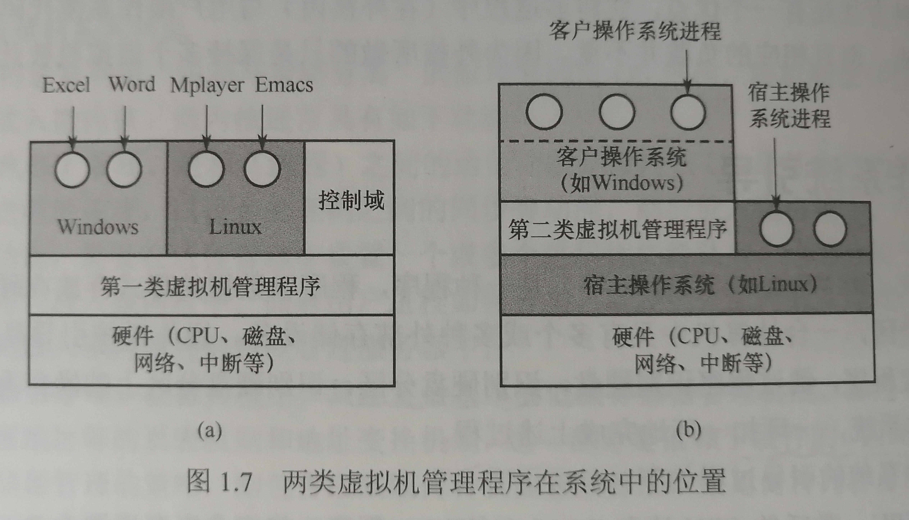
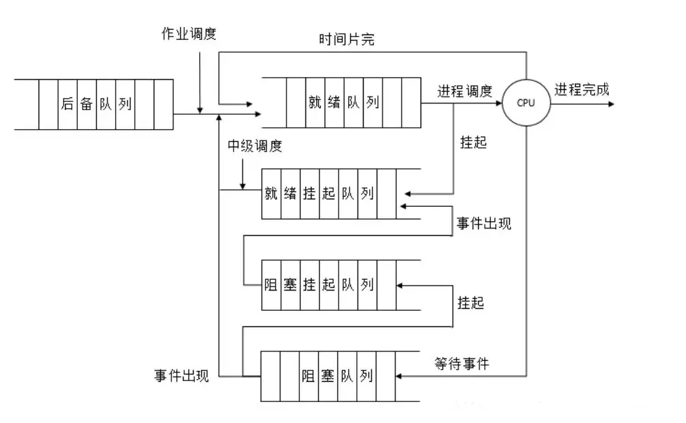

# 包烟复习：OpErATE system

> 主要看考研复习指导，课件全是英文担心产生理解偏差

[toc]

## 一、原理概述

### 1.1 基本概念

* **操作系统**：**是指控制和管理整个计算机系统硬件与软件资源，合理地组织、调度计算机的工作和资源的分配，进而为用户和其它软件提供方便接口与环境的程序集合。操作系统是计算机系统中最基本的系统软件。**
  * 操作系统是软件的核心，与现代计算机系统融为一体，它负责管理各种计算机硬件，为应用程序提供基础，并充当计算机硬件与用户之间的中介。
* **操作系统的基本特征：并发、共享、虚拟、异步。（前两者最基本，并相互依存）**
  * **并发是指两个或多个事件在同一时间间隔内发生，操作系统的并发性是指计算机系统中同时存在多个运行的程序，它具有处理和调度多个程序同时执行的能力。在操作系统中，引入进程的目的就是使程序能够并发执行。**
  * **共享即资源共享，指系统中的资源可供内存中多个进程使用，有互斥共享和同时访问两种方式。我们把同一时间内只允许一个进程访问的资源称为临界资源。**
  * **虚拟是指把一个物理上的实体变成逻辑上的对应物。操作系统中利用了多种虚拟现实技术来实现虚拟处理器、虚拟内存和虚拟外部设备。**
    * 虚拟处理器：（时分复用技术）多道程序并发执行，分时使用一个处理器；虚拟存储器（空分复用技术）
  * **进程的异步性，受资源限制，并发执行的多个进程执行走走停停，以不可预知的速度向前推进**
* **操作系统的目标和功能**
  * 作为计算机资源的管理者
    * 处理机管理（进程的管理：进程空值、进程同步、进程通信、死锁处理、处理机调度）
    * 存储器管理（内存的分配与回收、地址映射、内存保护与共享、内存扩充）
    * 文件管理（文件存储空间的管理、目录管理、文件读写管理与保护）
    * 设备管理（缓冲管理、设备分配、设备处理和虚拟设备）
  * 作为用户与计算机硬件系统之间的接口
    * 命令接口（组织和控制作业的执行）
      * 联机命令接口：又称交互式命令接口，适用于分时或实时系统，用户每输入一条命令，控制权就转交给操作系统的命令解释程序，命令解释程序解释输入的命令并执行，完成指定的功能，之后将控制权又转回给控制台或终端。
      * 脱机命令接口：又称批处理命令接口，适用于批处理系统，由一组作业控制命令组成。用户不能直接干预作业的运行，而应该事先用作业控制命令写一份作业操作说明书，连同作业一同交给系统。
    * 程序接口：由一组系统调用组成，用户通过在程序中使用系统调用来请求操作系统提供相应服务，例如图形用户界面（GUI）
  * 实现了对计算机资源的补充：将裸机改造成功能更强，使用更方便的机器。

### 1.2 发展历程

* 手工操作（无操作系统）：在计算机上执行任务的所有工作都需要人工干预，如程序的装入、运行和结果的输出等。
* **批处理系统**
  * 单道批处理系统：系统对作业的处理是成批进行的，内存中始终保持仅一道作业。
  * **多道批处理系统：允许多个程序同时进入内存并允许它们在 CPU 中交替的运行，这些程序共享系统中的各种硬件软件资源。当一道程序因为 I/O 请求而暂停运行时，CPU 便立即转去运行另一道程序。**（宏观上并行，微观上串行）
    * 优点：资源利用率高，多道程序共享计算机资源，系统吞吐量大，CPU 和其他资源保持忙碌状态。
    * 缺点：用户响应时间长，不提供人机交互能力，用户不能了解程序的运行情况，也不能控制计算机。

* **分时操作系统**
  * **分时技术：处理器的运行时间被分成很短的时间片，按时间片轮流把处理器分配给各联机作业使用。**
  * 分时操作系统：多个用户通过终端同时共享一台主机，这些终端连接到一台主机上，用户可以同时与主机进行交互而互不干扰。较好地解决了人机交互问题。
* **实时操作系统：计算机接收外部信号后及时进行处理，并在严格的时间限制内处理完接收的事件。**具有及时性和可靠性。
  * 硬实时系统和软实时系统：若某个动作必须绝对地在规定的时刻发生，则为硬实时系统，如飞行控制系统；若接收偶尔违反时间且不会引起任何永久性损害，则为软实时系统，如订票系统。
* 网络操作系统：把网络中的各台计算机有机地结合起来，提供一种统一的，经济而有效的使用各台计算机的方法，实现各台计算机之间数据的互传。
* 分布式计算系统：具有分布和并行性，系统中若干计算机并行工作，相互协作完成同一任务。
* 个人计算机操作系统、嵌入式操作系统、服务器操作系统、智能手机操作系统。

### 1.3 运行环境

* **处理器运行模式**

  * **特权指令和非特权指令**：特权指令指不允许用户直接使用的指令，例如IO指令、置中断指令等；非特权指令指允许用户直接使用的指令。
  * **目态和管态**：在具体实现上，将 CPU 的运行模式划分为用户态（目态）和核心态（管态、内核态），只有在 CPU 处于核心态时， CPU 才可以执行特权指令。
    * 访管指令在目态发起，访管指令引发访管中断，请求切换到管态执行相关任务。
  * 现代操作系统采用分层式的结构设计，一些与硬件关联密切的模块如时钟管理、中断处理、设备驱动处于最底层；其次是运行频率较高的模块包括进程管理、存储器管理、设备管理；这两部分组成了操作系统的内核。
    * 原语：具有以下三个特点的程序，一、处于操作系统的最底层，最接近硬件；二、程序的运行具有原子性；三、程序运行时间短，且调用频繁。
    * 系统控制的数据结构：例如作业控制块、进程控制块、设备控制块、消息队列、缓冲区、空闲区登记表、内存分配表等。

* **中断与异常**

  * 中断也称为外中断，指来自 CPU 执行指令外的事件，通常用于信息输入输出，时钟中断。
    * 下图 INTR 和 NMI 分别指发出可屏蔽/不可屏蔽中断请求的线
  * 异常也称为内中断，之来自 CPU 执行指令内部的时间，例如程序非法操作码、数组越界等故障和专门的陷入指令。
    * 故障：由指令执行引发的异常
    * 自陷：实现安排的一种异常事件
    * 终止：出现了使 CPU 无法继续执行的硬件故障
  * 中断和异常的处理过程：在 CPU 执行用户程序的第 i 条指令时检测到了一个异常事件，或发现一个中断请求信号，则 CPU 打断当前程序，转到相应的中断/异常处理程序执行，若处理程序能够解决问题，则在中断或异常处理程序的最后，执行返回指令回到原程序的第 i 或 i+1 条指令继续执行，若发现的是不可恢复的错误，则终止用户程序。

  

* **系统调用**：指用户在程序中调用操作系统所提供的一些子功能，可视为特殊的公共子程序。系统调用命令可以分为设备管理、文件管理、进程控制、进程通信、内存管理五类，很多系统调用要在核心态完成，故需要进行用户态和核心态的切换。

  

### 1.4 操作系统结构

* 分层法：将操作系统分为若干层，最底层是硬件，最高层是用户接口，每层只能调用紧邻它的低层的功能和服务（单向依赖）。
* 模块化：将操作系统按功能划分为若干具有一定独立性的模块，并规定好各个模块之间的接口，使模块通过接口进行通信，还可以将模块划分为若干子模块。强调高内聚和低耦合。
* 宏内核（内核架构）：将系统的主要功能模块都作为一个紧密联系的整体运行在核心态，从而为用户程序提供高性能的系统服务。
* 微内核（内核架构）：将内核中最基本的功能保留在内核，而将那些不需要核心态执行的功能移到用户态执行，从而降低内核设计的复杂性，移出内核的操作系统代码按照分层的原则被划分为若干服务程序，相互独立执行，借助微内核进行通信。微内核有灵活易扩展，可靠安全，可移植，可适用于分布式计算，在性能上不如宏内核。
* 外核：对机器进行分区，给每个用户一个资源子集，每个用户层的虚拟机可以运行自己的操作系统，外核负责为虚拟机分配资源，并确保没有用户会使用他人的资源。

### 1.5 操作系统引导

* **操作系统引导：计算机利用 CPU 执行特定程序，通过程序识别硬盘，识别硬盘分区，识别硬盘分区上的操作系统，最后通过程序启动操作系统，一环一环地完成上述过程。**

* 激活CPU（读取 boot 程序，执行 BIOS 的指令） $\to$ 硬件自检 $\to$ 加载带有操作系统的硬盘 $\to$ 加载主引导记录 MBR $\to$ 扫描硬盘分区表，加载硬盘活动分区 $\to$ 加载分区引导 PBR $\to$ 加载启动管理器 $\to$ 加载操作系统。 

### 1.6 虚拟机

* 虚拟机：虚拟机是一台逻辑计算机，利用特殊的虚拟化技术，通过隐藏特定计算平台的实际物理特性，为用户提供统一的、抽象的、模拟的计算环境。有两类虚拟化方法：

  

## 二、进程与线程

### 2.1 I 进程

* 进程的不同定义：

  * 进程是程序的一次执行过程；
  * 进程是一个程序以及其数据在处理机上顺序执行所发生的活动；
  * **进程是具有独立功能的程序在一个数据集合上运行的过程，他是系统进行资源分配和调度的一个的独立单位。**
  * 进程是进程实体的运行过程，是系统进行资源分配和调度的一个独立单位。

* 进程的特征：动态性（具有与生命周期，最基本）、并发性、独立性、异步性。

* **进程控制块 PCB：为了使参与并发执行的每个程序能够独立地运行，为其配置一个专门的数据结构——进程控制块，系统利用 PCB 来描述进程的基本情况和运行状态，进而控制和管理进程。程序段、数据段和 PCB构成了进程实体。创建/撤销进程实质上是创建/撤销进程实体中的 PCB。**

* **进程的状态与转换**

  * 进程的状态（前三种是基本状态）

    * 运行态：进程正在处理机上运行。
    * 就绪态：获得了除处理机之外的所有资源，一旦得到处理机便可运行，多个就绪态进程排在就绪队列中。
    * 阻塞态：又称等待态，进程正在等待某一事件而暂停运行，如等待某资源变为可用或等待输入输出完成。根据阻塞原因不同，设置多个阻塞队列。
    * 创建态：进程正在被创建，尚未转到就绪态。
    * 结束态：进程正在从系统中消失，可能是正常结束或因其他原因推出运行。

  * 进程状态的转换

    

    * 需要注意的是，一个进程从运行态变为阻塞态是主动行为，而从阻塞态变成就绪态是被动行为，需要其他相关进程协助。

* **进程的组织**：程序段 + 数据段 + 进程控制块

  * 进程控制块：创建后常驻内存，是进程存在的唯一标识。

    主要内容包括：进程描述信息（PID 进程标识符，UID 用户标识符）、进程控制和管理信息（进程当前状态、进程优先级、信号量使用、代码地址、处理机占用时间）、资源分配清单（各种段指针，文件描述符，输入输出设备信息等）、处理机相关信息（处理机上下文：各类寄存器值，状态字）

* **进程的控制**
  * 进程的创建：分配 PID，申请空白 PCB，为进程分配资源，初始化 PCB，插入就绪队列
  * 进程的终止：正常结束/异常结束/外界干预，根据 PID 检测出 PCB，读取进程状态，若进程有子孙进程，终止所有子孙进程，若进程处于执行态则终止执行，将进程拥有的资源还给父进程或操作系统，将 PCB 从链表中删除。
  * 进程的阻塞 Block：跟据 PID 找到 PCB，若进程为运行态，保护现场并置为阻塞态，插入相应的等待队列，奖处理及资源给其他就绪进程。、
  * 进程的唤醒 Wakeup：跟据 PID 找到 PCB，从等待队列中移除，置为就绪态，将 PCB 插入就绪队列，等待调度程序调度。
  
* **进程的通信**
  
  * **共享内存：在通信的进程之间存在一块可以直接访问的共享空间，通过对这片共享空间进行读写操作实现进程之间的信息交换，在对共享空间进行读写时需要使用同步互斥工具。**
  * **消息传递：进程的数据交换以格式化的消息（Message）为单位，通过发送消息和接收消息两个原语进行数据交换。**
    * 直接通信方式：发送进程直接把消息发送给接收进程，并将它挂在接收进程的消息缓冲队列上，接收进程从消息缓冲队列上接收消息。
    * 间接通信方式：把消息发送给某个中间实体（信箱），接收进程从中间实体中取得消息，广泛用于计算机网络中。
  * **管道通信**：管道指一个用于连接一个读进程和一个写进程以实现它们之间通信的一个共享文件，管道机制必须提供互斥、同步和确定对方的存在。
    * 从管道读取数据是一次性操作，数据一旦被读取，就释放空间以便写更多数据，管道只能采用半双工通信，某一时刻只能单向传输，要实现进程互动通信，则需要定义两个管道。

### 2.1 II 线程和多线程模型 

* **线程的基本概念：线程是轻量级的进程，是一个基本的 CPU 执行单元，也是程序执行流的最小单元，由线程 ID 、程序计数器、寄存器集合和堆栈组成。线程是进程中的一个实体，是被系统独立调度和分派的基本单位，线程自己不拥有系统资源，但可以访问其隶属进程的系统资源。**

  * **为什么要引入进程：在多道程序运行的背景下，程序这个静态的概念已经不能如实反映程序并发执行的过程的特征，为了深刻描述程序动态执行过程的性质乃至更好地支持和管理多道程序的并发执行，引入的进程的概念。**

* **对比进程与线程**

  * 调度：进程每次调度都要进行上下文切换，线程是独立调度的基本单位。同一进程中的线程切换不会引起上下文切换。线程切换代价小于进程。
  * 并发性：进程间可以并发执行，统一进程内或不同进程间的线程也可以并发执行，提高系统的资源利用率和系统的吞吐量。
  * 拥有资源：线程不拥有系统资源，仅有一点必不可少的、能保证独立运行的资源，可访问隶属进程的系统资源，主要表现在同一进程中所有线程都有相同的地址空间。
  * 独立性：进程有独立的地址空间和资源，除共享全局变量不允许其他进程访问，某进程中的线程对其它进程不可见。
  * 系统开销：进程切换设计上下文的切换，而线程的切换只需保存地址和设置少量寄存器内容，开销很小。同一进程的线程由于共享进程的地址空间，同步和通信非常容易实现，甚至无需操作系统的干预。
  * 支持多处理机系统：进程只能运行在一个处理机上，对于多线程进程，可将进程中的多个线程分配到多个处理机上执行。

* 线程的状态与转换：执行状态、就绪状态和堵塞状态，于进程的基本状态转换关系一致。

* 线程的组织与控制：

  * 线程控制块 TCB ：通常包含线程标识符，一组寄存器，线程运行状态，优先级，线程专有存储区（用于线程切换是保存现场），堆栈指针（用于过程调用时保存局部变量和返回地址）

* **线程的实现方式**：用户级线程（ULT）和内核级线程（KLT）

  * **用户级线程：在用户级线程中，有关线程的管理的所有工作都由应用程序在空间中完成，内核意识不到线程的存在。应用程序可以通过使用线程库设置多线程程序。对于设置了用户级现成的系统，其调度依然是以进程为单位进行的，各个进程轮流执行一个时间片。例如进程 A 有一个线程，进程 B 有 100 个线程，这样进程 A 的线程的运行事件将是线程 B 的 100 倍。**

    * 优点：
      * 线程切换不需要转换到内核空间，节省了模式切换的开销。
      * 调度算法可以是进程专用的，不同进程可以根据自身需要，对自己的线程选择不同的调度算法。
      * 用户线程的实现与操作系统平台无关，对线程管理的代码是属于用户程序的一部分。

    * 缺点：
      * 系统调用的阻塞问题，当一个线程执行系统调用时，不仅该线程阻塞，进程内的所有线程阻塞。
      * 不能发挥多处理机的优势，内核每次分配给一个进程的只有一个 CPU ，因此进程中只能有一个线程执行。

  * **内核级线程：内核级线程在内核的支持下运行的，线程管理的所有工作都是在内核空间实现的，内核空间为每个内核级线程设置了一个线程控制块，内核根据控制块感知线程的存在，并对其加以控制。**

    * 优点：
      * 能发挥多处理机的优势，内核能同时调度一个进程中的多个线程并行执行。
      * 如果进程中的一个线程被阻塞，内核可以调度该进程中的其他线程占用处理及，也可以运行其他进程中的线程。
      * 内核支持线程具有很小的数据结构和堆栈，线程切换较快，开销较小。
      * 内核本身可以采取多线程技术，可以提高系统的执行速度和效率。

    * 缺点：
      * 同一进程中的线程进行切换，需要从目态转换为管态，系统开销较大。因为用户进程中的线程是在目态中运行的，而线程的调度和管理实在管态下实现的。

  * **组合方式：内核支持多个内核级线程的建立、调度和管理，同时允许用户建立、调度和管理用户级线程。**

    

  * 线程库：为程序员提供创建和管理线程的API，实现方式也分为用户级实现（不涉及内核）和内核级实现（与内核的系统调用对应），主流的API有：POSIX Pthreads、Windows API、Java。Pthreads 提供用户级和内核级的库，Windows API 是直接用于 Windows 的内核级线程库，Java API 运行线程在 Java 程序中创建和管理，通常采用宿主系统的线程库来实现（Windows用 Windows API，UNIX系统用 Pthreads 实现）。

* **多线程模型**：由于用户级与内核级线程的连接方式不同，形成了下面三种多线程模型：

  * **多对一模型**：**将多个用户级线程映射到一个内核级线程上，这些用户线程一般属于一个进程，线程的管理和调度在用户空间完成，仅当用户线程需要访问内核时，才将其映射到一个内核级线程上，但是每次只允许一个线程进行映射。**

    * 优点：线程的管理是在用户空间完成的，效率较高。
    * 缺点：如果一个线程实在访问内核时发生阻塞，则整个进程都会被阻塞；在任何时刻，只有一个线程能够访问内核，多个线程不能同时在多个处理机上运行。

  * **一对一模型：将每个用户级线程映射到一个内核级线程**

    * 优点：并发能力强，当一个线程阻塞后，允许调度另一个线程执行
    * 缺点：每创建一个用户线程就需要为其创建一个内核级线程，开销大

  * **多对多模型：将 n 个用户线程映射到 m 个内核级线程上，要求 n 大于等于 m，既克服了多对一模型并发度不高的问题，又克服了一对一模型占用太多内核线程而开销太大的问题。**

    

### 2.2 处理机调度

* **处理机调度：对处理机进行分配，从就绪队列中按照一定的算法选择一个进程并将处理机分配给它运行，以实现进程并发地执行。**

* **三级调度**：作业调度、内存调度和进程调度

  

  * **高级调度（作业调度）**：按照一定的原则从外存上处于后备队列的作业中挑选一个或多个，给他们分配内存、输入输出设备等必要的资源，并建立相应的进程，以使他们获得竞争处理机的权利。多道批处理系统中大多有，其它系统通常不需要作业调度。
  * **中级调度（内存调度）**：将那些暂时不能运行的进程调出到外存等待，此时进程的状态称为挂起态。当它们具备运行条件且内存稍有空闲时，由中级调度来决定将这些就绪进程重新调入内存，并修改其状态转为就绪态，挂在就绪队列上进行等待。
  * **低级调度（进程调度）**：按照某种算法从就绪队列中选取一个进程，将处理机分配给它。进程调度是最基本的一种调度，且频率很高。

* **调度的目标：设计调度程序，一般要满足特定系统用户的需求（如实时和交互进程的快速响应），另一方面要考虑系统整体的效率（如减少整个系统的平均周转时间），同时还要考虑调度算法的开销。**

  * **CPU利用率**：（CPU有效工作时间）/（CPU有效工作时间 + CPU空闲等待时间）。
  * **系统吞吐量**：单位时间内CPU完成作业的数量。长作业会降低系统的吞吐量，短作业相反。
  * **周转时间**：周转时间 = 作业完成事件 - 作业提交时间；平均周转时间 = 每个作业周转时间的总和 / 作业总数；带权周转时间 = 作业周转时间 / 作业实际运行时间。
  * **等待时间**：进程处于等处理机的时间之和。衡量一个调度算法的优劣，通常只考虑等待时间。
  * **响应时间**：指用户提交请求到系统首次相应所用的时间。一般作为衡量调度算法的重要准则之一。

* 调度的实现：

  * 调度程序：排队器 + 分派器 + 上下文切换器。
  
  * 调度的时机、切换与过程：请求调度的事件发生后，才能运行调度程序，调度了新的就绪进程后，才会进行进程切换。
    * 现在操作系统中，以下情况发生时不能进行进程的调度和切换：在处理中断的过程中；进程在操作系统内核临界区内；其他需要完全屏蔽中断的原子操作过程中。
    * 若上述过程发生时引起了调度的条件，不能马上进行调度和切换，应置系统的请求调度标志，知道上述情况结束后才能进行相应的调度和切换。
  
  * **进程调度的方式：抢占式和非抢占式**
    * 非抢占式调度：当一个进程正在处理机上执行时，即使有某个更为重要或紧迫的进程进入就绪状态，仍让正在执行的程序执行，直至该进程运行完成或因某种时间进入阻塞态。
    * 抢占式调度：当一个进程正在处理机上执行时，若有某个更为重要或急迫的进程需要使用处理机，则允许调度程序按照某种原则去暂停正在执行的程序，将处理机分配给更为重要或急迫的程序。
  
  * 典型的调度算法：有些适用于作业调度、有些适用于进程调度、有些二者都适用
    * **先来先服务算法 FCFS：算法每次从后备队列中选择最先进入的一个或几个作业，将他们调入内存，分配必要的资源，创建进程并放入就绪队列。既可用于作业调度也可用于进程调度。**属于不可剥夺算法，不能作为分时、实时系统的主要调度策略。算法简单、但效率低。对长作业有，对短作业不利；有利于 CPU 繁忙型作业，不利于 I/O 繁忙型作业。
  
    * **短作业/短进程优先调度算法 SJF/SPF：SJF 从后备队列中选择估计运行时间最短的作业调入内存运行； SPF 从就绪队列中选择估计运行时间最短的进程，将处理机分配给它。**该算法对长作业不利，可能导致饥饿现象；未完全考虑到作业的紧迫程度；估计运行时间导致算法不一定真正做到短作业有限。**该算法的平均等待时间最少、平均周转时间最少。**
  
    * **优先级调度算法：从后备队列中选择优先级最高的作业调入内存运行 / 从就绪队列中选择优先级最高的进程，将处理机分配给它。**
  
      * 非抢占式 / 抢占式：当一个进程正在处理机上运行时，有某个优先级更高的进程进入就绪队列，非抢占式等当前进程执行完后再将处理机分配给优先级最高的进程；而抢占式立刻暂停正在执行的进程，将处理机分配给优先级更高的进程。
      * 静态 / 动态优先级：后者可以跟据进程的类型、就绪时间等待 CPU 的时间长短的因素动态调整进程优先级。
      * 优先级设置原则：系统进程 > 用户进程，交互式（前台）进程 > 非交互式（后台）进程，I/O型进程 > 计算型进程。
  
    * **高响应比调度算法**：相应比的公式为
      $$
      相应比 R_P = \frac{等待时间 + 要求服务时间}{要求服务时间}
      $$
  
    * **时间片轮转调度算法**：适用于分时系统，将所有就绪进程按 FCFS 排成一个队列，调度程序每次选择就绪队列中第一个进程执行，如果该进程再规定时间内没有完成，则回到阻塞态并加入到就绪队列末尾，等待重新运行。
  
    * **多级反馈队列调度算法**：设置多个就绪队列，并为每一个队列设置一个优先级；赋予各个队列进程运行时间片大小各不相同，优先级高的进程执行时间片小；每个队列采用 FCFS 算法；按队列优先级调度，只有第一级队列为空时才能调度下一级队列。
  
  * 进程切换：
  
    * **上下文切换：切换 CPU 到另一个进程需要保存当前进程状态并恢复另一个进程的状态。**上下文指的是某一时刻 CPU寄存器和程序计数器的内容，进行上下文切换时，内核会将旧的状态保存在其 PCB 中，然后加载经调度需要执行的新进程的上下文，此过程只发生在内核态，计算时间可观。
    * 模式切换：用户态和内核态之间的切换。

### 2.3 I 同步与互斥

* **临界资源：一次仅允许一个进程访问的资源。对临界资源的访问，必须互斥地进行，在每个进程中，访问临界资源的那段代码称为临界区。**

  * **临界资源的访问：将访问过程分为四个部分**
    * **进入区：在进入区要检查可否进入临界区，若可以，为了保证对临界资源的正确使用，应设置正在访问临界资源的标志。**
    * **临界区：访问临界资源的代码。**
    * **退出区：将正在访问临界资源的标志去除。**
    * **剩余区：代码其余部分。**

* **同步：亦称直接制约关系，指为了完成某个任务而建立的两个或多个进程，因为需要在某些位置上协调他们的工作次序而等待、传递信息所产生的制约关系。例如 A 向缓冲区发送数据给 B，缓冲区为空时 B 必须等待，缓冲区满时 A 必须等待。**

* **互斥：亦称间接制约关系，当一个进程进入临界区时，另一个进程必须等待，直至占用临界资源的进程退出。例如 A，B 使用打印机，A 使用时 B 等待，B 使用时 A 等待。**

* 为禁止两个进程同时进入临界区，同步机制应该遵循：（前三个首要）

  * **空闲让进：当临界区空闲时，可以允许一个请求进入临界区的进程立即进入临界区；**
  * **忙则等待：当已有进程进入临界区时，其他试图进入临界区的进程必须等待；**
  * **有限等待：对请求访问的进程，应保证在有限时间内进入临界区；**
  * **让权等待：当进程不能进入临界区时，应该立即释放处理器，防止进程忙等待。**

* 实现临界区互斥的基本方法：

  * 软件方法：

    * 8单标志法：用一个变量 turn 标识那个进程能进入临界区，违背空闲让进——两个进程必须交替进入临界区，一旦某个进程不在进入临界区，则另一个进程也将无法再进入临界区，此时临界区实际上是空闲的。

    * 双标志法先检查：在每个进程访问临界资源时，检查临界资源是否被访问（一个数组 flag，第 i 个元素为 false 表示 进程 i 未进入临界区），可能会有多个进程同时进入临界区，违背忙则等待，问题出现在检查和修改操作（都在进入区）不能一次进行，在检查对方的 flag 之后，自己切换 flag 之前的一段时间，结果都检查通过。

    * 双标志法后检查：进入区先修改自己的 flag 再检查，可能会导致饥饿。

    * **Peterson算法：同时利用 flag 和 turn。用 flag 解决临界资源的互斥访问，用 turn 解决饥饿。**

      ```c++
      // P_i 进入区
      flag[i] = true; turn = j;
      while(flag[j] && turn == j){ /* Wait */ }
      ```

  * 硬件方法：操作系统提供了特殊的硬件指令，允许对一个字中的内容进行检测与修正，或交换两个字的内容。简单，易于实现，缺点是随机选择可能产生饥饿、忙等待耗费处理机时间，不能让权等待。

    * 中断屏蔽法：关中断来避免其他进程进入临界区，会限制临处理机交替执行程序的能力。

    * 硬件指令法：使用原子指令 TestAndSet 和 Swap，执行原子指令时不允许被中断。

      * 用 TestAndSet 检查并设置共享布尔变量（如果为 flase 则设置为 true）`while(TestAndSet(&lock)){ /* Wait */ }`。

      * 为每个临界区资源设置一个共享布尔变量 lock，初始设为 false，为每个进程设置一个局部变量 key，用于与 lock 交换信息。在进入临界区之前，利用 swap 置换 lock 和 key，检查 key 的状态，有进程在临界区时，重复交换和检查。

        ```c++
        // 进入区
        key = true;
        while(key != false){
        	Swap(&lock, &key);
        }
        // 退出区
        lock = false;
        ```

* **互斥锁 Mutex Lock**：一个进程在进入临界区时获得锁 acquire() ；在退出临界区时释放锁 release() ，二者都是原子操作，通常由硬件机制实现。主要缺点是忙等待。

* **信号量**：可以用来解决同步与互斥问题，只能用两个标准的原语访问—— **wait 和 signal 分别又称作 P 操作 和 V 操作。**

  * **整形信号量：用一个整型数 S 来表示资源的数目**， wait 和 signal 可以表示为：

    ```C++
    void wait(S){
    	while(S <= 0){ /* Wait */ }
    	S = S - 1;
    }
    void signal(S){
    	S = S + 1;
    }
    ```

  * **记录型信号量：不会忙等待（while）的进程同步机制。**

    ```c++
    typedef struct{
    	int value; 			// 资源数目
    	struct process *L; 	// 进程链表
    } semaphore; 			// 记录型的数据结构
    void wait(semaphore S){
        S.value--;
        if(S.value < 0){		// 资源以分配完毕
            S.L->push_back(P); 	// P 是当前进程
            block(S.L);			// 原语 block 进程自我阻塞
        }
    }
    void signal(semaphore S){
        S.value++;
        if(S.value <= 0){		// 表明 S.L 中仍有等待该资源的进程被阻塞
            P = S.L.remove(); 	// 从队列中移除一个进程
            wakeup(P);			// 唤醒该进程
        }
    }
    ```

  * **利用信号量实现同步**：设 S 是 P1 P2 同步的公共信号量，初始为 0 。过程 P2 中的语句 y 需要使用 P1 中语句 x 的运行结果，即 x 执行后 y 才可以执行。可以设计以下代码：

    ``` c++
    semaphore S = 0;
    void P1(){
        x;
        V(S);		// 告诉 P2，x 已经完成
    }
    void P2(){
        P(S);		// 检查语句 x 是否完成运行
        y;
    }
    ```

  * **利用信号量实现互斥：**对要使用的资源，使用前 P，使用后 V，两操作夹紧互斥资源使用的代码，中间不能有冗余代码。
  * **利用信号量实现前驱：**其实就是设置多个信号量每个管理一个直接的前驱关系。

* **管程 Monitor：代表共享资源的数据结构，以及由对该共享数据结构实施操作的一组过程所组成的进程管理层序。**管程把对共享资源的操作封装起来，申请资源 take_away 和 归还资源 give_back，每次仅允许一个进程进入管程，从而实现进程互斥。

  * 条件变量：将阻塞原因定义为条件变量 condition，通常一个进程被阻塞的原因有很多，可以设置多个阻塞变量，每个阻塞变量配备一个等待队列，用于记录被阻塞的进程，规定 wait 操作和 signal 操作，分别应用在 take_away 和 give_back 中。


### 2.3 II 经典同步问题

* **生产者-消费者问题**

  * 问题描述：一组生产者和一组消费者进共享一个初始为空、大小为 N 的缓冲区，只有缓冲区没满时，生产者才能把消息放入缓冲区，否则等待；只有缓冲区不为空时，消费者才能从中取走消息，否则必须等待。由于缓冲区是临界资源，只允许一次一个生产者写入消息，或一个消费者读取消息。

    ``` c++
    semaphore mutex = 1;
    semaphore empty = n;
    semaphore full = 0;
    void producer(){
        while(1){
            // ... 生产数据
            P(empty);
            P(mutex);
            // ... 数据入缓冲区
            V(mutex);
            V(full);
        }
    }
    void consumer(){
        while(1){
            // ... 生产数据
            P(full);
            P(mutex);
            // ... 数据入缓冲区
            V(mutex);
            V(empty);
        }
    }
    ```

  * 注意：对 empty 和 full 的 P 操作应该放在 mutex 的 P 操作前面。

* **读者-写者问题**

  * 问题描述：有读者和写者两组并发进程，共享一个文件。允许多个读者同时读文件，不允许多个写者同时写文件，写者写文件时不允许读者读文件。下面代码，可能会导致写进程一直饥饿。可以增加一个信号量 w，（注释几句）来相对提高写进程优先级。（读写公平法）

    ``` c++
    int count = 0;
    semaphore mutex = 1;	// 保护 count 更新时互斥
    semaphore rw = 1;		// 保护读者写者互斥
    //// semaphore w = 1;   // 写进程优先信号量
    void writer(){
        while(1){
            //// P(w);
            P(rw);
            // ... 写
            V(rw);
            //// V(w);
        }
    }
    
    void reader(){
        while(1)
        {
            //// P(w);
            P(mutex);
            if(count == 0){
                P(rw);
            }
            count++;
            V(mutex);
            //// V(w);
            // 读
            P(mutex);
            count--;
            if(count == 0){
                V(rw);
            }
            V(mutex);
        }
    }
    ```

* **哲学家进餐问题**

  * 问题描述：圆桌旁有五个哲学家，圆桌上有五支筷子，哲学家需要举起左边和右边的筷子才能吃饭。可以看到，每个哲学家与坐在其左右的哲学家对其中间筷子的访问是互斥关系。

  * 设计的不好，会产生死锁，每个哲学家收获一支筷子，谁也不能进食。

  * 为了防止死锁发生，可以对哲学家加入一些限制条件：如至多允许四名哲学家同时进餐、仅当一名哲学家两边筷子都可用时才允许拿筷子；奇数哲学家先拿左筷，偶数玩家先拿右筷。

    ```c++
    semaphore chopstick[5] = {1,1,1,1,1};
    semaphore mutex = 1;
    void P(int i){
        do{
            P(mutex);
            P(chopstick[i]);
            P(chopstick[(i+1)%5]);
            V(mutex);
            eat;
            V(chopstick[i]);
            V(chopstick[(i+1)%5]);
            think;
        }while(1);
    }
    ```

### 2.4 死锁

* 死锁：指多个进程因竞争资源而造成的一种僵局（互相等待），若无外力作用，这些进程将无法向前推进。
* 死锁产生的原因：
  * 系统资源的竞争：对不可剥夺的资源的竞争才能产生死锁，如磁带机、打印机等。
  * 进程推进顺序非法：进程在运行过程中，请求和释放资源的顺序不当，也同样会导致死锁；信号量的使用不当也会导致死锁。
  * **死锁产生的必要条件：必须同时满足以下四个条件，只要一个不满足，死锁就不会发生。**
    * **互斥：请求某一时间内某个资源只能由一个进程占有。**
    * **不剥夺：进程所获得的资源在不使用完之前，不能被其他进程强行夺走，只能主动释放。**
    * **请求并保持：进程已经保持了至少一个资源，但又提出了新的请求，而该资源已被其他进程占有，此时进程只好阻塞并保持以获得的资源不放。**
    * **循环等待：存在一种进程资源的循环等待链，链中每个进程以获得的资源同时被链中下一个进程所请求。**
* **死锁的处理策略：**
  * **死锁预防：设置某些限制条件，破坏死锁必要条件中的若干个。**
  * **死锁避免：在资源动态分配过程中，用某种方法防止系统进入不安全状态。**
  * **死锁的检测及解除：无需采取任何限制措施，允许进程在运行时发生死锁。通过系统的检测机构及时检测出死锁的发生，然后采取某种措施解决死锁。**
* 死锁的预防：
  * 破坏互斥条件：:butterfly:不太可行
  * 破坏不剥夺条件：常用于状态易于保存和恢复的资源，如CPU寄存器及内存资源，不适用于打印机之类的一般资源
  * 破坏请求并保持条件：采用预先静态分配方法，进程在运行前一次申请完它所需要的所有资源，在资源未全部满足时，不能把它投入运行。一旦投入运行，这些资源便归它所有，不再提出其他资源请求。这种方法会导致资源被严重浪费，还会导致饥饿现象。
  * 破坏循环等待条件：
* 死锁的避免
  * 系统安全状态
  * 银行家算法
* 死锁的检测和解除
  * 资源分配图
  * 死锁定理
  * 死锁解除


## 三、内存管理

### 3.1 基础概述

### 3.2 虚拟内存管理

## 四、文件管理

### 4.1 基础概述

### 4.2 目录

### 4.3 文件系统

## 五、I/O管理

### 5.1 基本概述

### 5.2 设备独立性软件

### 5.3 磁盘与固态硬盘

