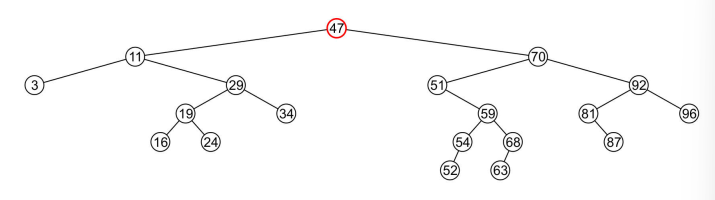
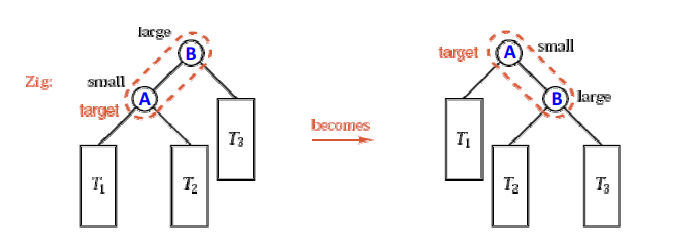
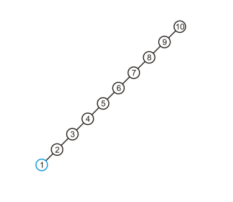
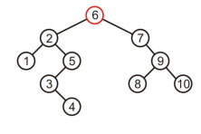
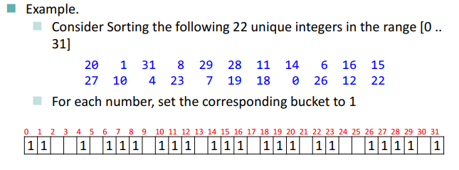
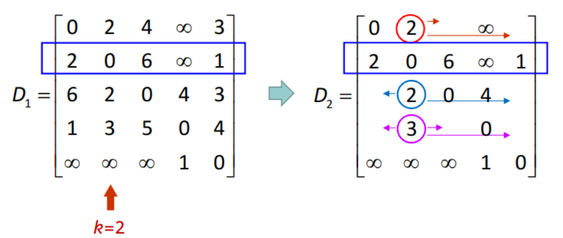
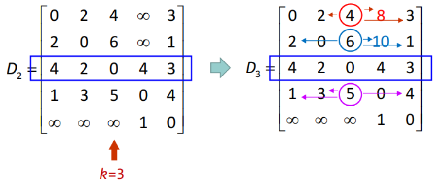

# 包烟复习：dATA sTRuCTure aND aLGoRItHM

[toc]

## 00 基本定义

* **数据**：数据是客观事物的符号表示，在计算机科学中指的是所有能输入到计算机中并被计算机程序处理的符号的总称。  
  * 数据元素：数据元素是数据的基本单位，有若干数据项组成。
  * 数据项：数据不可分割的最小单位
  * 数据对象：性质相同的数据元素的集合
* **数据结构**：相互之间存在一种或多种特定关系的数据元素的集合。数据结构包括逻辑结构、存储结构和数据的运算三方面的内容。
  * 形式定义（二元组）：$<D,S>$ 分别指数据元素有限集和关系上的有限集
  * 四种基本类型：集合、线性结构、树形结构、网状结构
  * 三种存储结构：顺序存储结构、链式存储结构、复合存储结构
  * 主要运算：Create、Destory、Delete、Insert、Access、Modify、Sort、Search
* **数据类型**：一个值的集合和定义在该值集上的一组操作的总称。  
* **抽象数据类型 ADT**：抽象数据组织及与之相关的操作；是一组逻辑特性描述，与表示和实现无关。
  * 形式定义（三元组）：$<D,S,P>$ 分别指数据对象、关系集合和基本操作集合

* **算法**：对特定问题求解方法 (步骤) 的一种描述，是指令的有限序列。
  * 五个特性：有穷性、确定性、可行性、输入、输出
  * 算法评价指标：正确性、可读性、健壮性、通用性、效率与存储量需求
    * 健壮性：有容错处理能力。

## 01 渐进分析与算法复杂度分析

* 渐近分析 Asymptotic Analysis：用数学方法表示算法运行时与输入数量的关系，以及随着输入数量的增加，这种关系如何变化的过程

* **Landau Symbols**：描述问题规模为 n 时问题所需的运行时间或内存的函数

  * Big-O：$f(n) = O(g(n))$
    * 如果存在非负数$c$和$n_0$，满足当$n>n_0$时，$f(n)<c\cdot g(n)$成立。
    * $f(n)$ 的增长速度不大于$g(n)$：$\lim_{n \to \infty}\frac{f(n)}{g(n)} = c, c \in[0, \infty)$
  * Little-O：$f(n) = o(g(n))$
    * $f(n)$ 的增长速度小于$g(n)$：$\lim_{n \to \infty}\frac{f(n)}{g(n)} = 0$
  * Big-Theta：$f(n) = \Theta(g(n))$
    * 如果存在正数$c_1,c_2$和$n_0$，满足当$n>n_0$时，$c_1\cdot g(n) < f(n)<c_2\cdot g(n)$成立。
    * $f(n)$ 的增长速度等同于$g(n)$：$\lim_{n \to \infty}\frac{f(n)}{g(n)} = c, c \in(0, \infty)$
  * Big-Omega：$f(n) = \Omega(g(n))$
    * $f(n)$ 的增长速度不小于$g(n)$：$\lim_{n \to \infty}\frac{f(n)}{g(n)} = c, c \in(0, \infty]$
  * Little-Omega：$f(n) = \omega(g(n))$
    * $f(n)$ 的增长速度大于$g(n)$：$\lim_{n \to \infty}\frac{f(n)}{g(n)} = \infty$

* 复杂度类：基于算法与输入规模 n 的关系而定义的一类算法效率表示：

  * $O(1),O(\log n),O(n),O(n\log n), O(n^c),O(c^n),O(n!)$，其中$C > 1$；
  * $\Theta$ 是一个等价关系，满足自反、对称和传递性；
  * $o$ 是一个弱序关系，满足反自反、反对称和传递性。

* 算法分析：获取一段代码并根据各种参数确定渐近运行时间或渐近内存需求

  * 递归函数的算法分析：分析并计算级数；主方法；递归树

    * 主方法是一个算法复杂度分析的一个很好的方法，但是只能用于特定的递归上，适合的递归形式为：
      $$
      T(n) = a*T(n/b)+f(n)
      $$
      其中，$a \ge 1, b >1 ,f(n)$：非递归函数，$f(n)$，渐进趋正（$\lim_{n \to \infty}f(n) > 0$）

      * 若对某个常数 $\epsilon >0$ 有 $f(n) = O(n^{\log_ba}-\epsilon)$，则 $T(n) = \Theta(n^{\log_ba})$ 。
      * 若 $f(n) = \Theta(n^{log_ba})$，则 $T(n) = \Theta(n^{\log_ba} \lg n)$ 。
      * 若对某个常数 $\epsilon>0$ 有 $f(n) = \Omega(n^{log_ba}+\epsilon)$，且对某个常数 $c<1$ 和所有足够大的 $n$ 有 $af(n/b) \le cf(n)$，则 $T(n) = \Theta(f(n))$。

  * 最好、平均、最坏情况

## 02 链表 栈 队列

* **Linear List 线性表**

  * 有序：存在唯一首元、唯一末元，除首元外元素有唯一直接前驱，除末元外有唯一直接后驱。

    * 表头 Head、表尾 Tail

  * **顺序表**：顺序存储，把线性表的结点按逻辑顺序依次存放在一组地址连续的存储单元里

    * 基本操作：插入、删除（按值查找定位删除）- $O(n)$

  * **链表**：链式存储（数据域 + 指针域）

    * **单循环链表 **Single Circular Linked List：头尾相接的链表，最后一个结点的指针域指向链表的头结点 
    * **双向链表** Double Linked List：节点设置指向前驱和后驱的两个指针

    * 双向循环链表

* **Stack 栈**

  * “操作受限“的线性表，后进先出（LIFO/FILO）
    * 栈顶 Top（允许插入、删除的一端）、栈底 Bottom（固定端）
    * 栈与递归调用（一个函数 (或过程) 直接或间接地调用自己本身，包括递归规则和终止条件）
  * 存储结构：（静态/动态）顺序栈
  * 基本操作：$O(1)$
  * 静态栈的扩容：每次栈慢增加（1、或 m 或、加倍）
  * 应用：括号匹配

* **Queue 队列**

  * “操作受限“的线性表，先进先出（FIFO）

    * 队首 Front（允许删除的一端）、队尾 Rear/Back（允许插入的一端）

  * 存储结构：

    * 顺序表示和假溢出
    * **循环队列** Circular Queue：将为队列分配的向量空间看成一个首尾相接的圆环  

  * **双端队列** Deque：双进双出，运行常数时间对头端或尾端进行元素的插入和删除操作

    * 实现：双端链表或循环数组
    * 结构设计：Map 和 Node-Buffer https://www.cnblogs.com/zhongqifeng/p/14944078.html

  * 静态队列的扩容：

    |  |  |
    | ------------------------------------------------------------ | ------------------------------------------------------------ |

  * 应用：广搜

* **String 串**：由零个或多个字符组成的有限序列  

  * Substring 子串：串中任意个连续字符组成的子序列  

  * 串的存储表示：定长顺序存储、堆分配存储、块链存储方式

  * 串的模式匹配：求子串在主串中的位置的过程 (字符串匹配) 。  

    * 暴力算法 - $O(mn)$ Brute-Force

    * KMP 算法 - $O(m + n)$：每当一趟匹配过程出现字符不相等时，主串指示器不用回溯，而是利用已经得到的“部分匹配”结果，将模式串向右“滑动”尽可能远的一段距离后，继续与主串进行比较。“滑动”的距离由函数 next() 给出。  

      * [求 Next 视频](https://www.bilibili.com/video/BV16X4y137qw?spm_id_from=333.337.search-card.all.click)

      |  |  |
      | ------------------------------------------------------------ | ------------------------------------------------------------ |

* **数组**

  * 顺序存储结构

  * 压缩结构：

    * 对称矩阵 / 三角矩阵的压缩：压缩到一维，使用特定公式索引

    * 稀疏矩阵的压缩（以二维矩阵为例：使用三元组压缩$<i, j, a_{i,j}>$） 

      * 稀疏矩阵的**快速转置算法**
        * 按照稀疏矩阵 A 的三元组表 a.data 的元素的存储次序依次转换，并将转换后的三元组元素直接放置于三元组表 b.data 的恰当位置，按行优先顺序存储转置得到的矩阵 B。
        * 设两个辅助向量 num[] 和 cpot[] 分别统计 A 中第 col 列中非0元素的个数 和 指示 A 中第 col 列第一个非0元素在 b.data 中的恰当位置，以实现预先确定原矩阵 A 中每一列的 (即 B 中每一行) 第一个非0元素在 b.data 中应有的位置，并在转置时就直接放入恰当的位置。  
      * 稀疏矩阵的**乘法**：同样利用上述的 cpot[]/rpos[] 数组 复杂度$0(mnp)$，$n,p$退化为非零元的数目。

    * 十字链表：矩阵中非0元素的结点所含的域有：行、列、值、行指针 (指向同一行的下一个非0元)、列指针 (指向同一列的下一个非0元)。其次，十字交叉链表还有一个头结点。

      

  

## 03 树 二叉树 树的遍历

* 浅浅认识

  * 一些术语：外向树、平凡树、m元树、正则m元树、有序树
    * 一些性质：
      * 节点数等于边数减一；
      * 有$k$个内部结点的满$m$元树的节点数为$mk + 1$
      * 高为$h$的$m$元树最多有$m^h$个叶子

  * 树的遍历：广度优先、深度优先（前序、中序、后序）

  * **Parental Trees**：每一个节点只指向它的父亲节点

    

  * **森林 Forests**：不相交的根树的集合
    * **Rooted Forests**：新建一个节点来指向所有根树的根节点

* **二叉树 Binary Tree**：二元有序树

  * 左儿子、右儿子、左子树、右子树

  * `size()`、`height()`的**维护**的时间复杂度都在$O(\lg(n))$

  * **二叉树遍历**：Pre-Order 前序、In-Order 中序、Post-Order 后序

    * 递归实现、非递归实现（栈）
    * 后序遍历的非递归有点麻烦（需要一个状态标志，标识节点左节点已访问、左右节点都已访问）

  * 后序遍历与逆波兰表达式

  * **LCRS Left-child-right-sibling Binary Trees**：将普通的树转换成二叉树，LCRS左节点为原节点的第一个子节点，LCRS的右节点为原节点的第一个兄弟节点。

    

    * Knuth 变换：每次将原节点的子节点以左右右....右，再考虑新增节点的子节点（也是左右右...右）
    * 原树的前序遍历与经Knuth转换后得到的LCRS的前序遍历一致
    * 原树的后序遍历与经Knuth转换后得到的LCRS的中序遍历一致

  * **正则二叉树 Full Binary Tree**：每个节点的度数要么为2要么为0

  * **满二元树 Perfect Binary Tree**：满足高度为$h$，所有叶子结点的深度为$h$，内部节点度数都为2。

    * 高度为$h$，结点数为$2^{h+1}-1$，叶子节点为$2^{h}$

  * **完全二叉树 Complete Binary Tree**：从左到右填充每个深度

    

    * 树高：$h = \lfloor \lg(n) \rfloor$
    * 存储：可以以数组形式存储，存储顺序与广搜一致，通过 *2(+1) 访问子节点，通过 /2 //访问父亲节点。

  * **满n元树 Perfect N-ary Trees**

    * 树高：$h = \lfloor\log_N((N-1)n)\rfloor$
    * 应用：字典树 Trie

  * **二项树 Binomial Tree**

    

    * 序为 $h$ 的二项树的高度为 $h$，有$2^h$个节点，有 $C(h,k)$（组合数）个节点的深度为 $k$，根节点的度数为 $h$
    * 应用：二项堆

  * **线索二叉树**：空闲的指针域来存放节点的直接前驱和直接后继（需先指定遍历的序）

    

    

* **平衡二叉树 Balanced Binary Trees**：将高度维护在$\Theta(\ln(n))$

  * **树高平衡**：比较两子树的高度，例如AVL树；

  * **空路径长度平衡**：比较两子树空路径（Null-path-length 节点到最近的空子树的路径）的长度，例如红黑树；

    * 红黑树：每一个节点为黑色或红色；根节点为黑色；红色节点的子节都是黑色的；从根节点到任意空节点的黑节点数目相同。

      * 红黑树是空路径长度平衡的，经过一个子树的空路径长度不能大于经过另一个子树的空路径长度的两倍  

      

      

  * **权重平衡**：比较两个子树中每个子树的空子树的数量，例如Bounded-balance trees。

    1. **Bounded-balanced trees  $\alpha,\alpha\in(0,\frac13]$** 要求两边的空节点占两个节点空节点总数的比例都不小于$\alpha$，对于二叉树，满足$\alpha\in[\frac14, 1-\frac{\sqrt2}2]$时，保证操作复杂度在$\Theta(\ln(n))$。

## 04 二叉搜索树 AVL树 伸展树  

* **二叉搜索树 Binary Search Tree BST**：结点的值大于左子树所有的值，小于右子树所有的值，可以通过中序遍历得到递增数组。

  * 搜索、插入的复杂度$O(h)$，在不保证树平衡的条件下说$O(\ln(n))$时不妥当的

  * 删除：实现好复杂（头晕）

    * 如果删除的是叶子节点，简单；

      |  |  |
      | ------------------------------------------------------------ | ------------------------------------------------------------ |

    * 如果删除的是只有一个子节点的节点，将子节点上提即可；

      |  |  |
      | ------------------------------------------------------------ | ------------------------------------------------------------ |

    * 如果删除的是同时有左右子节点的节点，去右子树的最小值节点（右子树最左边的节点）取代待删除节点的位置，

      |  |  |
      | ------------------------------------------------------------ | ------------------------------------------------------------ |

      * 如果右子树最小值节点有右子树，还需要将右子树上提到右子树最小节点的位置。

        |  |  |
        | ------------------------------------------------------------ | ------------------------------------------------------------ |

  * 寻找第K大的数：用类似于与线索树的东西

* **AVL树**

  * 平衡因子 Balance Factor：一个节点左子树的高度减去右子树的高度（可为负数）

  * AVL Balanced：树的每一个节点的平衡因子等于-1、0 或 1

  * 一棵高度为 $h$ 的AVL树最少有 $F(h)$ 个节点：

    * 考虑最坏情况：一棵高度为 h 的AVL树左子树树高 h-1，右子树树高 h-2：得到$F(h) = F(h-1) +F(h-2) + 1$，而$F(0) = 1, F(1) = 2$，得到递推式。
    * 经过计算可以证明$h = O(\lg(n))$。

  * AVL的插入：增加节点可能会使树高度 +1/-1。

    * 插入的四种情况：在平衡节点的左（右）子节点的的左（右）子树上插入节点，（使其该节点不平衡）；其中左左和右右，左右和右左是镜像情况。

      * 左左、右右的插入发生在“外部”，通过单旋转（Single Rotation）调整
      * 左右、右左的插入发生在”内部“，通过双旋转（Double Rotation）调整

      | 左左     |  |
      | -------- | ------------------------------------------------------------ |
      | **左右** |  |

    * 实例：

      |            |  |
      | ---------- | ------------------------------------------------------------ |
      | **插入73** |  |
      | 旋转81     |  |
      | **插入77** |  |
      | 旋转 87    |  |
      | **插入76** |  |
      | 旋转78     |  |
      | **插入80** |  |
      | 旋转69     |  |

  * AVL节点的删除：删除节点可能导致多处的节点不平衡（连锁反应）

    * 调整方式和插入的四种情况一样，但是要一直网上回溯检查，调整一个节点平衡后上层的不平衡可能依然存在。

* **多路搜索树 N-way Tree**

  * 三路搜索树 3-Way Trees：一个节点有两个值和三个指针：左子树值小于节点左值小于中间子树的值小于节点右值小于右子树的值。
    * 需要标识一个节点的两个值是否被填满或者只填了一个


  * 对于满m元树，树高$h = N^{h+1} - 1$，节点总数为$(N^{h+1}-1)/(N-1)$，叶子节点的个数为$N^h$，又因为一个节点可以存$N-1$个值，一棵树就可以存$N^{h+1} - 1$个元素。
  * 当树高越来越大时，节点主要集中在叶子节点 $\lim_{h\to\infty}k = 1 - \frac1m$
  * 相比于二叉搜索树：路径变短，但更复杂，因为一个节点里有很多的值，查询一个值在一个节点里需要额外的设计和计算开销。

* **伸展树 Splay Tree**

  * 优化运行时间的另一种策略，在高度可能为$O(n)$的情况下保证平摊运行时间为$O(\ln(n))$

    * 平均摊销可以理解成：$n$次访问的总复杂度为$\Theta(n\ln(n))$

    * 启发思路：最近访问过的数据在不久的将来更有可能被再次访问。我们将一棵二叉搜索树变成一个自适应模型，当某些元素被频繁访问时，它会自动改变形状，使哪些元素更靠近根，并让不活跃的记录慢慢地向叶子节点移动。

      伸展树同样是一棵BST，每当我们访问一个节点，无论是插入还是检索，我们将新访问的节点一直向上提升，成为修改树的根。

  * **Splay Rotations**：zig-zig, zig-zag, zag-zig, zag-zag 注意子树的搬移

    | zig-zig     |  |
    | ----------- | ------------------------------------------------------------ |
    | **zig-zag** |  |
    | **zig**     |  |

    * 插入：先BST常规插入节点，再展开到根节点
    * 删除：将待删除的节点展开至根节点，再将右边子树的最小节点复制到根节点

  * 例子：（后四张图是删除节点）

    |  |  |  |
    | ------------------------------------------------------------ | ------------------------------------------------------------ | ------------------------------------------------------------ |
    |  |  |  |
    |  |  |  |
    |  |  |  |
    |  |  |                                                              |

## 05 B树 B+树

* 硬件背景：
  * 主存：Byte Addressable
  * 硬件 Hard Drives：Block Addressable，每一个块 4KiB
    * 为获取某个字节，需要先IO控制器将一整个块载入进主存中。
  * 为了减少磁盘访问，缩短从中获取数据的时间，有了 B/B+ 树

* **B树**：每一个节点都储存记录，**它是一棵叶子节点具有相同深度的，并且除根节点之外每一个节点都至少半满的M路搜索树**

  * B 树主要用于文件系统中（实际上都用B+树）。在 B 树中，每个结点的大小为一个磁盘
    页，结点中所包含的关键字及其孩子的数目取决于页的大小。

* **B+树**：所有**叶子块**都有一个键值，叶子块存储着 **L** 个记录组成的数组，可以通过键值访问它们；所有**内部块**都是**M**路搜索树的节点，他们最多有 M-1 个键值和 M 颗子树（指针）。

  * 顺序查找：与 B 树相比，对 B+ 树不仅可以从根结点开始按关键字随机查找，
    而且可以从最小关键字起，按叶子结点的链接顺序进行顺序查找。  
  * 平衡要求：同样要求所有叶子块同深度，除根节点外所有块至少半满。
  * 物理存储：叶子块，内部块都会被存在磁盘的块中，一个块存若干个。
  * 记录条数：一棵B+树可以存放最多$LM^h$条记录，至少存放$\frac {LM^h}{2^{h+1}}$条记录。

* **B+树的维护**

  

  * 插入：
    * 如果对应的叶子块还有空位，直接插入
    * 如果对应的叶子块已经满了，就要把这个块分成两部分，每一半都半满，考虑上一层（也就是B+树最下面的一层内部块），如果有空位，则将一半对应的原键值和另一本形成的新键值插入到内部节点里（一个查在原来的位置，一个插在旁边的位置，必要时挪动该内部节点其他的键值）
    * 对于第二步骤，如果内部节点已经满了，则需要往上递归，将那个满的内部节点分成两半，形成新的键值，执行与第二步同样的操作，直到连根节点都满了，只是分裂根节点，增加树的高度。
  * 删除：可能导致一个叶子块的记录数目少于 L/2
    * 叶子块/每层的内部块往往是有序组织的，并且通过单链表或双链表连接在一起，这允许我们快速进行删除记录的合并和重分配。
    * **合并**：如果删除后相邻叶子块记录总数小于 L，则可以合并他们（和左边或者和右边的叶子块/内部块），往上递归（最后可能导致树高减一，往上递归的过程中也可以进行重分配，由于链表连接的缘故，重分配的内部块也可以来源于不同的父亲内部块）
    * **重分配**：如果和相邻叶子块记录大于 L，可以进行记录的重新分配（和左边或者和右边叶子块），不会有向上递归。由于链表连接的缘故，重分配的内部块可以来源于不同的父亲内部块。

* B*树：一个要求不是半满而是2/3满的B+树。

## 06 哈夫曼编码

* 背景
  * 有根树的带权外部通路总长度：$M(T) = \sum p_il_i$，$p_i, l_i$分别是叶子的权重和深度。
  * **最优二元树**：指定叶子节点及其权重，具有最小带权外部通路总长度的二元树。
  * 等长编码：编码长度为 l 的等长编码译码时将码流按编码长度分组，每组含有 l 个码元，对照码表直接翻译成源码。N 个源码符号的编码总长度是 l * N。  
  * **不等长编码**：不等长编码方案让出现频度高的源码采用较短的二进制编码，而出现频度低的源码采用较长的二进制编码。为了确保编码的惟一可译码特性，不等长编码需要符合无前缀的约束。  
  * 前缀编码：无前缀的约束编码方案，要求在码表中不能有任何源码的编码是任何其它源码的编码的前缀。  
* **哈夫曼算法**：算法维护一个非递减的权值序列，每一趟从序列中取出最靠前的两个权值，构造他们的父亲结点；新结点的权值是这两个权值的和。从序列中删去两个旧权值，并向序列增加这个新权值。持续这个迭代过程，直到序列只剩下一个元素时结束。  
  * 时间复杂度：可以期望达到$O(k \log k)$。

* **二元编码树**：用叶子结点标记源码。把指向结点的左儿子的树枝标记为0，指向右儿子的树枝标记为1，叶子结点的编码是从根结点到该叶子结点的道路上的树枝的二进制编码序列。  
  * 设有k个描述源码的叶子结点，每个源码的出现频度为$p_i$，我们将出现频度作为叶子结点的权值，叶子的编码长度是叶子在树中的深度，N个源码符号的编码总长度为$M = N \times \sum_{i=0}^k p_il_i = N \times M(T)$，其中M(T)为二元编码树外部通路总长度，也是全部叶子编码长度的统计平均值。

* **哈夫曼编码**：以各个源码符号在源码电文中出现的频率为权值，构造以源码符号为叶子的 Huffman 树。以 Huffman 树作为二元编码树，可以得到关于源码符号 (叶子) 集的二元前缀码，称其为 Huffman 编码。  
  * Huffman 编码也是一种信源压缩编码，当确知信源符号的概率分布时，使用 Huffman 编码理论上达到了压缩的极限。  

* 哈夫曼编码的实现：根据哈夫曼树二元正则树的特性，n个叶子结点的哈夫曼树必有2n-1个结点，故可以使用一个2n-1大小的数组来存储。
  * 结点的数据结构： 【权，父母结点下标，左二子下标，右儿子下标】
  * 获取哈夫曼编码两种方式：
    * 所有找到叶子结点（儿子为空的结点），逆向遍历再处理得到对应字符的哈夫曼编码。
    * 从根深度遍历，我们利用栈的内容来得到每个叶子结点的哈夫曼编码序列。


## 07 哈希

* **基本概念**：哈希指将一个在记录的存储位置和它的关键字之间建立一个确定的对应关系，使得每一个字的关键字与结构中唯一一个存储位置相对应。在查找时，我们可以通过对应关系和给定的关键字找到存储的位置。其中的对应关系成为哈希函数。依靠这个思想可以建立哈希表。

  * 对于哈希函数往往不是一一对应的双函数，往往哈希表的Capacity小于我们数据的总数，哈希函数不可避免地会出现冲突，即不同的关键字通过对应关系得到的位置是相同的，这时我们需要冲突消解的策略。
  * 哈希提供增删查三种操作，并且平均时间复杂度都在$O(1)$。

* **冲突消解的方法**：

  * Separate Chaining 分离链接法：哈希表的每一个元素接一个链表
    * Load Factor 装填因子： $\lambda = \frac nM$，n是输入的数量，M是哈希表的Size，如果装填因子过大，访问的时间会增加到$O(\lambda)$，装填因子一般都大于1。
    * 缺点：额外的空间消耗（指针）
    * 可改进：把每一个链表做成AVL树，复杂度变成$O(\ln \lambda)$（真是闲着没事干）
  * Open Addressing 开放地址法：如果有冲突发生，尝试选择另外的单元，直到找出空的单元为止，一般来说装填因子应该要低于0.5.

* **线性探测法 **Linear Probing

  * 插入原理：如果有冲突发生，尝试选择下一个的单元，直到找出空的单元为止。
  * 查询原理：不对应就一直往后查，直到查到空单元。
  * 删除原理：Lazy Deletion 不能直接删除，只能对其进行标记，再重新哈希所有元素前这个空间点是无法被利用的，除非对所有元素重新进行哈希。
  * 数组扩容 Array Resize：所有元素需要重新做哈希
  * 缺点：容易出现一次集群 Primary Clustering，就随着插入的增加，很多都聚在一起，而集群越长，插入和查找的时间就会增加，冲突的代价也就越高。
  * 时间复杂度分析：与装填因子$\lambda$有关**平均成功查找次数**$\frac12(1+\frac1{1-\lambda})$，**平均插入/平均失败查找次数**$\frac12(1+\frac1{(1-\lambda)^2})$。（怎么算出来的你别管了）

* **平方探测法** Quadratic Probing

  * 为了避免集群产生，让插入的数据再哈希表中分布的更均匀，使用二次探测，当冲突发生时，冲突函数$F(i)=i^2$，当第 $i$ 个位置被占了以后，我们找的下一个位置是当前位置 +$i^2$。

    * 为了避免平方探测法每次 $+i^2$ 跳来跳去只能跳到一部分固定位置，将 M 设为质数

    * 更加通用的，使用冲突函数$F(i)=c_1i+c_2i^2$，此时可以将 M 设为 2 的幂。

      * 比如：$F(i) = \frac12(i + i^2)$ 它有一个很好的特性：
        $$
        \text{Bin}_{k+1} = (\text{initial} + F(k+1))\% M \\
        \text{Bin}_{k+1} = \text{Bin}_k + (k+1)
        $$
        即一旦冲突，+1，再冲突，在这个新冲突的位置的基础上+2，以此类推。

  * 删除原理：Lazy Deletion 与线性探测法的一致

  * 数组扩容 Array Resize：所有元素需要重新做哈希，扩大哈希表能够降低装填引子和平均探测数。

  * 某个定理：如果使用平方探测，且表的大小是一个素数，那么当表至少还有一般是空的的时候，总能插入一个新的元素。

  * 时间复杂度分析：与装填因子$\lambda$有关**平均成功查找次数**$\ln(1/(1-\lambda))/\lambda$，**平均插入/平均失败查找次数**$1/(1-\lambda)$，效果好于线性探测。

* 二次哈希 Double Hashing

  * $F(i) = i * hash_2(X)$，$F(i)$是冲突发生后的偏移（Jump），$i$是冲突的次数，$X$是输入本身，每一跳的距离由输入本身决定。
  * 对于$M = 2^m$，所有奇数相对于M来说都是质数我们可以用一个奇数来表示跳跃大小，通过与 1 进行或运算来得到奇数。
  * 时间复杂度分析：与装填因子$\lambda$有关**平均成功查找次数**$\ln(1/(1-\lambda))/\lambda$，**平均插入/平均失败查找次数**$1/(1-\lambda)$，效果好于线性探测，和平方探测的效果是一样的。
  * 虽然不会产生平方哈希的二次聚集 Senondary Clustering 的问题，但会产生 Cache Miss 的问题。

* ASL 计算：计算成功时平均查找长度和失败时平均查找长度

  * 对于具体的哈希过程，ASL成功和ASL失败的值要按照实际情况来进行统计，具体值找出在当前状态下，所有关键字值/哈希值的平均查找时间再求平均。

  * 成功：**成功查找次数 = 冲突次数 + 1** 所有数据给出的**关键字值**的平均查找时间再求平均。
  * 失败：所有可能的**哈希值**的平均失败查找时间再求平均。                                                                                                                                                                                                                                                                                                                                                                                                                                                                                                                                                                                                                                                                                                                                                                                                                                                                                                                                                                                                                                                                                                                                                                                                                                                                                                                                                                                                                                                                                                                                                                                                                                                                                                                                                                                                                                                                                                                                                                                                                                                                                                                                                                                                                                                                                 

* 【C++】[map底层、unorder_map底层，二者区别，为什么这样设计](https://blog.csdn.net/qq_44918090/article/details/120383491)

## 08 优先队列

* **优先队列 Priority Queue**：如果每个对象都与一个优先级相关联，我们希望尽可能快地弹出具有最高优先级的对象。

* **堆 Heap**：一个有根的树，优先队列的顶部对象（优先级最高的元素）位于树根。

* **二叉小顶堆 Binary Min-Heap**：满足与根关联的键小于或等于与任一子树关联的键，两子树也是二叉小顶堆。相邻两棵子树之间并没有关系。

  考虑以下三个操作：

  * Top：取堆中最小的元素，即根节点，复杂度$O(1)$
  * Pop：弹出根节点，维护 - 提升子树中值最小的节点，再对提升最小值的子树进行递归。$O(\ln(n))$
  * Push：插入一个新节点，有两种实现方式：根插 / 叶插（二叉小顶堆使用前者）最坏复杂度：$O(\ln(n))$；平均复杂度：$O(1)$
    * 叶插：选择任意一个位置插入一个叶子节点，与其父亲节点比较，如果比父亲节点小，则换上去，递归执行（这个过程又叫做过滤 Percolation）

* **二叉小顶堆的平衡**：满二叉树（基于一维数组实现），左倾堆 Leftist Heaps，倾斜堆 Skew Heaps

  * 满二叉树小顶堆的实现：按广搜的顺序排列在一维数组中，第一个节点放在下标1处，一个节点的下标 \*2/\*2+1 以分别访问左右子节点，/2 访问父亲节点，用一个计数器记录结点数，计数器+1指向下一个空节点的位置。
  * 满二叉树小顶堆的维护：压入节点就在数组的末尾插入；弹出节点时，先删除根节点，然后用数组最后一个元素补上根节点的空洞，再往下递归进行替换。
  * d-ary 小顶堆：每个节点至多有 d 个子节点，同样可以基于一维数组实现

* 左倾堆 Leftist Heaps

  * 最短空路长度 Min-Null-Path：空路径是从根节点到未满节点的任何路径，最短空路长度是根到非满节点的最短距离，如果一棵二叉树有两棵子树的 min-npl 分别为 m1 和 m2，那么树的 min-npl 就是 1 + min(m1, m2)

  * 左倾堆：满足左子树的 min-npl 大于等于 右子树的 min-npl

    * 左倾特性使得 n个节点的树的右路径最多包含 log(n + 1) 个节点；左侧堆操作的一般思想是在正确的路径上执行所有的工作(如插入和合并)，产生了一种平衡的效果。

  * 压入和推出：压入可以理解成原堆与一个平凡堆合并，推出可以看成删除根节点后合并两个子堆

  * 合并两个左倾堆：

    

    * 选择具有较小根的左倾堆，作为根
    * 如果所选根的右子堆为空，则附加另一个堆作为所选根的右子
    * 如果所选根的右子堆不是空的，合并其他堆与这个右子堆

    合并完后树可能不再左倾，只需交换左右子树，即可当我们遍历根目录时，比较两个子堆的 min-npl ，如果右min-npl大于左min-npl，则交换它们

* 倾斜堆 Skew Heaps：一个自适应版本的左倾堆，没有结构上的约束

  * 合并规则：选择根小的一个堆，交换其子节点，如果左子堆为空，将另一个堆作为其左子堆，否则将左子堆与另一个堆合并。

    

* 二项堆 Binomial Heaps：一个包含 n 个对象的二项堆就是一个二项树森林其中每棵二叉树都是一个最小堆

  * 删除时，如果删除后一个堆的形状不再是二项树，则可以与其他的合并

    

## 09 并查集

* 等价关系 / 划分 / 等价类

  * 等价关系 Equivalence Relation ：满足 R 是集合 S 上的关系，$R \subseteq S \times S$，满足：
    $$
    \forall a \in S, <a,a> \in R \\
    \forall a, b \in S, \text{if }<a,b> \in R \text{ then } <b,a> \in R\\
    \forall a,b,c \in S, \text{if }<a,b> \in R, <b,c> \in R,\text{ then }<a,c> \in R
    $$
    等价关系可以将 S 划分为若干个等价类，用$[x]_R$表示一个等价类，$x$为某个等价类的代表元，满足：$[x]_R = \{y|y\in S \and <x,y> \in R\}$

* 并查集 Disjoint Sets 就是等价类的集合

  * 操作：判断两个对象是否在相同并查集内；合并两个并查集（取并集）

  * 实现：

    * 数组实现：用一个和集合一样大的数组标记每一个元素的集合标号（代表元）

      

    * （内向）树实现：合并集合的复杂度只要$O(1)$，但可能会增加树高

      

    * 一种联合实现方式：数组 + 树

      

## 10 排序算法

> In-place Sorting：排序的额外空间复杂度为$\Theta(1)$

1. **插入排序** Insertion Sort：从当前的最后一个元素开始考虑，如果前一个元素比该元素大，则交换两个元素；时间复杂度：$\Theta(n^2)$，空间复杂度：$\Theta(1)$。

   

2. **冒泡排序** Bubble Sort：每一次找当前循环最大的数，把他一路换到最后面；时间复杂度：$\Theta(n^2)$，空间复杂度：$\Theta(1)$。

   

3. **堆排序** Heap Sort：建一棵**大顶堆**，然后依次弹出得到有序数组。

   事实上是可以使得空间复杂度降 为$\Theta(1)$的，参考小顶堆的满二叉树实现，直接在原数组上模拟小顶堆（堆化）。具体做法是从最后一个非叶子节点开始，考虑它和他子节点的值，如果小则互换（往下过滤），递归往下比较，处理完该中间节点后，处理下一个节点。

   处理完后得到一棵大顶堆，开始根节点弹出（维护：弹出节点时，先删除根节点，然后用数组最后一个元素补上根节点的空洞，再往下递归进行替换），每次将弹出的值保存至数组的末尾，全部弹出后及可以得到有序数组。

   时间复杂度：堆化：$\Theta(n)$ + 依次弹出：$\Theta(n\ln(n))$，空间复杂度：$\Theta(n)$。

4. **归并排序**：如果列表的长度为1，直接返回，否则将乱序数组平分为两部分（递归），每一部分单独进行归并排序，再将两个有数组合并（双指针）。

   * 很多时候，当待排序子数组的长度小于一定值时（Threshold Length），使用例如插入排序的方法进行排序，来降低开销。

     | Merge_sort                                                   | Merge                                                        |
     | ------------------------------------------------------------ | ------------------------------------------------------------ |
     |  |  |

   * 复杂度分析：时间$\Theta(n\ln(n))$，空间：$\Theta(n)$。

     ****

5. **快速排序** Quick Sort：选择数组中的一个对象，并将剩下的对象相对于所选的条目分成两组,几乎可以在原地完成，并比堆排序快。

   * 复杂度分析：平均时间复杂度：$\Theta(n\ln(n))$，最坏时间复杂度：$\Theta(n^2)$（$T(n)=T(n-1)+\Theta(n) $），平均时间复杂度：$\Theta(\ln(n))$，最坏时间复杂度：$\Theta(n)$，

   * 选基准点的策略：子集的中位数，例如第一个点、中间位置的点、最后一个点的中位数，获取每次都随机选取基准点。

   * 算法实现：双指针

     ``` c++
     void Quick_Sort(int *arr, int begin, int end){
         if(begin > end)
             return;
         int tmp = arr[begin];
         int i = begin;
         int j = end;
         while(i != j){
             while(arr[j] >= tmp && j > i)
                 j--;
             while(arr[i] <= tmp && j > i)
                 i++;
             if(j > i){
                 int t = arr[i];
                 arr[i] = arr[j];
                 arr[j] = t;
             }
         }
         arr[begin] = arr[i];
         arr[i] = tmp;
         Quick_Sort(arr, begin, i-1);
         Quick_Sort(arr, i+1, end);
     }
     ```

6. **希尔排序** Shell Sort：分组插入排序方法，首先确定一个严格的增量序列$h=[1, h_2, h_3,...h_t]$,取最后一个增量，将数组分为$h_i$组，所有相隔$h_i$的放入同一组中，对每一组进行希尔排序；从后往前取下一个增量，重复进行分组和排序操作。

   

   * 希尔排序的时间复杂度通常认为取决于所取的增量序列，其数学上的证明还没有完全解决。  

7. **桶排序**：用一个足够长（例如数组索引对应值，数组长度为待排序数组中的最大值）的数组，记录每一个大小的元素出现的次数，然后再遍历输出。时间复杂度$O(n)$。对于不重复数组的情况，可以输用比特类标记每一位是否出现从而节省空间。

   

   

8. **基数排序**：假设我们在对十进制数排序，创建一个包含10个队列的数组，每个队列对应一个桶，从最低有效数字开始，每个数字都被推送到与当前数字对应的队列中，所有的数字都按箱子的顺序弹出，从后往前考虑下一个数字。

   * 例子：

     

     

     

   * 对于二进制，可以指使用两个数组，直接用一个双端队列实现（用两个双端队列完成算法）。

     

     * 例子：双指针，注意 1-queue 是从后往前的，算的时候先算 0-queue 算完后再算 1-queue

       

       

       

       

       

     * 复杂度分析：时间复杂度$\Theta(n\ln(m))$，其中$m$是待排序数组的最大值，空间复杂度$\Theta(n)$

9. **外部排序**：

   * 假设一次最多可以往主存中存入 M 个块，将待排序的数据分为 N 个部分，每个部分包含 M 个块，每个部分有 m = Mb 项，待排序的总项数 n = NMb。

   * 首先载入每一个部分，对部分中的 M 个块进行一次内部排序：$\Theta(m\ln(m))$，然后存储到二级存储中，从而得到 N 个有序部分$\Theta(Nm\ln(m)) = \Theta(n\ln(m))$

   * 然后，分别载入每一个部分的第一个块到N 个输入缓冲区中，进行 N路归并排序，将排序结果保存到输出缓冲区中，一旦输出缓冲区满了就存入二级存储，清空缓冲区，一旦某个输入缓冲区空了就载入改部分的下一个块。

     对于多路归并，我们可以使用完全二元小顶堆（N个节点，每个结点是一个数组，节点的权重由该块下一个待插入的值来决定）来实现，$\Theta(n\ln(N))$

   * 故最终的复杂度为$\Theta(n\ln(m)) + \Theta(n\ln(N)) = \Theta(n\ln(n))$，但除此之外还需要考虑磁盘读写的开销。

   

10. 总结：

    

    1. In-place Sort：空间复杂度为$\Theta(1)$

    2. Stable Sort 稳定排序：如果排序前后有相等项保持相同的相对顺序，那么排序算法就是稳定的

       

    

    

## 11 图 图的遍历 拓扑排序

> 设图G由边集E={v_1,...v_n}和点集V={e_1,...e_m}组成，每条边被赋予一定权重W={w_1,...w_n}。

* **邻接矩阵 Adjaceny Matrix**：对于$e_k = \{v_i, v_j\} \in E, w(e_k) = w_k$，有邻接矩阵的元素$a_{ij} = a_{ji} = w_k$，如果是有边的情况，则是$a_{ij}=w_{ij}$。

  

  * 邻接矩阵的实现：

    * $n \times n$的二维矩阵，需要考虑非连接时为矩阵元素设置默认值，例如 $0, 1, -\infty$

    * 邻接矩阵的优化实现：为元素分配连续空间（一维数组），然后在创建一个指向每一行的指针数组；下三角矩阵实现（同样利用了上一种连续空间的策略）

      

    * 稀疏矩阵 Sparse Matrices：只有小于5%的元素非空（大于25%的元素被使用的即为稠密矩阵）

      * 邻接表实现

        

* **关联矩阵 Incidence Matrix**：行表示点，列表示边，每一列只有两个非零项，并且一正一负，和为零；根据每一非零元素的统计可计算节点的出度、入度

  

* **图的遍历**：时间复杂度$\Theta(|V|+|E|)$，空间复杂度$\Theta(|V|)$

  * 深度搜索：选择一个未访问的节点，标记为已访问；如果该节点存在一个邻接节点未访问，则到达他并标记为已访问，否则返回到最近一个之前的已访问节点来重复此步骤。可以通过栈或递归实现。
  * 广度搜索：选择一个未访问的节点，标记为已访问，将他推入队列；当队列不为空时，从队列中弹出一个元素，寻找他未被标记已访问的节点，标记已访问并推入队列；因为图可能不是连接的，在队列为空时检查图中还是否有未访问节点，如果有则重复此算法。

* **图的遍历的应用**：

  * **判断图的连接性已经寻找连通子图**。（结合并查集）

    

  * **计算节点间（一个节点到所有节点）的距离**（BFS）

    

  * **判断偶图**（BFS）：选择一个顶点，标记它属于 V1 ，并将它推入一个队列；当队列不为空时，弹出前面的顶点 u 。假设 u 被标记为属于 V1 ，那么

    * u 的任何未标记的相邻顶点被标记为属于 V2 ，它们被推入队列
    * u 的任何标记的邻接顶点都不能标记为属于 V1 ，否则，这个图就不是二部图，我们已经完成了

    如果队列为空，则图为二部图。

    

* **DAG 和 拓扑排序**

  * 偏序关系（自反、反对称和传递）和拟序关系（非自反，反对称和传递）

  * DAG 有向无环图：可以表示偏序关系

    * DAG存在至少一个入度为零的节点，也至少存在一个出度为零的节点。
    * DAG的任意子图也是DAG。

  * **拓扑排序**：是对图节点的排序，如果存在一条从节点 i 到节点 j 的直接路径，则在拓扑排序中 i 应该出现在 j 的前面。

    * 拓扑排序算法：在 G 中找到一个入度为 0 的顶点 u，设 u 是拓扑排序列表中的下一个顶点，除去 u 和所有与它相连的边，我们得到子图 G' = G' - u，继续迭代新的 G'。

      空间复杂度$\Theta(n)$，时间复杂度$O(n^2)$

      |  |  |  |
      | ------------------------------------------------------------ | ------------------------------------------------------------ | ------------------------------------------------------------ |

    * 拓扑排序算法的改进：然后我们创建一个队列来保留拓扑排序列表，用度为0的所有顶点初始化它；当队列不是空的时候：从队列中取出一个顶点，减少每一个相邻元素的度，并将那些入度为零的邻居被推送到队列中，完成后，底层数组存储拓扑排序

      拓朴排序的数组改造为一个队列，每次将入度为 0 的所有节点推入队列，每个节点依次弹出并更新度数，重复此操作。

      这个算法的时间复杂度取决于图的数据结构，如果使用邻接表，时间复杂度为$\Theta(n+m)$，如果使用邻接矩阵，时间复杂度为$\Theta(n^2)$。

    * 拓扑排序的算法也是用于判断一个图是否有环，执行此算法，如果有一步发现子图的所有子节点的度数都大于零，则说明剩下的节点中存在一个环。

* **关键路径 Critical Path 和作业网络**：

  * 作业网络：一个带有顶点活动的网络。它有一个入度为0的源顶点和一个出度为0的汇聚顶点。任何任务只有在它之前的所有任务都完成后才能开始。如果任务是并行的，完成最后一个任务和完成整个任务所需的时间等于各个任务时间之和。    

  * 关键时间 Critical Time CT：一个任务的关键时间是指源任务开始后，该任务能够完成的最早时间。对于依赖他人的任务，关键时间将是其先决条件的最大关键时间，和加上它的工作时间(Task Time TT)

  * **寻找关键路径算法**：应用拓扑排序算法，每次弹出一个节点 u 时，u 已经算出关键时间，对于 u 的每一个邻接节点 v，如果 u 的关键时间加上 v 的工作时间大于节点 v 中暂时记录的关键时间，则更新 v 的关键时间，即$CT_v = \max\{CT_v, CT_u + TT_v\}$，与此同时，将 v 的父亲节点指针指向 u。

    |  |  |
    | ------------------------------------------------------------ | ------------------------------------------------------------ |
    |  |  |


## 12 最小生成树 

* **最小生成树 Mininum Spanning Tree MST**

  * **最小生成树**：一个有 n 个结点的连通图的最小生成树是原图的极小连通子图，且包含原图中的所有 n 个结点，其边的权值之和在G的所有生成树中最小。

* **Prim 算法**：对图 G(V,E) 设置集合 S，存放已访问的顶点，然后每次从集合 V-S 中选择与集合 S的最短距离最小的一个顶点(记为u)，访问并加入集合S。之后，令顶点u为中介点，优化所有从 u 能到达的顶点 v 与集合 S 之间的最短距离。执行 n 次(n为顶点个数)，直到集合 S 已包含所有顶点。

  * 对每一个节点维护一个三元组$(visited, distance, parent)$，分别表示节点是否已访问、节点离已经构建好的部分生成树的最小距离，生成树中指向父节点（子节点？）的指针
  * 初始化：选择一个根节点并将他的距离设置为 0，其他的节点距离设置为无穷，将所有节点设置为未访问，节点的生成树父节点（子节点？）设置为空。
  * 当存在距离不是无限的未访问顶点时进行迭代：
    * 选择距离最小的未访问顶点，标记那个顶点为已经访问过
    * 对于每个相邻的顶点，如果连接边的权值小于到该顶点的当前距离
      * 则更新距离，使其等于边缘的权值，设置当前顶点为相邻顶点的父顶点
  * 停止条件：没有距离有限的未访问顶点时
  * 如果所有的顶点都被访问过，我们有一个整个图的生成树，如果存在距离为无穷大的顶点，则图是不连通的，只有连通子图包含根的最小生成树
  * 复杂度分析：对于图的矩阵实现和邻接表实现，时间复杂度$O(n^2)$，可以使用一个小顶堆来优化，储存节点和当前距离，时间复杂度为$O(m\ln(n))$

  |  |  |  |
  | ------------------------------------------------------------ | ------------------------------------------------------------ | ------------------------------------------------------------ |

* **Kruskal 算法**

  * 基本思路：首先将图的边按照权重从小到大排序，考虑图的每一条边，如果该边不与已生成的生成树中的某些边构成环，则将该边加入到生成树中。

    * 使用并查集来将生成树生成过程中的节点都标注起来，一旦新边的所有关联结点都在一给并查集中，则说明该边会与并查集中其他边构成环。

    

    * 实际上，在每一次合并时，可以检查是否只剩下一个并查集，如果只剩下一个就表明生成树生成完毕，可以计数算法。/ 在联通图的情况下，只要有 n-1 条边被加入，就可以结束算法。

  * 时间复杂度：使用优先队列维护边集，使用并查集判定环，时间复杂度降低为$O(m\log(m))$，因此更适用于稀疏的图。

* **Boruvka 算法**

  

  * 复杂度$O(m\log(n))$

* 最大生成树：权值取负算最小生成树；用乘法代替加法计算权的生成树：用对数函数转化为加法

## 13 最短路径问题

* **最短路径 Shortest Path**：两个节点间的最短路径，一个节点到图中其他节点的最短路径构成一棵最短路径树，该问题的边的权重可能会存在负数情况以及负回路问题。

  * 对于图 G 中从 u 到 v 的路径 P，P 是最短路径当且仅当对于 P 上的每一条边，满足：
    $$
    d_G(s,v) = d_G(s,u) + w(u,v)
    $$

  * **最短路径树 Shortest Path Tree**：设 T 是 G 的一个根结点为 s 的生成树，如果对于每个顶点 v, T 中从 s到 v 的唯一路径长度为 $d_G(s, v)$，则称为最短路径树。区分 SPT 和 MST。

  * 如果图中不存在负回路，则必然存在以图中任意一点为根节点的最短路径树 

  * 对于无负回路的图。 T 是以 s 为根的最短路径树当且仅当对原图 G 中的每一条边 e = (u,v) 满足：
    $$
    d_T(s,v) \le d_T(s,u) + w(u,v)
    $$

  * 贝尔曼方程组：令根节点 s 的编号为 1，有：
    $$
    u_1 = 0 \text{ and } u_i = min\{u_k + w_{ki} | k \neq i\} \text{ for } i = 2,3,...,n
    $$
    如果 G 的所有回路权和为正，则贝尔曼方程组有唯一解，并且$u_j = d_G(1,j) \text{ for } j = 2,3,...,n$

* **Dijkstra 算法**：适用于所有边都具有正权值的图，找到从一个起始顶点到其他顶点的最小距离（除了更新距离的算式不同，其他的跟 Prim 算法一致，同样可以使用优先队列进行优化，复杂度与 Prim 算法一致$O(m\log(n))$）

  |  |  |
  | ------------------------------------------------------------ | ------------------------------------------------------------ |

  |  |  |
  | ------------------------------------------------------------ | ------------------------------------------------------------ |

  

* **Bellman-Ford 算法**：允许有些边具有负权值，只要不存在负权值的循环，算法就能求出从一个顶点到另一个顶点的最小距离，它比Dijkstra算法慢（$O(nm)$），它可以识别出图中负回路的存在。

  

* **Floyd-Warshall 算法**：一次计算所有最短路径，算法允许权值为负数（n 棵最短路径树可以一次得到），复杂度$O(n^3)$（在离散数学里 Warshall 算法是用来算传递闭包的）

  

  * 算法优化：$i,j,k$ 其中至少有两个相同时，距离不变可以跳过，$d(i,k)=\infty, d(k.j)=\infty$时也可以跳过。

    

    | K = 1     |  |  |
    | --------- | ------------------------------------------------------------ | ------------------------------------------------------------ |
    | **K = 2** |  |  |
    | **K = 3** |  |  |

  * 网络中心：无负回路的图中，一个节点的 eccentricity  定义为：$ecc(u) = \max\{d_G(u,v)|v \in V\}$，网络的中心拥有最小的 eccentricity ，图的半径 Radius 就等于网络中心点的 eccentricity 。

    * 在 Floyd-Warshall 算法中，一个节点 i 的 eccentricity 就等于算法得到的矩阵的第 i 行的最大值。

  * 加入负回路识别后的 Floyd-Warshall 算法：其中$p(i,j)$指的是（在这个时间点）从 i 到 j 的最短路径上 j 的前导值 Predecessor 。

    

  * 旅行商问题 TSP：一个旅行推销员想要访问一些城市，然后回到他的起点。当然，他想节省时间和精力，所以他想确定旅行的最短路径。旅行商问题是在一个完整的加权无向图中找到一个汉密尔顿电路，使其边的总权值最小，暴力时间复杂度 $O(n!)$。

## 14 网络流问题

* 网络流图 Flow Network：一个图 N = (G, c, s, t)，每条边有一个容量 $c_i$，表示同一时刻该边能够承受的最大流量，网络有（若干个？）入度为零的节点 s 和出度为零的节点 t。

  * 流 Flow：对于边 $e_k = (v_i,v_j)$，流量 $x_k$ 指从点 $v_i$ 离开，流入 $v_j$ 的量，显然他不能大于边的容量。可以用一个流量函数$f: E \to R_0^+$ 表示各边的流量。 

  * 流量守恒 Flow Conservation：对于每一个节点，节点产生或消耗的流量 = 所有流入结点的流量 - 所有流出的流量。对于无供给无需求的节点：流入等于流出。

  * 流的流量 $w(f)$：对于一个图而言，流量等于所有 s 的流出之和，也等于所有 t 的流入之和
    $$
    W(f) = \sum_{e \in Inc_{out}(s)}f(e) =  \sum_{e \in Inc_{in}(t)}f(e)
    $$

  * 最大流问题：在图结构的约束下，能得到的最大的流量。假设$s = v_1, t = v_n$，$B$ 是 G 的关联矩阵，流量向量 $x = (f(e_1), f(e_2),...f(e_m))^T$，容量向量 $c = (c(e_1), c(e_2), ... c(e_m))^T$，问题可以表示成：
    $$
    \max w(f) \\
    \text{S.t. } (-1,0,...,0,1)_{1\times n}^T \cdot w(f) + B \cdot x = 0_{n \times 1} \\
    x \le c \\
    x \ge 0
    $$

* **最大流最小割定理**：流量网络中流量的最大值等于N的最小切割容量。

  * 割与割集 Cut，Cut-Set：割是点的二划分$\{S,T\}$，割集是删除这些边能正好将原图划分为 S 和 T 两个连通分支的边集。割切容量$c(S,T)$是割集的边的容量之和。最小割切是图中所有割切里割切容量最小的，它是网络流的瓶颈。

* **Ford-Fulkerson 算法**：算法分析与设计中讲到了

* Dinic 算法：算法分析与设计中讲到了

  
