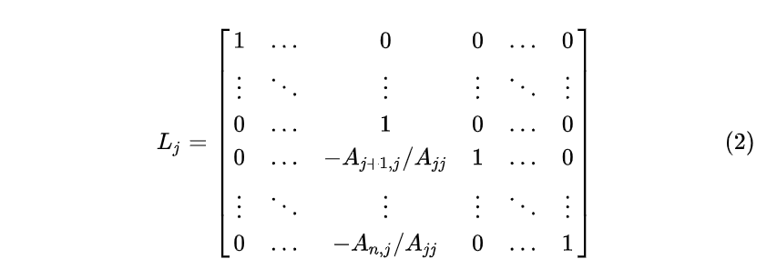
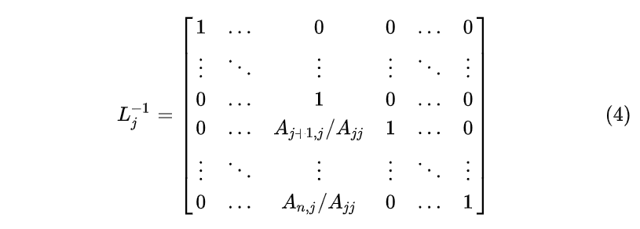
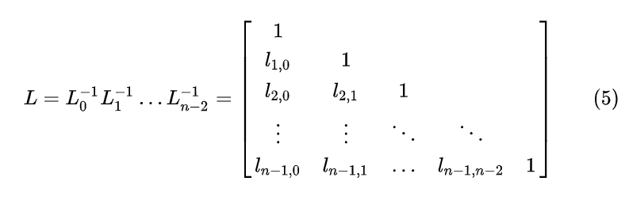

# 包烟复习：LiNEar alGeBRA

[toc]

## 求解线性方程组

> * 启发式：方程组 $\to$ 矩阵形式 $\mathbf A\mathbf x= \mathbf b$ $\to$ 列向量形式 $x_1\mathbf A_{:,1} + x_2 \mathbf A_{:,2} + \dots + x_n \mathbf A_{;,n} = \mathbf b$
>   * 考虑：$\forall \mathbf b, \mathbf A \mathbf x = \mathbf b$ 都是否有解？ $\to$ $\mathbf A$ 的列向量的线性组合是否能覆盖整个向量空间？
>   * **矩阵乘法** - 计算 $\mathbf A \mathbf x$：
>     * 列向量的线性组合：$\begin{bmatrix}2&5\\1&3\end{bmatrix}\begin{bmatrix}1\\2\end{bmatrix}=1\begin{bmatrix}2\\1\end{bmatrix}+2\begin{bmatrix}5\\3\end{bmatrix}=\begin{bmatrix}12\\7\end{bmatrix}$
>     * 向量内积：$\begin{bmatrix}2&5\end{bmatrix}\cdot\begin{bmatrix}1&2\end{bmatrix}^T=12,\ \begin{bmatrix}1&3\end{bmatrix}\cdot\begin{bmatrix}1&2\end{bmatrix}^T=7$

* **消元法**：消元 + 回代 

  > * 主元 Pivot：每个非零行第一个非零元素就。
  > * 增广矩阵 Augmented Matrix：[ $A$ | $b$ ]

  * **消元**：$\left[\begin{array}{c|c}A&b\end{array}\right]=\left[\begin{array}{ccc|c}\underline 1&2&1&2\\3&8&1&12\\0&4&1&2\end{array}\right]\to\left[\begin{array}{ccc|c}\underline 1&2&1&2\\0&\underline 2&-2&6\\0&4&1&2\end{array}\right]\to\left[\begin{array}{ccc|c}\underline 1&2&1&2\\0&\underline 2&-2&6\\0&0&\underline 5&-10\end{array}\right]$
    * 消元失效情形：
      * 主元不能为零
      * 如果在消元时遇到主元位置为零，则需要交换行，使主元不为零
      * 如果在消元时导致一行全部为零，则改行主元就不存在了，消元终止。
  * **回代**：此时方程组变为$\begin{cases}x&+2y&+z&=2\\&2y&-2z&=6\\&&5z&=-10\end{cases}$，从第三个方程求出$z=-2$，代入第二个方程求出$y=1$，在代入第一个方程求出$x=2$。

* **消元矩阵**

  > * 单位矩阵 $I=\begin{bmatrix}1&0&0\\0&1&0\\0&0&1\end{bmatrix}$，相当于四则运算中的 1。
  > * 矩阵乘法表示行列操作：
  >   * 列向量右乘矩阵：$[v_1\ v_2\ v_3]\begin{bmatrix}3\\4\\5\end{bmatrix}=3v_1+4v_2+5v_3$
  >   * 行向量左乘矩阵：$[3,4,5]\begin{bmatrix}r_1\\r_2\\r_3\end{bmatrix}=3r_1+4r_2+5r_3$

  * **消元矩阵计算**（还是上面那个例子）：

    * 第一步：将 $r_2$ 改为 $r_2-3r_1$，则有$\begin{bmatrix}1&0&0\\-3&1&0\\0&0&1\end{bmatrix}\begin{bmatrix}1&2&1\\3&8&1\\0&4&1\end{bmatrix}=\begin{bmatrix}1&2&1\\0&2&-2\\0&4&1\end{bmatrix}$，消元矩阵记为 $E_{21}$，即将第二行第一个元素变为零。
    * 第二步：将 $r_3$ 改为 $r_3 - 2 r_2$，则有 $\begin{bmatrix}1&0&0\\0&1&0\\0&-2&1\end{bmatrix}\begin{bmatrix}1&2&1\\0&2&-2\\0&4&1\end{bmatrix}=\begin{bmatrix}1&2&1\\0&2&-2\\0&0&5\end{bmatrix}$，消元矩阵记为 $E_{32}$ ，即将第三行第二个元素变为零。
    * 从而有：$E_{32}(E_{21} A) = U$，$E_{21}$ 和 $E_{32}$ 都称为初等矩阵 Elementary Matrix
      * 注意矩阵乘法**不满足交换率**，但**满足结合律**（可以变动括号位置）

    > * 初等矩阵的逆：
    >   * 矩阵的逆$E^{-1}$，有 $E^{-1}E=I$
    >   * 初等矩阵 $E_{21}$ 变换是 $r_2' = r_2 - 3r_1$，那么其逆变换就是 $r_2 = r_2' + 3r_1$，所以逆矩阵即 $\begin{bmatrix}1&0&0\\3&1&0\\0&0&1\end{bmatrix}$

## 矩阵乘法和矩阵的逆

* **矩阵乘法**：有 $m\times n$ 矩阵 $A$ 和 $n\times p$ 矩阵 $B$（ $A$ 的总行数必须与 $B$ 的总列数相等），两矩阵相乘有 $AB=C$， $C$ 是一个 $m\times p$ 矩阵。

  * **行列内积**：对于$C$矩阵中的第$i$行第$j$列元素$c_{ij}$，有：$c_{ij}=row_i\cdot column_j=\sum_{k=i}^na_{ik}b_{kj}$，其中$a_{ik}$是$A$矩阵的第$i$行第$k$列元素，$b_{kj}$是$B$矩阵的第$k$行第$j$列元素。

  * 整行相乘、整列相乘、列乘以行：
    $$
    \begin{bmatrix}&&\\A_{col1}&A_{col2}&\cdots&A_{coln}\\&&\end{bmatrix}\begin{bmatrix}\cdots&b_{1j}&\cdots\\\cdots&b_{2j}&\cdots\\\cdots&\vdots&\cdots\\\cdots&b_{nj}&\cdots\\\end{bmatrix}=\begin{bmatrix}&&\\\cdots&\left(b_{1j}A_{col1}+b_{2j}A_{col2}+\cdots+b_{nj}A_{coln}\right)&\cdots\\&&\end{bmatrix}
    $$

    $$
    \begin{bmatrix}\vdots&\vdots&\vdots&\vdots\\a_{i1}&a_{i2}&\cdots&a_{in}\\\vdots&\vdots&\vdots&\vdots\end{bmatrix}\begin{bmatrix}&B_{row1}&\\&B_{row2}&\\&\vdots&\\&B_{rown}&\end{bmatrix}=\begin{bmatrix}\vdots\\\left(a_{i1}B_{row1}+a_{i2}B_{row2}+\cdots+a_{in}B_{rown}\right)\\\vdots\end{bmatrix}
    $$

    $$
    \begin{bmatrix}&&\\A_{col1}&A_{col2}&\cdots&A_{coln}\\&&\end{bmatrix}\begin{bmatrix}&B_{row1}&\\&B_{row2}&\\&\vdots&\\&B_{rown}&\end{bmatrix}=A_{col1}B_{row1}+A_{col2}B_{row2}+\cdots+A_{coln}B_{rown}
    $$

  * **分块乘法**：可以简化运算
    $$
    \left[\begin{array}{c|c}A_1&A_2\\\hline A_3&A_4\end{array}\right]\left[\begin{array}{c|c}B_1&B_2\\\hline B_3&B_4\end{array}\right]=\left[\begin{array}{c|c}A_1B_1+A_2B_3&A_1B_2+A_2B_4\\\hline A_3B_1+A_4B_3&A_3B_2+A_4B_4\end{array}\right]
    $$

* **矩阵的逆** $A^{-1}A=I=AA^{-1}$

  * 如果一个矩阵有逆，则该矩阵是可逆的，或者**非奇异**的，不可逆的矩阵也成为奇异矩阵。
  * 判定不可逆：存在一个非零向量$\mathbf x$，能够满足$\mathbf A\mathbf x = \mathbf 0$ （反证法证明）
  * 左逆和右逆：对于方阵，左逆和右逆是相等的，但是对于非方阵（长方形矩阵），其左逆不等于右逆。

  * 求逆：（高斯 - 诺尔当方法）通过消元将[$A$|$I$] 变成 [$I$|$A^{-1}$]

## LU分解和置换矩阵

> * 转置矩阵：$(A^T)_{ij} = (A)_{ji}$
> * 对称矩阵：$A^T = A$
> * $AB$的逆矩阵为$B^{-1}A^{-1}$（结合律证明）
>
> * $A^T$的逆矩阵为$(A^{-1})^T$

* LU分解 (LU Factorization)是矩阵分解的一种，可以将一个矩阵分解为一个**下三角矩阵**和一个**上三角矩阵**的乘积（有时是它们和一个置换矩阵的乘积）。
  $$
  A = LU\\
  U = L_n,...L_1,L_0A\\
  L = L_0^{-1}L_1^{-1}...L_n^{-1}
  $$
  

  

  

  甚至还有算法：

  ```
  U = A, L = I
  for j = 1 : n-1 do
  	for i = j + 1 : n do
  		l_ii = u_ij / u_jj
  		for k = j : n do
  			u_ik = u_ik - l_ij * u_jk
  		end for
  	end for
  end for
  ```

* LU分解的计算复杂度：得到一个个主元的复杂度依次是$O(n^2),O((n-1)^2,...,O(1^2)$，加起来是$O(n^3)$。

* 置换矩阵 Permutation Matrix

  * 若 $P$ 为置换矩阵，则对任意可逆矩阵 $A$ 有：$PA = LU$
  * 对于任意置换矩阵 $P$，有 $P^TP = I$，即$P^T = P^{-1}$
  * 二阶方阵置换矩阵：
    * 置换两行：$\begin{bmatrix}0&1\\1&0\end{bmatrix}\begin{bmatrix}a&b\\c&d\end{bmatrix}=\begin{bmatrix}c&d\\a&b\end{bmatrix}$
    * 置换两列：$\begin{bmatrix}a&b\\c&d\end{bmatrix}\begin{bmatrix}0&1\\1&0\end{bmatrix}=\begin{bmatrix}b&a\\d&c\end{bmatrix}$
  * 三阶方阵置换矩阵（6个）：

  $$
  \begin{bmatrix}
  
  1 & 0 & 0 \\
  
  0 & 1 & 0 \\
  
  0 & 0 & 1 \\
  
  \end{bmatrix}
  
  \begin{bmatrix}
  
  0 & 1 & 0 \\
  
  1 & 0 & 0 \\
  
  0 & 0 & 1 \\
  
  \end{bmatrix}
  
  \begin{bmatrix}
  
  0 & 0 & 1 \\
  
  0 & 1 & 0 \\
  
  1 & 0 & 0 \\
  
  \end{bmatrix}
  
  \begin{bmatrix}
  
  1 & 0 & 0 \\
  
  0 & 0 & 1 \\
  
  0 & 1 & 0 \\
  
  \end{bmatrix}
  
  \begin{bmatrix}
  
  0 & 1 & 0 \\
  
  0 & 0 & 1 \\
  
  1 & 0 & 0 \\
  
  \end{bmatrix}
  
  \begin{bmatrix}
  
  0 & 0 & 1 \\
  
  1 & 0 & 0 \\
  
  0 & 1 & 0 \\
  
  \end{bmatrix}
  $$

  * $n$阶方阵的置换矩阵有$\binom{n}{1}=n!$个。

## 向量空间

* 向量空间中任意的数乘、向量求和运算都应该落在该控件中，即满足加法封闭和数乘封闭。
  * 满足分配律、结合律、向量空间必须包含原点
* **列空间**：由矩阵 $A$ 的列向量生成的子空间称为 $A$ 的列空间
* **零空间**：对于运算 $\mathbf A \mathbf x = \mathbf 0$，$A$ 的零空间是 $\mathbf x$ 的解组成的集合

## 求$\mathbf A\mathbf x = \mathbf 0$的特解

* 主变量 Pivot Variable：
  $$
  A=
  \begin{bmatrix}
  1 & 2 & 2 & 2\\
  2 & 4 & 6 & 8\\
  3 & 6 & 8 & 10\\
  \end{bmatrix}
  \underrightarrow{消元}
  \begin{bmatrix}
  \underline{1} & 2 & 2 & 2\\
  0 & 0 & \underline{2} & 4\\
  0 & 0 & 0 & 0\\
  \end{bmatrix}
  =U
  $$
  

  * 主变量的个数即为矩阵 A 的秩 Rank

  * 主变量所在的列为主列，其余的列为自由列，自由列中的变量成为自由变量。

  * 给自由列变量的变值赋值，可以去求主列变量的值（求出一个特解）

    令$x_2=1, x_4=0$求得特解 $x=c_1\begin{bmatrix}-2\\1\\0\\0\\\end{bmatrix}$

* **简化行阶梯形式 Reduced Row Echelon Form**：主元上下的元素都是 0 
  $$
  U=
  \begin{bmatrix}
  \underline{1} & 2 & 2 & 2\\
  0 & 0 & \underline{2} & 4\\
  0 & 0 & 0 & 0\\
  \end{bmatrix}
  \underrightarrow{化简}
  \begin{bmatrix}
  \underline{1} & 2 & 0 & -2\\
  0 & 0 & \underline{1} & 2\\
  0 & 0 & 0 & 0\\
  \end{bmatrix}
  =R
  $$

  * 通过列交换，将$R$矩阵中的主变量放在一起，自由变量放在一起，得到
    $$
    R=
    
    \begin{bmatrix}
    
    \underline{1} & 2 & 0 & -2\\
    
    0 & 0 & \underline{1} & 2\\
    
    0 & 0 & 0 & 0\\
    
    \end{bmatrix}
    
    \underrightarrow{列交换}
    
    \left[
    
    \begin{array}{c c | c c}
    
    1 & 0 & 2 & -2\\
    
    0 & 1 & 0 & 2\\
    
    \hline
    
    0 & 0 & 0 & 0\\
    
    \end{array}
    
    \right]
    
    =
    
    \begin{bmatrix}
    
    I & F \\
    
    0 & 0 \\
    
    \end{bmatrix}
    $$
    其中 $I$ 为单位矩阵，$F$ 为自由变量组成的矩阵，计算**零空间矩阵** $N$（nullspace matrix），其列为特解，有$RN=0$。
    $$
    N=\begin{bmatrix}
    -F \\
    I \\
    \end{bmatrix}
    = \begin{bmatrix}
    -2 & 2 \\
    0 & -2 \\
    1 & 0 \\
    0 & 1 \\
    \end{bmatrix}
    $$

## $\mathbf A\mathbf x = \mathbf b$ 的可解性与解的结构

* $\mathbf A\mathbf x = \mathbf b$ 有解：当且仅当 $\mathbf b$ 属于 $\mathbf A$ 的列空间

* $\mathbf A\mathbf x = \mathbf b$ 的所有解：**特解加上零空间**

  令所有自由变量取 $0$ ，代入 $\mathbf A\mathbf x = \mathbf b$ 求得特解 $x_p = \begin{bmatrix}-2 \\ 0 \\ \frac{3}{2} \\ 0 \end{bmatrix}$（接上面的例子）​
  $$
  x_{all}=
  
  \begin{bmatrix}
  
  -2 \\ 0 \\ \frac{3}{2} \\ 0
  
  \end{bmatrix}
  
  +
  
  c_1\begin{bmatrix}-2\\1\\0\\0\\\end{bmatrix}
  
  +
  
  c_2\begin{bmatrix}2\\0\\-2\\1\\\end{bmatrix}
  $$

* 总结：行满秩、列满秩、行列满秩和都不满秩四种情况（$R$ 为 $A$ 的列空间）
  $$
  \begin{array}{c|c|c|c}r=m=n&r=n\lt m&r=m\lt n&r\lt m,r\lt n\\R=I&R=\begin{bmatrix}I\\0\end{bmatrix}&R=\begin{bmatrix}I&F\end{bmatrix}&R=\begin{bmatrix}I&F\\0&0\end{bmatrix}\\1\ solution&0\ or\ 1\ solution&\infty\ solution&0\ or\ \infty\ solution\end{array}
  $$

## 线性相关、基和基本子空间

* **线性无关**：如果$A$零空间中有且仅有$0$向量，则各向量线性无关，$rank(A)=n$。
* **线性相关**：如果存在非零向量 $\mathbf x$ 使得 $\mathbf A \mathbf x = \mathbf 0$ ，则存在线性相关向量，$rank(A)\lt n$。

* **基** Basis：向量空间 $S$ 中的一组基是一组列向量，它们线性无关，并可生成表示整个向量空间。

* **维数** Dimision：对于向量空间 $\mathbb{R}^n$，如果存在 $n$ 个向量组成的矩阵可逆，则这 $n$ 个向量为该空间的一组基。

  * 矩阵 $A$ 的秩 $rank$  等于 主元列数 等于 列空间的维数 $dim(C_A)$
  * $n - rank$  等于 自由变量列数 等于 零空间维数 $dim(N_A)$

* **四个基本子空间及其关系**：对于 $m \times n$ 矩阵$A$，$rank(A)=r$ 有：

  |           子空间 Subspace           | 维数 Dim |
  | :---------------------------------: | :------: |
  |  行空间 $C_{A^T} \in \mathbb{R}^n$  |    r     |
  |    列空间 $C_A \in \mathbb{R}^m$    |    r     |
  |    零空间 $N_A \in \mathbb{R}^n$    |  n - r   |
  | 左零空间 $N_{A^T} \in \mathbb{R}^m$ |  m - r   |

  * **行空间基向量求解**：做行变换会影响列空间，导致变换前后列空间不同，但不会影响行空间，行空间可以通过对矩阵 $A$ 进行消元，化简得到（非零行向量）。
  * **左零空间的理解**：$A^Ty=0 \rightarrow (A^Ty)^T=0^T\rightarrow y^TA=0^T$

* 秩一矩阵：$dim(C_A) = dim(C_{A^T}) = 1$，可以同意划分为$A = \mathbf u \mathbf v^T$，$\mathbf u, \mathbf v$均为列向量。

* **关联矩阵**：行为边，列为点，有向（$-1 \to 1$）
  * 线性相关：存在回路；线性无关：无回路

## 正交向量、子空间和投影

* 正交 Orthogonal 

  * $||\mathbf x||^2 = \mathbf x^T \mathbf x$
  * 正交向量内积为 0 , 零向量与任意向量正交

* 行空间与零空间将$\mathbb{R}^n$分割为两个正交的子空间

  * 零空间是$Ax=0$的解，看到：（易证$x$与$A$各行线性组合正交）
    $$
    \begin{bmatrix}row_1\\row_2\\ \vdots \\row_m\end{bmatrix}
    
    \Bigg[x\Bigg]=
    
    \begin{bmatrix}0\\0\\ \vdots\\ 0\end{bmatrix}
    $$

  * 我们将行空间与零空间称为$n$维空间里的正交补，即零空间包含了所有与行空间正交的向量。

* 列空间与左零空间将$\mathbb{R}^m$分割为两个正交的子空间

* 矩阵 $A^TA$，$n \times n$ 的对称矩阵，并非都可逆。

  * $rank(A^TA) = rank(A)$，$A^TA$可逆仅当$A$的列线性无关。
  * $A^TAx = A^Tb$

* 投影 Projection

  * 为什么需要投影：有时候 $Ax = b$ 无解（$b$ 不在 $A$ 的列空间中），我们只能求出最接近的近似解，即$A\hat x = p$，$p$ 是 $b$ 在 $A$ 的列空间中的投影，$\hat x$ 是近似解。（注意：$A$ 不一定是可逆矩阵）
    $$
    A^T(b - A\hat x) = 0 \\
    A^TA\hat x = A^T b \\
    \hat x = (A^TA)^{-1}A^Tb \\
    p = A\hat x = A(A^TA)^{-1}A^Tb \\
    P = A(A^TA)^{-1}A^T // \text{投影矩阵}
    $$
  
  * 投影矩阵 $P$：**投影矩阵作用到某个向量 $x$ 后，得到投影向量 $\hat x$**
    $$
    P = A(A^TA)^{-1}A^T
    $$
    $P$ 是一个 $n \times n$ 的矩阵。
  
    * 投影矩阵的性质：$P = P^T$，$P^2 = P$；
      * $A^TA$ 是对称的，故其逆也是对称的
    * 当 $A$ 可逆，$P = I$。

* 最小二乘法
  * 最小二乘法拟合直线（投影应用案例）：找到距离图中三个点 $(1, 1), (2, 2), (3, 2)$ 偏差最小的直线：$b=C+Dt$。
    * 根据条件可以得到方程组（化为矩阵形式）：$\begin{bmatrix}1&1 \\1&2 \\1&3\\\end{bmatrix}\begin{bmatrix}C\\D\\\end{bmatrix}=\begin{bmatrix}1\\2\\2\\\end{bmatrix}$，很明显方程组无解，但 $A^TA\hat x=A^Tb$ 有解，于是我们将原是两边同时乘以$A^T$后得到的新方程组是有解的。
  * 最小二乘法：$\min(||Ax - b||^2)$，求出 $A^TA$ 和 $A^Tb$可以写出求 $\hat x$ ，即正规方程组 Normal Equations。
  * 求证$A^TA$是可逆矩阵：先假设$A^TAx=0$，两边同时乘以$x^T$有$x^TA^TAx=0$，即$(Ax)^T(Ax)=0$。一个矩阵乘其转置结果为零，则这个矩阵也必须为零（$(Ax)^T(Ax)$相当于$Ax$长度的平方）。则$Ax=0$，结合题设中的“$A$的各列线性无关”，可知$x=0$，也就是$A^TA$的零空间中有且只有零向量，得证。

## 正交矩阵和Gram-Schmidt正交化法

* **标准正交（Orthonormal）**：对向量对 $q_i,q_j (i \neq j)$，满足$ q_i^Tq_j = 0, q_i^Tq_i = 1$，一组标准正交向量组成一个标准正交矩阵 $Q$。
  * 标准正交矩阵满足：$Q^TQ = I$，特别地，如果 $Q$ 为方阵，有 $Q^T = Q^{-1}$

* **Gram-Schmidt正交化**：
  * 问题描述：有两个线性无关的向量$a,b$，我们想从中得到标准正交向量$q_1,q_2$。用这种方法可以解决空间的基没有满足标准正交，需要一组标准正交基的问题。
  
  * 将 a 向量定为 A 向量，然后将 b 向量投影到 a 向量上。取投影垂线所在直线的正方向为另一个基向量 B 的方向，取投影垂线长度为 B 的长度。这时 A 与 B 明显正交。
  * 联系投影，不难得到$B = b - \frac{A^Tb}{A^TA}A$，同样，推广到第三个向量就是$C = c - \frac{A^Tc}{A^TA}A - \frac{B^Tc}{B^TB}B$，最后还需单位化。


## 行列式和代数余子式

* 矩阵 $A$ 的行列式用 $|A|$ 表示。

* 行列式的性质：

  * **性质一**：单位矩阵的行列式为 1。

  * **性质二**：交换行，行列式变号。
    * **性质三**：
      * $\begin{vmatrix}ta&tb\\c&d\end{vmatrix}=t\begin{vmatrix}a&b\\c&d\end{vmatrix}$
      * $\begin{vmatrix}a+a'&b+b'\\c&d\end{vmatrix}=\begin{vmatrix}a&b\\c&d\end{vmatrix}+\begin{vmatrix}a'&b'\\c&d\end{vmatrix}$

  * **性质四**：如果两行相等，行列式为 0 

  * **性质五**：从第$k$行中减去第$i$行的$l$倍，行列式不变。故可以先消元，将方阵变为上三角形式后再计算行列式

  * **性质六**：如果方阵的某一行为零，则其行列式值为零

  * **性质七**：对于上三角阵U或者下三角阵L，|A| = 对角线的值的乘积

    * **性质八**：
      * $|A| = 0$，矩阵A是奇异的
      * $|A|\neq0$，矩阵A是非奇异的

    * **性质九**：
      * $|AB| = |A||B|$
      * $|A^{-1}| = \frac1{|A|}$
      * $kA| = k^n|A|$

  * **性质十**：$|A| = |A^T|$

* 二阶方阵行列式计算公式：$\begin{vmatrix}a&b\\c&d\end{vmatrix}=ad-bc$。

* 三阶矩阵行列式计算：
  $$
  \begin{vmatrix}a_{11}&a_{12}&a_{13}\\a_{21}&a_{22}&a_{23}\\a_{31}&a_{32}&a_{33}\end{vmatrix}=\begin{vmatrix}a_{11}&0&0\\0&a_{22}&0\\0&0&a_{33}\end{vmatrix}+\begin{vmatrix}a_{11}&0&0\\0&0&a_{23}\\0&a_{32}&0\end{vmatrix}+\begin{vmatrix}0&a_{12}&0\\a_{21}&0&0\\0&0&a_{33}\end{vmatrix}+\begin{vmatrix}0&a_{12}&0\\0&0&a_{23}\\a_{31}&0&0\end{vmatrix}+\begin{vmatrix}0&0&a_{13}\\a_{21}&0&0\\0&a_{32}&0\end{vmatrix}+\begin{vmatrix}0&0&a_{13}\\0&a_{22}&0\\a_{31}&0&0\end{vmatrix}
  $$

  $$
  原式=a_{11}a_{22}a_{33}-a_{11}a_{23}a_{32}-a_{12}a_{21}a_{33}+a_{12}a_{23}a_{31}+a_{13}a_{21}a_{32}-a_{13}a_{22}a_{31}
  $$

  同理，我们想继续推导出阶数更高的式子，按照上面的式子可知$n$阶行列式应该可以分解成$n!$个非零行列式（占据第一行的元素有$n$种选择，占据第二行的元素有$n-1$种选择，以此类推得$n!$）：
  $$
  |A|=\sum_{n!} \pm a_{1\alpha}a_{2\beta}a_{3\gamma}\cdots a_{n\omega}, (\alpha, \beta, \gamma, \omega)=P_n^n\tag{2}
  $$
  这个公式还不完全，接下来需要考虑如何确定符号：
  $$
  \begin{vmatrix}0&0&\overline 1&\underline 1\\0&\overline 1&\underline 1&0\\\overline 1&\underline 1&0&0\\\underline 1&0&0&\overline 1\end{vmatrix}
  $$

  * 观察带有下划线的元素，它们的排列是$(4,3,2,1)$，变为$(1,2,3,4)$需要两步操作，所以应取$+$；

  * 观察带有上划线的元素，它们的排列是$(3,2,1,4)$，变为$(1,2,3,4)$需要一步操作，所以应取$-$。

  * 观察其他元素，我们无法找出除了上面两种以外的排列方式，于是该行列式值为零，这是一个奇异矩阵。

* **代数余子式** Cofactor：将$n$阶行列式转化为$n-1$阶行列式。
  
  * 余子式无正负，代数余子式考虑正负，都是一个值。
  
  考虑三阶方阵：
  $$
  |A| = a_{11}(a_{22}a_{33}-a_{23}a_{32})+a_{12}(a_{21}a_{33}-a_{23}a_{31})+a_{13}(a_{21}a_{32}-a_{22}a_{31})
  $$
  即可写成：
  $$
  |A| = \begin{vmatrix}a_{11}&0&0\\0&a_{22}&a_{23}\\0&a_{32}&a_{33}\end{vmatrix}+\begin{vmatrix}0&a_{12}&0\\a_{21}&0&a_{23}\\a_{31}&0&a_{33}\end{vmatrix}+\begin{vmatrix}0&0&a_{13}\\a_{21}&a_{22}&0\\a_{31}&a_{32}&0\end{vmatrix}
  $$
  于是，我们可以定义$a_{ij}$的代数余子式：将原行列式的第$i$行与第$j$列抹去后得到的$n-1$阶行列式记为$C_{ij}$，$i+j$为偶时时取$+$，$i+j$为奇时取$-$。
  $$
  |A|=a_{11}C_{11}-a_{12}C_{12}+\cdots+(-)a_{1n}C_{1n}
  $$
  
* **三种求行列式的方法**：

  * 消元，$|A|$就是主元的乘积；
  * 使用展开，求$n!$项之积；
  * 使用代数余子式。

* 例题：
  $$
  A_4=\begin{vmatrix}1&1&0&0\\1&1&1&0\\0&1&1&1\\0&0&1&1\end{vmatrix}\stackrel{沿第一行展开}{=}\begin{vmatrix}1&1&0\\1&1&1\\0&1&1\end{vmatrix}-\begin{vmatrix}1&1&0\\0&1&1\\0&1&1\end{vmatrix}=-1-0=-1
  $$

* 行列式的绝对值等于一个箱子的体积 / 面积。
  * 对于三阶单位矩阵，其体积为$\det I=1$，此时这个箱子是一个单位立方体。

## 克拉默法则与求逆矩阵

* **求逆矩阵**：$A^{-1} = \frac{1}{\det A}C^T$，其中$C_{i,j}$是$a_{i,j}$的代数余子式。
  * 对于二阶方阵：$\begin{bmatrix}a&b\\c&d\end{bmatrix}^{-1}=\frac{1}{ad-bc}\begin{bmatrix}d&-b\\-c&a\end{bmatrix}$
* **克拉默法则** Cramer’s Rule 求解 $Ax = b$：
  * 观察 $x=\frac{1}{\det A}C^Tb$，将$x$拆分开，$x$的第一个分量有$x_1=\frac{y_1}{\det A}$，这里$y_1=b_1C_{11}+b_2C_{21}+\cdots+b_nC_{n1}$，看到数字与代数余子式乘之积求和时，应联想到求行列式。$y_1$ 可以看做是一个矩阵的行列式，设这个矩阵为$B_1$，有$x_i=\frac{\det B_1}{\det A}$，同理有$x_2=\frac{\det B_2}{\det A}$，$x_2=\frac{\det B_2}{\det A}$。
  * $B_1$是一个型为$\Bigg[b a_2 a_3 \cdots a_n\Bigg]$的矩阵，即将矩阵$A$的第一列变为$b$向量而得到的新矩阵。其实很容易看出，$\det B_1$可以沿第一列展开得到$y_1=b_1C_{11}+b_2C_{21}+\cdots+b_nC_{n1}$
  * 一般的，有$B_j=\Bigg[a_1 a_2 \cdots a_{j-1} b a_{j+1} \cdots a_n\Bigg]$，即将矩阵$A$的第$j$列变为$b$向量而得到的新矩阵，所以，对于解的分量有$x_j=\frac{\det B_j}{\det A}$

## 特征值和特征向量

* 特征向量 Eigen Vector：满足 $Ax = \lambda x$ 的 $x$

  * 考虑**特征值为 $0$ 的特征向量**：即满足 $Ax = 0$ 的解，也即特征值为零的特征向量位于 $A$ 的零空间中。
    * 如果矩阵是奇异的，就说明其至少有一个特征值 $\lambda = 0$
  * 考虑**投影矩阵** $P = A(A^TA)^{-1}A^T$ 的特征值和特征向量：计算 $Pb$ 的投影向量，只有当 $b$ 已经处于投影平面之中，$Pb = b$，二者同向，有$Pb = 1\cdot b$
    * 投影平面中的所有向量都是投影矩阵的特征向量，特征值均为 $1$
    * 与投影平面垂直的向量（法向量）也是投影矩阵的特征向量，特征值为 $0$ 。

* 矩阵的迹 Trace：**对于一个$n\times n$的矩阵，将会有$n$个特征值**，而这些**特征值的和与该矩阵对角线元素的和相同**，因此我们把矩阵对角线元素之和称为矩阵的迹。
  $$
  \sum_{i=1}^n \lambda_i=\sum_{i=1}^n a_{ii}
  $$

* **特征值的积等于矩阵的行列式**。

* **求解 $Ax = \lambda x$**（两个未知数：特征值 $\lambda$ 和特征向量 $x$ ）

  * 移项：$(A - \lambda I)x = 0$
  * 观察式子：有（非零）解说明$A-\lambda I$线性相关，即奇异矩阵，即行列式为 $0$。
  * 转化为特征方程 Characteristic Equation：$\det(A - \lambda I) = 0$

  * 例子：$A=\begin{bmatrix}3&1\\1&3\end{bmatrix}$，计算$\det{(A-\lambda{I})}=\begin{vmatrix}3-\lambda&1\\1&3-\lambda\end{vmatrix}$，即 $(3-\lambda)^2-1=\lambda^2-6\lambda+8=0, \lambda_1=4,\lambda_2=2$。

    计算特征向量，$A-4I=\begin{bmatrix}-1&1\\1&-1\end{bmatrix}$，显然矩阵是奇异的（如果是非奇异说明特征值计算有误），解出矩阵的零空间$x_1=\begin{bmatrix}1\\1\end{bmatrix}$；同理计算另一个特征向量，$A-2I=\begin{bmatrix}1&1\\1&1\end{bmatrix}$，解出矩阵的零空间$x_2=\begin{bmatrix}1\\-1\end{bmatrix}$。

  * 很容易证明，如果 $Ax=\lambda x$，则 $(A+kI)x=\lambda x+kx=(\lambda+k)x$，所以 $x$ 还是原来的 $x$，而 $\lambda$ 变为 $\lambda+k$。

* 旋转矩阵的例子：$Q = \begin{bmatrix}\cos 90&-\sin 90\\\sin 90&\cos 90\end{bmatrix}=\begin{bmatrix}0&-1\\1&0\end{bmatrix}$，解得特征值为 $i$ 和 $-i$，说明即使矩阵全是实数，其特征值也不一定是实数。

  * 如果矩阵对称，那么特征值就是实数；如果矩阵反对称，就像本例，$Q^T=-Q$，得到纯虚的特征值。通常矩阵是介于对称与反对称之间的。

* **退化矩阵** Degenerate Matrix：重复的特征值在特殊情况下将导致特征向量的缺少。

  * $A=\begin{bmatrix}3&1\\0&3\end{bmatrix}$，$\lambda_1=3,\lambda_2=3$，不存在两个线性无关的特征向量。

## 对角化矩阵

* 如何利用特征向量和特征值：对于特征向量作为列向量组成的矩阵 $S$，可以使用 $S^{-1}AS = \Lambda$ 来将 $A$ 对角化，而由于$AS = A[x_1x_2,\dots x_n] = [(\lambda_1x_1)(\lambda_2x_2)\dots(\lambda_nx_n)]$，整理右式可提取成：（特征值矩阵）
  $$
  \Bigg[x_1x_2\cdots x_n\Bigg]\begin{bmatrix}\lambda_1&0&\cdots&0\\0&\lambda_2&\cdots&0\\\vdots&\vdots&\ddots&\vdots\\0&0&\cdots&\lambda_n\end{bmatrix}=S\Lambda
  $$
  同样有：$A = S\Lambda S^{-1}$。

* **计算矩阵的幂**，例如$A^2$

  * 从$Ax=\lambda x$开始，如果两边同乘以$A$，有$A^2x=\lambda Ax=\lambda^2x$。

    * 结论：对于矩阵$A^2$，其特征值也会取平方，而特征向量不变

  * 从$A=S\Lambda S^{-1}$开始推导，则有$A^2=S\Lambda S^{-1}S\Lambda S^{-1}=S\Lambda^2S^{-1}$

    * 结论一致。

  * 从而有：$A^k = S\Lambda^kS^{-1}$，其中对角矩阵：
    $$
    \Lambda^k=\begin{bmatrix}\lambda_1^k&0&\cdots&0\\0&\lambda_2^k&\cdots&0\\\vdots&\vdots&\ddots&\vdots\\0&0&\cdots&\lambda_n^k\end{bmatrix}
    $$

* **矩阵可对角化的条件**：

  * $n$ 个互不相同的特征值 $\to$ 可能具有 $n$ 个线性无关的特征向量
  * 如果一个矩阵的特征值存在重复值，则该矩阵可能具有$n$个线性无关的特征向量，例如单位矩阵。
    * 代数重度 Algebraic Multiplicity：计算特征值重复的次数

* 求 $u_{k+1} = Au_k = A^{k+1}u_0$

  将 $u_0$ 展开为 $A$ 特征向量的线性组合。
  $$
  u_0= Sc \\
  Au_0 = S\Lambda c \\
  A^ku_0 = S\Lambda^{k}c
  $$

  * 斐波那契数列的例子：
    $$
    \begin{bmatrix}F_{k+2}\\F_{k+1}\end{bmatrix}=\begin{bmatrix}1&1\\1&0\end{bmatrix}\begin{bmatrix}F_{k+1}\\F_{k}\end{bmatrix}
    $$
    因为是二阶，我们可以直接利用迹与行列式解方程组$\begin{cases}\lambda_1+\lambda_2&=1\\\lambda_1\cdot\lambda_2&=-1\end{cases}$，用求根公式解特征值得$\begin{cases}\lambda_1=\frac{1}{2}\left(1+\sqrt{5}\right)\approx{1.618}\\\lambda_2=\frac{1}{2}\left(1-\sqrt{5}\right)\approx{-0.618}\end{cases}$，得到两个不同的特征值，一定会有两个线性无关的特征向量，则该矩阵可以被对角化。

    观察数列，数列增长由特征值来控制，较大的一个特征值起决定性作用。由于$-0.618$在幂增长中趋近于$0$，所以近似的忽略该项，剩下较大的项，我们可以说数量增长的速度大约是$1.618$。
    $$
    F_{100}=c_1\left(\frac{1+\sqrt{5}}{2}\right)^{100}+c_2\left(\frac{1-\sqrt{5}}{2}\right)^{100}\approx c_1\left(\frac{1+\sqrt{5}}{2}\right)^{100}
    $$
    求解特征向量，$A-\lambda I=\begin{bmatrix}1-\lambda&1\\1&1-\lambda\end{bmatrix}$，因为有根式且矩阵只有二阶，我们直接观察$\begin{bmatrix}1-\lambda&1\\1&1-\lambda\end{bmatrix}\begin{bmatrix}?\\?\end{bmatrix}=0$，其特征向量为$\begin{bmatrix}\lambda\\1\end{bmatrix}$，即$x_1=\begin{bmatrix}\lambda_1\\1\end{bmatrix}, x_2=\begin{bmatrix}\lambda_2\\1\end{bmatrix}$。

    最后，计算初始项$u_0=\begin{bmatrix}F_1\\F_0\end{bmatrix}=\begin{bmatrix}1\\0\end{bmatrix}$，现在将初始项用特征向量表示出来$\begin{bmatrix}1\\0\end{bmatrix}=c_1x_1+c_2x_2$，计算系数得$c_1=\frac{\sqrt{5}}{5}, c_2=-\frac{\sqrt{5}}{5}$。

    套用公式，即$A$的$k$次方表达式$A^k=S\Lambda^kS^{-1}$，则有$u_{99}=Au_{98}=\cdots=A^{99}u_{0}=S\Lambda^{99}S^{-1}Sc=S\Lambda^{99}c$，代入特征值、特征向量得$u_{99}=\begin{bmatrix}F_{100}\\F_{99}\end{bmatrix}=\begin{bmatrix}\frac{1+\sqrt{5}}{2}&\frac{1-\sqrt{5}}{2}\\1&1\end{bmatrix}\begin{bmatrix}\left(\frac{1+\sqrt{5}}{2}\right)^{99}&0\\0&\left(\frac{1-\sqrt{5}}{2}\right)^{99}\end{bmatrix}\begin{bmatrix}\frac{\sqrt{5}}{5}\\-\frac{\sqrt{5}}{5}\end{bmatrix}=\begin{bmatrix}c_1\lambda_1^{100}+c_2\lambda_2^{100}\\c_1\lambda_1^{99}+c_2\lambda_2^{99}\end{bmatrix}$，最终结果为$F_{100}=c_1\lambda_1^{100}+c_2\lambda_2^{100}$。

## 对称矩阵和正定矩阵

* **马尔科夫矩阵**：所有元素大于等于 0 ，与概率相关，每一列的元素之和为 1。

  * 关注点：幂运算中的稳态
  * 结论：该矩阵必有特征值为 1，其他特征值都小于 1。
  * 应用：用于计算迁移、流动状况和稳定情况。

* **对称矩阵**（实对称矩阵）：

  * 基本特性：

    * **特征值为实数**
    * **特征向量相互正交**

  * 特征值不重复，特征向量相互正交的情形：

    * 可对角化：$A = S \Lambda S^{-1}$
    * 特征向量相互正交，故对于对称矩阵有：$A = Q \Lambda Q^{-1}$，对于标准正交矩阵，有 $Q^{-1} = Q^T$，对称矩阵可写成 $A = Q \Lambda Q^{-1}$（谱定理）

  * 多次投影不变等
    $$
    A=Q\varLambda Q^T=\Bigg[q_1\ q_2\ \cdots\ q_n\Bigg]\begin{bmatrix}\lambda_1& &\cdots& \\&\lambda_2&\cdots&\\\vdots&\vdots&\ddots&\vdots\\& &\cdots&\lambda_n\end{bmatrix}\begin{bmatrix}\quad q_1^T\quad\\\quad q_1^T\quad\\\quad \vdots \quad\\\quad q_1^T\quad\end{bmatrix} \\
    = \lambda_1q_1q_1^T+\lambda_2q_2q_2^T+\cdots+\lambda_nq_nq_n^T
    $$
    考虑展开式中的$qq^T$，$q$是单位列向量所以$q^Tq=1$，$\frac{qq^T}{q^Tq}=qq^T$是一个投影矩阵，很容易验证其性质，比如平方它会得到$qq^Tqq^T=qq^T$于是多次投影不变等。

  * 每个对称矩阵都可以分解为一系列相互正交的投影矩阵。
    * 对称矩阵是其特征向量投影矩阵的线性组合。

* **正定性** Positive Definite：特征值均为正数的矩阵
  * 正定矩阵的子行列式都为正。
  * 半正定矩阵：特征值均非负的矩阵。
  * **正定性的判断**：
    * 矩阵的所有特征值大于零
    * 矩阵的所有顺序主子阵的行列式（即顺序主子式）大于零
    * 矩阵消元后主元均大于零
    * $x^TAx > 0$
  * 主轴定理 Principal Axis Theorem：特征向量说明主轴的方向，特征值说明主轴的长度。
    * $x^TAx$得到一个椭圆曲线
  * 正定矩阵的逆也是正定的
    * 矩阵的逆的特征值为为原矩阵的倒数
  * 正定矩阵的和也是正定的
  * $A$ 的各列线性无关，则有 $|Ax|^2 > 0$，$A^TA$ 正定
  * 在矩阵数值计算中，正定矩阵消元不需要进行“行交换”操作，也不必担心主元过小或为零，正定矩阵具有良好的计算性质。
* 复数矩阵：
  * 计算模：使用向量的共轭的转置乘以原向量即可，记作 $z^Hz$（计算内积同理）
  * 对称性：要做一次共轭，例$\begin{bmatrix}2&3+i\\3-i&5\end{bmatrix}$是一个复数情况下的对称矩阵，记作 $A^H = A$
  * 正交性（酉 Unitary）：也需要一次共轭，$q_i^Hq_j = \begin{cases}0\quad i\neq j\\1\quad i=j\end{cases}$，对于标准正交矩阵 $Q^HQ = I$

## 相似矩阵和诺尔当形

* **相似矩阵**：矩阵$A,B$相对于矩阵$M$满足$B = M^{-1}AM$时，$A,B$互为相似矩阵。

  * 对角化有$A = S^{-1}\Lambda S$，故有$A,\Lambda$互为相似矩阵。
  * **相似矩阵具有相同的特征值**。具有相同特征值的一组矩阵都是相似矩阵。
  * 特征值重读可能会导致向量短缺，出现短缺的一类矩阵只与自己相似。

* **若尔当形**：

  * **若尔当块的定义型为$J_i=\begin{bmatrix}\lambda_i&1&&\cdots&\\&\lambda_i&1&\cdots&\\&&\lambda_i&\cdots&\\\vdots&\vdots&\vdots&\ddots&\\&&&&\lambda_i\end{bmatrix}$，它的对角线上只为同一个数，仅有一个特征向量。**

    * **即若当块矩阵对角线上为相同的复数 $\lambda$ ，下方（或上方) 次对角线上全为 1，其余元素全为 0**。 

  * 每一个矩阵$A$都相似于一个若尔当矩阵，型为$J=\left[\begin{array}{c|c|c|c}J_1&&&\\\hline&J_2&&\\\hline&&\ddots&\\\hline&&&J_d\end{array}\right]$。若尔当块的个数即为矩阵特征值的个数。

    * 在$n$阶矩阵将有$n$个不同的特征值的情况下，它可以进行对角化，所以它的若尔当矩阵就是$\Lambda$，共$n$个特征向量，有$n$个若尔当块（每个块的大小1x1）。

  * 考虑矩阵$\begin{bmatrix}0&1&0&0\\0&0&1&0\\0&0&0&0\\0&0&0&0\end{bmatrix}$，其特征值为四个零，秩为$2$，所以其零空间的维数为$4-2=2$，即该矩阵有两个特征向量。

    可以发现该矩阵在主对角线的上方有两个$1$，在对角线上每增加一个$1$，特征向量个个数就减少一个。

  * 令一个例子，$\begin{bmatrix}0&1&0&0\\0&0&0&0\\0&0&0&1\\0&0&0&0\end{bmatrix}$，从特征向量的数目看来这两个矩阵是相似的，其实不然。
  * 若尔当认为第一个矩阵是由一个$3\times 3$的块与一个$1\times 1$的块组成的 $\left[\begin{array}{ccc|c}0&1&0&0\\0&0&1&0\\0&0&0&0\\\hline0&0&0&0\end{array}\right]$，而第二个矩阵是由两个$2\times 2$矩阵组成的$\left[\begin{array}{cc|cc}0&1&0&0\\0&0&0&0\\\hline0&0&0&1\\0&0&0&0\end{array}\right]$，这些分块被称为若尔当块。

## 奇异值分解

* **奇异值分解**：$A = U \varSigma V^T$，等号右边分解的因子分别是正交矩阵、对角矩阵、正交矩阵，两个正交矩阵通常是不同的，同时分解不限于方阵。

  * 正定矩阵可以分解为$A=Q\Lambda Q^T$，由于$A$对称性其特征向量是正交的，且其$\Lambda$矩阵中的元素皆为正，这就是正定矩阵的奇异值分解。在这种特殊的分解中，我们只需要一个正交矩阵$Q$就可以使等式成立。
  * 可对角化的矩阵能够分解为$A=S\Lambda S^T$的形式，其中$S$的列向量由$A$的特征向量组成，但$S$并不是正交矩阵，所以这不是我们希望得到的奇异值分解。

* 在$A$的**列空间**中找到一组特殊的正交基$v_1,v_2,\cdots,v_r$，这组基在$A$的作用下可以转换为$A$的**行空间**中的一组正交基$u_1,u_2,\cdots,u_r$。

  * $Av_1=\sigma_1u_1,\ Av_2=\sigma_2u_2,\cdots,Av_r=\sigma_ru_r$，这些$\sigma$是缩放因子，表示在转换过程中有拉伸或压缩。而$A$的左零空间和零空间将体现在$\sigma$的零值中。如果算上左零、零空间，我们同样可以对左零、零空间取标准正交基，然后写为
    $$
    A\Bigg[v_1\ v_2\ \cdots\ v_r\ v_{r+1}\ \cdots\ v_n\Bigg]=\Bigg[u_1\ u_2\ \cdots\ u_r\ u_{r+1}\ \cdots \ u_m\Bigg]\left[\begin{array}{c c c|c}\sigma_1&&&\\&\ddots&&\\&&\sigma_r&\\\hline&&&\begin{bmatrix}0\end{bmatrix}\end{array}\right]
    $$
    此时$U$是$m\times m$正交矩阵，$\varSigma$是$m\times n$对角矩阵，$V^T$是$n\times n$正交矩阵。

  * $v_1,\ \cdots,\ v_r$是行空间的标准正交基；

    $u_1,\ \cdots,\ u_r$是列空间的标准正交基；

    $v_{r+1},\ \cdots,\ v_n$是零空间的标准正交基；

    $u_{r+1},\ \cdots,\ u_m$是左零空间的标准正交基。

* 计算一个例子，$A=\begin{bmatrix}4&4\\-3&3\end{bmatrix}$，我们需要找到：

  * 行空间$\mathbb{R}^2$的标准正交基$v_1,v_2$；
  * 列空间$\mathbb{R}^2$的标准正交基$u_1,u_2$；
  * $\sigma_1>0, \sigma_2>0$。

  > 在$A=U\varSigma V^T$中有两个标准正交矩阵需要求解，我们希望一次只解一个，如何先将$U$消去来求$V$？
  >
  > * 这个技巧会经常出现在长方形矩阵中：求$A^TA$，这是一个对称正定矩阵（至少是半正定矩阵），于是有$A^TA=V\varSigma^TU^TU\varSigma V^T$，由于$U$是标准正交矩阵，所以$U^TU=I$，而$\varSigma^T\varSigma$是对角线元素为$\sigma^2$的对角矩阵。
  > * 现在有$A^TA=V\begin{bmatrix}\sigma_1&&&\\&\sigma_2&&\\&&\ddots&\\&&&\sigma_n\end{bmatrix}V^T$，这个式子中$V$即是$A^TA$的特征向量矩阵而$\varSigma^2$是其特征值矩阵。
  > * 同理，我们只想求$U$时，用$AA^T$消掉$V$即可。

  * 我们来计算$A^TA=\begin{bmatrix}4&-3\\4&3\end{bmatrix}\begin{bmatrix}4&4\\-3&3\end{bmatrix}=\begin{bmatrix}25&7\\7&25\end{bmatrix}$，对于简单的矩阵可以直接观察得到特征向量$A^TA\begin{bmatrix}1\\1\end{bmatrix}=32\begin{bmatrix}1\\1\end{bmatrix},\ A^TA\begin{bmatrix}1\\-1\end{bmatrix}=18\begin{bmatrix}1\\-1\end{bmatrix}$，化为单位向量有$\sigma_1=32,\ v_1=\begin{bmatrix}\frac{1}{\sqrt{2}}\\\frac{1}{\sqrt{2}}\end{bmatrix},\ \sigma_2=18,\ v_2=\begin{bmatrix}\frac{1}{\sqrt{2}}\\-\frac{1}{\sqrt{2}}\end{bmatrix}$。
  * 到目前为止，我们得到$\begin{bmatrix}4&4\\-3&3\end{bmatrix}=\begin{bmatrix}u_?&u_?\\u_?&u_?\end{bmatrix}\begin{bmatrix}\sqrt{32}&0\\0&\sqrt{18}\end{bmatrix}\begin{bmatrix}\frac{1}{\sqrt{2}}&\frac{1}{\sqrt{2}}\\\frac{1}{\sqrt{2}}&-\frac{1}{\sqrt{2}}\end{bmatrix}$，接下来继续求解$U$。
  * $AA^T=U\varSigma V^TV\varSigma^TU^T=U\varSigma^2U^T$，求出$AA^T$的特征向量即可得到$U$，$\begin{bmatrix}4&4\\-3&3\end{bmatrix}\begin{bmatrix}4&-3\\4&3\end{bmatrix}=\begin{bmatrix}32&0\\0&18\end{bmatrix}$，观察得$AA^T\begin{bmatrix}1\\0\end{bmatrix}=32\begin{bmatrix}1\\0\end{bmatrix},\ AA^T\begin{bmatrix}0\\1\end{bmatrix}=18\begin{bmatrix}0\\1\end{bmatrix}$。但是我们不能直接使用这一组特征向量，因为式子$AV=U\varSigma$明确告诉我们，一旦$V$确定下来，$U$也必须取能够满足该式的向量，所以此处$Av_2=\begin{bmatrix}0\\-\sqrt{18}\end{bmatrix}=u_2\sigma_2=\begin{bmatrix}0\\-1\end{bmatrix}\sqrt{18}$，则$u_1=\begin{bmatrix}1\\0\end{bmatrix},\ u_2=\begin{bmatrix}0\\-1\end{bmatrix}$

  > 补充：$AB$的特征值与$BA$的特征值相同
  >
  > * 取$\lambda\neq 0$，$v$是$AB$在特征值取$\lambda$时的的特征向量，则有$Bv\neq 0$，并有$\lambda Bv=B(\lambda v)=B(ABv)=(BA)Bv$，所以$Bv$是$BA$在特征值取同一个$\lambda$时的特征向量。
  > * 再取$AB$的特征值$\lambda=0$，则$0=\det{AB}=\det{A}\det{B}=\det{BA}$，所以$\lambda=0$也是$BA$的特征值，得证。

  * 最终，我们得到$\begin{bmatrix}4&4\\-3&3\end{bmatrix}=\begin{bmatrix}1&0\\0&-1\end{bmatrix}\begin{bmatrix}\sqrt{32}&0\\0&\sqrt{18}\end{bmatrix}\begin{bmatrix}\frac{1}{\sqrt{2}}&\frac{1}{\sqrt{2}}\\\frac{1}{\sqrt{2}}&-\frac{1}{\sqrt{2}}\end{bmatrix}$。


* 再做一个例子，$A=\begin{bmatrix}4&3\\8&6\end{bmatrix}$，这是个秩一矩阵，有零空间。$A$的行空间为$\begin{bmatrix}4\\3\end{bmatrix}$的倍数，$A$的列空间为$\begin{bmatrix}4\\8\end{bmatrix}$的倍数。
  * 标准化向量得$v_1=\begin{bmatrix}0.8\\0.6\end{bmatrix},\ u_1=\frac{1}{\sqrt{5}}\begin{bmatrix}1\\2\end{bmatrix}$。
  * $A^TA=\begin{bmatrix}4&8\\3&6\end{bmatrix}\begin{bmatrix}4&3\\8&6\end{bmatrix}=\begin{bmatrix}80&60\\60&45\end{bmatrix}$，由于$A$是秩一矩阵，则$A^TA$也不满秩，所以必有特征值$0$，则另特征值一个由迹可知为$125$。
  * 继续求零空间的特征向量，有$v_2=\begin{bmatrix}0.6\\-0,8\end{bmatrix},\ u_2=\frac{1}{\sqrt{5}}\begin{bmatrix}2\\-1\end{bmatrix}$
  * 最终得到$\begin{bmatrix}4&3\\8&6\end{bmatrix}=\begin{bmatrix}1&\underline {2}\\2&\underline{-1}\end{bmatrix}\begin{bmatrix}\sqrt{125}&0\\0&\underline{0}\end{bmatrix}\begin{bmatrix}0.8&0.6\\\underline{0.6}&\underline{-0.8}\end{bmatrix}$，其中下划线部分都是与零空间相关的部分。

## 线性变换和基变换

* **线性变换**需满足以下两个要求：
  $$
  T(v+w)=T(v)+T(w)\\
  
  T(cv)=cT(v)
  $$
  即变换$T$需要同时满足加法和数乘不变的性质。将两个性质合成一个式子为：$T(cv+dw)=cT(v)+dT(w)$。

  * 有时我们也可以用一个简单的特例判断线性变换，检查 $T(0)$ 是否为零。
  * 投影、旋转都是线性变换，取模不是线性变换。
  * 线性变换可以表示为相应的矩阵
  * 如果我们选取投影矩阵的特征向量作为基，则得到的线性变换矩阵将是一个包含投影矩阵特征值的对角矩阵。

* 通用的计算线性变换矩阵$A$的方法：$Av = w$

  * 确定输入空间的基$v_1,v_2,\cdots,v_n$，确定输出空间的基$w_1,w_2,\cdots,w_m$；
  * 计算$T(v_1)=a_{11}w_1+a_{21}w_2+\cdots+a_{m1}w_m$，求出的系数$a_{i1}$就是矩阵$A$的第一列；
    * 继续计算$T(v_2)=a_{12}w_1+a_{22}w_2+\cdots+a_{m2}w_m$，求出的系数$a_{i2}$就是矩阵$A$的第二列；
    * 以此类推计算剩余向量直到$v_n$；
  * 最终得到矩阵$A=\left[\begin{array}{c|c|c|c}a_{11}&a_{12}&\cdots&a_{1n}\\a_{21}&a_{22}&\cdots&a_{2n}\\\vdots&\vdots&\ddots&\vdots\\a_{m1}&a_{m2}&\cdots&a_{mn}\\\end{array}\right]$。

* 在向量空间中，任一向量在指定基下的坐标是唯一的，但在不同基下的坐标一般是不同的。

  * 设向量组 $\alpha_1, \alpha_2, \dots \alpha_n$ 和 $\beta_1, \beta_2, \dots, \beta_n$ 是n维向量空间V的两个基，若它们之间的关系可表示为 $(\alpha_1, \alpha_2, \dots \alpha_n)C = (\beta_1, \beta_2, \dots, \beta_n)$ ，其中$C = (c_{i,j})_{m\times n}$，称矩阵$C$ 为从基 $\alpha_1, \alpha_2, \dots \alpha_n$ 到基 $\beta_1, \beta_2, \dots, \beta_n$ 的基变换矩阵，基变换矩阵可逆。
  
  * 用基$\alpha$表示的向量 = C * 用基$\beta$表示的向量（自己推导）
    $$
    x = \alpha u = \beta v \\
    \alpha C = \beta \\
    u = \alpha^{-1}\beta v = C v 
    $$
    


---

## 一些复习

* **秩**：已知$m\times n$矩阵$A$，有$Ax=\begin{bmatrix}1\\0\\0\end{bmatrix}$无解；$Ax=\begin{bmatrix}0\\1\\0\end{bmatrix}$仅有唯一解，求关于$m,n,rank(A)$的信息。

  * 首先，最容易判断的是$m=3$；而根据第一个条件可知，矩阵不满秩，有$r<m$；根据第二个条件可知，零空间仅有零向量，也就是矩阵消元后没有自由变量，列向量线性无关，所以有$r=n$。综上，有$m=3>n=r$。
  * 根据所求写出一个矩阵$A$的特例：$A=\begin{bmatrix}0&0\\1&0\\0&1\end{bmatrix}$。

* **马尔科夫矩阵**：矩阵$A=\begin{bmatrix}.2&.4&.3\\.4&.2&.3\\.4&.4&.4\end{bmatrix}$，求稳态。

  * 这是个马尔科夫矩阵，前两之和为第三列的两倍，奇异矩阵总有一个特征值为$0$，而马尔科夫矩阵总有一个特征值为$1$，剩下一个特征值从矩阵的迹得知为$-.2$。
  * 再看马尔科夫过程，设从$u(0)$开始，$u_k=A^ku_0, u_0=\begin{bmatrix}0\\10\\0\end{bmatrix}$。先代入特征值$\lambda_1=0,\ \lambda_2=1,\ \lambda_3=-.2$查看稳态$u_k=c_1\lambda_1^kx_1+c_2\lambda_2^kx_2+c_3\lambda_3^kx_3$，当$k\to\infty$，第一项与第三项都会消失，剩下$u_\infty=c_2x_2$。
  * 只需求出$\lambda_2$对应的特征向量即可，带入特征值求解$(A-I)x=0$，有$\begin{bmatrix}-.8&.4&.3\\.4&-.8&.3\\.4&.4&-.6\end{bmatrix}\begin{bmatrix}?\\?\\?\end{bmatrix}=\begin{bmatrix}0\\0\\0\end{bmatrix}$，可以消元得，也可以直接观察得到$x_2=\begin{bmatrix}3\\3\\4\end{bmatrix}$。
  * 剩下就是求$c_2$，通过$u_0$解出每个系数，但是这就需要解出每一个特征值。另一种方法，可以通过马尔科夫矩阵的特性知道，对于马尔科夫过程的每一个$u_k$都有其分量之和与初始值分量之和相等（这说的是啥？），所以对于$x_2=\begin{bmatrix}3\\3\\4\end{bmatrix}$，有$c_2=1$。所以最终结果是$u_\infty=\begin{bmatrix}3\\3\\4\end{bmatrix}$。

* **投影矩阵**：求$a=\begin{bmatrix}2\\1\\2\end{bmatrix}$的投影矩阵$P$

  * 由$a\bot(b-p)\rightarrow A^T(b-A\hat x)=0$得到$\hat x=\left(A^TA\right)^{-1}A^Tb$，求得$p=A\hat x=A\left(A^TA\right)^{-1}A^Tb=Pb$最终得到$P$
    $$
    \underline{P=A\left(A^TA\right)^{-1}A^T}\stackrel{a}=\frac{aa^T}{a^Ta}=\frac{1}{9}\begin{bmatrix}4&2&4\\2&1&2\\4&2&4\end{bmatrix}
    $$

    * 求$P$矩阵的特征值：观察矩阵易知矩阵奇异，且为秩一矩阵，则其零空间为$2$维，所以由$Px=0x$得出矩阵的两个特征向量为$\lambda_1=\lambda_2=0$；而从矩阵的迹得知$trace(P)=1=\lambda_1+\lambda_2+\lambda_3=0+0+1$，则第三个特征向量为$\lambda_3=1$。
    * 求$\lambda_3=1$的特征向量：由$Px=x$我们知道经其意义为，$x$过矩阵$P$变换后不变，又有$P$是向量$a$的投影矩阵，所以任何向量经过$P$变换都会落在$a$的列空间中，则只有已经在$a$的列空间中的向量经过$P$的变换后保持不变，即其特征向量为$x=a=\begin{bmatrix}2\\1\\2\end{bmatrix}$，也就是$Pa=a$。

* **投影矩阵**：证明$P=\frac{1}{2}(A+I)$是投影矩阵。

  * 使用投影矩阵的性质验证，首先由于$A$是对称矩阵，则$P$一定是对称矩阵；接下来需要验证$P^2=P$，也就是$\frac{1}{4}\left(A^2+2A+I\right)=\frac{1}{2}(A+I)$。来看看$A^2$是什么，$A$是正交矩阵则$A^T=A^{-1}$，而$A$又是对称矩阵则$A=A^T=A^{-1}$，所以$A^2=I$。带入原式有$\frac{1}{4}(2A+2I)=\frac{1}{2}(A+I)$，得证。
  * 使用特征值验证，$A$的特征值可以取$\pm1$，则$A+I$的特征值可以取$0,2$，$\frac{1}{2}(A+I)$的特征值为$0,1$，特征值满足投影矩阵且它又是对称矩阵，得证。

* **综合**：已知矩阵的特征值$\lambda_1=0,\lambda_2=c,\lambda_3=2$，特征向量
   $$
   x_1=\begin{bmatrix}1\\1\\1\end{bmatrix},x_2=\begin{bmatrix}1\\-1\\0\end{bmatrix},x_3=\begin{bmatrix}1\\1\\-2\end{bmatrix}
   $$

   1. 如何取值才能保证**矩阵可对角化**？

      **可对角化只需要有足够的特征向量**即可，而现在特征向量已经足够，所以$c$可以取任意值。

   2. 如何取值才能保证**矩阵对称**？

      **对称矩阵的特征值均为实数**，且注意到给出的特征向量是正交的，有了实特征值及正交特征向量，我们就可以得到对称矩阵。

   3. 如何取值才能使得矩阵正定？

      已经有一个零特征值了，所以矩阵不可能是正定的，但可以是半正定的，如果$c$去非负实数。

   4. 如何取值才能使得矩阵是一个马尔科夫矩阵？

      马尔科夫矩阵的性质：必有特征值等于$1$，其余特征值均小于$1$，所以$A$不可能是马尔科夫矩阵。

   5. 取何值才能使得$P=\frac{A}{2}$是一个投影矩阵？

      投影矩阵的一个重要性质是$P^2=P$，所以有对其特征值有$\lambda^2=\lambda$，则$c=0,2$。

   题设中的正交特征向量意义重大，如果没有正交这个条件，则矩阵$A$不会是对称、正定、投影矩阵。因为特征向量的正交性我们才能直接去看特征值的性质。

* **综合**：$A$是正交对称矩阵，那么它的特征值具有什么特点？

  首先，对于对称矩阵，有特征值均为实数；然后是正交矩阵，直觉告诉我们$|\lambda|=1$。来证明一下，对于$Qx=\lambda x$，我们两边同时取模有$\|Qx\|=|\lambda|\|x\|$，而正交矩阵不会改变向量长度，所以有$\|x\|=|\lambda|\|x\|$，因此$\lambda=\pm1$。

  * $A$**是正定的吗**？并不一定，因为特征向量可以取$-1$。
  * $A$**的特征值没有重复吗**？不是，如果矩阵大于$2$阶则必定有重复特征值，因为只能取$\pm1$。
  * $A$**可以被对角化吗**？是的，任何对称矩阵、任何正交矩阵都可以被对角化。
  * $A$**是非奇异矩阵吗**？是的，正交矩阵都是非奇异矩阵。很明显它的特征值都不为零。

