[toc]

## Day 01 栈与队列

1. **两个栈实现队列**。

   1. <u>思路：将一个栈当作输入栈，另一个栈当作输出栈。每次出栈时，若输出栈为空则将输入栈的全部数据依次弹出并压入输出栈，这样输出栈从栈顶往栈底的顺序就是队列从队首往队尾的顺序。</u>
   2. C++ Stack：`pop` 入栈，返回值为空，需要用 `top` 来查看栈顶元素，`push` 入栈。

2. **实现一个栈，能够在$O(1)$内获取的栈内最小元素**。

   1. <u>思路：首先要理解栈后进后出的特质，使用**辅助栈**，与元素栈同步插入与删除，用于存储与每个元素对应的最小值。入栈时比较辅助栈的栈顶和传入参数的大小，选择较小的压到辅助栈中。</u>

3. 【加】**括号生成：生成给定括号对数的所有合法括号串**

   1. 思路：递归 + 剪枝
      
      <u>我们可以只在序列仍然保持有效时才添加左括号和右括号：如果左括号数量不大于 n ，我们可以放一个左括号；如果右括号数量小于左括号的数量，我们可以放一个右括号。</u>
      
      ``` c++
      class Solution {
      public:
          vector<string> ans;
          string cur;
          void dfs(int open, int close, int n){
              if(cur.size() == n * 2){
                  ans.push_back(cur);
              }
              else{
                  if(open < n){
                      cur.push_back('(');
                      dfs(open + 1, close, n);
                      cur.pop_back();
                  }
                  if(close < open){
                      cur.push_back(')');
                      dfs(open, close + 1, n);
                      cur.pop_back();
                  }
              }
          }
          vector<string> generateParenthesis(int n) {
              dfs(0, 0, n);
              return ans;
          }
      };
      ```
      
   2. <u>C++ String：`push_back` 和 `pop_back` 分别用于在串末尾插入字符和删除字符。</u>
   

## Day 02 链表

1. 从尾到头打印链表

2. **反转链表**

   > * 用 nullptr 而不是 NULL

   1. 迭代思路：在遍历链表时，将当前节点的 next 指针改为指向前一个节点。由于节点没有引用其前一个节点，因此必须事先存储其前一个节点。在更改引用之前，还需要存储后一个节点。最后返回新的头引用。

   2. 递归思路：$n_1 \to .. \to n_{k-1} \to \mathbf{n_k} \to n_{k+1} \leftarrow ... \leftarrow n_m$

      ```c++
      class Solution {
      public:
          ListNode* reverseList(ListNode* head) {
              if (!head || !head->next) {
                  return head;
              }
              ListNode* newHead = reverseList(head->next);
              head->next->next = head; // 画图理解
              head->next = nullptr;
              return newHead;
          }
      };
      ```

3. **复杂链表的复制：请实现 copyRandomList 函数，复制一个复杂链表。在复杂链表中，每个节点除了有一个 next 指针指向下一个节点，还有一个 random 指针指向链表中的任意节点或者 null。**

   > * 创建一个新的对象（返回指针）：`new Node(val);`

   1. <u>**哈希思路**：考虑构建 **原链表节点** 和 **新链表对应节点** 的键值对映射关系，再遍历构建新链表各节点的 `next` 和 `random` 引用指向即可。</u>

      ```c++
      class Solution {
      public:
          Node* copyRandomList(Node* head) {
              if(head == nullptr) 
                  return nullptr;
      
              Node* cur = head;
              unordered_map<Node*, Node*> map;
              while(cur != nullptr) {
                  map[cur] = new Node(cur->val);
                  cur = cur->next;
              }
              cur = head;
              
              while(cur != nullptr){
                  map[cur]->next = map[cur->next];
                  map[cur]->random = map[cur->random];
                  cur = cur->next;
              }
              return map[head];
          }
      };
      ```

   2. <u>**原地修改思路**: 考虑构建 原节点 1 $\to$ 新节点 1 $\to$ 原节点 2 $\to$ 新节点 2 $\to$ …… 的拼接链表，如此便可在访问原节点的 random 指向节点的同时找到新对应新节点的 random 指向节点。</u>

      * 第一步：创建一个拼接链表
      * 第二步：根据拼接链表的关系为结点设置 random
      * 第三步：将链表拆分

      ``` c++
      class Solution {
      public:
          Node* copyRandomList(Node* head) {
              if(head == nullptr) return nullptr;
              Node* cur = head;
              // 1. 复制各节点，并构建拼接链表
              while(cur != nullptr) {
                  Node* tmp = new Node(cur->val);
                  tmp->next = cur->next;
                  cur->next = tmp;
                  cur = tmp->next;
              }
              // 2. 构建各新节点的 random 指向
              cur = head;
              while(cur != nullptr) {
                  if(cur->random != nullptr)
                      cur->next->random = cur->random->next;
                  cur = cur->next->next;
              }
              // 3. 拆分两链表
              cur = head->next;
              Node* pre = head, *res = head->next;
              while(cur->next != nullptr) {
                  pre->next = pre->next->next;
                  cur->next = cur->next->next;
                  pre = pre->next;
                  cur = cur->next;
              }
              pre->next = nullptr; // 单独处理原链表尾节点
              return res;      // 返回新链表头节点
          }
      };
      ```


## Day 03 字符串

> 字符串题，没有什么好说的

## Day 04 查找

> 查找算法：哈希，有序就二分

1. 找出数组中重复的数字。
   * 思路：哈希表计数

2. 统计一个数字在排序数组中出现的次数。

   * 思路：找的就是数组中 第一个等于 target 的位置和 第一个大于target 的位置减一

     ``` C++
     class Solution {
     public:
         int binarySearch(vector<int>& nums, int target, bool lower) {
             int left = 0, right = (int)nums.size() - 1, ans = (int)nums.size();
             while (left <= right) {
                 int mid = (left + right) / 2;
                 if (nums[mid] > target || (lower && nums[mid] >= target)) {
                     right = mid - 1;
                     ans = mid;
                 } else {
                     left = mid + 1;
                 }
             }
             return ans;
         }
     
         int search(vector<int>& nums, int target) {
             int leftIdx = binarySearch(nums, target, true);
             int rightIdx = binarySearch(nums, target, false) - 1;
             if (leftIdx <= rightIdx && rightIdx < nums.size() && nums[leftIdx] == target && nums[rightIdx] == target) {
                 return rightIdx - leftIdx + 1;
             }
             return 0;
         }
     };
     ```

3. 一个长度为 n-1 的递增排序数组中的所有数字都是唯一的，并且每个数字都在范围0～n-1之内。在范围 0～n-1 内的 n 个数字中有且只有一个数字不在该数组中，请找出这个数字。

   * <u>根据题意，数组可以按照以下规则划分为两部分。左子数组： nums[i] = i ；右子数组： nums[i] != i。</u>

     ```c++
     class Solution {
     public:
         int missingNumber(vector<int>& nums) {
             int i = 0, j = nums.size() - 1;
             while(i <= j) {
                 int m = (i + j) / 2;
                 if(nums[m] == m) 
                     i = m + 1;
                 else 
                     j = m - 1;
             }
             return i;
         }
     };
     ```

## Day 05 查找

1. 二维数组中的查找：在一个二维数组中，每一行都按照从左到右递增的顺序排序，每一列都按照从上到下递增的顺序排序，判断数组中是否含有某个整数。

   * <u>思路：从**右上角**看就是一颗BST</u>，复杂度$O(m+n)$，不是二分（更不是四分）。

2. 旋转数组的最小数字：把一个数组最开始的若干个元素搬到数组的末尾，数组元素可能存在重复，二分查找最小值。

   * 思路：<u>每次**比较中间位置的值和最右的值**，比最右的值大的数都在最小值右边，比最右值小的数都在最小值右边，注意二者相等时无法确定，只能将最右值往右移动一格。</u>

     ```c++
     class Solution {
     public:
         int minArray(vector<int>& numbers) {
             int l = 0, r = numbers.size() - 1;
             while(l < r){
                 int m = (l + r) / 2;
                 if(numbers[m] < numbers[r]){
                     r = m;
                 }
                 else if(numbers[m] > numbers[r]){
                     l = m + 1;
                 }
                 else{
                     r--;
                 }
             }
             return numbers[l];
         }
     };
     ```

3. 第一个只出现一次的字符
   * 思路：哈希表

## Day 06 搜索与回溯

1. 二叉树的广搜

     * **std::queue** 的使用

       

       - **front()**：返回 queue 中第一个元素的引用。如果 queue 是常量，就返回一个常引用；如果 queue 为空，返回值是未定义的。
       - **back()**：返回 queue 中最后一个元素的引用。如果 queue 是常量，就返回一个常引用；如果 queue 为空，返回值是未定义的。
       - **push(const T& obj)**：在 queue 的尾部添加一个元素的副本。这是通过调用底层容器的成员函数 push_back() 来完成的。
       - **pop()**：删除 queue 中的第一个元素。
       - **size()**：返回 queue 中元素的个数。
       - **empty()**：如果 queue 中没有元素的话，返回 true。
       - **emplace()**：用传给 emplace() 的参数调用 T 的构造函数，在 queue 的尾部生成对象。


2. **二叉树的广搜，要求输出每一层组成的二维向量**

   * **std::pair** 的使用
     * 初始化：`pair<int, double> p(3, 3.3);`
     * 通过`first`和`second`访问两个元素：`cout << p1.first << ' ' << p1.second;`
     * 利用`make_pair`生成对象：`pair<int, double> q = make_pair(1, 1.0);`

   ```c++
   class Solution {
   public:
       vector<vector<int>> levelOrder(TreeNode* root) {
           queue<pair<TreeNode*, int>> q;
           vector<vector<int>> ans;
           int level = 0;
           if(root == nullptr){
               return ans;
           }
   
           q.push(make_pair(root, 0));
           vector<int> tmp;
           ans.push_back(tmp);
   
           while(!q.empty()){
               pair<TreeNode*, int> p = q.front();
               q.pop();
   
               if(p.second > level){
                   level = p.second;
                   vector<int> tmp;
                   tmp.push_back(p.first->val);
                   ans.push_back(tmp);
               }
               else{
                   ans[level].push_back(p.first->val);
               }
   
               if(p.first->left != nullptr){
                   q.push(make_pair(p.first->left, p.second + 1));
               }
               if(p.first->right != nullptr){
                   q.push(make_pair(p.first->right, p.second + 1));
               }
           }
           return ans;
       }
   };
   ```

3. 二叉树的广搜，要求输出每一层组成的二维向量，奇数层逆序
   * **`vector` 反转函数：`reverse(tmp.begin(), tmp.end()); `**
   * `vector` 不支持 `push_front()` 函数

## Day 07 搜索与回溯（递归）

> 递归

1. **输入两棵二叉树A和B，判断B是不是A的子结构。**约定空树不是任意一个树的子结构。B是A的子结构， 即 A中有出现和B相同的结构和节点值。注意 [1, null, 3] 是 [1, 2, 3, 4, 5] 的子结构。

   * 思路：递归（原问题缩小规模） + 递归（树匹配）

     ```c++
     class Solution {
     public:
         bool isSub(TreeNode* A, TreeNode* B){
             if(B == nullptr){
                 return true;
             }
             else if(B != nullptr && A == nullptr){
                 return false;
             }
             else if(A->val != B->val){
                 return false;
             }
             else{
                 return isSub(A->left, B->left) && isSub(A->right, B->right);
             } 
         }
     
         bool isSubStructure(TreeNode* A, TreeNode* B) {
             if(A == nullptr || B == nullptr){
                 return false;
             }
             return isSub(A,B) || isSubStructure(A->left,B) || isSubStructure(A->right,B);
         }
     };
     ```

2. **输出二叉树的镜像**

   * 思路：**递归**

     ``` c++
     class Solution {
     public:
         TreeNode* mirrorTree(TreeNode * root){
             if(root != nullptr){
                 TreeNode* ans = new TreeNode(root->val);
                 ans->left = mirrorTree(root->right);
                 ans->right = mirrorTree(root->left);
                 return ans;
             }
             return nullptr;
         }
     };
     ```

3. **判断二叉树是否是对称**

   * 思路：**维护两个指针的递归**

     ```c++
     class Solution {
     public:
         bool check(TreeNode *p, TreeNode *q) {
             if (!p && !q) return true;
             if (!p || !q) return false;
             return p->val == q->val && check(p->left, q->right) && check(p->right, q->left);
         }
     
         bool isSymmetric(TreeNode* root) {
             return check(root, root);
         }
     };
     ```

## Day 08 动态规划

> 动态规划

1. 斐波那契数列

   > 如果题目要求，记得取模

2. 青蛙跳台阶跳法

   > 就是斐波那契数列

3. 股票的最大利润：假设把某股票的价格按照时间先后顺序存储在数组中，请问买卖该股票一次可能获得的最大利润是多少？

   * 思路：遍历过程动态维护一个最小值。

## Day 09 动态规划

1. 连续子数组的最大和

   > 经典动态规划

2. 礼物的最大价值

   > 经典动态规划

## Day 10 动态规划

1. 给定一个数字，我们按照如下规则把它翻译为字符串：0 翻译成 “a” ，1 翻译成 “b”，……，11 翻译成 “l”，……，25 翻译成 “z”。一个数字可能有多个翻译。

   > 经典动态规划

2. **请从字符串中找出一个最长的不包含重复字符的子字符串，计算该最长子字符串的长度。**

   * 思路：<u>哈希表 + 滑动窗口</u>，找出**从每一个字符开始的，不包含重复字符的最长子串**，那么其中最长的那个字符串即为答案。如果我们依次递增地枚举子串的起始位置，那么子串的结束位置也是递增的。

     ```c++
     class Solution {
     public:
         int lengthOfLongestSubstring(string s) {
             // 哈希集合，记录每个字符是否出现过
             unordered_set<char> occ;
             int n = s.size();
             // 右指针，初始值为 -1，相当于我们在字符串的左边界的左侧，还没有开始移动
             int rk = -1, ans = 0;
             // 枚举左指针的位置，初始值隐性地表示为 -1
             for (int i = 0; i < n; ++i) {
                 if (i != 0) {
                     // 左指针向右移动一格，移除一个字符
                     occ.erase(s[i - 1]);
                 }
                 while (rk + 1 < n && !occ.count(s[rk + 1])) {
                     // 不断地移动右指针
                     occ.insert(s[rk + 1]);
                     ++rk;
                 }
                 // 第 i 到 rk 个字符是一个极长的无重复字符子串
                 ans = max(ans, rk - i + 1);
             }
             return ans;
         }
     };
     ```

   * `size()`**的问题**，返回的不是 int ，一般需要类型转化后使用`int n = s.size();`
     * `1 < s.size() - 1; // s = "abs"`，会返回 false。

## Day 11 双指针

1. 删除链表中的节点
   * 思路：维护一个 Prev 和一个 Curr 指针，单独考虑队列头的情况。
2. 链表中倒数第k个节点
   * 思路：相距为 k 的两个指针同步遍历。
3. 【[每日一题](https://leetcode-cn.com/problems/shortest-distance-to-a-character/)】求字符串各位置的字符与某一个字符的最短距离。
   * <u>思路：两次遍历。问题可以转换成对 s 的每个下标 i，求 s[i] 到其左侧最近的字符 c 的距离和 s[i] 到其右侧最近的字符 c 的距离。</u>对于前者，我们可以从左往右遍历，记录当前最近字符 c 的位置，后者从右往左类似。
   * `vector<int>` 的初始化：`vector<int> ans(5, -1);` 生成长度为 5 默认值为 -1 的整形向量。 

## Day 12 双指针

1. 合并两个有序链表

2. 给定两个链表，寻找第一个公共节点

   * 思路：双指针，两个指针跑的长度等于 $|A| + |B| - |A \cap B|$，一个先跑 A 跑完开始从 B 开头跑，另一个先跑 B 跑完开始从 A 开头跑，两人会在公共节点相遇。

     ``` c++
     class Solution {
     public:
         ListNode *getIntersectionNode(ListNode *headA, ListNode *headB) {
             if (headA == nullptr || headB == nullptr) {
                 return nullptr;
             }
             ListNode *pA = headA, *pB = headB;
             while (pA != pB) {
                 pA = pA == nullptr ? headB : pA->next;
                 pB = pB == nullptr ? headA : pB->next;
             }
             return pA;
         }
     };
     ```

3. 【[每日一题](https://leetcode-cn.com/problems/longest-absolute-file-path/)】文件的最长绝对路径：给定一个以上述格式表示文件系统的字符串 `input`（例如：`dir\n\tsubdir1\n\tsubdir2\n\t\tfile2.ext`） ，返回文件系统中指向文件的最长绝对路径（例如：`dir/subdir2/file2.ext`） 的长度 。
   1. 字符串处理，乖乖模拟 OR **使用栈**。
   2. 注意点：要注意是文件的路径长度，文件夹不算，最长绝对路径与文件在文件树的深度无直接关系，与路径字符串长度有关。 

## Day 13 双指针

1. 输入一个整数数组，实现一个函数来调整该数组中数字的顺序，使得所有奇数在数组的前半部分，所有偶数在数组的后半部分。

   * 思路：双指针

     ``` c++
     class Solution {
     public:
         vector<int> exchange(vector<int>& nums)
         {
             int i = 0, j = nums.size() - 1;
             while (i < j)
             {
                 while(i < j && (nums[i] & 1) == 1) i++;
                 while(i < j && (nums[j] & 1) == 0) j--;
                 swap(nums[i], nums[j]);
             }
             return nums;
         }
     };
     ```

2. 输入一个递增排序的数组和一个数字s，在数组中查找两个数，使得它们的和正好是s。如果有多对数字的和等于s，则输出任意一对即可。
   * 思路：双指针
   
3. 输入一个英文句子，翻转句子中单词的顺序，但单词内字符的顺序不变。为简单起见，标点符号和普通字母一样处理。例如输入字符串"I am a student. "，则输出"student. a am I"。
   * So Easy
   
4. 【[每日一题](https://leetcode-cn.com/problems/goat-latin/)】

   * C++ String 删除函数
     * **basic_string & erase(size_type pos=0, size_type n=npos);** 从给定起始位置`pos`处开始删除, 删除n个字符, 返回值修改后的string对象引用。
     * 使用 **pop_back()** 删除 string 中的元素，但其只能删除 string 的最后一个元素。
     * **remove(str.begin(), str.end(), 'a')** 删除和指定元素值相同的所有元素，但删除掉的元素只会被其他元素代替，而未真正删除。

## Day 14 搜索与回溯

1. **单词匹配：给定一个 `m x n` 二维字符网格 `board` 和一个字符串单词 `word` 。如果 `word` 存在于网格中，返回 `true` ；否则，返回 `false` 。**

   1. 思路：DFS + 剪枝 注意单词不一定从矩阵的左上角开始，重复的路径不能再走。

   2. 代码（自己写的，谢谢）：

      ``` c++
      class Solution {
      public:
          bool ans = false;
      
          void dfs(vector<vector<char>>& board, string word, int now, int ii, int jj){
              if(ans == true){
                  return;
              }
              
              if(word[now] == board[ii][jj]){
                  if(now + 1 == word.size()){
                      ans = true;
                      return;
                  }
                  if(jj > 0){
                      // cout<<"up"<<ii<<jj - 1<<endl;
                      int t = board[ii][jj];
                      board[ii][jj] = ' ';
                      dfs(board, word, now + 1, ii, jj - 1);
                      board[ii][jj] = t;
                  }
                  if(jj < board[0].size() - 1){
                      // cout<<"down"<<ii<<jj + 1<<endl;
                      int t = board[ii][jj];
                      board[ii][jj] = ' ';
                      dfs(board, word, now + 1, ii, jj + 1);
                      board[ii][jj] = t;
                  }
                  if(ii > 0){
                      // cout<<"left"<<ii - 1<<jj<<endl;
                      int t = board[ii][jj];
                      board[ii][jj] = ' ';
                      dfs(board, word, now + 1, ii - 1, jj);
                      board[ii][jj] = t;
                  }
                  if(ii < board.size() - 1){
                      // cout<<"right"<<ii + 1<<jj<<endl;
                      int t = board[ii][jj];
                      board[ii][jj] = ' ';
                      dfs(board, word, now + 1, ii + 1, jj);
                      board[ii][jj] = t;
                  }
              }        
          }
          bool exist(vector<vector<char>>& board, string word) {
              if(word.size() == 0){
                  return false;
              }
              for(int i = 0; i < board.size(); i++){
                  for(int j = 0; j < board[0].size(); j++){
                      if(board[i][j] == word[0]){
                          dfs(board, word, 0, i, j);
                          if(ans == true){
                              return true;
                          }
                      }
                  }
              }
              return ans;
          }
      };
      ```

2. 机器人的运动范围

   * 思路：广搜 或 递推

     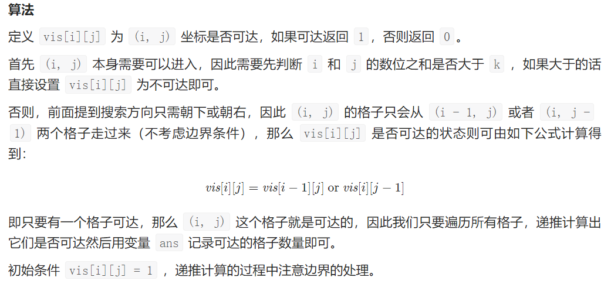

   * 广搜代码（自己写的）：

     ``` c++
     class Solution {
     public:
     // BFS
         int summ(int a){
             int ans = 0;
             while(a != 0){
                 ans += (a % 10);
                 a /= 10;
             }
             return ans;
         }
     
         int aans = 0;
     
         void bfs(vector<vector<int>>& maze, int i, int j){
             if(maze[i][j] == 0){
                 maze[i][j] = 1;
                 aans++;
             }
     
             if(i + 1 < maze.size() && maze[i + 1][j] == 0){
                 bfs(maze, i + 1, j);
             }
             // if(i - 1 >= 0 && maze[i - 1][j] == 0){
             //     bfs(maze, i - 1, j);
             // }
             if(j + 1 < maze[0].size() && maze[i][j + 1] == 0){
                 bfs(maze, i, j + 1);
             }
             // if(j - 1 >= 0 && maze[i][j - 1] == 0){
             //     bfs(maze, i, j - 1);
             // }
         }
     
         int movingCount(int m, int n, int k) {
             vector<vector<int>> maze;
             for(int i = 0; i < m; i ++){
                 vector<int> t;
                 for(int j = 0; j < n; j++){
                     int s = summ(i) + summ(j);
                     if(s > k){
                         t.push_back(-1);
                     }
                     else{
                         t.push_back(0);
                     }
                 }
                 maze.push_back(t);
             }
             // for(int i = 0; i < m; i++){
             //     for(int j = 0; j < n; j++){
             //         cout<<maze[i][j]<<" ";
             //     }
             //     cout<<endl;
             // }
             bfs(maze, 0, 0);
             return aans;
         }
     };
     ```

3. 【[每日一题](https://leetcode-cn.com/problems/rotate-function/submissions/)】给定一个长度为 n 的整数数组 nums。假设 arrk 是数组 nums 顺时针旋转 k 个位置后的数组，我们定义 nums 的 旋转函数 F 为：F(k) = 0 * arrk[0] + 1 * arrk[1] + ... + (n - 1) * arrk[n - 1]，返回 F(0), F(1), ..., F(n-1)中的最大值 。

   * 思路：$O(n)$，+ sum - n * arr_k[n - 1]，注意负数，MAX初始值设为 `INT_MIN` 。

## Day 15 搜索与回溯

1. 给你二叉树的根节点 `root` 和一个整数目标和 `targetSum` ，找出所有 从根节点到叶子节点 路径总和等于给定目标和的路径。

   * 思路：深搜，因为没有规定正负，不好进行剪枝

     ``` c++
     class Solution {
     public:
         vector<vector<int>> ret;
         vector<int> path;
     
         void dfs(TreeNode* root, int target) {
             if (root == nullptr) {
                 return;
             }
             path.emplace_back(root->val);
             target -= root->val;
             if (root->left == nullptr && root->right == nullptr && target == 0) {
                 ret.emplace_back(path);
             }
             dfs(root->left, target);
             dfs(root->right, target);
             path.pop_back();
         }
     
         vector<vector<int>> pathSum(TreeNode* root, int target) {
             dfs(root, target);
             return ret;
         }
     };
     ```

2. **输入一棵二叉搜索树，将该二叉搜索树转换成一个排序的循环双向链表。要求不能创建任何新的节点，只能调整树中节点指针的指向。**

   * 思路：**中序遍历，维护一个 Pre 因为中序遍历实际上是从左到右的， Pre 的设置不会影响遍历，然后每次的步骤就是当前节点的 Left 等于 Pre，Pre 的 Right 等于 当前节点，知道遍历结束，将头尾串在一起即可。**

     ``` c++
     class Solution {
     public:
         Node* treeToDoublyList(Node* root) {
             if(root == nullptr) return nullptr;
             dfs(root);
             head->left = pre;
             pre->right = head;
             return head;
         }
     private:
         Node *pre, *head;
         void dfs(Node* cur) {
             if(cur == nullptr) return;
             dfs(cur->left);
             if(pre != nullptr) pre->right = cur;
             else head = cur;
             cur->left = pre;
             pre = cur;
             dfs(cur->right);
         }
     };
     ```

3. 二叉搜索树的第 k 个节点

   * 思路：可以不用创建一个向量，而是动态维护 k，中序遍历（先右后左可以使数组递减）

   ``` ！c++
   class Solution {
       int res, k;
       public int kthLargest(TreeNode root, int k) {
           this.k = k;
           dfs(root);
           return res;
       }
       void dfs(TreeNode root) {
           if(root == null) return;
           dfs(root.right);
           if(k == 0) return;
           if(--k == 0) res = root.val;
           dfs(root.left);
       }
   }
   ```


## Day 16 排序

1. **输入一个非负整数数组，把数组里所有数字拼接起来排成一个数，打印能拼接出的所有数字中最小的一个。**

   * 很简单的一道题，想复杂了，**比较方法就是 a 和 b 拼接后比较大小**，无需拆开考虑。

     ``` c++
     class Solution {
     public:
         string minNumber(vector<int>& nums) {
             vector<string> strs;
             string res;
             for(auto num:nums)
                 strs.push_back(to_string(num));
             sort(strs.begin(),strs.end(),compare);
             for(auto str:strs)
                 res+=str;
             return res;
         }
     private:
         static bool compare(const string &a,const string &b)
         {
             return a+b<b+a;
         }
     };
     ```

   * 【C++】[sort 函数cmp排序规则问题](https://blog.csdn.net/qq_40682833/article/details/119900237)

2. 从若干副扑克牌中随机抽 5 张牌，判断是不是一个顺子，即这5张牌是不是连续的。2～10为数字本身，A为1，J为11，Q为12，K为13，而大、小王为 0 ，可以看成任意数字。A 不能视为 14。

   * 策略：检查重复 + 最大值减最小值小于 5

     ``` c++
     class Solution {
     public:
         bool isStraight(vector<int>& nums) {
             unordered_map<int, int> map;
             int min = 14, max = 0;
             for(int i = 0; i < nums.size(); i++){
                 int num = nums[i];
                 if(num == 0){
                     continue;
                 }
                 max = max > num ? max : num;
                 min = min < num ? min : num;
                 if(map.count(num) != 0){
                     return false;
                 }
                 map[num]++;
             }
             return max - min < 5;
         }
     };
     ```

## Day 17 排序

1. **返回数组最小的 K 个数**

   * 思路：排序$O(n\log n)$、大小为 K 的大根堆$O(k\log n)$、**基于快速排序的快速划分方法**$O(n)$。

     * 根据快速排序原理，如果某次哨兵划分后 基准数正好是第 k+1 小的数字 ，那么此时基准数左边的所有数字便是题目所求的 最小的 k 个数 。根据此思路，考虑在每次哨兵划分后，判断基准数在数组中的索引是否等于 k，若 true 则直接返回此时数组的前 k 个数字即可。

     ``` c++
     class Solution {
     public:
         vector<int> getLeastNumbers(vector<int>& arr, int k) {
             if (k >= arr.size()) return arr;
             return quickSort(arr, k, 0, arr.size() - 1);
         }
     private:
         vector<int> quickSort(vector<int>& arr, int k, int l, int r) {
             int i = l, j = r;
             while (i < j) {
                 while (i < j && arr[j] >= arr[l]) j--;
                 while (i < j && arr[i] <= arr[l]) i++;
                 swap(arr[i], arr[j]);
             }
             swap(arr[i], arr[l]);
             if (i > k) return quickSort(arr, k, l, i - 1);
             if (i < k) return quickSort(arr, k, i + 1, r);
             vector<int> res;
             res.assign(arr.begin(), arr.begin() + k);
             return res;
         }
     };
     ```

2. **【困难】数据流中的中位数**

   * <u>思路：堆 用大顶堆+小顶堆方法，可以看作大顶堆是普通班，小顶堆是实验班。数量上时刻保持 小顶-大顶<=1（两堆相等或者小顶比大顶多一个）。新学生先入普通班（大顶堆），此时可能会失去平衡了，于是取大顶堆的第一个（班里最好的学生）加入实验班（小顶堆），判断若数量过多（不是等于或多一个），取第一个（实验班里最差的学生）到普通班（大顶堆）里。 取中位数的时候，若两堆数量相等，则各取堆顶取平均，若小顶比大顶多一，则多的那一个就是中位数。</u>

     ``` c++
     class MedianFinder {
     public:
         // 小顶堆的元素个数要么等于大顶堆的个数（偶数情况），要么仅比大顶堆的个数多一（奇数情况）
         priority_queue<int, vector<int>, less<int>> maxHeap;    // 保存较大的一半数据
         priority_queue<int, vector<int>, greater<int>> minHeap; // 保存较小的一半数据
     
         /** initialize your data structure here. */
         MedianFinder() {
             
         }
         
         void addNum(int num) {
             // 维持堆数据平衡，保证小顶堆的最大值小于或等于大顶堆的最小值
             if (maxHeap.size() == minHeap.size()) {
                 minHeap.push(num);
                 int top = minHeap.top();
                 minHeap.pop();
                 maxHeap.push(top);
             } else {
                 maxHeap.push(num);
                 int top = maxHeap.top();
                 maxHeap.pop();
                 minHeap.push(top);
             }
         }
         
         double findMedian() {
             if (maxHeap.size() == minHeap.size()) {
                 return (maxHeap.top() + minHeap.top()) * 1.0 / 2;
             } else {
                 return maxHeap.top() * 1.0;
             }
         }
     };
     ```

   * 【C++】 堆 priority_queue 总结：

     * 初始化：

       ``` c++
       priority_queue<int, vector<int>, less<int>> heap1;    // 小顶堆
       priority_queue<int, vector<int>, greater<int>> heap2; // 大顶堆
       ```

     * 操作：`pop(), push(), top()`

## Day 18 搜索与回溯

1. 求树的深度

   * DFS
2. 输入一棵二叉树的根节点，判断该树是不是平衡二叉树。如果某二叉树中任意节点的左右子树的深度相差不超过1，那么它就是一棵平衡二叉树。

   * DFS

## Day 19 搜索与回溯

1. 求 `1+2+...+n` ，要求不能使用乘除法、for、while、if、else、switch、case等关键字及条件判断语句（A?B:C）。

   * 思路1：递归 + && 代替 if

     ```c++
     class Solution {
     public:
         int sumNums(int n) {
             n && (n += sumNums(n-1));
             return n;
         }
     };
     ```

   * 思路2：sizeof

     ```c++
     class Solution {
     public:
         int sumNums(int n) {
             bool arr[n][n+1];
             return sizeof(arr)>>1;
         }
     };
     ```

2. 给定一个二叉搜索树, 找到该树中两个指定节点的最近公共祖先。

   * 思路：**利用有序信息**

     ``` c++
     class Solution {
     public:
         TreeNode* lowestCommonAncestor(TreeNode* root, TreeNode* p, TreeNode* q) {
             TreeNode* ancestor = root;
             while (true) {
                 if (p->val < ancestor->val && q->val < ancestor->val) {
                     ancestor = ancestor->left;
                 }
                 else if (p->val > ancestor->val && q->val > ancestor->val) {
                     ancestor = ancestor->right;
                 }
                 else {
                     break;
                 }
             }
             return ancestor;
         }
     };
     ```

3. 给定一个二叉树, 找到该树中两个指定节点的最近公共祖先。
   
     * 思路：DFS
     
       ``` c++
       class Solution {
       public:
           TreeNode* ans = nullptr;
           bool dfs(TreeNode* root, TreeNode* p, TreeNode* q){
               if(root == nullptr){
                   return false;
               }
               bool b1 = dfs(root->left, p, q);
               bool b2 = dfs(root->right, p, q);
               if(b1 == true && b2 == true){
                   if(ans == nullptr){
                       ans = root;
                   }
               }
               if(root->val == p->val || root->val == q->val){
                   if(b1 == true || b2 == true){
                       ans = root;
                   }
                   return true;
               }
               return b1 || b2;
           }
           TreeNode* lowestCommonAncestor(TreeNode* root, TreeNode* p, TreeNode* q) {
               dfs(root, p, q);
               return ans;
           }
       };
       ```
     

## Day 20 分治

1. **重建二叉树**：输入某二叉树的前序遍历和中序遍历的结果，请构建该二叉树并返回其根节点。

   * 思路：对于任意一颗树而言，前序遍历的形式总是
     $$
     [ 根节点, [左子树的前序遍历结果], [右子树的前序遍历结果] ]
     $$
     即根节点总是前序遍历中的第一个节点。而中序遍历的形式总是
     $$
     [ [左子树的中序遍历结果], 根节点, [右子树的中序遍历结果]
     $$
     <u>只要我们在中序遍历中定位到根节点，那么我们就可以分别知道左子树和右子树中的节点数目。由于同一颗子树的前序遍历和中序遍历的长度显然是相同的，因此我们就可以对应到前序遍历的结果中，对上述形式中的所有左右括号进行定位。</u>

   * 用哈希表优化：在中序遍历中对根节点进行定位时，一种简单的方法是直接扫描整个中序遍历的结果并找出根节点，但这样做的时间复杂度较高。我们可以考虑使用哈希表来帮助我们快速地定位根节点。对于哈希映射中的每个键值对，键表示一个元素（节点的值），值表示其在中序遍历中的出现位置。在构造二叉树的过程之前，我们可以对中序遍历的列表进行一遍扫描，就可以构造出这个哈希映射。在此后构造二叉树的过程中，我们就只需要 O(1)O(1) 的时间对根节点进行定位了。

     ``` c++
     class Solution {
     public:
         unordered_map<int, int> idx_map;
     
         TreeNode* build(vector<int>& preorder, vector<int>& inorder, int pre_left,
             int pre_right, int in_left, int in_right){
                 if(pre_left > pre_right){
                     return nullptr;
                 }
     
                 int pre_root = pre_left;
                 int root_val = preorder[pre_root];
                 int in_root = idx_map[root_val];
     
                 TreeNode* root = new TreeNode(root_val);
                 int left_size = in_root - in_left;
     
                 root->left = build(preorder, inorder, pre_left + 1, 
                     pre_left + left_size, in_left, in_root - 1);
                 root->right = build(preorder, inorder, pre_left + left_size + 1, 
                     pre_right, in_root + 1, in_right);
                 
                 return root;
         }
     
         TreeNode* buildTree(vector<int>& preorder, vector<int>& inorder) {
             int n = preorder.size();
             // 可以通过节点的值直接找到他在中序遍历数组中对应的索引
             for(int i = 0; i < n; i++){
                 idx_map[inorder[i]] = i;
             }
     
             return build(preorder, inorder, 0, n - 1, 0, n - 1);
         }
     };
     ```


2. 快速幂

   * <u>思路：当计算$x_n$时，可以先递归算出$y=x^{\lfloor n/2\rfloor}$，根据递归计算结果，如果$n$为偶数，那么$x^n = y^2$，如果$n$为奇数，那么$x^n = y^2 \times x$，递归地边界：$n = 0, x^n = 1$</u>

     * 注意包含负数的情况。

     ``` c++
     class Solution {
     public:
         double quickMul(double x, long long N) {
             if (N == 0) {
                 return 1.0;
             }
             double y = quickMul(x, N / 2);
             return N % 2 == 0 ? y * y : y * y * x;
         }
     
         double myPow(double x, int n) {
             long long N = n;
             return N >= 0 ? quickMul(x, N) : 1.0 / quickMul(x, -N);
         }
     };
     ```

3. 输入一个整数数组，判断该数组是不是某二叉搜索树的后序遍历结果。如果是则返回 `true`，否则返回 `false`。假设输入的数组的任意两个数字都互不相同。

   * 思路：和重建二叉树的思路一致。

   * 代码：

     ```c++
     class Solution {
     public:
         bool check(vector<int>& postorder, int left, int right){
             if(left >= right){
                 return true;
             }
             int root = postorder[right];
             int sig = left - 1;
             for(int i = right - 1; i >= left; i--){
                 if(postorder[i] < root){
                     sig = i;
                     break;
                 }
             }
             for(int i = sig; i >= left; i--){
                 if(postorder[i] > root){
                     return false;
                 }
             }
             return check(postorder, left, sig) && check(postorder, sig + 1, right - 1);
         }
         bool verifyPostorder(vector<int>& postorder) {
             if(postorder.size() == 0){
                 return true;
             }
             return check(postorder, 0, postorder.size() - 1);
         }
     };
     ```


## Day 21 位运算

1. 编写一个函数，输入是一个无符号整数，返回其二进制表达式中数字位数为 '1' 的个数

   * 思路：`n & (n−1)`，其预算结果恰为把 n 的二进制位中的**最低位的 1** 变为 0 之后的结果，运算次数就等于 n 的二进制位中 1 的个数。

     ``` c++
     class Solution {
     public:
         int hammingWeight(uint32_t n) {
             int ret = 0;
             while (n) {
                 n &= n - 1;
                 ret++;
             }
             return ret;
         }
     };
     ```

2. **位运算实现加法**：求两个整数之和，要求在函数体内不得使用 “+”、“-”、“*”、“/” 四则运算符号。

   * 思路：使用位运算实现加法，无进位和与异或运算规律相同，进位和与运算规律相同（并需左移一位），以上方法同时适用于正数和负数的加法。

     > C++ 不支持负值左移，需要强制转换为无符号数
     
     ``` c++
     class Solution {
     public:
         int add(int a, int b) {
             while(b != 0) {
                 int c = ((unsigned int)(a & b) << 1);
                 a ^= b;
                 b = c;
             }
             return a;
         }
     };
     ```

     还有递归写法：
     
     ``` c++
     class Solution {
     public:
         int add(int a, int b) {
             if (b == 0) {
                 return a;
             }
             return add(a ^ b,  ((unsigned int)(a & b) << 1));
         }
     };
     ```

## Day 22 位运算

1. **一个整型数组 `nums` 里除两个数字之外，其他数字都出现了两次。请写程序找出这两个只出现一次的数字。**

   * 思路：**分组位运算** 记这两个只出现了一次的数字为 a 和 b，那么所有数字异或的结果就等于 a 和 b 异或的结果，我们记为 x。如果我们把 x 写成二进制的形式，考虑一下 x_i = 0 和 x_i = 1 的含义——它意味着如果我们把 a 和 b 写成二进制的形式，x_i = 1表示 a_i 和 b_i 不等，x_i = 0 表示 a_i 和 b_i 相等。假如我们任选一个不为 0 的 x_i，按照第 i 位给原来的序列分组，如果该位为 0 就分到第一组，否则就分到第二组，这样就能满足以上两个条件。

   * <u>算法：先对所有数字进行一次异或，得到两个出现一次的数字的异或值；在异或结果中找到任意为 1 的位；根据这一位对所有的数字进行分组；在每个组内进行异或操作，得到两个数字。</u>

     ``` c++
     class Solution {
     public:
         vector<int> singleNumbers(vector<int>& nums) {
             int ret = 0;
             for (int n : nums)
                 ret ^= n;
             int div = 1;
             while ((div & ret) == 0)
                 div <<= 1;
             int a = 0, b = 0;
             for (int n : nums)
                 if (div & n)
                     a ^= n;
                 else
                     b ^= n;
             return vector<int>{a, b};
         }
     };
     ```

2. 在一个数组 `nums` 中除一个数字只出现一次之外，其他数字都出现了三次。请找出那个只出现一次的数字。

   * <u>思路：对于出现三次的数字，各 二进制位 出现的次数都是 3 的倍数。因此，统计所有数字的各二进制位中 1 的出现次数，并对 3 求余，结果则为只出现一次的数字。</u>

   * 算法一：有限状态自动机

   * 算法二：位出现次数统计

     ``` c++
     class Solution {
     public:
         int singleNumber(vector<int>& nums) {
             vector<int> counts(32, 0);
             for(auto & num : nums){
                 for(int i = 0; i < 32; i++){
                     counts[i] += num & 1;
                     num >>= 1;
                 }
             }
             int ans = 0;
             int m = 3;
             for(int i = 31; i >= 0; i--){
                 ans <<= 1;
                 ans |= counts[i] % m;
             }
             return ans;
         }
     };
     ```


## Day 23 数学

1. 数组中有一个数字出现的次数超过数组长度的一半，请找出这个数字。

   * 思路：**摩尔投票法**，核心理念为票数正负抵消，此方法时间和空间复杂度分别为 O(N) 和 O(1)。

     * 推论一： 若记占一半以上的数的票数为+1，非占一半以上的数的票数为-1，则一定有所有数字的票数和>0。
     * 推论二： 若数组的前a个数字的票数和=0，则数组剩余(n-a)个数字的票数和一定仍>0，即后(n-a)个数字的占一半以上的数仍为x。

     记数组首个元素为 n_1，占一半以上的数为 x ，遍历并统计票数。当发生票数和 =0 时，剩余数组的占一半以上的数一定不变，这是由于：当 $n_1 = x$ 抵消的所有数字中，有一半是占一半以上的数 x 。当 $n_1 \neq x$ 抵消的所有数字中，占一半以上的数 x 的数量最少为 0 个，最多为一半。利用此特性，每轮假设发生票数和为零时都可以缩小剩余数组区间 。当遍历完成时，最后一轮假设的数字即为占一半以上的数。

     **假设有一个擂台，有一组人，每个人有编号，相同编号为一组，依次上场，没人时上去的便是擂主（x），若有人，编号相同则继续站着（人数+1），若不同，假设每个人战斗力相同，都同归于尽，则人数-1；那么到最后站着的肯定是人数占绝对优势的那一组啦**

     ``` c++
     class Solution {
     public:
         int majorityElement(vector<int>& nums) {
             int x = 0, votes = 0;
             for(int num : nums){
                 if(votes == 0) x = num;
                 votes += num == x ? 1 : -1;
             }
             return x;
         }
     };
     ```

2. 构建乘积数组：给定一个数组 A[0,1,…,n-1]，请构建一个数组 B[0,1,…,n-1]，其中 B[i] 的值是数组 A 中除了下标 i 以外的元素的积, 即 B[i]=A[0]×A[1]×…×A[i-1]×A[i+1]×…×A[n-1]。不能使用除法。

   * 思路：画图，一个上三角和一个下三角。时间复杂度O(n)，空间复杂度O(1)

     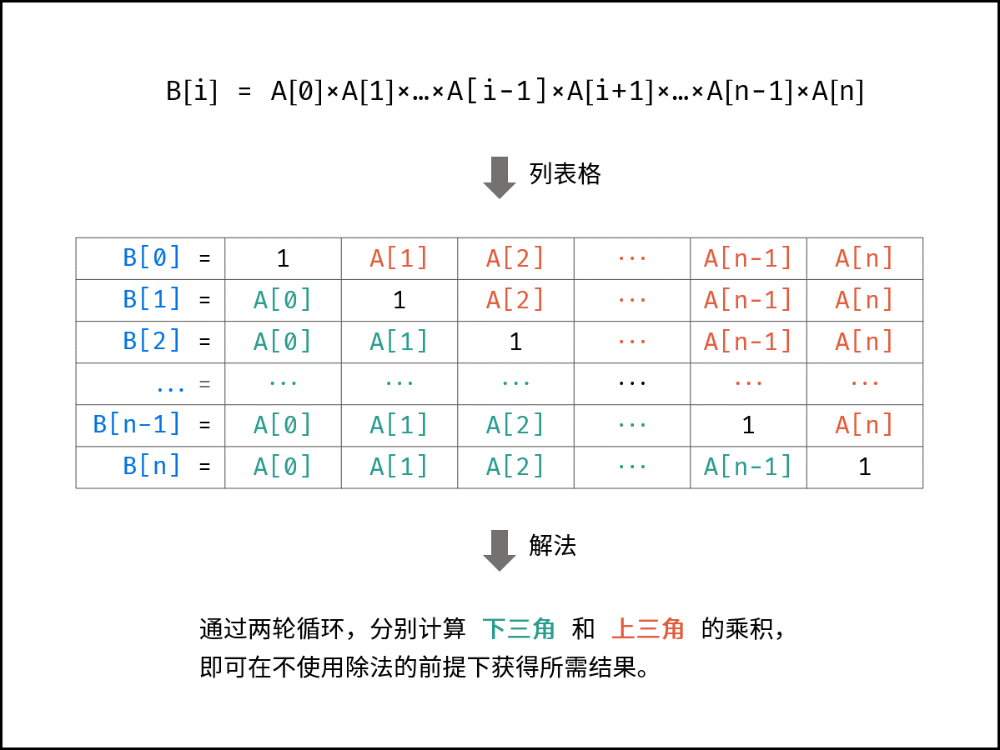

     ``` c++
     class Solution {
     public:
         vector<int> constructArr(vector<int>& a) {
             int n = a.size();
             if(n == 0){
                 vector<int> e;
                 return e;
             }
             vector<int> ans(n, 1);
             int t = 1;
             for(int i = 1; i < n; i++){
                 t *= a[i - 1];
                 ans[i] *= t;
             }
             t = 1;
             for(int i = n - 2; i >= 0 ; i--){
                 t *= a[i + 1];
                 ans[i] *= t;
             }
             return ans;
         }
     };
     ```


## Day 24 数学

1. 给你一根长度为 n 的绳子，请把绳子剪成整数长度的 m 段（m、n都是整数，n>1并且m>1），每段绳子的长度记为 $k[0],k[1]...k[m-1]$ 。请问 $k[0]*k[1]*...*k[m-1]$ 可能的最大乘积是多少？

   * 思路：我的笨方法

     ``` c++
     class Solution {
     public:
         int cuttingRope(int n) {
             int max = 0;
             for(int i = 2; i <= n; i++){
                 int m = i; // 几个数
                 int a = n / m; // 最小树为 a
                 int b = n % m; // 最大数为 a + b
                 int t = pow(a, m - b) * pow(a + 1, b); // m - b 个 a 和 b 个 a + 1
                 max = max > t ? max : t;
             }
             return max;
         }
     };
     ```

     思路二：贪心：$n = n_1+n_2+...+n_a$，求$max(n_1\times n_2 \times ... \times n_a)$

     * 由算术几何均值不等式，得到将绳子**以相等的长度等分为多段**，得到的乘积最大。

     * 利用均值不等式求出乘积最大值 `L(m)=(n/m)^m` 对此式求导（可利用对数法），可以证明当 `m=n/e` 时，乘积取最大，此时每段绳子的长度为 `n/(n/e)=e`，自然对数e的值为2.718，显然接近3，所以总体来讲3最好，得到尽可能将绳子以长度 33 等分为多段时，乘积最大。

     * 切分规则：

       * 最优： 3 。把绳子尽可能切为多个长度为 3 的片段，留下的最后一段绳子的长度可能为 0,1,2三种情况。
       * 次优： 2 。若最后一段绳子长度为 2 ；则保留，不再拆为 1+1 。
       * 最差： 1 。若最后一段绳子长度为 1 ；则应把一份 3 + 1 替换为 2 + 2，因为 $2 \times 2 > 3 \times 1$。

       ``` c++
       int cuttingRope(int n) {
           return n <= 3? n - 1 : pow(3, n / 3) * 4 / (4 - n % 3);
       }
       ```

   * 思路三：动态规划（时间复杂度：$O(n^2)$）

2. **输入一个正整数 target ，输出所有和为 target 的连续正整数序列（至少含有两个数）。序列内的数字由小到大排列，不同序列按照首个数字从小到大排列。**

   * 思路一：枚举 + 求根公式判断是否有解

   * 思路二：双指针约束范围 + 求和公式

     * 三种情况：$sum < target$ 右边的指针右移；$sum > target$ 左边的指针右移；$sum = target$ 将答案放进数组，左指针右移。

     ``` c++
     class Solution {
     public:
         vector<vector<int>> findContinuousSequence(int target) {
             vector<vector<int>>vec;
             vector<int> res;
             for (int l = 1, r = 2; l < r;){
                 int sum = (l + r) * (r - l + 1) / 2;
                 if (sum == target) {
                     res.clear();
                     for (int i = l; i <= r; ++i) {
                         res.emplace_back(i);
                     }
                     vec.emplace_back(res);
                     l++;
                 } else if (sum < target) {
                     r++;
                 } else {
                     l++;
                 }
             }
             return vec;
         }
     };
     ```

3. **约瑟夫环** $0,1,···,n-1$这 n 个数字排成一个圆圈，从数字 0 开始，每次从这个圆圈里删除第 m 个数字（删除后从下一个数字开始计数）。求出这个圆圈里剩下的最后一个数字。

   * 反推，下图显示 m = 3 的情况

     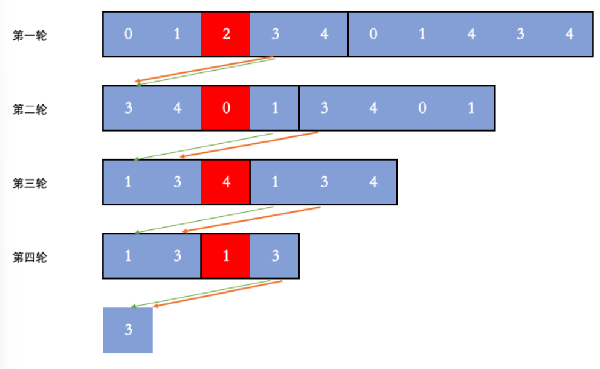

     ``` c++
     class Solution {
     public:
         int lastRemaining(int n, int m) {
             int ans = 0;
             for (int i = 2; i <= n; i++) {
                 ans = (ans + m) % i;
             }
             return ans;
         }
     };
     ```


## Day 25 模拟

1. **输入一个矩阵，按照从外向里以顺时针的顺序依次打印出每一个数字。**

   我的：

   ``` c++
   class Solution {
   public:
       vector<int> spiralOrder(vector<vector<int>>& matrix) {
           vector<int> ans;
           if(matrix.size() == 0 || matrix[0].size() == 0){
               return ans;
           }
           int n = matrix.size();
           int m = matrix[0].size();
   
           for(int c = 0; ; c++){
               int i, j;
               i = c;
               for(j = c; j < m - c; j++){
                   if(i >= 0 && i < n && j >= 0 && j < m)
                       ans.push_back(matrix[i][j]);
               }
   
               j = m - c - 1;
               for(i = c + 1; i < n - c - 1; i++){
                   if(i >= 0 && i < n && j >= 0 && j < m)
                       ans.push_back(matrix[i][j]);
               }
   
               i = n - c - 1;
               if(i != c){
                   for(j = m - c - 1; j >= c; j--){
                       if(i >= 0 && i < n && j >= 0 && j < m)
                           ans.push_back(matrix[i][j]);
                   }
               }
   
               j = c;
               if(j != m - c - 1){
                   for(i = n - c - 2; i >= c + 1; i--){
                       if(i >= 0 && i < n && j >= 0 && j < m)
                           ans.push_back(matrix[i][j]);
                   }
               }
               
               if(ans.size() == m * n){
                   break;
               }
           }
           return ans;
   
       }
   };
   ```

   比较直观的算法思路：<u>判断路径是否进入之前访问过的位置需要使用一个与输入矩阵大小相同的辅助矩阵 visited，其中的每个元素表示该位置是否被访问过。当一个元素被访问时，将 visited 中的对应位置的元素设为已访问。</u>

   ``` c++
   class Solution {
   private:
       static constexpr int directions[4][2] = {{0, 1}, {1, 0}, {0, -1}, {-1, 0}};
   public:
       vector<int> spiralOrder(vector<vector<int>>& matrix) {
           if (matrix.size() == 0 || matrix[0].size() == 0) {
               return {};
           }
           
           int rows = matrix.size(), columns = matrix[0].size();
           vector<vector<bool>> visited(rows, vector<bool>(columns));
           int total = rows * columns;
           vector<int> order(total);
   
           int row = 0, column = 0;
           int directionIndex = 0;
           for (int i = 0; i < total; i++) {
               order[i] = matrix[row][column];
               visited[row][column] = true;
               int nextRow = row + directions[directionIndex][0], nextColumn = column + directions[directionIndex][1];
               if (nextRow < 0 || nextRow >= rows || nextColumn < 0 || nextColumn >= columns || visited[nextRow][nextColumn]) {
                   directionIndex = (directionIndex + 1) % 4;
               }
               row += directions[directionIndex][0];
               column += directions[directionIndex][1];
           }
           return order;
       }
   };
   ```

2. **栈的压入、弹出序列**：输入两个整数序列，第一个序列表示栈的压入顺序，请判断第二个序列是否为该栈的弹出顺序。假设压入栈的所有数字均不相等。

   例子：

   ```
   输入：pushed = [1,2,3,4,5], popped = [4,5,3,2,1]
   输出：true
   解释：我们可以按以下顺序执行：
   push(1), push(2), push(3), push(4), pop() -> 4,
   push(5), pop() -> 5, pop() -> 3, pop() -> 2, pop() -> 1
   ```

   自己写的：就硬模拟

   ``` c++
   class Solution {
   public:
       bool validateStackSequences(vector<int>& pushed, vector<int>& popped) {
           if(pushed.size() != popped.size()){
               return false;
           }
           stack<int> s;
           int n = pushed.size();
           int i_push = 0;
           int i_pop = 0;
           while(i_push != n){
               s.push(pushed[i_push]);
               i_push++;
               while(!s.empty() && s.top() == popped[i_pop]){
                   s.pop();
                   i_pop++;                
               }
           }
           return s.empty();
       }
   };
   ```

## Day 26 字符串

1. 请实现一个函数用来判断字符串是否表示数值（包括整数和小数）

   * 思路：一遍一遍试，特殊情况有：+.5(true) 3.(true) e9(false)

   ``` c++
   class Solution {
   public:
       bool isDigit(char c){
           return c >= '0' && c <= '9';
       } 
       bool isLegal(char c){
           return isDigit(c) || c == '.' || c == '+' || c == '-' || c == 'E' || c =='e' || c  == ' ';
       }
       bool isNumber(string s) {
           if(s.size() == 0){
               return false;
           }
   
           // cout<<"判断是否有非法字符"<<endl;
           int n = s.size();
           for(int k = 0; k < n; k++){
               if(!isLegal(s[k])){
                   return false;
               }
           }
           // cout<<"去除前后的空格"<<endl;
           int i = 0;
           int j = n - 1;
           while(i < n && s[i] == ' '){
               i++;
           }
           while(j >= 0 && s[j] == ' '){
               j--;
           }
           j += 1;
   
           bool digit_exist = false;
           // cout<<"底数部分正负号"<<endl;
           if(i < j - 1 && (s[i] == '+' || s[i] == '-')){
               if(isDigit(s[i + 1]) || s[i + 1] == '.'){
                   i++;
               }
               else{
                   return false;
               }
           }
           while(i < j && isDigit(s[i])){
               digit_exist = true;
               i++;
           }
           // cout<<"底数部分小数点"<<endl;
           if(s[i] == '.'){
               if((i < j - 1 && isDigit(s[i + 1])) || (i >= 1 && isDigit(s[i - 1]))){
                   i++;
               }
               else{
                   return false;
               }
           }
           while(i < j && isDigit(s[i])){
               digit_exist = true;
               i++;
           }
           bool e_exist = false;
           // cout<<"指数符号"<<endl;
           if(i < j - 1 && digit_exist && (s[i] == 'e' || s[i] == 'E')){
               if(isDigit(s[i + 1]) || s[i + 1] == '+' || s[i + 1] == '-'){
                   i++;
                   e_exist = true;
               }
               else{
                   return false;
               }
           }
   
           // cout<<"指数部分正负号"<<endl;
           if(i < j - 1 && e_exist && (s[i] == '+' || s[i] == '-')){
               if(isDigit(s[i + 1])){
                   i++;
               }
               else{
                   return false;
               }
           }
           while(i < j && isDigit(s[i])){
               i++;
           }
           // cout<<"最后判断："<< i << " = " << j << endl;
           return i == j; 
       }
   };
   ```

2. 写一个函数 StrToInt，实现把字符串转换成整数这个功能。

   * 注意事项：注意整形的上下限（INT_MAX, INT_MIN），注意特殊非法输入如：+-1

     ``` c++
     class Solution {
     public:
         bool isDigit(char c){
             return c >= '0' && c <= '9';
         } 
         int strToInt(string str) {
             int i = 0;
             int j = 0;
             int n = str.size();
             bool neg = false;
     
             long long ans = 0;
             while(i < n && str[i] == ' '){
                 i++;
             }
             if(i == n){
                 return 0;
             }
     
             if(i < n && !(isDigit(str[i]) || str[i] == '+' || str[i] == '-')){
                 return 0;
             }
     
             j = i;
             bool pn = false;
             while(j < n){
                 if(i == j && (str[j] == '+' || str[j] == '-')){
                     if(str[j] == '-'){
                         neg = true;
                     }
                     pn = true;
                     j++;
                     
                 }
                 else if(isDigit(str[j])){
                     j++;
                 }
                 else{
                     break;
                 }
             }
             if(pn){
                 i++;
             }
             // cout<<"数字的位置："<<i<<" 到 "<<j<<endl;
             
             long long max = INT_MAX;
             max += 1;
             while(i < j){
                 if(ans > max){
                     ans = max;
                     break;
                 }
                 ans *= 10;
                 ans += (str[i] - '0');
                 i++;
             }
             if(neg){
                 ans *= -1;
             }
     
             if(ans < INT_MIN){
                 ans = INT_MIN;
             }
             else if(ans > INT_MAX){
                 ans = INT_MAX;
             }
             return ans;
         }
     };
     ```

## Day 27 栈与队列

1. **滑动窗口的最大值：给定一个数组 `nums` 和滑动窗口的大小 `k`，请找出所有滑动窗口里的最大值。**

   * 自己的思路：优先队列，复杂度$O(n\log(n))$

     ``` c++
     class Solution {
     public:
         vector<int> maxSlidingWindow(vector<int>& nums, int k) {
             vector<int> ans;
             priority_queue<pair<int, int>,vector<pair<int, int>>, less<pair<int, int>>> pq; // 大顶堆
     
             for(int i = 0; i < nums.size(); i++){
                 pq.push(make_pair(nums[i], i));
                 while(!pq.empty() && i - pq.top().second >= k){
                     pq.pop();
                 }
                 if(i >= k - 1){
                     ans.push_back(pq.top().first);
                 }     
             }
     
             return ans;
     
         }
     };
     ```

   * **思路 2：单调队列（双端队列实现），复杂度$O(n)$**

     队列存储数组的索引，<u>从队首到队尾，索引是单调递增的，所引对应的值是单调递减的。维护队列保存的索引都在窗口内，队首即使每次的最大值。</u>

     维护的手段是循环判断队尾的索引对应的元素是否小于待插入的元素，如果是删除队尾元素，否则跳出循环；执行完毕后在队尾插入新元素索引。每次取窗口最大值时，循环判断队首索引是否在窗口内，不在则需要删除队首元素，是则跳出循环；此时队首元素为窗口最大值。

     ``` c++
     class Solution {
     public:
         vector<int> maxSlidingWindow(vector<int>& nums, int k) {
             int n = nums.size();
             deque<int> q; // 双端队列
             for (int i = 0; i < k; ++i) {
                 while (!q.empty() && nums[i] >= nums[q.back()]) {
                     q.pop_back();
                 }
                 q.push_back(i);
             }
     
             vector<int> ans = {nums[q.front()]};
             for (int i = k; i < n; ++i) {
                 while (!q.empty() && nums[i] >= nums[q.back()]) {
                     q.pop_back();
                 }
                 q.push_back(i);
                 while (q.front() <= i - k) {
                     q.pop_front();
                 }
                 ans.push_back(nums[q.front()]);
             }
             return ans;
         }
     };
     ```

2. **请定义一个队列并实现函数 max_value 得到队列里的最大值，要求函数max_value、push_back 和 pop_front 的均摊时间复杂度都是O(1)。**

   * 思路：维护一个普通队列和一个双端队列

     ``` c++
     class MaxQueue {
         queue<int> q;
         deque<int> d;
     public:
         MaxQueue() {
         }
         
         int max_value() {
             if (d.empty())
                 return -1;
             return d.front();
         }
         
         void push_back(int value) {
             while (!d.empty() && d.back() < value) {
                 d.pop_back();
             }
             d.push_back(value);
             q.push(value);
         }
         
         int pop_front() {
             if (q.empty())
                 return -1;
             int ans = q.front();
             if (ans == d.front()) {
                 d.pop_front();
             }
             q.pop();
             return ans;
         }
     };
     ```

## Day 28 搜索与回溯

1. 请实现两个函数，分别用来序列化和反序列化二叉树。

   ``` c++
   class Codec {
   public:
       void ser(TreeNode* root, string& str) {
           if (root == nullptr) {
               str += "null,";
           } else {
               str += to_string(root->val) + ",";
               ser(root->left, str);
               ser(root->right, str);
           }
       }
   
       string serialize(TreeNode* root) {
           string ret;
           ser(root, ret);
           return ret;
       }
   
       TreeNode* des(list<string>& dataArray) {
           if (dataArray.front() == "null") {
               dataArray.erase(dataArray.begin());
               return nullptr;
           }
           TreeNode* root = new TreeNode(stoi(dataArray.front()));
           dataArray.erase(dataArray.begin());
           root->left = des(dataArray);
           root->right = des(dataArray);
           return root;
       }
   
       TreeNode* deserialize(string data) {
           list<string> dataArray;
           string str;
           for (auto& ch : data) {
               if (ch == ',') {
                   dataArray.push_back(str);
                   str.clear();
               } else {
                   str += ch;
               }
           }
           if (!str.empty()) {
               dataArray.push_back(str);
           }
           return des(dataArray);
       }
   };
   ```

   * 另一种思路：编译原理 $T \to (T) num (T) | X$，$X$表示当前子树为空。

     ``` c++
     class Codec {
     public:
         string serialize(TreeNode* root) {
             if (!root) {
                 return "X";
             }
             auto left = "(" + serialize(root->left) + ")";
             auto right = "(" + serialize(root->right) + ")";
             return left + to_string(root->val) + right;
         }
     
         inline TreeNode* parseSubtree(const string &data, int &ptr) {
             ++ptr; // 跳过左括号
             auto subtree = parse(data, ptr);
             ++ptr; // 跳过右括号
             return subtree;
         }
     
         inline int parseInt(const string &data, int &ptr) {
             int x = 0, sgn = 1;
             if (!isdigit(data[ptr])) {
                 sgn = -1;
                 ++ptr;
             }
             while (isdigit(data[ptr])) {
                 x = x * 10 + data[ptr++] - '0';
             }
             return x * sgn;
         }
     
         TreeNode* parse(const string &data, int &ptr) {
             if (data[ptr] == 'X') {
                 ++ptr;
                 return nullptr;
             }
             auto cur = new TreeNode(0);
             cur->left = parseSubtree(data, ptr);
             cur->val = parseInt(data, ptr);
             cur->right = parseSubtree(data, ptr);
             return cur;
         }
     
         TreeNode* deserialize(string data) {
             int ptr = 0;
             return parse(data, ptr);
         }
     };
     ```

     

2. 输入一个字符串，打印出该字符串中字符的所有排列。

   * 自己的思路：简单粗暴，用哈希去重

     ``` c++
     class Solution {
     public:
         vector<string> ans;
         unordered_map<string, int> map;
         string t = "";
         void dfs(string & s, vector<bool> & visited){
             if(t.size() == s.size()){
                 if(map[t] == 0){
                     ans.push_back(t);
                     map[t]++;
                 }
             }
             for(int i = 0; i < s.size(); i++){
                 if(!visited[i]){
                     t += s[i];
                     visited[i] = true;
                     dfs(s, visited);
                     t.pop_back();
                     visited[i] = false;
                 }
             }    
         }
         vector<string> permutation(string s) {
             int n = s.size();
             vector<bool> visited(n, false);
             dfs(s, visited);
             return ans;
         }
     };
     ```

   * 不用去重的回溯：在递归函数中设定一个规则，保证在填每一个空位的时候重复字符只会被填入一次。具体地，我们首先对原字符串排序，保证相同的字符都相邻，在递归函数中，我们限制每次填入的字符一定是这个字符所在重复字符集合中从左往右第一个未被填入的字符

     ``` c++
     class Solution {
     public:
         vector<string> ans;
         string t = "";
         void dfs(string & s, vector<bool> & visited){
             if(t.size() == s.size()){
                 ans.push_back(t);
             }
             for(int i = 0; i < s.size(); i++){
                 if(!visited[i]){
                     if(i > 0 && !visited[i - 1] && s[i - 1] == s[i]){
                         continue;
                     }
                     t += s[i];
                     visited[i] = true;
                     dfs(s, visited);
                     t.pop_back();
                     visited[i] = false;
                 }
             }    
         }
         vector<string> permutation(string s) {
             int n = s.size();
             sort(s.begin(), s.end());
             vector<bool> visited(n, false);
             dfs(s, visited);
             return ans;
         }
     };
     ```

   * 下一个排列算法：

     ``` c++
     class Solution {
     public:
         bool nextPermutation(string& s) {
             int i = s.size() - 2;
             while (i >= 0 && s[i] >= s[i + 1]) {
                 i--;
             }
             if (i < 0) {
                 return false;
             }
             int j = s.size() - 1;
             while (j >= 0 && s[i] >= s[j]) {
                 j--;
             }
             swap(s[i], s[j]);
             reverse(s.begin() + i + 1, s.end());
             return true;
         }
     
         vector<string> permutation(string s) {
             vector<string> ret;
             sort(s.begin(), s.end());
             do {
                 ret.push_back(s);
             } while (nextPermutation(s));
             return ret;
         }
     };
     ```


## Day 29 动态规划

1. 正则表达式匹配：实现一个函数用来匹配包含'. '和'\*'的正则表达式。模式中的字符'.'表示任意一个字符，而'\*'表示它前面的字符可以出现任意次（含0次）。在本题中，匹配是指字符串的所有字符匹配整个模式。

   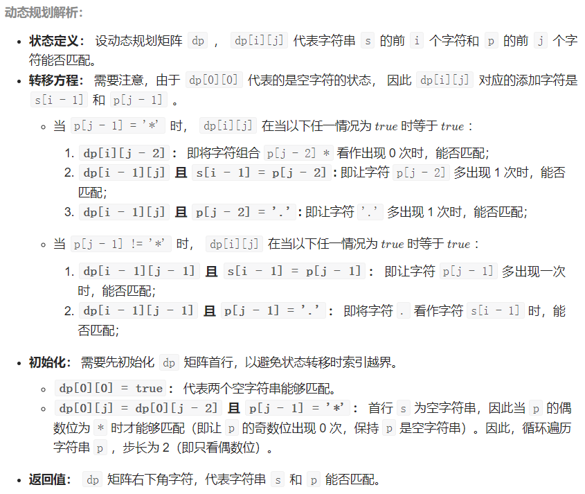

   ``` c++
   class Solution {
   public:
       bool isMatch(string s, string p) {
           int m = s.size() + 1, n = p.size() + 1;
           vector<vector<bool>> dp(m, vector<bool>(n, false));
           dp[0][0] = true;
           for(int j = 2; j < n; j += 2)
               dp[0][j] = dp[0][j - 2] && p[j - 1] == '*';
           
           for(int i = 1; i < m; i++) {
               for(int j = 1; j < n; j++) {
                   if(p[j - 1] == '*') {
                       if(dp[i][j - 2])
                           dp[i][j] = true;
                       else if(dp[i - 1][j] && (p[j - 2] == s[i - 1] || p[j - 2] == '.')) 
                           dp[i][j] = true;
                   } else {
                       if(dp[i - 1][j - 1] && (p[j - 1] == s[i - 1] || p[j - 1] == '.')) 
                           dp[i][j] = true;
                   }
               }
           }
           return dp[m - 1][n - 1];
       }
   };
   ```

2. 我们把只包含质因子 2、3 和 5 的数称作丑数（Ugly Number）。求按从小到大的顺序的第 n 个丑数。

   * 方法一：<u>小顶堆 - 由于 2x, 3x, 5x 也是丑数，因此将 2x, 3x, 5x加入堆。上述做法会导致堆中出现重复元素的情况。为了避免重复元素，可以使用哈希集合去重，避免相同元素多次加入堆。</u>

   * 方法二：<u>三指针</u>

     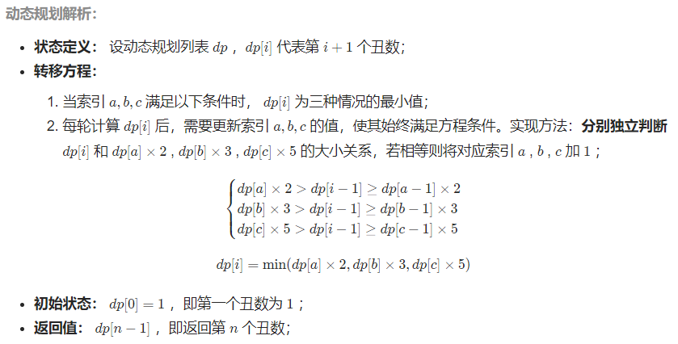

     ``` c++
     class Solution {
     public:
         int nthUglyNumber(int n) {
             vector<int> dp(n + 1);
             dp[1] = 1;
             int p2 = 1, p3 = 1, p5 = 1;
             for (int i = 2; i <= n; i++) {
                 int num2 = dp[p2] * 2, num3 = dp[p3] * 3, num5 = dp[p5] * 5;
                 dp[i] = min(min(num2, num3), num5);
                 if (dp[i] == num2) {
                     p2++;
                 }
                 if (dp[i] == num3) {
                     p3++;
                 }
                 if (dp[i] == num5) {
                     p5++;
                 }
             }
             return dp[n];
         }
     };
     ```


3. 把n个骰子扔在地上，所有骰子朝上一面的点数之和为s。输入n，打印出s的所有可能的值出现的概率。

   * 思路：动态规划，设输入 n 个骰子的解（即概率列表）为 f(n)，其中「点数和」 x 的概率为 f(n, x) 。

     递推公式如下：
     $$
     f(n,x) = \sum_{i=1}^{6}f(n-1, x-i) \times \frac16
     $$
     递推公式是逆向的，为了方便计算，实现时采用正向的递推，即遍历$f(n-1)$，统计每项$f(n-1,i)$对$f(n,i+1),...,f(n,i+6)$的贡献
     
     ``` c++
     class Solution {
     public:
         vector<double> dicesProbability(int n) {
             vector<double> dp(6, 1.0 / 6.0);
             for (int i = 2; i <= n; i++) {
                 vector<double> tmp(5 * i + 1, 0);
                 for (int j = 0; j < dp.size(); j++) {
                     for (int k = 0; k < 6; k++) {
                         tmp[j + k] += dp[j] / 6.0;
                     }
                 }
                 dp = tmp;
             }
             return dp;
         }
     };
     ```
     

## Day 30 分治算法

1. 输入数字 `n`，按顺序打印出从 1 到最大的 n 位十进制数。比如输入 3，则打印出 1、2、3 一直到最大的 3 位数 999。

   * 实际上，本题的主要考点是大数越界情况下的打印。需要解决以下三个问题：

     * 无论是 short / int / long ... 任意变量类型，数字的取值范围都是有限的。因此，大数的表示应用字符串 String 类型。

     * String 类型的数字的进位操作效率较低，例如 `"9999"` 至 `"10000"` 需要从个位到千位循环判断，进位 4 次。观察可知，生成的列表实际上是 n 位 0 - 9 的 **全排列** ，因此可避开进位操作，通过递归生成数字的 String 列表。

     * 基于分治算法的思想，先固定高位，向低位递归，当个位已被固定时，添加数字的字符串。例如当 n = 2 时（数字范围 1 - 99 ），固定十位为 0 - 9 ，按顺序依次开启递归，固定个位 0 - 9 ，终止递归并添加数字字符串。

     * 观察可知，当前的生成方法仍有以下问题：诸如 00,01,02,⋯ 应显示为 0,1,2,⋯ ，即应 删除高位多余的 0 ；此方法从 0 开始生成，而题目要求 列表从 1 开始 ；

       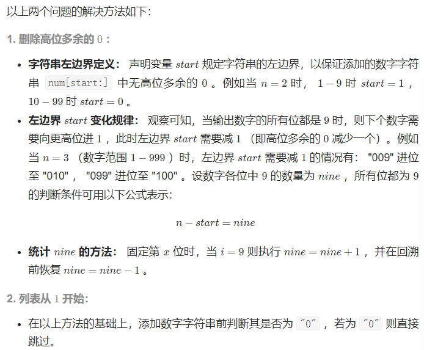

     ``` java
     class Solution {
         StringBuilder res;
         int nine = 0, count = 0, start, n;
         char[] num, loop = {'0', '1', '2', '3', '4', '5', '6', '7', '8', '9'};
         public String printNumbers(int n) {
             this.n = n;
             res = new StringBuilder();
             num = new char[n];
             start = n - 1;
             dfs(0);
             res.deleteCharAt(res.length() - 1);
             return res.toString();
         }
         void dfs(int x) {
             if(x == n) {
                 String s = String.valueOf(num).substring(start);
                 if(!s.equals("0")) res.append(s + ",");
                 if(n - start == nine) start--;
                 return;
             }
             for(char i : loop) {
                 if(i == '9') nine++;
                 num[x] = i;
                 dfs(x + 1);
             }
             nine--;
         }
     }
     ```

   2. 在数组中的两个数字，如果前面一个数字大于后面的数字，则这两个数字组成一个逆序对。输入一个数组，求出这个数组中的逆序对的总数。

      * **归并排序：合并阶段本质上是合并两个排序数组的过程，而<u>每当遇到左子数组当前元素 > 右子数组当前元素时，意味着左子数组当前元素至末尾元素与右子数组当前元素构成了若干逆序对。</u>**

        ``` c++
        class Solution {
        public:
            int reversePairs(vector<int>& nums) {
                vector<int> tmp(nums.size());
                return mergeSort(0, nums.size() - 1, nums, tmp);
            }
        private:
            int mergeSort(int l, int r, vector<int>& nums, vector<int>& tmp) {
                // 终止条件
                if (l >= r) return 0;
                // 递归划分
                int m = (l + r) / 2;
                int res = mergeSort(l, m, nums, tmp) + mergeSort(m + 1, r, nums, tmp);
                // 合并阶段
                int i = l, j = m + 1;
                for (int k = l; k <= r; k++)
                    tmp[k] = nums[k];
                for (int k = l; k <= r; k++) {
                    if (i == m + 1)
                        nums[k] = tmp[j++];
                    else if (j == r + 1 || tmp[i] <= tmp[j])
                        nums[k] = tmp[i++];
                    else {
                        nums[k] = tmp[j++];
                        res += m - i + 1; // 统计逆序对
                    }
                }
                return res;
            }
        };
        ```


 ## Day 31 数学

1. 给你一根长度为 n 的绳子，请把绳子剪成整数长度的 m 段（m、n都是整数，n>1并且m>1），每段绳子的长度记为 k[0],k[1]...k[m - 1] 。请问 k[0]*k[1]*...*k[m - 1] 可能的最大乘积是多少？例如，当绳子的长度是8时，我们把它剪成长度分别为2、3、3的三段，此时得到的最大乘积是18。

   答案需要取模 1e9+7（1000000007），如计算初始结果为：1000000008，请返回 1。

   以下分别是迭代版本和递归版本：

   ```
   class Solution {
   public:
       int cuttingRope(int n) {
           if(n <= 3){
               return n - 1;
           }
           int p = 1000000007;
           long long rem = 1, x = 3;
           for(int a = n / 3 - 1; a > 0; a /= 2){
               if(a % 2){
                   rem *= x;
                   rem %= p;
               }
               x *= x;
               x %= p;
           }
           if(n % 3 == 0){
               return rem * 3 % p;
           }
           else if(n % 3 == 1){
               return rem * 4 % p;
           }
           else{
               return rem * 6 % p;
           }
       }
   };
   ```

   ```
   class Solution {
   public:
       long long int pow(int x, int n){
           if(n == 0){
               return 1;
           }
           int t = n % 2 ? x : 1; 
           long long int h = pow(x, n / 2) % 1000000007;
           return (h * h * t) % 1000000007;
       }
   
       int cuttingRope(int n) {
           if(n <= 3){
               return n - 1;
           }
           long long int ans = 0;
           if(n % 3 == 0){
               ans = pow(3, n / 3);
           }
           else if(n % 3 == 1){
               ans = pow(3, n / 3 - 1) * 4 % 1000000007;
           }
           else{
               ans = pow(3, n / 3) * 2 % 1000000007;
           }
           return ans;
       }
     
      
      };
   ```

2. 输入一个整数 `n` ，求1～n这n个整数的十进制表示中1出现的次数。

   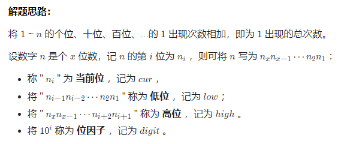

   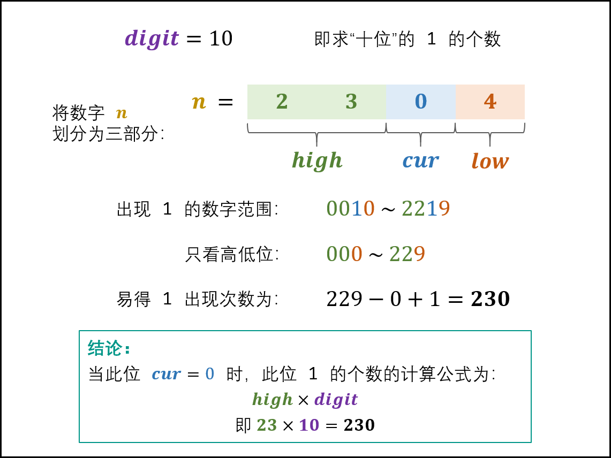

   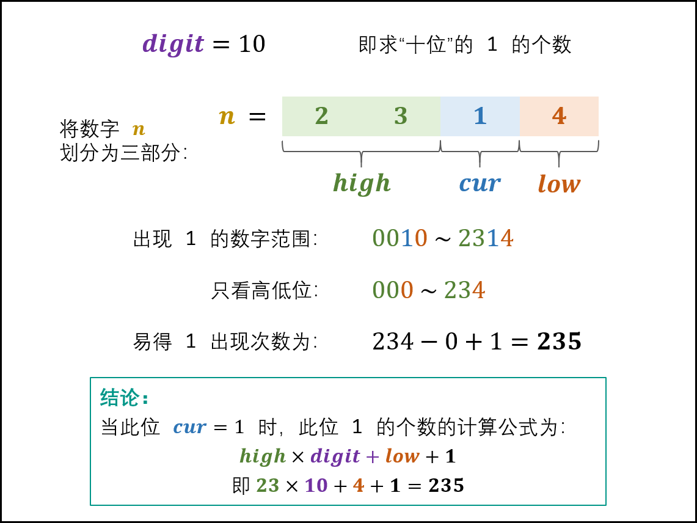

   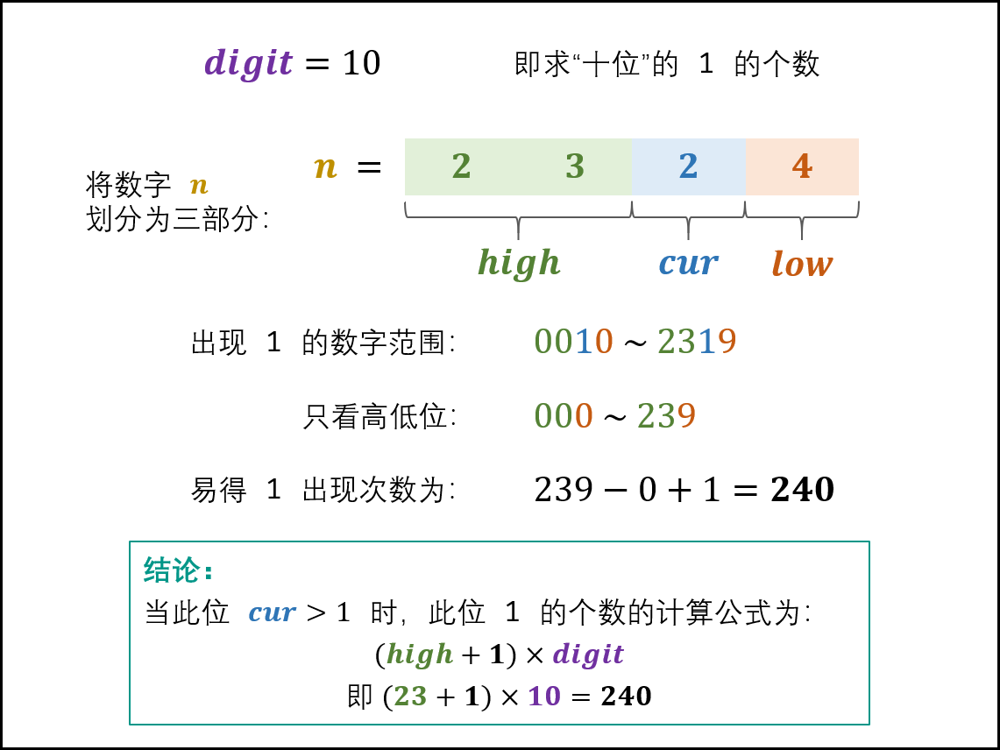

   ``` c++
   class Solution {
       public:
       int countDigitOne(int n) {
           int digit = 1, res = 0;
           int high = n / 10, cur = n % 10, low = 0;
           while(high != 0 || cur != 0) {
               if(cur == 0) res += high * digit;
               else if(cur == 1) res += high * digit + low + 1;
               else res += (high + 1) * digit;
               low += cur * digit;
               cur = high % 10;
               high /= 10;
               digit *= 10;
           }
           return res;
       }
   }
   ```

3. 数字以0123456789101112131415…的格式序列化到一个字符序列中。在这个序列中，第5位（从下标0开始计数）是5，第13位是1，第19位是4，等等。请写一个函数，求任意第n位对应的数字。

   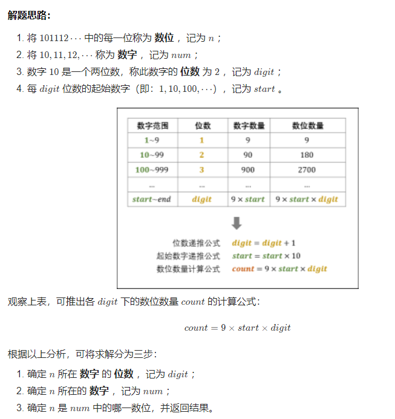

   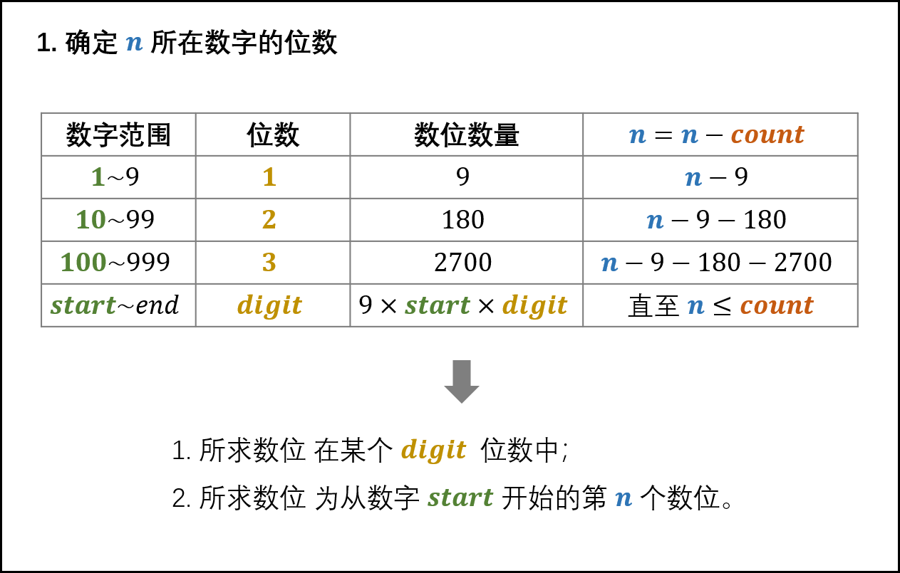

   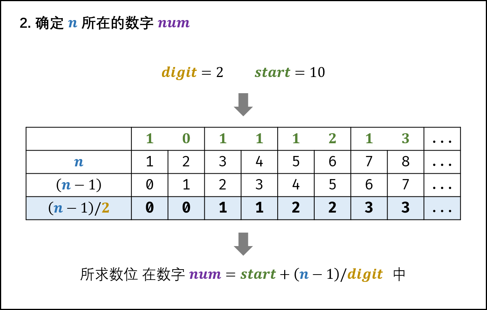

   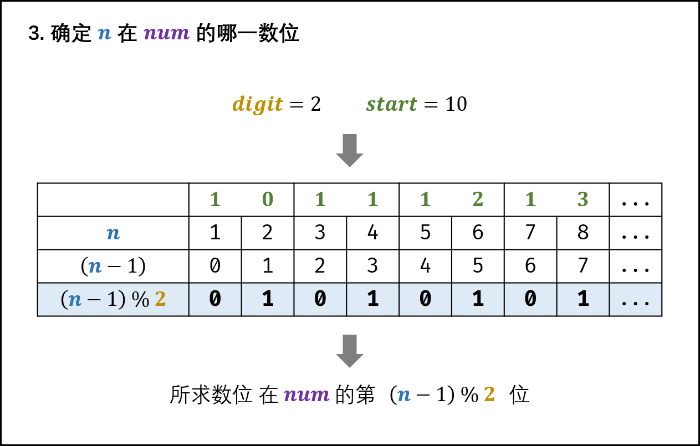

   ``` c++
   class Solution {
   public:
       int findNthDigit(int n) {
           int digit = 1;
           long start = 1;
           long count = 9;
           while (n > count) {.
               n -= count;
               digit += 1;
               start *= 10;
               count = digit * start * 9;
           }
           long num = start + (n - 1) / digit;
           return to_string(num)[(n - 1) % digit] - '0';
       }
   };
   ```

   
