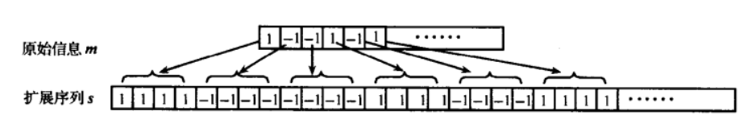
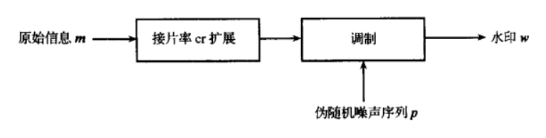
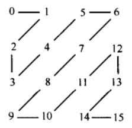
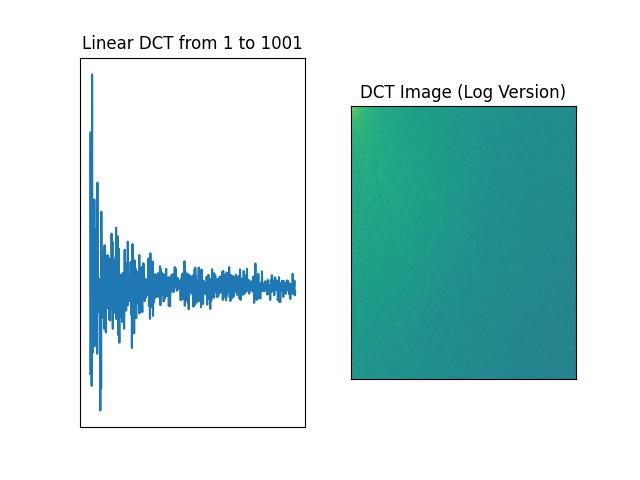
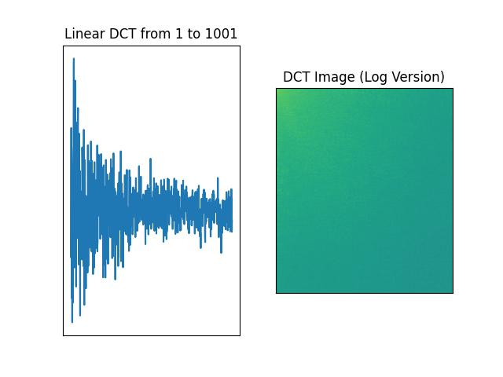
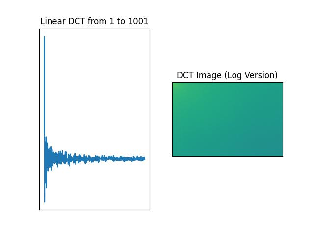
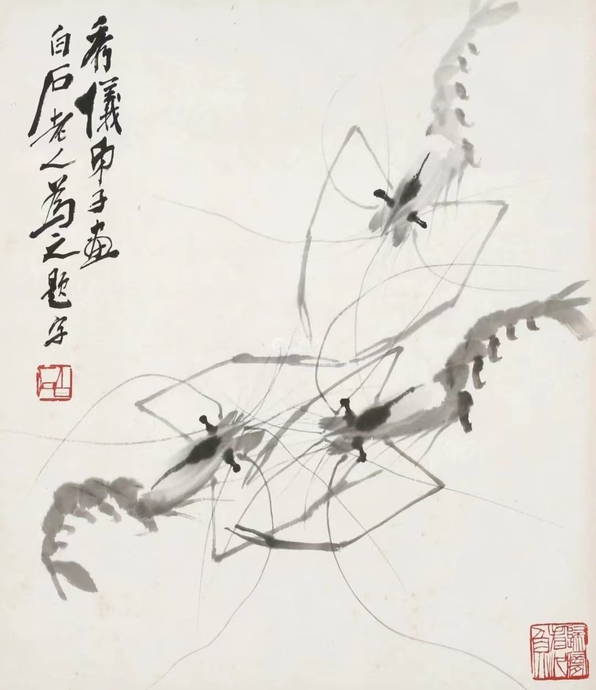

<h1><center>《信息安全技术》课程考察实验报告</center></h1>

| 课程：信息安全技术 | 年级专业：19级软件工程 |
| ------------------ | ---------------------- |
| 姓名：郑有为       | 学号：19335286         |

[toc]

## 第一部分 RSA 加密和解密算法

### 1. 算法原理

#### 1.1 RSA 原理概述


* **RSA算法原理**：采用模函数 $M^k\mod n$ 构造单向函数

  * 加密：明文 $M$ 经过加密运算得到密文$C$：$M^e\mod n = C$，$e$ 为加密密钥。
  * 解密：：$C^d \mod n =(M^e \mod n)^d \mod n=M$，$d$ 为解密秘钥。
  * 即必须存在$e$、$d$、$n$，使$M^{ed} \mod n=M$成立，其中$n$、$e$为公钥，$d$为私钥。确定$n$、$e$、$d$ 基于两大定理：欧拉函数以及费马小定理。
* **RSA密钥生成**：

  * 选两个保密的大素数 $p$、$q$；
  * 计算$n=q\times p$，$\varphi (n)=(p-1) \times (q-1)$，其中 $\varphi(n)$ 是 $n$ 的欧拉函数值；
  * 选一整数 $e$，满足 $1<e<\varphi(n)$ 和 $\gcd (\varphi(n),e) = 1$ 成立；
  * 计算 $d$，满足$ed ≡ 1 \mod \varphi(n)$  ；
    * 即 $d$ 是 $e$ 在模 $\varphi(n)$ 下的乘法逆元，因 $e$ 与 $\varphi(n)$ 互素，由模运算可知，它的乘法逆元一定存在；
    * 可以用辗转相除法求解：$e \times d + \varphi(n) \times y = 1$；
  * 以 $\{e,n\}$ 为公钥，$\{d,n\}$ 为私钥。

#### 1.2 中国剩余定理原理概述

* 中国剩余定理（CRT）：设整数 $m_1, m_2,...,m_n$ 两两互素，对于任意整数 $a_1, a_2, ..., a_n$，方程组：
  $$
  x \equiv a_1 (\mod m_1) \\
  x \equiv a_2 (\mod m_2) \\
  \vdots \\
  x \equiv a_n (\mod m_n) \\
  $$
  都存在整数解，且若 $x_1$，$x_2$ 都满足此方程组，则有 $x_1 \equiv x_2 (\mod \Pi_{i= 1}^nm_i)$

  我们将 $n = 2$ 的情况运用到 RSA 解密中。

* **RSA-CRT 密钥生成**：

  > 参考以下文档和博客：[Using the CRT with RSA](https://www.di-mgt.com.au/crt_rsa.html#PKCS1) 和 [使用中国剩余定理CRT对RSA运算进行加速](https://blog.csdn.net/youngbug/article/details/123409838)，可能与老师提供的论文 Faster RSA Algorithm for Decryption Using Chinese Remainder Theorem 有出入。

  * 选两个保密的大素数 $p$、$q$；
  * 计算 $n = q \times q$
  * 计算 $d_p = e^{-1}\mod (p - 1)$， $d_q = e^{-1}\mod (q - 1)$ 和 $q_{Inv} = q^{-1}\mod p$，其中 $e^{-1}$ 表示求模的逆元。
  * 取五元组 $(p, q, d_p, d_q, q_{Inv})$ 为私钥，二元组 $\{e,n\}$ 为公钥

* **RSA-CRT 解密过程：**

  * 加密过程与 RSA 一致，中国剩余定理主要用在加速解密过程

  * 令密文为 $c$，私钥为 $(p, q, d_p, d_q, q_{Inv})$ ，计算以下式子，最终求出明文 $m$。
    $$
    m_1 = c^{d_p} \mod p \\
    m_2 = c^{d_q} \mod q \\
    h = q_{Inv} \times (m_1 - m_2) \mod pc \\
    m = m_2 + h \times q
    $$

### 2. 代码实现

> RSA 代码实现于 `rsa.py` 文件

#### 2.1 RSA 代码实现

1. 首先实现扩展欧几里得算法： 用于求解 $ax + by = 1$ 中的 $x$ 和 $y$，使用递归的思路实现。

   ```python
   def ext_gcd(a, b):
       if b == 0:
           return a, 1, 0
       else:
           r, x_, y_ = ext_gcd(b, a % b)
           x = y_
           y = x_ - a // b * y_
           return r, x, y
   ```

2. 实现快速幂算法：用于计算 $(base ^{exponent}) \mod n$，使用迭代的思路实现，算法复杂度为 $O(\log(n))$

   ``` python
   def exp_mod(base, exponent, n):
       # 取 exponent 的二进制并倒置
       bin_array = bin(exponent)[2:][::-1]
       r = len(bin_array)
   
       # 快速幂
       base_array = [base]
       for _ in range(r - 1):
           next_base = (base * base) % n
           base_array.append(next_base)
           base = next_base
       res = 1
       for i in range(len(base_array)):
           if int(bin_array[i]):
               res = (res * base_array[i]) % n
       return res % n
   ```

3. 使用一个类来封装 RSA 算法：对象初始化时创建公私钥，可以通过 `get_pub_key` 方法获取公钥，加密明文时可以调用 `encrypt` 方法，解密明文时可以调用 `decrypt` 方法

   ```python
   # RSA
   class RSA:
       def __init__(self, p=None, q=None):
           if p is None:
               p = make_prime(1024)
           if q is None:
               q = make_prime(1024)
   
           # 生成公私钥
           n = p * q
           f = (p - 1) * (q - 1)
           e = 65537
           _, d, _ = ext_gcd(e, f)
           if d < 0:
               d += f
           self._pub_key = (e, n)
           self._pri_key = (d, n)
   
       def get_pub_key(self):
           return self._pub_key
   
       # 加密
       def encrypt(self, plaintext):
           m = str_to_int(plaintext)  # 字符串转整形
           e, n = self._pub_key
           return exp_mod(m, e, n)
   
       # 解密
       def decrypt(self, ciphertext):
           d, n = self._pri_key
           m = exp_mod(ciphertext, d, n)
           return int_to_str(m)  # 整形转字符串
   ```

4. 最后实现了一个通用的加密明文函数，用于模拟其他用户使用他人的公钥加密明文：

   ``` python
   def encrypt_with_pub_key(plaintext, pub_key):
       m = str_to_int(plaintext)
       e, n = pub_key
       return exp_mod(m, e, n)
   ```

#### 2.2 CRT-RSA 代码实现

1. 使用一个类来封装 CRT-RSA，内部的方法与上一步实现的 RSA 类一致。

   ``` python
   class CRT_RSA:
       def __init__(self, p=None, q=None):
           if p is None:
               p = make_prime(1024)
           if q is None:
               q = make_prime(1024)
   
           # 生成公私钥
           n = p * q
           e = 65537
           self._pub_key = (e, n)
   
           _, dP, _ = ext_gcd(e, p - 1)
           _, dQ, _ = ext_gcd(e, q - 1)
           _, qInv, _ = ext_gcd(q, p)
           if dP < 0:
               dP += p - 1
           if dQ < 0:
               dQ += q - 1
           if qInv < 0:
               qInv += p
           self._pri_key = (p, q, dP, dQ, qInv)
   
       def get_pub_key(self):
           return self._pub_key
   
       # 加密
       def encrypt(self, plaintext):
           m = str_to_int(plaintext)  # 字符串转整形
           e, n = self._pub_key
           return exp_mod(m, e, n)
   
       # 解密
       def decrypt(self, ciphertext):
           p, q, dP, dQ, qInv = self._pri_key
           m1 = exp_mod(ciphertext, dP, p)
           m2 = exp_mod(ciphertext, dQ, q)
           h = (qInv * (m1 - m2)) % p
           m = m2 + h * q
           return int_to_str(m)  # 整形转字符串
   ```

### 3. 算法效果对比

* 我们的算法可以处理字符串输入，模拟将消息转化成数字串，再进行加密的过程，并全部封装在了类里，下面以明文：

  `Shinde, G. N., and H. S. Fadewar. 'Faster RSA algorithm for decryption using Chinese remainder theorem'. ICCES: International Conference on Computational & Experimental Engineering and Sciences. Vol. 5. No. 4. 2008.` 为例

  测试 RSA 和 CRT-RSA 的加解密，并比较运行时间。

* 随机选取 1024 位的两个互素大整数 $p$ 和 $q$，生成公私钥，并输出公钥：`65537, 23508174192368769894131484827446673314864471253327778810272713852859805820504829059851248634431578353683060228503338758726756909147458399570844126338952432304985626461103377110018405309283860391573903403693898292038305669780616047612419787001496899469090747047941069842391593209530433844916240177980519590987191925010265075433879906274702490427000307109819084135347332250929004776757824713723191148768261048332827688761464108061863773808024922655329607799731091507289438975682656713377068698522843173496387912076275843891340993349060721244894547797294805795090013118635982601932173121547703332744166687498790956467369`

* 使用公钥加密明文得到密文：

  `15508070060495345229255243090132465633908231871197665992518727446644391006781114163330282803870655330581624384333996813962781747949051196709285590822897006753934251486779694268673320406780050885229295240021108842029438926804116748054525910948475470770191167110521040434776842438132591178925251056502029261495759905954411569134481683897201072095478463000060400620314519985772775436433897071373268203988714393788810062659263645239876325968596398498978404899404063224504258762258856636917724712160756818478787873333280258228783962596631451871725754880450279213633652231553216500216453979956506350230117113700320637881841`

* 将解密结果与明文对比，结果一致。RSA 和 CRT-RSA 解密用时如下所示：

  |      RSA      |    CRT-RSA    |   比率   |
  | :-----------: | :-----------: | :------: |
  | **0.03906 s** | **0.01104 s** | **0.28** |

* 程序输出：附录一

## 第二部分 图像数字水印技术

在图像数字水印技术的两类经典水印嵌入算法中，选择 DCT变换域上的扩频水印嵌入算法进行实现。

### 1. 数字水印算法思路

#### 1.1 数字水印生成

**水印生成技术我们采用扩频水印生成。**我们所设计的算法如下：

* **输入**：数字水印 ID（例如一串数字），目标长度 $M$

* **输出**：扩频水印信号 $w$ 和 伪随机噪声序列 $p$

* **算法步骤**：

  1. 首先，将数字水印 ID 转化为二进制 01 串 $m$，我们设置扩频的目标长度为 $M$
  2. 接下来使用基于片率的扩频技术，将水印串 $m$ 延长到 $M$ 长度，具体的扩频方法采用按位扩展，得到串 $s$ 如下所示：

  

  3. 得到扩频水印串 $s$ 后，为了避免水印信息泄露，我们随机生成一个阔带伪随机信号 $p$，$p$ 的长度同样为 $M$，将 $s$ 与 $p$ 进行异或，得到最终的扩频水印信号 $w$。



在数字水印验证时，我们只需要将提取出的水印信号再与阔带伪随机信号 $p$ 进行异或，就可以获得原始的扩展序列 $s'$，最后与 $s$ 进行比较即可。

#### 1.2 数字水印嵌入

**数字水印嵌入我们设计了基于全局水印嵌入和基于分块水印嵌入两种方法，它们都在 DCT 变换域上进行水印嵌入，并且使用加性嵌入。**我们的水印算法能够用在彩色图像上而不仅仅只是灰度图像。

**全局水印嵌入算法**，算法描述如下：

* 输入：扩频水印信号 $w$、原始彩色图片 $I$  和 嵌入强度 $\alpha$

* 输出：嵌入水印后的图片 $I'$

* 算法步骤：

  1. 取图像 $I$ 的每一个颜色通道 $i$，进行以下操作：

     1. 计算图像通道的 DCT 变换，得到 DCT 矩阵

     2. 将 DCT 矩阵按之字形展开，得到一维向量，之字形展开如下图所示

        

     3. 设扩频信号的长度为 $M$，取之字形展开的 DCT 向量的第 $1$ 个到第 $1+M$ 个分量嵌入水印（第 $0$ 个分量是直流分量故不进行嵌入)，嵌入规则如下所示：
        $$
        X_{i}^{w} = X_{i} + \alpha f(w_i)
        $$
        其中，$X_{i}^w$ 和 $X_i$ 分别表示嵌入前后的 DCT 分量，其中$i \in [1, 1+M]$ ，$\alpha$ 为嵌入强度，$w_i$ 为扩频水印信号第 $i$ 位的值（$w_i \in \{0, 1\}$），$f(x)$ 为一个变换函数：
        $$
        \begin{equation}
        f(x)=
        \left\{
        \begin{aligned}
        1&, \text{ if }x = 1\\
        -1&, \text{ if }x = 0\\
        \end{aligned}
        \right.
        \end{equation}
        $$

     4. 将修改后的 DCT 向量重新聚合为矩阵形式，在进行 DCT 逆变换，得到该通道嵌入水印后的图像

  2. 最后将各通道聚合在一起，得到嵌入水印的彩色图片，并输出。

  

**分块水印嵌入算法**，算法较全局水印嵌入更为复杂，算法描述如下：

* 输入：扩频水印信号 $w$、原始彩色图片 $I$ 和 嵌入强度 $\alpha$

* 输出：嵌入水印后的图片 $I'$

* 算法步骤：

  1. 取图像 $I$ 的每一个颜色通道 $i$，进行以下操作：

     1. 取图片最中心的 1600 个 8x8 的分块作为嵌入水印的区块，即先取图片最中心的 320x320 的区域，然后均匀分成 1600 个正方形，每个正方形将用于嵌入一比特的水印信号。

     2. 遍历每一个分块：

        1. 对分块 $i$ 进行 DCT 变换，并按之字形展开，得到长度为 64 的一维向量

        2. 取 DCT 展开向量的第 11 个分量，嵌入扩频水印信号的第 $i$ 给比特，嵌入规则如下：
           $$
           X_{i,11}^w = X_{i,11} + \alpha f(w_i)
           $$
           其中，$X_{i,11}^w$ 和 $X_{i,11}$ 分别表示嵌入前后第 $i$ 个分块 DCT 的第 $11$ 个分量，其中 $i \in [1, 1+M]$ ，$\alpha$ 为嵌入强度，$w_i$ 为扩频水印信号第 $i$ 位的值（$w_i \in \{0, 1\}$），$f(x)$ 为一个变换函数：
           $$
           \begin{equation}
           f(x)=
           \left\{
           \begin{aligned}
           1&, \text{ if }x = 1\\
           -1&, \text{ if }x = 0\\
           \end{aligned}
           \right.
           \end{equation}
           $$

        3. 将修改后的 DCT 向量重新聚合为矩阵形式，在进行 DCT 逆变换，修改原图像通道的对应分块

        4. 判断是否已经将扩频水印信号的每一个比特嵌入，如果全部嵌入完整，则直接到最后一步

  2. 最后将各通道聚合在一起，得到嵌入水印的彩色图片，并输出。

#### 1.3 数字水印检测与验证

**基于原图的数字水印检测**：

* **全局水印嵌入检测**：对原图和嵌入水印的图片的各个通道分别提取 DCT ，做之字形变换后，取嵌入水印的片段（第$1$到$1+M$个分量），然后做差分，每一个分量通过函数 $g(x)$ 提取扩频水印信号。
  $$
  \begin{equation}
  g(x)=
  \left\{
  \begin{aligned}
  1&, \text{ if }x >= 0\\
  0&, \text{ if }x < 0\\
  \end{aligned}
  \right.
  \end{equation}
  $$
  因为图片有三个彩色通道，最终提取得到的是三条扩频水印信号。

* **分块水印嵌入检测**：对原图和嵌入水印的图片的每一个通道分别提取出中心的 1600 个 8x8 的分块 ，每个分块做 DCT 变换和之字形变换，取每个分块的第 11 个分量，拼接在一起得到一条长为 $M$ 的向量，将嵌入水印的图片提取的向量与原图提取出的向量做差，最后将结果的每一个分量通过函数 $g(x)$ 提取扩频水印信号。

  因为图片有三个彩色通道，最终提取得到的是三条扩频水印信号。

  

**数字水印验证**：验证检测到的扩频水印信号是否与原水印匹配。

* 输入：数字水印 ID，伪随机噪声序列 $p$，三个通道的提取扩频水印信号 $w'$，接受阈值 $t$
* 输出：布尔变量
* 算法步骤：
  1. 将数字水印 ID 转化为 01 串并扩频，得到 $s$
  2. 取每个通道的提取扩频水印信号 $w_i'$
     1. 将 $w_i'$ 与噪声序列 $p$ 进行异或，得到 $s_i'$
     2. 计算 $s_i'$ 与 $s$ 的匹配度 $t_i$
  3. 如果存在一个通道的匹配度 $t_i$ 大于接受阈值 $t$，则认为检测到了数字水印，返回 Ture，否则返回 False。

### 2. 代码实现

#### 2.1 数字水印生成

* **数字水印生成**

  * 输入：数字水印 ID 和目标水印信号长度
  * 返回：扩频水印和噪声序列

  ``` python
  # 数字水印生成，返回扩频水印和噪声序列
  def gen_digwtmk(ID, length):
      m = bin(ID)[2:]
      print("原始信息:", m)
  
      s = ""  # 原始信息扩频
      for i in range(len(m)):
          for _ in range((length // len(m)) + 1):
              s += m[i]
      s = s[:length]
      print(f"按片率 {length // len(m)} 扩展后:", s)
  
      p = ""  # 伪随机噪声序列
      for i in range(length):
          p += str(np.random.randint(0, 2))
      print("伪随机噪声序列:", p)
  
      w = ""  # 扩频水印
      for i in range(length):
          w += str(int(s[i]) ^ int(p[i]))
      print("扩频水印:", w, "\n")
  
      return w, p
  ```

#### 2.2 数字水印嵌入（全局水印嵌入 + 分块水印嵌入）

* **矩阵的之字形展开和折叠函数：**

  ``` python
  # 之字形展开
  def zhi(mat):
      l = []
      n = len(mat)
      m = len(mat[0])
      d = 1
      for i in range(m + n - 1):
          if d == 1:
              for j in range(i + 1):
                  if 0 <= j < m and 0 <= i - j < n:
                      l.append(mat[i - j][j])
          else:
              for j in range(i + 1):
                  if 0 <= j < n and 0 <= i - j < m:
                      l.append(mat[j][i - j])
          d *= -1
      return l
  
  
  # 之字形折叠
  def izhi(li, n, m):
      d = 1
      idx = 0
      mat = [[0 for _ in range(m)] for _ in range(n)]
      for i in range(m + n - 1):
          if d == 1:
              for j in range(i + 1):
                  if 0 <= j < m and 0 <= i - j < n:
                      mat[i - j][j] = li[idx]
                      idx += 1
          else:
              for j in range(i + 1):
                  if 0 <= j < n and 0 <= i - j < m:
                      mat[j][i - j] = li[idx]
                      idx += 1
          d *= -1
      return mat
  
  ```

* **全局水印嵌入（单通道）**：

  * 输入：原图像（单通道），扩频水印信号，水印信号长度，嵌入强度

  * 输出：嵌入水印后的图像

  ``` python
  # 数字水印嵌入，返回嵌入水印的图像
  def emb_digwtmk(img, wtmk, length, alpha=5):
      img = img.astype(np.float)
      dct = cv2.dct(img)
      n, m = len(dct), len(dct[0])
      x = zhi(dct)
      for i in range(length):
          x[i + 1] += alpha * (-1 if wtmk[i] == '0' else 1)
      dct_wtmk = np.array(izhi(x, n, m))
      idct = cv2.idct(dct_wtmk)
      img_wtmk = idct.astype(np.uint8)
      return img_wtmk
  ```

* **分块水印嵌入（单通道）**：

  * 输入：原图像（单通道），扩频水印信号，水印信号长度，嵌入强度
    * 注：要求水印信号长度小于 1600，原图像大于 320x320

  * 输出：嵌入水印后的图像

  ```python
  # 块数字水印嵌入，返回嵌入水印的图像
  def emb_digwtmk_blk(img, wtmk, length, alpha=1):
      img = img.astype(np.float)
      n, m = len(img), len(img[0])
      if n < 320 or m < 320:
          raise Exception("The Image is too small to embed block digital watermark")
      if length > 1600:
          raise Exception("The version is to embed digital watermark which length less than 1600")
  
      ctr = (n // 2, m // 2)
      left_upper = (ctr[0] - 20 * 8, ctr[1] - 20 * 8)
      count = 0
      for i in range(40):
          for j in range(40):
              blk_left_upper = (left_upper[0] + 8 * i, left_upper[1] + 8 * j)
              blk_img = img[blk_left_upper[0]:blk_left_upper[0] + 8, blk_left_upper[1]:blk_left_upper[1] + 8]
              blk_dct = cv2.dct(blk_img)
              blk_zhi = zhi(blk_dct)
              # 取第一个交流分量嵌入
              blk_zhi[11] += alpha * (-1 if wtmk[count] == '0' else 1)
              blk_izhi = np.array(izhi(blk_zhi, 8, 8))
              blk_idct = cv2.idct(blk_izhi)
              blk_wtmk = blk_idct.astype(np.uint8)
              img[blk_left_upper[0]:blk_left_upper[0] + 8, blk_left_upper[1]:blk_left_upper[1] + 8] = blk_wtmk
  
              count += 1
              if count == length:
                  break
          if count == length:
              break
      return img.astype(np.uint8)
  ```

* **彩色图片水印嵌入**

  * 输入：原彩色图像，扩频水印信号，水印信号长度，嵌入强度，水印嵌入方法（"whole" or "block"）
    * 注：要求水印信号长度小于 1600，原图像大于 320x320
  * 输出：嵌入水印后的图像

  ``` python
  # 三通道数字水印检测
  def detect_digwtmk_3chn(img_3chn, img_wtmk_3chn, method="whole"):
      img_3chn = cv2.split(img_3chn)
      img_wtmk_3chn = cv2.split(img_wtmk_3chn)
      w_recovered_3chn = []
      for i in range(3):
          img = img_3chn[i]
          img_wtmk = img_wtmk_3chn[i]
          if method == "whole":
              w_recovered = detect_digwtmk(img, img_wtmk)
          elif method == "block":
              w_recovered = detect_digwtmk_blk(img, img_wtmk)
          else:
              raise Exception("Unknown Method")
          w_recovered_3chn.append(w_recovered)
      return w_recovered_3chn
  ```

#### 2.3 数字水印攻击模拟

* **模糊攻击**

  * 输入：图片，模糊的倍率
  * 输出：遭受攻击后的图片

  ``` python
  # 水印攻击: 将图片缩小为原来的 1/n^2
  def digwtmk_attack_v1(img_dtmk, n=3):
      h, w = img_dtmk.shape[:2]
      img_dtmk = cv2.resize(img_dtmk, (w // n, h // n))
      img_dtmk = cv2.resize(img_dtmk, (w, h))
      return img_dtmk
  ```

* **遮挡块攻击**

  * 输入：图片，遮挡的长宽
  * 输出：遭受攻击后的图片

  ``` python
  def digwtmk_attack_v2(img_dtmk, r=100, ctr=False):
      h, w = img_dtmk.shape[:2]
      if ctr:  # 遮挡中心
          img_dtmk[h//2-r:h//2+r, w//2-r:w//2+r] = 0
      else:  # 遮挡右下边缘
          img_dtmk[-r:, -r:] = 0
      return img_dtmk
  ```

* **椒盐噪声攻击**

  * 输入：图片，噪声强度
  * 输出：遭受攻击后的图片

  ``` python
  # 水印攻击: 椒盐噪声
  def digwtmk_attack_v3(img_dtmk, prob=0.01):
      output = np.zeros(img_dtmk.shape,np.uint8)
      thres = 1 - prob
      for i in range(img_dtmk.shape[0]):
          for j in range(img_dtmk.shape[1]):
              rdn = np.random.random()
              if rdn < prob:
                  output[i][j] = 0
              elif rdn > thres:
                  output[i][j] = 255
              else:
                  output[i][j] = img_dtmk[i][j]
      return output
  ```

#### 2.4 数字水印检测和验证

* **水印图片质量检测**：使用 PSNR 验证水印图片的质量

  ``` python
  # 计算 PSNR
  def psnr(img1, img2):
      mse = np.mean((img1 - img2) ** 2)
      if mse == 0:
          return 100
      return 20 * math.log10(255.0 / math.sqrt(mse))
  ```

* **数字水印检测**

  * **单通道全局水印嵌入检测**：`detect_digwtmk`

    ```python
    # 数字水印检测
    def detect_digwtmk(img, img_dtmk):
        # 原图
        ori_float = img.astype(np.float)
        ori_dct = cv2.dct(ori_float)
        ori_zhi = zhi(ori_dct)
    
        # 水印图
        res_float = img_dtmk.astype(np.float)
        res_dct = cv2.dct(res_float)
        res_zhi = zhi(res_dct)
    
        # ID 的复原
        w_recovered = ""
        for i in range(length):
            if res_zhi[i + 1] - ori_zhi[i + 1] > 0:
                w_recovered += '1'
            else:
                w_recovered += '0'
        return w_recovered
    ```

  * **单通道分块水印检测**：`detect_digwtmk_blk`

    ``` python
    # 数字水印检测
    def detect_digwtmk_blk(img, img_dtmk):
        # 原图
        ori_float = img.astype(np.float)
        res_float = img_dtmk.astype(np.float)
    
        n, m = len(img), len(img[0])
        ctr = (n // 2, m // 2)
        left_upper = (ctr[0] - 20 * 8, ctr[1] - 20 * 8)
        count = 0
        ori_l = []
        res_l = []
        for i in range(40):
            for j in range(40):
                blk_left_upper = (left_upper[0] + 8 * i, left_upper[1] + 8 * j)
    
                blk_img = ori_float[blk_left_upper[0]:blk_left_upper[0] + 8, blk_left_upper[1]:blk_left_upper[1] + 8]
                blk_dct = cv2.dct(blk_img)
                blk_zhi = zhi(blk_dct)
                ori_l.append(blk_zhi[11])
    
                blk_img = res_float[blk_left_upper[0]:blk_left_upper[0] + 8, blk_left_upper[1]:blk_left_upper[1] + 8]
                blk_dct = cv2.dct(blk_img)
                blk_zhi = zhi(blk_dct)
                res_l.append(blk_zhi[11])
    
                count += 1
                if count == length:
                    break
            if count == length:
                break
    
        # ID 的复原
        w_recovered = ""
        for i in range(length):
            if res_l[i] - ori_l[i] > 0:
                w_recovered += '1'
            else:
                w_recovered += '0'
        return w_recovered
    ```

  * **彩色图像分块水印检测**：`detect_digwtmk_3chn`

    ``` python
    # 三通道数字水印检测
    def detect_digwtmk_3chn(img_3chn, img_wtmk_3chn, method="whole"):
        img_3chn = cv2.split(img_3chn)
        img_wtmk_3chn = cv2.split(img_wtmk_3chn)
        w_recovered_3chn = []
        for i in range(3):
            img = img_3chn[i]
            img_wtmk = img_wtmk_3chn[i]
            if method == "whole":  # 全局水印检测
                w_recovered = detect_digwtmk(img, img_wtmk)
            elif method == "block":  # 分块水印检测
                w_recovered = detect_digwtmk_blk(img, img_wtmk)
            else:
                raise Exception("Unknown Method")
            w_recovered_3chn.append(w_recovered)
        return w_recovered_3chn
    ```

* **数字水印验证**

  * **单通道**：`val_digwtmk`

    ``` python
    # 数字水印验证
    def val_digwtmk(ID, w, p, threshold=0.95):
        length = len(p)
        m = bin(ID)[2:]
        print("原始信息:", m)
    
        s = ""  # 原始信息扩频
        for i in range(len(m)):
            for _ in range((length // len(m)) + 1):
                s += m[i]
        s = s[:length]
        print(f"按片率 {length // len(m)} 扩展后:", s)
    
        o = ""  # 破译的扩频信息
        for i in range(length):
            o += str(int(w[i]) ^ int(p[i]))
        print("破译的扩频信息:", o)
    
        a = 0
        for i in range(length):
            if s[i] == o[i]:
                a += 1
        a = a / length
        print("匹配率:", a, "\n")
        if a > threshold:
            return True
        else:
            return False
    ```

  * **三通道**：`val_digwtmk_3chn`

    ``` python
    # 三通道数字水印验证
    def val_digwtmk_3chn(ID, w_3chn, p, threshold=0.95):
        i = 1
        res = False
        for w in w_3chn:
            print("Chanel", i)
            i += 1
            tmp = val_digwtmk(ID, w, p, threshold=threshold)
            if tmp:
                res = tmp
        return res
    ```

    

### 3. 代码测试

#### 3.1 数字水印生成测试

以 ID：`19335286` 为例，经转化为二进制后得到01串

```
1001001110000100001110110
```

经扩频后得到长度为 1000 串 $s$ 如下所示：

```
1111111111111111111111111111111111111111100000000000000000000000000000000000000000000000000000000000000000000000000000000001111111111111111111111111111111111111111100000000000000000000000000000000000000000000000000000000000000000000000000000000001111111111111111111111111111111111111111111111111111111111111111111111111111111111111111111111111111111111111111111111111110000000000000000000000000000000000000000000000000000000000000000000000000000000000000000000000000000000000000000000000000000000000000000000000000000000000000000000011111111111111111111111111111111111111111000000000000000000000000000000000000000000000000000000000000000000000000000000000000000000000000000000000000000000000000000000000000000000000000000000000000000000001111111111111111111111111111111111111111111111111111111111111111111111111111111111111111111111111111111111111111111111111110000000000000000000000000000000000000000011111111111111111111111111111111111111111111111111111111111111111111111111111111110000000000000000
```

 随机生成伪随机噪声序列 $p$：

```
1010101110110110110100111110011000000000111100011011111100000011111100101011101001001100010111010000100100001001111011010000101001110101010001011100010101110011100001011010101100101010101101011101010111010010000110010011111001001011100010001111000111011010010111111100001011100010001000111011110010110110011110111010000010101110011000011001011000011001100010010011110010100101000111011110011100010110100011011100010110101101100001111100000010111100101111010011010010100011010011101111000111110011010010010011011000001101111010110111010000100001000011001000010011110100100110110110111000100010000001110001110101101110111000110101010100101110111000100111001101010000111011010101010101101010111110100111100011000010111110010011010011111001011111101100110010001101011011010111111011001011110000111111111110101111110100001000001110011010110010100001011100101000110101011110111110111011010110010010110011010001010001001111100011110111001110010000010101100000000010010011111110111111111101010100101011101001
```

将噪声序列与扩频后的01串进行异或，得到最后的扩频水印：

```
0101010001001001001011000001100111111111011100011011111100000011111100101011101001001100010111010000100100001001111011010001010110001010101110100011101010001100011101011010101100101010101101011101010111010010000110010011111001001011100010001111001000100101101000000011110100011101110111000100001101001001100001000101111101010001100111100110100111100110011101101100001100100101000111011110011100010110100011011100010110101101100001111100000010111100101111010011010010100011010011101111000111110011010010010011011000001101111010110111001111011110111100110111101100001011011001110110111000100010000001110001110101101110111000110101010100101110111000100111001101010000111011010101010101101010111110100111100011000010111110010011010011111001010000010011001101110010100100101000000100110100001111000000000001010000001011110111110001100101001101011110100011010111001011011110111110111011010110010010110011010010101110110000011100001000110001101111101010011111111101101100000001000000000010100100101011101001 
```

扩频水印用时：0.01秒

#### 3.2 数字水印嵌入测试与方法比较

以一下三张图片为例子，并对图像的 DCT 做可视化：

| cat.jpg                | art.jpg                | mtn.jpg                |
| ---------------------- | ---------------------- | ---------------------- |
|  |  |  |

**结论**：可以看到每一张图的左侧表格显示了前 1000 个交流分量的赋值变化，可以观测到 DCT 变换后，各分量的幅值随着频率的降低而降低，右侧则是 DCT 的可视化结果，左上角（频率高）更亮。

**水印嵌入结果**：几乎看不出差别

|         原图         |     全局 DCT 水印嵌入     |       分块 DCT 水印嵌入       |
| :------------------: | :-----------------------: | :---------------------------: |
|  |  |  |
|  |  |  |
|  |  |  |

对比全局水印嵌入和分块水印嵌入的算法耗时、嵌入水印后的图片与原图片的PSNR 和最终匹配结果（嵌入强度 $\alpha = 5$）

|  测试例子   | 全局水印嵌入耗时 | 分块水印嵌入耗时 | 全局水印嵌入PSNR | 分块水印嵌入PSNR |
| :---------: | :--------------: | :--------------: | :--------------: | :--------------: |
| **cat.jpg** |     17.20 s      |      1.25 s      |    **51.20**     |    **60.59**     |
| **art.jpg** |     14.11 s      |      0.63 s      |    **51.17**     |    **61.95**     |
| **mtn.jpg** |     31.64 s      |      0.49 s      |    **51.19**     |    **66.49**     |

**结论：**在相同嵌入强度下，分块水印嵌入的耗时更少，并且 PSNR 更高。

#### 3.3 数字水印检测、验证与攻击测试

测试时，三个通道分别检测水印信号，并各自与原扩频水印信号进行对比，计算匹配率。匹配率定义为比特位匹配的数目 / 总长度。

以 cat.png 为例，可视化不同攻击的效果：

| 水印图片                  | 模糊攻击                           |
| ------------------------- | ---------------------------------- |
|  |  |

| 边缘遮挡攻击                        | **中心遮挡攻击**                    | **椒盐噪声攻击**                   |
| ----------------------------------- | ----------------------------------- | ---------------------------------- |
|  |  |  |

**在不进行攻击的情况下**（嵌入强度 $\alpha = 5$）：下表显示的是每种匹配方法各个通道的水印检测提取匹配率

|  测试例子   | 全局水印匹配率（b,g,r 三通道） | 局部水印匹配率（b,g,r 三通道） |
| :---------: | :----------------------------: | :----------------------------: |
| **cat.jpg** |      99.7%, 99.7%, 99.7%       |       99.9%, 100%, 100%        |
| **art.jpg** |      99.6%, 99.6%, 99.6%       |        100%, 100%, 100%        |
| **mtn.jpg** |      99.9%, 99.9%, 99.9%       |       100%, 100%, 99.7%        |

**模糊攻击**（嵌入强度 $\alpha = 5$）：将图片的长和宽缩小 3 倍，再放大为原先的尺寸

|  测试例子   | 全局水印匹配率（b,g,r 三通道） | 局部水印匹配率（b,g,r 三通道） |
| :---------: | :----------------------------: | :----------------------------: |
| **cat.jpg** |      80.0%, 79.7%, 79.8%       |      66.4%, 67.2%, 66.2%       |
| **art.jpg** |      88.2%, 88.0%, 87.6%       |      81.5%, 81.4%, 81.3%       |
| **mtn.jpg** |      95.3%, 95.2%, 94.8%       |      58.8%, 59.0%, 59.4%       |

**边缘遮挡攻击：**（嵌入强度 $\alpha = 5$）遮挡右下角 100x100 的位置

|  测试例子   | 全局水印匹配率（b,g,r 三通道） | 局部水印匹配率（b,g,r 三通道） |
| :---------: | :----------------------------: | :----------------------------: |
| **cat.jpg** |      54.5%, 55.5%, 56.1%       |       99.9%, 100%, 100%        |
| **art.jpg** |      56.7%, 56.4%, 56.1%       |        100%, 100%, 100%        |
| **mtn.jpg** |      92.9%, 86.3%, 88.5%       |       100%, 100%, 99.8%        |

**中心遮挡攻击：**（嵌入强度 $\alpha = 5$）遮挡正中间 100x100 的位置

|  测试例子   | 全局水印匹配率（b,g,r 三通道） | 局部水印匹配率（b,g,r 三通道） |
| :---------: | :----------------------------: | :----------------------------: |
| **cat.jpg** |      61.0%, 59.1%, 58.3%       |      93.0%, 92.8%, 92.6%       |
| **art.jpg** |      71.7%, 70.9%, 70.9%       |      92.9%, 92.6%, 92.3%       |
| **mtn.jpg** |      82.4%, 85.6%, 85.1%       |      93.2%, 93.1%, 92.9%       |

**噪声攻击**（嵌入强度 $\alpha = 5$）：向水印图片中加入椒盐噪声

|  测试例子   | 全局水印匹配率（b,g,r 三通道） | 局部水印匹配率（b,g,r 三通道） |
| :---------: | :----------------------------: | :----------------------------: |
| **cat.jpg** |      68.7%, 67.5%, 68.1%       |      73.1%, 73.7%, 73.5%       |
| **art.jpg** |      77.0%, 76.8%, 76.1%       |      73.7%, 75.5%, 78.2%       |
| **mtn.jpg** |      77.9%, 76.8%, 75.4%       |      72.5%, 73.7%, 75.9%       |

**结论：**在相同的嵌入强度下，

1. 全局水印嵌入方法应对模糊攻击的效果要好于局部水印嵌入方法；
2. 局部水印嵌入方法能够更好地抵挡边缘遮挡的攻击和中心遮挡的攻击；
3. 应对椒盐噪声攻击时，全局水印和局部水印嵌入的抵御效果相近。

## 实验总结

本次实验，我们实现并封装了 RSA 算法 和 基于中国剩余定理优化的 RSA 算法，实现了任意长度字符串的加密和解密。测试时，我们比较二者解密的耗时，后者较前者有 3-4 倍的加速。

此外，我们还实现了DCT变换域上的扩频水印嵌入算法，算法包括数字水印的扩频生成、数字水印的全局 DCT 嵌入算法、数字水印的分块嵌入算法、数字水印的全局和分块检测算法和验证算法。测试时，我们使用 PSNR 比较两种水印嵌入方法的效果，并使用匹配率来验证水印的成功嵌入。最后，我们还对水印进行了若干种攻击，对比两种水印嵌入方法抵抗这些攻击的能力。

通过本次实验，我们进一步掌握在课上学习的 RSA 和 CRT-RSA 加解密原理和步骤，同时学习了数字水印的生成、嵌入和检测技术。

## 附录

### 附录-1 RSA.py 输出

```
P: 115563478736459681272993388957874171055269061652673253410620782105069663065683614406198354835466024104429254638611797403184511238836740396944566909226714488834059223429287251530239485569722061528200569502138402843720345557731283901333848594039867048935628080837773077831683129959879465355730703189399803333467
Q: 128481971406127328708479201105809305780492348628630621223290246949043791438591324320822277939049491482259368056703958352047477097906097993937984942299068569448869144386825455671352309966743192093546523397376665649172005131480739345305691519484028529206499492130821240165251823208354822570209293311130189818401

Plaintext:
 Shinde, G. N., and H. S. Fadewar. 'Faster RSA algorithm for decryption using Chinese remainder theorem'. ICCES: International Conference on Computational & Experimental Engineering and Sciences. Vol. 5. No. 4. 2008.

-[RSA]---------------------------------------------------------------------------------------------------

RSA Public Key: (65537, 14847823570610416327483487310624889101986767685235433743163556461325049449860318395581771393087622295305008956612837192060560024420101863975648921027322976382626668331566015338216836572116604692590443558555627296371168956051402352566649990337666111826960382393806038722364239397292415522815880467048570411980225738491770329745599110900063316647279580375514133822762805718863367091988437711973654562747694121945662688093303985242227221677950585234039932161327260467014727970947955804232752314330628695949081219987621202170291682521886746221524431265263109675058136420550947504490450383790624005488137443406183175726267)
Ciphertext: 8678219373821850593433960088953329191384079388961962471715593459511638950525937163069727871671156379367934194556833368744272858805271051539268082764482351032486459134539735557315181163420968722538048021628478876602422369241734435328114398159358802367454220161792426000084078221830633136725017991330990784989044835164191068956215448717725689709766534340129463549834721237533562929177693162959505008573046938957792625166159401731914501492026855409765819068358260023517135892399577498823606154581671931941837100528445576184673613606167547387903920649716787039265377400716470691499249553378898162342750307353788252094759

Decrypt Result: Shinde, G. N., and H. S. Fadewar. 'Faster RSA algorithm for decryption using Chinese remainder theorem'. ICCES: International Conference on Computational & Experimental Engineering and Sciences. Vol. 5. No. 4. 2008.
TimeCost of Decrypt: 0.03906 s
PlainText and Decrypt Result is the same

-[CRT-RSA]-----------------------------------------------------------------------------------------------

CRT-RSA Public Key: (65537, 14847823570610416327483487310624889101986767685235433743163556461325049449860318395581771393087622295305008956612837192060560024420101863975648921027322976382626668331566015338216836572116604692590443558555627296371168956051402352566649990337666111826960382393806038722364239397292415522815880467048570411980225738491770329745599110900063316647279580375514133822762805718863367091988437711973654562747694121945662688093303985242227221677950585234039932161327260467014727970947955804232752314330628695949081219987621202170291682521886746221524431265263109675058136420550947504490450383790624005488137443406183175726267)
Ciphertext: 8678219373821850593433960088953329191384079388961962471715593459511638950525937163069727871671156379367934194556833368744272858805271051539268082764482351032486459134539735557315181163420968722538048021628478876602422369241734435328114398159358802367454220161792426000084078221830633136725017991330990784989044835164191068956215448717725689709766534340129463549834721237533562929177693162959505008573046938957792625166159401731914501492026855409765819068358260023517135892399577498823606154581671931941837100528445576184673613606167547387903920649716787039265377400716470691499249553378898162342750307353788252094759

Decrypt Result: Shinde, G. N., and H. S. Fadewar. 'Faster RSA algorithm for decryption using Chinese remainder theorem'. ICCES: International Conference on Computational & Experimental Engineering and Sciences. Vol. 5. No. 4. 2008.
TimeCost of Decrypt: 0.01104 s
PlainText and Decrypt Result is the same

[Time of CRT-RSA Decrypt] / [Time of RSA Decrypt] = 28.27%
```

### 附录-2 digwtmk.py 输出结果

####  cat.jpg 测试输出

```
ID: 19335286
原始信息: 1001001110000100001110110
按片率 40 扩展后: 1111111111111111111111111111111111111111100000000000000000000000000000000000000000000000000000000000000000000000000000000001111111111111111111111111111111111111111100000000000000000000000000000000000000000000000000000000000000000000000000000000001111111111111111111111111111111111111111111111111111111111111111111111111111111111111111111111111111111111111111111111111110000000000000000000000000000000000000000000000000000000000000000000000000000000000000000000000000000000000000000000000000000000000000000000000000000000000000000000011111111111111111111111111111111111111111000000000000000000000000000000000000000000000000000000000000000000000000000000000000000000000000000000000000000000000000000000000000000000000000000000000000000000001111111111111111111111111111111111111111111111111111111111111111111111111111111111111111111111111111111111111111111111111110000000000000000000000000000000000000000011111111111111111111111111111111111111111111111111111111111111111111111111111111110000000000000000
伪随机噪声序列: 1011010011111001010001001100001000111000111011100101000110100100010000101100001000111100010110011000110011010101110101000010100100001101100100110000001011100100000000101111001000000010010000111001110110111010100011000010100011001000100010011000010011001010011110010110010011010010110011101110011111011011011101000011000101011000101100000001101101010001001111010111011110100100000001001000100011100001000000111010110010011000111110100100101001000011011000001111100010010110001010000001011110100110011001110100011110101010100111100000001100011000100100000010011001001101000000011111101001100100001101011011011111010010111101110100010100010101010010001010110100000011101001010101001000100011001000011100001111111100001101010000111000110110000001110000010001011001101011101001101000111110110111011000111101010011011101010001101010111100010000111111111101011000101000011001111111111011110101100100011100101100010111101110110111110110101001001001100000001011001111011010010001100110010011111001000011110100
扩频水印: 0100101100000110101110110011110111000111011011100101000110100100010000101100001000111100010110011000110011010101110101000011011011110010011011001111110100011011111100101111001000000010010000111001110110111010100011000010100011001000100010011000011100110101100001101001101100101101001100010001100000100100100010111100111010100111010011111110010010101110110000101000100000100100000001001000100011100001000000111010110010011000111110100100101001000011011000001111100010010110001010000001011110100110011001110100011110101010100111100000010011100111011011111101100110110010111111011111101001100100001101011011011111010010111101110100010100010101010010001010110100000011101001010101001000100011001000011100001111111100001101010000111000110110001110001111101110100110010100010110010111000001001000100111000010101100100010101110010101000011101111000000000010100111010110011001111111111011110101100100011100101111101000010001001000001001010110110110011111110100110000100101101110011001101100001001000011110100 

数字水印生成用时: 0.01

数字水印嵌入用时（全局DCT）: 17.20
数字水印嵌入（全局DCT）后与原图的 PSNR: 51.19903529396293 

数字水印嵌入用时（分块DCT）: 1.25
数字水印嵌入（分块DCT）后与原图的 PSNR: 60.593040838878196 

--全局DCT验证------------------------------------------------------------------------------------------------
Chanel 1
破译的扩频信息: 1111111111111111111111111111111111111111100000000000000000000001000000000000000000000000000000000000000000000000000000000001111111111111111111111111111111111111111100000000000000000000000000000000000000000000000000000000000000000000000000000000001111111111111111111111111111111111111111111111111111111111111111011111111111111111111111111111111111011111111111111111111110000000000000000000000000000000000000000000000000000000000000000000000000000000000000000000000000000000000000000000000000000000000000000000000000000000000000000000011111111111111111111111111111111111111111000000000000000000000000000000000000000000000000000000000000000000000000000000000000000000000000000000000000000000000000000000000000000000000000000000000000000000001111111111111111111111111111111111111111111111111111111111111111111111111111111111111111111111111111111111111111111111111110000000000000000000000000000000000000000011111111111111111111111111111111111111111111111111111111111111111111111111111111110000000000000000
匹配率: 0.997 

Chanel 2
破译的扩频信息: 1111111111111111111111111111111111111111100000000000000000000001000000000000000000000000000000000000000000000000000000000001111111111111111111111111111111111111111100000000000000000000000000000000000000000000000000000000000000000000000000000000001111111111111111111111111111111111111111111111111111111111111111011111111111111111111111111111111111011111111111111111111110000000000000000000000000000000000000000000000000000000000000000000000000000000000000000000000000000000000000000000000000000000000000000000000000000000000000000000011111111111111111111111111111111111111111000000000000000000000000000000000000000000000000000000000000000000000000000000000000000000000000000000000000000000000000000000000000000000000000000000000000000000001111111111111111111111111111111111111111111111111111111111111111111111111111111111111111111111111111111111111111111111111110000000000000000000000000000000000000000011111111111111111111111111111111111111111111111111111111111111111111111111111111110000000000000000
匹配率: 0.997 

Chanel 3
破译的扩频信息: 1111111111111111111111111111111111111111100000000000000000000001000000000000000000000000000000000000000000000000000000000001111111111111111111111111111111111111111100000000000000000000000000000000000000000000000000000000000000000000000000000000001111111111111111111111111111111111111111111111111111111111111111011111111111111111111111111111111111011111111111111111111110000000000000000000000000000000000000000000000000000000000000000000000000000000000000000000000000000000000000000000000000000000000000000000000000000000000000000000011111111111111111111111111111111111111111000000000000000000000000000000000000000000000000000000000000000000000000000000000000000000000000000000000000000000000000000000000000000000000000000000000000000000001111111111111111111111111111111111111111111111111111111111111111111111111111111111111111111111111111111111111111111111111110000000000000000000000000000000000000000011111111111111111111111111111111111111111111111111111111111111111111111111111111110000000000000000
匹配率: 0.997 

是否检测到水印: True
--分块DCT验证------------------------------------------------------------------------------------------------
Channel 1
破译的扩频信息: 1111111111111111111110111111111111111111100000000000000000000000000000000000000000000000000000000000000000000000000000000001111111111111111111111111111111111111111100000000000000000000000000000000000000000000000000000000000000000000000000000000001111111111111111111111111111111111111111111111111111111111111111111111111111111111111111111111111111111111111111111111111110000000000000000000000000000000000000000000000000000000000000000000000000000000000000000000000000000000000000000000000000000000000000000000000000000000000000000000011111111111111111111111111111111111111111000000000000000000000000000000000000000000000000000000000000000000000000000000000000000000000000000000000000000000000000000000000000000000000000000000000000000000001111111111111111111111111111111111111111111111111111111111111111111111111111111111111111111111111111111111111111111111111110000000000000000000000000000000000000000011111111111111111111111111111111111111111111111111111111111111111111111111111111110000000000000000
匹配率: 0.999 

Channel 2
破译的扩频信息: 1111111111111111111111111111111111111111100000000000000000000000000000000000000000000000000000000000000000000000000000000001111111111111111111111111111111111111111100000000000000000000000000000000000000000000000000000000000000000000000000000000001111111111111111111111111111111111111111111111111111111111111111111111111111111111111111111111111111111111111111111111111110000000000000000000000000000000000000000000000000000000000000000000000000000000000000000000000000000000000000000000000000000000000000000000000000000000000000000000011111111111111111111111111111111111111111000000000000000000000000000000000000000000000000000000000000000000000000000000000000000000000000000000000000000000000000000000000000000000000000000000000000000000001111111111111111111111111111111111111111111111111111111111111111111111111111111111111111111111111111111111111111111111111110000000000000000000000000000000000000000011111111111111111111111111111111111111111111111111111111111111111111111111111111110000000000000000
匹配率: 1.0 

Chanel 3
破译的扩频信息: 1111111111111111111111111111111111111111100000000000000000000000000000000000000000000000000000000000000000000000000000000001111111111111111111111111111111111111111100000000000000000000000000000000000000000000000000000000000000000000000000000000001111111111111111111111111111111111111111111111111111111111111111111111111111111111111111111111111111111111111111111111111110000000000000000000000000000000000000000000000000000000000000000000000000000000000000000000000000000000000000000000000000000000000000000000000000000000000000000000011111111111111111111111111111111111111111000000000000000000000000000000000000000000000000000000000000000000000000000000000000000000000000000000000000000000000000000000000000000000000000000000000000000000001111111111111111111111111111111111111111111111111111111111111111111111111111111111111111111111111111111111111111111111111110000000000000000000000000000000000000000011111111111111111111111111111111111111111111111111111111111111111111111111111111110000000000000000
匹配率: 1.0 

是否检测到水印: True
```

#### art.jpg 测试输出

```
ID: 19335286
原始信息: 1001001110000100001110110
按片率 40 扩展后: 1111111111111111111111111111111111111111100000000000000000000000000000000000000000000000000000000000000000000000000000000001111111111111111111111111111111111111111100000000000000000000000000000000000000000000000000000000000000000000000000000000001111111111111111111111111111111111111111111111111111111111111111111111111111111111111111111111111111111111111111111111111110000000000000000000000000000000000000000000000000000000000000000000000000000000000000000000000000000000000000000000000000000000000000000000000000000000000000000000011111111111111111111111111111111111111111000000000000000000000000000000000000000000000000000000000000000000000000000000000000000000000000000000000000000000000000000000000000000000000000000000000000000000001111111111111111111111111111111111111111111111111111111111111111111111111111111111111111111111111111111111111111111111111110000000000000000000000000000000000000000011111111111111111111111111111111111111111111111111111111111111111111111111111111110000000000000000
伪随机噪声序列: 0101111011010010101100011111101011010001100100011010011011100000010111011111010000111001011111100110010110111111101000010001111001110010111010111000101011111011101101001001001111100001111101101100011001010110010100110110001101100100100001011110011101111111011111001111010000100001110010010000110100111111001001101001010011011101100111010010101101011000000100000011000111101011110100101110011110001001010101111001011001001100011111110100111110100011100100001101010101111001111011010010110010010010110000111111111000110000111101101000010010100010010100101101010010111011000011100111110011000001000110100100000010111001101000010001100100011100101101001010101111111000011110110110011101010100110001101010101110100100110100100000000000011101110110101110000000000010110010010101010001110111100111101010000010011111100111101010111000100101010101100000100101000000000001101000110001100101010000001011110000100111100110100100111010001011111001000110001101101101000110010110001100000111110000000011101010101011
扩频水印: 1010000100101101010011100000010100101110000100011010011011100000010111011111010000111001011111100110010110111111101000010000000110001101000101000111010100000100010001001001001111100001111101101100011001010110010100110110001101100100100001011110010010000000100000110000101111011110001101101111001011000000110110010110101100100010011000101101010010100111111011111100111001101011110100101110011110001001010101111001011001001100011111110100111110100011100100001101010101111001111011010010110010010010110000111111111000110000111101101000001101011101101011010010101101000100111100100111110011000001000110100100000010111001101000010001100100011100101101001010101111111000011110110110011101010100110001101010101110100100110100100000000000011101111001010001111111111101001101101010101110001000011000010101111101100000011000010101000111011010101010011111011010111111111111101000110001100101010000001011110000100100011001011011000101110100000110111001110010010010111001101001110011111000001111110011101010101011 

数字水印生成用时: 0.01

数字水印嵌入用时（全局DCT）: 14.11
数字水印嵌入（全局DCT）后与原图的 PSNR: 51.169855531992894 

数字水印嵌入用时（分块DCT）: 0.63
数字水印嵌入（分块DCT）后与原图的 PSNR: 61.95226102356716 

--全局DCT验证------------------------------------------------------------------------------------------------
Channel 1
破译的扩频信息: 1111111111111111111111101111111111111111100000000000000000000000000000000000000000000000010000000000000000000000000000000001111111111111101111111111111111111111111100000000000000000000000000000000000000000000000000000000000000000000000000000000001111111111111111111111111111111111111111111111111111111111111111111111111111111111111111111111111111111111111111111111111110000000000000000000000000000000000000000000000000000000000000000000000000000000000000000000000000000000000000000000000000000000000000000000001000000000000000000000011111111111111111111111111111111111111111000000000000000000000000000000000000000000000000000000000000000000000000000000000000000000000000000000000000000000000000000000000000000000000000000000000000000000001111111111111111111111111111111111111111111111111111111111111111111111111111111111111111111111111111111111111111111111111110000000000000000000000000000000000000000011111111111111111111111111111111111111111111111111111111111111111111111111111111110000000000000000
匹配率: 0.996 

Channel 2
破译的扩频信息: 1111111111111111111111101111111111111111100000000000000000000000000000000000000000000000010000000000000000000000000000000001111111111111101111111111111111111111111100000000000000000000000000000000000000000000000000000000000000000000000000000000001111111111111111111111111111111111111111111111111111111111111111111111111111111111111111111111111111111111111111111111111110000000000000000000000000000000000000000000000000000000000000000000000000000000000000000000000000000000000000000000000000000000000000000000001000000000000000000000011111111111111111111111111111111111111111000000000000000000000000000000000000000000000000000000000000000000000000000000000000000000000000000000000000000000000000000000000000000000000000000000000000000000001111111111111111111111111111111111111111111111111111111111111111111111111111111111111111111111111111111111111111111111111110000000000000000000000000000000000000000011111111111111111111111111111111111111111111111111111111111111111111111111111111110000000000000000
匹配率: 0.996 

Channel 3
破译的扩频信息: 1111111111111111111111101111111111111111100000000000000000000000000000000000000000000000010000000000000000000000000000000001111111111111101111111111111111111111111100000000000000000000000000000000000000000000000000000000000000000000000000000000001111111111111111111111111111111111111111111111111111111111111111111111111111111111111111111111111111111111111111111111111110000000000000000000000000000000000000000000000000000000000000000000000000000000000000000000000000000000000000000000000000000000000000000000001000000000000000000000011111111111111111111111111111111111111111000000000000000000000000000000000000000000000000000000000000000000000000000000000000000000000000000000000000000000000000000000000000000000000000000000000000000000001111111111111111111111111111111111111111111111111111111111111111111111111111111111111111111111111111111111111111111111111110000000000000000000000000000000000000000011111111111111111111111111111111111111111111111111111111111111111111111111111111110000000000000000
匹配率: 0.996 

是否检测到水印: True
--分块DCT验证------------------------------------------------------------------------------------------------
Channel 1
破译的扩频信息: 1111111111111111111111111111111111111111100000000000000000000000000000000000000000000000000000000000000000000000000000000001111111111111111111111111111111111111111100000000000000000000000000000000000000000000000000000000000000000000000000000000001111111111111111111111111111111111111111111111111111111111111111111111111111111111111111111111111111111111111111111111111110000000000000000000000000000000000000000000000000000000000000000000000000000000000000000000000000000000000000000000000000000000000000000000000000000000000000000000011111111111111111111111111111111111111111000000000000000000000000000000000000000000000000000000000000000000000000000000000000000000000000000000000000000000000000000000000000000000000000000000000000000000001111111111111111111111111111111111111111111111111111111111111111111111111111111111111111111111111111111111111111111111111110000000000000000000000000000000000000000011111111111111111111111111111111111111111111111111111111111111111111111111111111110000000000000000
匹配率: 1.0 

Channel 2
破译的扩频信息: 1111111111111111111111111111111111111111100000000000000000000000000000000000000000000000000000000000000000000000000000000001111111111111111111111111111111111111111100000000000000000000000000000000000000000000000000000000000000000000000000000000001111111111111111111111111111111111111111111111111111111111111111111111111111111111111111111111111111111111111111111111111110000000000000000000000000000000000000000000000000000000000000000000000000000000000000000000000000000000000000000000000000000000000000000000000000000000000000000000011111111111111111111111111111111111111111000000000000000000000000000000000000000000000000000000000000000000000000000000000000000000000000000000000000000000000000000000000000000000000000000000000000000000001111111111111111111111111111111111111111111111111111111111111111111111111111111111111111111111111111111111111111111111111110000000000000000000000000000000000000000011111111111111111111111111111111111111111111111111111111111111111111111111111111110000000000000000
匹配率: 1.0 

Channel 3
破译的扩频信息: 1111111111111111111111111111111111111111100000000000000000000000000000000000000000000000000000000000000000000000000000000001111111111111111111111111111111111111111100000000000000000000000000000000000000000000000000000000000000000000000000000000001111111111111111111111111111111111111111111111111111111111111111111111111111111111111111111111111111111111111111111111111110000000000000000000000000000000000000000000000000000000000000000000000000000000000000000000000000000000000000000000000000000000000000000000000000000000000000000000011111111111111111111111111111111111111111000000000000000000000000000000000000000000000000000000000000000000000000000000000000000000000000000000000000000000000000000000000000000000000000000000000000000000001111111111111111111111111111111111111111111111111111111111111111111111111111111111111111111111111111111111111111111111111110000000000000000000000000000000000000000011111111111111111111111111111111111111111111111111111111111111111111111111111111110000000000000000
匹配率: 1.0 

是否检测到水印: True
```

#### mtn.jpg 测试输出

```
ID: 19335286
原始信息: 1001001110000100001110110
按片率 40 扩展后: 1111111111111111111111111111111111111111100000000000000000000000000000000000000000000000000000000000000000000000000000000001111111111111111111111111111111111111111100000000000000000000000000000000000000000000000000000000000000000000000000000000001111111111111111111111111111111111111111111111111111111111111111111111111111111111111111111111111111111111111111111111111110000000000000000000000000000000000000000000000000000000000000000000000000000000000000000000000000000000000000000000000000000000000000000000000000000000000000000000011111111111111111111111111111111111111111000000000000000000000000000000000000000000000000000000000000000000000000000000000000000000000000000000000000000000000000000000000000000000000000000000000000000000001111111111111111111111111111111111111111111111111111111111111111111111111111111111111111111111111111111111111111111111111110000000000000000000000000000000000000000011111111111111111111111111111111111111111111111111111111111111111111111111111111110000000000000000
伪随机噪声序列: 0111101111000011100111011001011011011010010011100000011111101011011010101101011110110110001101011001000010001111110100100011011101101011111110001010110011011011111001011111101001010101010001010100110111010011100101001001010100110101110110110000011011110000101100001101101110000100001100000000001110101101000000010010010101001001011101001100111100000111111011111001100111000110101000000000111001111110110001101000001111000110100011100011000111011110000110000100100111011101000101001011111110011101101000000111111101111000001101010111001011001101100101100111001111101101111000011010011001011001001101100100100100010110000011000110101001101010011110010100111111000010110010101100000111000111011000111101111011001011000011110101110010101111111111010110111010110110010001000011010110000010100110111000111100000110010110100011010110001110101101000100101101111010111101111001111001000010101001111100010001000100110001100011110001011111110010000100011111111111110110000100011101000001011110100010111110111110
扩频水印: 1000010000111100011000100110100100100101110011100000011111101011011010101101011110110110001101011001000010001111110100100010100010010100000001110101001100100100000101011111101001010101010001010100110111010011100101001001010100110101110110110000010100001111010011110010010001111011110011111111110001010010111111101101101010110110100010110011000011111000000100000110011001000110101000000000111001111110110001101000001111000110100011100011000111011110000110000100100111011101000101001011111110011101101000000111111101111000001101010111010100110010011010011000110000010010000111011010011001011001001101100100100100010110000011000110101001101010011110010100111111000010110010101100000111000111011000111101111011001011000011110101110010101111110000101001000101001001101110111100101001111101011001000111000011111001101001011100101001110001010010111011010010000101000011111001111001000010101001111100010001000111001110011100001110100000001101111011100000000000001001111011100010111110100001010010111110111110 

数字水印生成用时: 0.01

数字水印嵌入用时（全局DCT）: 31.64
数字水印嵌入（全局DCT）后与原图的 PSNR: 51.19341659729264 

数字水印嵌入用时（分块DCT）: 0.49
数字水印嵌入（分块DCT）后与原图的 PSNR: 66.4924940986066 

--全局DCT验证------------------------------------------------------------------------------------------------
Channel 1
破译的扩频信息: 1111111111111111111111111111111111111111100000000000000000000000000000000000000000000000000000000000000000000000000000000001111111111111111111111111111111111111011100000000000000000000000000000000000000000000000000000000000000000000000000000000001111111111111111111111111111111111111111111111111111111111111111111111111111111111111111111111111111111111111111111111111110000000000000000000000000000000000000000000000000000000000000000000000000000000000000000000000000000000000000000000000000000000000000000000000000000000000000000000011111111111111111111111111111111111111111000000000000000000000000000000000000000000000000000000000000000000000000000000000000000000000000000000000000000000000000000000000000000000000000000000000000000000001111111111111111111111111111111111111111111111111111111111111111111111111111111111111111111111111111111111111111111111111110000000000000000000000000000000000000000011111111111111111111111111111111111111111111111111111111111111111111111111111111110000000000000000
匹配率: 0.999 

Channel 2
破译的扩频信息: 1111111111111111111111111111111111111111100000000000000000000000000000000000000000000000000000000000000000000000000000000001111111111111111111111111111111111111011100000000000000000000000000000000000000000000000000000000000000000000000000000000001111111111111111111111111111111111111111111111111111111111111111111111111111111111111111111111111111111111111111111111111110000000000000000000000000000000000000000000000000000000000000000000000000000000000000000000000000000000000000000000000000000000000000000000000000000000000000000000011111111111111111111111111111111111111111000000000000000000000000000000000000000000000000000000000000000000000000000000000000000000000000000000000000000000000000000000000000000000000000000000000000000000001111111111111111111111111111111111111111111111111111111111111111111111111111111111111111111111111111111111111111111111111110000000000000000000000000000000000000000011111111111111111111111111111111111111111111111111111111111111111111111111111111110000000000000000
匹配率: 0.999 

Channel 3
破译的扩频信息: 1111111111111111111111111111111111111111100000000000000000000000000000000000000000000000000000000000000000000000000000000001111111111111111111111111111111111111011100000000000000000000000000000000000000000000000000000000000000000000000000000000001111111111111111111111111111111111111111111111111111111111111111111111111111111111111111111111111111111111111111111111111110000000000000000000000000000000000000000000000000000000000000000000000000000000000000000000000000000000000000000000000000000000000000000000000000000000000000000000011111111111111111111111111111111111111111000000000000000000000000000000000000000000000000000000000000000000000000000000000000000000000000000000000000000000000000000000000000000000000000000000000000000000001111111111111111111111111111111111111111111111111111111111111111111111111111111111111111111111111111111111111111111111111110000000000000000000000000000000000000000011111111111111111111111111111111111111111111111111111111111111111111111111111111110000000000000000
匹配率: 0.999 

是否检测到水印: True
--分块DCT验证------------------------------------------------------------------------------------------------
Channel 1
破译的扩频信息: 1111111111111111111111111111111111111111100000000000000000000000000000000000000000000000000000000000000000000000000000000001111111111111111111111111111111111111111100000000000000000000000000000000000000000000000000000000000000000000000000000000001111111111111111111111111111111111111111111111111111111111111111111111111111111111111111111111111111111111111111111111111110000000000000000000000000000000000000000000000000000000000000000000000000000000000000000000000000000000000000000000000000000000000000000000000000000000000000000000011111111111111111111111111111111111111111000000000000000000000000000000000000000000000000000000000000000000000000000000000000000000000000000000000000000000000000000000000000000000000000000000000000000000001111111111111111111111111111111111111111111111111111111111111111111111111111111111111111111111111111111111111111111111111110000000000000000000000000000000000000000011111111111111111111111111111111111111111111111111111111111111111111111111111111110000000000000000
匹配率: 1.0 

Channel 2
破译的扩频信息: 1111111111111111111111111111111111111111100000000000000000000000000000000000000000000000000000000000000000000000000000000001111111111111111111111111111111111111111100000000000000000000000000000000000000000000000000000000000000000000000000000000001111111111111111111111111111111111111111111111111111111111111111111111111111111111111111111111111111111111111111111111111110000000000000000000000000000000000000000000000000000000000000000000000000000000000000000000000000000000000000000000000000000000000000000000000000000000000000000000011111111111111111111111111111111111111111000000000000000000000000000000000000000000000000000000000000000000000000000000000000000000000000000000000000000000000000000000000000000000000000000000000000000000001111111111111111111111111111111111111111111111111111111111111111111111111111111111111111111111111111111111111111111111111110000000000000000000000000000000000000000011111111111111111111111111111111111111111111111111111111111111111111111111111111110000000000000000
匹配率: 1.0 

Channel 3
破译的扩频信息: 1111111111111111111111111111111111111111100000000000000000000000000000000000000000000000000000000000000000000000000000000001111111111101111111111111111111111111111100000000000000000000000000000000000000000000000000000000000000000000000000000000001111111111111111111111111111111111111111111111111111111111111111111111111111111111111111111111111111111111111111111111111110000000000000000000000000000000000000000000000000000000000000000000000000000000000000000000000000000000000000000000000000000000000000000000000000000000000000000000011111111111111111111111111111111111111111000000000000000000000000000000000000000000000000000000000000000000000000000000000000000000000000000000000000000000000000000000000000000000000000000000000000000000001111111111111111111111111111111111111111111111111111111111111111111111111111111111111111111111101111111111111111111111111110000000000000000000000000000000000000000011111111011111111111111111111111111111111111111111111111111111111111111111111111110000000000000000
匹配率: 0.997 

是否检测到水印: True
```

