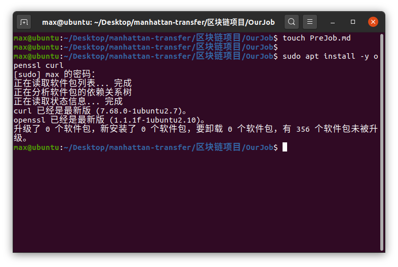
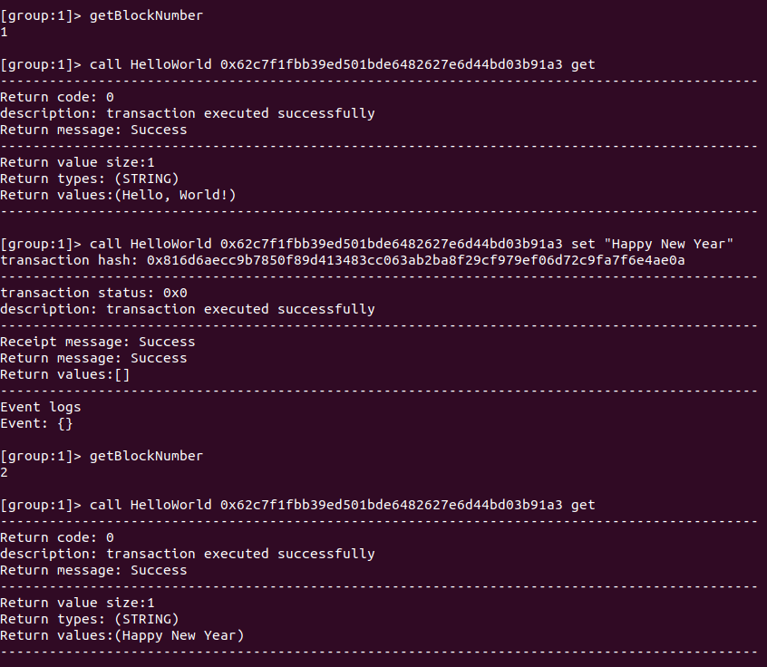

<center><h1>区块链大作业前期预热报告</h1></center>

| 学号 | 郑有为   | 丁维力   | 崔子潇   |
| ---- | -------- | -------- | -------- |
| 姓名 | 19335286 | 19335040 | 19308024 |

[toc]

## 安装运行FISCO并部署合约

* 实验环境：Ubuntu

* 官网教程地址：https://fisco-bcos-documentation.readthedocs.io/zh_CN/latest/docs/installation.html

* 环境：Ubuntu

### 搭建单群组FISCO BCOS联盟链

* 第一步：安装依赖

	
	
* 第二步：创建目录并下载安装脚本

	
	
* 第三步：搭建单群组4节点联盟链

	
	
* 第四步：启动FISCO BCOS链

	
	


### 配置及使用控制台

* 第一步：准备依赖

	
	
* 第二步：启动并使用控制台

	
	
* 第三步：部署及调用HelloWorld合约

	
	
* 第四步：调用HelloWorld合约

	
	
## 学习Solidty并编写智能合约

* 第一步：设计智能合约

  * 结构体：企业、收据
  * 功能：
    * 实现采购商品—签发应收账款交易上链
    * 实现应收账款的转让上链
    * 利用应收账款向银行融资上链  
    * 应收账款支付结算上链  

* 第二步：开发源码 `SupplyChain.sol`

* 第三步：编译智能合约

  将编写的文件移动到`~/fisco/console/contracts/solidity`下，运行`bash sol2java.sh -p org.fisco.bcos.asset.contract`，（按照报错修改Bug后）编译成功。

  

* 第四步：部署智能合约

  使用 `deploy` 部署智能合约

  调用一个无参数函数`getPendingReceiptsAmount()`，能够正确执行（因为此节点并未注册，所以返回信息`Company is not registered`）。
  
  

## 查看区块并解释字段

执行 `getBlockByNumber 1` 查看第一个区块


FISCO BCOS的区块头（blockHeader）中每个字段意义如下：

| 名称             | 类型     | 含义                                                         |
| ---------------- | -------- | ------------------------------------------------------------ |
| number           | int64_t  | 本区块的块号，块号从0号开始计算                              |
| hash             | h256     | 区块头前13个字段RLP编码后的哈希值，FISCO BCOS新增字段        |
| parentHash       | h256     | 父区块的哈希值                                               |
| logBloom         | LogBloom | 交易收据日志组成的Bloom过滤器，FISCO BCOS目前尚未使用        |
| transactionsRoot | h256     | 交易树的根哈希值                                             |
| receiptsRoot     | h256     | 收据树的根哈希值                                             |
| dbHash           | h256     | 分布式存储通过计算哈希值来记录一区块中写入的数据，FISCO BCOS新增字段 |
| stateRoot        | h256     | 状态树的根哈希值                                             |
| sealer           | u256     | 打包区块的节点在共识节点列表中的索引，FISCO BCOS新增字段     |
| sealerList       | vector   | 区块的共识节点列表（不含观察节点），FISCO BCOS新增字段       |
| extraData        | vector   | 区块的附加数据，FISCO BCOS目前只用于在第0块中记录群组genesis文件信息 |
| gasLimit         | u256     | 本区块中所有交易消耗的Gas上限                                |
| gasUsed          | u256     | 本区块中所有交易使用的Gas之和                                |
| timestamp        | int64_t  | 打包区块的时间戳                                             |

因为交易内容为空，交易列表`transactions`字段中只有一个交易哈希的地址`TransactionHash`；

除了以上结构外，还有 `signatureList`，类型为`string` 是PBFT共识的签名列表。

## 问题与解决

* 在配置过程中，我们先是按照老师给的那一份Tutorial来搭建FISCO联盟链，但是搭建过程不成功，原因在拷贝控制台配置文件步骤：

  ```sh
  cp -n console/conf/applicationContext-sample.xml console/conf/applicationContext.xml
  ```

* 这个文件已经被移除，取而代之的是`config-example.toml`文件，故应该执行

  ```
  cp -n console/conf/config-example.toml console/conf/config.toml

* 但是该执行之后，FISCO还是无法直接启动，必须要杀死原来的FISCO创建的内容（或者直接重启），重新启动节点，FISCO才能够正确执行。

  
