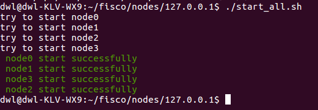
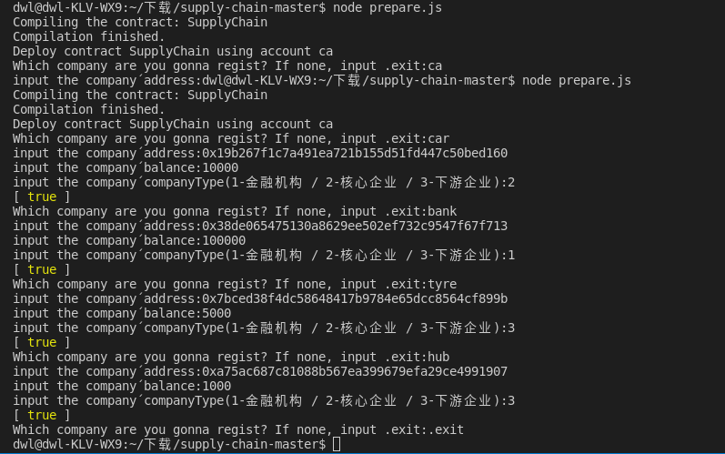

# 运行方法

+ 按官网教程搭建区块链网络:https://fisco-bcos-documentation.readthedocs.io/zh_CN/latest/docs/installation.html#

+ 在官网上下载 Node.js - SDK，并放在`./supplychain`中。

+ 启动FISCO BCOS链：

  

+ 将fisco/nodes/127.0.0.1/sdk下的文件复制到本程序的authentications文件夹下，替换掉原来的文件

+ 在终端输入node prepare.js，启动prepare.js按下图编译部署合约并注册car bank tyre hub四个公司

  

+ 在终端输入node app.js，启动app.js，并在浏览器访问http://localhost:9000/