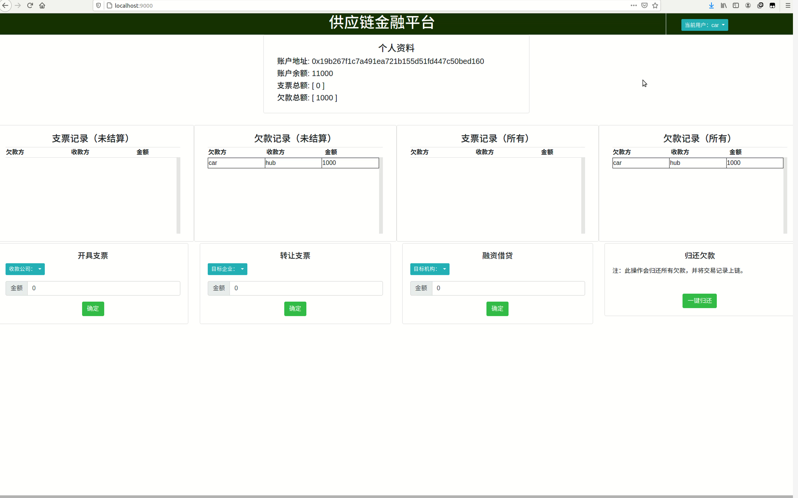

<center><h1>区块链大作业项目报告</h1></center>

| 学号 | 19335286 | 19335040 | 19308024 |
| ---- | -------- | -------- | -------- |
| 姓名 | 郑有为   | 丁维力   | 崔子潇   |
| 专业 | 软件工程 | 软件工程 | 软件工程 |

| 项目开始日期   | 项目完成日期   |
| -------------- | -------------- |
| 2021年12月29日 | 2022年01月08日 |

项目地址：https://gitee.com/WondrousWisdomcard/fisco-supply-chain

[toc]

## 一、项目背景

### 1.1 供应链+金融场景

​		供应链（Supply Chain）是指生产及流通过程中，涉及将产品或服务提供给最终用户活动的上游与下游企业所形成的网链结构。

​		金融机构对不同企业的的信用评级不同，核心企业有很大的风险承担的能力，故信用评级会高于一般企业。在供应链场景中，核心企业由于资金暂时短缺向下流普通公司签订了应收账款单据，约定某个时间后还款，这个过程可以由金融机构来作见证，从而确认这笔交易的真实性。在这段时间内，若掌握核心企业"欠条"的普通企业资金短缺需要融资，它可以凭借跟核心企业签订的应收账款单据向金融结构借款，但这样的信任关系并不会往下游传递。

​		这种不信任关系一直沿着下游的普通企业传播，需要金融机构不断往上验证真实性，导致这个过程增加很多经济成本。导致这个问题的根本原因是核心企业的信用无法在整个供应链中传递以及交易信息不透明化所导致的。  

​		如果我们结合区块链技术，将供应链上的每一笔交易和应收账款单据上链，同时引入第三方可信机构来确认这些信息的交易，例如银行，物流公司等，确保交易和单据的真实性，同时支持应收账款的转让，融资，清算等，就可以让核心企业的信用可以传递到供应链的下游企业，减小中小企业的融资难度。  

​		本项目针对这样一个应用场景，基于已有的开源区块链系统FISCO-BCOS，以联盟链为主，开发基于区块链或区块链智能合约的供应链金融平台， 实现供应链应收账款资产的溯源、流转。

### 1.2 功能需求分析

* 基本功能：
  * 核心企业、普通企业、金融企业的注册。
  * 通过账户查询余额、查询收款单据和欠款单据和查看历史交易记录。

* 核心功能：
  1. 实现采购商品—签发应收账款交易上链。例如车企从轮胎公司购买一批轮胎并签订应收账款单据。
  2. 实现应收账款的转让上链，轮胎公司从轮毂公司购买一笔轮毂，便将于车企的应收账款单据部分转让给轮毂公司。轮毂公司可以利用这个新的单据去融资或者要求车企到期时归还钱款。
  3. 利用应收账款向银行融资上链，供应链上所有可以利用应收账款单据向银行申请融资。
  4. 应收账款支付结算上链，应收账款单据到期时核心企业向下游企业支付相应的欠款。 

## 二、方案设计

### 2.1 存储设计

* 企业账户的数据结构

  ``` solidity
  struct Company{
      string companyName;			// 企业名称
      int balance;         		// 账户余额
      int companyType;    // 企业类型
      bool isRegistered; 	 		// 验证企业是否存在
  }
  ```

* 企业类型由一个整形表示：分别对应金融机构、核心企业和下游普通企业。

* 在智能合约中，我们以企业账户的地址作为键值，用一个哈希表保存企业，这样就可以直接通过地址访问企业的数据。

  ``` solidity
  mapping(address => Company) private companyMap;
  ```

* 债权凭证的数据结构

  ``` solidity
  struct Receipt {
      address from;       // 发起方地址
      address to;         // 接收方地址
      int amount;         // 债权凭证金额
      bool isSettled;     // 账单状态: 已结算 / 待结算 
  }
  ```

* 我们使用一个列表来保存所有的债权凭证

  ``` solidity
  Receipt[] private receiptList;
  ```

### 2.2 基本功能

* **企业注册**（该方法仅限部署该合约的认证机构调用）

  * `companyAddr`：注册企业的地址
  * `companyName`：企业名称
  * `balance`：企业初始金额
  * `companyType`：枚举类型，企业的类型
    * 金融企业 Financing、核心企业 Core、下游企业 Downstream
  * 若注册成功，返回`true`，若该地址已经注册，则返回`false`

  ```solidity
  // 认证机构为一个企业进行注册
  function registerCompany(address companyAddr, string memory companyName, int balance, int companyType) 
      public returns(bool) {
      
      // require(msg.sender == caAddr, "[registerCompany]: Certification Authority Only");
      if(msg.sender != caAddr) {
          return false;
      }
  
      Company storage newCompany = companyMap[companyAddr];
      if(newCompany.isRegistered == true) {
          return false;
      }
      else{
          newCompany.companyName = companyName;
          newCompany.balance = balance;
          newCompany.companyType = companyType;
          newCompany.isRegistered = true;
          return true;
      }
  }
  ```

* **查询企业信息**

  * `addr`：待查询企业地址
  * 返回对应企业的 `Company` 数据结构，如果改地址还未注册，则报错，返回信息："[getCompanyInfo]: Company is not registered"。

  ``` solidity
  // 查询企业信息
  function getCompanyInfo(address addr) public view returns(Company memory) {
      Company storage company = companyMap[addr];
      // require(company.isRegistered == true, "[getCompanyInfo]: Company is not registered");
      return company;
  }
  ```

* **查询企业所有收账账单**

  * `addr`：企业地址
  * `containHistory`：为`ture`时返回所有收账账单（包括已经付清的），为`false`时仅返回当前为付清的收账账单

  ``` solidity
  // 企业查询所有收账账单
  function getCompanyReceipts(address addr, bool containHistory) public view returns(Receipt[] memory) {
      Company storage company = companyMap[addr];
      // require(company.isRegistered == true, "[getCompanyReceipts]: Company is not registered");
      uint count = 0;
      for(uint i = 0; i < receiptList.length; i++) {
          if(receiptList[i].to == addr) {
              if(containHistory || !receiptList[i].isSettled){
                  count++;
              }
          }
      }
      
      Receipt[] memory rec = new Receipt[](count);
      count = 0;
      for(uint i = 0; i < receiptList.length; i++) {
          if(receiptList[i].to == addr) {
              if(containHistory || !receiptList[i].isSettled){
                  rec[count++] = receiptList[i];
              }
          }
      }
      return rec;
  }
  ```

* **查询企业所有负债账单**

  * `addr`：企业地址
  * `containHistory`：为`ture`时返回所有负债账单（包括已经付清的），为`false`时仅返回当前为付清的负债账单

  ``` solidity
  // 企业查询所有负债账单
  function getCompanyDebts(address addr, bool containHistory) public view returns(Receipt[] memory) {
      Company storage company = companyMap[addr];
      // require(company.isRegistered == true, "[getCompanyDebts]: Company is not registered");
      uint count = 0;
      for(uint i = 0; i < receiptList.length; i++) {
          if(receiptList[i].from == addr) {
              if(containHistory || !receiptList[i].isSettled){
                  count++;
              }
          }
      }
      
      Receipt[] memory rec = new Receipt[](count);
      count = 0;
      for(uint i = 0; i < receiptList.length; i++) {
          if(receiptList[i].from == addr) {
              if(containHistory || !receiptList[i].isSettled){
                  rec[count++] = receiptList[i];
              }
          }
      }
      return rec;
  }
  ```

* 查询待结算收账账单总额

  * 返回待收账总额

  ```solidity
  // 企业查询待结算收账账单总额
  function getPendingReceiptsAmount() public view returns(int) {
      Company storage company = companyMap[msg.sender];
      // require(company.isRegistered == true, "[getPendingReceipts]: Company is not registered");
      if(!company.isRegistered){
          return 0;
      }
  
      int totalAmount = 0;
      for(uint i = 0; i < receiptList.length; i++) {
          if(receiptList[i].to == msg.sender && !receiptList[i].isSettled) {
              totalAmount += receiptList[i].amount;
          }
      }
      return totalAmount;
  }  
  ```

* 查询待结算负债账单总额

  * 返回负债总额

  ``` solidity
  // 企业查询待结算负债账单总额
  function getPendingDebtsAmount() public view returns(int) {
      Company storage company = companyMap[msg.sender];
      // require(company.isRegistered == true, "[getPendingDebts]: Company is not registered");
      if(!company.isRegistered){
          return 0;
      }
  
      int totalAmount = 0;
      for(uint i = 0; i < receiptList.length; i++) {
          if(receiptList[i].from == msg.sender && !receiptList[i].isSettled) {
              totalAmount += receiptList[i].amount;
          }
      }
      return totalAmount;
  } 
  ```

### 2.3 核心功能

* 功能一：应收账款交易上链，对应功能需求分析的的第一个核心功能。

  * 创建一个到企业`to`，金额为`amount`的欠条，该函数只能由已注册的核心企业或金融机构发起，否则会报错，返回"[createReceipt]: Company is not registered" 或 "[createReceipt]: Core/Financing Company Only"。

  ``` solidity
  function createReceipt(address to, int amount) public returns(bool) {
      Company storage company = companyMap[msg.sender];
      Company storage companyTo = companyMap[to];
      // require(company.isRegistered == true && companyTo.isRegistered == true, "[createReceipt]: Company is not registered");
      // require(company.companyType == CompanyType.Core || company.companyType == CompanyType.Financing, "[createReceipt]: Core/Financing Company Only");
      if(!company.isRegistered || !companyTo.isRegistered) {
          return false;
      }
      else if(company.companyType != 1 && company.companyType != 2){
          return false;
      }
  
      receiptList.push(
          Receipt({
              from: msg.sender,
              to: to,
              amount: amount,
              isSettled: false
          })
      );
  
      company.balance += amount;
  
      return true;
  }
  ```

* 功能二：应收账款的转让上链，对应功能需求分析的的第二个核心功能。

  * 将金额为`amount`的账款转让给企业`to`
  * 在实现中，需要讨论单个账款金额不足，需要多个账款来转移金额；账户总帐款不足；单个账款金额大于待转金额，需要拆分账款的情况。

  ``` solidity
  function transferReceipt(address to, int amount) public returns(bool) {
      Company storage company = companyMap[msg.sender];
      Company storage companyTo = companyMap[to];
      // require(company.isRegistered == true && companyTo.isRegistered == true, "[transferReceipt]: Company is not registered");
      if(!company.isRegistered || !companyTo.isRegistered) {
          return false;
      }
  
      if(getPendingReceiptsAmount() < amount) {
          return false;
      }
      
      int restAmount = amount;
      for(uint i = 0; i < receiptList.length; i++) {
          if(receiptList[i].to == msg.sender && !receiptList[i].isSettled) { // 直接转移账单接收方
              if(receiptList[i].amount <= restAmount) {
                  receiptList[i].to = to;
                  restAmount -= receiptList[i].amount;
  
                  if(restAmount == 0) {
                      break;
                  }
              }
              else { // 拆分一个账单的金额
                  receiptList[i].amount -= restAmount;
  
                  receiptList.push(
                      Receipt({
                          from: receiptList[i].from,
                          to: to,
                          amount: restAmount,
                          isSettled: false
                      })
                  );
                  break;
              }
          }
      }
      return true;
  }
  ```

* 功能三: 利用应收账款向银行融资上链，对应功能需求分析的的第三个核心功能。

  * 利用账户中现有的账款向地址为`to`的金融企业请求融资上链，融资成功后更新企业账户余额，需要考虑银行没钱、待结算收账账单总额申请不了这么多钱的特殊情况。

  ``` solidity
  function applyFinancing(address to, int amount) public returns(bool) {
      Company storage company = companyMap[msg.sender];
      Company storage companyTo = companyMap[to];
      // require(company.isRegistered == true && companyTo.isRegistered == true, "[applyFinancing]: Company is not registered");
      // require(companyTo.companyType == CompanyType.Financing, "[applyFinancing]: Destination is not Financing Authority");
      if(!company.isRegistered || !companyTo.isRegistered) {
          return false;
      }
      else if(company.companyType != 3){
          return false;
      }
  
      if(companyTo.balance < amount) { // 银行没钱
          return false;
      }
      
      if(transferReceipt(to, amount)) {
          company.balance += amount;
          companyTo.balance -= amount;
          return true;
      }
      else{ // 待结算收账账单总额申请不了这么多钱
          return false;
      }
  }
  ```

* 功能四: 应收账款支付结算上链，对应功能需求分析的的第四个核心功能。

  * 企业用账户余额付清所有的欠账账单，如果余额不足以付清，则返回结账失败。

  ``` solidity
  function settleReceipt() public returns(bool) {
      Company storage company = companyMap[msg.sender];
      // require(company.isRegistered == true, "[settleReceipt]: Company is not registered");
      if(!company.isRegistered) {
          return false;
      }
  
      int totalDebt = getPendingDebtsAmount();
      if(company.balance < totalDebt) { // 不够还钱
          return false;
      }
      
      for(uint i = 0; i < receiptList.length; i++) {
          if(receiptList[i].from == msg.sender && !receiptList[i].isSettled) {
              companyMap[receiptList[i].to].balance += receiptList[i].amount;
              receiptList[i].isSettled = true;
          }
      }
      company.balance -= totalDebt;
      return true;
  }
  ```

### 2.4 前端实现
前端采用bootstrap模板来完成界面布局，采用vue框架来完成数据处理及与服务端的交互功能。
+ 用bootstrap的卡片来展示个人资料，所需数据由vue框架处理：
    ```html
    <div class="m-auto col-4 card">
        <div class="card-body">
            <h4 align='center'>个人资料</h4>
            <h5>账户地址: {{ nameToAdd[userName] }}</h5>
            <h5>账户余额: {{ cur_account.amount }}</h5>
            <h5>支票总额: {{ cur_account.receipt }}</h5>
            <h5>欠款总额: {{ cur_account.debt }}</h5>
        </div>
    </div>
    ```
+ 用表单提交的方式完成金额和交易对象的选择和处理：
    ```html
    <h5 align='center'>融资借贷</h5>
    <div class="btn btn-info btn-sm dropdown-toggle" type="button" id="useToChanger"
        data-toggle="dropdown" aria-haspopup="true" aria-expanded="false">
        目标机构：{{ useTo }}
    </div>
    <div class="dropdown-menu" aria-labelledby="useToChanger">
        <button class="dropdown-item" @click="changeUseTo('car')">car</button>
        <button class="dropdown-item" @click="changeUseTo('bank')">bank</button>
        <button class="dropdown-item" @click="changeUseTo('tyre')">tyre</button>
        <button class="dropdown-item" @click="changeUseTo('hub')">hub</button>
    </div>
    <form>
        <div class="input-group mt-3">
            <div class="input-group-prepend">
                <span class="input-group-text">金额</span>
            </div>
            <input type="text" class="form-control" v-model="useAmount">
        </div>
        <center><button align='center' type="button" class="btn btn-success mt-3"
                @click="useReceipt()">确定</button></center>
    </form>
    ```
+ 利用异步的网络请求，实现与后端的交互。即通过json格式传输需要调用的合约函数和参数，并从服务端调用智能合约之后得到返回值：
    ```js
    async function contractMethod(account, method, parameters) {
        let res = await axios.post('/contractMethod', {
            account: account,
            method: method,
            parameters: parameters,
        });
        if (res.data && res.data.ok) {
            return res.data.data;
        } else {
            console.log(JSON.stringify(res.data ? res.data.msg : res));
        }
    }
    ```
+ 利用vue框架实现数据和方法的管理：
    ```js
    async buy() {//生成账单
        if (this.buyFrom == "") {
            alert("收款企业不存在！");
        }
        else {
            let result = await contractMethod(this.userName, 'createReceipt', [this.nameToAdd[this.buyFrom], this.buyAmount]);
            if (result == 'true') {
                alert("账单生成成功！");
                await this.refresh();
                this.changeUser(this.userName);
            }
            else {
                alert("账单生成失败！");
            }
        }
        this.buyFrom = '';
        this.buyAmount = 0;
        refresh();
    },
    ```

### 2.5后端实现

使用node.js搭建后端来完成合约调用的工作,前端通过HTTP请求与后端进行通信，后端实现位于app.js文件中，主要分为三部分：加载智能合约、准备HTTP服务、实现智能合约方法调用接口

+ 加载智能合约：从合约编译时保存的compiled/SuupplyChain.json文件和部署时保存的deployed/SuupplyChain.json文件中读取合约的ABI和地址信息,构造一个FISCO-BCOS Node.js SDK定义的合约实例对象。

  ```js
  console.log('Loading contract from compiled file ...');
  let compiled = JSON.parse(fs.readFileSync('compiled/SupplyChain.json'))
  let contract = createContractClass(
      compiled.name, compiled.abi, compiled.bin, config.encryptType
  ).newInstance();
  console.log('Loading deployed contract address from deployed file ...');
  let contractAddr = JSON.parse(fs.readFileSync('deployed/SupplyChain.json'))['contractAddress'];
  contract.$load(web3j, contractAddr);
  console.log('Done.');
  ```

+ 准备HTTP服务：使用express库提供web前端的HTTP站点及一个HTTP合约调用服务

  ```js
  const express = require('express');
  const bodyParser = require('body-parser');
  const port = 9000;
  var app = express();
  app.use(bodyParser.json({ limit: '10mb'}));
  app.use(express.static('web', {index: '/index.html'})); // 网页根目录
  function getReqData(req) {
      if (req.body && Object.keys(req.body).length) {
          return req.body;
      }
      if (req.query && Object.keys(req.query).length) {
          return req.query;
      }
      if (req.params && Object.keys(req.params).length) {
          return req.params;
      }
      return {};
  }
  ```

+ 实现智能合约方法调用接口：使用前端传过来的方法名作为索引调用方法

  ```js
  // 合约方法调用接口参数如下
  // account: 字符串，调用合约的账户名，必须是config.json中已有的账户
  // method: 字符串，想要调用的合约方法名字
  // parameters: 列表，合约方法调用参数
  // 返回一个JSON对象字符串
  // ok: 布尔值，调用是否成功
  // msg: 字符串，如果调用成功，则设为'succeed'，否则为错误信息
  // data: 列表，合约方法调用的返回值
  app.all('/contractMethod', async (req, res) => {
      let reqData = getReqData(req);
      console.log(`call 'contractMethod' from ip ${req.ip}, params: ${JSON.stringify(reqData)}`);
  
      if (typeof(reqData.account) != 'string' || typeof(reqData.method) != 'string' ||
          !Array.isArray(reqData.parameters)
      ) { // 检查接口参数类型
          console.log('failed at parameter type checking.');
          res.json({ok: false, msg: 'Bad iterface call.', data: []});
          return;
      }
  
      // 进行合约方法调用
      try {
          contract.$by(reqData.account);
          let retval = await contract[reqData.method](...reqData.parameters);
          console.log(`retval: ${JSON.stringify(retval)}`);
          res.json({ok: true, msg: 'succeed', data: retval});
      } catch (err) { // 出错
          let errString = err.toString();
          console.log(errString);
          res.json({ok: false, msg: errString, data: []});
      }
  });
  ```

### 2.6编译部署

使用node.js实现智能合约的编译部署，位于prepare.js文件中，主要包括编译合约、部署合约、注册公司三部分，启动app.js前需要按下图完成配置工作：


+ 编译合约：调用FISCO BCOS的API编译智能合约文件contracts/SupplyChain.sol，合约编译完成后,将合约的ABI信息和二进制代码以十六进制字符串格式写入到compiled/SuupplyChain.json文件中

  ```js
  let compServ = new CompileService(config);
  let name = 'SupplyChain';
  console.log('Compiling the contract: SupplyChain');
  let contractClass = compServ.compile(`contracts/${name}.sol`);
  console.log('Compilation finished.');
  fs.writeFile(`compiled/${name}.json`, JSON.stringify(contractClass), (err) => {
      if (err) {
          console.log('Failed to wirte compiled file.');
          console.log(err);
      }
  });
  ```

+ 部署合约：调用FISCO BCOS的API，使用编译结果，在认证机构ca帐号下部署合约。web3j.deploy()返回值res是一个JS对象,其中包括有合约的地址信息,将该对象以十六进制字符串格式写入到deployed/SuupplyChain.json文件中

  ```js
  let account = 'ca';
  let compiled = JSON.parse(JSON.stringify(contractClass));
  let contract = createContractClass(compiled.name, compiled.abi, compiled.bin, config.encryptType).newInstance();
  let parameters = [];
  console.log(`Deploy contract ${name} using account ca`);
  try {
      let res = await web3j.deploy(compiled.abi, compiled.bin, parameters, account);
      fs.writeFile(`deployed/${name}.json`, JSON.stringify(res), (err) => {
          if (err) {
              console.log('Contract deployed, but failed to write deployed file.');
              console.log(err);
          }
      });
  } catch(err) {
      console.log('Failed.');
      console.log(err);
  }
  ```

+ 注册公司：使用认证机构ca的帐号，调用智能合约中的registerCompany方法，注册car bank tyre hub四个公司，需手动输入信息，companyAddr见web/client.js

  ```js
  let company = await input('Which company are you gonna regist? If none, input .exit:');
  let contractAddr = JSON.parse(fs.readFileSync(`deployed/${name}.json`))['contractAddress'];
  contract.$load(web3j, contractAddr);
  let companyAddr;
  let balance = 0;
  let companyType = 0;
  while(company!='.exit'){
      companyAddr = await input('input the company´address:');
      balance = await input('input the company´balance:');
      companyType =  await input('input the company´companyType(1-金融机构 / 2-核心企业 / 3-下游企业):');
      try {
          contract.$by(account);
          let parameters = [companyAddr,company,balance,companyType];
          let re_res = await contract['registerCompany'](...parameters);
          console.log(re_res);
      } catch(err) {
          console.log('error occurred.');
          console.log(err);
      }
      company = await input('Which company are you gonna regist? If none, input .exit:');
  }
  ```

## 三、功能测试
在这里可以查看个人支票和欠款信息，并能查询自己的余额等信息：    
  

### 3.1 功能一
实现采购商品—签发应收账款交易上链。
1. 选择公司car。
2. 选择收款公司tyre，输入金额，提交。
3. 刷新，可以看到car有了欠款记录。
4. 选择公司tyre，可以看到tyre有了支票记录。  



### 3.2 功能二
实现应收账款的转让上链，轮胎公司从轮毂公司购买一笔轮毂，便将于车企的应收账款单据部分转让给轮毂公司。轮毂公司可以利用这个新的单据去融资或者要求车企到期时归还钱款。  
1. 选择公司tyre。
2. 选择转让公司hub，输入金额，提交。
3. 刷新，可以看到car有了欠款记录。
4. 选择公司tyre，可以看到hub有了支票记录。  


### 3.3 功能三
利用应收账款向银行融资上链，供应链上所有可以利用应收账款单据向银行申请融资。  
注意，如果申请融资，则会将其他企业欠款的记录也会被算入该企业的资产中。融资的对象必须是金融机构。 
1. 选择公司hub。
2. 选择借贷公司bank，输入金额，提交。
3. 由于这个hub公司有支票记录，因此银行认可其还款能力，融资借贷成功。 


### 3.4 功能四
应收账款支付结算上链，应收账款单据到期时核心企业向下游企业支付相应的欠款。如果当前企业资金不够还款，则不能结算欠款。  
1. 选择公司car。
2. 点击一键结算欠款。
3. 由于car公司剩余的金额超过了欠款，因此还款成功。


## 四、界面展示

界面截图如下：


具体请见演示视频

