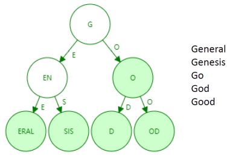

# 区块链复习笔记

zyw zyw zyw

>**老师的提醒：**
>
>**比特币、以太坊的数据结构，以及这两种区块链在数据结构、共识算法、交易模型方面的不同点一定要搞清楚；比特币的双花攻击。**
>
>**Lec12之后的内容主要是分享为主的讲座内容，除了Lec15，其他的不考。**
>
>**选择题 10 X 2分；**
>**判断题 10 X 1.5分；**
>**简答题 4 X 10分；**
>**简答题 10分 + 15分**

[toc]

## Lec1 Intro

**应用**：

* 区块链描述契约（生产资料、技术和方法的分配）关系 ，改变生产关系。
* 区块链的应用：智能合约、支付、金融市场交易、物联网、博彩业、网络安全、公共记录等等。
* 区块链的产业生态：基础设施和服务（矿机、算力服务、数据传输、数据储存）；软件与应用开发（基础服务平台、解决方案、区块链数据）；应用服务（数字交易平台、互助保险、公正服务、咨询社区、供应链管理、数字资产服务）
* 案例：区块链电子发票、商品溯源、公益资金流动记录、保险、征信联盟、版权存证交易等。（案例特点：互不信任的多方协作场景）

**比特币到区块链**：

* 和区块链的关系：区块链随着比特币的出现而面世；区块链是载体/平台，比特币是产品。
* 传统金融体系：信用体系、现金体系
* 密码朋克：去中心化的信任革命
* 比特币的理论基础：交易数据维护方案 B-Money 和 工作量证明
* **比特币（BTC）诞生于2009年，由中本聪提出，它是一种建立在计算机技术，密码学以及经济学上的货币形式（加密数字货币）。**
* 比特币的最小单位：聪（Satoshi），等于一亿分之一个比特币
* **区块链是<u>按照时间顺序将数据区块依顺序相连的方式组合成的一种链式数据结构</u>。它是一个分布式的账本数据库，网络中每个节点都有一个完整的账本。**
* 区块链的特性：匿名性、一致性、不可篡改、分布式、去中心化。
* 区块链的分类：公有链（比特币、以太坊）、私有链、联盟链。


## Lec2 密码学基础

* 密码学：第三方存在下的安全通信技术的研究与实践  
* 哈希：表示大量数据的唯一摘要值
* **哈希函数：Hash函数是将任意长度的消息映射成一个较短的定长输出消息的函数。**它可以为文件、消息或其它的分组数据产生“数字指纹”。
* **哈希函数的密码学安全附加特性**：
  * **碰撞阻力** Collision-resistance：如果无法找到$x,y$，满足 $x != y$ 且 $H(x) = H(y)$ ，则称哈希函数 $H$ 具有碰撞阻力。
    * 生成的信息摘要有防止篡改的作用。
  * **隐秘性** Hiding ：如果输入$r$选自一个高阶最小熵分布概率分布，通过给定的$r$与$x$连接的串的哈希值$H(r||x)$无法确定$x$的值。
    * 保证计算过程单向不可逆（$r$是一个增加难度的不重数）。
  * **谜题友好**（Puzzle-Friendliness）：对于任意$n$位输出值 $y$，$k$选自高阶最小熵分布，如果无法找到一个方法，在比 $2^n$ 小很多的时间内找到 $x$，保证 $H(k||x) = y$, 则称 $H$ 为谜题友好。
    * 只能暴力求解，为挖矿提供公平性。
    * **挖矿的过程 - 谜题搜索**：寻找满足$H(header || TXs || nonce) < target$ 的解 $nonce$ 
* **数字签名：信息的发送者（掌握私钥）能产生别人无法伪造的一段数字串， 且可以通过其公布出去的公钥验证是由他发送。**  
  * 公钥私钥：用来私钥来对信息进行数字签名，他人用你的公钥来对数字签名进行验证。
  * 考虑到公钥密钥进行数字签名时加密解密的代价昂贵，往往将散列函数引入数字签名：通过散列函数生成一个报文m固定长度的数据指纹H(m)，B对报文的散列签名而不是对报文本身签名，因为H(m)比较短所以计算会快一些。

* 加密货币讨论 Cryptocurrency  ：
  * 高飞币（Goofy Coin）：用户可随时创建新币；可将币转给其他人，必须通过密码程序完成。
  * 奴才币（Scrooge Coin）：“仅增账本”，保证已经写入账本的数据都会永久保留下来
    * 两种交易行为：
      * 造币行为：只有财奴（权力太大）才能造币。
      * 耗币行为：被消耗的币事先存在且未被事先消耗，本次消耗的币都有所有者的签名；交易还会造币，新造的币值量等于消耗的币值量。
  * 去中心化加密货币的要求：区块链公开、所有用户必须一致同意哪些交易有效、分配交易与货币的过程去中心化、造币去中心化。


## Lec3 比特币数据结构

* **比特币的数据结构：哈希指针、区块、交易、默克尔树。**

  

* **创世区块** Genesis Block：第一个被最早构建的区块称为创世区块，它在客户端软件中是静态编码的，因此它不能被修改。

* **区块**：记录了相对独立的一批交易记录，并对这些交易进行一次确认  

  * 交易需要得到验证和执行才能够正式被区块链系统确认，比特币系统中采取了批量确认交易的方法，形成区块  。

  * **区块头**：记录区块信息，作为区块的摘要在网络间进行传输  

    | 命名           | 信息                       | 大小 |
    | -------------- | -------------------------- | ---- |
    | nVersion       | 区块版本                   | 4B   |
    | hashPrevBlock  | 前一个区块的哈希值         | 32B  |
    | hashMerkleRoot | 默克尔树根哈希值           | 32B  |
    | nTime          | 时间戳（产生的时间）       | 4B   |
    | nBits          | 难度（区块产生的门槛难度） | 4B   |
    | nNonce         | 不重数                     | 4B   |

  * **区块身**：交易列表 + 默克尔树

* **交易**：

  * **账户系统模型：UTXO，账户状态转移**

  * **账户**：区块链系统中数字货币的所有者，也称为地址  

    * 比特币账户余额：由UTXO计算

  * **交易**：账户之间的货币转移通过交易来实现，也称为转账 

    * 交易可以有多个输入/输出

    * **输出的结构**：**比特币数量 + 锁定脚本**（一个锁，只有收款者才有解开它的钥匙）

    * **输入的结构**：**UTXO的来源**（包含**一个交易哈希和一个索引号**，用来表示哪笔交易的第几个输出） + **解锁脚本**（通常使用了用户的密钥生成，只有用户本人才能够生成解锁脚本）+ **序列号**（在一些解锁情况下使用）

      

    * **UTXO模型**：未花费交易输出（Unspent Transaction Output）<u>还没有花费出去的交易的总和反应用户所拥有的比特币余额。</u>
      
      * UTXO模型中，形成了一条“数字签名链”，可以对 任意的比特币不断回溯，直到最初产生比特币的起点。
    * **交易的数据结构**：**交易版本号 + 交易输入数组（和输入数量） + 交易输出数组（和输出数量） + 时间戳。**

* **默克尔树**：计算出的默克尔树根哈希值作为区块内所有交易的数字签名。

  * 默克尔树结构：

    

  * 验证计算：

    

* 区块链如何做到防篡改（两个维度）
  * 区块链的哈希指针：如果修改指向上一个区块的哈希指针，可能就回溯不到创世区块了。
  * 默克尔树的哈希指针：如果修改了交易内容，生成的默克尔树根的哈希值会与区块头存的值不同。

## Lec4 共识机制和工作量证明

* **共识 Consensus：<u>不信任节点之间对数据最终状态达成一致的过程</u>**。它通过一种选择性的过程（例如挖矿）提供一种去中心化的控制。

  * 分布式的共识：在多个节点之间获得一个共同的状态/值，尽管一些节点出现故障（例如造反）

* 一致性问题 Agreement：实现多节点的一致。

  * 分布式系统达成一致性的过程，应该满足：可终止性，约同性，合法性。

  * 一致性的问题和挑战：节点间网络通信不可靠、处理时间无法保障、节点可以是恶意的。


* **共识机制：区块链中的大多数或所有节点为同意建议的状态或值而采取的一组步骤。**
  * 共识机制的要求：一致性、可约束性&活性、有效性&正确性、错误容忍、节点诚实
  * 共识机制是区块链的核心引擎。
* **共识机制的类型**：BFT-Based 基于传统拜占庭式容错  和 Leader Election-based 基于领导选举（例如PoW）
  * BFT-Based：依赖于一个简单的节点方案，有若干轮发布者签名的消息发布，参考[拜占庭将军问题](https://zhuanlan.zhihu.com/p/107439021)
    * 运行的很好但受限于节点规模——适用于小规模
  * Leader Election-based 基于领导选举（例如PoW）：它要求节点去竞争领导人选举的随机选择，只有获胜的节点才能提出最终值。
    * 它适用于大规模但运行的比较慢
* **区块链的共识机制**：不同区块链采用不同的共识机制

  * 公有链：节点有无信任基础，使用**算力敏感的挖矿**共识来作为激励机制
  * 联盟链、私有链：在一组已知、已识别、且经过审查的参与者中进行，节点有信任基础，采用BFT类型的共识机制。

* 比特币为何需要共识机制：会有人因为网络没收到交易记录；节点有无信任基础，会有人作恶（例如XX攻击，XX攻击）。
* **公有链的两种典型攻击：双花攻击和多重身份攻击**
  * **双花攻击** Double-Spending Attack: **A答应给B10个比特币，同时答应给C10个比特币，但是她总共只有10个比特币，这将导致每个节点记录的账本信息不一致**
    * 使用**同等验证**：提交者向其他用户提交一条交易信息，其他用户进行投票（节点在观测到多笔交易使用同一笔比特币时，会对A的提案投出反对票），当获得一定数目投票后，大家同意将交易信息进行保存
  * **多重身份攻击/女巫攻击** Sybil Attack：**比特币作为无中心登记的匿名服务，创建多重身份代价极低，多重身份意味着多重的投票权利**
    * 对抗方式：提高作恶的代价，采用**资源成本进行投票**，取代用身份投票的机制，也就是**工作量证明 PoW**
* **比特币的共识——基于工作量证明 POW 的挖矿**
  * 通过消耗资源解决一个问题（蛮力计算一个问题）获得投票资格（即记账权），通过**记账奖励**鼓励投入资源
  * 基于哈希函数的特点：正向快速、输入敏感、逆向困难、冲突避免，区块链一般采用SHA2系列哈希算法，如SHA256，SHA512
  * **具体挖矿过程：参与者综合上一区块的哈希值，上一个区块生成之后的新的验证过的交易内容的Markle Root值，加上猜测的一个随机数Nonce，和时间，一起打包到一个候选新区块，让新区块的哈希值小于比特币网络中给定的一个数，成功了则获得记账权，同时领取奖励。**
  * **挖矿奖励：比特币奖励**（新比特币发行）和**交易手续费**（交易发布者提供）
  * **PoW规则**：
    * **每十分钟生成不到1MB的区块，记录着十分钟内验证过的交易内容，串联到区块链尾部，每个区块的成功提交者可以得到系统一定数量的比特币的奖励（该奖励作为区块内的第一个交易），以及用户附加到交易上的支付服务费用**
    * **每个区块的奖励最初是 50 个比特币，每隔 21 万个区块自动减半，即 4 年时间，现在的出块奖励是 6.25 个比特币，比特币作为通缩的货币，最终在2140年比特币总量稳定在 2100 万个**
* 无中心网络需要何种工作量证明：PoW难题的设计需满足<u>不容易完成、容易验证、工作过程公平、具有随机性四个条件。</u>
* 共识模型里的博弈论：

  * 拥有记账权的人更倾向在维护整个体系过程中获利（纳什均衡 + 帕累托最优）
  * 使用网络的人需要付出一定的成本（手续费、计算费）以免滥用
  * 少数人作恶的成功几率很低，只有极端势力才有可能不顾一切的颠覆这个体系 
  * 整个局势不存在“确定性” ，一直在动态的多方博弈

## Lec5 挖矿的数学原理与分叉机制

### 5.1 挖矿的数学原理

* 挖矿的概率分析：

  * 全网挖出新快（出块）的时间符合一个指数分布，该分布具有无记忆性。（每十分钟出一个块）
    $$
    P(T > s + t | T > t) = P(T > s)
    $$
    **当10分钟之后没有出块，全网所有矿工节点之后再经过多久可以出块？答案还是10分钟。**它是想保证任一矿机在尝试解题的过程中，都有一样的成功概率。

* 挖矿的难度设置：开采一个区块的难度。

  * **THR 总哈希率：即算力，挖矿时每秒能做的哈希碰撞的次数。**

  * 难度调整：通过调整挖矿难度，使得出块时间相对稳定

    **下一难度 = 之前的难度 * 2周 / 最近2016块的挖掘时间**

    * 每2016个区块(大约每2周)调整一次难度，两周2016块意味着十分钟每块

### 5.2 分叉机制


* **分叉**：全网同时有两个合法提案在网络中进行广播，收到的用户进行验证后，会基于用户认为的最长链基础上继续难题的计算，不同用户的链不同，导致分叉
  * 解决机制：**最长链机制**
  
* **规则改变导致的分叉**：

  * 软分叉：改变规则后现有规则更严格，新节点不接受旧节点
    * 临时性分叉：没有升级的节点会因为不知道新共识规则下，而生产不合法的区块，被迫升级，转而扩展最长链
  * 硬分叉：改变规则后现有规则更宽松，旧节点不接受新节点
    * 永久性分歧，因为没有升级的节点无法验证已经升级的节点生产的区块

* **恶意分叉**：分叉攻击 / Double Spending / 51% Attack

* 比特币挖矿的安全机制保障
  * 挖矿的安全性分析
    * 恶意节点可以伪造一个交易把别人的钱转给自己吗？
      * 不能，因为有签名机制，别的诚实节点不会承认该交易；即使该交易已上链，也可以通过分叉把它废除了，这样该恶意节点白费力气又损失了钱。
    * 恶意节点可以双花吗？
      * 很难，除非有51%算力 
  * **自私挖矿**：悄悄挖不发布，为了获取更多的出块奖励 
    * 一旦发布出去，大家都会在新区块后边平等地开始竞争  
    * 如果挖矿者先藏起来，然后自己继续往后挖，就可能可以获取很多收益。但它存在风险，不发布的块有可能会浪费掉（被别人挖到），所以还不如赶紧发布出去获取当前的出块奖励
    * 自私挖矿的收益曲线：如果一个矿工他的算力超过全网的三分一，他很可能为了更多的收益而选择自私挖矿

## Lec6 比特币社区、挖矿的激励与策略

### 6.1 比特币社区

* **比特币社区**：比特币是一个点对点的网络，节点之间交换交易和区块，网络中存在不同类型的节点。
* **节点的职能**：
  * Validate 验证一个区块
  * Store 储存一个区块的交易历史、
  * Update 更新区块链中的其他节点，确保区块链中的所有节点都有最新的信息。

* **比特币社区的成员：三种节点**

  

  

  * **全节点 Full Nodes**
    * 托管整个区块链历史记录的单个副本，包括事务、时间戳和所有创建的块。
    * 具有全部功能：
      * Wallet 钱包
      * Miner 挖矿（？）
      * Full Blockchain Storage 储存区块链
      * Network Routing Functions 网络路由
    * 需要更先进的算力和能源，更昂贵，估计全网有超过一万个全节点。
  * **轻节点 Light Nodes (Simple Payment Verification Nodes)**
    * 更小并只存储部分区块链历史信息（所有区块的区块头）
    * **只提供钱包和路由功能**
    * 它下载钱包并连接到完整的节点以进一步验证存储在区块链上的信息
    * 它能够以较小的代价判断某个支付交易是否已经被验证过（存在于区块链中），以及得到了多少算力保护（定位包含该交易的区块在区块链中的位置）
    * **SPV**：用来证明一个交易确实已经在区块链中发生过  
  * **矿工节点 Mining Nodes**
    * 负责创建区块并将其加入到区块链中，它们不负责未来区块的维护或有效性
    * 可以获得奖励（而全节点是没有奖励的，它们都是P2P网络的志愿者，鼓励保存和进一步去中心化区块链。）
    * 不一定要托管所有历史交易记录
    * 矿工有可能为了竞争出块奖励而打包空块（不包含任何交易的区块）  

* **矿池 Mining Pools**：
  * 用于矿工集中算力，矿工们报团取暖，按照一定的管理规则参与挖矿，遵守某种利益分配规则获得一定的挖矿奖励。

* **比特币社区生态面临的问题：如何维护一个健康的生态？**
  
  * 如何保证矿工会投入大量算力？奖励大于花费
  * 如何保障币值持续高稳？当用户普遍相信区块链安全，无政策干预时
  * 比特币的安全性，生态健康程度与比特币的币值相互依赖相互作用
* 启动一个加密货币的最开始的阶段：冷启动 Bootstrapping 阶段
* 社区规则的更新：
  * 软分叉：对现有规则的收紧，旧结点生成的一些区块新节点无法接受，旧结点有很强动机升级，区块链不会分裂。
  * 硬分叉：对现有规则的放宽，旧结点拒绝新节点生成的一部分区块，区块链分裂。

### 6.2 挖矿的激励

* 比特币设计者需要考虑的问题：
  * 谁在维护交易账本？全节点
  * **谁在制造新的比特币？挖到矿的矿工**
    * 每一笔比特币交易都必须添加到区块链中，才能被认为是成功完成或有效的。
    * **矿工的出块激励：出块奖励和交易手续费**
      * 出块奖励：现在是6.25BTC
      * 交易手续费：所有与交易一起发送的费用都包含在新区块中
  * 谁有权利批准哪个交易是正当有效的？ 全节点和轻节点 
* **矿工挖矿的策略：**
  * **要打包哪些交易？**
    * 矿工可以选择将哪些交易放进他的区块里
    * 默认的规则是选择那些交易费比较高的交易 
  * **对哪一个区块进行挖矿运算？**
    * 矿工可以选择在哪个区块上进行挖矿
    * 默认的做法是在最长的那条区块链上继续挖下去  
  * **如何在同一高度的多个区块中做选择？**
    * 如果两个不同的区块在同一时间被宣布发现，这就造成了一个区块的分叉，每个分叉的区块都是可以被延续下去的，因为它们都符合最长区块链原则。
    * 矿工必须选择其中一个区块接龙下去，默认的做法是选择最先被监听到的那一个区块。  
  * 什么时候宣布新的区块？
    * 矿工找到一个有效区块之后，他们要决定什么时候向比特币网络宣布这一个区块。
    * 默认的做法是立刻宣布，但他们也可以选择等一下（自私挖矿，发动截流攻击）
* **矿工挖矿的恶意策略：**
  * **挖空块现象**：为了更快地拿到出块奖励（但拿不到交易手续费），提交交易记录为空的块（因为体积小，传播快）
  * 合谋：
    * **合谋发动51%攻击**：实现双花攻击
      * **双花攻击，分叉攻击**：同一分钱给两个地方，然后让一份交易无效
        * 两个交易都上链了，但位于不同的分叉上，最后通过算力废弃掉短的分叉，就实现了分叉攻击。
      * 预防手段：
        * 避免计算力放到同一个组织手里
        * 6个区块确认机制：收款方等到全网的 6 个区块确认之后再交付商品（一小时），因为 6 个区块后再对全网进行篡改的难度很高  
      * 引申思考：51%攻击可以压制 (阻止) 其他交易吗？
        * 攻击者可以不打包那些交易，拒绝创建包含那些交易的新块，拒绝在含有类似交易的块上延展。
        * 但攻击者不能阻止交易本身，交易会被发送到大部分节点上，作恶容易被发现。
    * **通过贿赂进行分叉攻击**：通过矿池吸引矿工加入，再通过 Out-of-band 方式贿赂、给小费，争取把分叉链变成最长链 
    * 绝大多数的矿工，都会通过诚实挖矿来维持整个比特币系统。因为如果他们集体伪造交易，用户对比特币失去了信心，没人再去使用比特币，那么矿工伪造了交易盗取比特币就失去了意义。

### 6.3 交易打包和手续费

* **比特币的交易是如何被打包的**
  * 交易在打包之前需要先提交到 **Mempool**，Mempool 内存池是一个节点中所有等待的交易的保存区域，不同节点缓冲池的交易不同，且所不同节点都有不同的RAM容量来存储未经确认的交易。
  * 当节点接收到一个新的有效块时，它会从它的本地内存池中删除这个块中包含的所有交易，以及有冲突UTXO输入的交易，这会导致Mempool大小的急剧下降，而被回滚的交易可以重新回到内存池中，等待后续的打包。
* **交易的手续费是如何制定的**
  * 矿工有经济动机优先考虑包含更高费用的交易的验证，对于那些想要发送资金并获得快速确认的人来说，适当的费用可能会有很大的差异。
  * 然而费用并不取决于你发送的数量，它取决于
    * 交易提交时的网络状况和交易数据大小
    * 网络环境：比特币区块链上的一个块只能包含最多1MB的信息，包含交易的数量是有限制的
      * 在交通堵塞的时候，会有更多的基于在池中等待或 Mempool 已经满了时：
        * 矿工可以优先考虑收费较高的交易
        * 用户通过收取越来越高的费用，来竞争让他们的交易进入下一个区块
        * 最终，市场将达到用户愿意支付的最大均衡费用，矿工将按顺序完成整个 Mempool
      * 一旦网络流量减少：费用会下降
    * 交易大小：大的肯定要贵一点啦
      * 较小的交易更容易验证，大的交易则需要更多的工作，并在块中占用更多的空间
      * 矿工倾向于打包小的交易
  * **交易的费用一般是由钱包自动算的，为你给出一个合适的费用。**
    * 动态计算：钱包将计算适当的费用为您的交易考虑到当前的网络条件和TX大小。
    * 你可以选择优先费用和常规费用中选择。
      * 优先费的计算是为了让你的交易在一个小时内包含在一个区块中。
      * 常规费用较低，这种类型的交易通常需要一个多小时。
    * 高级用户可以为他们的发送设置自定义费用，单位为satoshi per byte (sat/b)。若设置太低的费用可能会导致你的交易在很长一段时间内未被确认，甚至可能被拒绝。

## Lec7 比特币网络、匿名和监管

### 7.1 比特币网络

* 区块链的分层结构：（从上到下）业务应用层、合约、共识层、网络层、数据层、硬件层
* **比特币网络：P2P**
  * P2P网络结构：结构化 / 非结构化
  * 结构化网络：能够快速地搜索特定的信息
    * 分布式哈希表（DHT）的应用：分布式的存储和寻址技术，其通过一个哈希函数将键值与存储空间的索引值对应起来，这样寻址过程每次秩序做一次哈希运算。
  * 非结构化的网络（比特币所采用的）
    * 不适用 DHT（比特币也并未使用 DHT，因为DHT 要求每一个节点都要直到所有的信息），也没有维护结构的开销
    * 可能会遭受洪泛攻击，造成网络拥堵。
* **在不靠谱的 P2P 网络上比特币节点的操作**
  * 加入 P2P 网络：首先需要使用预先配置的 IP 地址，和 DNS 来找到一些同伴（Peer）
  * 接入比特币网络：节点首先连接上默认为8个的其他节点，在此之上可以继续接收，平均每个接收传入连接的节点大约有30个连接。而它连接到的不活跃结点会在一定时间后（通常十几个小时） 后从表中删除。
* **区块链网络上的比特币交易**
  * 交易发起者**使用自己地址的私钥签署交易**，**将交易广播给整个比特币网络**。
  * 交易的确认：交易是通过区块来确认的，矿工将交易收集到区块中打包，再通过PoW获**得记账权向区块链网络广播该区块**。
* **广播过程**
  * 发送者发送交易或者区块，通知与它连接的节点
  * 接收节点：接收、验证、广播该交易或区块
* **比特币 P2P 网络的一致性要求**
  * 一旦有新块产生，全网就开始变得不一致，有结论表明一个节点从新块发布到收到新块的平均时间为 12.6 秒，且 5% 的节点会在 40 秒后仍然收不到新块。
  * 传输延时：在这个延时间隔，一些矿工可能会收到别的新区块
  * 解决节点的不一致性：最长链原则

### 7.2 匿名和监管

* 比特币账户的地址：公钥哈希值

* 匿名的必要性：保护隐私

* 区块链 P2P 网络中的隐私问题

  * 对交易图谱的研究，可以探查交易记录关联的身份
  * 第一个广播的节点可以找到发起交易的源 IP 地址
    * 对策：使用假身份，连接尽可能多的节点

* 现实世界网络中的隐私问题

  * 某些比特币业务（比特币交易或钱包）可以关联到你的身份

    * 比特币支付：可以暴露
    * 旁敲侧击：交易活跃时间关联社交帐号活跃时间
    * 污点分析：推算交易地址的相关性（Sender - Receiver）

  * 对策：需要更强大的**交易的无关联性**

    * 交易无关联性的关键属性：

      * 同一个用户的不同地址应该不易关联

      * 同一个用户的不同交易应该不易关联

      * 一个交易的交易双方应该不易关联  

* **匿名化/去匿名化的讨论**：
  * 去中心化与匿名化相互制约，去中心化需要追踪交易来防止各种攻击（例如双花攻击）
  * 如何对比特币的使用匿名化：经常更换自己的收款地址
  * 如何对比特币的使用**去**匿名化：
    * 零钱地址的合理推额：
      * 通过找零钱来推测一个用户的若干个首付款地址
    * 地址簇，交易图谱分析，对交易进行标记成簇
      * 用来标记交易场所、钱包服务和博彩网站
    * 网络层的去匿名化：
      * 混币网络
  * 使用混币来让交易图谱分析变得无效（混币中介）
    * 混币模式：中介、混币在线钱包、专项混比服务
      * 多重混币：让将用户最初发送的BTC与最终接受的BTC不同，存在风险——服务提供方卷钱跑路
    * 分布式混币：根据用户之间的P2P模式实现混币，不需要一个混币中介
      * 主要方案：合币（Coinjoin）不同用户共同创建一个单一交易，输入输出的顺序都是随机的，首先需要发现彼此，交换输入输出，构造交易并轮流签名，最后广播交易。  
      * 应对高风险交易流：合并规避
        * 高风险交易例如：周期性的固定金额交易
        * 帮助存在高风险交易流的用户重获无关联性
        * 允许使用多个 Output 地址进行接收 BTC  

* 政府对比特币的关注
  * 资本管制
  * 查犯罪：例如交易毒品
  * 反洗钱：Know Your Customer 原则，识别并验证客户，评估客户风险，监控异常举动。  
  * 反串谋、反垄断
* 监管手段
  * 发放加密货币牌照
  * 发布强制政策，限制交易与流通

## Lec8 以太坊

### 8.1 以太坊概述

* 比特币和以太坊是两种最主要的加密货币，比特币是区块链1.0，以太坊是区块链2.0。
* 传统合约的问题：
  * 自动化维度：条件满足时交易也未必会继续
  * 主客观维度：公证人的主观意识会影响到合约规则
  * 执行时间维度：整个合约过程繁琐浪费时间
  * 违约惩罚维度：一方违约未必会受到处罚，难以追责
* **智能合约：指能够自动执行合约条款的计算机程序**，具有事件驱动、价值转移、自动执行等特性。
  * 中心化环境下智能合约的弊端：容易受到篡改，出错后难以追溯恢复
  * 应用在区块链上的智能合约：
    * 区块链作为一种能够使多方间达成状态一致的有效手段，具有公开透明、不可篡改、多方验证、永久运行等特性。
    * 将智能合约应用到区块链上，能使智能合约具备高可靠性。
* 以太坊上的智能合约：
  * 以太坊在多个节点组成的点对点网络中，维护共同的区块链数据，**通过区块链上的交易来进行智能合约的创建、调用、结束等操作。**
  * 多个节点所维护的区块链状态是一致的，因此多个节点上运行智能合约的过程和结果也是一致的。
* 以太坊简介：
  * 它是第一个支持智能合约的区块链系统，使用 ther 作为数字加密货币，也是目前生态社区最活跃的区块链系统，出现了大量的去中心化自治组织（DAOs）和去中心化应用（DApps）。
  * 从2015年7余额开始进入前沿（Frontier）阶段，经家园阶段（Homestead）和大都会阶段（Metropolis），现已经进入平静阶段（Serenity），预期将共识机制从工PoW转向 PoS，使持币者也能有一定的决定权。
* **对比以太坊和比特币**：
  * 技术上：前者支持智能合约
  * 性能上：前者增加了叔块奖励，减少了出块时间（15秒），增加了Ghost共识机制
  * 社区上：前者拥有更加活跃的开源社区和数目庞大的开源项目
* **以太坊的一些应用：溯源存证、数字货币发行和流通、数据共享、游戏，涉及金融、安全、钱包、交换、游戏等领域**

### 8.2 区块数据结构和账户模型


* **区块头：父块哈希、叔块哈希、矿工地址、状态树哈希、交易树哈希、收据树哈希、Bloom Filter、挖矿难度、区块号、Gas上限、所有交易 Gas 之和、区块时间戳、可变长度字段、工作量证明摘要、挖矿Nonce值** 
  * 记录以太坊状态的状态根
  * 交易列表、收据列表和叔块列表对应的哈希值
  * 最长不超过100KB的额外数据

* **区块体**：
  * 交易组成的**交易列表**
  * 由交易执行信息组成的**收据列表**
  * 用于改进以太坊共识过程的**叔块列表**

* 账户地址的生成：计算椭圆曲线下的私钥与公钥，对公钥使用KECCAK256哈希算法，计算得到一个64位的16进制哈希值（256比特），截取哈希值的后40位作为一个以太坊地址

* **账户模型**：账户结构保存了用户地址对应账户的数据信息（**与UTXO模型区分开**）

  

  * **余额**：记录当前地址持有的以太币的数额，单位是Wei
  * **Nonce**：**记录这个地址创建以来累计发起的交易次数**
    * 防止交易重放：只有账户的Nonce和交易的Nonce能够对应的情况下，交易才是合法的。
      * 当一个交易执行完毕之后，账户的 Nonce 值增加，原
        本执行完毕的交易中的 Nonce 值就无法与现在账户的
        Nonce 值匹配  
    * Nonce 可以控制账户交易发起的顺序，从而实现一些相对复杂的功能。
    * 撤销功能：通过重复提交一个相同 Nonce 值的交易来使得一个已经提交但是尚未被确认的交易变得不合法，从而实现一
      定程度的撤销功能。  
    * **交易重放问题**：在以太坊的模型中，交易的合法性检验在于转账发起者的账户余额。如果没有其他手段来**使得发起过的交易失效**，那么这个交易将可以被无限次的重新发起而不需要发起者的同意，因为发起者的签名对于交易始终是有效的。
  * **以太坊的两种账户**：
    * **外部账户**：有余额、无代码、能够发起交易、由私钥控制
    * **合约账户**：有余额、有代码、能被触发执行智能合约代码，在智能合约创建后自动执行。 
  * **UTXO模型相比于账户模型更有利于保护隐私**，以太坊之所以要使用账户模型，是为了支持智能合约，要求参与者有稳定的身份。  
    * 比如智能合约可以实现一些金融衍生品， 利于参与者进行投资  

### 8.3 状态树

* 以太坊的账户状态：（后两种只有合约账户才有）

  * Nonce：累计发起的交易次数
  * Balance：账户余额
  * CodeHash：智能合约代码的哈希值
  * StorageRoot：合约存储树根节点的哈希值

* **合约存储树**：

  * 存储树是账户状态的一个域，该值随着合约的存储区的增加、删除、改动而不断变更。存储树保存了智能合约的变量数据，它维持着256位的变量数据索引与RLP 算法编码过的256位数据本身。
  * 合约账户下的存储也是一个映射表，它记录了从存储地址到存储值的一个映射关系；
  * 在合约账户的数据结构中存储了这个映射表的哈希值，这个哈希值被称作存储根（Storage Root），它同样是由一棵 MPT 来维护和计算。

* **以太坊状态如何维护**：**系统的全节点需要维护（所有的）账户状态**，如果只用哈希表来实现账户地址到状态的映射，有什么弊端？

  * 如果要证明某个账户有多少钱， 需要将哈希表的内容组织成一个 Merkle Tree, 计算出根哈希值，将根哈希值存储在 Block Header 中，只要跟哈希值正确，就能保证默克尔树不被篡改。但是，当一个新的区块发布，执行了新的交易必然导致哈希表的内容发生变化，则每次发布新的区块都需要将哈希表的内容重新组织一次 Merkle Tree，计算代价太大。
  * 故利用哈希表构建的默克尔树不利于更新，因为每新增一个账户就要对默克尔树进行重构。

* Trie 字典树、压缩前缀树、默克尔压缩前缀树（MPT）

  * **压缩前缀树 Patricia Trie**（Trie本身是字典树的意思）：对前缀树的路径进行压缩，树的高度大大缩短，访问内存的次数变小，效率提高。

    

  * **默克尔压缩前缀树（MPT）**如果把单词和箭头都换成哈希值，然后计算每个中间节点的哈希值，便得到了MPT。  

    * **按照所有数据的地址（或者键值）来构建一棵压缩前缀树，按照构建得到的压缩前缀树，从叶子节点开始，逐步计算每一层的哈希值，并将其汇合到父节点中，与 Merkle Tree 的计算过程类似。**

      

* **状态树**：**以太坊用来记录各个账号的状态的树，树的键是账户的地址，值是账户的详细信息**

  * 当新区块形成时，区块链节点存储的是生成的一个新的状态树，而不是修改原来的状态树。其中大部分节点的内容是共享的，只需要重算一部分哈希，也称为局部更新，只是改变对应分支的状态。

  *  这样做的目的是有利于解决分叉时对状态的回滚。

    * 因为以太坊使用的是账户模型、并且有复杂的智能合约，很难直接推算出之前的状态，所以为了回滚必须保存之前的状态。

    

### 8.4 收据树、交易树和 BloomFilter

* **收据**：**对应交易的数据结构，代表了交易执行的一些中间状态的写入和交易的执行结果等信息** 

  * 收据的内容包括智能合约的执行日志、Gas信息、以太坊的状态根；一个交易创建智能合约时会把新建合约的地址写到一个收据中。
  * 暂存交易的结果，便于验证，每次执行交易内容太麻烦了

* **交易树和收据树**：对于以太坊区块中的所有交易和交易的收据，都可以使用 **MPT** 进行组织和证明  

  * 通过交易或者收据在区块中的序号来构建 MPT  
  * 收据树和交易的信息一一对应。主要是考虑到智能合约的执行比较复杂，**收据树可以有利于快速查询，证明交易结果**
  * 使用MPT而不是默克尔树的原因是：以太坊其他数据结构都采用 MPT，代码统一，利于管理；查找效率高。

* **布隆过滤器 Bloom Filter**：**以太坊中通过布隆过滤器对收据的日志进行索引**  

  * 布隆过滤器可以用于快速检索一个值是否在一个集合中。在容忍一定的**误识别率**的条件下，它有着远超过一般算法的空间效率和时间效率。  
  * 原理：通过多个哈希函数将键值映射到位图之中，并在位图中合并（标记）集合中所有键值的映射结果。 对于一个键值，如果经过同样的哈希函数映射之后，出现了在位图中没有出现的标记位，那么这个键值必定不存在于集合之中。
  * 性质： **可以保证某个元素一定不在集合里， 但不能保证元素一定在集合中。 即会误报， 但不会漏报**  

  

### 8.5 以太坊的基本架构及原理（状态转移模型）

* **状态模型：可以把账户的余额泛化成一种账户的状态，而把转账交易当作是改变状态的一个方法**（无语，为什么先讲状态树再讲状态模型）

  * 以太坊状态转移：由交易来驱动的状态机  

    * 智能合约：作用于该状态机转换的代码  
    * 以太坊虚拟机（EVM）：执行状态转换代码的虚拟机  

    

* 状态转移模型的共识问题：

  * 相比比特币的UTXO模型，状态转换模型虽然使得智能合约的各种变量存储、传参等变得更加灵活，但也带来了多方共识上的困难，如发生分叉时的处理  
  * 在以太坊的状态转换模型中，如果发生分叉，需要回到分叉前的状态，重新验证另一条分支上的区块
  * 以太坊状态的存储采用了状态树结构，其根哈希记录在区块头中，记为 stateRoot，从而使得状态能够在全网得到共识确认，并在分叉时能够快速回滚。  

* 以太坊简易架构：

  

### 8.6 以太坊交易

* 交易承载了**账户转账（to为外部账户）、合约创建（to为空的交易）和调用合约（to为合约账户的交易）**等功能

* **交易数据内容**：基本交易内容、驱动智能合约、交易的签名

  * **基本交易内容**：发送者地址 from，接收者地址 to，交易金额 value
  * **驱动智能合约内容**：
    * input data 附带数据：创建合约的代码或调用合约的函数及参数
    * nonce：发送者累计交易数量
    * gasPrice：发送者支付给矿工的 gas 的价格，用于实现从 gas 到以太坊货币单位的转换，从而计算使用的 gas 的总价格  
    * gasLimit：该交易允许消耗的最大的 gas，用于解决智能合约不能停机的问题  

  * **交易的签名**：
    * hash：以上字段的哈希值，也是交易的 ID
    * r, s, v：ECDSA验证参数，由发送者的私钥对交易的哈希‘’做数字签名生成，用于确认转账的合法性  

* **交易周期：发起、广播、打包并执行、验证并执行**

  

  * **交易发起**：
    * 设定交易内容：用户在本地的以太坊钱包软件中选择要发送交易的地址（from）输入目标地址（to）、金额（value）、是否部署或调用合约（data）、**手续费单价**（gasPrice）等（一般情况下 gasLimit 和 nonce 都是以太坊钱包软件自动算的）
    * 发起交易：用户确认发送至以太坊节点，多个用户各自保有钱包私钥，而通过同一个以太坊节点广播交易


* **交易广播**：
    * 节点收到（或自己发起）交易后，对交易进行验证  
    * 节点验证交易为合法交易后，将交易加入节点的交易池中 
    * 节点验证交易通过后，除了加入节点的交易池中，还会**根据 P2P 网络广播的策略向相邻节点继续广播该交易**  
* **打包和执行**：（获得记账权的节点）
    * 交易进入内存池后，**具有挖矿功能的全节点，开始打包**下一个区块
    * 节点将交易打包时，**对交易进行逐个执行，每笔以太坊交易都是对以太坊状态的修改**  
      * 这里有普通交易、创建合约和调用合约，对于创建合约：EVM生成合约地址，执行 data 中对应的只能合约代码（比如构造函数），最后讲合约代码储存到合约地址中
    * 在所有需要打包的交易执行后，交易、状态以及收据的信息也会打包到区块中  
    * 记账节点在打包交易并获得合法的区块后，将区块（包含交易数据）广播到网络中的相邻节点
*  **验证和执行**：**没有获得记账权的节点**，在收到广播的区块后，对区块进行**合法性的验证，并进行交易的执行**  

### 8.7 以太坊的共识机制

* **以太坊的PoW与区块链的PoW的不同之处在于所使用的哈希算法不同，前者使用ethash算法，后者使用的是SHA256。**

* **ethash算法的特点是对内存有要求（通过读写IO降低算法速度），可以阻止专用芯片（ASIC）的使用。**

* **未来会将共识机制过渡到 PoS Proof of Stake 权益证明**

  * 这种机制通过计算你持有币数占总币数的百分比，包括你占有币数的时间来决定你获得本次记账权利的概率。持有越多，获得记账权力概率越大。
  * 优点：可以缩短共识时间，节省能源；缺点：容易分叉，易中心化

* **以太坊的出块时间很短，只有15秒**，由于网络延迟，新发布区块可能还没能成功扩散到整个网络，使得分叉成为常态。

  * 打击矿工积极性，在分叉上挖矿导致分散算力，降低攻击者的攻击难度

* **GHOST协议：为了鼓励分叉的合并 **

  * Greedy Heaviest Observed SubTree 贪婪最重观察子树

  * **叔父块 Uncle Block**：父块的同级分叉区块，七代以内友共同祖先的都可以认为是叔父块（下图还缺一个1/8的）。

    

    * 不在主链但被主链区块记录的满足难度的区块
    * 在尽可能减少两个相邻区块产生时间的条件下，尽量收缩和统一整个区块链的主链，同时通过叔块的激励来维护矿工的积极性。  

  * 叔父块的特点：

    * 一个区块最多接纳两个叔父块

    * 被接纳过叔父区块就不能再重复被接纳了

    * 一个块打包它的叔父块可以获得额外奖励

      * 接纳的区块数 * 1/32

    * 被接纳的叔父区块可以获得叔块奖励（每层减1/8奖励），奖励随层数的减小而降低（只限前2-7层）

    * 例子：

      ```markdown
      原始奖励：3
      块高度：100，接受叔父区块的高度：98
      手续费：0.15
      额外奖励（接受一个区块）：3 * 1/32
      叔块的奖励：3 * (1 - (100-98)/8)
      ```

      

  * **叔父区块的交易是不会被执行的**，叔父区块需要合法（满足难度要求），打包的交易可能存在冲突，故不执行

* 以太币的总供应量：创世区块包含大部分以太币（约7200W）

### 8.8 以太坊挖矿难度调整 

* 区块链是出2016个块时进行一个难度调整（大概是两星期的时间）

* 以太坊：**出一个新块的难度要考虑上一个区块的难度（是一个比较平滑的过程），难度由基础部分和难度炸弹组成。**

  * 难度炸弹每十万个区块扩大一倍，等到大家都挖不可矿时整改共识机制到PoS。


## Lec11 智能合约

* **智能合约**：一段在区块链上执行的代码，它依托于区块链系统在参与者之间实现对执行的一致认可

  * 智能合约的代码执行：
    * 利用提前约定好的代码来管理和变化存储在以太坊上的状态变量  
    * 利用智能合约的代码来自定义交易过程中的状态变换过程  
    * 在可以受到以太坊系统的参与者一致认可的条件下不断执行和变化

* 合约账户保存了合约当前的运行状态，包括：余额 Balance、交易次数 Nonce、合约代码 Code、存储 Storage

  * 合约代码：合约的计算机代码通过机器码的形式保存在合约机器码的字段中  
  * 存储：数据结构是一棵 MPT。合约的状态存储保存在一个存储的映射表之中，账户的内部只保留了整个存储表的哈希值  

* **合约账户不由具体公钥和私钥进行控制**，不能够从合约地址发起任何以太坊的交易，所以在绝大多数情况下合约的 Nonce 值不会改变。

* Solidity是智能合约最常用的语言。

  

---

* 合约地址的生成：通过特定的算法计算得到。  

  * 通过合约创建者的地址和 Nonce 计算得到：
    * 使用 RLP 编码格式序列化输入数据，将序列化数据通过SHA256，去最后的160位作为地址
    * 创建合约时需要 Nonce 值，合约创建者创建完一个合约后要更新 Nonce，否则下一个创建的合约的地址将会和之前创建的相同
  * 通过合约创建者地址、指定的初始化值和合约代码的哈希值计算得到  

* 智能合约的调用：通过交易来实现

  * 智能合约作为交易的接收方，按照交易发起者指定的函数和参数进行执行

  * 指定**智能合约所在地址**作为交易接收方，为了实现调用过程中指定智能合约的不同**函数以及携带函数的参数**，以太坊在交易中加入了data 字段用于存放这些数据  

  * 合约函数索引：在现有的约定中，使用了函数名的哈希值作为调用过程中函数的索引，并在这个哈希值的后面附上经过序列化编码的参数（跟创建是差不多一样咯）

    

* **智能合约的创建**：通过发送交易将代码存储到以太坊的合约账户之中，这个过程便是合约的创建，也叫作合约的部署  
  
  * 创建合约的交易没有接收地址，交易中的To字段始终为0。  
  * 交易的data字段不再是作为执行过程中的参数，而是直接运行交易data 字段中的内容。创建合约的时候，需要将合约的代码和一些初始化的代码放置到交易的data字段之中，经过运行之后得到合约的初始状态。
  
* **停机问题与 Gas**

  * 停机问题：出现死循环
  * 解决方案：执行合约中的指令要收取汽油费，由发起交易的人来支付，保证智能合约能够在有限时间内能够终止。  
    * 简单的指令很便宜，复杂的或者需要存储状态的指令就很贵
    * 以太坊智能合约运行的每一个操作都规定了需要消耗的 Gas 的数值，并要求交易的发起者预先支付 Gas 额度
    * 每次运行智能合约代码的时候，每一步操作都会消耗掉一些预先支付的 Gas 值，直到交易中预支付的 Gas 额度被消耗殆尽。
    
  * 交易费用 Gas：保证合约停机，同时可以对交易执行的成本进行归一化计算，以太坊中通过Gas进行计算交易的费用  
  * Gas：以太坊中资源消耗的基础单位
    * GasLimit: 允许消耗的最大Gas值
      * 如果交易的 GasUsed 超过了用户定义的 GasLimit，则判定为 Gas 不足，交易执行失败。  
  
    * GasUsed：执行后消耗的最大Gas值
    * 基础的交易 Gas 值加上以太坊虚拟机运行时的 Gas 消耗值  
  
    * GasPrice：用户为消耗的每个Gas单位支付的以太币  
    * 交易的 GasUsed 乘上 GasPrice，即为用户该笔交易应付的手续费，这一手续费从交易发起账户扣除，加到区块 Coinbase 账户中。  
      * 挖到区块的节点除了得到区块奖励外，**还将得到运行以**
        **太坊智能合约的手续费。**同样地，区块中也带有 GasLimit 和 GasUsed 字段  
  
  * Gas 的弊端：定价由社区开发者决定，定价合理性遭到质疑和攻击

* 错误处理和虚拟机

  * **错误处理**：一旦遇到异常，除特殊情况外，本次执行操作全部回滚
    * 以太坊通过记录状态根进行状态回滚，在发生异常时回到交易执行前的状态根、且不记录日志。  
    * 一次合约调用中，交易需要全部执行成功，不然全部执行失败

  * **以太坊虚拟机**：一个256位的栈虚拟机（数据宽度是256位）
    * 智能合约的代码以何种格式存储和运行？
      * **使用统一的虚拟架构和机器码**  

* 智能合约缺陷的影响

  * 重入攻击 Re-entrancy Attack
    * 以太坊智能合约的特点之一是合约之间可以进行相互间的外部调用。同时，以太坊的转账不仅局限于外部账户，合约账户同样可以拥有Ether，并进行转账等操作。
    * 向以太坊合约账户进行转账，发送Ether的时候，会执行合约账户对应合约代码的回调函数（fallback）。
    * 一旦向被攻击者劫持的合约地址发起转账操作，迫使执行攻击合约的回调函数，回调函数中包含回调自身代码，将会导致代码执行重新进入合约。

  * 反思：
    * 智能合约如果设计不好的话，可能会导致钱永远锁在智能合约取
      不出来，可能会遭受类似重入攻击，导致金额损失。
    * 合约代码发布后不可篡改。因此在发布智能合约时，一定要对合约代码进行测试。
    * 不可篡改是一把双刃剑。  


## Lec12 区块链研究现状

* 性能：吞吐量与延时、可靠性、储存效率和互操作性
  * 区块链的“互操性”,是指不同的区块链网络之间能够相互通信,共享信息,不受限制。 

* 可扩展性：衡量一个系统是否能够大规模部署  
* 更好地理解区块链：基于图的理论、概率模型、排队论

## Lec15 区块链安全与攻击

**区块链为什么不安全**

* **区块链常见的六类安全隐患**

  

* **彩虹攻击**：指攻击者存储了一个大的`密码->hash`字典表Rainbow Tables。使用彩虹表来破解密码的时候就叫彩红攻击。
* **庞氏骗局**：利用新投资人的钱向老投资者支付利息和短期回报， 以制造赚钱的假象进而骗取更多的投资  
* **网络连通性与区块链安全性** 
  * 网络连通性越低，系统越容易出现分叉，矿工进行51%攻击所需的算力就会越低，区块链系统的安全性也就会越差
  * 网络连通性的差异性越大，具有更好连通性的矿工进行51%攻击所需的算力就会越低，区块链系统的安全性也就会越差  

**怎样让区块链不安全**

* 基础组件和设施面临的安全威胁
  * 密码学安全威胁分析
  * P2P网络安全威胁  
    * 日蚀攻击 Eclipse：孤立正常节点  
    * 分割攻击：将诚实节点的算力分割，分开击破
    * 延迟攻击：反馈过时区块    
    * DDos攻击：破坏诚实节点通信（主动 / 被动）
    * 交易延展性攻击：破坏区块链  
    * 恶意挖矿攻击：劫持用户挖掘设备挖掘加密货币  
    * 木马攻击：使计算机感染木马病毒并实施操作  
* 系统核心设计安全威胁
  * 共识层安全威胁：
    * 51% 攻击
    * 双花攻击
    * 女巫攻击
  * 合约层安全威胁：
    * 代码漏洞
* 应用生态安全威胁
  * 交易网站安全威胁  
    * 针对服务器软件的攻击  
    * 针对管理人员的攻击  
    * 针对云服务器提供商的攻击  
  * 数字货币钱包App安全威胁  
* 区块链面临的安全挑战  
  * 钱包安全管理  
    * 保护私钥在运行和存储的安全
    * 考虑用户密钥被盗、丢失后账户资产安全 
  * 智能合约安全
    * 提升智能合约代码的可靠性
    * 进行智能合约协议安全性分析
  * 隐私安全
    * 加密交易内容
    * 验证交易的正确性  

 **怎样让区块链更安全**

* 人为主观的强化：用户、开发者、创业者
* 区块链系统漏洞优化
* 结合其他技术提升区块链安全性  

**区块链攻击案例**

* 区块截留攻击

  * 矿池通过**部分工作量证明机制**（PPoW）来计算矿工的贡献比例

    * 通过设置一个难度小于系统挖矿难度的矿池挖矿难度，矿工提交符合矿池挖矿难度的核算其贡献比例。

  * 区块截留攻击：攻击者只发送 PPoW 给矿池管理员， 当发现完整 PoW时就将其抛弃。其他人找到完整答案时， 攻击者会收到一定份额的奖励， 但他并未对该矿池提供任何实质贡献。

    

    * 若矿池同时互相发动攻击， 双方收益都会下降。

* 以太坊空账户DoS攻击

  * 以太坊在 2016 年 9 月和 10 月遭受一连串的 DoS 攻击：攻击者在以太坊网络内以非常低的成本创建了1900万个空账户。
    * 空帐户会浪费硬盘空间， 增加同步时间并减慢处理时间  
    * 因为以太坊有一个创建空账户且Gas为0的智能合约自毁函数。

* 比特币矿池间的DDoS攻击  

  * 矿池管理者作为攻击作恶者, 向受害者矿池提交大量假的解决，导致受害者矿池工作负载过大，验证和提交有效区块被延迟，最终使得受害者矿池的矿工离开，并加入到攻击者矿池中。
