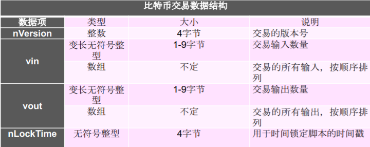
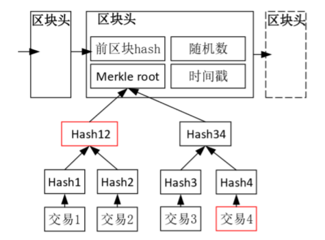

# Bitcoin 数据结构

## Part 01 哈希指针

* 普通指针：`*ptr = &data`，指向数据的位置

* **哈希指针**：`*ptr = H(data)`，不仅指明数据的位置，还可以让你验证这些数据是否已被篡改

  > 就是前一块的哈希值被记录在其后一块的头部的 Previous Block。一个Block根据Previous Block值比对其他的Block的哈希值从而找到上一个Block（我是大概这么理解）

## Part 02 比特币的区块

* **创世区块** Genesis Block：区块链上的第一个区块，任何一个区块一直往前搜寻就可以到达创世区块。创世区块是**在客户端软件中静态编码**的，因此它不能被修改。
* 一个区块的组成：头部（Block Header）和 Body部分（记录一群交易记录 TX）
  * 头部包括：版本号、前一区块的哈希、交易哈希（默克尔树哈希）、产生时的时间戳、难度信息（区块产生的门槛难度）、不重数，头部作为区块的摘要在网络之间进行传输。

> 交易需要得到验证和执行才能够正式被区块链系统确认，比特币系统采用批量确认交易的方法，形成区块。

* 区块：区块链系统可以理解为一个数字账本，一个区块就是账本上的一页，它记录了相对独立的一批交易记录，并在对这些交易进行一次确认

## Part 03 交易 Transaction

* 账户：区块链系统中的所有者，账户之间的货币转移是通过交易来实现的，成为转账，账户的交易余额是通过UTXO计算得到的。
* 输入：表明了比特币从哪里来的
  * 比特币的输入不能凭空产生，必须引用和解锁一个已完成的其他交易的一个输出
  * 因而输入由两部分组成：前一个交易输出的引用和用于解锁这一个输出的解锁脚本
    * 输出的引用通过哈希值和输出在这个交易中的位置决定
    * 解锁脚本通常使用用户本人的密钥生成
* 输出：体现了交易中这些比特币在交易结束后往哪里走（一笔交易可以有多个输出），输出的结构包括主要两个部分：比特币数目和输出的比特币的所有者，后者使用比特币的脚本系统来实现，可以理解成脚本对这个输出的比特币上锁，只有收款人才能解开它的钥匙

> 比特币系统中最小的货币单位：聪，为一亿分之一个比特币

* UTXO模型：未花费交易输出 Unspent Transcation Output
  * 原理：还没有花费出去的交易才能够真正地反映出一 个用户所拥有的比特币
  * 可回溯的交易链条：我们可以对任意的比特币不断回溯，直到最初产生比特币的起点。在这个链条中，每一个节点都是一次比特币的交易，都是一次比特币所有者的签名认证与输出使用。当前任意一个比特币的持有证明，都是通过前面一层又一层交易的签名确认而得到的。最后，最新一笔交易的接收人可以通过验证输出的锁定脚本来确认他是这一比特币链条的所有者
  * 

## Part 04 默克尔树 Merkle Tree

* Merkle树是一种以哈希的形式构造大量数据的方法，并使用单个哈希表示该数据。

  

* 默克尔树、前向哈希都会受篡改的影响，因而比特币能做到防篡改

