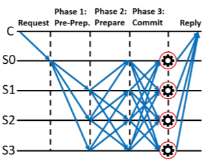

# Bitcoin基础：共识机制

## Part 1：共识机制 Consensus Mechanism 的概念

* 共识机制是区块链的骨干，它通过一种选择性的过程（挖矿）提供一种去中心化的控制。

* 并非所有共识机制都适用于所有类型的区块链。公共的无许可区块链使用PoW而不是权威证明；对于特定的区块链系统，需要选择一个合适的共识算法。

* **共识的定义**：**不信任节点之间对数据最终状态达成一致的过程**。
  * 分布式的共识：在多个节点之间获得一个共同的状态/值，尽管一些节点出现故障
  * 一致性 Agreement：实现多节点的一致
  
* 一致性的要求：

  * 分布式系统达成一致性的过程，应该满足：
    * 可终止性：有限时间内完成
    * 约同性：不同节点最终完成决策的结果是相同的
    * 合法性：决策的结果必须是某个节点提出的提案

  * 对应着三个分布式系统的要求：
    * 活性：系统的可用性
    * 安全性：任何给出的结果必定达成共识
    * 正确性：正确的共识结果

* 一致性存在的问题和挑战：节点间网络通信不可靠，处理时间无法保障，节点可以是恶意的，使用同步调用简化设计会严重降低分布式系统的可扩展性

  * 可以通过同步调用的方法来解决冲突避免，节点可以提前约好某段时间交易执行顺序的决定权，或者通过第三方机构专门处理交易的执行顺序

    

* **共识机制的概念**：**区块链中的大多数或所有节点为同意建议的状态或值而采取的一组步骤**

* 共识机制的目的：所有的共识机制都是为了处理分布式系统中的故障而设计的，并允许分布式系统达成最终的协议状态

* 共识机制的要求：
  * Aggrement 一致性
  * Termination 可约束性、活性
  * Validity 有效性、正确性
  * Fault Tolerant 错误容忍
  * Integrity 节点诚实
  
* **共识机制的类型**：
  
  * BFT-Based 基于传统拜占庭式容错 
    * 不需要计算密集型操作，比如部分哈希反转，它依赖于一个简单的节点方案，这些节点是发布者签名的消息，最后，当接收到特定的消息时，协议就达成了。
    * 运行的很好但受限于节点规模——适用于小规模
    * 
  * Leader Election-based 基于领导选举（例如PoW）
    * 它要求节点去竞争领导人选举的随机选择，只有获胜的节点才能提出最终值
    * 它适用于大规模但运行的比较慢
  
* **区块链的共识机制**：不同区块链采用不同的共识机制

  * 公有链（Permissionless Blockchain 无需许可的区块链）：几乎人人可参与并且是匿名，参与者之间不存在任何信任，所以使用**算力敏感的挖矿**共识来作为激励机制
  * 联盟链、私有链（Permission Blockchain）：在一组已知、已识别、且经过审查的参与者中进行，节点有信任基础，采用BFT类型的共识机制。                                                                                                                                                                                                                                                                                                                                                                                                                                                                                                                                   

## Part 2 为什么比特币需要共识

* 拜占庭将军问题和拜占庭容错算法
  * https://zhuanlan.zhihu.com/p/107439021
* 比特币为何需要共识机制
  * 公有链的几种典型攻击
    * **双花攻击** Double-Spending Attack: A答应给B10个比特币，同时答应给C10个比特币，但是她总共只有 10个比特币，这将导致每个节点记录的账本信息不一致
      * 使用**同等验证**：提交者向其他用户提交一条交易信息，其他用户进行投票（节点在观测到多笔交易使用同一笔比特币时，会对A的提案投出反对票），当获得一定数目投票后，大家同意将交易信息进行保存
    * **多重身份攻击/女巫攻击** Sybil Attack：比特币作为无中心登记的匿名服务，创建多重身份代价极低，多重身份意味着多重的投票权利
      * 对抗方式：提高作恶的代价，采用**资源成本进行投票**，取代用身份投票的机制，也就是**工作量证明 PoW**

* **比特币的共识——基于工作量证明的挖矿**
  * 通过消耗资源解决一个问题获得投票资格（即记账权）
  * 记账权必须通过花费计算资源来获得，比如说通过蛮力解决一个问题；通过**记账奖励**鼓励投入资源
  * 基于哈希函数的特点：正向快速、输入敏感、逆向困难、冲突避免，区块链一般采用SHA2系列哈希算法，如SHA256，SHA512
  * 具体挖矿过程：参与者综合上一区块的哈希值，上一个区块生成之后的新的验证过的交易内容的Markle Root值，加上猜测的一个随机数Nonce，和时间，一起打包到一个候选新区块，让新区块的哈希值小于比特币网络中给定的一个数。
  * 整个争夺记账的过程就是挖矿的过程，也就是比特币发行的过程。
    * 争夺记账权的奖励有比特币奖励和交易手续费
  * PoW的一些规则：每十分钟生成不到1MB的区块，记录着十分钟内验证过的交易内容，串联到区块链尾部，每个区块的成功提交者可以得到系统一定数量的比特币的奖励（该奖励作为区块内的第一个交易，一定区块数后才能使用），以及用户附加到交易上的支付服务费用
    * **每个区块的奖励最初是 50 个比特币，每隔 21 万个区块自动减半，即 4 年时间，现在的出块奖励是 6.25 个比特币，比特币作为通缩的货币，最终在2140年比特币总量稳定在 2100 万个**

* PoW难题的设计需满足如下条件：不容易完成、容易验证、工作过程公平、具有随机性

* 共识模型里的博弈论：

  * 拥有记账权的人更倾向在维护整个体系过程中获利（纳什均衡 + 帕累托最优）

  * 使用网络的人需要付出一定的成本（手续费、计算费）以免滥用（避免公地悲剧） 

  * 少数人作恶的成功几率很低, 参考“赌徒破产问题”（Gambler‘s Ruin problem） 

  * 只有极端势力才有可能不顾一切的颠覆这个体系 

  * 整个局势不存在“确定性” ，一直在动态的多方博弈

    

