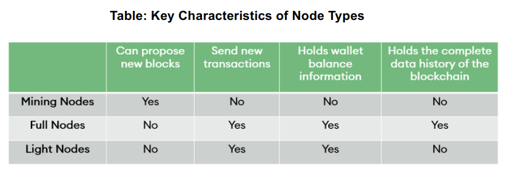

# Lecture 06 Bitcoin 社区与激励

## Part 01 比特币社区

* 比特币是一个点对点的网络，节点之间交换交易和区块。网络中存在不同的节点，一个节点的角色可以有：**验证一个区块，储存一个区块的交易历史，更新区块链中的其他节点，确保区块链中的所有节点都有最新的信息**。

* **比特币社区成员**：全节点（Full Node）或者轻节点（SPV Simple Payment Verification） 

  * 全节点：托管整个区块链历史记录的单个副本，包括事务、时间戳和所有创建的块。
    * 具有全部功能：Wallet、Miner、Full Blockchain Storage、Network Routing Functions
    * 需要更先进的算力和能源，更昂贵，估计全网有超过一万个全节点。
  * 轻节点：更小并只存储部分区块链历史信息（所有区块的区块头），只提供**钱包**和路由功能。
    * 下载钱包并连接到完整的节点以进一步验证存储在区块链上的信息。
    * 能够以较小的代价判断某个支付交易是否已经被验证过（存在于区块链中），以及得到了多少算力保护（定位包含该交易的区块在区块链中的位置）
  * 矿工节点 Miner：  负责创建区块并将其加入到区块链中，他们不负责未来区块的维护或有效性
    * 可以获得奖励（而全节点是没有奖励的，它们都是P2P网络的志愿者，鼓励保存和进一步去中心化区块链。）
    * 不一定要托管所有历史交易记录
    * 矿工有可能为了竞争出块奖励而打包空块（不包含任何交易的区块）  

  

* **矿池** Mining Pools：用于矿工集中算力，矿工们报团取暖， 按照一定的管理规则参与挖矿，遵守某种利益分配规则获得一定的挖矿奖励。

* 比特币社区生态面临的问题：如何维护一个健康的生态？
  * 如何保证矿工会投入大量算力？奖励大于花费
  * 如何保障币值持续高稳？当用户普遍相信区块链安全，无政策干预时
  * 比特币的安全性，生态健康程度与比特币的币值相互以来相互作用
* 社区规则的更新：（参考Lecture05分叉）
  * 软分叉：对现有规则的收紧，旧结点生成的一些区块新节点无法接受，旧结点有很强动机升级，区块链不会分裂。
  * 硬分叉：对现有规则的放宽，旧结点拒绝新节点生成的一部分区块，区块链分裂。

## Part 02 挖矿的激励与策略

* 矿工的出块激励：出块奖励和交易手续费

* 矿工挖矿的策略：
  * 打包哪些交易？矿工可以选择将哪些交易放到他的区块里，默认的规则是选择交易费比较高的交易
  * 对那一个区块进行挖矿运算？矿工可以选择在哪个区块上进行挖矿，默认的做法是在最长的那条区块链上继续挖下去
  * 如何在同一高度的多个区块中做选择？默认的做法是选择最先被监听到的那一个区块
  * 何时宣布新的区块：矿工找到一个有效区块之后，他们要决定什么时候向比特币网络
    宣布这一个区块，默认的做法是立刻宣布，但他们也可以选择自私挖矿或者发动截流攻击。
* 矿工挖矿的恶意策略：
  * 挖空块现象：为了更快地拿到出块奖励，提交交易记录为空的块（因为体积小，传播快）
  * 合谋：（如果他们集体伪造交易，用户对比特币失去了信心，没人再去使用比特币，那么矿工伪造了交易盗取比特币就失去了意义。）
    * 51%攻击
      * 6个确认机制：收款方等到全网的 6 个区块确认之后再交付商品，6个区块后再对全网进行篡改的难度很高。
    * 通过贿赂进行分叉攻击