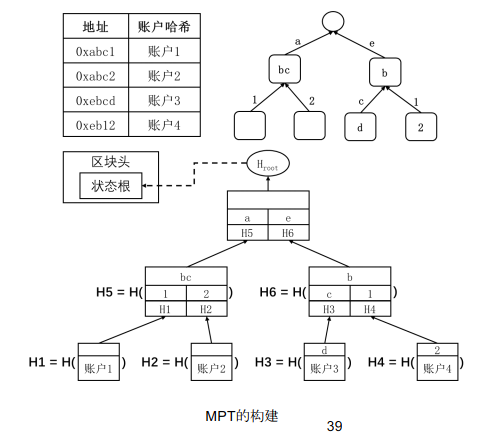
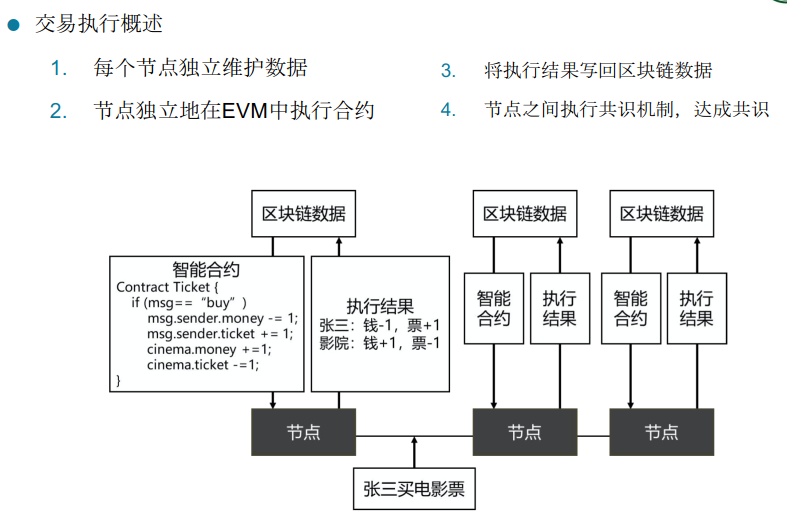

# Lecture 08 以太坊

* 比特币和以太坊是两种最主要的加密货币，比特币是区块链1.0，以太坊是区块链2.0  

## 8.1 以太坊概述

* 传统合约的问题：
  * 自动化维度：条件满足时交易也未必会继续
  * 主客观维度：公证人的主观意识会影响到合约规则
  * 执行时间维度：整个合约过程繁琐浪费时间
  * 违约惩罚维度：一方违约未必会受到处罚，难以追责
* 智能合约：指能够自动执行合约条款的计算机程序
  * 中心化环境下智能合约的弊端：容易受到篡改，出错后难以追溯恢复
  * 应用在区块链上的智能合约：
    * 区块链作为一种能够使多方间达成状态一致的有效手段，具有公开透明、不可篡改、多方验证、永久运行等特性。
    * 将智能合约应用到区块链上，能使智能合约具备高可靠性。

* 以太坊上的智能合约：
  * 以太坊在多个节点组成的点对点网络中，维护共同的区块链数据，**通过区块链上的交易来进行智能合约的创建、调用、结束等操作。**
  * 多个节点所维护的区块链状态是一致的，因此多个节点上运行智能合约的过程和结果也是一致的。
  * 以太坊是第一个支持智能合约的区块链系统，使用 ther 作为数字加密货币，也是目前生态社区最活跃的区块链系统，出现了大量的去中心化自治组织和去中心化应用。

* some 应用：溯源存证、数字货币发行和流通、数据共享、游戏

## 8.2 以太坊区块数据结构

* 区块数据：打包一批执行后的交易
* 区块头：父块哈希、叔块哈希、矿工地址、状态树哈希、交易树哈希、收据树哈希、Bloom Filter、挖矿难度、区块号、Gas上限、所有交易gas之和、区块时间戳、可变长度字段、工作量证明摘要、挖矿Nonce值  
* 区块体：交易组成的交易列表、由交易执行信息组成的收据列表，用于改进以太坊共识过程的叔块列表

## 8.3 以太坊的账户模型

* 分布式储存
* 地址的生成：计算椭圆曲线下的私钥与公钥，对公钥使用KECCAK256哈希算法，计算得到一个64位的16进制哈希值（256比特），截取哈希值的后40位作为一个以太坊地址
* 账户的结构：账户结构保存了用户地址对应账户的数据信息
  * 余额：记录当前地址持有的以太币的数额，单位是Wei
  * Nonce：记录这个地址创建以来累计发起的交易次数（防止交易重放问题）
    * 只有账户的Nonce和交易的Nonce能够对应的情况下，交易才是合法的
    * Nonce 可以控制账户交易发起的顺序
  * 以太坊的两种账户：
    * 外部账户：有余额、无代码、能够发起交易、由私钥控制
    * 合约账户：有余额、有代码、能被触发执行智能合约代码，在智能合约创建后自动执行。 

## 8.4 以太坊的状态树

* 以太坊的账户状态：Nonce + 账户余额 + 智能合约代码的哈希值 + 合约存储树根节点的哈希值

* 合约存储树：合约账户下的存储也是一个映射表，它记录了从存储地址到存储值的一个映射关系；在合约账户的数据结构中存储了这个映射表的哈希值，这个哈希值被称作存储根（Storage Root），它同样是由一棵 MPT 来维护和计算  

* 系统的全节点需要维护账户状态，如果只用哈希表来实现账户地址到状态的映射，有什么弊端？

  * 如果要证明某个账户有多少钱， 需要将哈希表的内容组织成一个 Merkle Tree, 计算出根哈希值，将根哈希值存储在 Block Header 中，但是，当一个新的区块发布，执行了新的交易必然导致哈希表的内容发生变化，则每次发布新的区块都需要将哈希表的内容重新组织一次 Merkle Tree，计算代价太大  

* Trie字典树、压缩前缀树、默克尔压缩前缀树（MPT）

  * 按照所有数据的地址（或者键值）来构建一棵压缩前缀树，按照构建得到的压缩前缀树，从叶子节点开始，逐步计算每一层的哈希值，并将其汇合到父节点中，与 Merkle Tree 的计算过程类似。

    

* 状态树：
  * 以太坊用来记录各个账号的状态的树，树的键是账户的地址，值是账户的详细信息
  * 当新区块形成时，区块链节点存储的是生成的一个新的状态树，而不是修改原来的状态树。其中大部分节点的内容是共享的。  

## 8.5 以太坊的收据、交易树、Bloom Filter

* 收据：对应交易的数据结构，代表了交易执行的一些 中间状态的写入 和 交易的执行结果 等信息  
* 交易树：对于以太坊区块中的所有交易和交易的收据，都可以使用 MPT 进行组织和证明  
  * 交易树：通过交易或者收据在区块中的序号来构建 MPT  
  * 收据树和交易的信息一一对应。主要是考虑到智能合约的执行比较复杂，收据树可以有利于快速查询，证明交易结果  
  * 使用MPT的原因是：以太坊其他数据结构都采用 MPT， 代码统一，利于管理；查找效率高。
* Bloom Filter：以太坊中通过布隆过滤器对收据的日志进行索引  
  * 布隆过滤器可以用于快速检索一个值是否在一个集合中。在容忍一定的误识别率的条件下，它有着远超过一般算法的空间效率和时间效率。  
  * 原理：通过多个哈希函数将键值映射到位图之中，并在位图中合并（标记）集合中所有键值的映射结果。 对于一个键值，如果经过同样的哈希函数映射之后，出现了在位图中没有出现的标记位，那么这个键值必定不存在于集合之中。
  * 性质： 可以保证某个元素一定不在集合里， 但不能保证元素一定在集合中。 即会误报， 但不会漏报  

## 8.6 以太坊基本架构和原理

* 状态模型：可以把账户的余额泛化成一种账户的状态，而把转账交易当作是改变状态的一个方法  

  * 以太坊状态转移：智能合约 + 以太坊虚拟机

* 共识模型：

  * 相比比特币的UTXO模型，状态转换模型虽然使得智能合约的各种变量存储、传参等变得更加灵活，但也带来了多方共识上的困难，如发生分叉时的处理  
  * 在以太坊的状态转换模型中，如果发生分叉，需要回到分叉前的状态，重新验证另一条分支上的区块
  * 以太坊状态的存储采用了状态树结构，其根哈希记录在区块头中，记为 stateRoot，从而使得状态能够在全网得到共识确认，并在分叉时能够快速回滚。  

* 以太坊简易架构：

  

## 8.7 以太坊交易

* 交易触发状态转移

* 交易承载了**账户转移（to为外部账户）、合约创建（to为空的交易）和调用合约（to为合约账户的交易）**等功能

* 交易内容：**基本交易、驱动智能合约、交易的签名**

* 交易周期：发起、广播、打包并执行、验证并执行

  * 交易发起：
    * 设定交易内容：用户在本地的以太坊钱包软件中选择要发送交易的地址（from）输入目标地址（to）、金额（value）、是否部署或调用合约（data）、**手续费单价**（gasPrice）等  
    * 发起交易：用户确认发送至以太坊节点，多个用户各自保有钱包私钥，而通过同一个以太坊节点广播交易

  * 交易广播：
    * 节点收到（或自己发起）交易后，对交易进行验证  
    * 节点验证交易为合法交易后，将交易加入节点的交易池中 
    * 节点验证交易通过后，除了加入节点的交易池中，还会根据 P2P 网络广播的策略**向相邻节点继续广播该交易**  
  * 打包和执行：
    * 交易进入内存池后，具有挖矿功能的全节点，开始打包下一个区块 
    * 节点将交易打包时，对交易进行逐个执行，每笔以太坊交易都是对以太坊状态的修改  
    *  在所有需要打包的交易执行后，交易、状态以及收据的信息也会打包到区块中  
    * 记账节点在打包交易并获得合法的区块后，将区块（包含交易数据）广播到网络中的相邻节点  
  * 验证和执行：没有获得记账权的节点，在收到广播的区块后，对区块进行合法性的验证，并进行交易的执行  

## 8.8 以太坊的共识机制：PoW ，未来将过渡为PoS

* 以太坊的PoW与区块链的PoW的不同之处在于所使用的哈希算法不同，前者使用ethash算法，后者使用的是SHA256。
* ethash算法的特点是对内存有要求（通过读写IO降低算法速度），可以阻止专用芯片（ASIC）的使用。
* **以太网的出块时间很短，只有15秒**，由于网络延迟，新发布区块可能还没能成功扩散到整个网络，使得分叉成为常态。
  * 打击矿工积极性，在分叉上挖矿导致分散算力，降低攻击者的攻击难度
  * **GHOST协议**：为了鼓励分叉的合并
    * **叔父块 Uncle Block**：父块的同级分叉区块，七代以内友共同祖先的都可以认为是叔父块。
    * 一个区块最多接纳两个叔父块，被接纳过就不能再重复接纳了，一个块打包它的叔父块可以获得额外奖励（接纳的区块数 * 1/32），叔父区块可以获得叔块奖励（每层减1/8奖励），奖励随层数的减小而降低（只限前2-7层）
    * 叔父区块的交易是不会被执行的

## 8.9 以太坊挖矿难度调整 

* 区块链是出2016个块时进行一个难度调整（大概是两星期的时间）

* 而以太坊：**出一个新块的难度要考虑上一个区块的难度（是一个比较平滑的过程），难度由基础部分和难度炸弹组成。**

  * 难度炸弹每十万个区块扩大一倍，等到大家都挖不可矿时整改共识机制到PoS

    