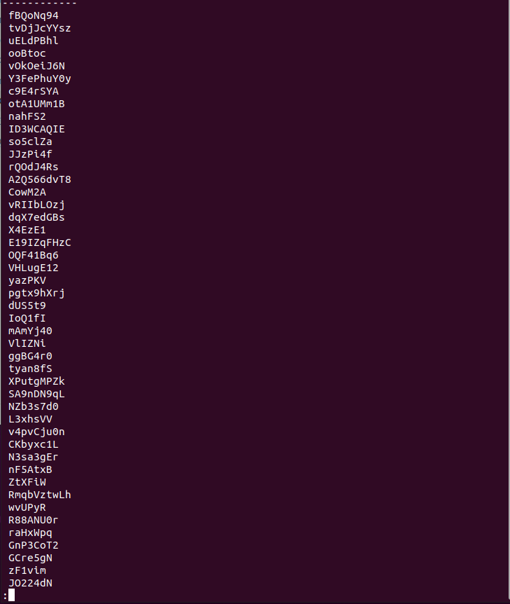
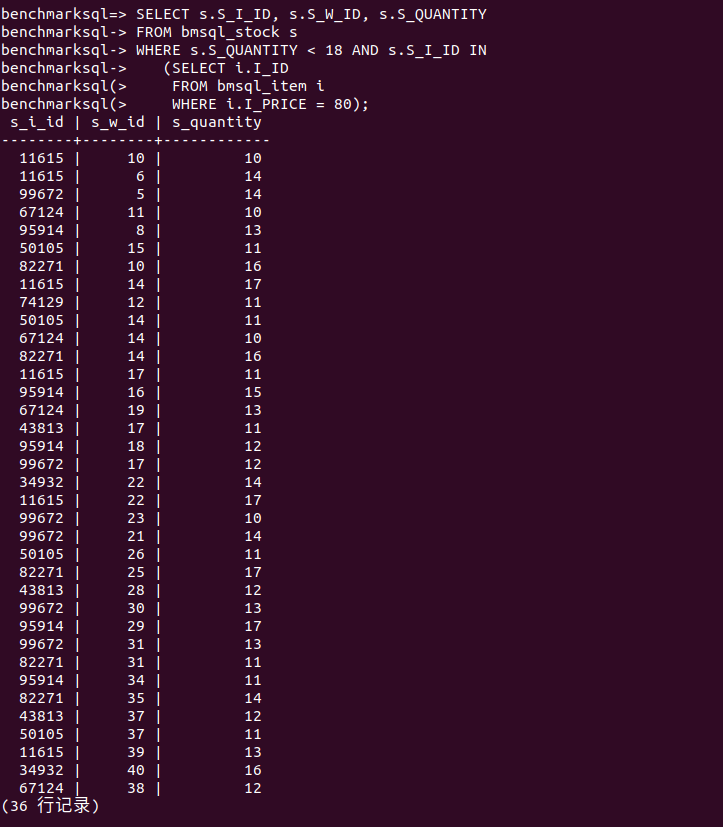
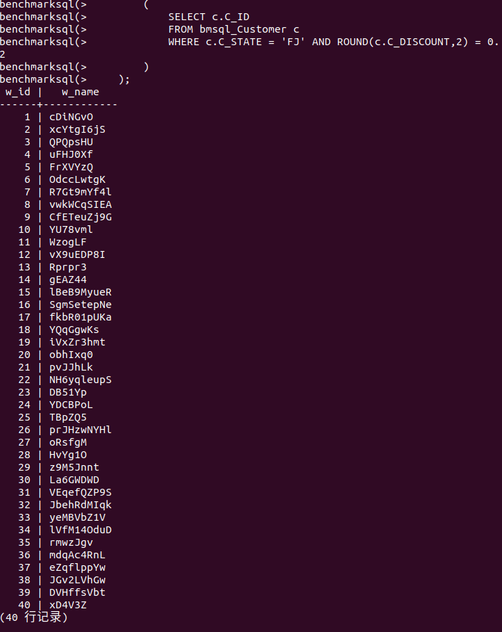
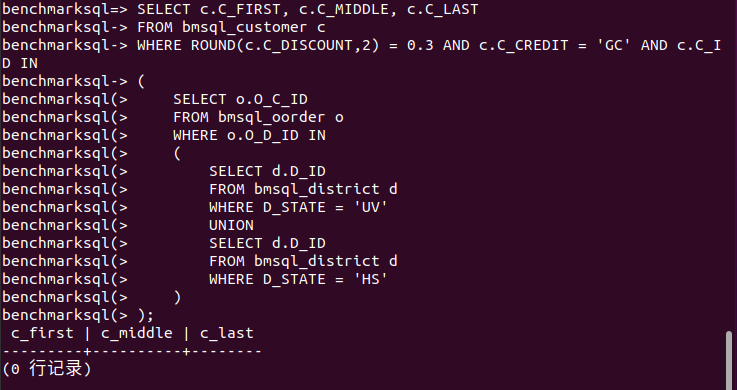

<center><h1>第一次数据库作业</h1></center>

<center><b>19335286 郑有为</b></center>


1. 找出销售税小于0.15的销售区域,显示这些销售区域的名字(不输出重复的名字)。;

   ``` sql
   SELECT DISTINCT D_NAME 
   FROM bmsql_district 
   WHERE D_TAX < 0.15;
   ```

   查询结果：（共302条记录）

   

   

2. 找出给state HS(销售区域)供货的仓库都来自哪个state和city。

   ``` sql
   SELECT x.W_STATE, x.W_CITY
   FROM bmsql_warehouse x, bmsql_district y
   WHERE y.D_STATE = 'HS' AND x.W_ID = y.D_W_ID;
   ```

   查询结果：(共0条记录，不存在一个名为HS的州)

   

3. 找出在某个仓库中货物数量少于18而且价格为80的货物和对应的仓库,输出这些货物的ID、对应仓库的ID和货物的剩余数量。(提示:在STOCK表和ITEM表中查询)

    ``` sql
    SELECT s.S_I_ID, s.S_W_ID, s.S_QUANTITY
    FROM bmsql_stock s
    WHERE s.S_QUANTITY < 18 AND s.S_I_ID IN
    (
        SELECT i.I_ID
        FROM bmsql_item i
        WHERE i.I_PRICE = 80
    );
    ```

    查询结果：（共36条记录）

	

4. 找出满足以下要求的仓库的ID和名字(不输出重复的ID和名字):有来自福建省(state为FJ)且享有八折优惠的顾客购买过该仓库的商品。

    ``` sql
    SELECT DISTINCT w.W_ID, w.W_NAME 
    FROM bmsql_warehouse w
    WHERE w.W_ID IN
    (
        SELECT h.H_W_ID
        FROM bmsql_history h
        WHERE h.H_C_ID IN
        (
            SELECT c.C_ID
            FROM bmsql_Customer c
            WHERE c.C_STATE = 'FJ' AND ROUND(c.C_DISCOUNT,2) = 0.2
        )
    );
    ```

    **购买过**：在history中查找交易记录。如果在order中的购买记录也算“购买过”，就在倒数第二个右括号后面加上

    ``` sql
    UNION
        SELECT o.O_W_ID
        FROM bmsql_oorder o
        WHERE o.O_C_ID IN
        (
            SELECT c.C_ID
            FROM bmsql_Customer c
            WHERE c.C_STATE = 'FJ' AND ROUND(c.C_DISCOUNT,2) = 0.2
        )
    ```

    这样查询的结果也是一样的。

    查询结果：（共40条记录，也就是所有的仓库都满足查询条件）

    

    **备注：不是很明白八折的意思，而经查询顾客的C_DISCOUNT都为四位小数，并且没有顾客折扣率刚好等于0.2000，故查询过程中选取了折扣率四舍五入为0.20（20%，八折)的顾客。**

5. 找出享有七折优惠而且信用良好,同时在state UV或HS(销售区域)有购买商品的顾客,显示他们的姓名。(包括中间名)

    “有购买”：在order中而不是history中查找订单，与“购买过”区分开。
    
    ``` sql
    SELECT c.C_FIRST, c.C_MIDDLE, c.C_LAST
    FROM bmsql_customer c
    WHERE ROUND(c.C_DISCOUNT,2) = 0.3 AND c.C_CREDIT = 'GC' AND c.C_ID IN
    (
        SELECT o.O_C_ID
        FROM bmsql_oorder o
        WHERE o.O_D_ID IN
        (
            SELECT d.D_ID
            FROM bmsql_district d
            WHERE D_STATE = 'UV'
            UNION
            SELECT d.D_ID
            FROM bmsql_district d
            WHERE D_STATE = 'HS'
        )
    );
    ```

    查询结果：（0条记录，因为UV和HS州都不存在）

    
    
    **备注：折扣率采取四舍五入为0.30（30%，七折)的顾客。**

