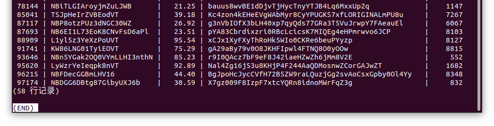

<center><h1>第二次数据库作业</h1></center>

<center><b>19335286 郑有为</b></center>


### 一、统计函数的使用：

1. **在表item中计算所有商品的数量，价格平均值，价格最大值，价格最小值，价格方差。**

   **查询代码**：

   ``` sql
   SELECT COUNT(*), AVG(I_PRICE), MAX(I_PRICE), MIN(I_PRICE), VARIANCE(I_PRICE)
   FROM bmsql_item;
   ```

   **查询结果**：

   

2. **在表stock中统计每个仓库保存的商品数量平均值，输出列为w_id, avg。**

   **查询代码**：
   
   ``` sql
   SELECT S_W_ID AS w_id, AVG(S_QUANTITY) AS avg
   FROM bmsql_stock
   GROUP BY S_W_ID;
   ```
   
   **查询结果**：
   
   


### 二、正则表达式的使用：

1. **找出所有以'NB'为名字开头或者以’VT‘为结尾的商品的所有信息；**

   **查询代码**：

   ``` sql
   SELECT * 
   FROM bmsql_item
   WHERE I_NAME ~ '^NB|VT$';
   ```

   **查询结果**：共58条记录。

   

   

2. **统计以名字开头字母在h-m之间的商品数量，以及平均价格。**

   ``` sql
   SELECT COUNT(*), AVG(I_PRICE)
   FROM bmsql_item
   WHERE I_NAME ~ '^[h-m]';
   ```
   
   **查询结果**：共1条查询记录。
   
   


### 三、**all/any**的使用：

> 我们作以下定义：
>
> 如果商品a在仓库b中的数量大于10，则称为仓库b有储备商品a；
>
> 如果数量大于50，则称仓库b有充分储备商品a；
>
> 如果数量大于95，则称仓库b主要储备商品a。

1. **对于二.1中的商品，找出在所有仓库中都有储备的商品，输出商品的所有信息。**

   **查询代码**：

   ``` sql
   SELECT * 
   FROM bmsql_item
   WHERE I_NAME ~ '^NB|VT$' AND 10 < ALL (
   	SELECT S_QUANTITY 
   	FROM bmsql_stock 
   	WHERE S_I_ID = I_ID
   );
   ```

   **查询结果**：共31条记录。

   

2. **找出至少有一个仓库主要储备且该仓库销售税（w_tax）大于0.16的商品 （使用any），输出这些商品的所有信息。**

   **查询代码**：
   
   ``` sql
   SELECT *
   FROM bmsql_item
   WHERE 95 < ANY (
   	SELECT S_QUANTITY 
   	FROM bmsql_stock 
   	WHERE S_I_ID = I_ID AND S_W_ID IN (
   		SELECT W_ID
   		FROM bmsql_warehouse
   		WHERE W_TAX > 0.16
   	)
   );
   ```
   
   **查询结果：**共32689条记录。
   
   
   
   注：
   
   * 查询的条目太多了，修改查询代码来得到总条数
   
   
   
   * 这是使用IN代替ANY查询的代码，查询结果与上述查询一致
   
     ``` sql
     SELECT *
     FROM bmsql_item
     WHERE I_ID IN (
     	SELECT S_I_ID
     	FROM bmsql_stock
     	WHERE S_QUANTITY > 95 AND S_W_ID IN (
     		SELECT W_ID
     		FROM bmsql_warehouse
     		WHERE W_TAX > 0.16
     	)
     );
     ```
   
     

### 四、嵌套查询**(in)**：
1. **找到有商品税大于0.18的仓库主要储备的所有商品，输出它们的所有信息。**

   **查询代码**：

   ``` sql
   SELECT *
   FROM bmsql_item
   WHERE 95 < ANY (
   	SELECT S_QUANTITY 
   	FROM bmsql_stock 
   	WHERE S_I_ID = I_ID AND S_W_ID IN (
   		SELECT W_ID
   		FROM bmsql_warehouse
   		WHERE W_TAX > 0.18
   	)
   );
   ```

   **注解**：

   * 内层语句：找到所有商品税大于0.18的仓库的仓库ID；

     ```sql
     SELECT W_ID
     FROM bmsql_warehouse
     WHERE W_TAX > 0.18
     ```

   * 中间层语句：从库存表查询所有仓库ID属于内层查询结果，商品ID为外层指定的商品数量；

     ``` sql
     SELECT S_QUANTITY 
     FROM bmsql_stock 
     WHERE S_I_ID = I_ID AND S_W_ID IN (...)
     ```

   * 外层语句：根据中间层查询出的商品数目，使用ANY语句，只要该商品满足存在一个仓库该商品库存大于95即满足条件，输出满足ANY条件的商品的全部信息。

     ``` sql
     SELECT *
     FROM bmsql_item
     WHERE 95 < ANY (...);
     ```

   **查询结果**：共20182条记录。

   

   注：查询的条目太多了，修改查询代码来得到总条数。

   

2. **找到主要贮备有以'SP'为开头的商品的仓库，输出仓库的所有信息。**

   **查询代码**：
   
   ``` sql
   SELECT *
   FROM bmsql_warehouse
   WHERE W_ID IN (
   	SELECT S_W_ID
   	FROM bmsql_stock
   	WHERE S_QUANTITY > 95 AND S_I_ID IN (
   		SELECT I_ID
   		FROM bmsql_item
   		WHERE I_NAME ~ '^SP'
   	)
   );
   ```
   
   **注释**：
   
   * 最内层语句：找到所有以“SP”开头的商品的ID；
   
     ```sql
     SELECT I_ID
     FROM bmsql_item
     WHERE I_NAME ~ '^SP'
     ```
   
   * 中间层语句：从库存表中查找主要存有（即商品库存数目大于95）内层所查到的商品的仓库ID；
   
     ``` sql
     SELECT S_W_ID
     FROM bmsql_stock
     WHERE S_QUANTITY > 95 AND S_I_ID IN (...)
     ```
   
   * 外层语句：根据中间层查询出的仓库ID，从仓库表输出对应仓库的全部信息。
   
     ``` sql
     SELECT *
     FROM bmsql_warehouse
     WHERE W_ID IN (...)
     ```
   
   **查询结果**：
   
   


### 五、综合题：

1. **找到以'SP'为开头，且在所有仓库储存的平均数量大于50的商品的全部信息。**

   **查询代码**：

   ``` sql
   SELECT * 
   FROM bmsql_item
   WHERE I_NAME ~ '^SP' AND 50 < (
   	SELECT AVG(S_QUANTITY)
   	FROM bmsql_stock
   	WHERE I_ID = S_I_ID
   );
   ```

   **注解**：

   * 内层语句：通过查询库存表，计算外层指定的商品在所有仓库中的平均库存；

     ``` sql
     SELECT AVG(S_QUANTITY)
     FROM bmsql_stock
     WHERE I_ID = S_I_ID
     ```

   * 外层语句：输出所有满足名称以`SP`开头，平均库存大于50的商品的全部信息。

     ``` sql
     SELECT * 
     FROM bmsql_item
     WHERE I_NAME ~ '^SP' AND 50 < (...);
     ```

   **查询结果**：（共26条记录）

   

   

2. **找到所有满足条件的仓库的编号(w_id)：该仓库在所有地区的销售税都小于0.15。**

   **查询代码**：

   ``` sql
   SELECT W_ID
   FROM bmsql_warehouse
   WHERE 0.15 > ALL (
   	SELECT D_TAX
   	FROM bmsql_district
   	WHERE D_W_ID = W_ID
   );
   ```

   **注解**：

   * 内层语句：从区域表中查询外层指定仓库的售卖街区的销售税；

     ``` sql
     SELECT D_TAX
     FROM bmsql_district
     WHERE D_W_ID = W_ID
     ```

   * 外层语句：从仓库表中查询满足所其所有销售街区的销售税都小于0.15的仓库的仓库ID。

     ``` sql
     SELECT W_ID
     FROM bmsql_warehouse
     WHERE 0.15 > ALL (...);
     ```

   **查询结果**：（共1条记录）

   

   

3. **统计五.2中的仓库主要储备的商品数量，价格平均值，输出列为w_id, number, avg_price。**  

   **查询代码**：
   
   ``` sql
   SELECT S_W_ID AS w_id, COUNT(I_ID) AS number, AVG(I_PRICE) AS avg_price
   FROM bmsql_stock, bmsql_item
   WHERE I_ID = S_I_ID AND S_W_ID IN (
   	SELECT W_ID
   	FROM bmsql_warehouse
   	WHERE 0.15 > ALL (
   		SELECT D_TAX
   		FROM bmsql_district
   		WHERE D_W_ID = W_ID
   	)
   ) AND S_QUANTITY > 95
   GROUP BY S_W_ID;
   ```
   
   **注解**：
   
   * 内层语句：查询并返回所有中间层指定的仓库的对应销售街区的销售税；
   
     ``` sql
     SELECT D_TAX
     FROM bmsql_district
     WHERE D_W_ID = W_ID
     ```
   
   * 中间层语句：使用`ALL`来筛选出所有销售区域的销售税都小于0.15的仓库，返回仓库的ID；
   
     ``` sql
     SELECT W_ID
     FROM bmsql_warehouse
     WHERE 0.15 > ALL (...)
   
   * 外层语句：
   
     * 将库存表与商品表做条件连接，连接条件有3个：
       * `I_ID = S_I_ID`：商品ID匹配；
       * `S_W_ID IN (...)`：仓库ID为中间层查询结果；
       * `S_QUANTITY > 95`：该商品在对应仓库中的库存大于95（满足主要储备）；
   
     * 分别使用数学函数`COUNT`和`AVG`来计算商品数目和平均价格，分组（`GROUP BY`）依据为仓库ID；
     * 最后使用`AS`为各输出列重命名。
   
     ``` sql
     SELECT S_W_ID AS w_id, COUNT(I_ID) AS number, AVG(I_PRICE) AS avg_price
     FROM bmsql_stock, bmsql_item
     WHERE I_ID = S_I_ID AND S_W_ID IN (...) AND S_QUANTITY > 95
     GROUP BY S_W_ID;
   
   **查询结果**：共1条记录
   
   

