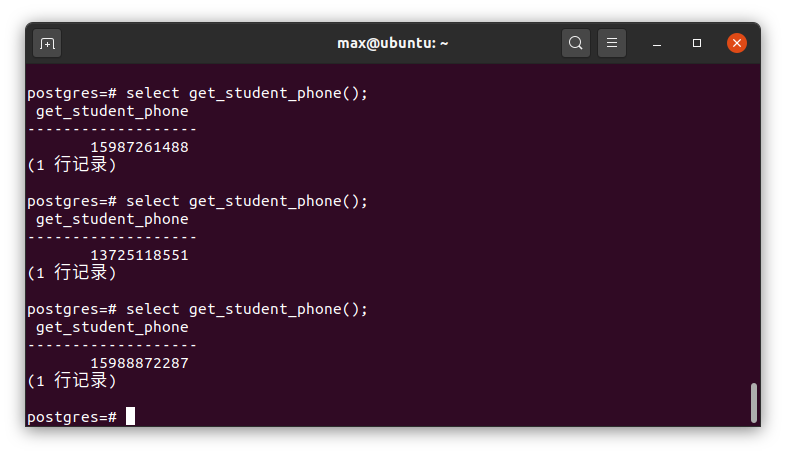
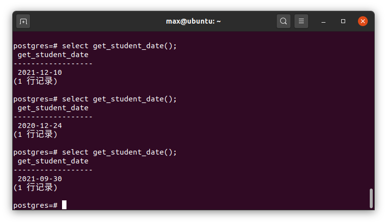
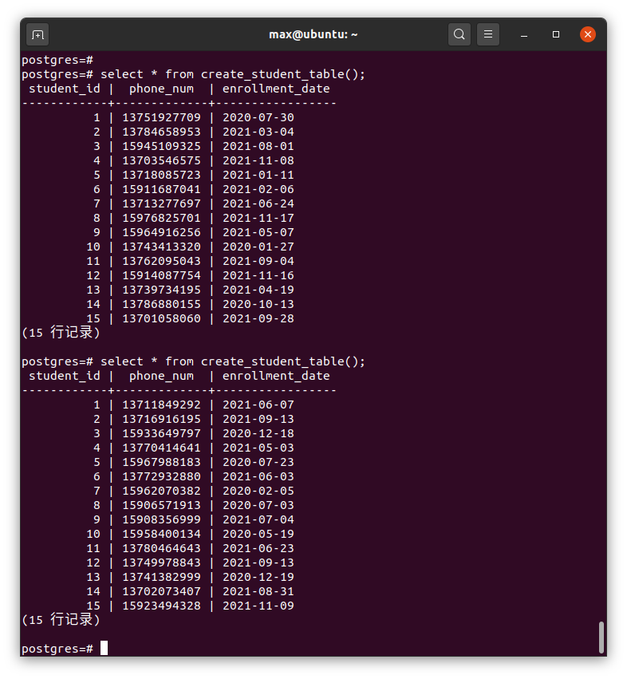
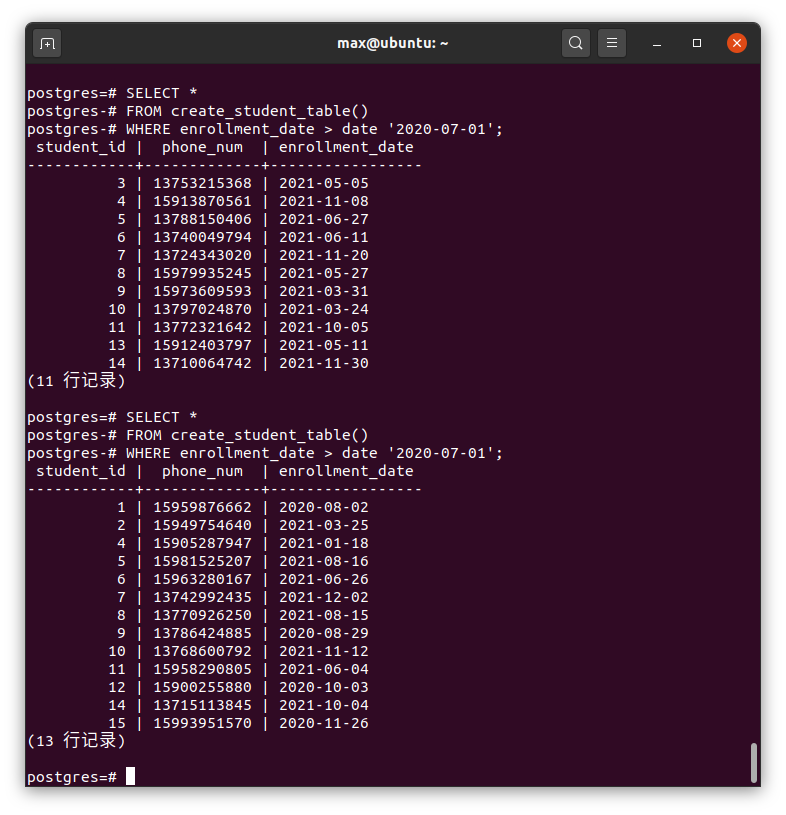

<center><h1>第三次数据库作业</h1></center>

<center><b>19335286 郑有为</b></center>


1. **编写一个函数，函数名为 get_student_phone ，无接收参数，返回一个随机的手机号，长度11位，手机号以'159'或 '137'开头，要求任意满足该要求的手机号能等概率生成**

   **函数代码**：

   ``` sql
   /* DROP 清除之前创建的函数 */
   DROP FUNCTION get_student_phone(); 
   
   /* get_student_phone 函数 */
   CREATE FUNCTION get_student_phone() RETURNS bigint AS $$
   DECLARE
   	head1 bigint := 13700000000;
   	head2 bigint := 15900000000;
   	s_phone bigint := 0;
   	ten int := 1;
   BEGIN
   	IF RANDOM() > 0.5 THEN
   		s_phone := head1;
   	ELSE
   		s_phone := head2;
   	END IF;
   	
   	FOR i IN 1..8 LOOP
   		s_phone := s_phone + ten * FLOOR(RANDOM() * 10);
   		ten := ten * 10;
   	END LOOP;
   	
   	RETURN s_phone;
   END;
   $$ LANGUAGE plpgsql;
   
   /* SELECT调用函数 */
   select get_student_phone(); 
   ```

   **注解**：

   * 使用一个长整型 bigint 来记录电话号码；
   * 使用整数加法来实现固定最高位为 137 或者 159：
     * 若取得随机数位于 [0.5, 1)，则 + 13700000000；
     * 若取得随机数位于 [0, 0.5)，则 + 15900000000；
   * 对于剩下的 8 位数字，每次使用随机数获得 0~9 内的一个数字，然后依次加到号码的后八位上。

   **返回结果**：三组不同的输出结果

   

2. **编写一个函数，函数名为 get_student_date ，无接收参数，返回一个随机的日期，日期格式为'YYYY-MM-DD'。要求返回的日期区间为 [2020-01-01, 2021-12-31] ，其中，要求生成2020年份概率为60%，生成2021年份概率为40%，此外，月和日则是等概率返回。**

   **函数代码**：

   ``` sql
   /* DROP 清除之前创建的函数 */
   DROP FUNCTION get_student_date();
   
   /* get_student_date 函数 */
   CREATE FUNCTION get_student_date() RETURNS date AS $$
   DECLARE
   	s_date date;
   	s_day int = 0;
   BEGIN
   	IF RANDOM() < 0.6 THEN
   		s_date := make_date(2021, 1, 1); 
   		s_day := FLOOR(RANDOM() * 364);
   		s_date := s_date + s_day;
   	ELSE
   		s_date := make_date(2020, 1, 1); 
   		s_day := FLOOR(RANDOM() * 365);
   		s_date := s_date + s_day;
   	END IF;
   	RETURN s_date;
   END;
   $$ LANGUAGE plpgsql;
   
   /* SELECT调用函数 */
   select get_student_date();
   ```

   **注解**：

   * 使用 date 类型保存日期，对年份随机数：

     * 若取得随机数位于 [0.0, 0.6)（即60%概率），则生成2020年；
     * 若取得随机数位于 [0.6, 1)（即40%概率），则生成2021年；

   * 接下来使用日期与整形的运算实现随机获得月份和日：

     > 这样可以避开对不同月份的天数的判定，例如：
     >
     > | `date '2001-09-28' + integer '7'` | `date '2001-10-05'` |
     > | --------------------------------- | ------------------- |

     * 2020年共有 366 天，故随机取 [0,366) 之间的一个整数作为天数，2020年1月1号加上这个天数即可获得随机日期；
     * 2021年共有 365 天，故随机取 [0,365) 之间的一个整数作为天数，2021年1月1号加上这个天数即可获得随机日期。

   **返回结果**：三组不同的输出结果

   

3. **编写一个函数，函数名为 create_student_table，无接收参数。在该函数中，新建一个数据表 student，该数据表拥有3个字段，分别是 student_id, phone_num, enrollment_date，其中 student_id 为自增的序列，从1开始自增，且为主键；然后，往该数据表新增 15条记录，这 15条记录中，phone_num 和 enrollment_date 分别使用上述自己编写的第一个和第二个函数生成。最后返回该表。该函数理应可以连续调用多次，每次生成并返回的表都不一样。**  

   **函数代码**：

   ``` sql
   /* DROP 清除之前创建的函数 */
   DROP FUNCTION create_student_table();		
   
   /* create_student_table 函数 */
   CREATE FUNCTION create_student_table(OUT student_id int, OUT phone_num bigint, OUT enrollment_date date) RETURNS SETOF record AS $$
   DECLARE
   	student_table record;
   BEGIN
   	FOR i IN 1..15 LOOP
   		student_id := i;
   		phone_num := get_student_phone();
   		enrollment_date = get_student_date();		
   		RETURN NEXT;
   	END LOOP;
   END;
   $$ LANGUAGE plpgsql;
   
   /* SELECT * FROM 查看返回的表 */
   select * from create_student_table();
   ```

   **注解**：

   * 使用 `SETOF record`（记录的集合）作为返回值，并指定返回的记录各元素的类型和名称：`OUT student_id int, OUT phone_num bigint, OUT enrollment_date date`

   * 使用循环生成 15 组记录，每次都调用 `get_student_phone()` 和 `get_student_date()`，并使用 `RETURN NEXT` 将每一次结果添加到输出集合中。

   **返回结果**：两组不同的输出结果

   

4. **使用 student表，找出所有 enrollment_date 在2020年7月1日（包括这一天）之后的学生，并输出其 phone_num。**  

   **查询代码**：

   ```
   SELECT *
   FROM create_student_table()
   WHERE enrollment_date > date '2020-07-01';
   ```

   **注解**：

   * 使用 date 加 符合规范的日期字符串即可生成一个日期变量
   * 对 date 可以直接使用比较运算符，靠后的日期大于靠前的日期

   **查询结果**：

   