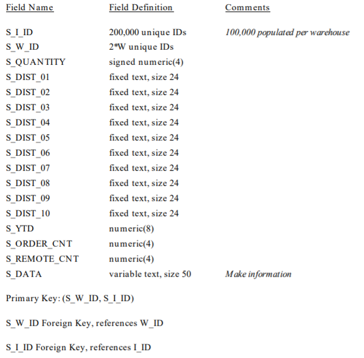

# TCP-C 快速指引

* 该基准所描述的公司是一个**批发供应商，拥有多个地理上分布的销售区域和相关的仓库**。随着公司业务的扩展，新的仓库和相关的销售区域被创建。

  * 每个地区的仓库覆盖**10个区域**。
  * 每个区服务**3000名客户**。
  * 所有仓库都有公司销售的**100,000件商品的库存**。

  下面的图表说明了TPC-C业务环境的仓库、区域和客户层次结构：

  

  * **客户打电话给公司下新订单或请求现有订单的状态**。
  * 订单平均由**10个订单行**(即行项目)组成。
  * 所有订单中有**百分之一用于区域仓库中没有库存的商品**，并且必须由另一个仓库提供。

  * 该公司的系统还用于输入来自客户的付款，处理交付订单，并检查库存水平，以确定潜在的供应短缺。

* **数据库实体、关系和特征**

  * TPC-C数据库的组件被定义为由9个独立的表组成，这些表之间的关系在实体关系图中定义

    

    > 备注：
    >
    > * 所有显示的数字说明了数据库人数需求。
    > * 实体块中的数字表示表的基数(行数)。这些数字由仓库的数量W分解，以说明数据库的伸缩性。
    > * 关系箭头旁边的数字表示关系的基数(每个父母的平均子女数量)。
    > * 加号(+)用于关系或表的基数之后，以说明随着行的添加或删除，这个数字在测量间隔内的初始数据库填充中会发生小的变化 

* **Table Layouts**
  * 下面的列表定义了每个表的最小结构(属性列表):
    * **N unique IDs** 意味着该属性必须能够在最小N个唯一ID集合中保存任何一个ID，不论该属性使用何种物理表示。
    * **variable text, size N** 意味着属性能够容纳任何*最大长度为N*的可变长字符串，如果属性存储为固定长度字符串而字符串只有小于N个字符，则必须用空格填补。
    * **fixed text, size N** 意味着该属性能够容纳任何固定长度为N的字符串。
    * **date and time** 表示日期值的数据类型，其中包含时间组件。
      * 日期组件：1900年1月1日至2100年12月31日之间的任何日期。
      * 时间组件：以至少一秒的分辨率表示00:00:00到23:59:59的时间值范围。
      * 日期和时间必须使用DBMS为该用途定义的数据类型来实现。
    * **numeric(m[,n])** 表示*至少有m位的无符号小数，其中n位在小数点后*。
      * 必须能够保存所有可以表示为数字(m,n)的值，如数字(m)中省略n，表示与数字(m,0)相同。
      * 包含货币值的数字字段(W_YTD, D_YTD, C_CREDIT_LIM, C_BALANCE, C_YTD_PAYMENT, H_AMOUNT, OL_AMOUNT, I_PRICE)
      * 必须使用DBMS定义为精确数字数据类型或满足ANSI SQL标准定义的精确数字表示的数据类型。
    * **signed numeric(m[,n])** 有符号数字(m[,n])，既可以表示正数，也可以表示负数。
    * **null** 表示超出了给定属性的有效值范围，并且该属性的值始终相同。
    
  * **Warehouse 表头：主键为 W_ID**
  
    
  
  * **District 表头：主键为二元组 (D_W_ID, D_ID)，D_W_ID是引用D_ID的外键**
  
    
  
  * **Customer 表头：主键为三元组 (C_W_ID, C_D_ID, C_ID)，前两个都是引用的外键**
  
    
  
  * **History 表头：没有主键**
  
    
  
  * **New-Order 表头**
  
    
  
  * **Order 表头**
  
    
  
  * **Order-Line 表头**
  
    
  
  * **Item 表头**
  
    
  
  * **Stock 表头**
  
    

* **备注：作业中的表名都有前缀 bmsql_ 可以通过输入 \d 查看数据表目录**