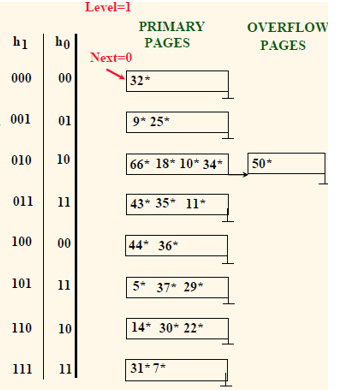
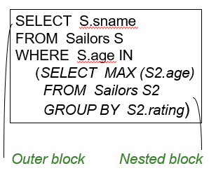
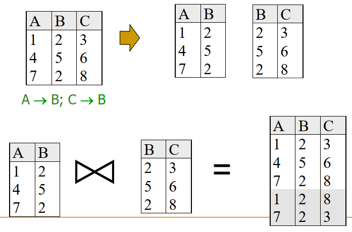

# 数据库复习笔记

zyw zyw zyw

> 有选择题和应用题，英文试卷；故障恢复和日志不考。
>注意一下可扩展哈希和线性哈希。

---

[toc]

| <center></center> | <center></center> |
| ------------------------------------------------------------ | ------------------------------------------------------------ |


### 1. 关系模型 Relational Model

* **关系模型的组成：关系 Relations、属性 Attributes 和元组 Tuples**
  * 关系数据库由一组关系组成，关系由两部分组成：模式 + 实例
    * 模式 Scheme：关系的名称和每一列的名称和类型
    * 实例 Instance：包含行 Row/Cardinaity 和列 Fields/Arity/Degree 的表
* **键 Key、主键、外键、候选键、超键**
  * 键是一种以不同关系关联元组的方法，是完整性约束 (IC) 的一种形式。
  * **超键 Superkey**：两个不同的元组在所有关键字段中不能有相同的值
  * **一个关系的键 Key** 满足 一、是超键；二、任意子集不是超键。
  * 一个关系中有多个键：选一个作为**主键（Primary Key）**，其他作为**候选键（Candidate Keys）**。（在图表上，下划线的集合代表主键）
  * **外键 Foreign Key**：一个关系中的字段集合，用于“引用”另一个关系中的**元组**，必须对应于另一个关系的主键。
* **完整性约束 Integrity Constraints**：对数据库的任何实例都必须为真的条件，例如约束变量域 Domain Donstraints
  * 完整性约束来自：现实语义、键和外键等

  * 实体完整性 Entity Integrity：主键唯一、自增长、默认值填充、非空约束
  * **引用完整性 Referential Integrity**：如果满足了所有的外键约束，则实现了引用完整性

    * 一些特殊场景：

      * 在报名表中插入不存在的学生ID，
      * 在主表中删除记录：

        * Cascade 级联：同时删除引用它的登记元组
        * No Action 没有动作：不允许引用
        * Set Default 外键表对应位置设置默认值
        * Set NULL 外键表对一个位置置为空


---

### 2. 物理模型 Disks, Files, Buffers, Indexes

* 储存层次：寄存器 - 缓存 - 主存（DRAM） - 磁盘
  * 虚拟内存 内存映射（mmap）

#### 2.1 内存管理 

> Lec 3 后半部分

* 缓冲区管理

  

  * 缓冲池：一个帧的信息 <frame#, page_id, pin_count, dirty>  

    * 帧（Frame）、脏页（Dirty Page）、固定页（Pinned Page）、替换（Replacement）
    * 如果请求的页面不在池中：选择一个帧进行替换，只有“未固定（Un-pinned）”的页面才能作为候选页面，如果该帧为脏（Dirty），将当前页写入磁盘，读取请求页面到帧中，最后把这一页固定（Pin），返回它的地址。
      * 如果请求可以被预测（例如顺序扫描），页面可以一次预取几个页面
      * 页面的请求者完成他想做的事情后必须：Unpin它，指示是否通过脏位修改了页面。页面在池中可能被请求多次，所以使用的是 pin _count 来计数，一个页面是一个候选替换 pin _count  等于 0 。
      * 并发控制(CC)和恢复、写前日志协议可能在替换时做额外的IO。

  * 页面替换策略：LRU，MRU（最近使用），Clock，掌握模拟替换过程和各自的优缺点

    * LRU（最近最少使用）：跟踪每一帧最后 Unpin 的时间，建立一个 pin_count 等于 0 的帧的指针队列，每次替换有最早解除固定时间的帧。

      * 优点：非常常见的策略，直观和简单，适用于对流行页面的重复访问
      * 问题：（Sequential Flooding）重复顺序扫描时，假设一个缓冲池有10帧，被扫描的文件有11帧，然后使用 LRU，每次扫描文件都会读取文件的每一页。

    * 时钟替换策略：LRU的近似，有类似的行为但开销更少。它将帧排列成一个周期，每帧存储一个引用位（Reference Bit），可以把这看作是第二次机会，当 pin_count 为 0时，打开引用位。

      ```c
      do for each frame in cycle {
      	if (pin_count == 0 && ref bit is on)
          turn off ref bit; // 2nd chance
          else if (pin_count == 0 && ref bit is off)
          choose this page for replacement;
      } until a page is chosen;
      ```

* 数据库系统 VS 文件系统

  * 操作系统管理磁盘空间和缓冲区，为什么不让操作系统管理这些任务?
    * 因为大多数页面引用是由更高级的操作生成的，比如顺序扫描，所以DBMS通常能比操作系统更准确地预测页面引用模式。
    * DBMS可以自由调整替换策略，根据典型的DB操作中的页面引用模式预取页面。
    * 为实现管理磁盘空间，DBMS需要显式地将页面强制放到磁盘上的能力，比如用于实现预写日志协议

* 系统目录（System Catalogs）

  * 对于每一个关系（Relation），要保存：文件名，文件位置，文件结构（例如，堆文件）；每个属性的属性名称和类型，每个索引的索引名，完整性约束
  * 对于每一个索引（Index），要保存结构（例如，B+树）和搜索关键字段
  * 对于每一个视图（View），要保存视图名称和定义，统计、授权、缓冲池大小等。
  * 系统目录本身就是作为关系存储的

#### 2.2 文件组织（磁盘空间管理）

> Lec 3 前半部分

* 磁盘基本知识：

  * READ - 读磁盘，WRITE - 写入磁盘
  * 固定单元：块（文件系统传送数据的基本单元）、页（内存的管理单元）
    * 数据库系统中，页面大小从 512B 到 16KB 不等。

  * 随机访问 / 顺序扫描 访问块的时间 = 寻道时间 + 旋转延迟 + 传输时间
  * 在磁盘上的相对位置对DBMS性能有重大影响

* **文件组织形式**：

  * 文件 File：一组页的集合，每一页包含一组记录。支持插入、删除、修改记录、使用RID获取特定的记录、扫描所有记录。

  * **无序文件 Unorderd (Heap) File**：**记录没有特定的顺序，通过索引来进行文件查询**。文件的变化伴随着块的申请和释放，故需要在文件中跟踪页面、跟踪页面上的空闲空间、在一个页面上跟踪记录。

    * **链式组织结构** Linked List：每个页都有额外保存两个指针，如果记录的长度是可变的而页不是h，如果将每个记录保存在单个页面中，那么每个页面都可能有一些空闲字节。

      

    * **目录组织结构** Page Directory：目录本身就是页面的集合，每个页面可以包含多个条目。页面的条目可以包括页面上的空闲字节数。要插入一条记录，我们可以搜索目录以确定哪个页有足够的空间来保存该记录。

      

    * 通过索引来查询记录

      * **记录 ID = <页号, 槽号>**

      * 定长记录的页面设计（Page Formats）：连续存储并记保存记录数目 OR 分散存储并用位图标记

        

      * 变长记录（Record / Tuple Data）：记录之间使用特殊符号做分隔符 OR 使用一个偏移量数组

        

      * 变长记录的页面设计（Page Formats）：用一个数组记录指向各个槽号记录的指针（偏移量），可以实现在页面上移动记录而不改变RID

        

        

        上面这样图：左4，左9是两个变长的记录，13开始是空闲空间，右侧右往左分别是：(13)空闲空间开始地址、(2)槽总数、(0,4)第一个槽的起始偏移和长度，(4,9)第二个槽的起始偏移和长度

#### 2.3 树结构索引（B+树）

> Lec5

* 范围查找：

  * 有序文件有利于范围查找，因为磁盘顺序访问优于随机访问，二叉搜索不利于数据库范围查找（其实可以建立一个索引文件，在索引文件中进行二分查找）
  * 树结构索引不仅适用于等值查找，还适用于范围查找

* **ISAM：索引顺序访问方法**，通过建立一层或多层索引，组织成树结构，并在叶子节点存放数据项来实现查找

  * ISAM是一个静态结构，创建过程为：按顺序分配的叶子(数据)页，按搜索键排序，然后建立索引页，最后考虑溢出页面。

    

  * 索引项的构成：键值 + 页面ID

  * **操作**：以下操作之影响叶子节点的页面，整个过程索引节点是不变的（故称为静态结构）

    * **查询**：从根节点开始，查询负责度为 $O(\log_m(n))$，$m, n$分别为每个页面的项数目、叶子节点总数。 
    * **插入**：可能存在**溢出页面**的情况
    * **删除**：如果阐述的元组在移除页面，并且移除页面删除元组后为空，需要移除

    

* **B+树**

  * **根节点**：有 1 到 2d 个索引，根节点不是叶子节点就至少有两个子节点

  * **内部节点**：除了根节点之外的内部节点都有 m（满足在d 到 2d内） 个索引项，并且有 m+1 个子节点。（这只是一种实现方式而已，也有索引项和子节点数目一样的）

  * **叶子节点**：有 m （满足 d 到 2d 之内）个数据项，数据项的形式有：

    * **<Key, Record>、<Key, RID>、<Key, List of RIDs>**

  * 其他特性：从根节点到任何叶子的每条路径都有相同的长度，有效支持相等和范围搜索，数据项有双向链表连在一起（以支持范围搜索）。

  * 实际应用上，d = 100，填充因子为 67%，平均扇出为 133（200 * 67%）

  * **操作**：

    * 查询

    * 插入：找到对应的叶子节点，将数据输入到叶子节点。

      * 如果节点有足够的空间，完成
      * 否则，必须将节点拆分成两个，重新均匀分配条目，复制中间键，将指向新节点的索引项插入到原父节点。（递归进行该过程，根可能回分裂增加高度）
      * Copy up（叶子节点：拆分时复制上去）和 Push up（索引节点：拆分时推上去）
      * 例子：插入 8

      

      

    * 删除：从根结点开始，找到叶节点，删除条目。

      * 如果节点至少是半满的，完成

      * 如果节点只有 d-1 个元素，尝试重新分配，从兄弟节点借用（借用后可能也要改父节点的索引），如果借用失败，合并兄弟节点。如果合并发生了，必须从一个节点的父节点删除条目，合并可以传播到根，降低高度。

      * 例子：继续上面的例子，**删除 19 和 20**

        

        **删除 24**

        

    * Bulk-Loading：先从底层叶子节点构建，从左往右按顺序构建一个双向链表；从下往上，一层层构建索引节点，每一层也是从左往右构建索引节点。  

    * 对 d 值（Order）的讨论：半满，也可以换成别的满

      * 对于变长条目，Order (d)几乎没有意义，而且索引页通常比叶页包含更多的条目
      * 许多实际的系统更草率：只有在页面完全为空时才回收空间。

#### 2.4 外部排序

> Lec 6

* 二路归并排序（Two-Way External Merge Sort）：需要三个缓冲区

  * 在趟 0 （Pass 0）的时候 读入一个页面进一个缓冲区，将其在内存中排序，写回硬盘
  * 剩下来的趟：需要三个缓冲区，两个用于读入，归并结果存在第三个缓冲区里，满了就写回磁盘。
  * 总趟数：$\lceil \log_2 N \rceil + 1$，总开销：$2N(\lceil \log_2 N \rceil + 1)$

* **常规归并排序：有 B 个缓冲区，有 N 个页面待排序**

  * 趟 0：使用 B 个缓冲区，排出 $\lceil N / B \rceil$个有序段
  * 之后的趟：利用 B 个缓冲区，每次归并 $B - 1$ 个有序段
  * 总趟数：$\lceil \log_{B - 1} \lceil N / B \rceil  \rceil + 1$，总开销：$2N(\lceil \log_{B - 1} \lceil N / B \rceil  \rceil + 1)$

* 外部排序的IO讨论：一次IO一个页面（一个有若干连续页面组成的块更好），而不是一条记录。有可能会减少每一趟排序的扇入。

* 双缓冲技术 Double Buffering：就是**输出输入**端都用两个缓冲区，一个满了就开始写磁盘/排序，由另一个缓冲区接收新排好的数据/从磁盘读取，交替进行，能够有效减少I/O的等待时间。

* 使用 B+ 树来排序：要排序的表在排序列上有B+树索引，可以通过遍历叶页来按顺序检索记录吗？**需要考虑B+树是否是聚簇的**

  | 聚簇                                       | 非聚簇                                     |
  | ------------------------------------------ | ------------------------------------------ |
  |  |  |

#### 2.5 哈希

> Lec 7

* 哈希适用于等值查询，不适用于范围查询
* 类型：静态哈希和动态哈希（可扩展哈希和线性哈希）
* **静态哈希 Static Hashing**
  * 主页面（Primary Pages）的数量是固定的，按顺序分配，需要溢出页面。
    * $h(k)\mod N$ 即 Key 为 k 的数据条目所属的桶（Bucket），N为桶数
    * 长溢出链会导致性能下降，通过可扩展线性哈希解决这个问题

下面的是动态哈希：

* **可扩展哈希 Extendible Hashing**

  * 背景：主页面已满时为什么不通过加倍桶的数量来重新组织文件？读写所有的页面是昂贵的。

  * 可扩展哈希的思想：使用**指向桶的目录**，通过加倍目录使桶的数量加倍。可扩展哈希就是一棵基数搜索树

    

    

  * 在实现时，目录记录一个全局深度（Global Depth），每一个桶记录一个局部深度（Local Depth），当我们要找第 R 个桶时，需要取 H(R) 后 Global Depth 位

    * 全局深度：一个条目属于哪个桶所需的最大位数。

    * 局部深度：用来判断一个表项是否属于该桶的位数。

    * 插入：如果桶已经满了，就申请新页面，重新分配（桶拆分），可能还需要扩大目录为原来的两倍，并更新全局深度

      * 桶拆分时，若在插入之前桶的局部深度等于全局深度，插入后局部深度变成大于全局深度，则目录加倍。
      * 目录加倍时，为了原来的内容连续，使用最低有效位（最右位 Least Significant Bit）作为新的位（左边增，哈希函数是看右边几位）

      

    * 删除：

      * 如果删除数据条目使一个桶为空，那么这个桶可以与它的分割映像合并
      * 如果每个目录元素都指向与其分割映像相同的bucket，我们就可以将目录缩小一倍

* **线性哈希（Linear Hashing）**

  * 另一种动态哈希方案，可扩展哈希的替代方案。LH 在不使用目录的情况下处理长溢出链的问题，并处理副本。

  * 使用一族哈希函数$h_0, h_1, h_2, …$，其中$h_{i+1}$使$h_i$的范围加倍（类似于目录加倍）

    * $h_i(key) = h(key) mod (2^iN)$ ，$N$ 为初始桶数
    * 如果$N = 2^{d_0}$，对于某些$d_0$，**$h_i$由$h$最后的$d_i$位组成**，其中$d_i = d_0 + i$。

  * 在 LH 中通过使用溢出页而不是目录，并选择桶来**拆分轮询（Round-Robin**）。

    * 分成若干轮，当第 R 轮所有的$N_R$个初始桶被分割时，这一轮结束。
    * 0 到 Next-1 的桶是已经被拆分（下图红色部分），从$Next$到$N_R$还没有被拆分（绿色部分），剩下的蓝色部分为本轮已拆分的桶拆分出来的东西。
    * Level 为当前轮数。

    

  * **查询**：为了寻找数据项 R 所在的桶，计算 $h_{level}(R)$，如果它在绿色区域，则直接可以找到，否则他可能在红色或蓝色区域 ，必须通过计算$h_{level+1}(R)$来找到它。

  * **插入**：计算$h_{level}(R)$和$h_{level+1}(R)$，如果桶已经满了，增加一个新的溢出页面并插入数据项，可能需要对第 Next 个桶拆分（Spilt）并 Next 递增一；否则直接插入桶里。

    * 桶的拆分：拆分第 Next 个桶，计算哈希函数$h_{level+1}$在这个桶和它的分割映像（Spilt Image）之间重新分配条目，分割映像的桶号因而是分割前桶号加上$N_{level}$，Next 递增一指向下一个桶。

  * 例子：看图就懂了，先插入43

    

    | 插入37（直接插入，无事发生）               | 插入29（Spilt了，Next增一）                |
    | ------------------------------------------ | ------------------------------------------ |
    |  |  |
    | **插入22，66，34**（由h1决定在哪个桶）     | **插入50**Next跑完了，置0，Level增一       |
    |  |  |

* 对比可扩展哈希和线性哈希：假设在LH中有一个目录，其中的元素从 0 到 N-1。

  第一次分割在bucket 0处，因此我们添加了目录元素N。此时虚拟目录翻倍，但是元素<1,N+1>， <2,N+2>，…都是一样的，我们可以避免将元素从1复制到N-1。以同样的方式处理后续的分裂，在一轮结束时，所有原始的N个桶被分割，目录的大小增加了一倍。也就是说，**LH会逐渐将虚拟目录加倍**。


---

### 3. 关系代数和SQL Languages: Algebra, SQL

#### 3.1 关系代数

* 重点：关系代数运算符（包括各种连接）、使用关系代数语句来表达查询语句、使用查询语句来表达关系代数语句

* **关系代数和关系演算**

  * 关系代数 Relational Algebra：用关系符号表达式表示查询计划
  * 关系演算 Relational Calculus：有点像用一阶谓词逻辑表达查询计划

* **五个基本关系运算符**

  * **Selection $\sigma$ 选择，选中行**，实例：$\sigma_{rating > 8}(S2)$

    > 选这个符号的原因是因为 sigma 和 selection 开头都是 s

  * **Projection $\pi$ 选中列**，实例：$\pi_{sname,rating}(S2)$，选择表S2中的那两列$sname$和$rating$

    > 选这个符号的原因是因为 projection 和 pi 开头都是 p

    * 得到的子项需要考虑是否消除重复：可以通过排序 / 哈希（排序过程不能直接交换元组，而应交换指针）

  * **Cross-product $\times$ 叉乘、笛卡尔积**，实例：$\rho(C(1 \to sid1, 5 \to sid2), S1 \times R1)$

    * **$\rho$表示改名**结果表为C，第一列改名为“sid1”，第二列改名为“sid2”

  * **Set-difference $-$ 集合的差**

  * **Union $\cup$ 并集** 一是列项相同，二是去重（排序顺便去重）

* **其他的运算符**

  * **Intersaction $\cap$ 集合的交**：$R \cap S = R - (R - S)$
  * **Join $\Join$ 自然连接**：**笛卡尔积 寻找公共属性比较筛选行 消除重复列**
  * **Condition Join** $\Join_c$
    * 写法：$R \Join_c S = \sigma_c (R \times S)$：$c$指条件，例如$S1.sid < R1.sid$
    * 注意：**没有去掉公共列的条件**（因为有时候条件是比较两表名称相同的列）
    * Equi-Join 等值连接，条件是个等式的条件连接 

* **综合实例**：Find names of sailors who’ve reserved boat #103

  * $\pi_{sname}((\sigma_{bid = 103}Reserves) \Join Sailors)$，先对$Reserves$找$bid=103$的列，在将这些结果与Sailors表做自然连接，最后在结果中选出名字一列。$\pi_{sname}(\sigma_{bid = 103}(Reserves \Join Sailors))$也可以得到结果，但查找次数不同。

  * 先做选择度比较强的条件更高效。
  
  * 注意
    * 自然连接发生在主键外键之间——外键需要在主键中存在
    * 做笛卡尔积之前可以仅取所需要的列，可以节省空间
    * 注意 $\cap$ 时的逻辑：比如既开过船A有开过船B的水手
  

#### 3.2 SQL 

* **SELECT [DISTINCT]**：于从表中选取数据，结果被存储在一个结果表中，指定DISTINCT 去重

    ```sql
    SELECT LastName,FirstName FROM Persons
    SELECT DISTINCT Company FROM Orders 
    ```

* **WHERE**：设置SELECT的选取条件，可使用的操作符包括：

  ``` SQL
  = <>(不等于) > < >= <= BETWEEN(指定范围) LIKE(指定串模式)
  ```

  ``` SQL
  SELECT * FROM Persons WHERE City='Beijing'
  ```

* **AND & OR**：运算符用于基于一个以上的条件对记录进行过滤

* **ORDER BY**：语句用于根据指定的列对结果集进行排序（默认升序），使用 DESC 指定降序排序

  ```sql
  SELECT Company, OrderNumber FROM Orders ORDER BY Company, OrderNumber;
  SELECT Company, OrderNumber FROM Orders ORDER BY Company DESC;
  ```

* **ANY & ALL**：

  ``` sql
  SELECT *
  FROM   Sailors S # 使用了别名
  WHERE  S.rating > ANY 
     (SELECT  S2.rating
      FROM  Sailors S2
      WHERE S2.sname=‘Horatio’)
  ```

* **GROUP BY**：聚合成组，后面接参数为分组依据

   ``` SQL
   # For each rating, find the average age of the sailors
   SELECT  S.rating,  AVG (S.age)
   FROM  Sailors S
   GROUP BY S.rating 
  ```
  
* **HAVING** 对 GROUP BY 的分组进行限制

  ``` sql
  SELECT  S.rating, MIN (S.age)
  FROM  Sailors S
  WHERE  S.age >= 18
  GROUP BY  S.rating
  HAVING COUNT (*) > 1
  ```

* INSERT INTO & VALUES：向表格中插入新的行

  ``` SQL
  INSERT INTO Persons (LastName, Address) VALUES ('Wilson', 'Champs-Elysees')
  INSERT INTO Persons VALUES ('Gates', 'Bill', 'Xuanwumen 10', 'Beijing')
  ```

* UPDATE & SET：语句用于修改表中的数据

  ``` sql
  UPDATE Person SET FirstName = 'Fred' WHERE LastName = 'Wilson' 
  ```

* DELETE：删除表中的行

  ``` sql
  DELETE FROM Person WHERE LastName = 'Wilson' 
  ```

* TOP：表中选取头几条（PERCENT 可以是百分比）记录

  ``` sql
  SELECT TOP 2 * FROM Persons;
  SELECT TOP 50 PERCENT * FROM Persons
  ```

* LIKE：模式串匹配

  ```sql
  # 从 "Persons" 表中选取居住在以 "N" 开始的城市里的人
  SELECT * FROM Persons
  WHERE City LIKE 'N%';
  
  # 从 "Persons" 表中选取居住在不包含 "lon" 的城市里的人
  SELECT * FROM Persons
  WHERE City NOT LIKE '%lon%'
  ```

  通配符：必须与 LIKE 一起使用

  | 通配符                     | 描述                       |
  | :------------------------- | :------------------------- |
  | %                          | 代表零个或多个字符         |
  | _                          | 仅替代一个字符             |
  | [charlist]                 | 字符列中的任何单一字符     |
  | [^charlist]或者[!charlist] | 不在字符列中的任何单一字符 |

* **IN**：允许我们在 WHERE 子句中规定多个值，也用于嵌套查询

  ``` sql
  SELECT * FROM Persons
  WHERE LastName IN ('Adams','Carter')
  ```

* BETWEEN：操作符在 WHERE 子句中使用，作用是选取介于两个值之间的数据范围（前闭后开）

  ```
  SELECT * FROM Persons
  WHERE LastName
  BETWEEN 'Adams' AND 'Carter'
  ```

* **AS**：指定别名，可用于指定表、指定列

  ``` sql
  SELECT City AS Homeland
  FROM Persons
  ```

* JOIN：合并多个表

  ```sql
  SELECT Persons.LastName, Persons.FirstName, Orders.OrderNo
  FROM Persons, Orders
  WHERE Persons.Id_P = Orders.Id_P;
  
  SELECT Persons.LastName, Persons.FirstName, Orders.OrderNo
  FROM Persons
  INNER JOIN Orders
  ON Persons.Id_P = Orders.Id_P
  ORDER BY Persons.LastName
  ```

  * **INNER JOIN** & ON ：在表中存在至少一个匹配时，INNER JOIN 关键字返回行
  * **LEFT JOIN** & ON ：关键字会从左表那里返回所有的行，即使在右表中没有匹配的行
  * **RIGHT JOIN** & ON：关键字会从右表那里返回所有的行，即使在左表中没有匹配的行
  * **FULL JOIN** & ON：只要其中某个表存在匹配，FULL JOIN 关键字就会返回行

* **UNION** & UNION ALL：合并两个或多个 SELECT 语句的结果集，默认去重，加 ALL 允许重复值

  ``` sql
  SELECT E_Name FROM Employees_China
  UNION
  SELECT E_Name FROM Employees_USA;
  ```

* **INTERSECT**：将两个查询结果交在一起 

* **EXCEPT**：减表（上表减去下表）

* SELECT INTO：语句可用于创建表的备份复件

  ```sql
  SELECT LastName,Firstname
  INTO Persons_backup
  FROM Persons
  WHERE City='Beijing';
  ```

* CREATE DATABASE & CREATE TABLE：创建数据库、表

  ```sql
  CREATE DATABASE my_db;
  
  CREATE TABLE Persons(
      Id_P int, LastName varchar(255), FirstName varchar(255),
      Address varchar(255), City varchar(255))
  ```

  | 数据类型                                                     | 描述                                                         |
  | :----------------------------------------------------------- | :----------------------------------------------------------- |
  | integer(size)<br>int(size)<br>smallint(size)<br>tinyint(size) | 整数，在括号内规定数字的最大位数                             |
  | decimal(size,d)<br>numeric(size,d)                           | 带有小数的数字<br>"size" 规定数字的最大位数，<br>"d" 规定小数点右侧的最大位数 |
  | char(size)                                                   | 固定长度的字符串，在括号中规定字符串的长度。                 |
  | varchar(size)                                                | 可变长度的字符串，在括号中规定字符串的最大长度。             |
  | date(yyyymmdd)                                               | 日期                                                         |

* SQL约束：限制加入表的数据的类型

  * **NOT NULL**：约束强制列不接受 NULL 值
  * **UNIQUE**：约束唯一标识数据库表中的每条记录（候选键）
  * **PRIMARY KEY**：设置唯一主键
  * **FOREIGN KEY & REFERENCES**：指向另一个表中的 PRIMARY KEY 
  * **CHECK**：限制列中的值的范围
  * **DEFAULT**：向列中插入默认值

  ``` sql
  CREATE TABLE Persons(
      Id_P int NOT NULL, LastName varchar(255) NOT NULL,
      FirstName varchar(255),Address varchar(255),
      City varchar(255) DEFAULT 'Sandnes'，
      PRIMARY KEY (Id_P), UNIQUE (LastName, FirstName), CHECK (Id_P>0)
  );
  
  CREATE TABLE Orders(
      Id_O int NOT NULL, OrderNo int NOT NULL, Id_P int,
      OrderDate date DEFAULT GETDATE(),
      PRIMARY KEY (Id_O),FOREIGN KEY (Id_P) REFERENCES Persons(Id_P)
  );
  ```

* ALTER TABLE：修改表

  ```sql
  ALTER TABLE Persons
  ADD UNIQUE (Id_P);
  
  ALTER TABLE Persons
  DROP INDEX uc_PersonID
  ```

* CREATE INDEX ：在表中创建索引，接入 DESC 逆序

  ``` sql
  CREATE INDEX PersonIndex
  ON Person (LastName [DESC]) 
  ```

* DROP & TRUNCATE：删除东西，后者只删除数据不删除结构，后可接 INDEX TABLE DATABASE

* AUTO INCREMENT：默认开始值为 1

  ``` sql
  CREATE TABLE Persons
  (
  P_Id int NOT NULL AUTO_INCREMENT,
  LastName varchar(255) NOT NULL,
  FirstName varchar(255)
  );
  
  # 修改初始值
  ALTER TABLE Persons AUTO_INCREMENT=100
  ```

* CREATE VIEW：创建视图，基于 SQL 语句的结果集的可视化的表，视图包含行和列，就像一个真实的表。

  ``` sql
  CREATE VIEW [Current Product List] AS
  SELECT ProductID,ProductName
  FROM Products
  WHERE Discontinued=No;
  
  SELECT * FROM [Current Product List];
  ```

* DATE：日期，可使用若干内置函数

  ```
  SELECT * FROM Orders WHERE OrderDate='2008-12-26'
  ```

* NULL & IS NULL & IS NOT NULL：

  ``` sql
  SELECT LastName,FirstName,Address FROM Persons
  WHERE Address IS NULL;
  ```

* **内建函数**
  
  * **COUNT(*) / COUNT([DISTINCT] A)**
  * **SUM([DISTINCE] A)**
  * **AVG([DISTANCE] A)**
  * **MAX(A) MIN(A)**
  
* **正则表达式 ^**
  
  * 以AB开头：`^AB`
  * 以CD结尾：`CD$`
  * 或：`|`

### 4. 查询处理 Query Processing: Join Algorithms

> Lec 8 

**如何实现基本的关系操作**：考虑索引、聚簇等因素，连接的各种实现方案即计算量

**提高查询过程性能的思路**：操作符的巧妙实现技术、利用关系代数的“等价”、

使用统计数据和成本模型进行选择

> 本节统一使用的案例：
>
> Sailors (sid: integer, sname: string, rating: integer, age: real)
> Reserves (sid: integer, bid: integer, day: dates, rname: string)
>
> Sailors:
> Each tuple is 50 bytes long,  80 tuples per page, 500 pages.
> [S] 表示页面数 pS 表示每个页面的元组数
>
> Reserves:
> Each tuple is 40 bytes,  100 tuples per page, 1000 pages.
> [R] 表示页面数 pR 表示每个页面的元组数
>
> $cost$：不考虑结果写回的IO，因为去重结果未知

首先考虑如何实现基本的关系操作：

#### 4.1 选行 Selection

* 选择度 Selectivity：满足这个条件的元组占所有元组的比例

* 可选方案：

  * 如果没有索引，遍历一遍：$cost = [R]$

  * **带有索引（B+树）的选行**：两个步骤 $cost = cost_{step_1} + cost_{step_2}$

    1. 使用索引找到满足需要的数据项 Data Entries
    2. 根据数据项找对应的数据记录 Data Record
       * 对于第二部，需要考虑是否聚簇：如果选择度为 10%，对于R表有100页，也就是10000元组命中，对于聚簇的，IO次数为100左右；而对于非聚簇的，如果不使用优化，IO次数为10000左右

  * **带有非聚簇索引（B+树）的选行优化**，第二步的实现为：

    1. 对数据项的 RID（页码）进行排序
    2. 按照排序结果来取数据记录

    这样，每个数据页只查看一次，尽管此类页面的数量可能比使用聚簇时要高。

* **通常的选行条件**：多个条件用 AND / OR 连接

  * 做法：首先转化为合取范式（CNF：析取项和合取）

  * 方法 1：考虑能不能一起查找

    1. 找到最便宜的访问路径：IO访问最少（考虑适用哈希还是B+树）
       * 对于B+树：B-tree索引匹配只涉及搜索键前缀中的属性
         * 建立数据项按照A, B, C来排序写作<a, b, c>，如果查询a=5 b=3比较好找，因为是前缀，但直接查b=3不好查询，因为b不是前缀，b的排列被a隔开了。
       * 对于哈希：要有建立在待搜索项上的 Index

    2. 然后根据此找需要的元组
    3. 最后应用任何与索引不匹配的剩余操作

  * 方法 2：各自查找再选交集

    1. 从每个索引中，获得一组RID
    2. 计算RID集合的交集

    3. 查找这些RID的记录

    4. 最后应用任何未执行的剩余操作

#### 4.2 选列 Projection

* 需要考虑重复 Removing Duplicates 的问题：
  * 如果需要去重，则对需要的属性进行排序，排序后线性遍历重复的仅取一个。
  * $cost = cost_{排序} + cost_{遍历}$
  * 在预约表的例子中，假设选择度为0.25，缓冲区为 20 Pages
    * $cost = 1000 + 250 + 2 * 2* 250 + 250 = 2500$ 次IO
    * $1000 + 250$ 指取出所有的1000个页面，然后选列（空间只占原来的0.25）故只用250个页面写回
    * $2*2*250$ 表示250个页面用20个页面的缓冲区进行外排序，需要两趟，每一趟对所有页面进行一次读一次写（共2次IO）
    * 最后 $250$ 表示遍历一遍做去重需要读入页面数目

* **选列的优化：避免临时文件的硬盘写入 On the fly**
  * 排序趟 0 ：消除不需要的属性数据，只对需要的属性进行排序
  * 排序其余趟：在排序的过程中同时去重
  * 在上面的例子中，$cost = 1000 + 250 + 250 = 1500$ 次IO
    * **趟0：1000次硬盘写入内存，250次为将经筛选的13个排序段写回硬盘**
    * **趟1：取出13个排序段（250个页面）并去重（一趟完成）**

* 其他选列的技巧
  * 如果一个索引搜索键 Key 包含所有需要的属性：不会有重复，只需一遍索引扫描
  * 如果一个B+树索引搜索关键字前缀有所有想要的属性：按顺序扫描索引，只需按顺序检索数据条目，丢弃不需要的字段，动态地比较相邻元组以检查是否有重复项。

#### 4.3 自然连接 Join

* **嵌套循环连接 Nest-Loops Join**

  * SNLP 简单的嵌套循环连接 $cost(R \Join S) = [R] * [S] * P_R + [R]$ 加号后面是读入 R 的 IO 次数，加号前面是 S 读入 S 的次数。（假定左侧的表为外层循环）

    ```
    foreach tuple r in R do
    	foreach tuple s in S do
    		if ri == sj  then add <r, s> to result
    ```

  * 基于页面的嵌套循环 Page-Oriented Nested Loops Join

    四层循环，先便利页面，再遍历元组

    ```
    foreach page bR in R do
        foreach page bS in S do
    		foreach tuple r in bR do
            	foreach tuple s in bSdo
                	if ri == sj  then add <r, s> to result
    ```

    $cost(R \Join S) = [R] * [S] + [R]$

  * **基于块的嵌套循环连接 Block Nested Loops Join**

    

    设Buffer有B个页面，选B-2个页面作为R的缓冲取，一个页面作为S的缓冲区，1个为Output，它能能够充分利用缓冲区的数目。

  * $cost(R \Join S) = [R] + \lceil[R] / (B-2)\rceil * [S]$（R是外层，S是内层）

* **索引嵌套循环连接 Index-Nested Loops Join**（建B+树）

  * 对一个表建树，另一个根据内容查找树，需要考虑是否聚簇。

    ```
    foreach tuple r in R do
    	foreach tuple s in S where ri == sj  do
    		add <r, s> to result
    ```

  * $cost(R \Join S) = [R] + [R] * P_R * cost_{find\_s\_tuples}$

    * $cost_{find\_s\_tuples}$是从根节点遍历树和根据RID获取记录元组的开销
      * 查询RID(s)的成本通常B+树需要2-4个IO。
      * 从RID(s)检索记录的成本取决于是否聚簇：
        * 聚簇索引：匹配的S元组每页1个I/O。
        * 非聚簇索引：每个匹配的S元组最多有1个I/O。

* **排序归并连接 Sort-merge Join**

  * 先分别排序，然后二路归并（串联 Tandem 两个有序段，寻找匹配的）
  * $cost(R \Join S) = cost(sort(R)) + cost(sort(S)) + [R] + [S]$
    * 即分别排序的读写IO(排序趟数 * 2 * 页面数) + [R] + [S]
    * 会有一种情况：就是两张表已经有序，代价就变成了 [R] + [S]


  * 归并排序有一个好处就是让结果是有序的。
  * 排序归并连接的优化：**我们可以将R和S排序中的合并阶段与合并所需的连接相结合**。
    * 如果$B > \sqrt{L} $，其中L是较大关系的大小，使用排序在Pass 0中产生长度为两个B的若干有序段，每个关系有序段的数目都小于 $B/2$。
    * 在合并阶段：为每一个关系的每个有序段分配1个页面（缓冲区中有一半放R的，一半放S的有序段），然后连接条件时进行合并
    * Cost：第0趟两个表的读写 + 第1趟中两个表的读（我觉得不会有第二趟），所以又等于 $cost(R \Join S) = 3 * ([R] + [S])$

* **哈希连接 Hash-Join**

  * 只能处理等值连接

  * 分桶：使用同样的哈希函数对两个表进行分组 Partitions

    * B个内存页面里拿一个作为输入，B-1个作为数据输出缓冲区，哈希函数为 $hash(key) mod (B-1)$，每当一个输出缓冲区页面满了，就写到硬盘上
    * 把一个分组（假设分组大小小于 B-2个页面）扔进来，内存临时建立哈希表使用**另一个哈希函数**整到 (B-2) 个输入缓冲区内，剩下一个输入缓冲区和一个输出缓冲区。
    * $S$的每一个元组经过哈希函数落到B-2个元组中，去探测然后满足条件的扔到输出缓冲区。

    

    * 注：
      * 注意到这里使用了两个哈希函数$h$和$h_2$，前者用于给两个表分组，后者用于前面分好的组在进行另一种划分和映射
      * 缓冲区的页面有大小限制，$[R] / (B-1) \le (B-2)$ 因此 $B$ 必须要大于 $\sqrt{[R]}$ (倾向于把比较小的表作为用来等待探测的表（就是此处的R）)
      * 若每个桶的页面的是不均匀，可以递归的使用哈希。
    * 代价估算：哈希阶段分桶：2([R]+[S]) 次IO，在匹配阶段读入：[R]+[S] ，总次数为 $cost(R \Join S) = 3 * ([R] + [S])$

* 对比排序归并连接和哈希连接：

  * 如果关系大小相差很大，则使用Hash连接。
  * Hash Join被证明是高度并行的。
  * 排序合并对数据倾斜（Data Skew）不太敏感，结果有序。


#### 4.4 其他讨论

* 交集（Intersection）和叉积（Cross-Product）作为连接的特殊情况。
* 联合（Union(Distinct)）和除（Except）相似
* **联合 Union**：
  * 基于排序的联合方法：对这两个关系进行排序（根据所有属性的组合），扫描排序的关系并合并它们（合并甚可以从Pass 0就开始）。
  * 基于哈希的联合方法：用哈希函数$h$划分R和S得到多个Partition。对于每个S-Partition，在内存中构建哈希表（使用$h_2$），扫描相应的R-Partition，并在表中添加元组，同时丢弃副本。

* **更加通用的Join条件**
  * 几个属性的等式（例如：`R.sid=S.sid AND R.rname = S.sname`）：
    * 对于索引嵌套循环，在`<sid, sname>`上构建索引（如果S是内部的）；或者在`sid`或`sname`上使用现有的索引。
    * 对于排序归并和哈希连接，对两个连接列的组合进行排序/分区。
  * 不等式条件（例如：`R.rname < S.sname`）：
    * 对于索引嵌套循环，需要（聚簇）B+树索引。匹配程度可能比等值连接高得多
    * **哈希连接，排序合并连接不适用**
    * 基于块的嵌套循环很可能是这里最好的连接方法。
* 聚合操作(AVG、MIN等)
  * 无分组情况：一般来说，需要扫描关系；给定一个树索引，其搜索键包含SELECT和WHERE子句中的所有属性，可以执行仅索引扫描。


### 5. 查询优化 Query Optimization

> Lec 9 Lec 9 Slec12
>
> Part04 Part05

#### 5.1 Lec 9 - B 数据库的物理设计

> Rule of thumb 经验规则

* 查询优化器可以使用索引、聚簇等。

* 索引的选择：需要考虑涉及哪些表、应使用那些属性作为搜索的键，是否使用多重索引、聚簇

  * 一些方法：依次考虑最重要的查询；考虑使用当前索引所能得到的最优的计划；若能得到更好计划，考虑是否添加额外的索引
  * 索引的影响：索引提高查询速度，但更新表速度变慢；索引需要磁盘空间

  * 需要考虑的问题：
    * WHERE子句中提到的属性是索引搜索键的候选属性时：
      * 范围条件对聚簇很敏感
      * 但精确匹配条件不一定需要聚簇
    * 选择对许多查询有利的索引，但每个关系只能聚集一个索引，所以明智地选择吧！

#### 5.2 Lec 9 - A 查询优化

* 查询计划：树的关系代数操作(和其他一些)与选择算法的每个操作。我们找到最理想的计划，预估代价，避免最差的计划。

  * 三个主要问题：对于给定的查询，需要考虑哪些计划？如何估算一项计划的成本？如何在计划空间中搜索好的计划。

  * 查询可以转换为关系代数，将关系代数转换为树，连接形成分支，每个操作符都可以指定实现方式，也可以按不同的顺序组织。

    

    * 变换树的各个节点的位置，不同树反映着不同的查询计划，每一个节点还需要具体的指明物理查询方法。

  * 一个基于代价估算的查询子系统：

    

  * 查询优化需要：
    * 封闭的算子集合：关系操作(表入，表出)；封装(例如基于迭代器)
    * 规划空间：基于关系等价，不同的实现
    * 成本估算：基于成本计算公式，或者大小估计，依次根据基表上的目录信息和选择度 Selectivity (减少因子 Reduction Factor)估计
    * 搜索算法：筛选计划空间，找到成本最低的选项

* 节点可指明实现方式

  * **On the fly** ：一种节点实现方式，不使用中间文件（写到硬盘上）直接推送，好处是减少IO次数

* **选行条件下推 Push Seclect** （一般作为缺省的优化步骤）

  * 提前把选行条件下推 

    > Sailors (*sid*: integer, *sname*: string, *rating*: integer, *age*: real)
    >
    > Reserves (*sid*: integer, *bid*: integer, *day*: dates, *rname*: string)
    >
    > Reserves: Each tuple is 40 bytes long, 100 tuples per page, 1000 pages.
    >
    > Assume there are 100 boats
    >
    > Sailors: Each tuple is 50 bytes long, 80 tuples per page, 500 pages.
    >
    > Assume there are 10 different ratings 
    >
    > Assume we have 5 pages in our buffer pool!

    | 图1                                       | 图2                                       |
    | ----------------------------------------- | ----------------------------------------- |
    |  |  |
    | **图3**                                   | **图4**                                   |
    |  |  |

    * 如果连接使用的是**基于页面的嵌套循环**（规定左边为外层）
      * 一个表下推条件（图1）：500  + 1000 * 500 * 50% = 250500
      * 两个表下推条件（图2）：(50% * 500) * (1% * 1000) + 500 + 1000 + (1% * 1000) = 4010 
        * **最后一项是写10个预约表写到硬盘，他的意思是先用所有缓冲区把10个预约表筛选出来出来在放到硬盘里，这样你每次遍历才能保证内层循环里可以直接读10页面。**
        * 如果你不去这样做退化到 (50% * 500) * (1000) + 500 + 1000 了
    * **如果使用排序归并连接**（图3）
      * 扫描 + 选行并写回 + 外排序 + 归并
      * (1000 + 500) + (10 + 250)  + (2\*2\*10 + 2\*4\*250) + (10 + 250) = 4060
    * **如果使用基于块的嵌套循环连接**（图4，和图三差不多，Sort-Merge改成BNL）
      * 初始扫描并选行 + 写选行结果入磁盘 + 块处理
      * (1000 + 500) + (250 + 10) + (10 + ceil(10 / 3) * 250) = 2770


* **系统 R 和 系统 R风格的查询优化器**
  * R系统的影响：广泛使用，在连接高达10-15个时效果良好
  * Cost估计：
    * 非常不精确，但在实践中是可以的。
    * 用于估计操作成本和结果大小的系统目录中的统计数据。
    * 考虑CPU和I/O成本的组合。

  * Plan Space 规划空间：太大，必须修剪。
    * 忽视许多计划中共同的、Cost过高的子树
    * 在某些实现中，只考虑左深计划的空间。
    * 在某些实现中避免了笛卡尔积（Cartesian Products）。


* **查询块 Query Block：**将查询划分为块，对块内部单独进行优化，不相关的嵌套块都只计算一次，相关的嵌套块调用若干次。

  * 相关指内层嵌套块的某些输入需要外层嵌套块来得到且每次不一定相同

  

* **左深连接树 Left-Deep Join Tree**：（逻辑上的一个查询计划）右侧分支始终为基表，每次左下到右上依次连接，需要考虑连接的顺序和连接使用的方法。

* **例子**：对于每一个至少有两个红色船预订的水手，查找水手ID和水手预订红色船的最早日期。

  ```SQL
  SELECT  S.sid, MIN (R.day)
  FROM  Sailors S, Reserves R, Boats B
  WHERE  S.sid = R.sid AND R.bid = B.bid AND B.color = “red”
  GROUP BY S.sid
  HAVING COUNT (*) >= 2 
  ```

  将SQL转化成关系代数

  

* **关系代数的等价性**：

  * **选行**（尽量挑**选择度**小的放在内层使用）：
    * **级联 Cascade**：多个条件一起选一次行，或多次选行每次只用一个条件（在右边的方案下级联遍历规模会因一次次搜索而减小）
    * **交换 Commute**：先选条件A再选条件B和先选条件B再选条件A是等价变化
  * **选列**：
    * **级联 Cascade**：$\pi_{a_1}(R) = \pi_{a_1}(…(\pi_{a_1, …, an}(R))…)$
  * **笛卡尔积 / 自然连接**：（不考虑笛卡尔积结果列的顺序）
    * 结合律 Associative 和交换律 Commutative
  * 更多等价条件：
    * **选列与选行交换**：选列条件 可以与 只使用该选列结果的选择条件 进行交换。
    * **笛卡尔积转自然连接**：在笛卡尔积的两个参数对应的属性之间进行的选行 可以转化为 一个自然连接
    * **换行与自然连接的结合**（提前选行，选行下推）：对两张表的自然连接进行选行 等价于 对一张表进行选行再与另一张表进行自然连接（前提是选择条件与另一张表无关）

* **估算代价 Cost Estimation** 

  * 除了考虑 IO次数，还应考虑 CPU 计算代价，并且给出二者的换算因子

* 一张表的信息：元组数、页面数、最小最大值、一个列的不同取值总数、索引的高度、索引所占的页面数

  

* **规模估算和选择度**：（启发式）

  * 最大输出行数 Max output cardinality：输入行数的积

  * 选择度 Selectivity(Reduction Factor)：输出 / 输入行数

  * 实际行数 = 最大输出行数 * 所有表选择度的积

  * 选择度估算：

    * $ col = val$： 选择度 = 1 / 一个列的不同取值总数 （均匀分布的假设）
    * $col_1 = col_2$​：选择度 = 1 / max(两表中一个列的不同取值总数)
    * $col > val$：选择度 = (最大值 - $val$) / (最大值 - 最小值)

    

* 动态规划生成连接计划：首先要求子计划是最优的

* **单关系计划 Single-relation plans 的代价估计**：（还要考虑去重的费用）

  * 索引扫描：树高 + 1
  * 聚簇索引：（索引页数 + 数据页数）\* 选择度
  * 非聚簇索引：（索引页数 + 元组总数）\* 选择度
  * 顺序扫描：索引页数

  例子：`SELECT S.sid FROM Sailors S WHERE S.rating=8`

  

* **拼表 Multiple Relations 的优化**：

  * 只考虑左深树，左深树允许我们生成所有流水线（Fully Pipelined）的计划，中间结果不写入临时文件（但例如排序归并连接必须写中间文件）
  * 遗传算法：n 张表对应旅行商问题的 n 个城市（一个序列就可以是一个编码），然后通过遗传算法求得最优解

* 动态规划 Dynamic Programming 过程：不仅只考虑单张表查询的最有计划，因为一些查询语句可能产生一些对之后查询有价值的东西（Interesting order columns），例如GROUP BY的KEY和JOIN的KEY相同时

  * **Interesting Orders:** ORDER BY, GROUP BY 和 JOIN 的属性

* **查询优化（物理计划代价估算）**：

  * 趟 1：为单独获取每个关系表找到最佳方案
  * 趟 2：对于第1步中的每个计划，使用所有连接方法（并匹配内部访问方法）生成连接另一个关系作为内部关系的计划，并为每个连接保留最便宜的计划（考虑关系对、顺序等有价值的东西）
  * 趟 3+：使用上一趟的计划作为外部关系表，生成下一个连接的计划，考虑 ORDERBY / GROUPBY / AGGREGATE 增加的成本，最后选择最便宜的方案。
    * 如果存在 Interestingly Ordered Plan 匹配，则增加成本为 0
    * 如果通过一个额外的排序/哈希，那还得计算增加成本

  * 例子：

    

    * 趟 1：找到每一个关系表的 Best plan （还没有考虑连接）

      * 对于 Reservers 和 Sailors 是 直接扫描
      * 对于 Boats 是 建立在 Color 上的 B+是树

    * 趟 2：对于趟 1中的每个计划，使用所有连接方法(以及匹配内部访问方法)生成连接另一个关系的计划作为内部关系，然后找到每一对连接的最佳计划。

      ```
      File Scan Reserves (outer) with Boats (inner)
      File Scan Reserves (outer) with Sailors (inner)
      File Scan Sailors (outer) with Boats (inner)
      File Scan Sailors (outer) with Reserves (inner)
      Boats Btree on color with Sailors (inner)
      Boats Btree on color with Reserves (inner)
      ```

    * 趟 3+：使用上一趟计划作为外部关系，生成下一次连接的计划

      * 例如：两个连接都用排序归并连接（好像会产生有序SID，这样GROUPBY就没有增加成本了）

      然后，添加 GROUP BY / AGGREGATE 的成本：按Sid对结果排序的代价，除非它已经被之前的操作符排序过，最后，选择最便宜的计划

#### 5.3 Slec12 查询计划的物理实现

* Processing Models：定义系统如何执行查询计划

  * 迭代器模型 Iterator Model

    * 实现Next()接口：每个查询计划操作符实现一个Next函数，每次调用时，操作符要么返回单个元组，要么返回空标记(如果没有更多元组)。操作符实现了一个循环，在它的子对象上调用next来检索它们的元组，然后处理它们。

      

    * 一次一条元组，返回一条元组？频繁的函数调用

  * 物化模型 Materialization Model、

    * 每个操作符一次处理所有的输入，然后一次发出所有的输出。运算符将其输出“具体化”为单个结果，数据库管理系统可以将提示下推，以避免扫描过多的元组，可以发送一个实体化行或单个列。

      

    * 对所有输入一次性处理然后输出所有结果？对空间的需求？、

  * 矢量化/批模型 Vectorized / Batch Model

    * 类似于迭代器模型，每个操作符在该模型中实现一个Next函数。每个操作符发出一批元组，而不是单个元组。运算符的内部循环一次处理多个元组，批量的大小可以根据硬件或查询属性的不同而不同。

      

    * 放一部分，自顶向下和自底向上

### 6. 模式泛化 Schema Refinement and Normalization

> Schema Refinement and Normal Forms

* **冗余 Redundancy**

  * 危害：冗余的存储、插入、删除、更新时破坏原子性

* **函数依赖 FD Functional Dependencies** $X \to Y$ 

  * **就是这一列决定那一列**
    $$
    t_1 \in r, t_2 \in r \\
    \pi_X(t_1) = \pi_X(t_2) \\
    \Rightarrow \\
    \pi_Y(t_1) = \pi_y(t_2)
    $$

  * 如果对于 R 中所有属性 A，都有$K \rightarrow A$，就说明 K 是 R 的超键。

  * 非主键的函数依赖造成冗余 - 解决方法：分解成两个子表
  * 平凡依赖：$X \rightarrow X$

* **函数依赖的推理 Reasoning**

  * 函数依赖的蕴含 Implied：F（一组 FD） 蕴含 f 表示 F 成立时 f 也成立。

    * $F^+$ 为 F 的闭包，$F$，$F^+$都是一组函数依赖

  * 在下面：$X,Y,Z$**都是属性集合**

  * **就单纯的属性加在一起**：$XY = X \cup Y, X, Y \subseteq X \cup Y $ 

  * **Armstrong Axioms**：（正确，完备的）

    * **反射 Reflexivity**: if $Y \subseteq X$, then $X \to Y$ **全局决定部分**
    * **增广 Augmentation**: if $X \to Y$ then $XZ \to YZ$ for any $Z$ 
    * **传递 Transitivity**: if $X \to Y$ and $Y \to Z$ then $X \to Z$

  * 推论：

    * **Union**：if $X \to Y$ and $X \to Z$, then $X \to YZ$
    * **Decomposition**：if $X \to YZ$, then $X \to Y$ and $X \to Z$

  * 例题：属性有$C,D,J,D,P,Q,C$，根据条件：
    $$
    C \to CSJDPQV \\
    JP \to C \\
    SD \to P
    $$
    证明：$SDJ$ is Key
    $$
    JP \to C , C \to SCJDPQV \\
    so: JP \to SCJDPQV \quad //transitivity\\
    SD \to P \\
    so: SDJ \to JP \quad //augmentation\\
    so: SDJ \to SCJDPQV \quad //transitivity
    $$

  * **ER图**：矩形表示实体，椭圆表示实体的属性，菱形表示两个实体之间的的联系，实体可以有自己的属性。

    

* **函数依赖的闭包**$F^+$

  * **函数依赖的闭包指一个函数依赖所能推出的所有依赖关系的集合。**

* **属性闭包$X^+$ Attribute Closure**：

  * **属性闭包：**一个属性集合，**属性$A$的闭包，指在属性集$R$和函数依赖$F$（需要先求出函数依赖的闭包$F^+$）下，属性$A$能推出的所有属性的集合。**

  * **属性闭包的计算**：先将$X^+$赋值为$X$，然后如果能从$X^+$里头的一个子集$X’$的元素推出$F^+$中某个函数依赖$F'$的右侧，则将这个$F’$的右侧加入$X^+$（循环执行）

  * 用途：

    * **用于推理**：给定一个属性集合$R$和对应的所有依赖关系$F$，判断一个属性$X$是否能推出$Y$，只需要判断$Y$是否存在于$X^+$中
    * **用于找出一个属性集R的键**（Key）：找出超键（集合S，$S^+ = R$），然后最小化（证明S的任何子集不构成超键）

  * 例题：
    $$
    R = \{A,B,C,D,E\} \\
    F = \{B \to CD, D \to E, B \to A, E \to C, AD \to B\}
    $$

    * 证明：$B \to E \in F^+$，解法：证明 $E$ 是否在 $B^+$ 中
    * 证明：$AD$ 是 $R$ 的Key，解法：证明 $ABCDE$ 都在 $\{AD\}^+$ 中
    * 证明：$AD$ 是 $R$ 的 Candidate Key，注意：还要证明任何子集不构成超键

    

* **范式 Normal Forms**：目的——模式优化 Schema Refinement

  * **范式的类型**：

    * **第一范式**：（限定条件最弱）对关系模式的要求是**所有属性都必须是原子的**，不允许一个属性的属性值是一个链表，数组或集合。
    * 第二范式、第三范式
    * **BCNF范式**（Boyce-Codd Normal Form）：（约束条件最多）给定关系模式R，上面定义了一组函数依赖F，从逻辑上检查F的闭包里的每一条函数依赖$X \to A$，看是否满足：$A$属于$X$（Non-trival 平凡依赖）或$X$是$R$超键（主键的约束），**不允许非主键的非平凡的函数依赖**。

  * **模式的分解** Decompostition ：将一个关系模式分解成多个子关系模式。

    * 分解带来数据冗余

    * 有损连接的分解：凭空生成新的信息

      

    * **无损连接分解**：

      * 大表 $R$ 要拆成小表 $X$ 和 $Y$ 是无损分解的充要条件：**$F$的闭包$F^+$内存在$X \cap Y \to X$ or $X \cap Y \to Y$**

      * 如果在大表 $R$ 上有 $W \to Z$，并且 $W \cap Z = \Phi$，就有 $R$ 分解为 $R - Z$ （减很简单的，从大表中减去Z中的列）和 $WZ$ 的分解是无损的。

      * 结合上图的例子进行分析：
        $$
        A \to B, A \cap B = \empty \\
        R - B = AC
        $$
        最后无损链接分表为：$AC$ 和 $AB$。

    * **依赖保持分解**：如果一种分解是依赖保持的，则丢失函数依赖的物理意义不会因为分表而丢失（物理意义指不用 Join 分解的表就可以完成这个函数依赖）

      * **投影** Projection：**如果$R$能分解为$X$和$Y$，$F$在$X$上的投影$F_X$是一个满足$U \to V \in F^+, \forall U,V \in X$的函数依赖的集合，对$Y$同理**

      * **如果$(F_X \cup F_Y)^+ = F^+$，则 $R$ 分解为 $X$ 和 $Y$ 是依赖保持的**

      * 例题：$F^+ = \{A\to B, B \to C, C\to A\}$；将$R$分解成$AB$和$BC$，判断该分解是否依赖保持
        $$
        \{A \to B, B\to C, C\to A , A\to C, C \to B, B\to A\} \subset F^+ \\
        F_{AB} = \{A\to B, B\to A\} \\
        F_{BC} = \{B\to C, C\to B\} \\
        (F_{AB} \cup F_{BC})^+ = F^+
        $$

    * **BCNF范式上的分解**：

      * **对于BCNF范式，如果$X \to Y$，则分解$R$为$R - Y$和$XY$一定是无损分解。**

      * **BCNF范式不保证分解是依赖保留的。**

      * 例子：
        $$
        R = CSJDPQV, Key_R = C, F = \{JP \to C, SD \to P, J \to S\} \\
        \text{Consider: } JP \to C \\
        XY = JPC, R - Y = SJDPQV \text{ is lossless decomposition}
        $$
        

        

    * **第三范式 3NF**：对于任意函数依赖$X \to A \in F^+$，满足$A \in X$ or $X$是$R$的超键 or **$A$是$R$中一个候选键的真子集**（第三个条件区分3NF和BCNF）。

      * 在第三个条件中，键的极小性（键的真子集非键）至关重要。

      * 无损连接（自然连接结果等于原表）、保持依赖（拆表后函数依赖是否保持下来，避免临时性的连接）的R分解为3NF关系的集合总是可行的。

      * 违反3NF的两种情况：

        * 部份依赖：X是键的一个子集
        * 传递依赖：X不是任何键的子集

      * 3NF的无损分解：和BCNF是一样的，如果$X \to Y$，则分解$R$为$R - Y$和$XY$一定是无损分解。

      * **最小覆盖集**：函数依赖$F$的最小覆盖集$G$是一个函数依赖集合，满足：

        * **$F^+ = G^+$**
        * **对$G$中任意一个函数依赖$FD$（$X \to A$），其中$A$是一个单一属性**
        * 最小化：**如果删除一个函数依赖或从$G$中删除一个函数依赖的属性来修改$G$，闭包就会改变**

      * **生成最小化覆盖的算法**：

        * **函数依赖标准化**：使用分解（if $X \to YZ$, then $X \to Y$ and $X \to Z$），来获得一个等价的函数依赖集以满足右侧都是单一属性。
        * **最小化函数依赖的左侧**：对于每一个函数依赖，检查左边的属性看看它能不能在保留$G^+ = F^+$的前提下删除。
        * **删除冗余的函数依赖**：在保留$G^+ = F^+$的前提下删除多余的函数依赖。

        例子：求$F = \{A\to B, ABCD \to E, EF\to GH, ACDF \to EG\}$的最小覆盖$G$

        

        **3NF保持依赖分解**：**把一个任意函数依赖集合分解成满足依赖保持的3NF**

        * 令$R$是函数依赖最小覆盖集，令无损分解为$R_1,R_2...R_n$，
        * 对于每一个$R_i$，令$F_i$为$R_i$在$F$上的投影
        * 确定函数依赖没有保留的集合$N$（$N = R - \cup_i F_i$**？**），对于$N$中的每一个函数依赖$X \to A$，创建一个$XA$加入$R$的分解

        例题：接上图

        

### 7. 并发控制 Concurrency Control

> Slec 9 Slec 16 Slec 17

#### 7.1 Slec16 并发控制理论

> 并发的关键是你有处理多个任务的能力，不一定要同时。
>
> 并行的关键是你有同时处理多个任务的能力。
>

* **事务 txn** Transaction：一系列有序的数据库操作。事务包装一个应用，包含了一组动作，是DBMS中变化的基本单位。

  * 允许互不相关的事务并发执行能够更好地利用CPU/IO资源、带来更大的吞吐量、降低用户的响应时间

* 模型定义：

  * 数据库：一组固定的命名数据对象 A B C
  * 交易：一组有序的读写操作 R(A) W(B)

  * BEGIN 表示交易的开始，一个事务以 COMMIT（提交）或 ABORT（中止）停止；

* **(NO-)FORCE / (NO-)STEAL的定义**

  * **FORCE 和 NO-FORCE** ：FORCE 策略表示事务在提交之后必须将所有更新立刻持久化到磁盘；NO-FORCE 表示事务在committed之后可以不立即持久化到磁盘， 这样可以缓存很多的更新批量持久化到磁盘，这样可以降低磁盘操作次数（或顺序写）

    * FORCE / NO-FORCE 主要决定了磁盘上是否会不包含已经 COMMIT 的数据。

  * **STEAL 和 NO-STEAL**：分别表示缓冲区用又需要缓冲区框时，前者允许从别的事务占用的缓冲区框中偷一个页面（别的事务写回一个缓冲区框的内容（脏页），但是如果别的事务执行失败，就会导致不该写的写出去）

    * STEAL / NO-STEAL 主要决定了磁盘上是否会包含 UNCOMMIT的数据。


    

* **正确性标准 ACID**，指数据库管理系统（DBMS）在写入或更新资料的过程中，为保证事务是正确可靠的，所必须具备的四个特性：

  * **原子性**（atomicity，或称不可分割性）：交易中的所有操作都发生，或者不发生。
  * **一致性**（consistency）：如果每个交易都是一致的，并且数据库开始时也是一致的，那么它结束时也是一致的。
  * **隔离性**（isolation，又称独立性）：一个交易的执行与其他交易的执行是隔离的。
  * **持久性**（durability）：如果交易提交，其影响将持续存在。

* **原子性**讨论：

  * 方法 1：日志 Logging
    * DBMS记录所有的操作，以便它可以撤消中止事务的操作；在内存和磁盘上维护撤消记录。
    * 处于审计跟踪和效率的原因，几乎所有数据库系统都采用日志。
  * 方法 2：影子页面 Shadow Paging
    * DBMS 复制页面，交易只对这些副本进行更改。只有当交易提交时，页面才对其他人可见。

* **一致性**讨论：数据库的一致性 / 事务的一致性

* **隔离性**讨论：

  * 并发控制协议：DBMS如何在多个事务中决定操作的适当交错 Interleaving 。
    * 消极版本 Pessimistic：一开始就不要让问题出现
    * 乐观版本 Optimistic：假设冲突很少发生，在冲突发生后处理它们

* **持久性**讨论：

  * 提交事务的所有更改都应该是持久性的。
  * DBMS可以使用日志记录或影子分页来确保所有更改都是持久的。


---

* 事务并发处理（隔离性讨论）

  * **正确性** Correctness：如果调度等价于某个串行执行。
    * 串行调度 Serial：不同事务的操作不交叉的调度。
  * **等价调度** Equivalent：对于任何数据库状态，执行第一个调度的效果与执行第二个调度的效果是相同的，不管算术运算是什么。
  * **可串行的调度** Serializable：一种调度，结果等价于事务的串行执行。如果每个事务保持一致性，那么每个可串行调度也保持一致性。
    * 为DBMS在调度操作上提供了灵活性。

* **冲突操作 Conflicting Operations：如果两个操作来自不同的交易，都在同一个数据对象上进行操作，且至少有一个是写操作，就说这两个操作是冲突的。**

  | R - W 冲突                                | W - R 冲突                                | W - W 冲突                                |
  | ----------------------------------------- | ----------------------------------------- | ----------------------------------------- |
  |  |  |  |

* **冲突等价 conflict equivalent ：两个调度是冲突等价的，当它们涉及相同事务的相同操作，并且每一对冲突操作的顺序都是相同的。**

* **调度S是冲突可序列化的 conflict serializable ，如果S冲突等价于某个串行调度**

  * 如果可以通过交换不同事务的连续非冲突操作将S转换为串行调度，则调度S是可冲突序列化的。

    

* **依赖图 / 优先图 Dependency / Precedence Graph：**有向图，结点表示事务

  * **如果事务 i 和事务 j 是有两个动作是冲突的，且 i 在 j 前面，则存在一条从 i 到 j 的边。**

    * 边上的值为冲突的数据

  * **如果有环，则是不可序列化，如果依赖图是一个有向无环图，一个拓扑排序就是一个串行的调度。**

  * 例子：

    

    

* 视图可序列化：可串行化的另一种(较弱的)概念（前面讲的是冲突可串行化，**数据库不关心视图可序列化**）

  * View Serializability比Conflict Serializability允许更多的调度，但是很难有效地执行。

  * 两个调度$S_1,S_2$是视图等价的，当：

    

  * Blind write 盲写

    

#### 7.2 Slec17 两阶段锁

我们需要一种方法来保证所有的执行计划都是正确的(即，可序列化的)，而不需要提前知道整个计划，数据库系统实际上通过上锁来避免冲突。


* **对比锁定事务的锁与 Latch**

  * Latch 是操作系统提供的轻量级的锁

    

* 锁的类型：**S-LOCK（用于读的共享锁） 和 X-LOCK（用于写的排他锁）**

  * **Shared** 和 **Exclusive**

  * 事务申请锁，或者为将共享锁升级为排他锁


  * 锁管理器授予（grant）或阻止（block）请求


  * 事务处理完后要释放锁，锁管理器更新其内部锁表


* **2PL 两阶段封锁**：并发控制协议，决定事务是否可以动态地访问数据库中的对象，协议不需要预先知道事务将要执行的所有查询。

  * **阶段1：增长** Growing
    * 每个事务都从DBMS的锁管理器**请求它需要的锁**，锁管理器授予/拒绝锁请求。


  * **阶段2：缩减** Shrinking
    * 事务在这个阶段只允许释放它以前获得的锁，不能获得新的锁

  若干个锁，一个事务开始时不断申请锁，一旦释放一个锁，就不能再申请锁，进入第二阶段。

  使用两阶段封锁可以保证冲突可串行化。

* **级联终止** Cascading Aborts ：出现在某一个事务以ABORT结束而不是SUBMIT时，别的事务利用了某个ABORT事务对某个资源的修改。

* **2PL问题**

  * 有一些可能的调度是可序列化的，但不被2PL所允许，所以使用锁会限制并发性
  * Dirty Reads （就是级联终止导致的问题），我们要使用强严格的2PL来解决
  * 可能导致死锁，需要预防或检测。

* **强严格的两阶段封锁**

  * 严格的调度：如果一个事务写入的值在该事务完成之前没有被其他事务读取或覆盖，则调度是严格的。
    * 它的优点是不会产生级联终止
  * 在阶段2：**要求所有锁一次性释放**，在调度表上表现为一个事务就执行他的各种操作完后执行连续的UNLOCK
  * 让调度趋于串行，效率变低，也会产生死锁

* 例子：

  * 不使用 2PL 结果为 1900 出错

    

  * 使用2PL

    

  * 强严格2PL

    

* 调度的韦恩图：

  

* **死锁问题**：死锁是事务等待彼此释放锁。

  

  * 死锁的检测：DBMS创建一个waits-for图来跟踪每个事务等待获取的锁，节点是事务，边从等待释放锁的事务指向掌握锁的事务。系统周期性地检查。

    

  * 死锁的处理：当DBMS检测到一个死锁时，它将选择一个事务回滚以打破这个循环。

  * 死锁的预防：当一个事务试图获取另一个事务持有的锁时，DBMS会杀死其中一个以防止死锁，这种方法不需要等待图或检测算法。

* **Intention 意向锁**：意向锁允许在共享或独占模式下锁定更高级别的节点，而不必检查所有的后代节点。

  * 如果一个节点在意向模式下被锁定，那么某些事务在树的较低级别上进行显式锁定。
  * Intention-Shared：使用共享锁在低级别显示锁定。
  * Intention-Exclusive：使用排他锁在低级别显式锁定。
  * Shared+Intention-Exclusive：以该节点为根的子树在共享模式下被显式锁定，显式锁定是在较低级别上用排他模式锁定完成的。
  * To get S or IS lock on a node, the txn must hold at least IS on parent node.
  * To get X, IX, or SIX on a node, must hold at least IX on parent node.  

  

#### 7.3 Slec9 索引层面的并发控制

* 意向锁的一大用途：调整B树的并发控制。
  * 意向锁允许在共享或独占模式下锁定更高级别的节点，而不必检查所有的后代节点。如果一个节点在意向模式下被锁定，那么某些事务在树的较低级别上进行显式锁定。

* B树执行并发控制的一般机制：**LATCH CRABBING/COUPLING** 
  * 先申请父节点的锁，再申请子节点的锁，如果父节点不受影响，可以释放掉父节点的锁。
  * 安全节点 Safe node：更新时不会改变树结构的节点（未满插入，删除后未半满）
  * 对于读操作，每获得一个节点的锁就释放上一层节点的锁；对于插入删除操作，如果子节点是一个安全节点，就可以释放掉以上所有父节点的锁。

### 8. 故障恢复 Crash Recovery（不考）

* **Undo 和 Redo**：Undo：回滚、撤销；Redo：重做
* NO STEAL + FORCE 在内存中复制一个新页面，然后写
* **提前写日志技术 Write-ahead Log (WAL协议)**
  * **日志先写到硬盘上了，然后再考虑写相应的数据页面**。
  * 大家都用的，STEAL + NO-FORCE 运行性能最快，恢复性能最慢
  * BEGIN的日志记录 到 COMMIT的日志记录，记录全部写道硬盘上并确认后，事务才真正提交了，才可以释放锁，最后再写一个END的日志记录。
  * 日志记录的内容：事务的ID，数据对象的ID，前映像（修改前的值，用于UNDO），后映像（修改后的值，用于REDO）。
  * 日志缓冲区，写入硬盘的条件是一个事务将要提交或者缓冲区满了（因为给日志的缓冲区是有限的）。用两个日志缓冲区来实现双缓冲，一个写入硬盘时另一个开始做日志。
* 如何做日志：
  * **物理日志**：记录内容，保存偏移量，可以直接定位修改的地方
  * **逻辑日志**：记录操作语句
  * **混合日志** Physiological ：与物理日志的差别就是将偏移换为了槽号
* CHECKPOINTS 检查点 55
  * 银行 - 20年交易记录 太久远的日志就不要啦？
  * DBMS定期采取一个检查点`<CHECKPOINT>`，将所有缓冲区刷新到磁盘上：将当前驻留在主存中的所有日志记录输出到稳定存储中；将所有修改过的块输出到磁盘；将条目写入日志，并刷新到稳定存储。
  * 检查点的设置：
    * 检查点的频率：
      * 检查点经常导致运行时性能降低，系统花费太多时间刷新缓冲区。
      * 但是等待很长时间也是很糟糕的，检查点将大而慢，恢复时间长。

**ARIES算法**

* **LSN 日志序列号**

  

  * 在提前写协议中，一个页面X想要写入磁盘，pageLSH必须小于等于flushedLSN。
  * 每一条日志记录都有一个LSN
  * 每当一个页面被一个事务修改时，更新该页面的pageLSN
  * 每当数据库系统将WAL缓冲写入到磁盘时，更新内存中的flushedLSN

* 交易的提交 COMMIT

  * 写入提交记录到日志。
  * 事务的COMMIT记录之前的所有日志记录都被刷新到磁盘。
    * 日志刷新是顺序的，同步写入磁盘。
    * 每个日志页面有很多日志记录。

  * 当提交成功时，将一条特殊的 TXN-END 记录写入日志。
    * 不需要立即刷新。(NO-FORCE)

* 交易的终止 ABORT 

  * 我们需要在日志记录中添加另一个字段
    * 终止事务实质上是UNDO操作
    * prevLSN: 事务的前一个LSN，这为每个事务维护一个链表，使它容易遍历其记录。

* **补偿日志记录（CLR）**

  * **CLR 描述了撤销 ABORT 前一个更新记录的操作所采取的操作。**

  * 它包含更新日志记录的所有字段以及 undoNext 指针（下一个要被撤消的LSN）

  * CLR 被添加到其他记录的日志中，但是DBMS在通知应用程序事务中止之前不会等待这些记录被刷新。

    

    * TXN-END 做完后需要释放锁，如果出现页面被其他事务偷的情况，TXN-END 做完后还需要写硬盘。

* 做检查点的策略：

  * **NON-FUZZY CHECKPOINTS**

    * 当 DBMS 需要执行一个检查点时，它会暂停一切事务，停止任何新事务的启动，他需要等待所有正在跑的的事务执行完毕才能执行，才开始刷新磁盘上的脏页。

    * 这对运行时性能不利，但使恢复变得非常容易。

    * 每次做检查点时需要活跃事务表（ATT） 和 脏页表（DTT）
    * 脏页表里可能出现一些已经提交的页面，原因是NO-FORCE策略里还没有写入硬盘。 

  * **FUZZY CHECKPOINTS** 

    * 模糊检查点是DBMS允许活动的事务在系统将脏页刷新到磁盘时继续运行的地方。

    * 跟踪检查点边界的新日志记录:

      * 检查点开始：CHECKPOINT-BEGIN
      * 检查点结束：CHECKPOINT-END，包含ATT和DPT、

    * CHECKPOINT-BEGIN记录的LSN被写入数据库检查点成功完成时，磁盘上的主记录条目。检查点之后启动的任何都被检查点-结束记录中的ATT排除在外。

      