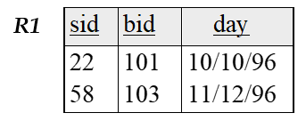

# Part 01 S E P T .

## Lecture 01 Overview

1. Database 数据库：一个非常大的，结构化的数据集合
   * 数据：将事实和统计数据收集在一起以供参考或分析
2. DBMS 数据库管理系统：一种用于存储、管理和方便查询数据库的软件系统
   * 数据库系统：数据库 + DBMS
3. DB的典型应用：联机事务处理(OLTP)、在线分析处理(OLAP)和数据仓库
4. Search & Query：前者是无结构的，后者是有结构支持的

5. DBMS的优点（相较于文件存储）： 
   * 良好的数据建模
     * 数据独立性
     * 数据完整性和安全性
   * 简单而高效的特别查询
     * 减少应用程序开发时间
   * 并发控制
   * 崩溃恢复

6. DM (Data Mining) 数据挖掘：对大量数据的探索和分析，以发现数据中有效的、新颖的、潜在有用的并最终可理解的模式
   * 大数据 (Big Data)：大容量、高速度、多样性、诚信度

8. 数据模型：用于描述数据的概念的集合
   * **模式（schema）**：使用给定数据模型对特定数据集合的描述
   * 关系数据模型：目前使用最广泛的模型
     * 主要概念:关系，基本上是一个有行和列的表
     * 每个关系都有一个模式，用于描述**列或字段（fields）**
     * 关系模式（relation schema）是对应关系的模板（template）
9. DBMS的抽象层次：外部模式（视图）、概念模式、物理模式（类似于数据结构的逻辑和物理）
10. 数据独立性（使用DBMS的好处）：应用程序与数据的结构和存储方式隔离（逻辑独立 + 物理独立）
11. 关系型DBMS的查询：
    * 非过程查询语言：SQL（结构化查询语言）

## Lecture 02 The Relational Model 

1. **键（key）**
   1. 主键（Primary Key）: PRIMARY KEY; 
   2. 外键（Foreign Key）：一个关系中的字段集，用于“引用”另一个关系中的元组，像一个逻辑上的指针
      1. **引用完整性（Referential Integrity）：外键必须在基表上存在**
         * 删除基表一元组时会影响引用该元组的表，破坏引用完整性，一些此策略包括：级联删除、禁止引用(?)、置默认值、置NULL
   3. 多个外键可以构成一个主键
   4. 超键（Super key）：唯一界定一张表里的某一行，值不重复
   5. 候选键（Candidate keys）: UNIQUE，也唯一界定一张表里的某一行，值不重复
   6. 键（Key）的两个要求：是超键；且它的任意真子集不构成键
   
   * 注：下划线代表主键，**多个下划线代表其构成的集合称为主键**，而非主键和候选键
   
     

> 不同的查询顺序会导致查询次数的不同，通过合理的安排减少查询的次数以增加查询速度。
>
> 预处理选课表（排序、哈希）也可以增加查询速度。

2. SQL - query：SELECT（选列） FROM（选表） WHERE（选行）

   > cross-product 向量积 （笛卡尔积）

## Lecture 03 Relational Algebra

1. 运算符
   * **Selection $\sigma$** 选择，选中行 

     > 选这个符号的原因是因为 sigma 和 selection 开头都是 s

     * 实例：$\sigma_{rating > 8}(S2)$

   * **Projection $\pi$ 选中列**

     > 选这个符号的原因是因为 projection 和 pi 开头都是 p

     * 实例：$\pi_{sname,rating}(S2)$，选择表S2中的那两列$sname$和$rating$
       * 得到的子项需要考虑消除重复：可以通过排序 / 哈希
         * 元组的排序：不能直接交换元组，而应交换指针

   * **Cross-product $\times$** 叉乘、笛卡尔积
     * 实例：$\rho(C(1 \to sid1, 5 \to sid2), S1 \times R1)$
       * **$\rho$表示改名**结果表为C，第一列改名为“sid1”，第二列改名为“sid2”
     
   * **Set-difference $-$** 集合的差

   * **Union $\cup$** 并集 
     * 一是列项相同，二是去重
       * 去重：排序顺便去重
     
   * **Intersaction $\cap$** 集合的交

   * **Join $\Join$** 自然连接
     * 比较慢的计算方法：先做**笛卡尔积**，再根据公共列从笛卡尔积上选中公共列值相同的行（选行），最后消除多余的公共列（选列）
     * **笛卡尔积 寻找公共属性 消除重复列**
     
   * **Condition Join** $\Join_c$
     * 写法：$R \Join_c S = \sigma_c (R \times S)$：c指条件，例如$S1.sid < R1.sid$
     * 注意，没有去掉公共列的条件（因为有时候条件是比较两表名称相同的列）
     * Equi-Join 等值连接，条件是个等式的条件连接 
     
   * 综合实例：$\pi((\sigma_{bid = 103}Reserves) \Join Sailors)$，先对$Reserves$找bid=103的列，在将这些结果与Sailors表做自然连接，最后在结果中选出名字一列。$\pi(\sigma_{bid = 103}(Reserves \Join Sailors))$也可以得到结果，但查找次数不同。
     * 先做选择度比较强的条件更高效。
     
   * 注意
     * 自然连接发生在主键外键之间——外键需要在主键中存在
     * 做笛卡尔积之前可以仅取所需要的列，可以节省空间
     * 注意 $\cap$ 时的逻辑：比如既开过船A有开过船B的水手

   ## Lecture 04 SQL

1. 关系代数表达式：逻辑层面，而SQL还可以指明具体的查询方式

3. 基本 SQL

   ```sql
   SELECT [DISTINCT] target-list
   FROM relation-list
   WHERE qualification
   ```

   * 其实WHERE是可以省略，来表示不晒选行

   * 显示指明DISTINCT：**消除重复列**

   * 别名：Range Variables

     * 自身连接 SELF-JOIN 的情况：

       ```SQL
       SELECT  x.sname, x.age, y.sname, y.age
       FROM    Sailors x, Sailors y
       WHERE   x.age > y.age
       ```

   * SELECT、WHERE可以加入算入表达式

   * AS关键字：由于给算数表达式起名

   * LIKE关键字：用在WHERE，满足模板

     * `_` 表示任何一个字符
     * `%` 表示上一个字符有0个或多个

   * UNION：将两个查询结果并在一起

   * INTERSECT：将两个查询结果交在一起

     ```sql
     SELECT S.sid
     FROM   Sailors S, Boats B, Reserves R
     WHERE  S.sid=R.sid 
     	    AND R.bid=B.bid
     	    AND B.color=‘red’
     INTERSECT
     SELECT S.sid
     FROM   Sailors S, Boats B, Reserves R
     WHERE  S.sid=R.sid 
     	    AND R.bid=B.bid
              AND B.color=‘green’
     ```

     > 或者使用自交来完成上述逻辑
     >
     > ```SQL
     > SELECT R1.sid
     > FROM   Boats B1, Reserves R1,
     >        Boats B2, Reserves R2
     > WHERE R1.sid=R2.sid
     >         AND R1.bid=B1.bid 
     >         AND R2.bid=B2.bid
     >         AND (B1.color=‘red’ AND B2.color=‘green’)
     > ```

   * EXCEPT：减表（上表减去下表）

   * IN / NOT IN：实现嵌套查询

     ```sql
     SELECT S.sname
     FROM   Sailors S
     WHERE  S.sid IN 
        (SELECT  R.sid
         FROM    Reserves R
         WHERE  R.bid=103)
     ```

   * EXISTS / NOT EXISTS：以下示例与上一段代码逻辑相同，但以下代码具有主外键的检查

     ``` sql
     SELECT  S.sname
     FROM    Sailors S
     WHERE EXISTS 
           (SELECT  *
            FROM  Reserves R
            WHERE R.bid=103 AND S.sid=R.sid)
     ```

     看作函数：外层传入参数S，调用内层

   * ANY / ALL

     ``` sql
     SELECT *
     FROM   Sailors S
     WHERE  S.rating > ANY 
        (SELECT  S2.rating
         FROM  Sailors S2
         WHERE S2.sname=‘Horatio’)
     ```

     这个例子使用了别名

   * GROUP BY 聚合成组（后面接参数为分组依据）

     * For each rating, find the average age of the sailors

       ``` SQL
       SELECT  S.rating,  AVG (S.age)
       FROM  Sailors S
       GROUP BY S.rating
       ```

   * HAVING 对分组进行限制

     ``` sql
     SELECT  S.rating, MIN (S.age)
     FROM  Sailors S
     WHERE  S.age >= 18
     GROUP BY  S.rating
     HAVING  COUNT (*) > 1
     ```

   * ORDER BY 排序 

     ``` sql
     SELECT  S.rating, S.sname, S.age
     	FROM  Sailors S, Boats B, Reserves R
     	WHERE  S.sid=R.sid 
     		AND R.bid=B.bid AND B.color=‘red’
     	ORDER BY  S.rating, S.sname;
     ```

   * null 

   * JOIN 连接

     ``` sql
     SELECT (column_list)
     FROM  table_name
       [INNER | {LEFT |RIGHT | FULL } OUTER] JOIN table_name
         ON qualification_list
     WHERE …
     ```

     * INNER JOIN 内连接

       ``` SQL
       SELECT s.sid, s.name, r.bid
       	FROM Sailors s INNER JOIN Reserves r
       	ON s.sid = r.sid
       ```

     * LEFT OUTER JOIN 左外连接：以关键词左侧的表进行连接
       * 连接：不满足符合连接条件的元组也输出（**用空值来表示**）
     * RIGHT OUTER JOIN 右外连接
     * FULL OUTER JOIN：两边没获得匹配的元素都输出，空值代替

   * 一些可用的数学函数

     * COUNT(*) / COUNT([DISTINCT] A)
     * SUM([DISTINCE] A)
     * AVG([DISTANCE] A)
     * MAX(A) MIN(A)

   * CREATE VIEW 创建视图，可以看作创建了一个临时变量

     ``` sql
     CREATE VIEW Reds
     AS SELECT  B.bid,  COUNT (*) AS scount
          FROM Boats B, Reserves R
          WHERE  R.bid=B.bid AND   B.color=‘red’
           GROUP BY  B.bid
     ```

   * 权限

     * 可以作用在表、视图上，
     * 特权包括：选择、插入、删除、引用、ALL
     * 授予、回收
     * 指定用户、用户组

   * CHECK 约束（创建表时）

     ``` sql
     CREATE TABLE   Sailors
     	( sid  INTEGER,
     	sname  CHAR(10),
     	rating  INTEGER,
     	age  REAL,
     	PRIMARY KEY  (sid),
     	CHECK  ( rating >= 1 
     		AND rating <= 10 ))
     ```

     > <>：不等于
     >
     > ``` sql
     > CREATE TABLE  Reserves
     > 	( sname  CHAR(10),
     > 	bid  INTEGER,
     > 	day  DATE,
     > 	PRIMARY KEY  (bid,day),
     > 	CONSTRAINT  noInterlakeRes
     > 	CHECK  (`Interlake’ <>
     > 			( SELECT  B.bname
     > 			FROM  Boats B
     > 			WHERE  B.bid=bid)))
     > ```
     >
     > 上述的含义是：不允许叫Interlake的船被预约。

