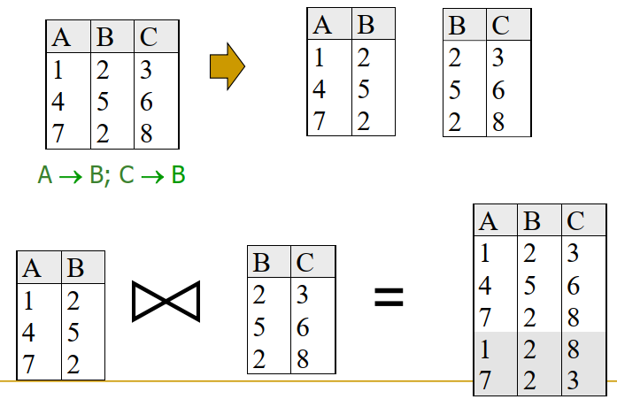

# 3Part 03 国庆后

## Lecture 10 模式优化和范式

> Schema Refinement and Normal Forms

* **冗余 Redundancy**
  * 危害：冗余的存储、插入、删除、更新时破坏原子性
* **函数依赖 FD Functional Dependencies** $X \to Y$ 
  * **就是这一列决定那一列**
  * 非主键的函数依赖造成冗余 - 解决方法：分解成两个子表
  * 函数依赖的推理 Reasoning
    * 函数依赖的蕴含 Implied F蕴含f表示F成立时f也成立。
      * $F^+$ 为F的闭包，F是一个函数依赖
    * 在下面：$X,Y,Z$**都是属性集合**
    * **并**：$XY = X \cup Y, X, Y \subseteq X \cup Y $ 
    * Armstrong Axioms：（正确，完备的）
      * 反射 Reflexivity: if $Y \subseteq X$, then $X \to Y$ 全局决定部分
      * 增广 Augmentation: if $X \to Y$ then $XZ \to YZ$ for any $Z$ **并**
      * 传递 Transitivity: if $X \to Y$ and $Y \to Z$ then $X \to Z$
    * 推论：
      * Union：if $X \to Y$ and $X \to Z$, then $X \to YZ$
      * Decomposition：if $X \to YZ$, then $X \to Y$ and $X \to Z$
  * **ER图**：矩形表示实体，椭圆表示实体的属性，菱形表示两个实体之间的的联系，实体可以有自己的属性。
* **属性闭包$X^+$ Attribute Closure**：（首先还有个东西叫做函数依赖的闭包$F^+$）
  * 函数依赖的闭包指一个函数依赖所能推出的所有依赖关系的集合。
  * 属性闭包：一个属性集合，属性$A$的闭包，指在属性集$R$和函数依赖$F$（需要先求出函数依赖的闭包$F^+$）下，属性$A$能推出的所有属性的集合。
  * 属性闭包的计算：先将$X^+$赋值为$X$，然后如果能从$X^+$里头的一个子集$X’$的元素推出$F^+$中某个函数依赖$F'$的右侧，则将这个$F’$的右侧加入$X^+$（循环执行）
  * 用于**推理**：给定一个属性集合$R$和对应的所有依赖关系$F$，判断一个属性$X$是否能推出$Y$，只需要判断$Y$是否存在于$X^+$中
  * 用于找出一个属性集R的键（Key）：找出超键（集合S，$S^+ = R$），然后最小化（证明S的任何子集不构成超键）

> 完备：空间内所有输入构成的集合通过这个定理推出的输出集合等于这个空间？
>
> （完备和封闭好像是不一样的） 一个公理是封闭的应该指：在某个运算空间内运用这个定理，得到的结果都能落在这个空间内

* **范式 Normal Forms**：

  * **范式的类型**：
    
    * 第一范式：（限定条件最弱）对关系模式的要求是所有属性都必须是原子的，不允许一个属性是一个链表，数组或集合。指不允许一个关系表作为另一个关系表的属性值？
    * 第二范式
    * 第三范式
    * **BCNF范式**：（约束条件最多）给定关系模式R，上面定义了一组函数依赖F，从逻辑上检查F的闭包里的每一条函数依赖$X \to A$，看是否满足：$A$属于$X$（Non-trival 平凡依赖）或$X$是$R$超键（主键的约束），**不允许非主键的非平凡的函数依赖**。
    
  * **模式的分解** Decompostition ：将一个关系模式分解成多个子关系模式。

    * 有损连接的分解：凭空生成新的信息

      

    * **无损连接分解**：

      * 大表 $R$ 要拆成小表 $X$ 和 $Y$ 是无损分解的充要条件：**$F$的闭包$F^+$内存在$X \cap Y \to X$ or $X \cap Y \to Y$**
      * 如果在大表 $R$ 上有 $W \to Z$，并且 $W \cap Z = \Phi$，就有 $R$ 分解为 $R - Z$ （减很简单的，从大表中减去Z中的列）和 $WZ$ 的分解是无损的。

    * **依赖保持分解**：

      * **投影** Projection：**如果$R$能分解为$X$和$Y$，$F$在$X$上的投影$F_X$是一个满足$U \to V \in F^+, \forall U,V \in X$的函数依赖的集合**
      * 如果$(F_X \cup F_Y)^+ = F^+$，则 $R$ 分解为 $X$ 和 $Y$ 是依赖保持的

    * BCNF范式上的分解：

      * 对于BCNF范式，如果$X \to Y$，则分解$R$为$R - Y$和$XY$一定是无损分解。

    * NCNF上的依赖保持：BCNF范式不保证分解是依赖保留的。

    * **第三范式 3NF**：对于任意函数依赖$X \to A \in F^+$，满足$A \in X$ or $X$是$R$的超键 or **$A$是$R$中一个候选键的真子集**（第三个条件区分3NF和BCNF）。

      * 在第三个条件中，键的极小性 Minimality 是至关重要的。（这啥？）
      * 无损连接（自然连接结果等于原表）、保持依赖（拆表后函数依赖是否保持下来，避免临时性的连接）的R分解为3NF关系的集合总是可行的。
      * 违反3NF的两种情况：
        * 部份依赖：X是键K的一个子集
        * 传递依赖：X不是任何键的子集
      * 3NF的无损分解：和BCNF是一样的
      * **最小覆盖集**：最小覆盖集$G$是一个函数依赖集合，满足：
        * **$F^+ = G^+$**
        * **对$G$中任意一个函数依赖$FD$（$X \to A$），其中$A$是一个单一属性**
        * **如果删除一个函数依赖或从$G$中删除一个函数依赖的属性来修改$G$，闭包就会改变（最小化）**
        * **生成最小化覆盖的算法**：
          * **函数依赖标准化**：使用分解（if $X \to YZ$, then $X \to Y$ and $X \to Z$），来获得一个等价的函数依赖集（满足右侧都是单一属性）
          * **最小化函数依赖的左侧**：对于每一个函数依赖，检查左边的属性看看它能不能在保留$G^+ = F^+$的前提下删除。
          * **删除冗余的函数依赖**：在保留$G^+ = F^+$的前提下删除多余的函数依赖。
        * 3NF保持依赖分解：
          * 令$R$是函数依赖最小覆盖集，令分解为$R_1,R_2...R_n$
          * 对于每一个$R_i$，令$F_i$为$R_i$在$F$上的投影
          * 确定函未保留的函数依赖的集合$N$，对于N中的每一个函数依赖$X \to A$，创建一个$XA$加入$R$的分解

