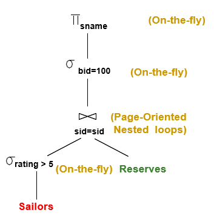
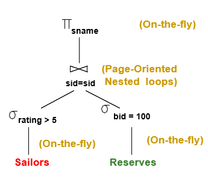

# 听一下课 谢谢

> **Review**:
>
> SQL - FROM：多表 - 用笛卡尔积拼表
>
> 元组标识符：页号 Page + 槽号 Slot
>
> Retrieve：检索

## Lecture 8 Query Processing

> 本节统一使用的案例：
>
> Sailors (sid: integer, sname: string, rating: integer, age: real)
> Reserves (sid: integer, bid: integer, day: dates, rname: string)
>
> Sailors:
> Each tuple is 50 bytes long,  80 tuples per page, 500 pages.
> [S]=500, pS=80. 
> Reserves:
> Each tuple is 40 bytes,  100 tuples per page, 1000 pages.
> [R]=1000, pR=100.

首先考虑如何实现基本的关系操作：

* **选行** Selection

  * 选择度 Selectivity：满足这个条件的元组占所有元组的比例

  * Options：

    * 遍历一遍

    * 带有索引（B+树）的选行：

      1. 使用索引找到满足需要的数据项 Data Entries
      2. 根据数据项找对应的数据记录 Data Record

      > 考虑是否聚簇：如果选择度为 10%，对于 R表有100页，也就是10000元组命中
      >
      > 对于聚簇的，IO次数为100左右
      >
      > 对于非聚簇的，如果不使用优化，IO次数为10000左右

    * 带有非聚簇索引（B+树）的选行优化
      1. 使用索引找到满足需要的数据项 Data Entries
      2. 对数据项的 RID（页码）进行排序
      3. 按照排序结果来取数据记录

  * 通常的选行条件：多个条件用 AND / OR 连接

    * 做法：首先转化为合取范式（CNF：析取项和合取）

    * 方法 1：

      * 找到最便宜的访问路径：IO访问最少

        * 考虑适用 哈希 还是 B+树

        > * 对于B+树：建立数据项按照A, B, C来排序写作<a, b, c>，如果查询a=5 b=3比较好找，因为是前缀，但直接查b=3不好查询，因为b不是前缀，b的排列被a隔开了。
        > * 对于哈希：要有建立在待搜索项上的 Index

      * 然后根据此找需要的元组

    * 方法 2：

* **选列** Projection

* **自然连接** Join

* **相减** Set-difference

* **取并** Union

* （启发式策略）：首先考虑有索引支撑的，再用剩下的子条件逐条过滤

  

* 哈希索引不利于支持范围查询，范围查询就是小于，大于这类的

* 分别找再算交集

---

以上是选行的考虑，以下是选列：选列主要考虑的问题就是消重 Removing Duplicates

* 使用排序，扫描并并只取出需要的属性，在对选出的结果进行排序，排序后线性遍历相同的东西取一个。

* PPT 17页：代价的计算
  * $1000 + 250$指取出所有的1000个页面，然后选列（空间只占原来的0.25）故只用250个页面写回 
  * 250Page 用20Page的缓冲区进行外排序，需要两趟，每一趟对所有页面进行一次读一次写（共2次IO），故有$2*2*250$
  * 最后$+250$表示遍历一边需要读入页面数目
  * 输出不考虑，因为所有方法的输出代价都是固定的

* PPT18页：原理为避免临时文件的硬盘写入
  * 扔掉多余的属性值后就马上对它排序（外排序：趟 0）
  * 躺1+排序是顺便去重
  * $1000 + 250 + 250$：1000次硬盘写入内存，250次IO为将初始排序段写入硬盘，躺1取出250页面排序并去重

---

* 自然连接：
  * SNLP 简单的嵌套循环连接：$R * S * P_R + R$ 加号后面是读入 R 的 IO 次数，加号前面是 S 读入 S 的次数。（假定左侧的表为外层循环）
  * 基于页面的嵌套循环：四层循环，先便利页面，再遍历元组
  * 基于块的嵌套循环连接：设Buffer有B个页面，选B-2个页面作为R的缓冲取，一个页面作为S的缓冲区，1个为Output，有**Total = [S] + [S] / (B-2) * [R]** (能够充分利用缓冲区的数目)
  * 基于索引的嵌套循环连接（建树）
    * 对一个表建树，另一个根据内容查找树，需要考虑是否聚簇。
  * 排序归并连接 = **分别排序的读写IO(排序趟数 * 2 * 页面数) + [R] + [S]**
    * 会有一种情况：就是两张表已经排序了，代价就变成了 [R] + [S]
    * 归并排序有一个好处就是让结果是有序的。
  
  * 哈希连接：只能处理等值连接
    * 分桶：使用同样的哈希函数对两个表进行分组 Partitions
      * B个内存页面里拿一个作为输入，B-1个作为数据输出缓冲区，哈希函数为 hash(key) mod (B-1)，每当一个输出缓冲区页面满了，就写到硬盘上
      * 把一个分组（假设分组大小小于 B-2个页面）扔进来，（内存临时建立哈希表）使用另一个哈希函数整到(B-2)个输入缓冲区内，剩下一个输入缓冲区和一个输出缓冲区。
      * Si的每一个元组经过哈希函数落到B-2个元组中，去探测然后满足条件的扔到输出缓冲区。
      * 注：缓冲区的页面有大小限制，$[R] / (B-1) \le (B-2)$ 因此 $B$ 必须要大于 $\sqrt{[R]}$ (倾向于把比较小的表作为用来等待探测的表（就是此处的R）)
      * 注：考虑实际情形：每个桶的页面的是不均匀：可以递归的使用哈希。
      * 代价估算：哈希阶段分桶：2([R]+[S]) 次IO，在匹配阶段读入：[R]+[S] ，总次数为 **3([R] + [S])**

* 交和笛卡尔积都连接的特例
* 减
  * 
* Union：
  * 排序再去重

----

以上是单个操作符的处理，以下是多个操作符查询的处理

Query Execution

* 迭代器模型 Iterator Model
  * 实现Next()接口
  * 一次一条元组，返回一条元组？频繁的函数调用

* 物化模型 Materialization Mmodel
  * 对所有输入一次性处理然后输出所有结果？对空间的需求？

* 矢量化/批模型
  * 放一部分

自顶向下和自底向上

---

# 查询优化

> On the fly: 像流水线一样，一有输入就处理？

> Sailors (*sid*: integer, *sname*: string, *rating*: integer, *age*: real)
>
> Reserves (*sid*: integer, *bid*: integer, *day*: dates, *rname*: string)
>
> Reserves:
>
> Each tuple is 40 bytes long, 100 tuples per page, 1000 pages.
>
> Assume there are 100 boats
>
> Sailors:
>
> Each tuple is 50 bytes long, 80 tuples per page, 500 pages.
>
> Assume there are 10 different ratings 
>
> Assume we have 5 pages in our buffer pool!

变换树的各个节点的位置，不同树反映着不同的查询计划，每一个节点还需要具体的指明物理查询方法。

找到最理想的计划，预估代价，避免最差的计划

在数据字典里预先搜寻一些信息：

* 估算选择度

----

# 11.10 

* 节点可指明实现方式

  * **On the fly** ：一种节点实现方式，不使用中间文件（写到硬盘上）直接推送，好处是减少IO次数

* **选行条件下推** Push Seclect （一般作为缺省的优化步骤）提前把选行条件下推 （这个东西可能需要缓冲区模拟来理解）

  * 如果连接使用的是基于页面的嵌套循环（规定左边为外层）

    |  |  |
    | ------------------------------------------------------------ | ------------------------------------------------------------ |

    * 一个表下推条件：（左图）

      * 500  + 1000 * 500 * 50% = 250500

    * 两个表下推条件：（右图，虽然老师说五个缓冲区，但是我觉得四个就OK了）

      * (50% * 500) * (1% * 1000) + 500 + 1000 + (1% * 1000) = 4010 

      * 最后一项是写10个硬盘到预约表

      * 他的意思是先用所有缓冲区把10个预约表筛选出来出来在放到硬盘里，这样你每次便利才能保证内层循环里可以直接读10页面。

      * 如果你不去这样做退化到 (50% * 500) * (1000) + 500 + 1000 了

  * 如果使用排序归并连接（右图）

    * 扫描 + 选行并写回 + 外排序 + 归并
    * (1000 + 500) + (10 + 250)  + (2\*2\*10 + 2\*4\*250) + (10 + 250) = 4060

  * 如果使用基于块的嵌套循环连接（右图）

    * 初始扫描并选行 + 写选行结果入磁盘 + 块处理
    * (1000 + 500) + (250 + 10) + (10 + ceil(10 / 3) * 250) = 2770

* 系统R

> 动态规划：把问题划分为子问题，从规模最小的问题开始，利用依赖关系求解规模更大的子问题，直至得到原始问题为止。条件为最优子结构和无后效性

* 查询块 Query Block：将查询划分为块，对块内部单独进行优化

* 左深连接树 Left-Deep Join Tree：（逻辑上的一个查询计划）右侧分支始终为基表，每次左下到右上依次连接

* 关系代数的等价性：
  * 选行（尽量挑**选择度**小的放在内层使用）：
    * 级联 Cascade：多个条件一起选一次行，或多次选行每次只用一个条件（在右边的方案下级联遍历规模会因一次次搜索而减小）
    * 交换 Commute：先选条件A再选条件B和先选条件B再选条件A是等价变化
  * 选列：
    * 级联 Cascade：$\pi_{a_1}(R) = \pi_{a_1}(…(\pi_{a_1, …, an}(R))…)$
  * 笛卡尔积 / 自然连接：（不考虑笛卡尔积结果列的顺序）
    * 结合律和交换律
  * 更多等价条件：
    * 选列与选行交换：选列条件 可以与 只使用该选列结果的选择条件 进行交换。
    * 笛卡尔积转自然连接：在笛卡尔积的两个参数对应的属性之间进行的选行 可以转化为 一个自然连接
    * 换行与自然连接的结合（提前进行选行，选行下推）：对两张表的自然连接进行选行 等价于 对一张表进行选行 在于另一张表进行自然连接
  
* 估算代价 Cost Estimation 
  * 除了考虑 IO次数，还应考虑 CPU 计算代价，并且给出二者的换算因子
  
* 一张表的信息：元组数、页面数、最小最大值、一个列的不同取值总数、索引的高度、索引所占的页面数

* 规模估算和选择度：（启发式）
  * 最大输出行数：输入行数的积
  * 选择度：输出 / 输入行数
  * 实际行数 = 最大输出行数 * 所有表选择度的积？
  * 选择度估算：
    * $ col = val$： 选择度 = 1 / 一个列的不同取值总数 （均匀分布的假设）
    * $col_1 = col_2$​：选择度 = 1 / max(两表中一个列的不同取值总数)
    * $col > val$：选择度 = (最大值 - $val$) / (最大值 - 最小值)

* 动态规划生成连接计划：首先要求子计划是最优的

* 单关系计划的代价估计：
  
  * 索引扫描：树高 + 1
  * 聚簇索引：索引页数 + 数据页数
  * 非聚簇索引：索引页数 + 元组总数
  * 顺序扫描：索引页数
  
  > 聚簇：索引项和数据项一致？
  >
  > 复习：
  >
  > Records live on *pages*
  >
  > **Physical Record ID (RID) = <page#, slot#>**
  >
  > Records can have fixed length or variable length
  >
  > 复习：**索引项和数据项**
  >
  > In B+ tree, an index entry is a pair of < key, page id>
  >
  > **an data entry is one of <key, record> or <key, RID> or <key, list of RIDs>** 
  >
  > Each internal node contains *m* (**d** ≤ *m* ≤ 2**d**) index entries. An index entry direct search for data entries in leaves.
  >
  > Each leaf node contains *m* (**d** ≤ *m* ≤ 2**d**) data entries 
  >
  > B+ Tree: The ROOT node contains between 1 and 2**d** index entries. The parameter **d** is called the *order* of the tree.

---

* 拼表的优化：遗传算法 旅行商问题
  * n 张表对应旅行商问题的 n 个城市（一个序列就可以是一个编码），然后通过遗传算法求得最优解
* PPT37 不仅只考虑单张表查询的最有计划，因为一些查询语句可能产生一些对之后查询有价值的东西（Interesting order columns），例如GROUP BY的KEY和拼表的KEY相同时
* **查询优化（物理计划代价估算）**：
  * 趟 1：为单独获取每个关系表找到最佳方案
  * 趟 2：对于第1步中的每个计划，使用所有连接方法（并匹配内部访问方法）生成连接另一个关系作为内部关系的计划，并为每个连接保留最便宜的计划（考虑关系对、顺序等有价值的东西）
  * 趟 3+：使用上一趟的计划作为外部关系表，生成下一个连接的计划，考虑 GROUPBY / AGGREGATE 增加的成本，最后选择最便宜的方案。
