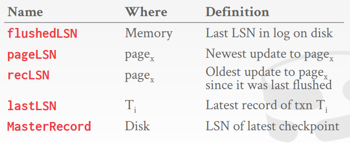

# 12月

# Lec 16 并发控制理论

> **并发的关键是你有处理多个任务的能力**，不一定要同时。
>
> **并行的关键是你有同时处理多个任务的能力**。
>
> DBMS的并发控制和恢复组件贯穿于其整个体系结构的设计之中。

* **事务 txn** Transaction：一系列有序的数据库操作。事务包装一个应用，包含了一组动作

* 允许互不相关的事务并发执行：更好地利用CPU/IO资源、带来更大的吞吐量、降低用户的响应时间

* 定义：数据库 - 一组固定的命名数据对象（A B C）；交易 - 一组有序的读写操作（R(A) W(B)）

* 概念：

  * 我们用 BEGIN 表示交易的开始；

  * 一个事务以 COMMIT（提交）或 ABORT（中止）停止；

  * **FORCE 和 NO-FORCE** ：FORCE 策略表示事务在提交之后必须将所有更新立刻持久化到磁盘；NO-FORCE 表示事务在committed之后可以不立即持久化到磁盘， 这样可以缓存很多的更新批量持久化到磁盘，这样可以降低磁盘操作次数（或顺序写）

  * **STEAL 和 NO-STEAL**：分别表示缓冲区用又需要缓冲区框时，前者允许从别的事务占用的缓冲区框中偷一个页面（别的事务写回一个缓冲区框的内容（脏页），但是如果别的事务执行失败，就会导致不该写的写出去）

  * STEAL / NO-STEAL 主要决定了磁盘上是否会包含 UNCOMMIT的数据。FORCE / NO-FORCE 主要决定了磁盘上是否会不包含已经 COMMIT 的数据。

    

* **正确性标准 ACID**，指数据库管理系统（DBMS）在写入或更新资料的过程中，为保证事务（transaction）是正确可靠的，所必须具备的四个特性：
  * **原子性**（atomicity，或称不可分割性）：交易中的所有操作都发生，或者不发生。
  * **一致性**（consistency）：如果每个交易都是一致的，并且数据库开始时也是一致的，那么它结束时也是一致的。
  * **隔离性**（isolation，又称独立性）：一个交易的执行与其他交易的执行是隔离的。
  * **持久性**（durability）：如果交易提交，其影响将持续存在。

* **事物的原子性**讨论：
  * 方法 1：日志 Logging
    * DBMS记录所有的操作，以便它可以撤消中止事务的操作；在内存和磁盘上维护撤消记录。
    * 处于审计跟踪和效率的原因，几乎所有数据库系统都采用日志。
  * 方法 2：影子页面 Shadow Paging
    * DBMS 复制页面，交易只对这些副本进行更改。只有当交易提交时，页面才对其他人可见。
* **事务的一致性**讨论：
* **事物的隔离性**讨论：
  * 并发控制协议：
    * 消极版本 Pessimistic：一开始就不要让问题出现
    * 乐观版本 Optimistic：假设冲突很少发生，在冲突发生后处理它们
* **事物的持久性**讨论：

---

* 正确性：如果调度等价于某个串行执行。

* 串行调度 Serial：不同事务的操作不交叉的调度。

* 等价调度：对于任何数据库状态，执行第一个调度的效果与执行第二个调度的效果是相同的，不管算术运算是什么。

* 可串行的调度 Serializable：一种调度，结果等价于事务的串行执行。如果每个事务保持一致性，那么每个可串行调度也保持一致性。

* **冲突操作：如果两个操作来自不同的交易，都在同一个数据对象上进行操作，且至少有一个是写操作，就说这两个操作是冲突的。**

  * R - W 冲突
  * W - R 冲突
  * W - W 冲突

* **冲突等价：两个调度是冲突等价的，当它们涉及相同事务的相同操作，并且每一对冲突操作的顺序都是相同的。**

* **调度S是冲突可序列化的，如果S冲突等价于某个串行调度**

  * 如果您可以通过交换不同事务的连续非冲突操作将S转换为串行调度，则调度S是可冲突序列化的。

* 依赖图 / 优先图 Dependency / Precedence Graph：有向图，结点表示事务

  * 如果事务 i 和事务 j 是有两个动作是冲突的，且 i 在 j 前面，则存在一条从 i 到 j 的边。

  * 如果有环，则是不可序列化。

  * 如果依赖图是一个有向无环图，一个拓扑排序就是一个串行的调度。

  * 例子：

    

* Blind write 盲写

#### Lec17 

我们需要一种方法来保证所有的执行计划都是正确的(即，可序列化的)，而不需要提前知道整个计划，数据库系统实际上通过上锁来避免冲突。

**对比锁定事务的锁与 Latch**

Latch 是操作系统提供的轻量级的锁

**S-LOCK（用于读的共享锁） 和 X-LOCK（用于写的排他锁）**

* **Shared** 和 **Exclusive**

* 事务申请锁，或者为将共享锁升级为排他锁

* 锁管理器授予（grant）或阻止（block）请求

* 事务处理完后要释放锁

* 锁管理器更新其内部锁表

**2PL 两阶段封锁**

协议不需要预先知道事务将要执行的所有查询。

* **阶段1：增长** Growing
  * 每个事务都从DBMS的锁管理器**请求它需要的锁**，锁管理器授予/拒绝锁请求。

* **阶段2：缩减** Shrinking
  * 事务在这个阶段只允许释放它以前获得的锁，不能获得新的锁。

就有若干个锁，一个事务开始时不断申请锁，一旦释放一个锁，就不能再申请锁，进入第二阶段。（若干个锁到底指什么：一个事务可以申请若干个资源的锁，一个表是一个调度，一个T是一个事务）

使用两阶段封锁可以保证冲突可串行化。

* **级联终止** Cascading Aborts ：出现在某一个事务以ABORT结束而不是SUBMIT时，别的事务利用了某个ABORT事务对某个资源的修改。
* **2PL的一些儿问题**
  * 有一些可能的调度是可序列化的，但不被2PL所允许，所以使用锁会限制并发性
  * Dirty Reads （就是级联终止导致的问题），我们要使用强严格的2PL来解决
  * 可能导致死锁，需要预防或检测。
* **强严格的两阶段封锁**
  * 在阶段2：**要求所有锁一次性释放**，在调度表上表现为一个事务就执行他的各种操作完后执行连续的UNLOCK
  * 让调度趋于串行，效率变低，也会产生死锁

* 严格的调度：如果一个事务写入的值在该事务完成之前没有被其他事务读取或覆盖，则调度是严格的。
  * 它的优点是不会产生级联终止

**死锁问题**

---

**Intention 意向锁**

主要用途：调整B树的并发控制。

意向锁允许在共享或独占模式下锁定更高级别的节点，而不必检查所有的后代节点。如果一个节点在意向模式下被锁定，那么某些事务在树的较低级别上进行显式锁定。

要IS，IE锁，反正就是在下一层明确地加锁。

**LATCH CRABBING/COUPLING** B树执行并发控制的一般机制

<u>先申请父节点的锁，再申请子节点的锁</u>，如果父节点不受影响，可以释放掉父节点的锁

<u>安全节点</u>：更新时不会改变树结构的节点（未满插入，删除后·未半满）

对于读操作，每获得一个节点的锁就释放上一层节点的锁；对于插入删除操作，如果子节点是一个安全节点，就可以释放掉以上所有父节点的锁。

---

#### 故障恢复（不考）

* **Undo 和 Redo**：

  * Undo ：回滚、撤销

  * Redo：重做

* **FORCE 和 NO-FORCE** ：FORCE 策略表示事务在提交之后必须将所有更新立刻持久化到磁盘；NO-FORCE 表示事务在committed之后可以不立即持久化到磁盘， 这样可以缓存很多的更新批量持久化到磁盘，这样可以降低磁盘操作次数（或顺序写）
* **STEAL 和 NO-STEAL**：分别表示缓冲区用又需要缓冲区框时，前者允许从别的事务占用的缓冲区框中偷一个页面（别的事务写回一个缓冲区框的内容（脏页），但是如果别的事务执行失败，就会导致不该写的写出去）
* NO STEAL + FORCE 在内存中复制一个新页面，然后写

* 影子页面（不讲）：复制一份，修改在复制的页面上进行
* **提前写日志技术 Write-ahead Log (WAL协议)**
  * **日志先写到硬盘上了，然后再考虑写相应的数据页面**。
  * 大家都用的，STEAL + NO-FORCE 运行性能最快，恢复性能最慢
  * BEGIN的日志记录 到 COMMIT的日志记录，记录全部写道硬盘上并确认后，事务才真正提交了，才可以释放锁，最后再写一个END的日志记录。
  * 日志记录的内容：事务的ID，数据对象的ID，前映像（修改前的值，用于UNDO），后映像（修改后的值，用于REDO）。
  * 日志缓冲区，写入硬盘的条件是一个事务将要提交或者缓冲区满了（因为给日志的缓冲区是有限的）。用两个日志缓冲区来实现双缓冲，一个写入硬盘时另一个开始做日志。
* 如何做日志：
  * **物理日志**：记录内容，保存偏移量，可以直接定位修改的地方
  * **逻辑日志**：记录操作语句
  * **混合日志** Physiological ：与物理日志的差别就是将偏移换为了槽号
* CHECKPOINTS 检查点 55
  * 银行 - 20年交易记录 太久远的日志就不要啦？
  * DBMS定期采取一个检查点`<CHECKPOINT>`，将所有缓冲区刷新到磁盘上：将当前驻留在主存中的所有日志记录输出到稳定存储中；将所有修改过的块输出到磁盘；将条目写入日志，并刷新到稳定存储。
  * 检查点的设置：
    * 检查点的频率：
      * 检查点经常导致运行时性能降低，系统花费太多时间刷新缓冲区。
      * 但是等待很长时间也是很糟糕的，检查点将大而慢，恢复时间长。

### ARIES算法

* **LSN 日志序列号**

  

  * 在提前写协议中，一个页面X想要写入磁盘，pageLSH必须小于等于flushedLSN。
  * 每一条日志记录都有一个LSN
  * 每当一个页面被一个事务修改时，更新该页面的pageLSN
  * 每当数据库系统将WAL缓冲写入到磁盘时，更新内存中的flushedLSN

* 交易的提交 COMMIT

  * 写入提交记录到日志。
  * 事务的COMMIT记录之前的所有日志记录都被刷新到磁盘。
    * 日志刷新是顺序的，同步写入磁盘。
    * 每个日志页面有很多日志记录。

  * 当提交成功时，将一条特殊的 TXN-END 记录写入日志。
    * 不需要立即刷新。(NO-FORCE)

* 交易的终止 ABORT 

  * 我们需要在日志记录中添加另一个字段
    * 终止事务实质上是UNDO操作
    * prevLSN: 事务的前一个LSN，这为每个事务维护一个链表，使它容易遍历其记录。

* **补偿日志记录（CLR）**

  * **CLR 描述了撤销 ABORT 前一个更新记录的操作所采取的操作。**

  * 它包含更新日志记录的所有字段以及 undoNext 指针（下一个要被撤消的LSN）

  * CLR 被添加到其他记录的日志中，但是DBMS在通知应用程序事务中止之前不会等待这些记录被刷新。

    

    * TXN-END 做完后需要释放锁，如果出现页面被其他事务偷的情况，TXN-END 做完后还需要写硬盘。

* 做检查点的策略：

  * **NON-FUZZY CHECKPOINTS**

    * 当 DBMS 需要执行一个检查点时，它会暂停一切事务，停止任何新事务的启动，他需要等待所有正在跑的的事务执行完毕才能执行，才开始刷新磁盘上的脏页。

    * 这对运行时性能不利，但使恢复变得非常容易。

    * 每次做检查点时需要活跃事务表（ATT） 和 脏页表（DTT）
    * 脏页表里可能出现一些已经提交的页面，原因是NO-FORCE策略里还没有写入硬盘。 

  * **FUZZY CHECKPOINTS** 

    * 模糊检查点是DBMS允许活动的事务在系统将脏页刷新到磁盘时继续运行的地方。

    * 跟踪检查点边界的新日志记录:

      * 检查点开始：CHECKPOINT-BEGIN
      * 检查点结束：CHECKPOINT-END，包含ATT和DPT、

    * CHECKPOINT-BEGIN记录的LSN被写入数据库检查点成功完成时，磁盘上的主记录条目。检查点之后启动的任何都被检查点-结束记录中的ATT排除在外。

      

      