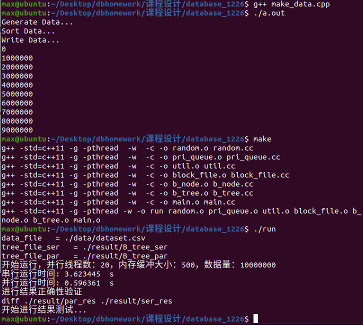
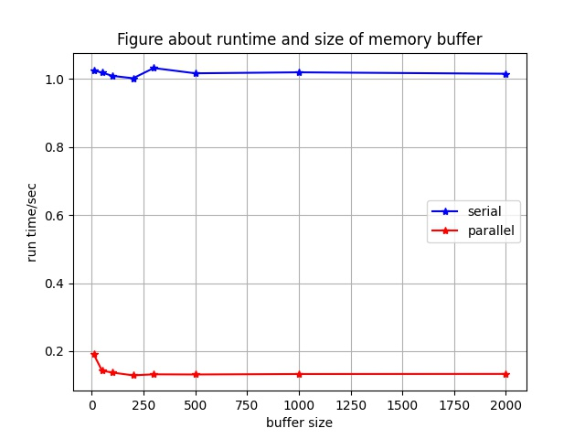
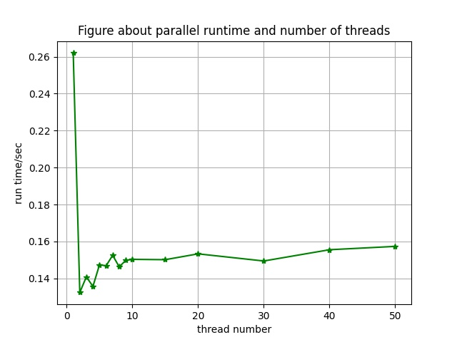
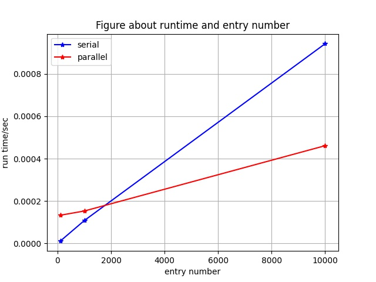
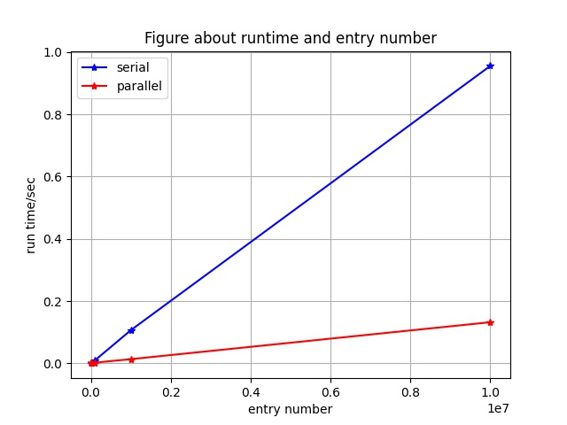

# README

[toc]

### 项目说明

* **课程大作业**：这是一份数据库系统课程设计的代码，课题为B+树 BulkLoading 多核并行设计。

* **我们的工作**：我们在原有的串行代码的基础上增加了并行BulkLoading的代码，并引入连续块IO读写的思路，优化了磁盘交互的方式。

* 更多实现细节与测试结果请参考项目报告。


#### 文件说明

| 文件名                        | 备注                                |
| ----------------------------- | ----------------------------------- |
| `b_tree.h  b_tree.cc`         | B+树的定义和实现，BulkLoading的实现 |
| `b_node.h  b_node.cc`         | B+树节点定义与实现                  |
| `block_file.h  block_file.cc` | 磁盘交互的定义与实现                |
| `main.cc`                     | 主程序                              |
| `pri_queue random util def`   | 辅助函数                            |
| `make_data.cpp`               | 数据集生成文件                      |
| `result/plot.py`              | 可视化测试结果文件                  |

* `./data`  数据文件
* `./result` 输出结果文件


#### 数据输入

编译运行 `make_data.cpp` 文件生成随机数据，可以在该文件中修改数据规模：

``` c
// Line: 46
int n = 20000000;	 // 表示数据个数，自己定义
```

生成的数据保存在 `./data/dataset.csv` 中，运行

**注：make_data.cpp 中的 `n` 要与 main.cpp 中的 `n_pts_` 大小相同，修改时须同时修改**


#### 数据输出

所有输出结果保存在子文件夹 `./result` 中

* **B+树二进制文件**：`B_tree_ser`（串行） 和 `B_tree_par`（并行）

* **B+树打印结果**：`ser_res`（串行）和 `par_res`（并行）

* **参数测试输出**：

  | 输出表格                | 备注                                                         |
  | ----------------------- | ------------------------------------------------------------ |
  | `result_bufferSize.csv` | 测试缓冲区大小对并行实现的影响，以一个缓冲区能放多少个块为单位 |
  | `result_entryNum.csv`   | 测试数据项数目对串行/并行实现的影响                          |
  | `result_threadNum.csv`  | 测试线程数目对串行/并行实现的影响                            |

* **可视化输出**：（由 `plot.py ` 生成）

  | 输出图像         | 备注                                                    |
  | ---------------- | ------------------------------------------------------- |
  | `bufferSize.jpg` | 测试缓冲区大小对并行实现的影响                          |
  | `entryNum1.jpg`  | 测试数据项数目对串行/并行实现的影响（范围：0-10000）    |
  | `entryNum2.jpg`  | 测试数据项数目对串行/并行实现的影响（范围：0-10000000） |
  | `threadNum.jpg`  | 测试线程数目对串行/并行实现的影响                       |


### 编译运行

* **环境**：Ubuntu

* **Makefile 脚本**

  使用 `make` 命令进行编译：在当前文件夹生成可执行的 .o 文件，然后将所有的 .o 文件合并成一个可执行的文件 ***run***

  使用 `make clean` 清除生成的 .o 文件

  运行命令：`./run`

* **run.sh 脚本**

  **需要安装 python3 及 matplotlib 库**

  运行 `chmod +x run.sh`，`./run.sh` 执行脚本自动编译运行程序，并运行 `plot.py` 生成可视化测试结果、

  注：此时需要将main函数中的注释`//evaluate()`的注释符号去掉，才能运行参数测试。
  
  

### 测试结果

* **终端输出**：（执行 diff 没有输出，说明二者相同）

  

* **可视化输出**：

  |  |  |
  | ------------------------- | ------------------------ |
  |   |  |

  