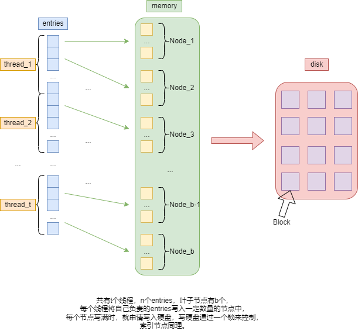
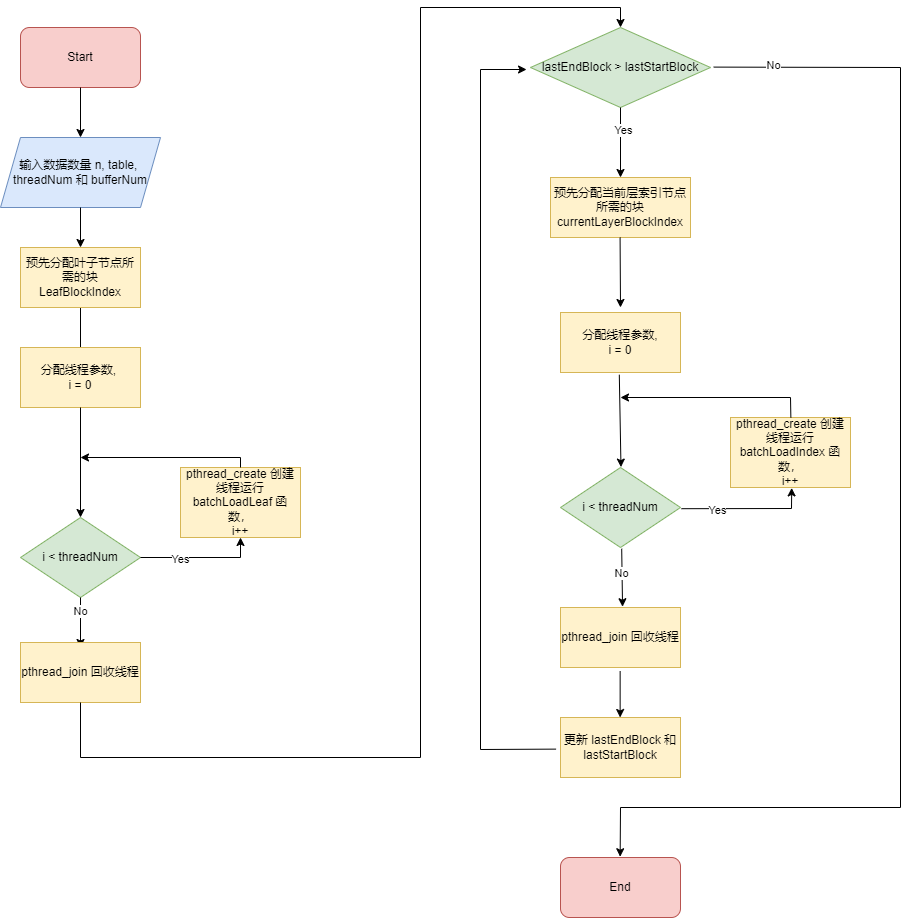
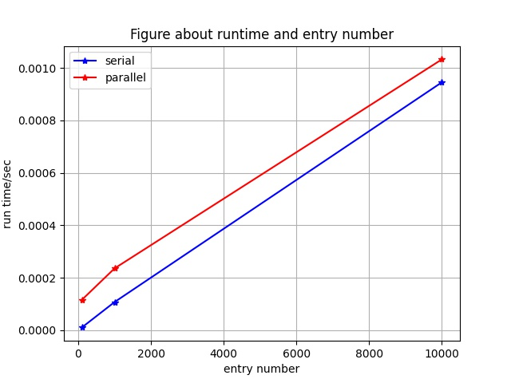
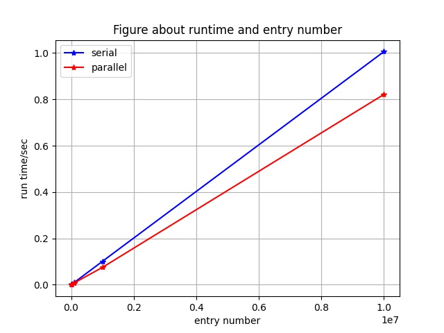
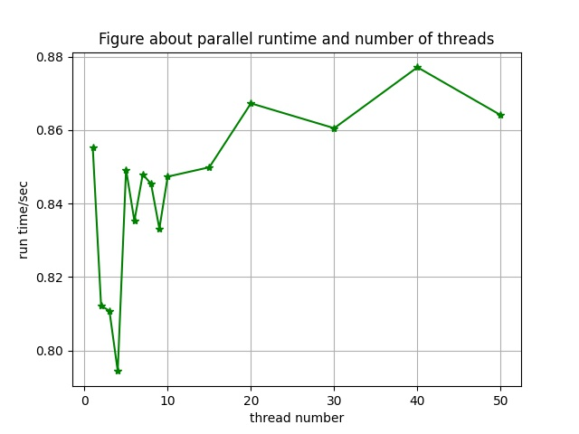
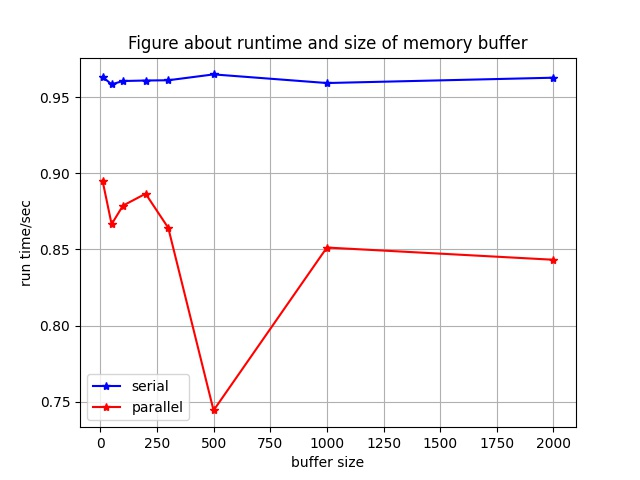
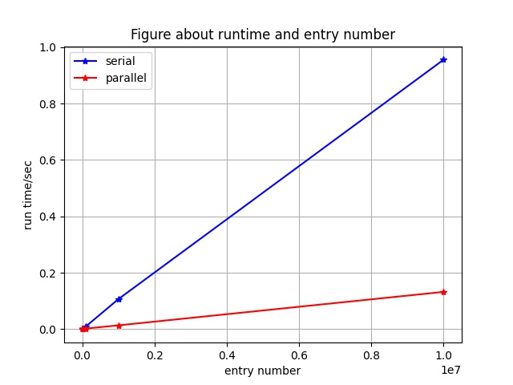
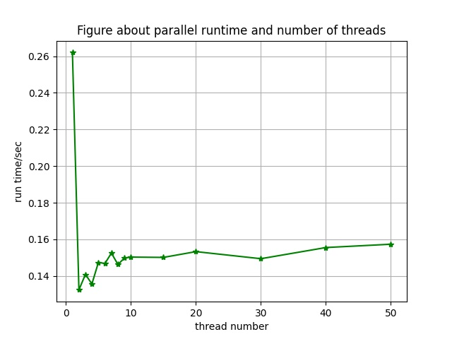

<center><h1>数据库系统课程设计报告</h1></center>

<center><h2>B+树 BulkLoading 多核并行设计</h2></center>

<center><h4>小组分工</h4></center>

| <center>学号</center>     | <center>姓名</center>           |
| ------------------------- | ------------------------------- |
| <center>19309049</center> | <center>黄皓佳</center>         |
| <center>19335008</center> | <center>曾家洋</center>         |
| <center>19335018</center> | <center>陈俊熹</center>         |
| <center>19335054</center> | <center>何杰</center>           |
| <center>19335286</center> | <center>郑有为（组长）</center> |

## 目录

[toc]

## Ⅰ. B+树 BulkLoading 过程理解

### 1.1 BulkLoading 的基本思想

​		在理解 BulkLoading 过程之前，要先理解 B+ 树的结构特性：首先，B+ 树只在叶子节点中保存数据，非叶子节点只保存索引，叶子结点的数据又根据关键字从小到大顺序排序。

​		我们单看叶子节点一层，就可以发现起始它和一个有序的数据数组在形状上是一致的。这意味着如果我们的现有数据是有序排列的，我们就可以直接从小到大“铺”到叶子节点上。再加上B+树的子节点的个数有限制，故我们可以直接估算出要多少个叶子节点，多少个相邻的叶子节点有一个共同的父索引节点，把上述过程同样运用到索引节点上，我们就可以自底向上地构建出一棵完整的B+树。

​		得到一个BulkLoading过程的一个完整描述：**先从底层叶子节点构建，从左往右按顺序构建一个双向链表；从下往上，一层层构建索引节点，每一层也是从左往右构建索引节点。**

### 1.2 结合实现理解 BulkLoading

讨论 BulkLoading 的实现细节：节点的结构、磁盘文件的数据对应 。

* 叶子节点：相邻节点之间有互相指向的指针，叶子层构成了一个双向链表。每个节点有两个数组，一个储存Key，一个储存Value，一个Key对应有16个Value，这里的 Value 就是实际的数据，也就是数据项（Data Entry）。

* 索引节点：每一层的相邻的索引节点也存在双向指针，索引节点都是根据下一层的子节点生成的，每个索引节点有两个数组，一个存储Key，一个存储指向子节点的指针，二者数量相等。一个键值Key和一个指针就构成了一个索引项（Index Entry）。

* 与磁盘文件的关系：磁盘文件被划分为一个个块（Block），每一个节点就对应一个块，块通过块号区分，表示节点存储到文件的区域编号。这样，索引项中所谓的指针，就可以用块号来表示。

​		这样，BulkLoading 的过程就包含：在内存中组织叶子节点和索引节点，组织的方式就是创建与块一样大的缓冲区，将数据项、索引项拷贝进去，然后再写入到磁盘块里。（区分这些过程有利于并行实现）

​		因为块号的分配是连续的，块的大小是固定的。在 BulkLoading 过程中，我们只需要记录下一层中第一个块号和最后一个块号，就可以直接算出上一层节点的所有子节点的块号，无需访问子节点。

​		在B+树中一个节点的索引值可以设置为第一个项的键值，因为 BulkLoading 是自底向上的构造过程，节点的索引值可以直接给出，且过程中不会改变，不需要B+树插入删除节点时的那样进行动态调整。在设计上采用 On-the-fly 的策略，在一层一层循环构建的过程中，线程函数每次都保存一层的键值并返回，键值数组再用于构建上一层节点，无需进行IO访问。

### 1.3 BulkLoading 的利弊

​		相比于通过插入节点构造B+树，BulkLoding充分利用了数据有序的特性，让每一个节点构造过程的复杂度都为O(1)，构造过程中不存在节点的分叉、合并等调整，生成B+树的过程非常快。

​		通过BulkLoading构造B+树也可能存在潜在的问题：因为每一个节点从左到右都是尽可能填满的，当需要插入新节点时，B+树结构的变动可能会非常大，会产生较大的时间开销。

​		或许我们可以加入一个填充因子来控制BulkLoading每次为一个叶子节点填出的数据项的个数，让叶子节点的数据项不是满的，这样可以减弱插入节点对B+树结构造成的影响。

## Ⅱ. 并行设计思路

### 2.1 基本想法

​		首先，需要思考的问题是在批量加载的哪些步骤可以并行，通过阅读串行代码我们可知，构建B+树的串行过程大致为：读取数据并在内存中创建一个节点对象存放数据，然后再通过系统函数 `fwrite()` 将该节点中的数据写入到磁盘中。

​		我们考虑到，节点数据写到文件的过程由于文件指针的限制无法并行，同一时刻只能有一个线程写磁盘，因此可以创建内存缓冲区缓冲节点数据，在获取写文件权限后将内存中节点写出。

​		由于写磁盘的速度低于写内存，BulkLoading 运行速度的瓶颈可能在于写硬盘，因此要充分提高CPU和磁盘IO的并行度，来减少IO造成的护航效应。

​		引入互斥锁：由于写硬盘不能并行，因此需要一个互斥锁保证同一时刻只有一个线程能够将已经加载到内存的节点数据写入硬盘。那么对于其余抢不到锁的线程，我们有三种处理思路：

* 一个线程在内存中写完一个节点就等待直到获取锁（堵塞）；
* 一个线程在内存中写完所有待处理的节点再争取锁，等待直到获取锁（堵塞）；
* 一个节点每向内存写一个节点就尝试获取锁，如果获取失败就将块加入一个队列，如果获取成功就磁盘写队列内所有的节点（非堵塞）。

​		我们采取的是类似于第三种思路的并行思路：一个节点每向内存写完 MIN_BLOCK 个节点就尝试获取锁，如果获取失败就将块加入一个长为 MAX_BLOCK 的队列，如果获取成功就磁盘写队列内所有的节点（非堵塞），如果此时队列已满就进入堵塞状态。其中 MIN_BLOCK 和 MAX_BLOCK 是两个可调的参数。

​		最后，在我们的并行 BulkLoading 过程中，主线程会为每一层创建若干个线程，并且只有一层的所有线程执行完工作后，返回记录线程产生的一批节点键值的数组，才会开始创建上一层的线程。

### 2.2 并行思路图解



### 2.3 更多讨论

​		因为我们只在向内存写节点这个过程进行并行实现，而分配块号的过程是串行的，串行申请块号意味着我们无需面临块号分配不连续的问题。同时，我们每次都尽可能填满一个节点，所以也不会出现中间的叶子节点数据不满的情况。

​		通过我们的并行算法生成的B+树和串行生成的B+树是完全一样的，因此测试算法正确性相对简单。

## Ⅲ. 算法流程图



## Ⅳ. 创新优化思路

### 4.1 连续分配块

​		我们分离了申请块号和节点初始化两个过程，在串行阶段，我们预先使用`alloc_blocks`申请一层所需要的所有块号，再在并行阶段节点创建时调用`init_noalloc`而不是原`init`函数，此阶段无需访问磁盘申请块号。

​		这样做有两个好处：一是避免了多个节点并行申请块号，访问磁盘空间造成的错误，二是我们可以通过优化`alloc_blocks`过程来提高速度。

​		我们对申请块号的优化利用了块号连续的条件，通过修改底层，增加一次申请多个块的函数`append_blocks`，让一次申请多个连续块号只用调用一次`fwrite`，而不是每申请一个块就调用一次`fwrite`。通过这样的方法可以有效地减少`fwrite`的调用开销，提高运行速度。

​		相关的函数声明如下，我们在5.3节详细描述了这些函数的实现。

``` c
// @file: block_file.h
// @line: 116-118
int *append_blocks( // append new blocks at the end of file
    Block block,	// the new blocks
    int n);	

// @file: b_node.h
// @line: 36-40 
virtual void init_noalloc( // init a node in menmory without allocating a block
    int level,		// level in b-tree
    BTree *btree,	// b-tree of this node
    int block		// the index of the block that pre-allocated for this node
);

// @file: b_tree.h
// @line: 92-93
int *alloc_blocks( // allocate n empty blocks in the block file
    int n);		   // returns an array of indexs of blocks that were allocated
```

### 4.2 连续写磁盘 

​		写入磁盘的过程和像磁盘申请块号这个过程很类似，而在原代码中，节点的磁盘写入实在析构函数中实现的，即当脏位被设置为真时，析构函数回将节点内容写回磁盘。我们同样将写入磁盘这个该过程分离出来，用一个`write_blocks`函数来封装，并在执行该函数后修改节点的脏位，使其无需在析构函数中写回磁盘。

​		对于并行BulkLoading，每个线程负责将内容写入节点，当保存完成的节点的队列中结点的数目到达一定数目时，我们调用`write_leaf_blocks` 或 `write_index_blocks`将这些连续的节点的节点内容一次性写回磁盘。

​		这个过程同样利用了块号连续的特性，减少了调用`fwrite`的次数，显著地提高了运行速度。

​		相关的函数声明如下，我们在5.4节详细描述了这些函数的实现。

``` c
// @file: block_file.h
// @line: 105-109
bool write_blocks(	// write a block <b> in the <pos>
    Block blocks,	// a series of blocks
    int firstIndex, // pos of the first block
    int n);	

// @file: b_tree.h
// @line: 96-99
void write_leaf_blocks( // write n blocks to the block file
    BLeafNode * nodes[],
    int firstBlock,
    int n);

// @file: b_tree.h
// @line: 102-105
void write_index_blocks( // write n blocks to the block file
    BIndexNode* nodes[],
    int firstBlock,
    int n);
```

## Ⅴ. 关键代码描述

### 5.1 `parallelBulkLoad`

​		`parallelBulkLoad`是并行BulkLoading的创建函数，负责每次完成对一层的连续块号申请，创建和初始化并行线程来执行每一层写节点的任务，自底向上层层构建B+树。

​		在此之前引入线程函数的参数列表：`BatchLoadLeafArgs` 和`BatchLoadIndexArgs`，因为参数太多，他们以结构体的形式进行封装。

```c
// @file: b_tree.h
typedef struct
{
	const Result *hashTable;   // hash table that store entries
	int entryNum;			   // number of entries that the function needs to load
	int *blockIndex;		   // the index of block that allocated for these entries
	int blockIndexLen;		   // the length of array blockIndex
	int blockIndexStart;	   // the start index of array blockIndex
	int blockIndexEnd;		   // the end index of array blockIndex
	int maxBlock;			   // max number of block the function can allocate
	int minBlock;			   // min block num that write out
	BTree *bTree;			   // the btree that these nodes should belongs to
	pthread_mutex_t *fileLock; // prevent multi-thread access file
} BatchLoadLeafArgs;
```

```c
// @file: b_tree.h
typedef struct
{
	int *sonBlockTable;		   // hash table that store entries
	float *sonKeyTable;		   // table that store sons' key index
	int son_num;			   // the number of entries that the function needs to load
	int currentLevel;		   // layers level
	int *blockIndex;		   // the index of block that allocated for these entries
	int blockIndexLen;		   // the length of array blockIndex
	int blockIndexStart;	   // the start index of array blockIndex
	int blockIndexEnd;		   // the end index of array blockIndex
	int maxBlock;			   // max number of block the function can allocate
	int minBlock;			   // min block num that write out
	BTree *bTree;			   // the btree that these nodes should belongs to
	pthread_mutex_t *fileLock; // prevent multi-thread access file
} BatchLoadIndexArgs;
```

​		**`parallelBulkLoad`代码及注释：**

``` c
// @file: b_tree.cc
int BTree::parallelBulkLoad(
	int n,				 // number of entries
	const Result *table, // hash table
	int maxThreadNum,	 // max thread num
	int maxBufferBlock	 // max number of blocks in buffer
)
{
	pthread_mutex_t fileLock; // lock for write out
	pthread_mutex_init(&fileLock, NULL);
    
	int threadNum = maxThreadNum;
	int id = -1;
	int block = -1;
	float key = MINREAL;
    
	// get Index node and Leaf node's capacity
	int BlockLength = this->file_->get_blocklength();
	int BIndexNodeCap = (BlockLength - (SIZECHAR + SIZEINT * 3)) / (SIZEFLOAT + SIZEINT);
	int BLeafNodeCap = (BlockLength - (SIZECHAR + SIZEINT * 3) - (int)ceil((float)BlockLength / LEAF_NODE_SIZE) * SIZEFLOAT - SIZEINT) / SIZEINT;

	// calculate the blocks number that the leaves need
	int LeafBlockNum = (int)ceil((double)n / BLeafNodeCap);

	// pre-allocate blocks for the Leaf layer
	int *LeafBlockIndex = alloc_blocks(LeafBlockNum);
	int c = 0;

	// -------------------------------------------------------------------------
	//  build leaf node from <_hashtable> (level = 0)
	// -------------------------------------------------------------------------
	bool firstNode = true; // determine relationship of sibling
	int startBlock = 0;	   // position of first node
	int endBlock = 0;	   // position of last node

	// caluculate batch load variable
	int batchBlockSize = LeafBlockNum / threadNum;
	int lastBatchBlockSize = LeafBlockNum - (threadNum - 1) * batchBlockSize;
	int batchEntrySize = batchBlockSize * BLeafNodeCap;
	int lastBatchEntrySize = n - batchBlockSize * BLeafNodeCap * (threadNum - 1);
	int MAX_BLOCK = maxBufferBlock;
	int MIN_BLOCK = maxBufferBlock > 30 ? 10 : maxBufferBlock / 2;

	// define thread and arguments for each thread
	pthread_t tid[threadNum + 5];
	BatchLoadLeafArgs BLLA[threadNum + 5];
	BatchLoadIndexArgs BLIA[threadNum + 5];
    
	// assign thread arguments for leaf node
	for (int i = 0; i < threadNum; i++)
	{
		BLLA[i].hashTable = table + i * batchEntrySize;
		BLLA[i].entryNum = batchEntrySize;
		BLLA[i].blockIndex = LeafBlockIndex;
		BLLA[i].blockIndexLen = LeafBlockNum;
		BLLA[i].blockIndexStart = 0 + i * batchBlockSize;
		BLLA[i].blockIndexEnd = BLLA[i].blockIndexStart + batchBlockSize - 1;
		BLLA[i].maxBlock = MAX_BLOCK;
		BLLA[i].minBlock = MIN_BLOCK;
		BLLA[i].bTree = this;
		BLLA[i].fileLock = &fileLock;
	}
	BLLA[threadNum - 1].entryNum = lastBatchEntrySize;
	BLLA[threadNum - 1].blockIndexEnd = BLLA[threadNum - 1].blockIndexStart + lastBatchBlockSize - 1;
	
	float *leafBlockKey = (float *)malloc(SIZEFLOAT * LeafBlockNum);
	int keyCount = 0;
	float *batchKey = NULL;

    // create threads for leaf node
	for (int i = 0; i < threadNum; ++i)
	{
		if (BLLA[i].entryNum > 0)
		{
			pthread_create(&tid[i], NULL, batchLoadLeaf, &(BLLA[i]));
		}
	}
    // waiting for all threads finsihing
	for (int i = 0; i < threadNum; i++)
	{
		if (BLLA[i].entryNum > 0)
		{
			pthread_join(tid[i], (void **)&batchKey);
			for (int j = 0; j <= (BLLA[i].blockIndexEnd - BLLA[i].blockIndexStart); j++)
			{
				leafBlockKey[keyCount++] = batchKey[j];
			}
			free(batchKey);
		}
	}
	startBlock = LeafBlockIndex[0];
	endBlock = LeafBlockIndex[LeafBlockNum - 1];

	// -------------------------------------------------------------------------
	// build index node from bottom to top
	// stop condition: lastEndBlock == lastStartBlock (only one node, as root)
	// -------------------------------------------------------------------------
	int current_level = 1;			 // current level (leaf level is 0)
	int lastStartBlock = startBlock; // build b-tree level by level
	int lastEndBlock = endBlock;	 // build b-tree level by level
	float *lastLayerKey = leafBlockKey;
	float *currentLayerKey = NULL;
	int *lastLayerBlockIndex = LeafBlockIndex;
	int lastLayerBlockNum = LeafBlockNum;
	int *currentLayerBlockIndex = NULL;
	int currentLayerBlockNum;
	
	while (lastEndBlock > lastStartBlock)
	{
		currentLayerBlockNum = (int)ceil((double)lastLayerBlockNum / BIndexNodeCap);
		currentLayerBlockIndex = alloc_blocks(currentLayerBlockNum);
		batchBlockSize = currentLayerBlockNum / threadNum;
		lastBatchBlockSize = currentLayerBlockNum - (threadNum - 1) * batchBlockSize;
		batchEntrySize = batchBlockSize * BIndexNodeCap;
		lastBatchEntrySize = lastLayerBlockNum - batchBlockSize * BIndexNodeCap * (threadNum - 1);
        
        // assign thread arguments
		for (int i = 0; i < threadNum; i++)
		{
			BLIA[i].sonBlockTable = lastLayerBlockIndex + i * batchEntrySize;
			BLIA[i].sonKeyTable = lastLayerKey + i * batchEntrySize;
			BLIA[i].son_num = batchEntrySize;
			BLIA[i].currentLevel = current_level;
			BLIA[i].blockIndex = currentLayerBlockIndex;
			BLIA[i].blockIndexLen = currentLayerBlockNum;
			BLIA[i].blockIndexStart = 0 + i * batchBlockSize;
			BLIA[i].blockIndexEnd = BLIA[i].blockIndexStart + batchBlockSize - 1;
			BLIA[i].maxBlock = MAX_BLOCK;
			BLIA[i].minBlock = MIN_BLOCK;
			BLIA[i].bTree = this;
			BLIA[i].fileLock = &fileLock;
		}
        
		BLIA[threadNum - 1].son_num = lastBatchEntrySize;
		BLIA[threadNum - 1].blockIndexEnd = BLIA[threadNum - 1].blockIndexStart + lastBatchBlockSize - 1;
		
        // create threads
		for (int i = 0; i <= threadNum - 1; i++)
		{
			if (BLIA[i].son_num > 0)
			{
				pthread_create(&tid[i], NULL, batchLoadIndex, &(BLIA[i]));
			}
		}
		currentLayerKey = (float *)malloc(sizeof(float) * (currentLayerBlockNum));
		keyCount = 0;
        
		// waiting for all threads finsihing
        for (int i = 0; i <= threadNum - 1; i++)
		{
			if (BLIA[i].son_num > 0)
			{
				pthread_join(tid[i], (void **)&batchKey);
				for (int j = 0; j <= (BLIA[i].blockIndexEnd - BLIA[i].blockIndexStart); j++)
				{
					currentLayerKey[keyCount++] = batchKey[j];
				}
				free(batchKey);
			}
		}
        
		free(lastLayerBlockIndex);
		free(lastLayerKey);
		lastLayerBlockIndex = currentLayerBlockIndex;
		lastLayerKey = currentLayerKey;
		lastLayerBlockNum = currentLayerBlockNum;
		lastStartBlock = currentLayerBlockIndex[0];
        
        // update info
		lastEndBlock = currentLayerBlockIndex[currentLayerBlockNum - 1]; 
        // build b-tree of higher level
		++current_level;
		currentLayerBlockIndex = NULL;
		currentLayerKey = NULL;
	}
	assert(lastStartBlock == lastEndBlock);
	root_ = lastStartBlock; // update the <root>
	return 0;
}
```

### 5.2 `batchLoadLeaf` 和 `batchLoadIndex`

​		 `batchLoadLeaf` 和 `batchLoadIndex`分别是创建叶子节点的线程和创建索引节点的线程的线程函数。

​		线程函数的任务就是构建指定数目的节点，设置他们的左右节点，添加索引项或数据项，在获得了写文件权限后写入内存。

​		线程内维护了一个节点缓冲区用于保存已完成但未写入磁盘的节点，当缓冲区内节点数目大于参数 minBLOCK 时，尝试获取锁写回磁盘，当节点数目未为 maxBLOCK 时，堵塞知道获取锁然后写回磁盘。

```c
// @file: b_tree.cc
/*
	start routine of thread, this function wil put n entries into serveral
	blocks, every leaf node will be as full as possible
*/
void *BTree::batchLoadLeaf(
	void *args)
{
	// load argument structure
	BatchLoadLeafArgs *funcArgs = (BatchLoadLeafArgs *)args;
	const Result *hashTable = funcArgs->hashTable;
	int entryNum = funcArgs->entryNum;
	int *blockIndex = funcArgs->blockIndex;
	int blockIndexLen = funcArgs->blockIndexLen;
	int blockIndexStart = funcArgs->blockIndexStart;
	int blockIndexEnd = funcArgs->blockIndexEnd;
	int maxBlock = funcArgs->maxBlock;
	int minBlock = funcArgs->minBlock;
	BTree *bTree = funcArgs->bTree;
	pthread_mutex_t *fileLock = funcArgs->fileLock;

	float *batchKey = (float *)malloc(sizeof(float) * (blockIndexEnd - blockIndexStart + 1)); // node key on the fly
	int keyCount = 0;

    // queue for unwrittern out blocks
	BLeafNode *unWrittenBackNodeQueue[maxBlock];
	int queueTail = -1;
	int queuehead = 0;

	int id;
	float key;
	BLeafNode *currentLeafNode = NULL;
	int currentBlockIndex = blockIndexStart;
	for (int i = 0; i <= entryNum - 1; i++)
	{
		assert(currentBlockIndex <= blockIndexEnd);
        // get data entry 
		id = hashTable[i].id_;
		key = hashTable[i].key_;
        
		if (currentLeafNode == NULL)
		{
			currentLeafNode = new BLeafNode();
			currentLeafNode->init_noalloc(0, bTree, blockIndex[currentBlockIndex]);
            // set siblings for current node
			if (currentBlockIndex - 1 >= 0)
			{ // has previous leaf node
				currentLeafNode->set_left_sibling(blockIndex[currentBlockIndex - 1]);
			}
			if (currentBlockIndex + 1 <= blockIndexLen - 1)
			{ // has next leaf node
				currentLeafNode->set_right_sibling(blockIndex[currentBlockIndex + 1]);
			}
		}
        
        // fill node with data entry
		currentLeafNode->add_new_child(id, key);
        
		if (currentLeafNode->isFull())
		{
			unWrittenBackNodeQueue[++queueTail] = currentLeafNode; // store the leaf in memory
			if (queueTail >= maxBlock - 1)
			{								  // exceeding the max number of blocks in memory
				queuehead = 0;				  // points to the bottom of the stack
				pthread_mutex_lock(fileLock); // the thread will be suspended if the lock is occupied

				// write out blocks that in queue if buffer in full
				bTree->write_leaf_blocks(unWrittenBackNodeQueue, unWrittenBackNodeQueue[queuehead]->get_block(), queueTail + 1);
				while (queuehead <= queueTail)
				{
					batchKey[keyCount++] = unWrittenBackNodeQueue[queuehead]->get_key_of_node();
					delete unWrittenBackNodeQueue[queuehead];
					queuehead++;
				}
				pthread_mutex_unlock(fileLock);
				queueTail = -1;
				queuehead = 0;
			}
			else
			{ // not exceeding the max number of blocks in memory
				if (queueTail + 1 >= minBlock)
				{
					int tryLockRes = pthread_mutex_trylock(fileLock);
					if (tryLockRes == 0)
					{ // the lock is free
						queuehead = 0;

						// write out blocks that in queue
						bTree->write_leaf_blocks(unWrittenBackNodeQueue, unWrittenBackNodeQueue[queuehead]->get_block(), queueTail + 1);
						while (queuehead <= queueTail)
						{
							batchKey[keyCount++] = unWrittenBackNodeQueue[queuehead]->get_key_of_node();
							delete unWrittenBackNodeQueue[queuehead];
							queuehead++;
						}

						pthread_mutex_unlock(fileLock);
						queueTail = -1;
						queuehead = 0;
					}
				}
			}
			currentLeafNode = NULL;
			currentBlockIndex++;
		}
	}
	if (currentLeafNode != NULL)
	{
		unWrittenBackNodeQueue[++queueTail] = currentLeafNode; // store the leaf in memory
	}
	pthread_mutex_lock(fileLock); // the thread will be suspended if the lock is occupied
	queuehead = 0;
	
	// write out blocks that in queue if queue in not empty
	bTree->write_leaf_blocks(unWrittenBackNodeQueue, unWrittenBackNodeQueue[queuehead]->get_block(), queueTail + 1);
	while (queuehead <= queueTail)
	{
		batchKey[keyCount++] = unWrittenBackNodeQueue[queuehead]->get_key_of_node();
		delete unWrittenBackNodeQueue[queuehead];
		queuehead++;
	}
	pthread_mutex_unlock(fileLock);
	queueTail = -1;
	queuehead = 0;
	assert(keyCount == blockIndexEnd - blockIndexStart + 1);
	return batchKey;
}
```

```c
// @file: b_tree.cc
void *BTree::batchLoadIndex(void *args)
{
    // load argument structure
	BatchLoadIndexArgs *funcArgs = (BatchLoadIndexArgs *)args;
	int *sonBlockTable = funcArgs->sonBlockTable;
	float *sonKeyTable = funcArgs->sonKeyTable;	
	int son_num = funcArgs->son_num;	
	int *blockIndex = funcArgs->blockIndex;	
	int currentLevel = funcArgs->currentLevel;	
	int blockIndexLen = funcArgs->blockIndexLen;
	int blockIndexStart = funcArgs->blockIndexStart; 
	int blockIndexEnd = funcArgs->blockIndexEnd;
	int maxBlock = funcArgs->maxBlock;		
	int minBlock = funcArgs->minBlock;		
	BTree *bTree = funcArgs->bTree;			
	pthread_mutex_t *fileLock = funcArgs->fileLock;

	int block;
	float key;
	BIndexNode *currentIndexNode = NULL;
	int currentBlockIndex = blockIndexStart;
	
    // queue for unwrittern out blocks
	BIndexNode *unWrittenBackNodeQueue[maxBlock];
	int queueTail = -1;
	int lockRet;
	int queuehead = 0;

	float *batchKey = (float *)malloc(sizeof(float) * (blockIndexEnd - blockIndexStart + 1)); // node key on the fly
	int keyCount = 0;

	for (int i = 0; i <= son_num - 1; i++)
	{
		block = sonBlockTable[i]; // get <block>
		key = sonKeyTable[i];

		if (currentIndexNode == NULL)
		{
			currentIndexNode = new BIndexNode();
			currentIndexNode->init_noalloc(currentLevel, bTree, blockIndex[currentBlockIndex]);
            
            // set siblings for current node
			if (currentBlockIndex - 1 >= 0)
				currentIndexNode->set_left_sibling(blockIndex[currentBlockIndex - 1]);
			if (currentBlockIndex + 1 <= blockIndexLen - 1)
				currentIndexNode->set_right_sibling(blockIndex[currentBlockIndex + 1]);
		}
        
		currentIndexNode->add_new_child(key, block); // add new entry
		
		if (currentIndexNode->isFull())
		{
			unWrittenBackNodeQueue[++queueTail] = currentIndexNode;
			if (queueTail >= maxBlock - 1)
			{ // the buffer is full. Have to write these nodes out
				pthread_mutex_lock(fileLock);
				queuehead = 0;
				
				// write out blocks that in queue if buffer is full
				bTree->write_index_blocks(unWrittenBackNodeQueue, unWrittenBackNodeQueue[queuehead]->get_block(), \
                                          queueTail + 1);
	
				while (queuehead <= queueTail)
				{
					batchKey[keyCount++] = unWrittenBackNodeQueue[queuehead]->get_key_of_node();
					delete unWrittenBackNodeQueue[queuehead];
					queuehead++;
				}
				pthread_mutex_unlock(fileLock);
				queueTail = -1;
				queuehead = 0;
			}
			else
			{
				if (queueTail + 1 >= minBlock)
				{
					lockRet = pthread_mutex_trylock(fileLock);
					if (lockRet == 0)
					{ // the lock is free
						queuehead = 0;
						
						// write out blocks that in queue
						bTree->write_index_blocks(unWrittenBackNodeQueue, unWrittenBackNodeQueue[queuehead]->get_block(), \
                                                  queueTail + 1);
						while (queuehead <= queueTail)
						{
							batchKey[keyCount++] = unWrittenBackNodeQueue[queuehead]->get_key_of_node();
							delete unWrittenBackNodeQueue[queuehead];
							queuehead++;
						}
						pthread_mutex_unlock(fileLock);
						queueTail = -1;
						queuehead = 0;
					}
				}
			}
			currentIndexNode = NULL;
			currentBlockIndex++;
		}
	}
	if (currentIndexNode != NULL)
	{
		unWrittenBackNodeQueue[++queueTail] = currentIndexNode;
	}
    
    // write out blocks that in queue if queue in not empty
	pthread_mutex_lock(fileLock);
	queuehead = 0;
	bTree->write_index_blocks(unWrittenBackNodeQueue, unWrittenBackNodeQueue[queuehead]->get_block(), queueTail + 1);
	while (queuehead <= queueTail)
	{
		batchKey[keyCount++] = unWrittenBackNodeQueue[queuehead]->get_key_of_node();
		delete unWrittenBackNodeQueue[queuehead];
		queuehead++;
	}
	pthread_mutex_unlock(fileLock);
	queueTail = -1;
	queuehead = 0;
    
	assert(keyCount == blockIndexEnd - blockIndexStart + 1);
	return batchKey;
}
```

### 5.3 `append_blocks`、`init_noalloc` 和  `alloc_blocks` 

优化代码一：连续分配块过程对`blockfile`、`b_node`和`b_tree`的修改，优化思路已在4.1节中描述。

BlockFile中连续块号申请的底层实现：

``` c
// @file: blockfile.cc
// append a series of blocks(cont), avoid calling fwrite too often
int* BlockFile::append_blocks(		// append new block at the end of file
	Block block,					// the new blocks
	int n)							// the number of blocks
{
	fseek(fp_, 0, SEEK_END);		// <fp_> point to the end of file
	fwrite(block, n, block_length_, fp_);
	int start_block = num_blocks_;
	num_blocks_ += n;					// add 1 to <num_blocks_>
	
	fseek(fp_, SIZEINT, SEEK_SET);	// <fp_> point to pos of header
	fwrite_number(num_blocks_);		// update <num_blocks_>

	// -------------------------------------------------------------------------
	//  <fp_> point to the pos of new added block. 
	//  the equation <act_block_> = <num_blocks_> indicates the file pointer 
	//  point to new added block.
	//  return index of new added block
	// -------------------------------------------------------------------------
	fseek(fp_, -block_length_, SEEK_END);
	act_block_ = num_blocks_;
	int* blockIndex = (int*)malloc(sizeof(int) * n);
	for(int i = 0; i <= n - 1; i++) {
		blockIndex[i] = start_block + i;
	}
	return blockIndex;
}
```

`init_noalloc`函数的实现包括：BNode的实现、BIndexNode的重载和BLeafNode的重载。

``` c 
// @file: b_node.cc
void BNode::init_noalloc( // init a new node in menmory without allocating a block
	int level,			  // level in b-tree
	BTree *btree,		  // b-tree of this node
	int block			  // the index of the block that pre-allocated for this node
)
{
	btree_ = btree;
	level_ = (char)level;
	dirty_ = true;
	left_sibling_ = -1;
	right_sibling_ = -1;
	key_ = NULL;
	num_entries_ = 0;
	block_ = block; // differnet with BNode::init
	capacity_ = -1;
}

// @file: b_node.cc
void BIndexNode::init_noalloc( // init a new node in menmory without allocating a block
	int level,				   // level in b-tree
	BTree *btree,			   // b-tree of this node
	int block				   // the index of the block that pre-allocated for this node
)
{
	btree_ = btree;
	level_ = (char)level;
	block_ = block;
	num_entries_ = 0;
	left_sibling_ = -1;
	right_sibling_ = -1;
	dirty_ = true;

	int b_length = btree_->file_->get_blocklength();
	capacity_ = (b_length - get_header_size()) / get_entry_size();
	if (capacity_ < 50)
	{ // ensure at least 50 entries
		printf("capacity = %d, which is too small.\n", capacity_);
		exit(1);
	}

	key_ = new float[capacity_];
	son_ = new int[capacity_];
	// alloc memory
	memset(key_, MINREAL, capacity_ * SIZEFLOAT);
	memset(son_, -1, capacity_ * SIZEINT);
	// whithout allocating block in the file
}

// @file: b_node.cc
void BLeafNode::init_noalloc( //init a new node in menmory without allocating a block
	int level,				  // level in b-tree
	BTree *btree,			  // b-tree of this node
	int block				  // the index of the block that pre-allocated for this node
)
{
	btree_ = btree;
	level_ = (char)level;
	block_ = block;
	num_entries_ = 0;
	num_keys_ = 0;
	left_sibling_ = -1;
	right_sibling_ = -1;
	dirty_ = true;

	int b_length = btree_->file_->get_blocklength();
	int key_size = get_key_size(b_length);

	key_ = new float[capacity_keys_];
	memset(key_, MINREAL, capacity_keys_ * SIZEFLOAT);

	int header_size = get_header_size();
	int entry_size = get_entry_size();

	capacity_ = (b_length - header_size - key_size) / entry_size;
	if (capacity_ < 100)
	{ // at least 100 entries
		printf("capacity = %d, which is too small.\n", capacity_);
		exit(1);
	}
	id_ = new int[capacity_];
	memset(id_, -1, capacity_ * SIZEINT);
	// whithout allocating block in the file
}
```

BTree中的连续块分配方法：

``` c
// @file: b_tree.cc
int *BTree::alloc_blocks( // allocate n empty blocks in the block file
	int n)
{
	char *randomBlk = (char *)malloc(sizeof(char) * (this->file_->get_blocklength()) * n); 
    // an useless block, just to fill the file
	int *blockIndexs = this->file_->append_blocks(randomBlk, n);
	return blockIndexs;
} // returns an array of indexs of blocks that were allocated
```

### 5.4 `write_blocks`、`write_leaf_blocks` 和 `write_index_blocks`

优化代码二：连续分配块过程对`blockfile`和`b_tree`的修改，优化思路已在4.2节中描述。

BlockFile中连续块写入的底层实现：

``` c
// @file: blockfile.cc
bool BlockFile::write_blocks(	// write a block <b> in the <pos>
	Block blocks,	// a series of blocks
	int firstBlock, // pos of the first block
	int n)			// block num
{
	firstBlock++;
	fseek(fp_, block_length_ * firstBlock, SEEK_SET);
	fwrite(blocks, block_length_, n, fp_);

	if (firstBlock + n > num_blocks_) {	// update <act_block_>
		fseek(fp_, 0, SEEK_SET);
		act_block_ = 0;
	}
	else {
		act_block_ = firstBlock + n;
	}
	return true;
}
```

BTree 中 `write_leaf_blocks` 和 `write_index_blocks` 的实现：

``` c 
// @file: b_tree.cc
void BTree::write_leaf_blocks( // write n blocks to the block file
	BLeafNode* nodes[], // array of leaf node's info
	int firstBlock,		// first block num
	int n)				// total block num
{
	
	int block_length = file_->get_blocklength();
	char* blocksContent = new char[block_length * n];
	int ptr = 0;
	
    // merge all the blocks content into a buffer
	for(int i = 0; i < n; i++){
		char *buf = new char[block_length];
		nodes[i]->write_to_buffer(buf);
		nodes[i]->set_dirty(false);
		for(int j = 0; j < block_length; j++){
			blocksContent[ptr++] = buf[j];
		}
		delete[] buf;
		buf = NULL;
	}
	this->file_->write_blocks(blocksContent, firstBlock, n);
	delete[] blocksContent;
} 

// @file: b_tree.cc
void BTree::write_index_blocks( // write n blocks to the block file
	BIndexNode* nodes[], 	// array of index node's info
	int firstBlock,			// first block num
	int n)					// total block num
{
	int block_length = file_->get_blocklength();
	char* blocksContent = new char[block_length * n];
	int ptr = 0;
	
    // merge all the blocks content into a buffer
	for(int i = 0; i < n; i++){
		char *buf = new char[block_length];
		nodes[i]->write_to_buffer(buf);
		nodes[i]->set_dirty(false);
		for(int j = 0; j < block_length; j++){
			blocksContent[ptr++] = buf[j];
		}
		delete[] buf;
		buf = NULL;
	}
	this->file_->write_blocks(blocksContent, firstBlock, n);
	delete[] blocksContent;
} 
```

### 5.5 `write_B_tree`

 `write_B_tree`：用于判断传并行产生的B+树是否一致，以此来对算法进行正确性测试。

``` c
// @file: main.cc
// print B_Tree and store it in file
void print_B_Tree(BTree *trees_, char *filename)
{
    FILE *fp;
    fp = fopen(filename, "w");
    if (fp == NULL)
    {
        printf("File can not open!");
        exit(0);
    }

    int start_block = trees_->root_;
    int end_block = trees_->root_;
    int newly_startblock;
    int newly_endblock;

    BIndexNode *index_child = NULL;

    // read root node
    char indexnode_level;
    int indexnode_num_entries;
    BIndexNode *indexnode_left_sibling;
    BIndexNode *indexnode_right_sibling;

    fprintf(fp, "root: block %d\n", start_block);
    index_child = new BIndexNode();
    index_child->init_restore(trees_, start_block);
    indexnode_level = index_child->get_level();
    indexnode_num_entries = index_child->get_num_entries();
    indexnode_left_sibling = index_child->get_left_sibling();
    indexnode_right_sibling = index_child->get_right_sibling();
    fprintf(fp, "\tlevel: %d \tnum_entries: %d\n", indexnode_level, indexnode_num_entries);
    for (int j = 0; j < indexnode_num_entries; ++j)
    {
        fprintf(fp, "\t\tkey: %f\tson: %d\n", index_child->get_key(j), index_child->get_son(j));
    }

    start_block = index_child->get_son(0);
    end_block = index_child->get_son(indexnode_num_entries - 1);
    delete index_child;
    index_child = NULL;

    // index node
    // from root to the leaf layer to layer
    while (start_block > 1)
    {
        for (int k = start_block; k <= end_block; k++)
        {
            fprintf(fp, "index: block %d\n", k);
            index_child = new BIndexNode();
            index_child->init_restore(trees_, k);
            indexnode_level = index_child->get_level();
            indexnode_num_entries = index_child->get_num_entries();
            indexnode_left_sibling = index_child->get_left_sibling();
            indexnode_right_sibling = index_child->get_right_sibling();
            fprintf(fp, "\tlevel: %d \tnum_entries: %d\n", indexnode_level, indexnode_num_entries);
            for (int j = 0; j < indexnode_num_entries; ++j)
            {
                fprintf(fp, "\t\tkey: %f\tson: %d\n", index_child->get_key(j), index_child->get_son(j));
            }
            if (k == start_block)
            {
                newly_startblock = index_child->get_son(0);
            }
            if (k == end_block)
            {
                newly_endblock = index_child->get_son(indexnode_num_entries - 1);
            }
            delete index_child;
            index_child = NULL;
        } // end for loop
        start_block = newly_startblock;
        end_block = newly_endblock;
    } // end while

    // leaf node variable
    BLeafNode *leaf_child = NULL;

    // read root node
    char leafnode_level;
    int leafnode_num_entries;
    int leafnode_num_keys;
    BLeafNode *leafnode_left_sibling;
    BLeafNode *leafnode_right_sibling;

    // print leaf node
    for (int k = start_block; k <= end_block; k++)
    {
        fprintf(fp, "leaf: block %d\n", k);
        leaf_child = new BLeafNode();
        leaf_child->init_restore(trees_, k);
        leafnode_level = leaf_child->get_level();
        leafnode_num_entries = leaf_child->get_num_entries();
        leafnode_left_sibling = leaf_child->get_left_sibling();
        leafnode_right_sibling = leaf_child->get_right_sibling();
        leafnode_num_keys = leaf_child->get_num_keys();
        fprintf(fp, "\tlevel: %d \tnum_entries: %d\tnum_keys: %d\n", leafnode_level, leafnode_num_entries, leafnode_num_keys);
        for (int j = 0; j < leafnode_num_keys; ++j)
        {
            int count_entries = 0;
            fprintf(fp, "\t\tkey: %f\n", leaf_child->get_key(j));
            for (int w = count_entries; w < std::min(count_entries + 16, leafnode_num_entries); w++)
            {
                fprintf(fp, "\t\t\tid: %d\n", leaf_child->get_entry_id(w));
            }
            count_entries += 16;
        }
        delete leaf_child;
        leaf_child = NULL;
    }

    fclose(fp);
}
```

## Ⅵ. 实验结果分析

### 6.0 并行和性能调优的代码说明

由于我们提交的代码是将并行和性能调优一起使用的代码，因此在这里有必要说明改到只有并行处理的方式。同时说明一下如何测试代码。

#### 6.0.1 改为非连续写磁盘的方式

- 将```batchLoadLeaf```函数的```//DO```处标记的函数```write_leaf_blocks```注释掉。
- 将```batchLoadIndex```函数的```//DO```处标记的函数```write_index_blocks```注释掉。

#### 6.0.2 改为非连续分配块的方式

1. 将```int *BTree::alloc_blocks(int n)```函数的前两行注释掉

2. 并添加如下几行：

   ```C
   int *blockIndexs = (int*)malloc(sizeof(int) * n);
   	for(int i = 0; i < n; i++) {
   		char *randomBlk = (char *)malloc(sizeof(char) * (this->file_->get_blocklength())); 
   		blockIndexs[i] = this->file_->append_block(randomBlk);
   	}
   ```

#### 6.0.3 如何测试代码

1. 将```main.cc```文件的```evaluate()```函数的注释去掉
2. 使用命令```sh run.sh```运行脚本文件

### 6.1 并行实验结果代码及分析

**注：为保证实验的准确性和有效性，排除CPU此时的运行情况和内存情况以及其他进程的影响，我们测试的实验结果都是采用10次实验结果取平均得到的结果，并且使用Python绘图来让结果可视化。**

#### 6.1.1 影响因素

并行处理函数的参数就包含了我们的所要分析的影响因素。

```c
int BTree::parallelBulkLoad(
	int n,				 // number of entries
	const Result *table, // hash table
	int maxThreadNum,	 // max thread num
	int maxBufferBlock	 // max number of blocks in buffer
)
```

这里面除了```table```变量是数据集外，其他3个变量即数据项的数目，最大的线程数，Buffer的大小，都是我们需要考虑的因素。

这里我们并没有改变Block的大小，默认仍是512个字节。

#### 6.1.2 实验方法

我们采用**控制变量法**的方式，先确定好其他两个变量的默认值，再去改变其他变量。

3个变量的默认值如下：

- 线程数目：2
- 数据项的数目：1000000
- Buffer的大小：500个Block

#### 6.1.3 数据项的数目```int n```

**测试代码**

```C
	int entryNum[] = {100,1000,10000,100000,1000000,10000000};
	outFile.open("./result/result_entryNum.csv", ios::out);
    outFile<<"entryNum  sertime  partime"<<endl;
    printf("结果存放于./result/result_entryNum.csv\n");
    for(int i = 0;i < 6;++i){
        float entry_run1 = 0;
        float entry_run2 = 0;
        make_data(entryNum[i]);

        strncpy(data_file, "./data/dataset.csv", sizeof(data_file));
        strncpy(tree_file_ser, "./result/B_tree_ser", sizeof(tree_file_ser));
        strncpy(tree_file_par, "./result/B_tree_par", sizeof(tree_file_par));

        Result *table = new Result[entryNum[i]]; 

        ifstream fp(data_file); 
        string line;
        int k = 0;
        while (getline(fp,line) && k <= entryNum[i] - 1){ 
            string number;
            istringstream readstr(line); 
            
            getline(readstr,number,','); 
            table[k].key_ = atof(number.c_str()); 

            getline(readstr,number,','); 
            table[k].id_ = atoi(number.c_str());    
            k++;
        }
        
        fp.close();
        for(int w = 0; w < AVERAGE_NUM; w++) {
            timeval start_t;  
            timeval end_t;

            BTree* trees_ = new BTree();
            trees_->init(B_, tree_file_ser);
            gettimeofday(&start_t,NULL);
        
            if (trees_->bulkload(entryNum[i], table)) return ;

            gettimeofday(&end_t, NULL);
            float run_t1 = end_t.tv_sec - start_t.tv_sec + 
                            (end_t.tv_usec - start_t.tv_usec) / 1000000.0f;
            //printf("串行运行时间: %f  s\n", run_t1);
            delete trees_;
            //-------------------------------------------------------------------------------
            trees_ = new BTree();
        
            trees_->init(B_, tree_file_par);
            gettimeofday(&start_t,NULL);
        
            if (trees_->parallelBulkLoad(entryNum[i], table, DEFAULT_THREAD_NUM, DEFAULT_BUFFER_SIZE)) return ;
            gettimeofday(&end_t, NULL);

            float run_t2 = end_t.tv_sec - start_t.tv_sec + 
                                (end_t.tv_usec - start_t.tv_usec) / 1000000.0f;
            //printf("并行运行时间: %f  s\n", run_t1);
            entry_run1 += run_t1;
            entry_run2 += run_t2;
        }
        
        if(table != NULL){
            delete[] table; 
            table = NULL;
        }
        outFile<<entryNum[i]<<"  "<<entry_run1/AVERAGE_NUM<<"  "<<entry_run2/AVERAGE_NUM<<endl;
    }
    outFile.close();
```

**实验结果**

实验结果分为两部分：

- 第一部分为数据量较小的部分，数据量小于10^4：

  

- 第二部分为数据量较大的一部分，数据量直到10^7：

  

**结果分析**

- 当数据量较小的时候，并行的优势并不能很好地体现出来，可以看到串行的运行时间要比并行的运行时间略短。可能的原因是线程的创建和删除的影响大于并行处理数据缩短的影响。
- 当数据量较大的时候，并行的优势就很好地体现出来。随着数据量的增加，并行处理的优势变得越来越大。此时并行处理数据缩短的影响大于线程的创建和删除所带来的消耗。
- 从数据图上分析，线程数为2应该提升40%～50%左右的性能，但是事实上只提高了10%～20%，因此后续我们可以进行优化。

#### 6.1.4 线程数```int threadNum```

**测试代码**

```C
	int threadNum[] = {1,2,3,4,5,6,7,8,9,10,15,20,30,40,50};
	printf("结果存放于./result/result_threadNum.csv\n");
    for(int i = 0;i < 15;++i){
        float thread_run1 = 0;
        float thread_run2 = 0;
        Result *table = new Result[DEFAULT_ENTRY_NUM]; 
        ifstream fp(data_file); 
        string line;
        int k = 0;
        while (getline(fp,line) && k <= DEFAULT_ENTRY_NUM - 1){ 
            string number;
            istringstream readstr(line); 
            
            getline(readstr,number,','); 
            table[k].key_ = atof(number.c_str()); 

            getline(readstr,number,','); 
            table[k].id_ = atoi(number.c_str());    
            k++;
        }
    
        fp.close();

        for(int w = 0; w < AVERAGE_NUM; w++) {
            timeval start_t;  
            timeval end_t;

            BTree* trees_ = new BTree();
            trees_->init(B_, tree_file_ser);
            gettimeofday(&start_t,NULL);
        
            if (trees_->bulkload(DEFAULT_ENTRY_NUM, table)) return ;

            gettimeofday(&end_t, NULL);
            float run_t1 = end_t.tv_sec - start_t.tv_sec + 
                            (end_t.tv_usec - start_t.tv_usec) / 1000000.0f;
            //printf("串行运行时间: %f  s\n", run_t1);
            delete trees_;
            //-------------------------------------------------------------------------------
            trees_ = new BTree();
        
            trees_->init(B_, tree_file_par);
            gettimeofday(&start_t,NULL);
        
            if (trees_->parallelBulkLoad(DEFAULT_ENTRY_NUM, table, threadNum[i], DEFAULT_BUFFER_SIZE)) return ;
            gettimeofday(&end_t, NULL);

            float run_t2 = end_t.tv_sec - start_t.tv_sec + 
                            (end_t.tv_usec - start_t.tv_usec) / 1000000.0f;
            //printf("并行运行时间: %f  s\n", run_t1);
            thread_run1 += run_t1;
            thread_run2 += run_t2;
        }
        
        
        if(table != NULL){
            delete[] table; 
            table = NULL;
        }
        outFile<<threadNum[i]<<"  "<<thread_run1/AVERAGE_NUM<<"  "<<thread_run2/AVERAGE_NUM<<endl;
    }
    outFile.close();
```

**实验结果**

实验结果也可以分为两部分，一部分是线程数小于10，由于线程数此时影响较大，我们会逐个线程数进行测试；一部分是线程数大于10后，此时线程数影响较小，我们分隔的粒度会增大，会提高到每隔5个或者10个线程数进行比较。

但是总的结果我们还是只放在一张图片上：



**结果分析**

- 可以看到，当线程数小于等于4时，运行时间不断地下降，而再之后却不断回升。原因在于我们的CPU处理器的核数是4，因而在线程数小于等于4时，CPU是每个线程分配一个核去运行，这时候并行处理的优势能够随着线程数的增加显示出来。
- 当线程数大于4后，运行时间整体上是不断增加的趋势，虽然中间有些许的波动。原因在于：由于CPU处理器只有4核，而线程数大于4，CPU不得不进行一定的并发处理，会轮流切换给其他线程使用，CPU的开销反而增大。

#### 6.1.5 Buffer的大小```int maxBufferBlock```

**测试代码**

```c++
	int bufferSize[] = {10,50,100,200,300,500,1000,2000};
	outFile.open("./result/result_bufferSize.csv", ios::out);
    outFile<<"bufferSize  sertime  partime"<<endl;
    printf("结果存放于./result/result_bufferSize.csv\n");
    for(int i = 0;i < 8;++i){
        float buffer_run1 = 0;
        float buffer_run2 = 0;
        Result *table = new Result[DEFAULT_ENTRY_NUM]; 
        ifstream fp(data_file); 
        string line;
        int k = 0;
        while (getline(fp,line) && k <= DEFAULT_ENTRY_NUM - 1){ 
            string number;
            istringstream readstr(line); 
            
            getline(readstr,number,','); 
            table[k].key_ = atof(number.c_str()); 

            getline(readstr,number,','); 
            table[k].id_ = atoi(number.c_str());    
            k++;
        }
    
        fp.close();
        for(int w = 0; w < AVERAGE_NUM; w++) {
            timeval start_t;  
            timeval end_t;

            BTree* trees_ = new BTree();
            trees_->init(B_, tree_file_ser);
            gettimeofday(&start_t,NULL);
        
            if (trees_->bulkload(DEFAULT_ENTRY_NUM, table)) return ;

            gettimeofday(&end_t, NULL);
            float run_t1 = end_t.tv_sec - start_t.tv_sec + 
                                (end_t.tv_usec - start_t.tv_usec) / 1000000.0f;
            //printf("串行运行时间: %f  s\n", run_t1);
            delete trees_;
            //-------------------------------------------------------------------------------
            trees_ = new BTree();
        
            trees_->init(B_, tree_file_par);
            gettimeofday(&start_t,NULL);

            if (trees_->parallelBulkLoad(DEFAULT_ENTRY_NUM, table,DEFAULT_THREAD_NUM, bufferSize[i])) return ;
            gettimeofday(&end_t, NULL);

            float run_t2 = end_t.tv_sec - start_t.tv_sec + 
                                (end_t.tv_usec - start_t.tv_usec) / 1000000.0f;
            //printf("并行运行时间: %f  s\n", run_t1);
            buffer_run1 += run_t1;
            buffer_run2 += run_t2;
        }        
        
        if(table != NULL){
            delete[] table; 
            table = NULL;
        }
        outFile<<bufferSize[i]<<"  "<<buffer_run1/AVERAGE_NUM<<"  "<<buffer_run2/AVERAGE_NUM<<endl;
    }
    outFile.close();
```

**实验结果**

实验的运行结果如下（同样是前面粒度较小而后面粒度较大）：



**结果分析**

- 可以看到Buffer的大小对串行的运行时间没有明显的影响。

- 而相对于并行而言：虽然前面有所起伏，但是整体上在500块Block以前运行时间是逐渐减少的。

  **原因可能在于：在一定限度内，随着缓冲区变大，IO的最小粒度增大，不同线程的磁盘IO和内存中节点的构建过程并行度提升，进而减少了总运行时间。**

  

- 当Buffer的大小大于500后，运行时间却不断增加。

  **分析可知：由于缓冲区过大，导致所有的线程都是先将Block写入内存，到最后才轮流进行I/O，而不是I/O和写内存并行处理，或者说此时I/O和CPU的并行度不高，因而运行时间变长。**

### 6.2 性能调优和创新优化实验结果及分析

#### 6.2.1 性能调优的原因

1. 在上面的对entry number，也就是数据量的大小的分析中，我们可以知道，随着数据量的增加，并行的优势不断明显，但是也只是提高了10%～20%，性能以及运行时间还有很大的提升空间。
2. 在对Buffer大小的分析中，我们了解到采用的I分配内存和I/O方式是一个一个进行，为了提高性能，我们有必要进行整体（多块）地进行I/O和分配内存来提高运行效率。

**我们依旧从3个影响因素进行分析。**

#### 6.2.2 数据量的大小

**实验结果**

同样分为数据量较大和数据量较小两部分：




**实验分析**

- 在数据量较小的时候，这次在1000～2000左右并行的运行时间就优于串行的运行时间。
- 并且随着数据量的增大，并行的优势相比串行更是有了大幅度的增加。优化后的运行时长缩短了80%到90%。
- 由此可见整体分配内存和多个Block的I/O对性能有着极为重大的影响。

#### 6.2.3 线程数

**实验结果**



**实验分析**

- 这次我们可以看到1个线程到两个线程有了明显的提高。

  **原因在于：1个线程的运行相当于是串行，也就是不断地取一个一个Block写内存然后I/O，运行效率很低，而2个线程不仅将数据项并行处理，还将内存的分配和I/O进行优化，运行时长大幅减小。**

- 而2个线程之后运行时间虽然中间有所波动，但是整体上是逐渐增加的。

  **原因在于：此时的运行时间已经很短，为进程分配和销毁线程的开销相比处理数据的时长的影响更大。**

- 线程数增加后，后面也不断趋于平稳。

#### 6.2.4 Buffer大小

**实验结果**


**实验分析**

- 此时BufferSize的影响对于串行和运行都不是很大。

- 但是并行的情况下，随着BufferSize的增加，运行时间也是有小幅度的减小。

  **原因在于：随着BufferSize的增加，内存分配和I/O的粒度也不断增加，`fwrite`的调用次数也不断减小。**

- 并且在BufferSize较小的时候运行的时长有明显下降，增大之后，运行时长降幅较小。

  **原因：当BufferSize较小时，对I/O次数的影响较大，当BufferSize增大后，I/O次数的变化也没有那么明显，这可能是由于对IO进行优化后，IO速度带来的对整个程序运行时间的负面影响减少，所以差异不大。**

## Ⅶ. 总结

​		我们在串行B+树 BulkLaoding 项目的基础上，设计并实现了 BulkLoading 的多核并行设计。在创新优化方面，我们设计并实现了连续分配块和连续写入磁盘的优化，让算法的性能有了较大的提升，BulkLoading 过程提速 80% 到 90% 。

​		我们遵循控制变量和多次求平均的原则，对代码进行了多维度的测试，得到以下结论，并在报告第六节中进行了分析和解释。

1. 随着数据量的增加，并行处理的优势变得越来越大。
2. 当线程数与CPU处理器核数相近时，运行耗时最短。
3. 未经优化时，缓冲区大小为500个块时，运行耗时最短，经过优化后，缓冲区大小对运行耗时的影响并不显著。

​		最后结合实验分析中两张测试结果折线图，其中数据项总数为10000000，串行代码耗时在1秒左右，优化前并行代码耗时在0.75-0.9秒之间，优化后的代码耗时在0.1-0.2秒之间，可以看到我们的优化效果显著。

| <center>串行代码和优化前并行代码耗时比较</center> | <center>串行代码和优化后并行代码耗时比较</center> |
| ------------------------------------------------- | ------------------------------------------------- |
|                       |                       |

