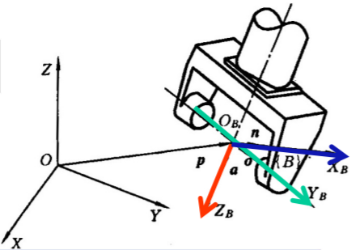
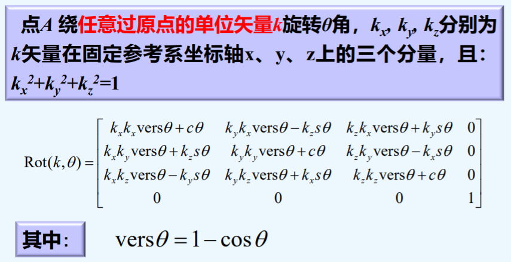
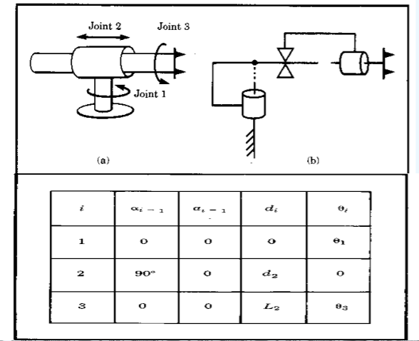
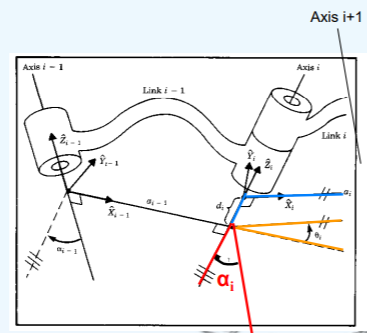
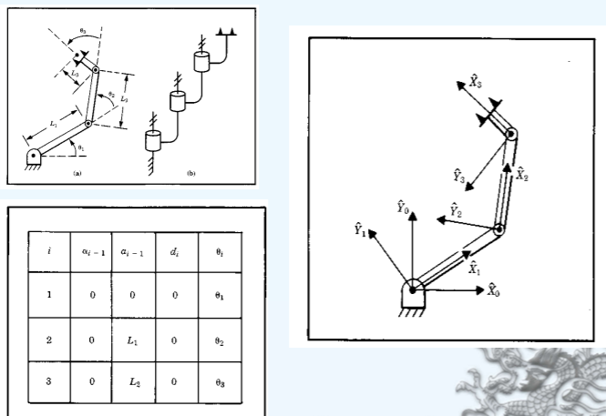
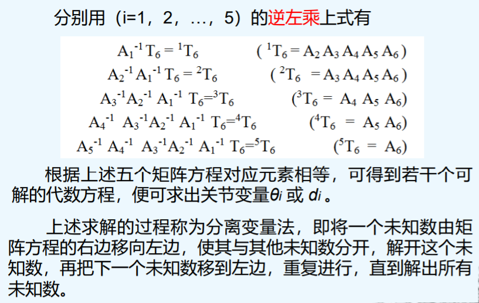

# 机器人运动学

**矩阵乘法不具有交换律**

## 1. 物体在空间中的位姿描述

1. **点的位置描述**：给定直角坐标系$\{A\}$，点$p$可以用位置矢量$^{A}p = [p_x, p_y, p_z]^T$

2. **点的齐次坐标**：n维的点可以用n+1维表示，同一点的齐次坐标表示不唯一，$p = [p_x,p_y,p_z,1] = [np_x,np_y,np_z,n]$

3. **坐标轴的方向描述**：（齐次）$X = [1,0,0,0]^T， Y = [0,1,0,0]^T, Z = [0,0,1,0]^T$

   * 对于齐次坐标的第四个元素，若不为0，则表示一个点；若为0，则表示任一方向矢量$v = [\cos\alpha, \cos\beta, \cos\gamma,0], \alpha,\beta,\gamma$分别是与$x,y,z$轴的夹角。

4. **动坐标系的位姿描述**：就是对动坐标原点位置及各坐标轴的方向的的描述，结果是一个$4\times4$的矩阵。

   * 位姿：位置和姿态

   * **刚体的位姿描述**：前三列是$x,y,z$轴方向的齐次坐标，第四列是坐标原点的位置，（保证最后一个元素为1？）

   * **机器人手部位姿描述**：

     

     * 关节轴为$Z_B$，$Z_B$轴的单位方向矢量$\alpha$称为**接近矢量**，指向朝外
     * 二手指的连线为$Y_B$轴，$Y_B$轴的单位方向矢量$o$称为**姿态矢量**，指向可任意选定
     * $X_B$轴与$Y_B$轴及$Z_B$轴垂直，$X_B$轴的单位方向矢量$n$称为**法向矢量**，且$n=o\timesα$。（右手定则，拇指指向$o$，其他手指指向$\alpha$，穿入掌心即为$n$?）

## 2. 齐次坐标变换及换算

刚体的运动可以分解为移动和平移，引入**齐次坐标变换矩阵**，用同一矩阵表示旋转和平移。

1. **平移齐次变换**

   若各方向上的移动距离为$(\Delta x, \Delta y, \Delta z)$，有平移的齐次变换矩阵为：$Trans(\Delta x, \Delta y, \Delta z)$
   $$
   \begin{bmatrix} 
   1 & 0 & 0 & \Delta x \\ 
   0 & 1 & 0 & \Delta y \\ 
   0 & 0 & 1 & \Delta z \\ 
   0 & 0 & 0 & 1
   \end{bmatrix}
   $$
   变换后的位置：$A' = Trans(\Delta x, \Delta y, \Delta z)A, A = [x,y,z,1]$

   平移变换不仅仅适用于点的平移变换，而且**也适用于矢量、 坐标系、物体等平移变换计算**。

   > 若**算子左乘**，表示坐标变换是相对**固定坐标系**进行的； 
   >
   > 假如相对动坐标系进行坐标变换，则算子应该右乘。
   >
   > （这应该是坐标系变换的内容吧）

   例子：

   * 动坐标系$\{A\}$相对于固定坐标系的$X_0,Y_0,Z_0$轴作$(-1, 2,2)$平移后到$\{A'\}$；
     * 算子左乘：$A' = Trans(-1,2,2)\times A$
   * 动坐标系$\{A\}$**相对于自身坐标系**(即动系)的$X,Y,Z$轴分别作$(-1,2,2)$平移到$\{A''\}$。
     * 算子右乘：$A' = A\times Trans(-1,2,2)$

2. **旋转齐次变换**

   空间某一点$A$，坐标为$(x,y,z)$，当它**绕$z$轴旋转$\theta$角**后 至$A′$点，坐标为$(x′,y′,z′)$，$A′$点和$A$点的坐标关系：（绕其他轴旋转同理）
   $$
   \begin{align*}
       \begin{split}
       \left \{
       \begin{array}{lr}
           x' = x \cos \theta - y \sin \theta \\
           y' = x \sin \theta + y \cos \theta \\
           z' = z
       \end{array}
       \right.
       \end{split}
   \end{align*}
   $$
   得到旋转矩阵$Rot(z, \theta)$：
   $$
   \begin{bmatrix} 
   \cos\theta & -\sin\theta & 0 & 0\\ 
   \sin\theta & \cos\theta & 0 & 0 \\ 
   0 & 0 & 1 & 0 \\ 
   0 & 0 & 0 & 1
   \end{bmatrix}
   $$
   绕任意轴的情况：

   

   与平移变换一样，旋转变换算子不仅仅适用于点的旋转变换，而且**也适用于矢量、 坐标系、物体等旋转变换计算**。

   若相对于固定坐标系进行变换，则算子左乘；若相对于动坐标系进行变换，则算子右乘。

3. **复合齐次变换**

   平移加旋转的齐次变换也称为复合齐次变换或一般齐次变换，它并不限定平移变换或旋转变换的次数或先后次序。

## 3. 变换方程的建立

1. **多级坐标变换**：工业机器人都具有2个以上的自由度，从末端操作器把持中心的坐标系到固定坐标系的变换要经过多级坐标变换。

   设有一具有$n$个自由度的机器人，点$O_n$为末端操作器把持中心动坐标系的原点，点$P$为末端操作器上的任意一点。点$P$相对于固定坐标系$\{O_0:x_0,y_0,z_0\}$的坐标为$P(x,y,z)$，而相对于动坐标系 $\{O_n:x_n,y_n,z_n\}$的坐标为$P(x_n,y_n,z_n)$，已知$P(x_n,y_n,z_n)$，要求$P(x,y,z)$的表达式。

   有坐标变换矩阵：$T = T_1T_2T_3...T_{n-1}T_n$，齐次变换方程：$X = TX_n$

2. **多级坐标系的变换**：为了描述机器人的运动，以便于编程控制，常常需要定义多种坐标系。几种常用的坐标系有：基座(固定)坐标系{B}、工作台坐标系{S}、手部坐标系{H}、工具坐标系{T}、工件坐标系{G}及通用坐标系{U}。

## 4. 工业机器人连杆参数及其变换矩阵

手部位姿是与机器人各连杆的尺寸、运动副类型及杆间的相互关系直接相关联的。因此在研究手部相对于机座的几何关系时，首先必须分析两相邻连杆的相互关系，即建立连杆坐标系。

**DH约定**：在此约定中，**每个齐次变换矩阵都可以表示为四个基本矩阵的乘积**（但是我用的是另一个矩阵）
$$
A_i = Rot_{z,\theta_i}Trans_{z,d_i}Trans_{x,a_i}Rot_{x,a_i} \\
=
\begin{bmatrix}
c_{\theta_i} & -s_{\theta_i}c_{\alpha_i} & s_{\theta_i}s_{\alpha_i} & a_ic_{\theta_i} \\
s_{\theta_i} & c_{\theta_i}c_{\alpha_i} & -c_{\theta_i}s_{\alpha_i} & a_is_{\theta_i} \\
0 & s_{\alpha_i} & c_{\alpha_i} & d_i \\
0 & 0 & 0 & 1
\end{bmatrix}
$$
其中，4个变量$a_i, \alpha_i, d_i, \theta_i$是与**连杆**$i$和**关节$i$**相关的参数，分别命名为**连杆长度（link length）、连杆扭曲（link twist）、连杆偏置（link offset）以及关节角度（joint angle）**。

1. **机器人的连杆参数**：

   1. **连杆的几何参数**（固定的）：**连杆$n$两端有关节$n$和关节$n+1$**。该连杆尺寸可以用两个量来描述： 一个是**两个关节轴线沿公垂线的距离**$a_n$，称为**连杆长度**；另一个是垂直于$a_n$的平面内**两个关节轴线的夹角$\alpha_n$**，称为**连杆扭角**。这两个参数为连杆的尺寸参数。

      > 公垂线：一条直线同时垂直于两条或两条以上线段或直线，这条直线就是被垂直的线段或直线的公垂线。

   2. **连杆的关系参数**（可变的）：**考虑连杆$i$与相邻连杆$i+1$的关系**，若它们通过关节相连，其相对位置可用两个参数$d_i$和$\theta_i$ 来确定，其中$d_i$是**沿关节$i$轴线两个公垂线的距离**，称为**连杆偏置**。$\theta_i$是**垂直于关节i轴线的平面内两个公垂线的夹角**，称为**关节角度**。
   3. **连杆中的收尾连杆**：（连杆编号：[0, n]，关节编号：[0, n+1]）
      * 末端连杆：$a_0 = a_n = \alpha_0 = \alpha_n = 0$
      * 关节1(或n)如果为**转动关节**，则$\theta_1$的零位可以任意选取， 并规定$d_1$ =0
      * 关节1(或n)如果为**移动关节**，则$d_1$的零位可以任意选取， 并规定$\theta_1$ =0。
   4. **对于转动关节，$\theta_i$为关节变量，其他三个连杆固定不变； 对于移动关节，$d_i$为关节变量，其他三个连杆固定不变**。

   > 例题：
   >
   > 
   >
   > 

2. **连杆坐标系的建立**：为了描述每个连杆和相邻连杆之间的相对位置关系,需要**在每个连杆上**定义一个固连坐标系。

   1. 连杆中的中间连杆，规定：

      1. 坐标系$\{i\}$的$Z$轴称为$Z_i$，与关节轴$i$重合；
      2. 坐标系$\{i\}$的原点位于公垂线$a_i$与关节轴$i$的交点处；
      3. $X_i$轴沿$a_i$方向由关节$i$指向关节$i+1$，若$a_i =0$，则$X_i$垂直于$Z_i$ 和$Zi+1$所在的平面；
      4. 按照右手定则绕$X_i$轴的转角定义为$\alpha_i$ ，由于$X_i$轴的符号有两种，则转角的符号也有两种；
      5. $Y_i$轴由右手定则确定。

      > 坐标系$\{i\}$相对于$\{i-1\}$的变换矩阵$^{i-1}_iA$可以看作以下四个子变换矩阵的乘积：
      >
      > * 绕$x_{i-1}$轴转$\alpha_{i-1}$
      > * 沿$x_{i-1}$轴移动$a_{i-1}$
      > * 绕$z_i$轴转$\theta_i$
      > * 绕$z_i$轴移动$d_i$

   2. 连杆中的首尾连杆（晕）

      1. 坐标系$\{0\}$通常规定：$Z_0$轴沿着**关节轴1的方向**，**当坐标系1的关节变量为0时， 设定参考坐标系{0}与{1}重合，且$a_0 =0，\alpha_0 =0$。**

         * 当关节1为转动关节，$d_1 =0$；
         * 当关节1为移动关节，$\theta_1 =0$。

      2. 坐标系$\{n\}$通常规定：

         * 对于转动关节n，设定$\theta_n=0$，此时$X_n$和$X_{n-1}$轴的方向相同，选取坐标系$\{n\}$的原点位置，使之满足$d_n=0$； 
         * 对于移动关节n，设定$X_n$轴的方向使之满足$\theta_n =0$，当$d_n =0$时，选取坐标系$\{n\}$的原点位于$X_{n-1}$轴与关节轴n的交点位置。

      3. 连杆坐标系中对连杆参数的归纳

         

         $a_i$：沿$X_i$轴,从$Z_i$移动到$Z_{i+1}$的距离

         $\alpha_i$：绕$X_i$轴，从$Z_i$旋转到$Z_{i+1}$的角度

         $d_i$：沿$Z_i$轴，从$X_{i-1}$移动到$X_i$的距离

         $\theta_i$：绕$Z_i$轴，从$X_{i-1}$旋转到$X_i$的角度

         通常规定$a_i > 0$，其余可正可负。

         * 按照上述规定的坐标系不是唯一的，$Z_i$的指向有两种选择
         * 如果关节轴相交，$X_i$轴的指向也有两种选择
         * 当相邻两轴平行时，坐标系原点可以任意选择
         * 当关节为移动关节时，坐标系的选取一定具有任意性

      4. 建立连杆坐标系的步骤：
         1. 确定各关节轴线，并画出轴的延长线
         2. 找出关节轴$i$和$i+1$的公垂线或交点，作为坐标系i的原点
         3. 规定$Z_i$的指向是沿着第$i$个关节轴。
         4. 规定$X_i$轴得指向是沿着轴$i$和$i+1$的公垂线的方向，如果关节轴i和i+1相交，则$X_i$轴垂直于关节轴$i$和$i+1$所在的平面
         5. $Y_i$轴的方向由右手定则确定
         6. 当第一个关节变量为0时，规定坐标系{0}和{1}重合，对 于坐标系{N}，尽量选择坐标系使得连杆参数为0

      > 例题：
      >
      > 

   > 补充：（。。。乱透了）
   >
   > **具有n个关节的机器人机械臂将有n+1个连杆，这是因为每个关节连接两个连杆。从基座开始，我们将各关节按照从1到n的顺序进行编号， 同时将连杆按照从0到n的顺序进行编号。按照这种约定，关节i把连杆i-1连接到连杆i上。**
   >
   > 把关节i的位置相对于连杆i-1固定。当关节i被驱动时，连杆i发生运动。 因此，连杆0（第一个连杆）是固定的，并且当关节被驱动时并不运动。
   >
   > 在连杆i上固连一个坐标系$O_i = \{x_i y_i z_i\} $（参考系），无论机器人执行什么样的运动，连杆i上每个点在第i个参考系里的的坐标保持不变。当关节i被驱动时，连杆i以及其上的附体坐标系$O_i = \{x_i y_i z_i\} $将会经历相同的运动。
   >
   > 确定$Z_i$轴：设置$z_i$作为第i+1个关节的驱动轴，其方向和关节轴线方向保持一致。
   >
   > 确定$X_i$方向：三种情况
   >
   > * 轴$Z_{i-1}$和轴$Z_i$不共面：那么轴$Z_{i-1}$和轴$Z_i$的公垂线定义了$X_i$轴，并且它于轴$Z_i$ 的交点即为原点$O_i$。
   > * 轴$Z_{i-1}$平行于轴$Z_i$：轴$Z_{i-1}$和轴$Z_i$之间存在无穷多个共同法线。**将穿过原点$O_{i-1}$的法线选作$X_i$轴**，$O_i$是该法线和$Z_i$轴的交点。
   > * 轴$Z_{i-1}$和轴$Z_i$相交 选择$X_i$垂直于由$Z_{i-1}$和$Z_i$组成的平面。原点$O_i$ 一般设为$Z_{i-1}$和$Z_i$的交点。不过，轴线$Z_i$上的任意一点都可以被选作原点。
   >
   > 确定坐标系N：以上的三个步骤适用于坐标系0,…N-1。最终的坐标系通常被称为末端执行器或者工具坐标系。
   >
   > * 最常见的是，将原点$O_n$以对称方式布置在夹具的中间，$Z_n$轴方向沿着末端移动方向（最后一个关节伸缩的方向）。$X_n$轴方向沿着夹具的上下开合方向。

3. **连杆坐标系之间的变换矩阵**

   * 建立了各连杆坐标系后，i-1系与i系间的变换关系可以用坐标系的平移、旋转来实现。
   * 从i-1系到i系的变换，可先令以i-1系绕$Z_{i-1}$轴旋转$\theta_i$角， 再沿$Z_{i-1}$轴平移$d_i$，然后沿$X_i$ 轴平移$a_i$，最后绕$X_i$轴旋转$\alpha_i$角，使得i-1系i系重合。
   * 用一个变换矩阵$A_i$来综合表示上述四次变换时应注意 到坐标系在每次旋转或平移后发生了变动，后一次变换都 是相对于动系进行的，因此在运算中变换**算子应该右乘**。

## 5. 工业机器人运动学方程

* 机器人运动学方程

  * 为机器人的每一个连杆建立一个坐标系，并用齐次变换来描述这些坐标系间的相对关系，也叫相对位姿。通常把描述一个连杆坐标系与下一个连杆坐标系间相 对关系的齐次变换矩阵叫做A变换矩阵或A矩阵。如果$A_1$矩阵表示第一连杆坐标系相对于固定坐标系的齐次变换，则第一连杆坐标系相对于固定坐标系的位姿$T_1$为$T_1 = A_1T_0 = A_1$，以此类推有$T_2 = A_1A_2, T_6 = A_1A_2A_3A_4A_5A_6$，此式右边表示了从固定参考系到手部坐标系的各连杆 坐标系之间的变换矩阵的连乘，左边$T_6$表示这些变换矩 阵的乘积，也就是手部坐标系相对于固定参考系的位姿，这样形式的方程就是机器人的运动学方程。

* 正向运动学：主要解决机器人运动学方程的建立及手部位姿的求解问题。

* 逆向运动学：已知手部的位姿，求各个关节的变量。

  * 求解方法：求逆左乘（分离变量法）

    

  * 可能存在的问题：解不存在（当给定手部位置在工作区域外时，则解不存在。）或解的多重性（有多组解时，可能有某些解，机器人关节不能达到。）
  * 应该根据具体情况，在避免碰撞的前提下，按“最短行程”的原则来择优，即每个关节的移动量最小，还此应遵循“多移动小关节，少移动大关节”的原则。
