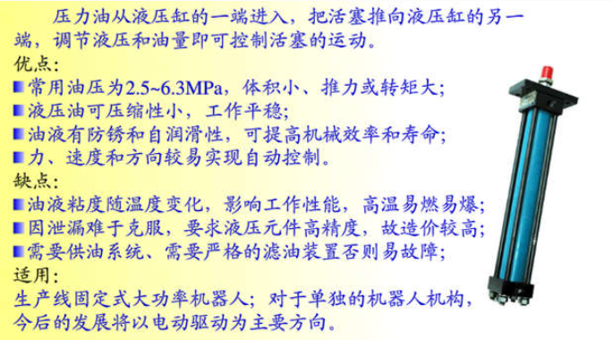
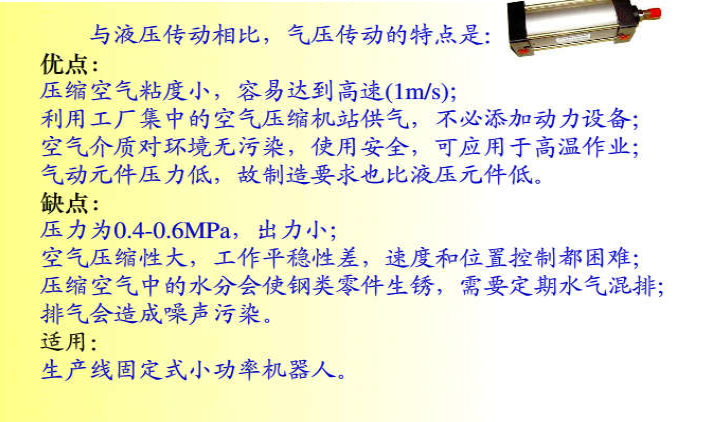
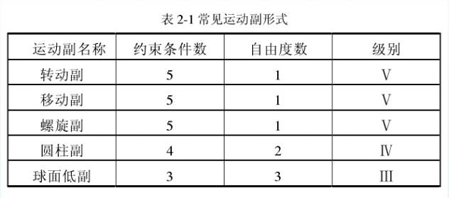
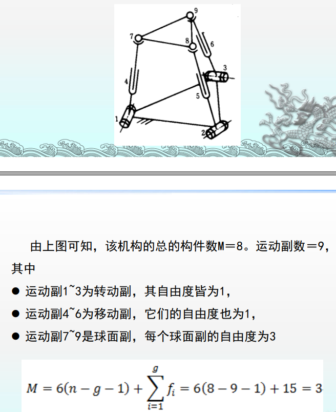

机器人导论 - 复习笔记 - 课件 

[toc]

> 一共有10个课件，我们准备用周二下午到周三下午这一天的时间来过一遍，具体进度随实际情况调整。

## Lecture 01 概述

* **机器人的定义**：
  * 美国机器人协会(RIA)的定义：机器人是一种用于移动各种材料、零件、工具或专用装置的，通过可编程序动作来执行种种任务的，并具有编程能力的多功能机械手。
  * **我国科学家对机器人的定义是：机器人是一种自动化的机器，所不同的是这种机器具备一些与人或生物相似的智能能力，如感知能力、规划能力、动作能力和协同能力，是一种具有高度灵活性的自动化机器。**

---

* **机器人的四大特征**：
  * **仿生特征**
  * **柔性特征**（通用性）
  * **智能特征**（记忆、感知、推理、决策、学习）
  * **自动特征**（独立性）

---

* 机器人未来的发展趋势：语言交流功能越来越完美、各种动作的完美化、外形越来越酷似人类、逻辑分析能力越来越强、具备越来越多的功能

---

* 机器人的分类：
  * **按照应用类型分类：工业机器人、特种机器人（极限作业机器人）和服务型机器人**
  * **按照控制方式分类**：
    * 操作机器人：人手远距离操纵
    * 程序机器人：预先给定程序进行作业
    * 示教再现机器人：手把手示教、有线示教和无线示教
    * 智能机器人：可根据工作环境自动改变动作
    * 综合机器人：由操作机器人、 示教再现机器人、 智能机器人组合而成的机器人
  * **按照坐标形式分类：（P指 Prismatic Joint 移动关节·，R指 Rotating Joint 转动关节）**
    * **直角坐标／笛卡儿坐标／台架型（3P）**：由3个线性关节组成，这3个关节用来确定末端操作器的位置，通常还带有附加的旋转关节，用来确定末端操作器的姿态。
      * 优点：在x、y、z轴上的运动是独立的，运动方程可独立处理， 且方程是线性的， 因此很容易通过计算机控制实现；可以两端支撑， 对于给定的结构长度， 刚性最大； 它的精度和位置分辨率不随工作场合而变化， 容易达到高精度。
      * 缺点：操作范围小，手臂收缩的同时又向相反的方向伸出，既妨碍工作，又占地面积大，运动速度低，密封性不好
    * **圆柱坐标型（R2P）**：由两个滑动关节和一个旋转关节来确定部件的位置， 再附加一个旋转关节来确定部件的姿态。
      * 优点：这种机器人可以绕中心轴旋转一个角，工作范围可以扩大，且计算简单；直线部分可采用液压驱动，可输出较大的动力；能够伸入型腔式机器内部。
      * 缺点：但是，它的手臂可以到达的空间受到限制， 不能到达近立柱或近地面的空间；直线驱动部分难以密封、防尘；后臂工作时， 手臂后端会碰到工作范围内的其它物体
    * **球坐标系（2RP）**：它用一个滑动关节和两个旋转关节来确定部件的位置， 再用一个附加的旋转关节确定部件的姿态。
      * 优点：可以绕中心轴旋转， 中心支架附近的工作范围大，两个转动驱动装置容易密封， 覆盖工作空间较大。
      * 缺点：但该坐标复杂，难于控制，且直线驱动装置仍存在密封及工作死区的问题。 
    * **关节坐标型/拟人型（3R）**：关节机器人的关节全都是旋转的，类似于人的手臂，是工
      业机器人中最常见的结构。
    * **平面关节型**：可看做是关节坐标式机器人的特例，它只有平行的肩关节和肘关节，关节轴线共面。
  * **按照承载能力分类：（根据提取重力划分）**
    * 微型机器人（小于10N）、小型机器人（10-50N）、中型机器人（50-300N）、大型机器人（300-500N）、重型机器人（大于500N）

---

* **机器人的基本组成**：工业机器人由3大部分6个子系统组成 
  * **3大部分是机械部分、传感部分和控制部分。**
  * **6个子系统是驱动系统、机械结构系统、感受系统、机器人-环境交互系统、人机交互系统和控制系统。**
    * **驱动系统**：按照控制系统发出的控制指令将信号放大，驱动执行机构运动的传动装置，电气、液压、气动和机械等驱动方式。 
    * **机械结构系统**：
      * *末端执行器（手部）*：机器人直接执行工作的装置，可安装夹持器、工具、传感器等。
      * *手腕*：连接手臂和末端执行器的部件，用以调整末端执行器的方位和姿态。
      * *手臂*：手臂是支承手腕和末端执行器的部件。它由动力关节和连杆组成，用来改变末端执行器的空间位置。
      * *机座*：承受相应的载荷，机座分为固定式和移动式两类。
    * **控制系统**：支配着机器人按规定的程序运动，并记忆给定的指令信息（如动作顺序、运动轨迹、运动速度等），同时按其控制系统的信息控制执行机构按规定要求动作。
    * **感受系统**：由内部传感器模块和外部传感器模块组成，用以获取内部和外部环境状态中有意义的信息。
      * *位置检测*：主要检测工业机器人执行系统的运动位置、状态，并随时将执行系统的实际位置反馈给控制系统，并与设定的位置进行比较，然后通过控制系统进行调整，使执行系统以一定放入精度达到设定位置状态。
    * **机器人-环境交互系统**：实现工业机器人与外部环境中的设备相互联系和协调的系统。
    * **人机交互系统**：是使操作人员参与机器人控制并与机器人进行联系的装置，该系统归纳起来分为两大类：*指令给定装置*和*信息显示装置*。

---

* **机器人的技术参数**：自由度、精度、工作范围、最大工作速度和承载能力 。

  * **自由度**： 指机器人**各关节在三维空间对于独立坐标轴运动数目**，各关节自由度的总和就是工业机器人的自由度数。（不包括末端操作器的开合自由度）

    * 在三维空间中描述一个物体的位置和姿态(简称位姿)需要六个自由度，工业机器人自由度可能小于六个，也可能大于六个（冗余自由度）。

      > 人的手臂(大臂、小臂、 手腕)共有七个自由度

  * **精度**：定位精度和重复定位精度 
    * 定位精度：指机器人手部实际到达位置与目标位置之间的差异（知否准确）
    * 重复定位精度：指机器人重复定位其手部于同一目标位置的能力，可以用标准偏差这个统计量来表示 。（是否稳定）
  * **工作空间**：机器人手臂末端或手腕中心所能到达的所有点的集合，也叫工作区域。
    
    * 主要取决于*臂部的自由度*和每个*关节的运动范围*。
  * **速度/加速度**：最大稳定速度、最大允许的加减速度
    * 运动速度高，机器人所承受的动载荷增大，必将在加减速时承受较大的惯性力，影响机器人的工作平稳性和位置精度。
    * 加速或减速过快，有可能引起定位时超调或振荡加剧，使得到达目标位置后需要等待振荡衰减的时间增加，则也可能使有效速度反而降低。
  * **承载能力**：机器人在工作范围内的任何位姿上所能承受的最大质量。

---

> 什么是SCARA机器人？应用上有何特点？
>
> * SCARA(Selective Compliance Assembly Robot Arm)**机器人有两个并联的旋转关节，可以使机器人在水平面上运动，此外，再用一个附加的滑动关节做垂直运动。** 
> * 有3个旋转关节，其轴线相互平行，在平面内进行定位和定向。另一个是移动关节。这种结构轻便、响应快。
> * 常用于装配作业，最显著的特点是它们在x-y平面上的运动具有较大的柔性，而沿z轴具有很强的刚性，所以，它具有选择性的柔性。
> * 特点：结构轻便，响应快；适用于平面定位和在垂直方向进行作的场合。

> 工业机器人与数控机床有什么区别？
>
> 1. 数控机床安装后通常在固定位置工作，而工业机器人可以移动。
> 2. 工业机器人具有拟人化的特点，智能化工业机器人还有许多类似人类的“生物传感器”，能适应一定的环境。
> 3. 工业机器人按臂部的运动形式分为四种。直角坐标型的臂部可沿三个直角坐标移动；圆柱坐标型的臂部可作升降、回转和伸缩动作；球坐标型的臂部能回转、俯仰和伸缩；关节型的臂部有多个转动关节。数控机床一般无关节且均为直角坐标系统。
> 4. 除了专门设计的专用的工业机器人外，一般工业机器人在执行不同的作业任务时具有较好的通用性。数控机床的通用性不强。
> 5. 数控机床对操作人员的素质要求较高，对维修人员的技术要求更高。而工业机器人对操作人员的要求没有数控机床高。

## Lecture 02 工业机器人的本体结构设计

* 掌握机器人技术参数的选定准则，了解机器人常用的驱动方式和新型驱动源，传动机构
* 了解机器人机身和臂部的典型机构，学会计算机身和臂部的驱动力与力矩
* 了解机器人手腕关节的典型结构和腕部关节的自由度掌握机器人的组成和技术参数
* 了解手部特点和分类，掌握手部夹持力的计算方法

---

#### Section 02-1 工业机器人总体设计

---

* **机器人总体设计的步骤**
  1. **系统分析**：
     1. 明确采用机器人的目的和任务；
     2. 分析机器人所在系统的工作环境，包括设备兼容性；
     3. 认真分析系统的工作要求，确定机器人的基本功能和方案；
     4. 进行必要的调查研究，搜集国内外的有关技术资料。
  2. **技术设计**：
     1. 机器人**基本参数**的确定（自由度数目、工作范围、运动速度及定位精度等）；
     2. 选择机器人的**运动形式**：直角坐标型、圆柱坐标型、极坐标型、关节型和SCARA型；
     3. 拟定检测**传感系统**框图，选择合适的传感器，以便结构设计时考虑安装位置；
     4. 确定**控制系统**总体方案，绘制框图；
     5. 机械结构设计：确定**驱动方式**，选择运动部件和设计具体结构，绘制机器人总装图及主要部件零件图。
  3. **仿真分析**：
     1. 运动学计算：速度、加速度、位置
     2. 动力学计算：关节驱动力
     3. 运动的动态仿真
     4. 性能分析，对机器人建模，对机器人动态性能进行仿真计算
     5. 方案和参数修改，运用仿真分析的结果对所设计的方案、结构、尺寸和参数进行修改，加以完善。

---

* **主体结构设计**：选择由连杆件和运动副组成的*坐标形式*
  * 直角坐标机器人：主体结构有三个自由度，全为伸缩。
  * 圆柱坐标机器人：主体结构有三个自由度，腰转、升降和伸缩。
  * 球面坐标机器人：主体结构有三个自由度，转动、转动和伸缩。
  * 关节坐标机器人：主体结构有三个自由度，全为转动

---

* **传动方式选择**：

  > *减速比*，即减速装置的传动比，是传动比的一种，是指减速机构中瞬时输入速度与输出速度的比值

  | 传动形式       | 特征                                        | 优点                                                   | 缺点                                         |
  | -------------- | ------------------------------------------- | ------------------------------------------------------ | -------------------------------------------- |
  | 直接连接传动   | 直接装在关节上                              | 结构紧凑                                               | 需考虑电机自重，转动惯量大，能耗大           |
  | 远距离连接传动 | 经远距离传动装置与关节相连                  | 不需考虑电机自重，平衡性良好                           | 额外的间隙和柔性，结构庞大，能耗大           |
  | 间接传动       | 减速比远>1的传动装置与关节相连              | 经济、对载荷变化不敏感、便于制动设计、方便一些运动转换 | 传动精度低、结构不紧凑、引入误差，降低可靠性 |
  | 直接驱动       | 不经中间关节或经速比 =1的传动装置与关节相连 | 传动精度高，振动小，传动损耗小，可靠性高， 响应快      | 控制系统设计困难，对传感元件要求高，成本高   |

---

* **模块化结构设计**：由一些标准化、系列化的模块件通过具有特殊功能的结合部用积木拼搭方式组成的工业机器人系统 
  * 优点：
    * 比较经济；
    * 比较灵活，机器人的自由度可以方便地增减、通过调整来扩大工业机器人的工作范围、能不断对现役模块化工业机器人更新改造。
  * 问题：
    * 整个系统刚度比较差；
    * 连接附件增加整体重量；
    * 尚未真正做到根据作业对象就可以合理进行模块化分析和设计。

---

* **机器人本体材料的选择**：
  * 材料选择的基本要求：强度高、弹性模量大、重量轻、阻尼大、材料价格低。
  * 机器人常用材料：碳素结构钢、合金结构钢；铝、铝合金及其它轻合金材料；纤维增强合金；陶瓷；纤维增强复合材料；粘弹性大阻尼材料。

---

* **平衡系统设计**：
  * 工业机器人设计中采用平衡系统的理由：（安全、稳定、误差、磨损）
    * 安全
    * 能降低因机器人构形变化而导致重力引起关节驱动力矩变化的峰值
    * 能降低因机器人运动而导致惯性力矩引起关节驱动力矩变化的峰值
    * 能减少动力学方程中内部耦合项和非线性项，改进机器人动力特性
    * 统能减小机械臂结构柔性所引起的不良影响
    * 能使机器人运行稳定，降低地面安装要求
  * 平衡系统设计的主要途径
    * 质量平衡技术
    * 弹簧力平衡技术
    * 可控力平衡技术

---

#### Section 02-2 工业机器人的驱动与传动

---

> 驱动：提供动力
>
> 传动：传递动力

* **机器人驱动机构**

  * 直线驱动机构

    * **齿轮齿条装置**：齿条固定，齿轮传动时齿轮轴连同拖板沿齿条方向做直线运动

      * 拖板由导杆或导轨支承，该装置的回差较大

    * **普通丝杠装置**：由一个旋转的精密丝杠驱动一个螺母沿丝杠轴向移动

      * 摩擦力较大，效率低，惯性大，精度低，回差大，容易产生爬行现象

      > 爬行现象：在滑动摩擦副中从动件在匀速驱动和一定摩擦条件下产生的周期性时停时走或时慢时快的运动现象。

    * **滚珠丝杠装置**：在丝杠螺母的螺旋槽里放置了许多滚珠，传动过程中所受的摩擦力是滚动摩擦

      * 极大地减小摩擦力，因此传动效率高，消除了低速运动时的爬行现象

    * **液压平移**：直接平移过程，液压推动活塞

    * **气压平移**：直接平移过程，空气黏度小，用以达到高速

      |  |  |
      | ---------------------------------------------- | ---------------------------------------------- |

  * 旋转驱动机构
    * **齿轮链**：是由两个或两个以上的齿轮组成的传动机构，不但可以传递运动角位移和角速度， 而且可以传递力和力矩。 
    * **同步皮带**：相当于柔软的齿轮， 具有柔性好， 价格便宜、加工也容易；同步皮带还被用于输入轴和输出轴方向不一致的情况。
    * **谐波齿轮**：假设刚性齿轮有100个齿，柔性齿轮比它少2个齿，**柔性齿轮沿刚性齿轮每转一圈就反方向转过两个齿的相应转角**，则当谐波发生器转50圈时，柔性齿轮转1圈。这样只占用很小得空间就可得到1:50的减速比。

---

* **传动部件的设计**

  * **关节**
    * 转动关节：由**回转轴**、**轴承**和**驱动机构**组成。
      * 转动关节的形式（看不懂）
      * 轴承：**球轴承**
    * 移动关节：由**直线运动机构**和在整个运动范围内起直线导向作用的**直线导轨部分**组成。
      * 导轨部分有滑动导轨、**滚动导轨**（结构紧凑且价格低廉）、静压导轨、磁悬浮导轨等形式
      * 滚动导轨：滚动体（球、圆柱滚子、滚针）；轨道（圆轴式、平面式、滚道式）；滚动体是否循环
  * **传动件的定位和消隙**
    * 传动件的定位：有**电气开关定位、机械挡块定位、伺服定位**系统
    * 传动件的消隙：**消隙齿轮**（弹簧消隙、螺钉消隙）、柔性齿轮消隙、**对称传动**消隙、**偏心机构**消隙、**齿廓弹性覆层消隙**

  * **机器人传动机构**
    * **齿轮传动（行星齿轮传动、谐波齿轮传动）**；**丝杠传动**；**带传动和链传动；绳传动和刚带传动**；杆、**连杆与凸轮**传动；流体传动；钢丝+滑轮传动

---

* **驱动装置的类型和特点**
  * **电动驱动装置**：
    * 能源简单，速度变化范围大，效率高，速度和位置精度都很高；
    * 多与减速装置相联，直接驱动比较困难；
    * 分类：直流、交流伺服电机和步进电机驱动
      * 直流伺服电机：电刷易磨损，且易形成火花，无刷直流电机的应用越来越广泛
      * 步进电机驱动多为开环控制，控制简单但功率不大，多用于低精度小功率机器人系统。
  * **液压驱动装置**（优缺点看上面的液压平移）
  * **气动驱动装置**（优缺点看上面的气压平移）
  * 驱动装置的选择原则：**起动力矩大，调速范围宽，惯量小，尺寸小，同时还要有性能好、与之配套的数字控制系统。**
    * 一般说来，目前负荷为100 kg以下的，可优先考虑电动驱动装置。
    * 只须点位控制且负荷较小者，或有防暴、清洁等特殊要求者，可采用气动驱动装置。
    * 负荷很大或机器人周围已有液压源的常温场合，可采用液压驱动装置。

---

* **新型驱动方式**
  * 磁致伸缩驱动：铁磁材料和亚铁磁材料由于磁场中磁化状态的改变，其长度和体积都要发生微小的变化，这种现象称为磁致伸缩。
  * 形状记忆合金：利用记忆合金在加热时形状恢复的同时其回复力可对外作功的特性，能够制成各种驱动元件。这种驱动机构结构简单，灵敏度高，可靠性好
  * 静电驱动
  * 超声波电机
  * 气动肌肉（编织式、网孔式、嵌入式）**：由一段包裹纤维网的橡胶筒和两端的接头附件连接组成**，能够像生物肌肉那样产生很大的收缩力。
    * 原理：**核心是个可膨胀的薄壁囊，外部为限制变形的支撑材料，两端使用连接件固定。充气产生径向变形，收缩力增大，放气收缩力减小。**

----

#### Section 02-3 机身及臂部结构

---

* 机身结构的基本形式和特点
  * 机身与臂部的配置形式：**横梁式、立柱式、机座式、屈伸式**
  * 机身的典型结构：回转与升降机身、回转与俯仰机身
  * 机身驱动力（力矩）的计算：
    * 垂直升降驱动力：
      * $P_q = F_m + F_g \pm W$（正负号取决于上升（+）还是下降（-））
      * 右边式子三个变量分别是**各支撑处的摩擦力**、**启动时的总惯性力**、**运动部件的总重力**。
    * 回转运动驱动力矩
      * $M_q = M_m + M_g$ 即**总摩擦阻力矩**与**各回转运动部件的总惯性力矩**的和
      * $M_g = J_0 \frac{\Delta \omega}{\Delta t}$ 
        * $J_0$为全部回转零件对机身回转轴的**转动惯量**，$\Delta t$为回转运动升速过程或制动过程的**时间**，$\Delta \omega$为升速或制动过程中的**角速度增量**。
      * 如果尺寸不大，中信里回转轴线距离远，可按质心来计算。
    * 升降立柱下降不卡死 (不自锁)的条件计算：偏重力矩
    * 机身设计要注意的问题：
      * 刚度和强度大，稳定性好
      * 运动灵活，导套不宜过短，避免卡死
      * 驱动方式适宜
      * 结构布置合理

---

* 臂部结构的基本形式和特点
  * 臂部的典型结构
    * 臂部伸缩机构
      * 行程小时，采用油（气）缸直接驱动；
      * 行程较大时，可采用油（气）缸驱动齿条传动的倍增机构或步进电机及伺服电机驱动，也可采用丝杠螺母或滚珠丝杠传动。
    * 手臂俯仰运动机构
    * 手臂回转与升降机构
      * 常采用回转缸与升降缸单独驱动

---

* 机器人的平稳性和臂杆平衡方法
  * 由于机身和臂部的运动比较多，质量大，运动状态变化容易导致冲击和震荡，导致机器人不能精准定位，不能正常运转。
  * 质量平衡方法：用一个重物来平衡重心
  * 弹簧力平衡方法

---

#### Section 02-4 机身及臂部结构

---

* 腕部自由度
  * 手腕的俯仰、翻转/滚转和偏转/弯转（分别对应机器手绕空间三个轴旋转）
  * RRR（3R）手腕：R Roll 就是翻滚

---

* 腕部典型结构
  * 单自由度回转运动手腕
  * 二自由度手腕
  * 三自由度手腕

---

* 柔性手腕
  * 柔顺性装配技术：
    * 主动柔顺装配：是从检测、控制的角度出发， 采取各种不同的搜索方法， 实现边校正边装配; 有的手爪还配有检测元件， 如视觉传感器力传感器等。
    * 被动柔顺装配：从结构的角度出发， 在手腕部配置一个柔顺环节， 以满足柔顺装配的需要。

---

* 腕部设计注意问题
  * 结构紧凑、重量轻
  * 结构简单，有利于小臂对整个机器的重力平衡
  * 强度、刚度高
  * 设计合理的臂和手部的连接部位
  * 动作灵活、平稳、定位精度高

---

#### Section 02-5 手部设计

---

* 手部的分类
  * 按用途：夹持、专用（喷枪、焊具）
  * 按夹持原理：机械手爪、磁力吸盘、真空吸盘
  * 按手指或吸盘数目：（二指、多指）、（单关节手指、多关节手指）、（单吸盘式、多吸盘式）
  * 按智能化程度：普通式、智能式（有传感器）

---

* 手爪的设计和选用要求
  * 需要考虑被抓握的对象的几何参数和机械特性、物料馈送器和储存装置、机器人作业顺序、手抓和机器人匹配、环境条件。

---

* 典型的手爪结构

  * 夹钳式取料手
    * 手指：V型指（用于夹持圆柱形工件）和平面指（用于夹持方形工件(具有两个平行平面)、板形或细小棒料）
      * 指面：光滑指面、齿形指面、柔性指面
    * 传动机构：向手指传递运动和动力，以实现夹持和松开动作。
      * 回转型传动机构：夹钳式手部中较多的是回转型手部，其手指就是一对杠杆，一般再同**斜楔、滑槽、连杆、齿轮、蜗轮蜗杆或螺杆**等机构组成复合式杠杆传动机构， 用以改变传动比和运动方向等。
      * 平移型传动机构：通过手指的指面作直线往复运动或平面移动来实现张开或闭合动作的， 常用于夹持具有平行平面的工件

  * 吸附式取料手：
    * 气吸附式取料手：利用吸盘内的压力和大气压之间的压力差而工作的。具有结构简单，重量轻，吸附力分布均匀等优点，但要求物体表面较平整光滑，无孔无凹槽
      * 真空吸附：利用真空泵
      * 气流负压吸附取料手：利用流体力学的原理，当需要取物时，压缩空气高速流经喷嘴时， 其出口处的气压低于吸盘腔内的气压，于是腔内的气体被高速气流带走而形成负压，完成取物动作
      * 挤压排气式取料手：取料时吸盘压紧物体，橡胶吸盘变形，挤出腔内多余的空气，取料手上升， 靠橡胶吸盘的恢复力形成负压， 将物体吸住。取料手结构简单，但吸附力小，吸附状态不易长期保持。
    * 磁吸附式取料手：利用电磁铁通电后产生的电磁吸力取料。因此只能对铁磁物体起作用; 另外，对某些不允许有剩磁的零件要禁止使用。所以，磁吸附式取料手的使用有一定的局限性。

---

> 机器人的驱动方式有哪些？各有什么特点？
>
> 驱动方式和特点上面有

> 机器人的新型驱动方式有哪些？
>
> 新型驱动方式上面有

> **工业机器人手部的特点是什么？大致分为哪几类？**
>
> 手部是装在机器人手腕末端法直接抓握工件或执行作业的部件，也叫末端执行器。工业机器人的手部就像人的手一样，具有能够灵活的运动关节，能够抓取各种各样的物品。
>
> 分类上面有

> **试述磁力吸盘的基本原理。**
>
> 当线圈通电后，在铁心内外产生磁场，磁力线穿过铁心，空气隙和衔铁被磁化并形成回路，衔铁受到电磁吸力的作用被牢牢吸住。
>
> 实际使用时，往往采用盘式电磁铁，衔铁是固定的，衔铁内用隔磁材料将磁力线切断，当衔铁接触磁铁物体零件时，零件被磁化形成磁力线回路，并受到电磁吸力而被吸住。

> **真空吸盘有哪几种？试述它们的基本原理。**
>
> 有真空吸盘、气流负压吸盘和挤气负压吸盘
>
> 基本原理上面有

---

## Lecture 03工业机器人运动学

* 机器人运动学：**主要是把机器人相对于固定参考系的运动作为时间的函数进行分析研究**，而不考虑引起这些运动的力和力矩。特别是要研究关节变量空间和机器人末端执行器位态之间的关系。
  * 运动学正问题：已知机器人各关节、各连杆参数及各关节变量，求机器人手端坐标在基础坐标中的位置和姿态。
  * 运动学逆问题：已知满足某工作要求时末端执行器的位置和姿态，以及各连杆的结构参数，求关节变量。

---

#### Section 03-1 物体在空间中的位姿描述

---

* 点的位置描述

* 点的齐次坐标

* 坐标轴方向的描述

* 动坐标系位姿的描述：对动坐标系原点位置的描述以及对动坐标系各坐标轴方向的描述

  * 首部位置和姿态的描述：

    * 刚体位置和姿态的描述

    * 关节轴为ZB，ZB轴的单位方向矢量α称为接近矢量，指向朝外。
    * 二手指的连线为YB轴，YB轴的单位方向矢量0称为姿态矢量，指向可任意选定。
    * XB轴与YB轴及ZB轴垂直，XB轴的单位方向矢量n称为法向矢量，且n=o×α。

---

#### Section 03-2 齐次坐标变换及换算

---

* 刚体的运动是由转动和平移组成的。为了能用同一矩阵表示转动和平移，有必要引入(4×4)的齐次坐标变换矩阵。
* 若算子左乘（算子在左边），表示坐标变换是相对固定坐标系进行的；
* 假如相对动坐标系进行坐标变换，则算子应该右乘。 
* 手臂绕定轴转动是相对于固定坐标系作旋转变换，手部绕手腕轴旋转是相对于动坐标系作旋转变换。

---

#### Section 03-3 变换方程的建立

---

* 多级坐标变换

---

#### Section 03-4 工业机器人连杆参数及其变换矩阵

---

* 机器人的连杆参数
  * DH约定：每个齐次变换矩阵都可以表示为四个基本矩阵的乘积，引入四个连杆参数
  * 连杆的几何参数：（考虑一个连杆）
    * **连杆长度**$a_i$：两关节轴沿着公垂线的距离
    * **连杆扭角**$\alpha_i$：两个关节轴轴线的夹角
  * 连杆的关系参数：（考虑相邻连杆）考虑两相邻的连杆，若它们通过关节相连（对于移动关节、转动关节，各有一个连杆关系参数是变量，其他三个固定不变）
    * **连杆偏置**$d_i$：公垂线的距离
    * **关节角度**$\theta_i$：垂直于关节轴线的平面上两公垂线的夹角
* 连杆坐标系的建立：Z轴、X轴、Y轴
* 连杆之间的变换矩阵

---

#### Section 03-5 工业机器人运动学方程

$T_6 = A_1 A_2 A_3 A_4 A_5 A_6$，$A_i$依次为相邻坐标系之间的齐次变换矩阵。

---

## Lecture 04机器人动力学

---

* 速度雅可比矩阵与机器人速度分析
  * 雅可比矩阵(Jacobian matrix)是一个多元函数/多变量的偏导矩阵。
  * **它反映了关节空间微小运动$d \theta$与手部作业空间微小位移$dX$之间的关系。**
  * **确定关节空间速度与操作空间速度之间关系**$V = J(q)\dot{q}$
  * 逆雅可比矩阵：出现奇异解的两种情况：工作边界上的奇异、工作域内部奇异

---

* 机器人静力学分析
  * 力雅可比$J^\text{T}$是速度雅可比的转置
  * **反映了操作臂手部断点力$F$和广义关节力矩$\tau$之间的关系式$\tau = J^T F $**

---

* 机器人动力学分析：研究运动与作用力之间的关系
  * 动力学正问题：已知关节驱动力矩，求系统瞬时的运动（用于仿真）
  * 运动学逆问题：已知运动参数（位置、速度、加速度），求关节力矩向量（用于实时控制）
  * 牛顿-欧拉方程：
    * $F_c = m \dot{v_c}$
    * $I_c \dot{\omega} + \omega \times (I_c \omega) = N$，其中$I_c$是绕重心$c$的惯性矩阵。
  * 拉格朗日运动方程
    * 拉格朗日函数 L ：一个机械系统的动能与势能的差
    * 朗格朗日方程：$F_i = \frac{d}{dt}\frac{\partial L}{\partial \dot{q_i}} - \frac{\partial L}{\partial q_i}$（$F_i$为关节广义驱动力、驱动力矩）

---

## Lecture 05 轨迹规划

---

#### Section 05-1 工业机器人轨迹规划

* 定义：**轨迹规划是指根据作业任务要求，确定轨迹参数并实时计算和生成运动轨迹**。它是工业机器人控制的依据，所有控制的目的都在于精确实现所规划的运动。
* 轨迹规划既可在关节空间中进行，也可在直角坐标空间中进行。
* **轨迹规划生成方式**：
  * 示教—再现运动：即由人手把手示教机器人，定时记录各关节变量，得到沿路径运动时各关节的位移时间函数；再现时，按内存中记录的各点的值产生序列动作。
  * 关节空间运动：直接在关节空间里进行。由于动力学参数及其极限值直接在关节空间中描述，所以用这种方式求费时最短的运动很方便。
  * 空间直线运动
  * 空间曲线运动

---

#### Section 05-2 关节空间法

* 求解过程：
  * **首先需要将每个作业路径点向关节空间变换** 
  * **然后为每个关节相应的关节路径点拟合光滑函数**

* 三次多项式插值
  * 采用四个约束条件：包括起始位姿和终止位姿分别对应的关节角度；定时点和终止点的关节速度为0。
  * $\theta (t) = a_0 + a_1 t + a_2 t^2 + a_3 t^3$，求导求导带入约束条件即可
* 过路径点的三次多项式插值
  * 约束条件增加路径点有位姿要求，拼凑需要满足连接处速度、加速度连续
* 五次多项式插值
  * 在三次插值的基础上增加了对起始点和终止点加速度的要求
* 用抛物线过渡的线性插值
  * 起始点、终止点部分用抛物线来过渡
  * 原理：由于抛物线函数对于时间的二阶导数为常数，即相应区段内的加速度恒定，这样可保证起始点和终止点的速度平滑过渡，从而使整个轨迹上的位置和速度连续。

---

#### Section 05-3 直角坐标空间法

* 直角坐标空间描述
  * 将路径划分为小段，每一段的一个中间节点处都要求解机器人的逆运动学方程，计算出一系列的关节量，然后由控制器驱动关节到达下一目标点。
  * 机器人所产生的运动序列首先在直角坐标空间描述，然后转化为关节空间描述。
  * 计算量大，能得到一条可控可预知的路径
* 直角坐标空间的轨迹规划
  * **直角坐标空间轨迹规划与关节空间轨迹规划的根本区别**在于，关节空间轨迹规划函数生成的值是关节变量，而**直角坐标空间轨迹规划函数**生成的值是机器人末端操作器的位姿，需要通过求解逆运动学方程才能转化为关节变量。因此，**进行直角坐标空间轨迹规划时必须反复求解逆运动学方程，以计算关节角**。
  * **求解过程：**
    * 将时间增加一个增量t=t+Δt；
    * 利用所选择的轨迹函数计算出手的位姿；
    * 利用机器人逆运动学方程计算出对应末端操作器位姿的关节变量；
    * 将关节信息送给控制器；
    * 返回到循环的开始。
  * 可以用以下几种方法将该总变换化为许多的小段变换：
    * 将起始点和终止点之间的变换分解为一个平移运动（将坐标原点从起始点移动到终止点）和两个旋转运动（将末端操作器坐标系与期望姿态对准、将末端操作器坐标系绕其自身轴转到最终的姿态）
    * 将起始点和终止点之间的变换R分解为一个平移运动和一个绕点轴的旋转运动（旋转是将手臂坐标系与最终的期望姿态对准）
    * 对轨迹进行大量分段，以使起始点和终止点之间有平滑的线性变换。

---

#### Section 05-4 轨迹的实时生成

---

* 关节空间轨迹的生成
  * 控制系统的轨迹生成器利用各段轨迹数据以轨迹更新的速率具体计算出关节的位置、速度和加速度。  
* 直角坐标空间轨迹的生成
  * 在直角坐标空间的轨迹必须变换为等效的关节空间变量。先通过逆运动学方程求出的关节位置，然后用逆雅可比矩阵计算关节速度  
  * 在实际中往往采用简便的方法，先根据逆运动学求出关节运动轨迹，即先把操作空间变量转换成关节角矢量，然后再由数值微分计算关节的速度和加速度  
* 最后，将轨迹规划器所生成的关节的位置、速度和加速度送往机器人的控制系统。至此轨迹规划的任务才算完成。  

---

## Lecture 06 地面移动机器人

---

#### Section 06-1 移动机器人的类型及特点

---

* 移动机器人：是一种自动执行工作的机器装置

* 分类：

  * 按照行走轨迹：固定式轨迹机器人和**无固定轨迹**机器人，固定式轨迹主要用于工业机器人；无固定轨迹就是指具有移动功能的移动机器人。  

  * 按机器人所属环境：结构环境和非结构环境（前者一般采用车轮式移动结构，后者一般仿生或利用履带。

  * | 结构形式                           | 优点                                               | 缺点                                               |
    | ---------------------------------- | -------------------------------------------------- | -------------------------------------------------- |
    | **轮式移动机器人**                 | 承载大、机构简单、驱动和控制相对方便，工作效率高。 | 环境适应能力较差                                   |
    | **履带式移动结构**                 | 附着性能和通过性能好 ，平稳性高，良好的自复位能力  | 速度较慢、功耗较大、转 向时对地面破坏程度大        |
    | **腿式机器人**                     | 能适应复杂的地形                                   | 结构自由度太多、机构复杂，导致难于控制、移动速度慢 |
    | **蛇行式移动结构和跳跃式移动结构** | 可适应复杂环境、特殊环境，机动性强                 | 承载能力低、运动平稳性差                           |
    | **复合式机器人**                   | 能适应复杂环境或某些特殊环境，**可以变形**         | 结构及控制系统复杂                                 |

---

#### Section 06-2 轮式移动机器人

---

* 地面移动机器人车轮形式
  * 充气轮胎、实心轮胎
  * 球轮、充气轮、锥形轮、金属编织轮、半球轮
* 地面移动机器人车轮配置和转向机构
  * 车轮配置：1轮、2轮、3轮、4轮和多轮，1轮、2轮的主要障碍是稳定性问题
  * 三轮移动结构：车轮式机器人的基本移动结构，其一般结构是**后轮用两轮独立驱动，前轮用小脚轮实现转向。**（也有利用后轮转速差来实现转向的）结构简单、旋转半径大。  
  * 四轮移动机构：两轮独立驱动，剩下两轮有一前一后的（可以实现0半径回转），也有像汽车一样的（适合于高速行走）
  * 其他移动机构：上下台阶车轮式结构、全方位移动车（就是大轮子上有小轮子，小轮子的轴与大轮子的轴是垂直的）

---

#### Section 06-3 履带式移动机器人

---

* **履带移动机器人的本体结构**
  * **履带**
    * 两种常见的履带形状：
      * 驱动轮及导向轮兼作支承轮，增大了支承面面积，提高了稳定性
      * 驱动轮及导向轮不作支承轮，并高于地面，有利于穿越障碍
    * 其他形状：辅助履带方式、半月形履带方式、中央折叠方式、形状可变的履带方式。
  * **支承轮**：机器人重力通过支承轮压在履带板的轨道传递到地面上，支点数目有多有少。
  * **履带板**：履带是由多块履带板和链轨组成的，履带板分整体式和组合式
  * **驱动轮和导向轮**：履带两端的导向轮哪一个用来驱动更为合适与履带机构的形状有关。
    * 后轮驱动：下侧履带绷紧，运行阻力小
    * 前轮驱动：下侧履带弯折，运行阻力大
  * 履带张紧装置
  * 履带架
    * 刚性履带架结构简单，但地面不平时履带受力不均
    * 活动履带架结构复杂，大大改变载荷的不均匀  
* **履带移动机器人的越障原理**
  * 带前摆臂的关节式履带移动机器人，只要保证行走机构在结构设计上至少能够同时与两个台阶点接触，就可以使机器人在行走机构的作用下向上爬。  

---

#### Section 06-4 足式机器人

* 足式机器人：由计算机控制的用足机构推进的表面移动机械电子装置  
* 足式机器人的独特功能：
  * 具有良好的机动性
  * 可以主动隔振，允许机身运动轨迹与足式运动轨迹解耦
  * 在各种地形上速度较高，能耗较少。
* 足式机器人的设计难点：跨步时转移重心而难以保持平衡

---

* **足式机器人的腿结构**
  * 腿部机构一般处于支撑状态相对于机身走直线轨迹，同时支撑足驱动协调运动和机身姿态的控制。
  * 腿机构必须具备与整机重量相适应的刚性和承载能力。
  * 分类：
    * 开链机构：工作空间大，结构简单，承载能力小
    * 闭链机构：刚性好，承载能力大，工作空间有限

---

* 足式机器人的动力学模型
  * 双足机器人动力学模型
    * 复杂的多变量时变非线性系统，复杂程随自由度增大而增大

---

> 考试不会考开放题是设计一个移动机器人吧？
>
> * 设计参数
> * 移动方式选择
> * 驱动传向方式
> * 平台结构设计
> * 驱动电机选型

---

* 混合结构机器人
  * 轮足式机器人
  * 履带-足式机器人

---

## Lecture 07 多指灵巧手

---

#### Section 07-1 多指灵巧手的结构设计

---

* **手指关节运动副形式**

  * 单轴关节：滑车关节和车轴关节两种

  * 双轴关节：椭圆关节和鞍状关节两种

  * 三轴关节：球窝关节  

    

* 手指数目
  * 大部分的抓取任务可以用两个手指来完成
  * 可以引入第三个手指来提高其稳定。因此，有三个手指的手爪其抓取是绝对可靠的。一般灵巧手采用3—5个手指。
* 灵巧手关节的驱动方式：
  * 电驱动、液压驱动、气压驱动
  * 少数采用形状记忆合金、压电陶瓷、气动人工肌肉驱动
* 灵巧手关节的传动方式：**绳加滑轮传动**、连杆机构传动、齿轮传动、带传动、链传动
* 多指灵巧手的设计：
  * 材料：铝合金
  * 传感器：力觉、接触觉、压觉、温度觉，布置满足均匀分布
  * 尺寸和回转角范围：人手指根关节的屈伸角度极限一般是90°，中间关节的屈伸角度极限一般为110°，末关节的屈伸角度一般为80°  

---

#### Section 07-2 单指机构的运动学模型

#### Section 07-3 多手指协调运动学分析

* 灵巧手的抓取主要靠拇指、食指、中指三个手指来完成操作，在抓取物体时，无名指和小指只是跟随中指作辅助性操作。

#### Section 07-4 三指位姿方程的逆向解

#### Section 07-5 灵巧手的静力学分析

---

## Lecture 08 并联机器人

#### Section 08-1 并联机器人的定义与特点

---

* 定义：**由动平台、定平台以及连接它们的两个或者两个以上的独立运动支链组成，末端定平台具有两个或两个以上自由度的可控执行器。**  
* 并联机构的命名：一般为**开头的数目字表示机构的分支数**，**后边的字母表示分支运动链的结构**，一般用支链的运动副来描述，**R代表转动副，P代表移动副，S代表球副，U代表万向节**，例如 6-SPS机构。
* 并联机构的特点：  
  * 驱动装置可以安放在基座或接近基座的位置，故其运动部件的质量和惯量可以大大减小，因此动态性能好，可以实现高速运动。
  * 可以实现基座驱动器的良好密封，使其可以在恶略环境下工作。
  * 运动学反解容易计算而正解相当复杂。控制位置比较容易。
  * 不存在驱动器累积误差，位置精度高。
  * 通过几个运动链以并联方式与基座相连接，承载能力强，刚性好，结构紧凑。
  * 通常对称，具有各向同性。
  * 具有运动奇异和力奇异，奇异处获得额外的自由度
  * 工作空间小，可操控性差
* 并联机器人的应用：并联机床、动态模拟、医疗器械、工业装配、微纳操作、力传感器

---

#### Section 08-2 典型的并联机构

* Stewart平台 6-SPS 
* Delta并联机器人 可以用在生产线上比如放饼干
* Tricept机器人 

#### Section 08-3 并联机构自由度的计算

* *运动副*是两构件直接接触并能产生相对运动的活动联接

#### Section 08-4 并联机构的位置分析

* 机构的位置分析：求解机构的输入与输出构件之间的位置关系
* 位置反解：若已知输出件的位置和姿态，求解机构输入件的位置称为机构位置的反解   
* 位置正解：可以使用迭代法、解析法、同伦算法和数学机械化方法 

---

## Lecture 09 工业机器人的传感

---

#### Section 09-1 工业机器人传感器概述

* 传感器的定义：是一种**检测装置**，能感受到被测量的信息，并能将感受到的信息，按一定规律变换成为电信号或其他所需形式的信息输出，以满足信息的传输、处理、存储、显示、记录和控制等要求。  
* 传感器的工作原理：敏感元件直接感受被测量，并输出与被测量成确定关系的某一物理量；转换元件把敏感元件的输出转化为电路参量，转换电路再把电路参量转化为电量。
* 传感器的分类：
  * 按检测状态：内部传感器和外部传感器
    * 内部传感器有：位置、速度、加速度、力和压力、微动传感器
    * 外部传感器有：接触、接近觉、视觉、超声波、红外传感器
  * 按工作原理：应变式、压电式、压阻式、热点式
* 传感器的性能指标：
  * 灵敏度：指传感器的输出信号达到稳定时，输出信号变化与输入信号变化的比值。
  * 线性度：输出信号与输入信号之间的线性程度。
  * 测量范围：被测量的最大允许值和最小允许值的差值。
  * 精度：传感器测量输出值与实际被测量值之间的误差。
  * 重复性：连续测量多次同一物体时，测试结果的变化程度。
  * 分辨率：所能测量到的最小变化量。
  * 响应时间：接收输入信号变化后，输出信号随之变化所需要的时间。
  * 抗干扰能力：单位时间内发生故障的概率。
* 发展趋势：
  * 新型传感器：采用新原理、填补传感器空白、仿生传感器
  * 新材料：半导体材料、陶瓷材料、磁性材料、智能材料
  * 新工艺：微细加工技术
  * 面向集成化，多功能化
  * 面向智能化

---

#### Section 09-2 位置和位移传感器

* 位置传感器：用来检测位置，能感受被测物的位置并转换成可用输出信号。常用的位置传感器有**接触式和接近式**两种。
  * 行程开关
  * 光电式位置传感器：用来检测位置，能感受被测物的位置并转换成可用输出信号。常用的位置传感器有接触式和接近式两种。  造价昂贵，对测量的环境要求高
  * 电感式接近开关：结构简单、响应频率高、抗干扰性能好、应用范围广的特 ，但只能感应金属
  * 电容式接近开关
  * 霍尔式接近开关：无触点，无开关瞬态、抖动，高可靠，长寿命，有很强的负
    载的能力和广泛的功能，抗干扰能力强，但只能感应磁性物体。
  * 光电编码器
* 位移传感器：
  * 电位器式
  * 直线型
  * 旋转变压器

---

#### Section 09-3 机器人的视觉技术

* 视觉传感器的作用：
  * 位置测量
  * 图像识别
  * 检查零件（形状、尺寸）
* 视觉系统的性能指标：环境安排、实时性、高可靠性、通用性
* 机器人视觉系统的组成：图像获取、图像处理、图像理解、图像储存、图像输出
  * 视觉传感器、摄像机和光源控制、计算机、图像处理机

---

#### Section 09-4 机器人的触觉

* 触觉传感器的一般要求：
  * 耐磨、空间分辨率小、触觉单元密集、力灵敏度小、重复性好、无滞后
* 触觉传感器开关：用于检测物体是否存在的一种最简单的触觉制动器件。
* 压阻式触觉传感器：利用**半导体材料的压阻效应**和集成电路技术制成的传感器。 
  * **半导体材料在受到力的作用后，电阻率发生变化**，通过测量电路就可得到正比于力变化的电信号输出。
  * 灵敏度高、体积小、耗电少、动态响应好、精度高、测量范围宽、有正负两种符号的应力效应，易于微型化和集成化；**缺点是受温度影响较大。**
* 压电式触觉传感器：用于测量力和能变换为力的非电物理量。
  * 频带宽、灵敏度高、信噪比高、结构简单、工作可靠和重量轻等，需要防潮
* 光电式触觉传感器：将光通量转换为电量的一种传感器
  * 光电式传感器的基础是光电转换元件的光电效应。  
  * 非接触，高精度，高可靠性和反应快  

---

## Lecture 10 机器人的控制系统

#### Section 10-1 机器人的控制系统与控制方式

* 机器人控制系统的基本原理
  * 控制的目的：使被控对象产生控制者所期望的行为方式  
  * 控制的基本条件：了解被控对象的特性  
  * 控制的实质：对驱动器输出力矩的控制  
  * 示教过程、计算与控制、伺服驱动、传感与检测
* 机器人控制系统的组成：软件和硬件
  * 软件组成：主要是指控制软件，它包括运动轨迹规划算法和关节伺服控制算法及相应的动作程序。
  * 硬件组成：主要包括中心控制器、传感器、驱动放大器、执行机构、电源等。  
* 机器人控制方式以及控制系统的分类
  * 按控制方式分类：集中控制、主从控制、分散控制
  * 按运动控制方式分类：位置控制方式（点位控制、连续轨迹控制）、速度控制方式、力矩控制方式、智能控制方式
* 机器人控制系统的要求、特点  ：
  * 要求：控制系统应该满足记忆、示教、与外围设备联系、坐标设置、人机接口、传感器接口、位置伺服、故障诊断安全保护等基本功能。 
  * 特点：机器人控制系统是一个与运动学和动力学原理密切相关的、有耦合的、非线性的多变量控制系统。  

#### Section 10-2 基于运动坐标的控制

* 基于关节坐标的控制
* 基于作业空间的控制

#### Section 10-3 基于运动参数的控制

* 机器人分解动作的速度控制：控制时先把末端执行器期望的笛卡儿位姿分解为各关节的期望速度，然后再对各关节进行伺服控制  
* 机器人分解动作的加速度控制：把机器人末端执行器在笛卡儿坐标系下的加速度值分解为关节坐标系下相应各关节的加速度，这样根据相应的系统动力学模型就可以计算出所需施加到各关节电动机上的控制力矩。  
* 力和力矩的控制：确定加于机器人各关节驱动器上的控制力矩，从而实现机器人末端执行器在笛卡儿坐标下的位姿和速度控制。  

#### Section 10-4 机器人的智能控制系统

* 递阶控制系统：分级
* 专家控制系统：信息特征处理、推理
* 模糊控制系统：信息模糊处理、推理
* 学习控制系统
* 神经控制系统
* 进化控制系统  

