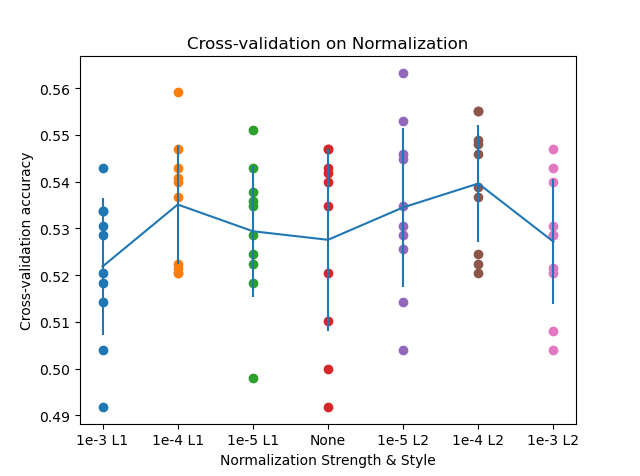
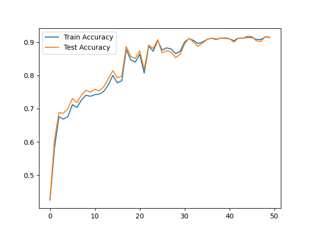
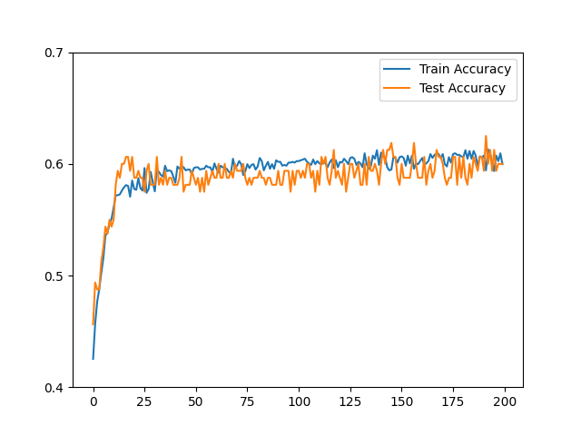
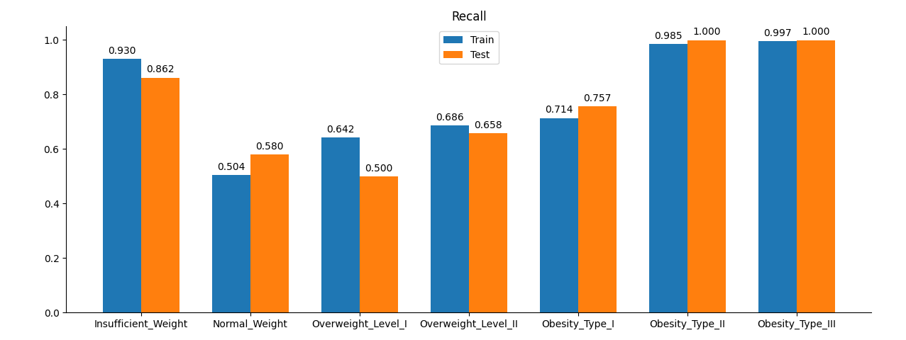
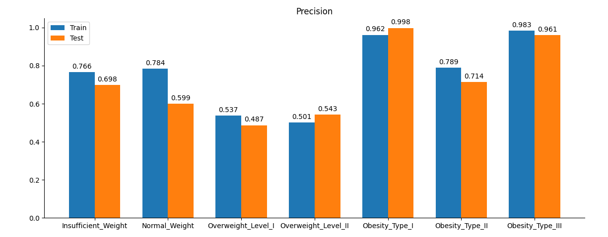

<center><h1>
    机器学习与数据挖掘第一次实验报告
    </h1></center>
<center><h2>实现并对比线性分类器与非线性分类器</h2></center>

| 课程：机器学习与数据挖掘 | 年级专业：19级软件工程 |
| ------------------------ | ---------------------- |
| 姓名：郑有为             | 学号：19335286         |

## 目录

[toc]

## 一、分类器简述

### 1.1 线性分类器

分类器将原始数据映射到类别分数的函数（Score Function）上，然后通过损失函数（Loss Function）量化预测分数和真实值标签的差异，再将此转换为一个最小化损失函数的优化问题。

我们假设每一个原始训练数据 $\mathbf{x}^{(i)} \in R_{N,D}$ 都有对应标签 $y_i \in \{1...K\}$，一个原始数据是数据集 $R$ 上的一个有 $D \times 1$ 的向量，标签用一个整数表示，$N$ 时数据样本的个数，$D$ 是一个样本的维度，$K$ 是类别的总数。

首先定义关于分数的函数 $f$，该函数将原始数据映射到每个类的置信度分数上。对于线性分类器（Linear Classifier），这个函数可以表示为：
$$
f(\mathbf{x}^{(i)}, \mathbf{W}, \mathbf{b}) = \mathbf{W}\mathbf{x}^{(i)} + \mathbf{b}
$$
其中 $\mathbf{W}$ 是一个 $K \times D$ 的权重矩阵（Weights），$\mathbf{b}$ 是一个 $K \times 1$ 的偏移向量（Bias Vector），计算结果 $\mathbf{y}$ 同样是一个 $K \times 1$的向量，$y_j$ 表示  $\mathbf{x}^{(i)}$ 对应类别 $j$ 的分数。

线性分类器的训练过程就是通过训练集出一个 $\mathbf W$ 和 $\mathbf b$，测试过程就是测试集使用 $f$ 来得到一个分类分数，再经过一些处理（例如 Softmax）来选出预测的标签。 

在实现时，做一个矩阵乘法后添加一个偏置向量相当于给所有输入向量添加一个常数为1的偏置维数，得到 $\mathbf{x'}$ ，它是一个 $(D + 1) \times  1$ 的向量，并将权矩阵扩展一个偏置列得到新矩阵 $\mathbf{W'}$，其大小为 $K \times (D + 1)$ 。因此，在实现时我们可以通过在所有向量上附加一个值为1的维度，就可以只学习一个矩阵，而不是权重矩阵和偏移向量。


### 1.2 Softmax函数和交叉熵损失

首先引入独热向量（One-hot Vector）：对一个有 $K$ 中标签的数据集，标签 $y = i$ 可以表示为一个 $K \times 1$ 的向量，其第 $i$ 个位置为 $1$，其余位置为 $0$。 

引入 Softmax 函数，它取一个任意分数的向量，将其映射成在0和1之间、总和为1的向量。
$$
softmax_j(\mathbf{z}) = \frac{e^{\mathbf{z}_j}}{\sum_ke^{\mathbf{z}_k}}
$$
得到一种概率上的表示：样本 $\mathbf{x}$ 的标签是 $i$ 的概率为：
$$
f_i(\mathbf{x}) = softmax_j(\mathbf{x'W'}) = \frac{e^{\mathbf{x'W'}_j}}{\sum_ke^{\mathbf{x'W'}_k}}
$$
我们使用交叉熵损失（Cross-Entropy Loss）来衡量样本的损失，其有以下形式，对于样本 $i$：
$$
L(\mathbf{W'}) = -\frac1n\sum_{i=1}^n\sum_{j=1}^Ky_j^{(i)}\log softmax_j(\mathbf{x}'^{(i)}\mathbf{W'})
$$
其中 $y_j^{(i)}$ 指第 $i$ 个样本的标签（独热向量）的第 $j$ 个元素。

### 1.3 随机梯度下降

为了优化 $\mathbf{W'}$，我们使用随机梯度下降（SGD），其原理为：
$$
\frac{df(x)}{dx} = \lim_{h\to 0}\frac{f(x+h)-f(x)}{h}
$$
为提高计算速度，每次选取一部分样本进行梯度计算，即在计算 $f(\mathbf{x}_i, \mathbf{W})$ 时每次只选择一部分样本而非全部样本。

梯度的更新公式为：
$$
\mathbf{W'} = \mathbf{W'} - l \times \frac{\part L(\mathbf{W'})}{\mathbf{W'}}
$$
其中 $l$ 为学习率，可以理解为每一次进行梯度下降的步长，在实际应用中，一般采用自适应的学习率算法如Ada算法或Adam算法而非使用固定学习率。

### 1.4 梯度推导

问题整理如下：
$$
\mathbf{z}^{(n)} = \mathbf{W'x}'^{(n)}\\
softmax_i^{(n)} = \frac{e^{z_i^{(n)}}}{\sum_{j = 1}^Ke^{z_j^{(n)}}} \\
L = \frac1N\sum_{k=1}^{N}L^{(n)} = -\frac1N\sum_{k=1}^{N}\sum_{i = 1}^K y_i^{(n)} \ln(softmax_i^{(n)})
$$
需要计算梯度：
$$
\frac{\part L(\mathbf{W'})}{\part \mathbf{W'}}
$$
根据链式法则：
$$
\frac{\part L(\mathbf{W'})}{\mathbf{W'}} = \frac{\part L}{\part \mathbf{softmax}} \times \frac{\part \mathbf{softmax}}{\part \mathbf{z}} \times \frac{\part\mathbf{z}}{\part\mathbf{W'}}
$$
首先计算$\frac{\part L^{(n)}}{\part softmax_i^{(n)}}$：
$$
\frac{\part L^{(n)}}{\part softmax_j^{(n)}} = \frac{\part(\sum_j y_j^{(n)} \ln softmax_j^{(n)})}{\part softmax_j^{(n)}} = -\sum_jy_j^{(n)}\frac1{softmax_j^{(n)}}
$$
其次计算$\frac{\part softmax_j^{(n)}}{\part z_i^{(n)}}$：
$$
\frac{\part softmax_j^{(n)}}{\part z_i^{(n)}} = \frac{\part(\frac{e^{z_i^{(n)}}}{\sum_ke^{z_k^{(n)}}})}{\part z_i^{(n)}} = 
\begin{cases} 
\frac{\sum_k e^{z_k^{(n)}}e^{z_i^{(n)}} - (e^{z_i^{(n)}})^2}{\sum_k(e^{z_k^{(n)}})^2} = softmax_i^{(n)}(1-softmax_i^{(n)}),   & i = j \\
-\frac{e^{z_j^{(n)}}e^{z_i^{(n)}}}{\sum_k(e^{z_k^{(n)}})^2} = -softmax_i^{(n)}softmax_j^{(n)},  & i \ne j \\
\end{cases}
$$
有$\frac{\part L^{(n)}}{\part z_i^{(n)}}$：其中 $\mathbf{y}^{(n)}$ 是独热向量，有 $\sum_i y_i^{(n)} = 1$
$$
\frac{\part L^{(n)}}{\part z_i^{(n)}} = \sum_jy_j\frac1{softmax_j^{(n)}}\frac{\part softmax_j^{(n)}}{\part z_i^{(n)}}\\
= y_i^{(n)}\frac1{softmax_i^{(n)}}softmax_i^{(n)}(1-softmax_i^{(n)}) + \sum_{j\ne i}\frac{y_j^{(n)}}{softmax_j^{(n)}}softmax_i^{(n)}softmax_j^{(n)}\\
= -y_i^{(n)} + y_i^{(n)}softmax_i^{(n)} +\sum_{i \ne j}y_j^{(n)}softmax_i^{(n)} \\
= -y_i^{(n)}+softmax_i^{(n)}\sum_jy_j = softmax_i^{(n)} - y_i^{(n)}
$$
故有：$\frac{\part L^{(n)}}{\part \mathbf{z}^{(n)}} = \mathbf{softmax}^{(n)} - \mathbf{y}^{(n)} \in  \mathbb{R}_{(1 \times K)}$，$\frac{\part L}{\part \mathbf{z}} = \mathbf{softmax} - \mathbf{y} \in \mathbb{R}_{(N \times K)}$

计算$\frac{\part\mathbf{z}}{\part\mathbf{W'}}$:
$$
\frac{\part\mathbf{z}}{\part\mathbf{W'}} = \mathbf{X^T} \in \mathbb{R}_{(K \times D)}
$$
最后计算得到：
$$
\frac{\part L(\mathbf{W'})}{\mathbf{W'}} = \frac1N\mathbf{X}^T (\mathbf{softmax} - \mathbf{y}) \in \mathbb{R}_{(N \times D)}
$$

### 1.5 基于基函数的非线性分类器

可以使用基函数将线性分类器转化为非线性分类器，非线性化后会增加权重矩阵 $\mathbf{W'}$ 的维度，例如基函数：$[\mathbf{x}] \to [\mathbf{x}， \mathbf{x}^2， \mathbf{x}^3]$，权重的大小会从线性的 $(D + 1) \times K$ 增大到 $(3D + 1) \times K$。

将线性分类器通过基函数转化成非线性分类器后，梯度和损失函数的计算没有变化，因为权重参数仍是线性的。

### 1.6 过拟合与正则化

使用正则化（Regularization）的目的是避免对模型对训练数据集过拟合而导致在测试集上的效果变差，常用的正则化方法有L1正则化和L2正则化。

* **L2**：$R(\mathbf{W}) = \sum_k\sum_l \mathbf{W'}_{k,l}^2$
* **L1**：$R(\mathbf{W}) = \sum_k\sum_l |\mathbf{W'}_{k,l}|$

增加正则化的损失函数如下，引入超参数 $\lambda$（正则化强度）
$$
L(\mathbf{W'}) = \frac1N\sum_{i = 1}^N L^{(i)}(f(\mathbf{x}^{(i)},\mathbf{W'}), \mathbf{y}^{(i)}) + \lambda R(\mathbf{W'})
$$
引入正则化后修改梯度的计算：

* **L2**：$\frac{\part L(\mathbf{W'})}{\mathbf{W'}} = \frac1N\mathbf{X}^T (\mathbf{softmax} - \mathbf{y}) + 2\lambda \mathbf{W'} \in \mathbb{R}_{(N \times D)}$

* **L1**：$\frac{\part L(\mathbf{W'})}{\mathbf{W'}} = \frac1N\mathbf{X}^T (\mathbf{softmax} - \mathbf{y}) + \lambda \frac{\mathbf{W'}}{|\mathbf{W'}|} \in \mathbb{R}_{(N \times D)}$

## 二、分类器实现

### 2.1 线性分类器

代码文件：`Code/Classifiers/softmax_classfier.py`。

* **训练函数** `train` 关键代码

  ``` python
  # 为训练集增加偏置维度
  bias_x = np.ones(X.shape[0]).reshape(-1, 1)
  X = np.concatenate((X, bias_x), axis=1)
  
  loss_history = []
  train_num, train_dim = X.shape
  class_num = np.max(y) + 1
  
  if self.W is None:
      # 初始化时为权重矩阵赋随机值
      self.W = np.random.randn(train_dim, class_num)
      self.reg_style = reg_style
      self.reg_strength = reg_strength
  
  # 设置 ite_num 个训练阶段
  for ite in range(ite_num):
      # 随机选取一批 batch_size 个样本进行计算 
      batch_mask = np.random.choice(train_num, batch_size)
      X_batch = X[batch_mask]
      y_batch = y[batch_mask]
  	
      # 计算损失函数和梯度
      loss, grad = self.loss(X_batch, y_batch)
      loss_history.append(loss)
  
      # 更新梯度
      self.W -= grad * learning_rate
  ```

* **损失计算函数** `loss` 关键代码

  ```python
  train_num, train_dim = X.shape
  
  # 按照推导公式计算损失和梯度
  s = np.matmul(X, self.W)
  s -= np.max(s, axis=1, keepdims=True)
  p = np.exp(s) / np.sum(np.exp(s), axis=1, keepdims=True)
  loss = -1 * np.sum(np.log(p[range(train_num), y])) / train_num
  p[range(train_num), y] -= 1
  dW = np.matmul(X.T, p) / train_num
  
  if self.reg_style == "L2":
      # L2 正则化
      loss += self.reg_strength * np.sum(self.W * self.W)
      dW += 2 * self.reg_strength * self.W
  elif self.reg_style == "L1":
      # L1 正则化
      loss += self.reg_strength * np.sum(np.fabs(self.W))
      dW += self.reg_strength * self.W / np.fabs(self.W)
  return loss, dW
  ```

* **预测函数** `predict` 关键代码

  ``` python
  # 为测试集增加偏置维度
  bias_x = np.ones(X.shape[0]).reshape(-1, 1)
  X = np.concatenate((X, bias_x), axis=1)
  
  # 预测类别
  y_pred = np.argmax(X.dot(self.W), axis=1)
  return y_pred
  ```

### 2.2 非线性分类器

代码文件：`Code/Classifiers/softmax_classfier.py`，非线性分类器继承线性分类器代码，代码基本一致，接受自定义基函数并在训练和预测前通过基函数预处理数据。

* 基函数预处理代码：

  ```python
  if self.kernel_function is not None:
  	X = self.kernel_function(X)
  ```

* 自定义基函数举例：$[\mathbf{x}] \to [\mathbf{x}， \mathbf{x}^2， \mathbf{x}^3]$

  ```python
  def x_3_kernel(X):
      return np.hstack((X, X ** 2, X ** 3))
  ```

## 三、数据集描述

### 3.1 Dry Bean 数据集

> Dry Bean Dataset 链接：http://archive.ics.uci.edu/ml/datasets/Dry+Bean+Dataset

该数据集有 13611 个样本组成，每个样本共有16个属性和一个标签，属性均为整数/浮点数。

数据集收集七种不同类型的干豆，考虑其形态、形状、类型、结构等特点。数据收集人员采用高分辨率相机拍摄了7种不同注册的干豆的13611粒图像。对计算机视觉系统获取的 Dry Bean 图像进行分割和特征提取，共提取16个特征，并从晶粒中得到12个尺寸和4种形状。

在将数据用于训练和测试之前，我们将样本集合的每一维进行归一化处理：
$$
\hat{x}_i^{(k)} = \frac{x_i^{(k)} - \min x_i}{\max x_i - \min x_i}
$$
同时，为了避免相同类别的数据聚集排列，我们将样本随机打散。

数据的预处理实现于`Code/data_utils.py`：`load_drybean()`，直接调用以载入数据。

### 3.2 葡萄酒数据集

> Wine Quality Dataset 链接：http://archive.ics.uci.edu/ml/datasets/Wine+Quality

该数据集分为红葡萄酒数据集和白葡萄酒数据集，共有 4898 个样本组成，每个样本共有12个属性和一个标签，属性均为整数/浮点数。

该数据集可以被视为分类或回归任务。等级是按顺序排列的，而且不平衡。例如，普通葡萄酒比优质或劣质葡萄酒要多得多，一些类别的数据是没有的。

两个数据集都被打散和归一化，预处理实现于`Code/data_utils.py`：`load_red_wine_quality()`和`load_white_wine_quality()`，直接调用以载入数据。

### 3.3 肥胖症数据集

> Estimation of obesity levels based on eating habits and physical condition Data Set 链接：https://archive.ics.uci.edu/ml/datasets/Estimation+of+obesity+levels+based+on+eating+habits+and+physical+condition+#

该数据集有 2111 个样本组成，每个样本共有16个属性和一个标签，属性类型非全为整数。

该数据集包含包括来自墨西哥、秘鲁和哥伦比亚的个人肥胖水平估计数据，这些数据基于他们的饮食习惯和身体状况。这些记录被标记为类别变量（肥胖水平），使用体重不足、正常体重、超重I级、超重II级、肥胖I型、肥胖II型和肥胖III型的值对数据进行分类。77%的数据是使用Weka工具和SMOTE过滤器综合生成的，23%的数据是通过网络平台直接从用户那里收集的。

由于样本属性包含`yes/no`、`Sometimes/Frequently/Always` 等的非数字属性，在预处理是我们基于尝试将其数字化，处理规则如下：
$$
[Female, Male] \to [1, 0] \\
[yes, no] \to [1, 0] \\
[no, Sometimes, Frequently, Always] \to [0, 1, 2, 3] \\
[Automoblic, MotorBike, Bike, PublicTransportation, Walking] \to [0,1,3,2,4]
$$
两个数据集都被打散和归一化，预处理实现于`Code/data_utils.py`：`load_obesity()`，直接调用以载入数据。

### 3.4 数据降维可视化

对上述数据集进行 t-sne 数据降维并可视化，得到的图像如下所示，不同颜色表示不同类别的样本：

| DryBean                             | RedWine                             | WhiteWine                                       | Obesity                                   |
| ----------------------------------- | ----------------------------------- | ----------------------------------------------- | ----------------------------------------- |
|  |  |  |  |

可以初步看到 DryBean 数据集的数据同类别样本聚集比较明显，不同类别的样本边界比较明显，RedWine 和 WhiteWine 数据集的样本分布的有一定的规律但数据都混在一起，Obesity 数据集的样本则比较分散。

降维可视化的代码位于`Code/test_utils.py`：`t_sne(data, label, classes)`。

## 四、实验结果分析

### 4.1 交叉验证学习率

对四个数据集进行交叉验证学习率，找到最合适的学习率。

**线性分类器**：

* 测试参数
  * 交叉验证的次数（Fold）：10
  * 迭代次数：2000
  * 每次迭代处理样本数：500
  * 正则化类型及系数：无
* 验证的学习率：$[10, 5, 2, 1.5, 1, 0.5, 0.1]$

* 实现于`Code/main.py`：`def learning_rate_cross_validition(X, y, ite_num=1000, batch_size=100, learning_rates=None, nonlinear_kernel=None)`
* 测试结果如下图所示：可以看到 DryBean 和 Obesity 数据集在学习率为 2 左右时表现最理想，分别能达到90%和75%以上；RedWine 和 WhiteWine 数据集在学习率为 1.5 时表现得最理想，分别能达到60%和50%以上。

| **DryBean**                                                  | **RedWine**                                                  |
| ------------------------------------------------------------ | ------------------------------------------------------------ |
|  |  |
| **WhiteWine**                                                | **Obesity**                                                  |
|  |  |

> 散点为每一次交叉验证结果，折线为均值，竖线为误差范围。

**非线性分类器：**$[\mathbf{x}] \to [\mathbf{x}, \mathbf{x}^2, \mathbf{x}^3]$

* 测试参数和验证的学习率与线性分类器交叉验证实验一致。

* 实现于`Code/main.py`：`def learning_rate_cross_validition(X, y, ite_num=1000, batch_size=100, learning_rates=None, nonlinear_kernel=None)`
* 测试结果如下图所示：可以看到 DryBean 和 Obesity 数据集在学习率为 1.5 左右时表现最理想，分别能达到92%和78%左右；同样，RedWine 和 WhiteWine 数据集在学习率为 1.5 时表现得最理想，分别能达到60%和55%左右。

| **DryBean**                                                  | **RedWine**                                                  |
| ------------------------------------------------------------ | ------------------------------------------------------------ |
|  |  |
| **WhiteWine**                                                | **Obesity**                                                  |
|  |  |

> 散点为每一次交叉验证结果，折线为均值，竖线为误差范围。

**非线性分类器：**$[\mathbf{x}] \to [\mathbf{x}, \mathbf{x}^2, \mathbf{x}^3, \mathbf{x}^4, \mathbf{x}^5]$

* 测试参数和验证的学习率与线性分类器交叉验证实验一致。
* 实现于`Code/test_utils.py`：`def learning_rate_cross_validition(X, y, ite_num=1000, batch_size=100, learning_rates=None, nonlinear_kernel=None)`
* 测试结果如下图所示：可以看到 DryBean 和 Obesity 数据集在学习率为 2 左右时表现最理想，分别能达到92%和78%左右，RedWine 和 WhiteWine 数据集在学习率为 1.5 时表现得最理想，分别能达到60%和55%左右。

| **DryBean**                                                  | **RedWine**                                                  |
| ------------------------------------------------------------ | ------------------------------------------------------------ |
|  |  |
| **WhiteWine**                                                | **Obesity**                                                  |
|  |  |

> 散点为每一次交叉验证结果，折线为均值，竖线为误差范围。

### 4.1 交叉验证正则化系数

我们发现，在作业的要求下（正则化系数为1），损失函数难以收敛，并且准确率严重偏低。故对四个数据集进行交叉验证正则化及其系数，找到较合适的正则化系数。

**线性分类器**：

* 测试参数
  * 交叉验证的次数（Fold）：10
  * 迭代次数：2000
  * 每次迭代处理样本数：500
  * 学习率：1.5
* 验证的正则化系数：[(1e-3)L1, (1e-4)L1, (1e-5)L1, None, (1e-5)L2, (1e-4)L2, (1e-3)L2]

* 实现于`Code/main.py`：`def normalization_cross_validition(X, y, ite_num=1000, batch_size=100, learning_rates=None, nonlinear_kernel=None)`
* 测试结果如下图所示：可以看到，对于所有数据类型，不论是使用L1正则化，还是L2正则化，当正则化系数比较小时（1e-4，1e-5），交叉验证的准确率有稍微的上升，当正则化系数比较大后，特别是对于L2，准确率会明显降低。

| DryBean                                                      | **RedWine**                                                  |
| ------------------------------------------------------------ | ------------------------------------------------------------ |
|  |  |
| **WhiteWine**                                                | **Obesity**                                                  |
|  |  |

> 散点为每一次交叉验证结果，折线为均值，竖线为误差范围。

**非线性分类器：**$[\mathbf{x}] \to [\mathbf{x}, \mathbf{x}^2, \mathbf{x}^3]$ 和 $[\mathbf{x}] \to [\mathbf{x}, \mathbf{x}^2, \mathbf{x}^3, \mathbf{x}^4, \mathbf{x}^5]$

* 测试参数和验证的学习率与线性分类器交叉验证实验一致。

* 实现于`Code/test_utils.py`：`def normalization_cross_validition(X, y, ite_num=1000, batch_size=100, learning_rates=None, nonlinear_kernel=None)`
* 测试结果如下图所示：
  * 对于三阶的非线性函数，对于所有数据类型，不论是使用L1正则化，还是L2正则化，当正则化系数比较小时（1e-4，1e-5），交叉验证的准确率有稍微的上升，当正则化系数比较大后，特别是对于L2，准确率会明显降低。
  * 对于五阶的非线性函数，对正则化系数更加敏感。

|               | $[\mathbf{x}] \to [\mathbf{x}, \mathbf{x}^2, \mathbf{x}^3]$  | $[\mathbf{x}] \to [\mathbf{x}, \mathbf{x}^2, \mathbf{x}^3, \mathbf{x}^4, \mathbf{x}^5]$ |
| ------------- | ------------------------------------------------------------ | ------------------------------------------------------------ |
| **DryBean**   |  |  |
| **RedWine**   |  |  |
| **WhiteWine** |  |  |
| **Obesity**   |  |  |

> 散点为每一次交叉验证结果，折线为均值，竖线为误差范围。

### 4.3 分类器交叉验证

验证不同分类器在相同数据集上的效果

测试参数

* 交叉验证的次数（Fold）：10
* 迭代次数：2000
* 每次迭代处理样本数：500
* 学习率：1.5
* 正则化系数：1e-4

**DryBean 数据集** 分类器交叉验证结果：

| 不使用正则化                            | L1正则化                                      | L2正则化                                      |
| --------------------------------------- | --------------------------------------------- | --------------------------------------------- |
|  |  |  |

验证结果：

* 对于DryBean数据集，五阶非线性分类器表现的最好，能达到92%，其次是三阶非线性性分类器，线性分类器表现的最差。

**Obesity 数据集** 分类器交叉验证结果：

| 不使用正则化                            | L1正则化                                      | L2正则化                                      |
| --------------------------------------- | --------------------------------------------- | --------------------------------------------- |
|  |  |  |

验证结果：

* 对于Obesity数据集，三阶非线性分类器表现的最好，其次是线性分类器，五阶非线性分类器正确率表现的最差。
* 线性模型表现得最为稳定，其次是三阶非线性分类器，最后是五阶非线性分类器。

**Wine 数据集** 分类器交叉验证结果：

| 不使用正则化                    | L1正则化                        | L2正则化                        |
| ------------------------------- | ------------------------------- | ------------------------------- |
|  |  |  |

验证结果：

* 我们发现不使用正则化和使用L1正则化时，线性分类器的分类效果最好
* 使用L2正则化时，三阶非线性分类器分类效果最好

### 4.4 权重可视化与损失函数变化

* 测试参数

  * 迭代次数：2000
  * 每次迭代处理样本数：500
  * 正则化类型及系数：L1 1e-4

  * 学习率：1.5

**DryBean 数据集**

以下是权重矩阵，横坐标表示样本的类别，纵坐标包括样本的属性和偏置，对于N阶非线性分类器，权重矩阵增加的部分为样本的属性n次方。

在权重矩阵图中，根据公式$\mathbf{y}=\mathbf{W'x'}$，越亮和越暗的各自对应着该属性对该类别的影响显著。例如线性分类器图中的(ShapeFactor1, DERMOSAN)为亮黄色，说明二者呈强烈的正相关。

|                  | <center>权重矩阵可视化</center>             |
| ---------------- | ------------------------------------------- |
| 线性分类器       |        |
| 三阶非线性分类器 |  |
| 五阶非线性分类器 |  |

以下训练过程中损失函数的变化，其中蓝线为损失函数实际变化，橙线为损失函数的移动平均数。

其中可以显著地5阶非线性分类器的收敛速度最快，线性分类器的收敛速度最慢，收敛后的损失函数都在0.4左右。

|                  | <center>损失函数可视化</center>         |
| ---------------- | --------------------------------------- |
| 线性分类器       |        |
| 三阶非线性分类器 |  |
| 五阶非线性分类器 |  |

**Obesity 数据集**

以下是权重矩阵，横坐标表示样本的类别，纵坐标包括样本的属性和偏置，对于N阶非线性分类器，权重矩阵增加的部分为样本的属性n次方。

在 Obesity 数据集可以看到一个合乎逻辑的事实，即在整个权重矩阵中，主导的属性是Weight，并且与分类呈正相关，而其他属性的的权重都不明显，不论是在线性还是非线性分类器中存在这一现象。

|                  | <center>权重矩阵可视化</center>                             |
| ---------------- | ----------------------------------------------------------- |
| 线性分类器       |                        |
| 三阶非线性分类器 |                  |
| 五阶非线性分类器 |  |

以下训练过程中损失函数的变化，其中蓝线为损失函数实际变化，橙线为损失函数的移动平均数。

从图中可以看出，随着阶数的增大，损失函数的波动更加明显，这表明高阶线性分类器往往需要更小的学习率。

|                  | <center>损失函数可视化</center>         |
| ---------------- | --------------------------------------- |
| 线性分类器       |        |
| 三阶非线性分类器 |    |
| 五阶非线性分类器 |  |

### 4.5 正确率测试

首先测试不同数据集在指定迭代次数下准确率的变化，准确率（Accuracy）定义如下：
$$
ACC = \frac1m\sum_{i=1}^{m}\delta(f(\mathbf{x}^{(i)}),y^{(i)})
$$
经过测试：

* 测试环境：
  * 数据集的 90% 作为训练集，10% 作为测试集
  * 学习率：1.5
  * 迭代次数：500 / 2000
  * 每批样本数：500
  * 正则化系数：1e-4

对于 DryBean 数据集，测试结果如下：

| DryBean      | 线型分类器                            | 三阶非线性分类器                            | 五阶非线性分类器                            |
| ------------ | ------------------------------------- | ------------------------------------------- | ------------------------------------------- |
| 不使用正则化 |  |  |  |
| L1正则化     |  |  |  |
| L2正则化     |  |  |  |

试验结果表明：

* 对非线性模型使用正则化后，训练正确率与测试正确率有类似的曲线形状，并且呈效果为测试正确率曲线是训练正确率曲线的”延迟“，这是由于正则化给权重矩阵的梯度所导致的。

* 对于DryBean模型，线性模型的正确率更容易收敛，训练正确率曲线与测试正确率曲线大体一致，没有出现严重的过拟合现象。

对于 Obesity 数据集，测试结果如下：

| Obesity      | 线型分类器                            | 三阶非线性分类器                            | 五阶非线性分类器                            |
| ------------ | ------------------------------------- | ------------------------------------------- | ------------------------------------------- |
| 不使用正则化 |  |  |  |
| L1正则化     |  |  |  |
| L2正则化     |  |  |  |

试验结果表明：

* 从正确率波动情况可以看出，在训练过程中，非线性模型比线性模型更容易出现更大的波动，高阶非线性模型比低阶非线性模型更容易出现更大的波动这一点与观察的损失函数变化率一致。
* 在 Obesity 数据集中，不论何种分类器，是否使用正则化，普遍出现测试正确率偏低于训练正确率的现象。

对于 RedWine 数据集，测试结果如下：

| RedWine      | 线型分类器                            | 三阶非线性分类器                            | 五阶非线性分类器                            |
| ------------ | ------------------------------------- | ------------------------------------------- | ------------------------------------------- |
| 不使用正则化 |  |  |  |
| L1正则化     |  |  |  |
| L2正则化     |  |  |  |

试验结果表明：

* 对于 RedWine 数据集，使用正则化能够小幅度地提升测试集预测的正确率。
* 与 Obesity 数据集相同，高阶非线性的正确率曲线往往有更剧烈的波动，但不同的是该数据集训练集的正确率波动较小，而测试集的波动较大，考虑原因之一是测试样本较小。

### 4.6 精准度和召回率测试

精准率从预测结果角度出发，描述分类器预测出来的某一分类的结果中有多少是正确的，召回率从真实结果角度出发，描述了测试集中的某一分类的样本中有多少被分类器挑选了出来。

**DryBean 数据集**：以下是 DryBean 数据集的精确率和召回率结果：

|                  | 精确率 Precision                      | 召回率 Recall                         |
| ---------------- | ------------------------------------- | ------------------------------------- |
| 线性分类器       |        |        |
| 三阶非线性分类器 |  |  |
| 五阶非线性分类器 |  |  |

实验结果：

* 类别 BOMBAY 的数据几乎都能被正确分类，除了类别 SIRA 的数据的精确率和召回率偏低，只有 85% 左右外，其余类别的精确率和召回率在测试集和训练集上都很高。

**Obesity 数据集**：以下是 Obesity 数据集的精确率和召回率结果：

|                  | 精确率 Precision                                     | 召回率 Recall                                        |
| ---------------- | ---------------------------------------------------- | ---------------------------------------------------- |
| 线性分类器       |                       |                       |
| 三阶非线性分类器 |                 |                 |
| 五阶非线性分类器 |  |  |

实验结果：

* 从 Obesity 数据集的测试结果可以看到：对于类别 Obesity_Type_II 和  Obesity_Type_III 召回率都几乎达到了100%，而类型 Normal_Weight、Overweight_Level_I 的召回率较低。
* 五阶非线性分类器对类别 Normal_Weight、Obesity_Level_I 的召回率很低。

**Wine 数据集**：以下是 RedWine 数据集的精确率和召回率结果：

|                  | 精确率 Precision                      | 召回率 Recall                                        |
| ---------------- | ------------------------------------- | ---------------------------------------------------- |
| 线性分类器       |        |                       |
| 三阶非线性分类器 |  |  |
| 五阶非线性分类器 |  |                 |

实验结果：

* 由于 RedWine 数据集的数据集中在 类别 5 6 7，而在类别 1 2 3 8 9 完全没有样本，类别 3 4 的样本非常少，导致精确率和召回率不稳定。
* 对于线性分类器，类别 3 4 的精确率和召回率都为 0 即该分类器完全无法划分出这些类别的数据，而使用非线性分类器，对识别这些样本稀缺的类别有好处。例如五阶非线性分类器，在训练集中，对类别 3 4 就有较高的精确率，即预测为 3 4类别的样本基本是正确的，但召回率还是很低，即还有大量的类别 3 4 的样本被分到了其他的类别。
* 类别 3 4 测试集的准确率和召回率为 0，很大程度是因为样本过少。

## 五、结论

实验实现了Softmax线性分类器和基于基函数的非线性分类器，对于非线性分类器，我们选择了三阶非线性和五阶非线性来进行实验，并对三个数据集 DryBean、RedWine、Obesity进行了各个方面的测试，得到以下结论：

1. 通过 t-sne 初步处理数据，我们发现在所有数据集中， DryBean 的同类别聚集和不同类别分散的程度最高，RedWine 最低。
2. 通过对学习率进行交叉验证，我们发现对于上述数据集，线性分类器学习率在1.5 ~ 2 时，验证机预测正确率最高，效果最好。
3. 通过对正则化方法和正则化系数进行交叉验证，我们发现不论是L1正则化还是L2正则化，只有在正则化系数比较小（1e-4 ~ 1e-5）时，正则化才能可能改善验证集预测正确率，并且改善的幅度比较小。除此之外，我们发现L2正则化对正则化系数更加敏感，当学习率为1e-3时，验证集正确率就有明显的下降。
4. 对比线性分类器、不含正则化的三阶非线性分类器、不含正则化的五阶非线性分类器、含L1正则化的三阶非线性分类器、含L2 正则化的三阶非线性分类器、含L1正则化的五阶非线性分类器、含L2 正则化的五阶非线性分类器：
   1. 对不同的数据集而言，最佳的模型不同：对于 DryBean 数据集，五阶非线性分类器表现最好；对于 Obesity 数据集，三阶非线性分类器表现最好；对于 RedWine 数据集，线性分类器表现最好；
   2. 使用L1的正则化效果略优于L2正则化，在正则化系数合适的情况下，使用正则化效果能够提高分类器的分类效果。
   3. 通过观察损失函数变化和预测正确率变化，我们发现高阶非线性模型收敛快，但波动大。
5. 经过测试，DryBean 数据集的训练准确率和测试准确率都在 90% 以上，使用三阶非线性模型分类器， DryBean 的分类正确率能到达92%，Obesity  数据集的训练准确率和测试准确率都在 80% 左右，RedWine 数据集的训练准确率和测试准确率都在 60% 左右。
6. 通过精确率和召回率测试，我们发现分类的效果和大程度上受数据集本身的影响，样本分类不均匀的数据集，如RedWine，分类效果就偏差。
