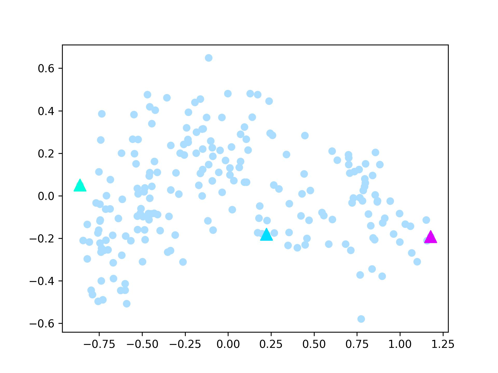
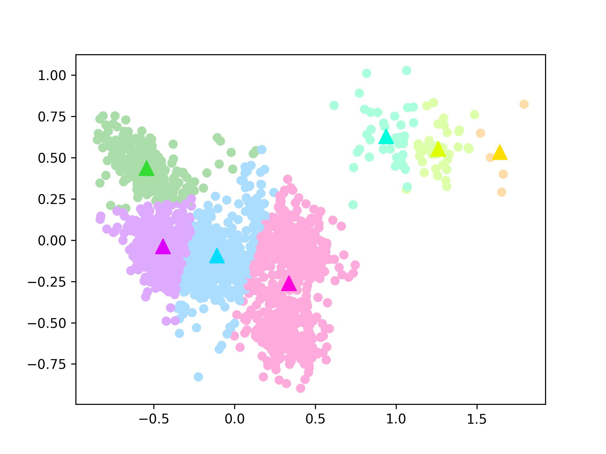
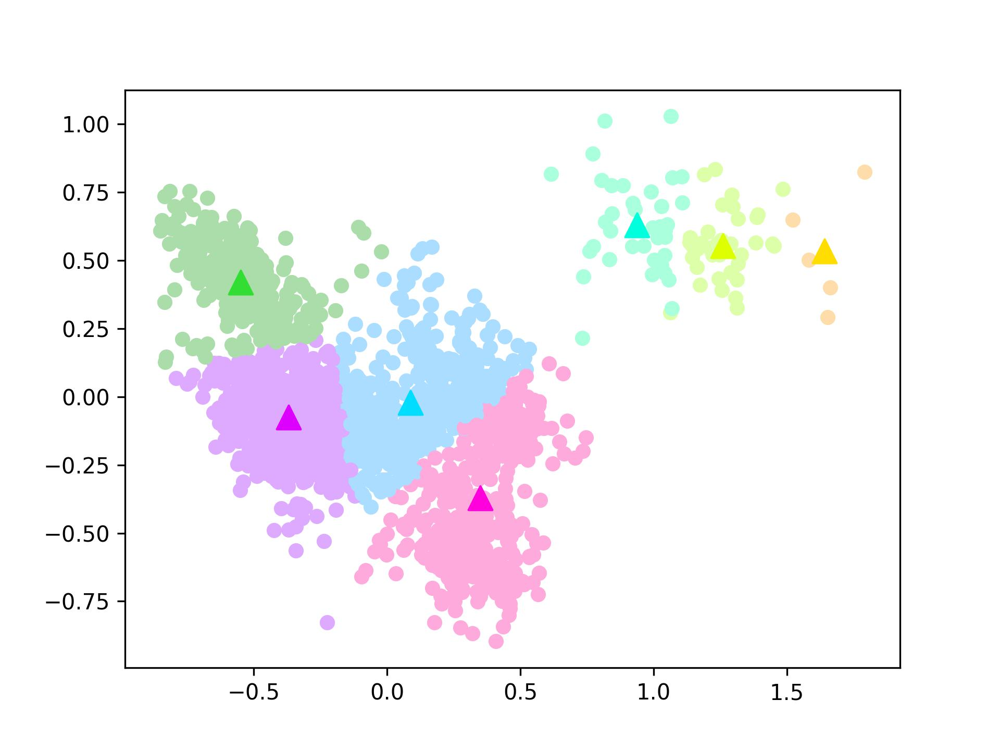

<center><h1>
    机器学习与数据挖掘第二次实验报告
    </h1></center>
<center><h2>实现并测试K-means聚类算法</h2></center>

| 课程：机器学习与数据挖掘 | 年级专业：19级软件工程 |
| ------------------------ | ---------------------- |
| 姓名：郑有为             | 学号：19335286         |

## 目录

[toc]

## 一、K-Means 简述

聚类（Clustering）是按照某个特定的标准将一个数据集划分成若干的簇，使得同一个簇内的样本相似性尽可能大，不同簇之间的样本差异性尽可能大。聚类的目的在于划分数据，不关心簇对应的实际标签，是一种常见的无监督学习方法。

​		常见的聚类算法包括划分式的聚类方法、基于密度的聚类方法和层次化的聚类方法，其中 K-Means 聚类是常见的划分式聚类方法。

​		KMeans 算法的算法效率高，聚类形状成球形，抗噪声性能较差，异常数据容易影响聚类的效果。

* **算法步骤** K-Means 算法的主要步骤如下：

  > 1. 预先选择 K 个样本作为簇的中心
  > 2. 计算每个样本到这 K 个中心的距离
  > 3. 将每个样本分配给距离最近的簇
  >    1. 如果分配结果较上次没有改变，到步骤 5
  > 4. 根据簇内的样本计算均值作为新的中心
  >    1. 回到步骤 2
  > 5. 返回聚类结果

* **初始化方法** K-Means 的初始化可以采取下列三种方法：

  1. 随机法：随机选择 K 个样本点作为初始中心

  1. 最远距离法：随机选择一个样本点，然后从剩余样本中选择距离最远的一个样本作为中心，然后计算已选中心的平均值，选取与该平均点距离最远的样本作为新的中心，直到选满 K 个中心。

  1. 随机最远距离法：结合上述两种方法，可以是每次选取最远的若干个样本点，从中随机选取一个中心；或者先选取若干个样本点，在从中选离已选中心最远的样本点。

* **距离计算** 样本点距离的计算方式有多种，在实验中我们选取了欧氏距离和曼哈顿距离：
  $$
  d_{Euclidean}(\mathbf x, \mathbf y) = \sqrt{\sum_{i = 1}^n(x_i - y_i)^2} \\
  d_{Manhattan}(\mathbf x, \mathbf y) = \sum_{i = 1}^n||x_i - y_i||
  $$

* **评价准则** 在评价聚类效果时我们选择 NMI （标准化互信息）作为主要评价指标

  设 $U$ 为真实标签向量， $V$ 为预测标签向量，其中$MI$ 表示两个向量之间的互信息，$p_{i,j}$ 表示实际标签为 $U_i$ 并被预测为 $V_j$ 的样本占总样本的比例，$H$ 表示信息熵，$p_i$ 为归属于第 $i$ 个簇的样本占总样本的比例。
  $$
  H(X) = -\sum_{i = 1}^{N} p_i \log p_i  \\
  MI(U, V) = \sum_{i = 1}^{R}\sum_j^{C} p_{i,j}\log(\frac{p_{i,j}}{p_i \times p_j}) \\
  NMI(U,V) = \frac{2MI(U,V)}{H(U)+H(V)}
  $$
  同时测试设置不同聚类个数K的情况下，目标函数 J 随着聚类个数变化的曲线。
  $$
  J = \sum_{n = 1}^N \sum_{k = 1}^K r_{nk}||\mathbf x^{(n)} - \mu_k||^2
  $$
  其中 $r_{nk}$ 当样本 $n$ 属于簇 $k$ 时为 1，否则为 0。

## 二、K-Means 实现

> 代码实现于 /code/kmeans.py

* **K-Means 算法实现**

  ``` python
  def kmeans(data, k, ite_max=100, distance=d_eculidean, centers_init=get_random_centers):
      '''
      Input:
      - data: 样本数据
      - k: 簇的数目
      - ite_max: 最大迭代次数
      - distance: 选择计算距离的函数，默认欧几里得距离
      - center_init: 选择中心初始化函数，默认随机选择
      Output:
      - centers: K个样本中心
      - data_class: 样本聚类结果 
      '''
      n, dim = data.shape
      data_class = np.zeros(n)
  
      ite = 0
      change = True
  
      centers = centers_init(data, k)
  
      while ite < ite_max and change:
          ite += 1
          change = False
          data_num = np.zeros(k)
          data_sum = np.zeros((k, dim))
  
          for i in range(n):
              i_class = -1
              i_dist = np.inf
  
              for j in range(k):
                  dist = distance(data[i], centers[j])
                  if dist < i_dist:
                      i_class = j
                      i_dist = dist
  
              if data_class[i] != i_class:
                  change = True
              data_class[i] = i_class
              data_num[i_class] += 1
              data_sum[i_class] += data[i]
  
          for i in range(k):
              if data_num[i] != 0:
                  centers[i] = data_sum[i] / data_num[i]
                  
      print("Finish! Ite: ", ite)
      return centers, data_class
  ```

* **样本间距离计算函数实现**

  ``` python
  # 1. Euclidean
  def d_eculidean(a1, a2):
      a = a1 - a2
      d = np.matmul(a, a.T)
      return np.sqrt(d)
  
  # 2. Manhattan
  def d_manhattan(a1, a2):
      a = np.abs(a1 - a2)
      d = np.sum(a)
      return d
  ```

* **初始化实现**：

  ``` python
  # 1. Random Method
  def get_random_centers(data, k):
      mask = np.random.choice(data.shape[0], k, replace=False)
      return data[mask]
  
  # 2. Distance-based Method
  def get_distance_based_centers(data, k, distance=d_eculidean):
      centers = []
      
      center = data[np.random.choice(data.shape[0])]
      centers.append(center)
  
      n, dim = data.shape
      for i in range(k - 1):
          farest = center
          farest_distance = 0
          for j in range(n):
              temp_distance = distance(center, data[j])
              if farest_distance < temp_distance:
                  farest = data[j]
                  farest_distance = temp_distance
  
          centers.append(farest)
          center = np.mean(centers, axis=0)
  
      return np.array(centers)
  
  # 3. Random + Distance Method
  #    这里选择了先随机选取在算最远距离的方式，更容易实现
  def get_randis_centers(data, k, rate=0.5, distance=d_eculidean):
      ran_num = int(rate * data.shape[0])
      data_ran = get_random_centers(data, ran_num)
      return get_distance_based_centers(data_ran, k, distance=distance)
  ```

* **NMI计算**：使用Sklearn的函数：

  ``` python
  from sklearn.metrics.cluster import normalized_mutual_info_score
  normalized_mutual_info_score(a, b)
  ```

* **目标函数 J 的计算**

  ``` python
  def get_total_distance(data, centers, data_class, distance=d_eculidean):
      n, dim = data.shape
      j = 0
      for i in range(n):
          c = int(data_class[i])
          j += distance(data[i], centers[c])
      return j / n
  ```

## 三、数据集描述

|                            数据集                            | 样本总数 | 样本维度 | 类别总数 |                           PCA降维                            |                          t-SNE降维                           |
| :----------------------------------------------------------: | :------: | :------: | :------: | :----------------------------------------------------------: | :----------------------------------------------------------: |
| [**Iris**](https://archive-beta.ics.uci.edu/ml/datasets/iris) |   150    |    4     |    3     |        |       |
| [**Seed**](https://archive-beta.ics.uci.edu/ml/datasets/seeds) |   210    |    7     |    3     |        |       |
| [**Wine**](https://archive-beta.ics.uci.edu/ml/datasets/wine) |   178    |    13    |    3     |        |       |
| [**DryBean**](https://archive-beta.ics.uci.edu/ml/datasets/dry+bean+dataset) |  42158   |    15    |    7     |  |  |
| [**Letter**](https://archive-beta.ics.uci.edu/ml/datasets/letter+recognition) |  20000   |    16    |    26    |  |  |

> 注：考虑到 DryBean 和 Letter 数据集比较大，在降维可视化时分别只选择数据集的 2000 / 4000 个样本。

* 数据预处理：数据集处理函数位于`data_utils.py`中，对数据集样本顺序进行了随机打散，并对数据样本的每一个维度进行了归一化。

## 四、实验结果分析

### 4.1 K-Means 迭代结果

> 二维可视化使用的是 PCA 降维，将样本和样本中心一同降维并显示

* 使用 Iris 数据集，观察不同初始化方法下 K-Means 簇中心和样本聚类随迭代次数的变化。

  * **随机初始化**（迭代次数：6 次，NMI：0.741）

    |  |  |  |
    | ------------------------- | ------------------------- | ------------------------- |
    |  |  |  |

  * **最远距离初始化**（迭代次数：5 次，NMI：0.741）

    |  |  |  |
    | --------------------------------- | --------------------------------- | --------------------------------- |
    |  |  |                                   |

  * **随机+初始化**（迭代次数：4 次，NMI：0.741）

    |  |  |  |
    | -------------------------------- | -------------------------------- | -------------------------------- |
    |  |                                  |                                  |

* 使用 Seed 数据集，观察不同初始化方法下 K-Means 簇中心和样本聚类随迭代次数的变化。

  * **随机初始化**（迭代次数：6 次，NMI：0.674）

    |  |  |  |
    | ------------------------- | ------------------------- | ------------------------- |
    |  |  |  |

  * **最远距离初始化**（迭代次数：7 次，NMI：0.674）

    |  |  |  |
    | ----------------------------- | ----------------------------- | ----------------------------- |
    |  |  |  |
    |  |                               |                               |

  * **随机+初始化**（迭代次数：6 次，NMI：0.665）

    |  |  |  |
    | -------------------------------- | -------------------------------- | -------------------------------- |
    |  |  |  |

* 使用 Wine 数据集，观察不同初始化方法下 K-Means 簇中心和样本聚类随迭代次数的变化。

  * **随机初始化**（迭代次数：7 次，NMI：0.81）

    |  |  |  |
    | ------------------------- | ------------------------- | ------------------------- |
    |  |  |  |
    |  |                           |                           |

  * **最远距离初始化**（迭代次数：9 次，NMI：0.83）

    |  |  |  |
    | ----------------------------- | ----------------------------- | ----------------------------- |
    |  |  |  |
    |  |  |  |

  * **随机+初始化**（迭代次数：5 次，NMI：0.86）

    |  |  |  |
    | -------------------------------- | -------------------------------- | -------------------------------- |
    |  |  |                                  |

* 使用 Drybean(500) 数据集，观察不同初始化方法下 K-Means 簇中心和样本聚类随迭代次数的变化。

  * **随机初始化**（迭代次数：19 次，NMI：0.63，迭代两次可视化一次）

    |   |   |   |   |
    | -------------------------------- | -------------------------------- | -------------------------------- | -------------------------------- |
    |   |  |  |  |
    |  |  |  |                                  |

  * **最远距离初始化**（迭代次数：10 次，NMI：0.68）

    |  |  |  |  |
    | ----------------------------------- | ----------------------------------- | ----------------------------------- | ----------------------------------- |
    |  |  |  |  |
    |  |  |                                     |                                     |

  * **随机+初始化**（迭代次数：23 次，NMI：0.68，迭代三次可视化一次）

    |   |   |   |   |
    | --------------------------------------- | --------------------------------------- | --------------------------------------- | --------------------------------------- |
    |  |  |  |  |
    |  |                                         |                                         |                                         |

* 使用 Drybean(2000) 数据集，观察不同初始化方法下 K-Means 簇中心和样本聚类随迭代次数的变化。

  * **随机初始化**（迭代次数：39 次，NMI：0.733，每四次迭代可视化一次）

    |   |   |   |  |
    | --------------------------------- | --------------------------------- | --------------------------------- | --------------------------------- |
    |  |  |  |  |
    |  |  |  |                                   |

  * **最远距离初始化**（迭代次数：33 次，NMI：0.673，每四次迭代可视化一次）

    |   |   |   |  |
    | ------------------------------------- | ------------------------------------- | ------------------------------------- | ------------------------------------- |
    |  |  |  |  |
    |  |                                       |                                       |                                       |

  * **随机+初始化**（迭代次数：33 次，NMI：0.675，每四次迭代可视化一次）

    |   |   |   |  |
    | ---------------------------------------- | ---------------------------------------- | ---------------------------------------- | ---------------------------------------- |
    |  |  |  |  |
    |  |                                          |                                          |                                          |

* 对于 Letter 数据集，由于簇的个数比较多（26个），二维可视化效果不明显，同时不同初始化方法的聚类结果类似，下面仅展示随机初始化的初始选点和聚类结果。

  | 数据集           | 迭代次数 | NMI  | 初始选点                        | 聚簇结果                         |
  | ---------------- | -------- | ---- | ------------------------------- | -------------------------------- |
  | **Letter(500)**  | 15       | 0.46 |   |   |
  | **Letter(5000)** | 37       | 0.37 |  |  |

* **实验结果分析**
  * 聚类结果：通过比较NMI，对于小的数据集，聚类收敛一般能达到一致的结果，但样本较多的数据集聚类收敛后结果不一定是一样的，最陷入局部最优解；
  * 收敛速度：对比三种初始化方法，由于随机性，迭代次数和NMI是不稳定的，但总体上，使用随机+初始化的初始化方法有较好的收敛速度；
  * 可视化：从可视化图可以看到，基随迭代变化，我们可以看到样本中心和簇不断地迁移；于距离的中心选点都会选到边缘的点，这是由于距离算法所致；
  * 时间复杂度：与K-Means迭代的时间复杂度相比，初始化的时间可忽略不计，但随机初始化的时间复杂度为$O(1)$，距离初始化的复杂度为$O(kn)$，$k,n$分别为簇的个数和样本个数，复杂度较高，我们所采用的随机+距离初始化速度快于距离初始化方法，但复杂度依然为$O(kn)$。

### 4.2 比较不同初始化方法和距离选择的效果

* 测试不同的初始化方法（随机、距离、随机距离）和不同距离计算方法（欧几里得距离，曼哈顿距离）下，数据集的 NMI （取 20 次求平均，并计算方差），记录在下表中

  | NMI 均值          | 随机初始化 欧式距离 | 距离初始化 欧氏距离 | 随机距离初始化 欧氏距离 | 随机初始化 曼哈顿距离 | 距离初始化 曼哈顿距离 | 随机距离初始化 曼哈顿距离 |
  | ----------------- | ------------------- | ------------------- | ----------------------- | --------------------- | --------------------- | ------------------------- |
  | **Iris**          | 0.704               | **0.733**           | 0.727                   | 0.677                 | 0.729                 | 0.728                     |
  | **Seed**          | **0.671**           | 0.669               | 0.669                   | 0.662                 | 0.670                 | 0.650                     |
  | **Wine**          | 0.828               | 0.826               | 0.832                   | 0.864                 | 0.864                 | **0.866**                 |
  | **Drybean(2000)** | 0.706               | 0.700               | 0.691                   | **0.736**             | 0.700                 | 0.702                     |
  | **Letter(5000)**  | **0.357**           | 0.350               | 0.336                   | 0.337                 | 0.326                 | 0.333                     |

  | NMI 方差          | 随机初始化 欧式距离 | 距离初始化 欧氏距离 | 随机距离初始化 欧氏距离 | 随机初始化 曼哈顿距离 | 距离初始化 曼哈顿距离 | 随机距离初始化 曼哈顿距离 |
  | ----------------- | ------------------- | ------------------- | ----------------------- | --------------------- | --------------------- | ------------------------- |
  | **Iris**          | 0.059               | 0.012               | 0.034                   | 0.071                 | **0.006**             | **0.006**                 |
  | **Seed**          | **0.004**           | **0.004**           | **0.004**               | 0.026                 | 0.024                 | 0.025                     |
  | **Wine**          | 0.016               | 0.022               | 0.017                   | 0.007                 | **0.005**             | 0.008                     |
  | **Drybean(2000)** | 0.013               | 0.015               | **0.000**               | 0.014                 | 0.010                 | 0.015                     |
  | **Letter(5000)**  | 0.008               | **0.003**           | 0.004                   | 0.005                 | 0.010                 | 0.006                     |

* NMI 测试结果如下所示：

  |      数据集       |         测试结果          |
  | :---------------: | :-----------------------: |
  |     **Iris**      |     |
  |     **Seed**      |     |
  |     **Wine**      |     |
  | **Drybean(2000)** |  |
  | **Letter(5000)**  |   |

* **实验结果分析**：通过观察实验实验结果，对于不同数据集，最佳的初始化方法和距离选择都是不同的
  * 对于 Iris 数据集：	
    * 使用距离初始化+欧氏距离的策略能达到最好的73.3%的平均NMI，并且几乎不出现一些效果较差（低于60%）的聚类结果。
    * 使用距离初始化和随机距离初始化的效果好于随机初始化，使用欧氏距离还是曼哈顿距离的影响并不显著。
  * 对于 Seed 数据集：
    * 使用随机初始化+欧式距离的策略能得到67.1%的平均NMI。
    * 使用何种初始化对 Seed 数据集效果不显著，但选用欧氏距离的 NMI 方差较小，聚类结果更稳定（66% 到 68%之间），使用曼哈顿距离 NMI 方差较大，NMI 分布在 60% 到 70% 之间。
  * 对于 Wine 数据集：
    * 使用随机距离初始化+曼哈顿距离的策略能够达到86.6%的平均NMI，是所有数据集里最好的。
    * 该数据集下随机初始化的效果最差，其次是距离初始化，最好的是随机距离初始化，在俩种距离下都是如此，使用哈夫曼距离的效果显著高于欧氏距离，NMI结果高出四个百分点，并且哈夫曼距离下 NMI方差小，聚类效果稳定。
  * 对于 Drybean 数据集：
    * 使用随机初始化+曼哈顿距离的策略能到达73.6%的平均NMI，优于其他五种策略约三个百分点。
    * 在该数据集下，随机初始化的效果较好，可能是由于簇个数（7个）和样本比较多的原因，使用曼哈顿距离的效果略优于欧氏距离。
  * 对于 Letter 数据集：
    * 可能是由于簇的个数比较多（26个），NMI 不如其他几个数据集，使用随机初始化+欧氏距离的策略能够达到35.7%的平均NMI。
    * 同样是由于簇个数和样本比较多的原因，使用随机初始化的效果由于距离初始化，但在该数据集中，欧氏距离效果优于曼哈顿距离。

### 4.3 不同聚类个数下目标函数 J 的曲线

* 不同聚类个数下目标函数的曲线如下表所示，可以看到不同的初始化方法和距离度量对 J 的影响并不大。

  | **Iris**          |     |
  | ----------------- | ----------------------- |
  | **Seed**          |     |
  | **Wine**          |     |
  | **Drybean(2000)** |  |
  | **Letter(5000)**  |   |

* 实验结果分析：
  * 可以看到对于以下所有数据集， J 曲线都有一个陡峭的阶段和平缓下降的阶段，它们的转折点都与数据集原本的簇接近，对于数据集 Iris、Seed、Wine都在 $k = 3$ 附近有一个曲线从陡到缓的一个转折，对于 Wine 数据集同样在 $k = 7$ 附近有一个转折。
  * J 曲线单调递减，最终都趋于收敛

## 五、结论

在本次实验中，我们实现了 K-Means 聚类算法，并测试了三种簇中心初始化方法和两种距离衡量标准，并使用 NMI 和 目标函数 J 进行评估，我们得到以下结论。

* K-Means 聚类算法，能够较快达到收敛，但在样本和簇个数较多的情况下通常得到的聚簇结果不唯一，即有多种划分，容易陷入局部最优。

* 不同的初始化方法和距离计算标准在面对不同数据集时有不同的性能，没有一个通用的最佳策略。数据集的最佳策略和平均 NMI 如下表所示：

  | 数据集  | 最佳策略                  | 平均 NMI |
  | ------- | ------------------------- | -------- |
  | Iris    | 距离初始化+欧氏距离       | 73.3%    |
  | Seed    | 随机初始化+欧式距离       | 67.1%    |
  | Wine    | 随机距离初始化+曼哈顿距离 | 86.6%    |
  | Drybean | 随机初始化+曼哈顿距离     | 73.6%    |
  | Letter  | 随机初始化+欧氏距离       | 35.7%    |

  尽管 Letter 数据集的最佳平均 NMI 只有 35.7%，但基于 Letter 数据集的簇个数多（26个），样本多（5000），数据维数又较少（16个）的原因，我们认为这样的一个结果是可以接受的。

  我们还发现，对于样本数目和簇个数较多的数据集，使用随机初始化效果更佳；对于簇个数较少的数据集，使用距离初始化和随机距离初始化效果更佳。

* 对于所有测试的数据集， J 曲线单调下降，最终收敛，并有一个陡峭阶段和一个啥平缓阶段，两个阶段的转折点与数据集标签类别个数大致对应；不同的初始化方法和距离度量对 J 的影响并不大。


