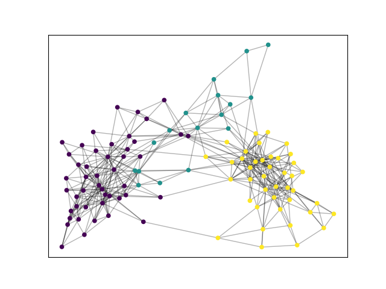
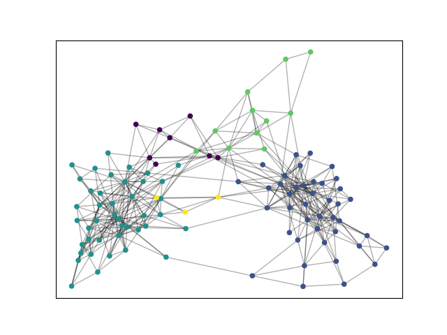
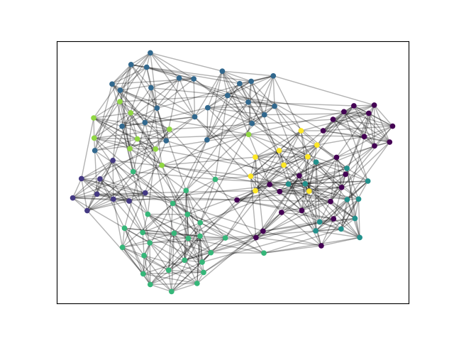
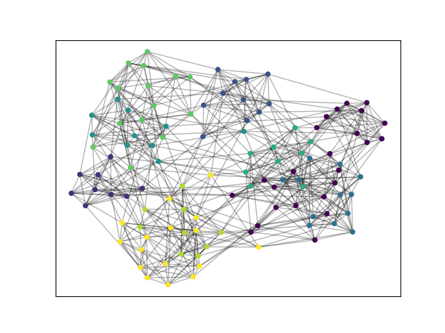

<center><h1>
    机器学习与数据挖掘第三次实验报告
    </h1></center>
<center><h2>实现并测试Modularity算法</h2></center>

| 课程：机器学习与数据挖掘 | 年级专业：19级软件工程 |
| ------------------------ | ---------------------- |
| 姓名：郑有为             | 学号：19335286         |

## 目录

[toc]

## 一、问题简述

### 1.1 社区发现问题

​		社区发现问题（Community Detection）用于解决网络中的聚类问题，从网络中发现社区。网络中的社区是一个内部节点联系紧密，社区之间联系稀疏的子网络结构，即社区满足高内聚、低耦合的特性。社区分为非重叠型社区（Disjoint Community）和重叠型社区（Overlapping Community），分别指各个社区节点集合彼此没有交集和有交集的社区结构模型。

​		通过社区发现，可以发现社交网络、合作网络等中客观存在的社区结构，从而在实现用户 / 商品 / 网页等项（Item）推荐时优先推荐同一社区的用户 / 商品 / 网页。同时，社区网络实际上是按照某种标准对用户 / 商品 / 网页等项进行了一种划分，可以在划分的基础上对每一个社区进行进一步的挖掘，相比于直接挖掘网络中的信息，社区发现相当于分解了任务。

### 1.2 模块度

​		模块度（Modularity）用于度量社区内部链接相对于社区之间链接的紧密程度、衡量一个社区划分的质量。对于不同类型的网络（有向/无向图、带权/无权图）和不同的社区模型（重叠性型/非重叠型），不同研究对模块度给出了不同的定义，并衍生出了许多社区发现算法。这些基于模块度的社区发现算法，都已最大化模块度为目标。

​		一般认为模块度大于 0.3（在 0.3 到 0.7 之间）可以说明，算法划分结果较为合适。

​		在论文 Fast unfolding of communities in large networks 中，作者所使用的模块度是一个介于 -1 和 1 之间的标量。从节点的角度，其数学公式如下：
$$
Q = \frac1{2m}\sum_{i,j}[A_{ij}-\frac{k_ik_j}{2m}]\delta(c_i,c_j)
$$
​		其中，$A_{ij}$是节点 $i$ 和 $j$ 关联的边 $(i,j)$ 的权重；$k_i = \sum_jA_{ij}$  表示与节点 $i$ 关联的所有边的权值之和；$c_i$ 是节点 $i$ 所属的社区，$\delta(u,v)$ 函数仅当 $u = v$ 时为 $1$，否则为 $0$；$m = \frac12\sum_{ij}A_{ij}$。 

​		若图为无向图，$A_{ij} = 1$；$k_i$ 可以理解为节点 $i$ 的度数，$\frac{k_ik_j}{2m}$ 指 节点 $i$ 和 $j$ 邻接的概率，$m$ 是图的边数。

​		从社区的角度，可以化简为如下公式：
$$
Q = \frac1{2m}\sum_c(\Sigma in - \frac{\Sigma tot^2}{2m})
$$
​		其中，$\Sigma in$ 表示社区 $c$ 中所有节点之间的边权之和；$\Sigma tot$ 表示与社区 $c$ 内的节点关联的边的权重之和。

​		引入模块度增益的概念：将节点 $i$ 分配到一个邻居节点所在的社区 $c$，从而给整个网络的模块度带来的变化量。结合上述的模块度定义，有：
$$
\Delta Q = \frac1{2m}(\Sigma in + k_{i,in} - \frac{\Sigma tot + k_i}{2m}) - \frac1{2m}(\Sigma in  - \frac {\Sigma tot^2}{2m} - \frac{k_i^2}{2m}) \\
= \frac{k_{i, in}}{2m} - \frac{k_i\Sigma tot}{2m^2}
$$

### 1.3 GenLouvain算法步骤

​		GenLouvain算法可以划分为以下两个阶段：

* 阶段一：社区构建阶段
  1. 将每一个节点视为一个社区。
  2. 对于每一个节点 $i$，考虑将节点 $i$ 从他所在的社区中移除，并加入到节点 $i$ 的一个邻接结点 $j$ 所在的社区中，计算此过程再来的模块度变化值，最后保存模块度增值最大的邻居节点，如果模块度增值大于零，则将节点 $i$ 从他原来的社区移动到新的社区中，否则保持不变。
  3. 循环执行第 2 步，直到所有节点所属的社区不再变化，进入阶段二。
* 阶段二：网络重建阶段
  1. 视一个社区为下一阶段的网络中的一个节点，社区内节点之间的边的权重转化为新节点的内部权重，社区之间的边的权重转为为新节点之间的边权。
  2. 将新构建的网络输入到阶段 1，如果整个图的模块度发生变化，则返回阶段二进一步重建网络，否则结束该算法。

​		GenLouvain算法是基于模块度优化的启发式算法，算法无监督、易于理解、计算速度快，算法还可以通过分布式实现来进一步提速。

​		从算法步骤可以看出，计算耗时比较多的是第一层的社区划分，之后随网络的重建，节点的数目大大减少，计算好时不断缩短。在阶段一遍历节点时，结点的顺序对最终的社区划分有一定的影响，但差距不大，但会影响算法的运行时间。 

## 二、GenLouvain 实现

​		GenLouvain 实现的基本框架参考了 https://github.com/xmweijh/CommunityDetection ，用一个 Vertex 类来表示、保存节点的节点编号、社区编号和权重等，并用一个 GenLouvain 类负责核心算法的实现。

* Vertex 类

  ``` python
  class Vertex:
      def __init__(self, vid, cid, nodes, k_in=0):
          self._vid = vid  # 节点编号
          self._cid = cid  # 社区编号
          self._nodes = nodes  # 保存节点对应的原先网络社区内的节点
          self._k_in = k_in  # 节点内部的边权重
  ```

* GenLouvain 类包含以下属性：

  * `_graph`：`collections.defaultdict(dict)` 以邻接表的形式保存网络
  * `_m`：网络的边数
  * `_vertices`：字典，键值是节点的编号`vid`，值是节点对应的 Vertex 对象
  * `_community`：字典，键值是社区的编号`cid`，值是社区节点编号`vid`组成的集合

* GenLouvain 类包含以下方法：

  * `phase_1` 执行算法的第一阶段，返回此轮社区划分有没有变化

  * `phase_2` 执行算法的第二阶段，重建网络，将本轮划分得到的社区作为下一轮的节点

  * `get_communities` 返回算法最终的社区划分结果

  * `excute` 执行算法

    ```python
    def execute(self):
    	while self.phase_1():
            	self.phase_2()
        return self.get_communities()
    ```

## 三、实验结果分析

​		为了增强实验的可比性，使用 Python 的 python-louvain 库而不是在 Matlab 上进行比较。由于难以找到规模合适并且包含真是标签的网络数据集，我们选择了 4 个含真是标签的数据集和 1 个不含标签的数据集，数据集信息如下表所示：

|      Dataset      | Graph Type | Nodes | Edges | Communities |                           Link                            |
| :---------------: | ---------- | :---: | :---: | :---------: | :-------------------------------------------------------: |
|   **polbooks**    | 无向无权   |  105  |  441  |      3      | http://www-personal.umich.edu/~mejn/netdata/polblogs.zip  |
|   **football**    | 无向无权   |  115  |  613  |     12      | http://www-personal.umich.edu/~mejn/netdata/football.zip  |
| **email-Eu-core** | 有向无权   | 1005  | 25571 |     42      |     https://snap.stanford.edu/data/email-Eu-core.html     |
|  **lastfm_asia**  | 无向无权   | 7624  | 27806 |     18      | https://snap.stanford.edu/data/feather-lastfm-social.html |
|   **facebook**    | 无向无权   | 4039  | 88234 |   unknown   |     https://snap.stanford.edu/data/ego-Facebook.html      |

​		我们将 python-louvain 的结果视为标准,测试结果如下所示：


| Dataset | My Communities | My NMI | My Modularity | My Cost Time |
| :---------------: | -------------- | :----- | :------------ | :----------- |
| **polbooks** | 3 | 0.505 | 0.499 | 0.015 s |
|   **football**    | 8 | 0.813 | 0.602 | 0.010 s |
| **email-Eu-core** | 34 | 0.627 | 0.402 | 3.379 s |
| **lastfm_asia** | 13 | 0.650 | 0.810 | 18.993 s |
| **facebook** | 13 | - | 0.828 | 18.227 s |
| **Dataset** | **Standard Communities** | **Standard NMI** | **Standard Modularity** | **Standard Time Cost** |
| **polbooks** | 5 | 0.537 | 0.526 | 0.009 s |
|   **football**    | 9 | 0.856 | 0.604 | 0.010 s |
| **email-Eu-core** | 27 | 0.576 | 0.418 | 0.372 s |
| **lastfm_asia** | 31 | 0.012 | 0.814 | 1.489 s |
| **facebook** | 16 | - | 0.834 | 2.197 s |

​		通过比较上述表格，我们发现在 polbook、football、email-Eu-core、facebook 四个数据集上，我们的实现python-louvain 的社区发现结果差别不大，在网络比较大时，我们的实现耗时明显增加。lastfm_asia 数据集比较特殊，我们的实现能得到 NMI 为 0.65 较好，但 Python-louvain 的划分结果 NMI 只有 0.01，我们猜测是由于python-louvain 划分社区过多的原因，但是我们和 python-louvain 的实现都能得到较高的模块度。

​		通过五个数据集的测试，我们的实现应用在每一个数据集上都能得到高于 0.5 的 NMI，其中 football 数据集得到了 0.81 的 NMI，同时在每个数据集上都得到了较理想的模块度，在 0.48 到 0.83 之间。

​		最后，我们将两个比较小的数据集 polbook 和 football 进行可视化，得到以下结果：

|              | My Partition              | Standard Partition            |
| ------------ | ------------------------- | ----------------------------- |
| **Polbook**  |   |   |
| **Football** |  |  |

## 四、结论

​		本次实验实现了社区发现算法 GenLouvain，并将其与 python 中现有的算法库进行对比。在进行测试的五个数据集中，我们的实现结果和 python 库的结果相近，并且算法结果同真实值比较取得了较高的 NMI 和模块度。

