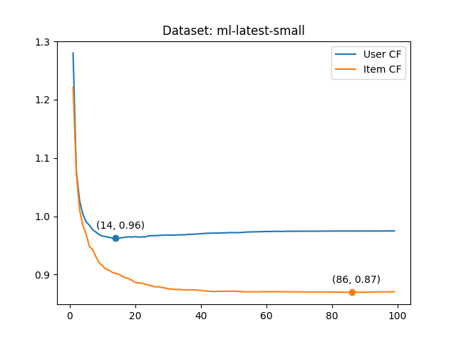
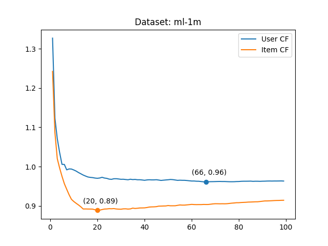

<center><h1>
    机器学习与数据挖掘第四次实验报告
    </h1></center>
<center><h2>实现并测试协同滤波算法</h2></center>

| 课程：机器学习与数据挖掘 | 年级专业：19级软件工程 |
| ------------------------ | ---------------------- |
| 姓名：郑有为             | 学号：19335286         |

## 目录

[toc]

## 一、问题简述

### 1.1 推荐系统问题

推荐系统问题旨在用户推荐相关项，项可以是用户未观看过的电影、书籍，未访问过的网站，可以是任何可以购买的产品，实现一种个性化的推荐。

推荐系统可以总结为以下模型：
$$
\text{Utility Function: } u: X \times S \to R
$$
其中，$X$ 是用户的集合，$S$ 是项的集合，$R$ 是用户对项评分的集合，并且是关于项的有序集。

推荐系统问题主要的问题为：如何为矩阵收集已知的评级，如何从已知的评级中推断未知的评级，如何评估推断的好坏。收集评分可以通过显式收集用户的评分，也可以通过学习用户的行为预测评分；推断未知评分可以使用基于内容、协同相关、基于隐因子（矩阵分解）、基于深度模型的模型甚至混合模型等；评估推断的好坏时可以选择在评分表中划分一块区域用于测试，计算平方根误差（RMSE），Top K 的精确度等。

### 1.2 协同滤波算法 

* **基于用户的协同滤波算法**

  * 第一步：读取用户-项的评分矩阵 $R$。

  * 第二步：跟据评分矩阵计算用户相似度矩阵 $S_U$，在计算相似度时我们选择皮尔森相关系数。我们可以将计算出的评分矩阵保存在文件中，以免下次重复计算。

  * 第三步：假定我们要预测用户 $u$ 给项 $i$ 的评分。首先找到于目标用户最相似的 K 个用户 $U_{sim}$，并且这些用户对项 $i$ 有评分记录，根据以下公式计算预测评分：
    $$
    r_{u,i} = \frac{\sum_{v \in U_{sim}} s_{u,v}r_{v,i}}{\sum_{v \in U_{sim}} s_{u,v}}
    $$
    其中，$r_{u,i}$ 指用户 $u$ 对项 $i$ 的预测评分，$s_{u,v}$ 指用户 $u$ 和用户 $v$ 的相似度。

* **基于项的协同滤波算法**

  * 第一步：读取用户-项的评分矩阵 $R$。

  * 第二步：跟据评分矩阵计算用户相似度矩阵 $S_I$，在计算相似度时我们选择皮尔森相关系数。我们可以将计算出的评分矩阵保存在文件中，以免下次重复计算。

  * 第三步：假定我们要预测用户 $u$ 给项 $i$ 的评分。首先找到于目标项最相似的 K 个项 $I_{sim}$，并且用户 $u$ 对这些项有评分记录，根据以下公式计算预测评分：
    $$
    r_{u,i} = \frac{\sum_{j \in I_{sim}} s_{i,j}r_{v,i}}{\sum_{j \in I_{sim}} s_{i,j}}
    $$
    其中，$r_{u,i}$ 指用户 $u$ 对项 $i$ 的预测评分，$s_{i,j}$ 指项 $i$ 和项 $j$ 的相似度。

* **协同滤波算法的评价**

  * 适用场景：
    * 基于用户的协同滤波算法：具备更强的社交特性，适用于用户少物品多，时效性较强的场景。比如新闻、博客、微内容推荐场景。此外基于用户的协同滤波算法能够为用户发现新的兴趣爱好。
    * 基于项的协同滤波算法：更适用于兴趣变化较为稳定的应用，更接近于个性化的推荐，适合物品少用户多，用户兴趣固定持久，物品更新速度不是太快的场合，比如电影推荐。

  * 协同滤波算法的优点：适用于任何类型的项，不需要特征选择
  * 协同滤波算法的缺点：
    * 冷启动问题：对于基于用户的协同滤波算法，需要积累足够多的用户，并且用户有一定评分时才能找到一个用户的相似用户，而基于项的协同滤波算法没有此问题。
    * 稀疏性问题：项的数目一般很多，一个用户对项的评分往往不会很多，评分矩阵是稀疏的，难以找到对相同的项评分过的用户。
    * 新的项、评分较少的项因为评分较少，难以被推荐。

## 二、协同滤波实现

我们基于 Pandas 实现协同滤波算法，使用 DataFrame 记录中间结果（评分矩阵和相似度矩阵），并保存到文件中以便于下一次快速读取，工具函数`save_matrix_to_pickle(matrix, dir_path, file_name)`和`load_matrix_from_pickle(file_path)`方法分别用于保存和读取 DataFrame。

* **载入评分表**：因为评分表文件以邻接表的形式存储评分信息，为了方便后续的相似度计算，我们在读入文件后将其转化为矩阵形式（行为用户，列为项）。实现于`load_data_to_matrix(file_path, step=",")`函数：

  ```python
  data = pd.read_csv(file_path, dtype={"userId": np.int32, "movieId": np.int32, "rating": np.float32}, usecols=range(3), sep=step)
  rating_matrix = data.pivot_table(index=["userId"], columns="movieId", values="rating")
  ```

* **计算相似度**：直接使用 Pandas 提供的 corr 函数计算矩阵皮尔森相关系数，计算返回$N \times N$的方阵，$N$是矩阵的列数。因为我们评分矩阵的行是用户，列是项，故计算项相似度是直接对评分矩阵调用`.corr`，计算用户的相似度时先对评分矩阵进行转置再调用`.corr`。实现于函数`compute_similarity(rating_matrix, based_type="user")`

  ```python
  if based_type == "user":
      similarity_matrix = rating_matrix.T.corr(method="pearson")
  elif based_type == "item":
      similarity_matrix = rating_matrix.corr(method="pearson")
  ```

* **预测用户 i 对项 j 的评分**：实现于`predict_item_score_for_user(user_id, item_id, rating_matrix, similarity_matrix, based_type="user", k=-1)`。

  ```python
  """
  * PREDICT_ITEM_SCORE_FOR_USER 预测用户 i 对电影 j 的评分
  * input:
      * user_id: Integer 用户 ID
      * item_id: Integer 电影 ID
      * rating_movie: DataFrame 评分矩阵
      * similarity_matrix: DataFrame 相似性矩阵
      * based_type: "user" or "item" 相似性矩阵的类型（用户/项）
      * k: Integer 计算预测分数的近邻个数，默认-1，表示计算所有相似度大于0的相似项
  * return:
      * r: Integer 用户对该电影评分的预测值
  """
  ```

  * 对于User-based CF，我们首先挑选出和用户 i 相似度大于 0 的用户，再挑选出对项 j 评分过的用户，二者取交集，再跟据相似度进行排序，选择前 K 个计算预测评分。

    ```python
    # 挑选出和用户 i 相似度大于 0 的用户
    similar_users = similarity_matrix[user_id].drop(user_id).dropna()
    similar_users = similar_users.where(similar_users > 0).dropna()
    
    # 挑选出对项 j 评分过的用户
    have_item_users = rating_matrix[item_id].dropna()
    
    # 二者取交集，再跟据相似度进行排序
    have_item_similar_users = similar_users.loc[list(set(similar_users.index) & set(have_item_users.index))]
    have_item_similar_users.sort_values(ascending=False, inplace=True)
    
    # 计算预测分数
    a = 0
    b = 0
    for similar_user, similarity in have_item_similar_users.iteritems()[:k]:
        a += similarity * rating_matrix.loc[similar_user, item_id]
        b += similarity
    r = a / b
    ```

  * 对于Item-based CF，我们首先挑选出和项 j 相似度大于 0 的项，再挑选出用户 i 评分过的项，二者取交集，再跟据相似度进行排序，选择前 K 个计算预测评分。

    ``` python
    # 选出和项 j 相似度大于 0 的项
    similar_items = similarity_matrix[item_id].drop(item_id).dropna()
    similar_items = similar_items.where(similar_items > 0).dropna()
    
    # 挑选出用户 i 评分过的项
    user_rated_items = rating_matrix.loc[user_id].dropna()
    
    # 二者取交集，再跟据相似度进行排序
    user_rated_similar_items = similar_items.loc[list(set(similar_items.index) & set(user_rated_items.index))]
    user_rated_similar_items.sort_values(ascending=False, inplace=True)
    
    # 计算预测分数
    a = 0
    b = 0
    for similar_item, similarity in user_rated_similar_items.iteritems()[:k]:
        a += similarity * rating_matrix.loc[user_id, similar_item]
        b += similarity
    r = a / b
    ```

* 最后用一个 CF 类来实现整个协同滤波算法并封装验证过程

  ``` python
  """
  * CF 类: 
  * attributes:
      * _based_type: "user" or "item" 协同滤波算法的类型
      * _matrix_path: String 储存各类临时文件的文件夹路径
      * _val: Boolean 是否为验证模式，验证模式下空出一块预取的评分来进行验证测试
      * _rating_matrix: DataFrame 评分矩阵
      * _similarity_matrix: DataFrame 相似度矩阵
      * _mask_ground_truth: [] 储存空出一块用于预取评分的真实值
  * methods:
      * __INIT__: 初始化评分矩阵和相似度矩阵
      * TOP_N_RECOMMEND: 为一个用户推荐 N 个项
      * SCORE_PREDICT_VAL: 验证测试，返回结果四元组(User ID, Item ID, Truth Score, Predict Score) 和 RMSE
  """
  ```

  * 初始化：于`__init__(self, based_type, data_name, data_file_path, step=",", val=True, val_mask=((0, 100), (0, 200)))`，载入/计算评分矩阵和相似度矩阵

    ```python
    """
    * __INIT__ 初始化评分矩阵和相似度矩阵
    * input:
        * based_type: "user" or "item" 协同滤波算法的类型
        * data_name: String 数据集名称标识
        * data_file_path: String 评分数据文件路径
        * step: String 评分数据文件的分隔符
        * val: Boolean 是否为验证模式，验证模式下空出一块预取的评分来进行验证测试
        * val_mask: ((a, b), (c, d)) 验证模式下评分矩阵空出一块的范围：a:b行，c:d列
    """
    # 载入评分矩阵
    file_name = data_name + "-rating"
    save_file_path = self._matrix_path + file_name + ".pkl"
    if os.path.exists(save_file_path):
        self._rating_matrix = load_matrix_from_pickle(save_file_path)
    else:
        self._rating_matrix = load_data_to_matrix(data_file_path, step)
        save_matrix_to_pickle(self._rating_matrix, self._matrix_path, file_name)
        
    # 为评分矩阵增加一个遮罩以进行验证测试
    if val:
        (u_l, u_r), (i_l, i_r) = val_mask
        self._mask_ground_truth = self._rating_matrix.iloc[u_l:u_r, i_l:i_r].copy()
        self._rating_matrix.iloc[u_l:u_r, i_l:i_r] = np.nan
        
    # 载入/计算相似度矩阵
    file_name = data_name + f"-{self._based_type}-similarity"
    if val:
        file_name += "-val"
    save_file_path = self._matrix_path + file_name + ".pkl"
    if os.path.exists(save_file_path):
        self._similarity_matrix = load_matrix_from_pickle(save_file_path)
    else:
        self._similarity_matrix = compute_similarity(self._rating_matrix, based_type=self._based_type)
        save_matrix_to_pickle(self._similarity_matrix, self._matrix_path, file_name)
    ```

  * 为一个用户推荐 N 个预测评分最高的项：`top_n_recommend(self, user_id, n, k=-1)`

    ```python
    """
    * TOP_N_RECOMMEND 为一个用户推荐 N 个预测评分最高的项
    * input:
        * user_id: Integer 用户 ID
        * n: Integer 返回的推荐项的个数
        * k: Integer 预测分数时考虑的相似用户个数
    * return:
        * predict_result: [] 每一个元素是由 Item ID 和 预测评分组成的元组
    """
    pr = predict_all_items_score_for_user(user_id, self._rating_matrix, self._similarity_matrix, cold=10, based_type=self._based_type, k=k)
    predict_result = sorted(pr.items(), key=lambda x: -x[1])[:n]
    ```

  * 验证测试：`score_predict_val(self, k)`

    ``` python
    """
    * SCORE_PREDICT_VAL 验证测试
    * input:
        * k: Integer 预测分数时考虑的相似用户个数
    * return:
        * res: [] of (User ID, Item ID, Truth Score, Predict Score)
        * rmse: Float RMSE 度量结果
    """
    res = []
    rmse = 0
    count = 0
    # 遍历评分遮罩，对每一对有真实评分的（用户-项）进行评分，与真实值对比计算 RMSE
    for i in self._mask_ground_truth.index:
        for j in self._mask_ground_truth.columns:
            if self._mask_ground_truth.loc[i, j] > 0:
                truth_score = self._mask_ground_truth.loc[i, j]
                predict_score = predict_item_score_for_user(i, j, self._rating_matrix, self._similarity_matrix, based_type=self._based_type, k=k)
                if predict_score is not None:
                    rmse += (truth_score - predict_score) ** 2
                    count += 1
                    res.append((i, j, truth_score, predict_score))
    rmse = (rmse / count) ** 0.5
    ```

## 三、实验结果分析

* **数据集描述**：验证测试采用了以下两个数据集

  | 数据集                                                       | 大小 | 用户数目 | 电影数目 | 评分数目 |
  | ------------------------------------------------------------ | ---- | -------- | -------- | -------- |
  | **[ml-latest-small](https://files.grouplens.org/datasets/movielens/ml-latest-small.zip)** | 1MB  | 600      | 9000     | 100000   |
  | **[ml-1m](https://files.grouplens.org/datasets/movielens/ml-1m.zip)** | 6MB  | 6000     | 4000     | 1000000  |

​		在测试时，我们选择前 100 个用户，200 个电影的区域作为验证区域。

* **测试结果**：测试结果如下所示

  * **对于 ml-latest-small 数据集，可以得到以下结论**
    * User-based CF 在 K = 14 时，RMSE 最低（0.96），Item-based CF 在 K = 86 时，RMSE 最低（0.87）；
    * 在 K < 10 时，User-based CF 和 Item-based CF 的 RMSE 随着 K 的增大急剧下降；
    * User-based CF 的 RMSE 在 K = 20 后趋于稳定，有小幅度的上升趋势，Item-based CF 的 RMSE 在 K = 40 后趋于稳定；
    * Item-based CF 的效果要始终好于 User-based CF。

  

  * **对于 ml-1m 数据集，可以得到以下结论**
    * User-based CF 在 K = 66 时，RMSE 最低（0.96），Item-based CF 在 K = 20 时，RMSE 最低（0.89），可以看到两个数据集的 RMSE 最佳 RMSE 比较一致。
    * 在 K < 10 时，User-based CF 和 Item-based CF 的 RMSE 随着 K 的增大急剧下降；
    * User-based CF 的 RMSE 在 K = 20 后趋于稳定，Item-based CF 的 RMSE 在 K = 20 后有上升的趋势，但幅度不大；
    * Item-based CF 的效果要始终好于 User-based CF。



## 四、结论

本次实验实现了基于用户和基于项的协同滤波算法，并在 Movielens 两个较小的数据集上进行了测试，测试采用 RMSE 进行评估，得到以下结果：

| **数据集**                                                   | **User-based CF**       | **Item-based CF**       |
| ------------------------------------------------------------ | ----------------------- | ----------------------- |
| **[ml-latest-small](https://files.grouplens.org/datasets/movielens/ml-latest-small.zip)** | **K = 14, RMSE= 0.96**  | **K = 66, RMSE = 0.96** |
| **[ml-1m](https://files.grouplens.org/datasets/movielens/ml-1m.zip)** | **K = 86, RMSE = 0.87** | **K = 20, RMSE = 0.89** |

通过观察测试结果，我们得到以下结论：

* 在测试的电影评分数据集中，Item-based CF 的效果要优于 User-based CF，这与“基于项的协同滤波算法更适用于兴趣变化较为稳定的应用，用户兴趣固定持久，物品更新速度不是太快的场合，比如电影推荐”的特点是一致的。
* 观察 RMSE 随 K 的变化，我们发现 RMSE 的变化规律都是在 K 较小的阶段随 K 的增大显著降低，然后最后趋于平稳或有随K增大有小幅度增长。
